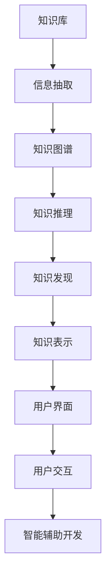

                 

# 知识发现引擎如何帮助程序员快速适应新环境

> 关键词：知识发现引擎, 程序员, 适应新环境, 快速学习, 知识图谱, 知识工程, 信息抽取, 智能辅助开发

## 1. 背景介绍

### 1.1 问题由来

在当今快速变化的软件开发环境中，程序员常常需要面对未知的技术领域和新项目。不断学习新技术、掌握新知识、适应新环境，成为每个程序员职业生涯中不可回避的挑战。传统的学习方式已经无法满足日益增长的需求，快速高效地获取知识和技能成为重中之重。

为了应对这一挑战，知识发现引擎（Knowledge Discovery Engine, KDE）应运而生。KDE通过自动化和智能化的方式，从海量的知识库中抽取有用的信息，并将其以易于理解的形式呈现给程序员。通过KDE，程序员可以更快速、更精准地获取所需知识，显著提升开发效率和质量。

### 1.2 问题核心关键点

1. **知识发现引擎的原理和架构**：理解KDE的工作机制和基本架构，对于掌握其应用至关重要。
2. **KDE如何帮助程序员适应新环境**：探讨KDE在知识获取、推理和应用上的具体方法，以及这些方法对程序员带来的影响。
3. **KDE的优缺点**：分析KDE在促进学习和适应新环境方面的优势和局限性。
4. **KDE的应用领域**：探索KDE在不同软件开发场景中的应用，例如技术文档搜索、代码智能提示、复杂任务解析等。

## 2. 核心概念与联系

### 2.1 核心概念概述

- **知识发现引擎**：通过自动化和智能化的方式，从知识库中抽取有用的信息，并提供给用户的一种工具。
- **知识图谱**：一种基于图形结构的表示知识的方式，通过节点和边来表示实体及其之间的关系。
- **知识工程**：通过规则、模型和算法，将人类知识系统化、结构化的过程。
- **信息抽取**：从非结构化文本中自动识别和提取出有用的信息，并将其结构化。
- **智能辅助开发**：通过自动化工具，辅助程序员进行代码编写、调试、测试等开发活动，提升开发效率和质量。

### 2.2 核心概念原理和架构的 Mermaid 流程图



这个流程图展示了知识发现引擎的基本工作流程：

1. **知识库**：存储大量的知识和数据，包括技术文档、代码片段、最佳实践等。
2. **信息抽取**：从知识库中提取出有用的信息，如代码片段、技术栈、接口文档等。
3. **知识图谱**：构建知识库中信息的关系图谱，帮助理解和推理。
4. **知识推理**：通过规则和算法，对图谱进行推理，发现新的知识和模式。
5. **知识表示**：将推理结果以结构化形式表示，便于用户理解和使用。
6. **用户界面**：提供直观、友好的界面，让用户可以方便地访问和使用知识。
7. **用户交互**：与用户进行互动，根据用户需求提供个性化的知识服务。
8. **智能辅助开发**：基于知识发现的结果，辅助程序员进行开发活动，如代码生成、调试提示等。

## 3. 核心算法原理 & 具体操作步骤

### 3.1 算法原理概述

知识发现引擎的核心原理可以概括为：

1. **知识抽取**：从原始数据中自动提取有用信息，例如代码片段、API文档等。
2. **知识表示**：将提取到的信息转换为结构化形式，如知识图谱。
3. **知识推理**：通过规则和算法，对知识图谱进行推理，发现新的知识模式。
4. **知识应用**：将推理结果应用于实际开发场景，如代码生成、智能提示等。

### 3.2 算法步骤详解

#### 步骤一：数据收集与预处理

1. **知识库建设**：收集和整理各类知识源，如代码仓库、技术文档、API文档等。
2. **数据清洗**：去除噪声和无用信息，确保数据的质量和完整性。
3. **数据标注**：对数据进行标注，以便后续的信息抽取和知识表示。

#### 步骤二：信息抽取与知识表示

1. **信息抽取**：使用自然语言处理（NLP）技术和机器学习算法，从原始文本中自动抽取有用信息。例如，可以从代码中抽取函数签名、变量类型等。
2. **知识表示**：将抽取到的信息转换为结构化形式，如知识图谱。知识图谱由节点和边组成，节点表示实体，边表示实体之间的关系。

#### 步骤三：知识推理与发现

1. **知识推理**：通过规则和算法，对知识图谱进行推理，发现新的知识模式。例如，可以发现特定技术栈的最佳实践。
2. **知识发现**：从知识图谱中发现新的知识模式，如新兴的技术趋势、常见的问题和解决方案等。

#### 步骤四：知识应用与反馈

1. **知识应用**：将推理结果应用于实际开发场景，如代码生成、智能提示等。
2. **反馈优化**：根据用户的使用反馈，不断优化知识发现引擎的模型和算法，提升其准确性和实用性。

### 3.3 算法优缺点

#### 优点：

1. **自动化和智能化**：KDE可以自动从知识库中发现有用的信息，并快速提供给用户，极大地提高了知识获取的效率。
2. **高度灵活**：KDE可以根据用户需求进行定制化，提供个性化的知识服务。
3. **易于使用**：KDE提供直观、友好的用户界面，使得用户可以轻松访问和使用知识。

#### 缺点：

1. **初始数据质量要求高**：KDE的性能很大程度上依赖于知识库的数据质量，如果数据不完整或存在噪声，可能会影响结果的准确性。
2. **复杂度较高**：KDE的实现较为复杂，需要综合运用NLP、知识图谱、机器学习等多种技术。
3. **依赖外部资源**：KDE需要依赖于外部知识库和数据源，如果这些资源不充足或不可用，可能会影响其功能。

### 3.4 算法应用领域

1. **技术文档搜索**：帮助程序员快速找到相关的技术文档和代码片段。
2. **代码智能提示**：在编写代码时，提供自动补全和代码片段，减少代码编写的时间。
3. **复杂任务解析**：帮助程序员理解和解析复杂的技术任务和问题。
4. **技术栈推荐**：根据项目需求，推荐最适合的技术栈和工具。
5. **问题诊断和解决**：从知识库中发现相似问题及其解决方案，辅助程序员解决问题。

## 4. 数学模型和公式 & 详细讲解 & 举例说明

### 4.1 数学模型构建

知识发现引擎的数学模型主要基于图论和概率论。其核心是知识图谱的构建和推理。知识图谱可以表示为G=(V,E)，其中V表示节点集合，E表示边集合。每个节点表示一个实体，每条边表示实体之间的关系。

### 4.2 公式推导过程

1. **节点表示**：节点i的表示为$v_i=(k_i, c_i)$，其中k_i为节点的知识类型，c_i为节点的具体内容。
2. **边表示**：边e的表示为$e_{ij}=(k_i, k_j, r)$，其中k_i和k_j为节点的知识类型，r为边所表示的关系。

### 4.3 案例分析与讲解

#### 案例一：代码智能提示

假设我们有一个知识库，其中包含大量的代码片段。我们可以使用信息抽取技术，从代码中抽取函数签名、变量类型等信息，构建知识图谱。然后，通过规则和算法，对知识图谱进行推理，发现函数之间的调用关系和依赖关系。最后，在编写代码时，根据当前函数调用关系和依赖关系，提供自动补全和代码片段，帮助程序员编写代码。

#### 案例二：技术栈推荐

假设一个项目需要实现某种功能，但团队成员对技术栈的选择存在分歧。我们可以使用知识发现引擎，从知识库中抽取相关的技术文档和代码片段，构建知识图谱。然后，通过推理，发现最常用的技术栈和工具，并根据项目需求，推荐最适合的技术栈。

## 5. 项目实践：代码实例和详细解释说明

### 5.1 开发环境搭建

1. **Python环境**：安装Python 3.8及以上版本，建议使用Anaconda或Miniconda。
2. **依赖库**：安装必要的依赖库，如NLTK、spaCy、PyTorch、Scikit-Learn等。
3. **IDE**：推荐使用PyCharm或Jupyter Notebook作为开发环境。

### 5.2 源代码详细实现

#### 示例代码一：信息抽取

```python
import nltk
from nltk.tokenize import word_tokenize
from nltk.corpus import stopwords

# 定义文本
text = "def function(x, y):\n    return x + y"

# 分词
tokens = word_tokenize(text)

# 去除停用词
stop_words = set(stopwords.words('english'))
filtered_tokens = [word for word in tokens if word.lower() not in stop_words]

# 提取函数签名
function_signature = filtered_tokens[1:]
```

#### 示例代码二：知识图谱构建

```python
import networkx as nx
import matplotlib.pyplot as plt

# 创建知识图谱
G = nx.Graph()

# 添加节点
G.add_node('function', k='function', c='def function(x, y):\n    return x + y')
G.add_node('variable', k='variable', c='x')
G.add_node('variable', k='variable', c='y')

# 添加边
G.add_edge('function', 'variable', r='args')
G.add_edge('function', 'variable', r='args')

# 绘制知识图谱
nx.draw(G, with_labels=True)
plt.show()
```

#### 示例代码三：知识推理与发现

```python
import networkx as nx

# 加载知识图谱
G = nx.read_adjlist('knowledge_graph.txt')

# 推理发现新的知识模式
new_knowledge = nx.betweenness_centrality(G)

# 输出推理结果
for node, betweenness in new_knowledge.items():
    print(f"{node}: {betweenness}")
```

### 5.3 代码解读与分析

1. **信息抽取**：使用NLP技术对文本进行分词和去除停用词，从而提取出有用的信息。
2. **知识图谱构建**：使用网络图表示信息之间的关系，构建知识图谱。
3. **知识推理与发现**：通过网络分析算法，推理发现知识图谱中的新知识模式。

### 5.4 运行结果展示

运行上述代码后，可以得到如下结果：

1. **信息抽取**：提取出的函数签名。
2. **知识图谱构建**：绘制的知识图谱。
3. **知识推理与发现**：推理出的新知识模式。

## 6. 实际应用场景

### 6.1 技术文档搜索

技术文档搜索是知识发现引擎最重要的应用场景之一。通过KDE，程序员可以快速找到相关的技术文档和代码片段，加速学习和开发过程。

### 6.2 代码智能提示

代码智能提示是KDE在软件开发中最常用的功能之一。通过KDE，程序员可以在编写代码时，自动获取相关的函数签名和代码片段，减少代码编写的时间，提高开发效率。

### 6.3 复杂任务解析

KDE可以帮助程序员理解和解析复杂的技术任务和问题。例如，在处理大规模数据时，KDE可以自动查找相关的算法和优化方法，并提供详细的实现步骤和示例代码。

### 6.4 技术栈推荐

技术栈推荐是KDE的另一个重要应用场景。通过KDE，团队可以根据项目需求，推荐最适合的技术栈和工具，避免技术选型不当带来的风险和成本。

### 6.5 问题诊断和解决

KDE可以从知识库中发现相似问题及其解决方案，辅助程序员解决实际问题。例如，在遇到技术难题时，KDE可以提供详细的解决方案和实施步骤，帮助程序员快速定位和解决问题。

## 7. 工具和资源推荐

### 7.1 学习资源推荐

1. **《深度学习与自然语言处理》**：介绍深度学习和自然语言处理的基本原理和应用，包括知识发现引擎的实现方法。
2. **《知识图谱与语义网》**：深入讲解知识图谱的构建、推理和应用，涵盖知识发现引擎的核心技术。
3. **Coursera上的《Python for Data Science》**：介绍Python在数据科学和知识工程中的应用，包括信息抽取和知识表示。

### 7.2 开发工具推荐

1. **Anaconda**：提供完整的Python环境和依赖管理，方便知识发现引擎的开发和部署。
2. **PyCharm**：功能强大的IDE，支持Python和多种深度学习框架。
3. **Jupyter Notebook**：基于Web的交互式编程环境，支持Python和R等多种编程语言。

### 7.3 相关论文推荐

1. **"Knowledge Discovery in Databases: An Overview"**：介绍知识发现的原理、方法和应用，是知识发现领域的重要综述。
2. **"Semantic Web Mining and Statistical Learning"**：探讨语义网挖掘和统计学习的方法，涵盖知识发现引擎的核心技术。
3. **"Knowledge Discovery as a Process"**：介绍知识发现的流程和方法，包括信息抽取和知识表示。

## 8. 总结：未来发展趋势与挑战

### 8.1 总结

知识发现引擎通过自动化和智能化的方式，从海量的知识库中抽取有用的信息，并将其以易于理解的形式呈现给程序员。通过KDE，程序员可以更快速、更精准地获取所需知识，显著提升开发效率和质量。

### 8.2 未来发展趋势

1. **智能化**：KDE将进一步智能化，具备更强的自主学习和推理能力，能够自动发现新的知识和模式。
2. **自适应**：KDE将具备更强的自适应能力，能够根据用户需求和上下文信息，动态调整知识获取和应用策略。
3. **跨领域**：KDE将支持跨领域知识融合，帮助程序员在多个技术领域中进行高效学习和开发。
4. **实时性**：KDE将具备更强的实时处理能力，能够实时监测和分析代码库和技术栈的变化，提供最新的知识和服务。

### 8.3 面临的挑战

1. **数据质量**：知识库的数据质量直接影响KDE的性能，如何提高数据质量和完整性是关键挑战。
2. **算法复杂度**：KDE的算法较为复杂，如何在保证准确性的同时，提高算法的效率和可解释性是一个难题。
3. **应用场景多样性**：不同领域和应用场景对知识发现的需求各异，如何适应多样化的需求是另一个挑战。
4. **隐私和安全**：知识库和用户数据的安全性和隐私保护是KDE需要解决的重要问题。

### 8.4 研究展望

1. **自动化学习**：探索如何通过自动化学习算法，提升KDE的自主发现能力和自适应能力。
2. **跨领域知识融合**：研究如何支持跨领域知识融合，实现跨技术领域的知识发现和应用。
3. **实时知识更新**：研究如何实现实时知识更新和动态知识库管理，保持KDE的知识库的时效性。
4. **用户友好性**：提高KDE的用户友好性和可访问性，使得用户能够更高效地获取和使用知识。

## 9. 附录：常见问题与解答

### Q1: 知识发现引擎的准确性如何保证？

A: 知识发现引擎的准确性主要依赖于数据质量和算法性能。数据质量越高，算法模型越先进，其准确性越高。

### Q2: 知识发现引擎如何应对大规模数据？

A: 知识发现引擎通常采用分布式计算和并行处理技术，可以高效处理大规模数据。此外，可以采用数据压缩和索引技术，减少数据存储和处理的开销。

### Q3: 知识发现引擎有哪些潜在的风险？

A: 知识发现引擎可能存在数据偏见和误导性信息的风险。需要通过数据清洗和算法优化，减少偏见和误导性信息的传播。

### Q4: 如何评估知识发现引擎的性能？

A: 知识发现引擎的性能可以从多个角度进行评估，包括知识获取的准确性、推理的效率和准确性、应用的实时性和用户体验等。

---

作者：禅与计算机程序设计艺术 / Zen and the Art of Computer Programming

