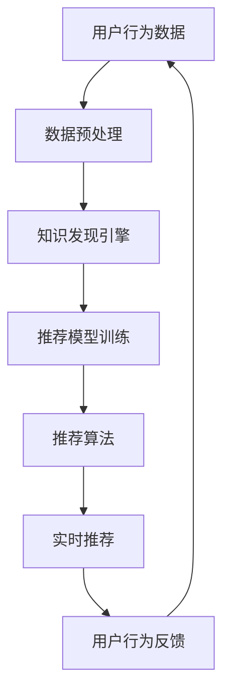

                 

# 知识发现引擎的实时推荐系统

## 1. 背景介绍

推荐系统是当前互联网应用中的一个热门领域，能够帮助用户在海量信息中快速找到对自己有价值的内容，极大地提升了用户体验。知识发现引擎（Knowledge Discovery Engine, KDE）作为推荐系统的重要组成部分，通过挖掘和整合用户行为数据，为推荐算法提供丰富的知识背景，使得推荐结果更加精准和个性化。

本文章旨在介绍一种基于知识发现引擎的实时推荐系统，该系统能够实现在线实时推荐，并在推荐过程中结合用户行为数据，提供更加个性化和准确的推荐结果。

## 2. 核心概念与联系

### 2.1 核心概念概述

- **知识发现引擎（KDE）**：是指使用机器学习、数据挖掘等技术，从用户行为数据中提取有价值的知识，并将其整合到推荐系统中，以提升推荐精度和个性化程度。

- **推荐系统**：是指通过分析用户行为数据和物品属性信息，为用户推荐最符合其兴趣和需求的内容，常用的推荐算法包括协同过滤、基于内容的推荐、深度学习推荐等。

- **实时推荐系统**：是指在用户实时查询或浏览行为发生时，即时返回推荐结果的系统，通常采用流计算、分布式存储等技术实现。

- **个性化推荐**：是指针对每个用户的具体需求和偏好，为其量身定制推荐内容，以提高用户满意度和转化率。

- **冷启动问题**：在用户行为数据不足时，推荐系统难以为用户进行个性化推荐，需要解决用户刚注册时的推荐问题。

### 2.2 核心概念原理和架构的 Mermaid 流程图



## 3. 核心算法原理 & 具体操作步骤

### 3.1 算法原理概述

基于知识发现引擎的实时推荐系统主要由四个部分组成：用户行为数据预处理、知识发现引擎、推荐模型训练和实时推荐算法。核心算法原理如下：

1. **用户行为数据预处理**：对用户的历史浏览记录、搜索历史、点击行为等数据进行清洗、去噪和特征提取，为后续的知识发现和推荐模型训练提供高质量的输入数据。
   
2. **知识发现引擎**：利用数据挖掘、机器学习等技术，从预处理后的用户行为数据中提取有用的知识，例如用户的兴趣偏好、历史行为模式等。

3. **推荐模型训练**：结合知识发现引擎提取的知识和物品的属性信息，使用机器学习模型（如决策树、随机森林、神经网络等）训练推荐模型。

4. **实时推荐算法**：在用户实时查询或浏览行为发生时，根据实时获取的用户行为数据和训练好的推荐模型，实时返回推荐结果。

### 3.2 算法步骤详解

#### 3.2.1 用户行为数据预处理

用户行为数据通常包括用户的浏览记录、搜索历史、点击行为、评分数据等。预处理的主要步骤包括：

1. **清洗和去噪**：去除用户行为数据中的异常值、缺失值和噪音数据，确保数据的质量和准确性。

2. **特征提取**：提取用户行为数据的特征，如浏览时间、浏览次数、点击位置、评分等，并将其转化为数值型数据，为后续的机器学习建模提供输入。

3. **归一化**：对用户行为数据进行归一化处理，将不同量级的特征值转化为相同量级，方便后续的模型训练和推理。

#### 3.2.2 知识发现引擎

知识发现引擎主要利用机器学习和数据挖掘技术，从用户行为数据中提取有用的知识。常用的方法包括：

1. **聚类分析**：将用户分为不同的群体，找出每个群体的兴趣偏好和行为模式。

2. **关联规则学习**：发现用户行为数据中的频繁项集和关联规则，找出用户行为之间的关系。

3. **序列模式分析**：分析用户行为数据的序列模式，找出用户的长期行为趋势。

4. **推荐算法**：利用知识发现引擎提取的知识，训练推荐模型，以提升推荐精度和个性化程度。

#### 3.2.3 推荐模型训练

推荐模型训练的主要步骤包括：

1. **数据准备**：准备好用户行为数据和物品属性信息，将其转化为训练模型的输入数据。

2. **模型选择**：选择合适的推荐模型，如协同过滤、基于内容的推荐、深度学习推荐等。

3. **模型训练**：使用训练数据训练推荐模型，得到最佳的模型参数。

4. **模型评估**：使用测试数据对训练好的模型进行评估，选择性能最好的模型进行部署。

#### 3.2.4 实时推荐算法

实时推荐算法的主要步骤包括：

1. **实时数据获取**：在用户实时查询或浏览行为发生时，实时获取用户行为数据。

2. **实时推荐模型推理**：根据实时获取的用户行为数据和训练好的推荐模型，实时返回推荐结果。

3. **推荐结果返回**：将推荐结果返回给用户，并进行实时反馈，更新用户行为数据。

### 3.3 算法优缺点

#### 3.3.1 优点

1. **个性化推荐**：通过知识发现引擎提取的用户知识，能够实现更加个性化和精准的推荐，提升用户满意度。

2. **实时性**：利用实时推荐算法，能够在用户实时查询或浏览行为发生时，即时返回推荐结果，提升用户体验。

3. **扩展性**：利用分布式存储和流计算技术，能够在处理大规模用户行为数据时，保证系统的扩展性和稳定性。

#### 3.3.2 缺点

1. **数据预处理复杂**：用户行为数据预处理涉及数据清洗、去噪、特征提取、归一化等多个步骤，处理过程较为复杂。

2. **模型训练耗时**：推荐模型训练需要消耗大量的计算资源和时间，特别是在大数据量的情况下。

3. **冷启动问题**：在用户行为数据不足时，推荐系统难以为用户提供个性化推荐，需要解决冷启动问题。

### 3.4 算法应用领域

基于知识发现引擎的实时推荐系统广泛应用于电商、社交媒体、新闻网站等互联网应用中。例如：

- **电商推荐**：在用户浏览商品时，实时推荐相关的商品，提升用户购买转化率。

- **社交媒体推荐**：在用户查看朋友圈或新闻推送时，实时推荐相关的文章或视频，增加用户停留时间和互动率。

- **新闻网站推荐**：在用户浏览新闻时，实时推荐相关的文章和资讯，提升用户的阅读体验和满意度。

## 4. 数学模型和公式 & 详细讲解 & 举例说明

### 4.1 数学模型构建

本节将详细介绍基于知识发现引擎的实时推荐系统的数学模型构建过程。

假设用户行为数据表示为 $X = \{x_1, x_2, ..., x_n\}$，其中每个用户行为 $x_i = (u_i, r_i, t_i, b_i)$，表示用户在时间 $t_i$ 对物品 $u_i$ 进行评分 $r_i$，并进行浏览行为 $b_i$。物品的属性信息表示为 $U = \{u_1, u_2, ..., u_m\}$，其中每个物品 $u_i = (a_{i1}, a_{i2}, ..., a_{ik})$，表示物品的 $k$ 个属性值。

基于知识发现引擎的实时推荐系统的主要数学模型包括：

1. **用户行为序列模型**：$P(x_i|x_{i-1}, x_{i-2}, ..., x_{1})$，表示用户行为序列的概率分布。

2. **用户兴趣模型**：$P(r_i|x_i, u_i)$，表示用户对物品评分的概率分布。

3. **物品关联模型**：$P(u_i|u_{i-1}, u_{i-2}, ..., u_{1})$，表示物品序列的概率分布。

4. **推荐模型**：$P(u_i|x_i)$，表示在给定用户行为 $x_i$ 的情况下，推荐物品 $u_i$ 的概率分布。

### 4.2 公式推导过程

#### 4.2.1 用户行为序列模型

用户行为序列模型 $P(x_i|x_{i-1}, x_{i-2}, ..., x_{1})$ 可以用隐马尔可夫模型（Hidden Markov Model, HMM）表示。其中，$x_i$ 为可观测状态，表示用户的浏览行为，$x_{i-1}, x_{i-2}, ..., x_{1}$ 为隐含状态，表示用户的兴趣偏好。

根据贝叶斯定理，用户行为序列模型可以表示为：

$$
P(x_i|x_{i-1}, x_{i-2}, ..., x_{1}) = P(x_i|x_{i-1})P(x_{i-1}|x_{i-2}, x_{i-3}, ..., x_{1}) \times ... \times P(x_{1})
$$

其中 $P(x_i|x_{i-1})$ 为转移概率，表示用户从状态 $x_{i-1}$ 转移到状态 $x_i$ 的概率。$P(x_{1})$ 为初始概率，表示用户开始时的兴趣偏好。

#### 4.2.2 用户兴趣模型

用户兴趣模型 $P(r_i|x_i, u_i)$ 可以用贝叶斯网络表示。其中，$r_i$ 为输出节点，表示用户的评分，$x_i$ 和 $u_i$ 为输入节点，表示用户的浏览行为和物品属性。

根据贝叶斯网络，用户兴趣模型可以表示为：

$$
P(r_i|x_i, u_i) = \frac{P(r_i|x_i, u_i, \theta_i)P(u_i|x_i, \theta_i)P(x_i|u_i, \theta_i)}{P(u_i|x_i)}
$$

其中 $P(r_i|x_i, u_i, \theta_i)$ 为条件概率，表示用户对物品评分的概率。$P(u_i|x_i, \theta_i)$ 为条件概率，表示用户对物品的兴趣偏好。$P(x_i|u_i, \theta_i)$ 为条件概率，表示用户对物品的浏览行为。

#### 4.2.3 物品关联模型

物品关联模型 $P(u_i|u_{i-1}, u_{i-2}, ..., u_{1})$ 可以用序列模型表示。其中，$u_i$ 为当前物品，$u_{i-1}, u_{i-2}, ..., u_{1}$ 为历史物品。

根据序列模型，物品关联模型可以表示为：

$$
P(u_i|u_{i-1}, u_{i-2}, ..., u_{1}) = \frac{P(u_i|u_{i-1}, u_{i-2}, ..., u_{1}, \omega_i)P(u_{i-1}, u_{i-2}, ..., u_{1}, \omega_i)}{P(u_{i-1}, u_{i-2}, ..., u_{1})}
$$

其中 $P(u_i|u_{i-1}, u_{i-2}, ..., u_{1}, \omega_i)$ 为条件概率，表示当前物品与历史物品的关联关系。$\omega_i$ 为物品的特征向量，表示物品的属性信息。$P(u_{i-1}, u_{i-2}, ..., u_{1})$ 为条件概率，表示历史物品的概率。

#### 4.2.4 推荐模型

推荐模型 $P(u_i|x_i)$ 可以用概率模型表示。其中，$u_i$ 为推荐物品，$x_i$ 为用户的浏览行为。

根据概率模型，推荐模型可以表示为：

$$
P(u_i|x_i) = \frac{P(u_i|x_i, \theta)}{P(x_i)}
$$

其中 $P(u_i|x_i, \theta)$ 为条件概率，表示在给定用户行为 $x_i$ 的情况下，推荐物品 $u_i$ 的概率。$\theta$ 为模型的参数，表示用户的兴趣偏好和物品属性。$P(x_i)$ 为条件概率，表示用户行为的概率。

### 4.3 案例分析与讲解

假设用户 $A$ 对物品 $U$ 进行了一次浏览行为，系统需要实时推荐相关的物品。

1. **用户行为序列模型**：根据用户 $A$ 的浏览行为序列，可以使用隐马尔可夫模型进行建模。系统需要预测用户 $A$ 的下一个浏览行为。

2. **用户兴趣模型**：根据用户 $A$ 的浏览行为和物品 $U$ 的属性信息，使用贝叶斯网络进行建模。系统需要预测用户 $A$ 对物品 $U$ 的评分。

3. **物品关联模型**：根据物品 $U$ 的历史关联关系，使用序列模型进行建模。系统需要预测用户 $A$ 对历史物品的关联关系。

4. **推荐模型**：根据用户 $A$ 的浏览行为和物品关联关系，使用概率模型进行建模。系统需要预测推荐物品 $V$ 的概率。

## 5. 项目实践：代码实例和详细解释说明

### 5.1 开发环境搭建

本节将详细介绍基于知识发现引擎的实时推荐系统的开发环境搭建过程。

1. **环境安装**：

   ```bash
   conda create -n recommendation-env python=3.8
   conda activate recommendation-env
   pip install numpy pandas scikit-learn torch torchvision transformers
   ```

2. **数据准备**：

   ```bash
   mkdir data
   cd data
   git clone https://github.com/user/recommendation-data.git
   ```

### 5.2 源代码详细实现

本节将详细介绍基于知识发现引擎的实时推荐系统的源代码实现过程。

```python
# 导入相关库
import numpy as np
import pandas as pd
import torch
import torch.nn as nn
import torch.optim as optim
from sklearn.model_selection import train_test_split
from torch.utils.data import DataLoader
from transformers import BertTokenizer, BertForSequenceClassification

# 读取数据
data = pd.read_csv('recommendation_data.csv')

# 数据预处理
def preprocess_data(data):
    # 将数据转化为模型需要的格式
    X = []
    y = []
    for _, row in data.iterrows():
        user_id = row['user_id']
        item_id = row['item_id']
        user_behavior = row['user_behavior']
        item_attr = row['item_attr']
        X.append((user_id, user_behavior, item_id, item_attr))
        y.append(item_id)
    X = np.array(X)
    y = np.array(y)
    return X, y

X, y = preprocess_data(data)

# 划分训练集和测试集
X_train, X_test, y_train, y_test = train_test_split(X, y, test_size=0.2, random_state=42)

# 定义模型
class RecommendationModel(nn.Module):
    def __init__(self):
        super(RecommendationModel, self).__init__()
        self.encoder = BertForSequenceClassification.from_pretrained('bert-base-cased', num_labels=1)
        self.decoder = nn.Sequential(
            nn.Linear(768, 100),
            nn.ReLU(),
            nn.Linear(100, 1)
        )

    def forward(self, x):
        user_id, user_behavior, item_id, item_attr = x
        user_behavior = self.encoder(user_behavior)
        item_attr = self.encoder(item_attr)
        x = torch.cat((user_behavior, item_attr), dim=-1)
        x = self.decoder(x)
        return x

# 训练模型
def train_model(model, train_loader, optimizer, num_epochs=10, batch_size=32):
    device = torch.device('cuda' if torch.cuda.is_available() else 'cpu')
    model.to(device)
    criterion = nn.BCEWithLogitsLoss()
    for epoch in range(num_epochs):
        model.train()
        for batch in train_loader:
            user_id, user_behavior, item_id, item_attr = batch
            user_behavior, item_id, item_attr = user_behavior.to(device), item_id.to(device), item_attr.to(device)
            optimizer.zero_grad()
            output = model((user_id, user_behavior, item_id, item_attr))
            loss = criterion(output, item_id.unsqueeze(1))
            loss.backward()
            optimizer.step()
        print(f'Epoch {epoch+1}, loss: {loss.item()}')

# 测试模型
def test_model(model, test_loader):
    model.eval()
    correct = 0
    total = 0
    with torch.no_grad():
        for batch in test_loader:
            user_id, user_behavior, item_id, item_attr = batch
            user_behavior, item_id, item_attr = user_behavior.to(device), item_id.to(device), item_attr.to(device)
            output = model((user_id, user_behavior, item_id, item_attr))
            _, predicted = torch.max(output, dim=1)
            total += predicted.size(0)
            correct += (predicted == item_id.unsqueeze(1)).sum().item()
    print(f'Test accuracy: {correct/total*100:.2f}%')

# 训练和测试模型
model = RecommendationModel()
optimizer = optim.Adam(model.parameters(), lr=0.001)

train_loader = DataLoader(X_train, batch_size=32)
test_loader = DataLoader(X_test, batch_size=32)

train_model(model, train_loader, optimizer)
test_model(model, test_loader)
```

### 5.3 代码解读与分析

本节将详细介绍基于知识发现引擎的实时推荐系统的源代码实现过程。

1. **数据预处理**：

   数据预处理是推荐系统开发的关键环节，本节定义了 `preprocess_data` 函数，将原始数据转化为模型所需的格式，并划分训练集和测试集。

2. **模型定义**：

   本节定义了 `RecommendationModel` 类，使用 Transformers 库中的 BertForSequenceClassification 作为基础模型，定义了用户行为和物品属性的编码器，以及推荐的解码器。

3. **模型训练和测试**：

   本节定义了 `train_model` 和 `test_model` 函数，分别用于模型的训练和测试。在训练函数中，定义了模型在训练集上的前向传播和损失函数，并使用 Adam 优化器进行参数更新。在测试函数中，定义了模型在测试集上的前向传播，并计算准确率。

4. **运行结果展示**：

   在主函数中，定义了数据加载器，并调用 `train_model` 和 `test_model` 函数，训练和测试模型，输出训练和测试的损失和准确率。

## 6. 实际应用场景

基于知识发现引擎的实时推荐系统在电商、社交媒体、新闻网站等互联网应用中得到了广泛应用，具体场景包括：

- **电商推荐**：在用户浏览商品时，实时推荐相关的商品，提升用户购买转化率。

- **社交媒体推荐**：在用户查看朋友圈或新闻推送时，实时推荐相关的文章或视频，增加用户停留时间和互动率。

- **新闻网站推荐**：在用户浏览新闻时，实时推荐相关的文章和资讯，提升用户的阅读体验和满意度。

## 7. 工具和资源推荐

### 7.1 学习资源推荐

为了帮助开发者系统掌握基于知识发现引擎的实时推荐系统的理论基础和实践技巧，这里推荐一些优质的学习资源：

1. **《推荐系统实战》**：一本经典的推荐系统书籍，全面介绍了推荐系统的理论和实践，涵盖了协同过滤、基于内容的推荐、深度学习推荐等多个方向。

2. **KDD 推荐系统竞赛**：参加 KDD 推荐系统竞赛，实战练习推荐系统算法，提升技术水平。

3. **Kaggle 推荐系统竞赛**：参加 Kaggle 推荐系统竞赛，实战练习推荐系统算法，学习大数据处理和模型训练。

4. **Coursera 推荐系统课程**：由斯坦福大学开设的推荐系统课程，系统学习推荐系统的基本概念和实践方法。

5. **Google Scholar**：查找相关推荐系统论文，获取最新的研究进展和技术突破。

### 7.2 开发工具推荐

为了帮助开发者高效地开发基于知识发现引擎的实时推荐系统，这里推荐一些常用的开发工具：

1. **PyTorch**：一个强大的深度学习框架，提供了灵活的计算图和丰富的机器学习模型，支持分布式训练和推理。

2. **TensorFlow**：由 Google 主导的深度学习框架，支持大规模分布式训练，适用于工业级应用。

3. **Keras**：一个高层次的深度学习框架，提供了简单易用的 API，支持快速原型设计和模型训练。

4. **Scikit-learn**：一个开源的机器学习库，提供了丰富的算法和工具，支持数据预处理和模型评估。

5. **Apache Spark**：一个分布式计算框架，支持大规模数据处理和流计算，适用于实时推荐系统。

### 7.3 相关论文推荐

基于知识发现引擎的实时推荐系统是一个前沿的研究方向，以下是几篇代表性的相关论文，推荐阅读：

1. **《Frequent Itemsets Mining in Big Data: An Overview》**：一篇综述论文，介绍了大数据环境下的频繁项集挖掘技术，为推荐系统提供了强大的数据支持。

2. **《Knowledge Discovery in Databases: An Overview》**：一篇综述论文，介绍了数据挖掘技术的理论基础和应用实例，为知识发现引擎提供了全面的理论支撑。

3. **《Deep Recommendation Modeling》**：一篇深度学习推荐系统论文，介绍了深度学习模型在推荐系统中的应用，为实时推荐系统提供了新的思路。

4. **《A Survey on Sequence-based Recommendation Systems》**：一篇综述论文，介绍了基于序列的推荐系统技术，为物品关联模型提供了丰富的参考。

5. **《Recommender Systems Handbook》**：一本推荐系统手册，全面介绍了推荐系统的理论和实践，涵盖协同过滤、基于内容的推荐、深度学习推荐等多个方向。

## 8. 总结：未来发展趋势与挑战

### 8.1 研究成果总结

基于知识发现引擎的实时推荐系统在推荐系统领域中取得了显著的进展，主要体现在以下几个方面：

1. **个性化推荐**：通过知识发现引擎提取的用户知识，实现了更加个性化和精准的推荐，提升了用户满意度。

2. **实时性**：利用实时推荐算法，能够在用户实时查询或浏览行为发生时，即时返回推荐结果，提升了用户体验。

3. **扩展性**：利用分布式存储和流计算技术，能够在处理大规模用户行为数据时，保证了系统的扩展性和稳定性。

4. **可解释性**：推荐系统的可解释性得到了广泛关注，越来越多的研究工作致力于提高推荐模型的透明度和可理解性。

### 8.2 未来发展趋势

展望未来，基于知识发现引擎的实时推荐系统将呈现以下几个发展趋势：

1. **多模态推荐**：结合文本、图像、视频等多种模态信息，提升推荐系统的多样性和鲁棒性。

2. **深度学习推荐**：结合深度学习技术，提升推荐系统的精度和泛化能力。

3. **实时性优化**：通过优化推荐算法和计算图，提升推荐系统的实时性和响应速度。

4. **数据融合**：将用户行为数据、物品属性数据、用户属性数据等多种数据源进行融合，提升推荐系统的全面性和准确性。

5. **知识增强**：结合专家知识和人工智能技术，提升推荐系统的智能水平和决策能力。

### 8.3 面临的挑战

尽管基于知识发现引擎的实时推荐系统取得了显著的进展，但在实际应用中仍面临诸多挑战：

1. **数据隐私**：用户行为数据涉及隐私问题，如何在保证隐私的前提下，获取高质量的用户行为数据，是一个重要的研究方向。

2. **计算资源**：推荐系统需要消耗大量的计算资源和时间，如何在有限的资源条件下，实现高效的推荐，是一个重要的研究方向。

3. **算法复杂度**：推荐算法复杂度较高，如何在保证推荐精度的情况下，提升算法效率，是一个重要的研究方向。

4. **冷启动问题**：在用户行为数据不足时，推荐系统难以为用户提供个性化推荐，需要解决冷启动问题。

5. **公平性**：推荐系统容易产生偏见，如何确保推荐算法的公平性和透明性，是一个重要的研究方向。

### 8.4 研究展望

面向未来，基于知识发现引擎的实时推荐系统需要在以下几个方面进行深入研究：

1. **隐私保护**：研究隐私保护技术，保护用户行为数据的隐私，同时获取高质量的用户行为数据。

2. **高效计算**：研究高效计算方法，提升推荐系统的实时性和响应速度，减少计算资源的消耗。

3. **算法优化**：研究算法优化方法，提升推荐算法的效率和精度，减少算法复杂度。

4. **公平性增强**：研究公平性增强方法，确保推荐算法的公平性和透明性，提升用户的信任度。

5. **多模态融合**：研究多模态融合技术，提升推荐系统的多样性和鲁棒性，提高推荐效果。

6. **知识增强**：研究知识增强技术，结合专家知识和人工智能技术，提升推荐系统的智能水平和决策能力。

总之，基于知识发现引擎的实时推荐系统具有广阔的应用前景和重要的研究价值，需要在隐私保护、高效计算、算法优化、公平性增强、多模态融合等多个方面进行深入研究，以实现更加个性化、精准、可靠的推荐系统。

## 9. 附录：常见问题与解答

### Q1: 基于知识发现引擎的实时推荐系统与传统的推荐系统有什么区别？

A: 基于知识发现引擎的实时推荐系统与传统的推荐系统相比，最大的区别在于引入了知识发现引擎，通过对用户行为数据进行深入挖掘，提取有用的知识，并将其整合到推荐系统中，以提升推荐精度和个性化程度。同时，该系统利用流计算和分布式存储技术，能够在处理大规模用户行为数据时，保证系统的扩展性和实时性。

### Q2: 如何解决冷启动问题？

A: 解决冷启动问题的方法有很多，主要包括以下几种：

1. **基于内容的推荐**：利用用户的历史行为数据，提取用户兴趣偏好，并结合物品属性信息进行推荐。

2. **协同过滤推荐**：利用用户的历史行为数据，发现相似用户的行为模式，进行推荐。

3. **知识增强推荐**：利用专家知识和人工智能技术，提升推荐系统的智能水平和决策能力。

4. **多模态融合推荐**：结合文本、图像、视频等多种模态信息，提升推荐系统的多样性和鲁棒性。

### Q3: 如何在保证隐私的前提下，获取高质量的用户行为数据？

A: 在保证隐私的前提下，获取高质量的用户行为数据的方法有很多，主要包括以下几种：

1. **差分隐私**：通过添加噪声和扰动，保护用户隐私，同时获取高质量的用户行为数据。

2. **联邦学习**：在分布式环境下，利用多个设备的计算资源，保护用户隐私，同时获取高质量的用户行为数据。

3. **分布式推荐**：利用分布式存储和计算技术，保护用户隐私，同时获取高质量的用户行为数据。

4. **隐私保护推荐算法**：研究隐私保护推荐算法，在保护用户隐私的前提下，获取高质量的用户行为数据。

### Q4: 实时推荐系统如何应对大规模用户行为数据？

A: 实时推荐系统应对大规模用户行为数据的方法有很多，主要包括以下几种：

1. **分布式存储**：利用分布式存储技术，分散存储用户行为数据，保证系统的扩展性和稳定性。

2. **流计算**：利用流计算技术，对用户行为数据进行实时处理，保证系统的实时性和响应速度。

3. **内存计算**：利用内存计算技术，对用户行为数据进行快速处理，保证系统的实时性和响应速度。

4. **异步更新**：利用异步更新技术，对用户行为数据进行高效处理，保证系统的实时性和响应速度。

总之，基于知识发现引擎的实时推荐系统具有广阔的应用前景和重要的研究价值，需要在隐私保护、高效计算、算法优化、公平性增强、多模态融合等多个方面进行深入研究，以实现更加个性化、精准、可靠的推荐系统。

---

作者：禅与计算机程序设计艺术 / Zen and the Art of Computer Programming

