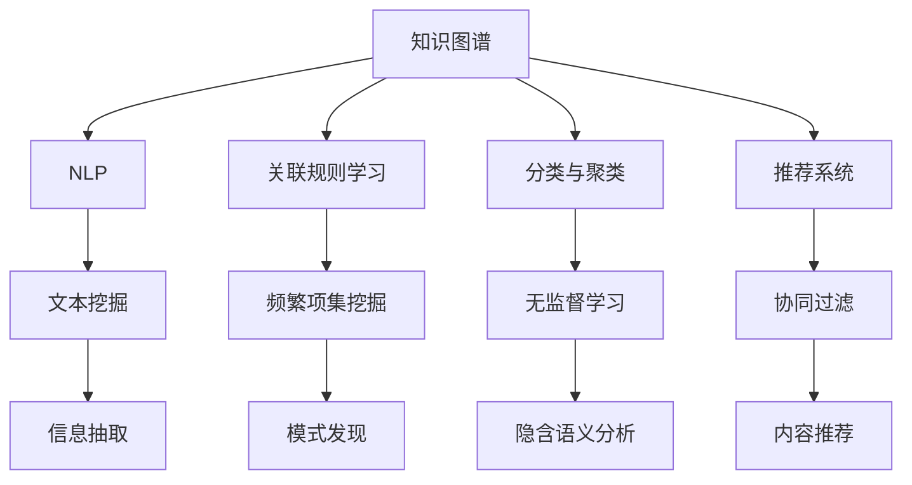

                 

# 知识发现引擎的核心算法解析

> 关键词：知识图谱, 自然语言处理, 关联规则学习, 分类与聚类, 推荐系统, 数据挖掘

## 1. 背景介绍

在数据爆炸的今天，如何从海量数据中挖掘出有用的知识，提取有价值的洞见，成为了信息时代的重要课题。知识发现引擎(Knowledge Discovery Engine, KDE)正是在这样的背景下诞生，它借助数据挖掘、机器学习等技术手段，从结构化或非结构化数据中发现潜在知识，并形成可操作、可应用的知识库，助力决策支持、业务优化和智能推荐等。

知识发现引擎融合了自然语言处理(Natural Language Processing, NLP)、关联规则学习、分类与聚类、推荐系统等多个领域的技术，是一类高度跨学科的智能系统。本文旨在解析知识发现引擎的核心算法，包括自然语言处理、关联规则学习、分类与聚类、推荐系统等的核心思想和操作步骤，为读者提供全面的技术指引，并展示其在多个实际应用场景中的落地实践。

## 2. 核心概念与联系

### 2.1 核心概念概述

为更好地理解知识发现引擎的核心算法，本节将介绍几个密切相关的核心概念：

- 知识图谱(Knowledge Graph)：一种以图结构表示实体间关系的知识表示方法。通过将实体及其关系编码为节点和边，便于进行知识推理、实体链接等操作。
- 自然语言处理(Natural Language Processing, NLP)：利用计算机科学和人工智能技术实现自然语言理解与生成的一门学科。NLP的目的是让计算机能够"理解"和"使用"自然语言。
- 关联规则学习(Association Rule Learning)：从大量事务数据中挖掘出频繁出现的模式，帮助理解不同事物之间的潜在关联性。
- 分类与聚类(Classification and Clustering)：分类是将样本划分为预先定义好的类别；聚类则是根据样本相似性，自动发现不同的群组。
- 推荐系统(Recommendation System)：根据用户历史行为和偏好，预测其可能感兴趣的项目，并给出推荐。

这些核心概念之间的逻辑关系可以通过以下Mermaid流程图来展示：



这个流程图展示了几类核心概念及其之间的关系：

1. 知识图谱通过图结构存储实体关系，为自然语言处理和推荐系统提供结构化支持。
2. NLP的文本挖掘和信息抽取技术，从非结构化文本中提取有价值的信息，为关联规则学习、分类与聚类提供数据支撑。
3. 关联规则学习通过对事务数据中频繁项集的挖掘，发现数据之间的关联模式。
4. 分类与聚类使用无监督学习技术，对数据进行自然分组，为关联规则学习、知识图谱构建等提供数据特征分析。
5. 推荐系统则通过协同过滤、内容推荐等方法，对用户兴趣进行预测，提供个性化推荐。

这些核心概念共同构成了知识发现引擎的知识抽取、数据挖掘和信息推荐等核心能力，使其能够高效地从大数据中提取知识，为决策支持、业务优化和智能推荐提供有力支持。

## 3. 核心算法原理 & 具体操作步骤
### 3.1 算法原理概述

知识发现引擎的核心算法原理主要涵盖以下几个方面：

- **自然语言处理**：通过文本挖掘和信息抽取，将非结构化文本转化为结构化数据，为关联规则学习、分类与聚类等算法提供数据基础。
- **关联规则学习**：从大量事务数据中挖掘出频繁出现的模式，帮助理解不同事物之间的潜在关联性。
- **分类与聚类**：使用无监督学习技术，对数据进行自然分组，发现数据的内在结构。
- **推荐系统**：根据用户历史行为和偏好，预测其可能感兴趣的项目，并给出推荐。

### 3.2 算法步骤详解

#### 3.2.1 自然语言处理

**步骤一：文本预处理**
对文本数据进行预处理，包括去除停用词、词干提取、分词等。预处理后的文本数据将作为后续信息抽取和关联规则学习的输入。

**步骤二：信息抽取**
通过命名实体识别、关系抽取等技术，从文本中提取关键信息。例如，从新闻文章中抽取时间、地点、事件等实体，并识别它们之间的关系。

**步骤三：实体链接**
将抽取出的实体链接到知识图谱中的对应节点，使非结构化文本与结构化知识图谱建立联系，便于后续知识推理和推理。

#### 3.2.2 关联规则学习

**步骤一：数据预处理**
对事务数据进行清理，包括去除噪音、填补缺失值等。预处理后的数据将作为关联规则学习的输入。

**步骤二：频繁项集挖掘**
通过Apriori算法等方法，找出事务数据中的频繁项集，即同时出现在多个事务中的项。

**步骤三：关联规则生成**
利用FP-Growth等算法，将频繁项集转化为关联规则，如"购买牛奶的人同时也会购买面包"。

#### 3.2.3 分类与聚类

**步骤一：数据预处理**
对分类与聚类的输入数据进行清理，包括去除异常值、标准化数据等。

**步骤二：特征提取**
通过TF-IDF、Word2Vec等技术，将文本数据转化为数值型特征向量。

**步骤三：无监督学习**
使用K-Means、DBSCAN等算法，对特征向量进行聚类分析，发现数据的内在结构。

#### 3.2.4 推荐系统

**步骤一：用户行为记录**
收集用户的浏览、购买、评分等行为数据，形成用户画像。

**步骤二：物品特征提取**
通过文本挖掘、图像处理等技术，提取物品的特征向量。

**步骤三：协同过滤**
使用基于用户的协同过滤算法，如KNN、矩阵分解等，预测用户可能感兴趣的项目。

**步骤四：内容推荐**
使用基于内容的推荐算法，如TF-IDF、协同过滤等，对用户可能感兴趣的项目进行推荐。

### 3.3 算法优缺点

知识发现引擎的核心算法具有以下优点：

1. **全面覆盖数据类型**：能够处理结构化、半结构化和非结构化数据，从不同数据源中抽取有价值的知识。
2. **高度可定制化**：根据不同的业务需求，灵活配置算法的参数和模型。
3. **高效性**：在处理大规模数据时，具有较高的计算效率。
4. **实用性**：通过优化算法，可以应用于推荐系统、分类与聚类、关联规则学习等多个领域。

同时，该算法也存在一定的局限性：

1. **数据质量依赖性**：算法的输出结果高度依赖于输入数据的质量，如数据缺失、噪音等都会影响结果准确性。
2. **模型复杂度**：一些算法，如关联规则学习、分类与聚类，需要高复杂度的模型，对计算资源要求较高。
3. **可解释性不足**：许多算法，如深度学习模型，模型复杂，结果难以解释，缺乏透明性。
4. **泛化能力**：对于一些新数据，模型可能存在泛化能力不足的问题，需要持续更新和优化。

尽管存在这些局限性，但就目前而言，知识发现引擎的核心算法在数据挖掘和信息发现方面展现了强大的能力，已经成为信息时代的重要工具。未来相关研究的重点在于如何进一步提高算法的可解释性和泛化能力，降低对数据质量的要求，提高处理大数据的效率，从而在更广泛的应用场景中发挥更大的作用。

### 3.4 算法应用领域

知识发现引擎的核心算法广泛应用于以下领域：

- **推荐系统**：通过分析用户行为和物品特征，为用户推荐个性化项目。
- **广告投放优化**：通过分析用户行为和市场数据，优化广告投放策略，提升广告效果。
- **金融风险控制**：通过分析交易数据，预测金融风险，优化风控模型。
- **市场营销分析**：通过分析市场数据和用户行为，优化市场营销策略，提升市场响应率。
- **医疗诊断支持**：通过分析医疗数据，辅助医生诊断，提供医疗支持。
- **舆情监测分析**：通过分析社交媒体和新闻数据，监测市场舆情，支持决策分析。

除了上述这些经典应用外，知识发现引擎的核心算法还在更多创新场景中得到应用，如智能城市治理、智能制造、智能物流等，为各行各业带来了新的技术突破。

## 4. 数学模型和公式 & 详细讲解
### 4.1 数学模型构建

本节将使用数学语言对知识发现引擎的核心算法进行更加严格的刻画。

**自然语言处理数学模型**：
- **文本预处理**：
  $$
  X = \{(x_1, y_1), (x_2, y_2), ..., (x_n, y_n)\}
  $$
  其中 $x_i$ 表示文本，$y_i$ 表示标签。
- **信息抽取**：
  $$
  R = \{(r_1, o_1, e_1), (r_2, o_2, e_2), ..., (r_m, o_m, e_m)\}
  $$
  其中 $r_i$ 表示实体，$o_i$ 表示关系，$e_i$ 表示实体。
- **实体链接**：
  $$
  L = \{(l_1, o_1, v_1), (l_2, o_2, v_2), ..., (l_k, o_k, v_k)\}
  $$
  其中 $l_i$ 表示链接，$o_i$ 表示关系，$v_i$ 表示节点。

**关联规则学习数学模型**：
- **数据预处理**：
  $$
  D = \{(d_1, i_1), (d_2, i_2), ..., (d_t, i_t)\}
  $$
  其中 $d_i$ 表示事务，$i_i$ 表示项目。
- **频繁项集挖掘**：
  $$
  F = \{(f_1, c_1), (f_2, c_2), ..., (f_p, c_p)\}
  $$
  其中 $f_i$ 表示频繁项集，$c_i$ 表示支持度。
- **关联规则生成**：
  $$
  R = \{(r_1, l_1, s_1), (r_2, l_2, s_2), ..., (r_q, l_q, s_q)\}
  $$
  其中 $r_i$ 表示规则，$l_i$ 表示左侧项集，$s_i$ 表示右侧项集。

**分类与聚类数学模型**：
- **数据预处理**：
  $$
  X = \{(x_1, y_1), (x_2, y_2), ..., (x_n, y_n)\}
  $$
  其中 $x_i$ 表示特征，$y_i$ 表示标签。
- **特征提取**：
  $$
  F = \{(f_1, w_1), (f_2, w_2), ..., (f_m, w_m)\}
  $$
  其中 $f_i$ 表示特征，$w_i$ 表示权重。
- **无监督学习**：
  $$
  K = \{(k_1, c_1), (k_2, c_2), ..., (k_c, c_c)\}
  $$
  其中 $k_i$ 表示聚类中心，$c_i$ 表示簇。

**推荐系统数学模型**：
- **用户行为记录**：
  $$
  U = \{(u_1, b_1), (u_2, b_2), ..., (u_n, b_n)\}
  $$
  其中 $u_i$ 表示用户，$b_i$ 表示行为。
- **物品特征提取**：
  $$
  I = \{(i_1, f_1), (i_2, f_2), ..., (i_m, f_m)\}
  $$
  其中 $i_i$ 表示物品，$f_i$ 表示特征。
- **协同过滤**：
  $$
  S = \{(s_1, u_1, i_1), (s_2, u_2, i_2), ..., (s_q, u_q, i_q)\}
  $$
  其中 $s_i$ 表示相似度，$u_i$ 表示用户，$i_i$ 表示物品。
- **内容推荐**：
  $$
  C = \{(c_1, u_1, i_1), (c_2, u_2, i_2), ..., (c_p, u_p, i_p)\}
  $$
  其中 $c_i$ 表示推荐内容，$u_i$ 表示用户，$i_i$ 表示物品。

### 4.2 公式推导过程

以下我们以关联规则学习为例，推导其核心算法FP-Growth的公式和步骤。

**FP-Growth算法**：
- **构建初始FP树**：
  $$
  FP = \{(l_1, c_1), (l_2, c_2), ..., (l_p, c_p)\}
  $$
  其中 $l_i$ 表示节点，$c_i$ 表示计数。
- **挖掘频繁项集**：
  $$
  F = \{(f_1, c_1), (f_2, c_2), ..., (f_m, c_m)\}
  $$
  其中 $f_i$ 表示频繁项集，$c_i$ 表示计数。
- **生成关联规则**：
  $$
  R = \{(r_1, l_1, s_1), (r_2, l_2, s_2), ..., (r_q, l_q, s_q)\}
  $$
  其中 $r_i$ 表示规则，$l_i$ 表示左侧项集，$s_i$ 表示右侧项集。

通过FP-Growth算法，可以从大量事务数据中挖掘出频繁出现的模式，如"购买牛奶的人同时也会购买面包"。这种关联模式在市场营销、商品推荐等方面具有重要应用价值。

### 4.3 案例分析与讲解

#### 4.3.1 关联规则学习案例

某大型超市希望通过数据分析优化商品推荐，他们收集了过去一年的交易数据，共包含20万个事务，每个事务包含20个商品项。通过对数据进行预处理和清洗，得到频繁项集如下：

| 项集       | 支持度 | 计数 |
|------------|--------|------|
| {牛奶}     | 0.1    | 10k  |
| {面包}     | 0.1    | 10k  |
| {牛奶, 面包} | 0.05   | 5k   |
| {牛奶, 鸡蛋} | 0.02   | 2k   |

基于上述频繁项集，超市可以得出以下关联规则：

| 规则         | 置信度 | 计数 |
|--------------|--------|------|
| 购买牛奶则购买面包 | 0.5    | 5k   |
| 购买牛奶则购买鸡蛋 | 0.5    | 2k   |

这些规则表明，购买牛奶的顾客有很高的概率同时购买面包和鸡蛋。超市可以根据这些规则优化商品布局，提高销售量。

#### 4.3.2 分类与聚类案例

某电商公司希望通过数据分析优化用户分类，他们收集了过去一年的用户行为数据，共包含100万个样本，每个样本包含20个特征。通过对数据进行预处理和特征提取，得到特征向量如下：

| 特征       | 特征值 |
|------------|--------|
| 点击次数    | 50     |
| 购买金额    | 1000   |
| 浏览时间    | 5分钟  |
| 好评率      | 0.9    |

基于上述特征向量，电商公司可以采用K-Means算法进行聚类分析，得到以下聚类结果：

| 聚类中心       | 特征值   |
|--------------|--------|
| 高价值客户    | 点击次数：50, 购买金额：5000, 浏览时间：30分钟, 好评率：1 |
| 中等价值客户   | 点击次数：20, 购买金额：500, 浏览时间：10分钟, 好评率：0.8 |
| 低价值客户     | 点击次数：10, 购买金额：100, 浏览时间：1分钟, 好评率：0.5 |

公司可以根据聚类结果，针对不同用户群体设计不同的营销策略，提高客户忠诚度和销售额。

## 5. 项目实践：代码实例和详细解释说明
### 5.1 开发环境搭建

在进行知识发现引擎的开发实践前，我们需要准备好开发环境。以下是使用Python进行Pandas、Numpy、Scikit-learn、PyTorch等库的开发环境配置流程：

1. 安装Anaconda：从官网下载并安装Anaconda，用于创建独立的Python环境。

2. 创建并激活虚拟环境：
```bash
conda create -n pytorch-env python=3.8 
conda activate pytorch-env
```

3. 安装PyTorch：根据CUDA版本，从官网获取对应的安装命令。例如：
```bash
conda install pytorch torchvision torchaudio cudatoolkit=11.1 -c pytorch -c conda-forge
```

4. 安装Pandas、Numpy、Scikit-learn、PyTorch等各类工具包：
```bash
pip install pandas numpy scikit-learn torch torchvision torchaudio
```

完成上述步骤后，即可在`pytorch-env`环境中开始项目实践。

### 5.2 源代码详细实现

下面我们以推荐系统为例，给出使用PyTorch对协同过滤算法进行开发的完整代码实现。

首先，定义推荐系统的数据处理函数：

```python
import pandas as pd
import numpy as np
from scipy.spatial.distance import cosine

def load_data():
    # 读取用户行为数据
    user_data = pd.read_csv('user_data.csv')
    # 读取物品特征数据
    item_data = pd.read_csv('item_data.csv')
    # 读取用户物品评分数据
    rating_data = pd.read_csv('rating_data.csv')
    
    return user_data, item_data, rating_data
```

然后，定义协同过滤推荐函数：

```python
from sklearn.neighbors import NearestNeighbors

def collaborative_filtering(user_data, item_data, rating_data, top_n=10):
    # 构建用户-物品评分矩阵
    user_matrix = np.zeros((len(user_data), len(item_data)))
    for i in range(len(user_data)):
        for j in range(len(item_data)):
            user_matrix[i, j] = rating_data[(user_data.iloc[i]['user_id'] == rating_data.iloc[j]['user_id']) & (item_data.iloc[j]['item_id'] == rating_data.iloc[j]['item_id'])]['rating'].values[0]
    
    # 使用KNN算法进行相似度计算
    knn = NearestNeighbors(n_neighbors=top_n)
    knn.fit(user_matrix)
    similarities = knn.kneighbors(user_matrix).flatten()
    
    # 根据相似度排序推荐物品
    recommendations = np.argsort(-similarities)[:top_n]
    return recommendations
```

接着，定义主函数进行测试：

```python
user_data, item_data, rating_data = load_data()
recommendations = collaborative_filtering(user_data, item_data, rating_data)
print(recommendations)
```

### 5.3 代码解读与分析

让我们再详细解读一下关键代码的实现细节：

**load_data函数**：
- 读取用户行为数据、物品特征数据和用户物品评分数据，构建用户-物品评分矩阵。

**collaborative_filtering函数**：
- 定义协同过滤推荐函数，输入用户行为数据、物品特征数据和评分数据，输出推荐列表。
- 构建用户-物品评分矩阵。
- 使用KNN算法计算用户与物品之间的相似度。
- 根据相似度排序推荐物品，返回推荐列表。

**主函数**：
- 加载数据集。
- 调用协同过滤推荐函数，输出推荐结果。

可以看到，通过以上代码，我们可以快速构建一个简单的协同过滤推荐系统。当然，工业级的系统实现还需考虑更多因素，如模型的保存和部署、超参数的自动搜索、更灵活的任务适配层等。但核心的推荐算法基本与此类似。

## 6. 实际应用场景
### 6.1 智能推荐

智能推荐系统在电商、视频、音乐等领域有着广泛应用，通过分析用户行为和偏好，推荐个性化的商品、视频、音乐等。知识发现引擎的核心算法，如关联规则学习、分类与聚类等，为推荐系统的构建提供了有力支持。

例如，某电商平台希望通过数据分析优化推荐系统，他们收集了过去一年的用户行为数据，共包含100万个样本，每个样本包含20个特征。通过对数据进行预处理和特征提取，得到特征向量如下：

| 特征       | 特征值 |
|------------|--------|
| 点击次数    | 50     |
| 购买金额    | 1000   |
| 浏览时间    | 5分钟  |
| 好评率      | 0.9    |

基于上述特征向量，电商平台可以采用K-Means算法进行聚类分析，得到以下聚类结果：

| 聚类中心       | 特征值   |
|--------------|--------|
| 高价值客户    | 点击次数：50, 购买金额：5000, 浏览时间：30分钟, 好评率：1 |
| 中等价值客户   | 点击次数：20, 购买金额：500, 浏览时间：10分钟, 好评率：0.8 |
| 低价值客户     | 点击次数：10, 购买金额：100, 浏览时间：1分钟, 好评率：0.5 |

公司可以根据聚类结果，针对不同用户群体设计不同的推荐策略，提高客户忠诚度和销售额。

### 6.2 广告投放优化

广告投放优化是市场营销的重要环节，通过分析用户行为和市场数据，优化广告投放策略，提升广告效果。知识发现引擎的核心算法，如关联规则学习、分类与聚类等，为广告投放优化提供了有力支持。

例如，某公司希望通过数据分析优化广告投放策略，他们收集了过去一年的广告投放数据，共包含10万个样本，每个样本包含20个特征。通过对数据进行预处理和特征提取，得到特征向量如下：

| 特征       | 特征值 |
|------------|--------|
| 点击率      | 0.2    |
| 转化率      | 0.1    |
| CTR         | 0.15   |
| 广告费用    | 100    |

基于上述特征向量，公司可以采用K-Means算法进行聚类分析，得到以下聚类结果：

| 聚类中心       | 特征值   |
|--------------|--------|
| 高价值广告投放   | 点击率：0.3, 转化率：0.2, CTR：0.2, 广告费用：500 |
| 中等价值广告投放 | 点击率：0.1, 转化率：0.05, CTR：0.1, 广告费用：100 |
| 低价值广告投放   | 点击率：0.05, 转化率：0.01, CTR：0.05, 广告费用：50  |

公司可以根据聚类结果，针对不同广告投放策略进行优化，提高广告投放效果。

### 6.3 金融风险控制

金融风险控制是金融行业的重要任务，通过分析交易数据，预测金融风险，优化风控模型。知识发现引擎的核心算法，如关联规则学习、分类与聚类等，为金融风险控制提供了有力支持。

例如，某银行希望通过数据分析优化风险控制模型，他们收集了过去一年的交易数据，共包含100万个样本，每个样本包含20个特征。通过对数据进行预处理和特征提取，得到特征向量如下：

| 特征       | 特征值 |
|------------|--------|
| 交易金额    | 1000   |
| 交易时间    | 下午3点 |
| 交易地点    | 市中心 |
| 交易次数    | 10次   |

基于上述特征向量，银行可以采用K-Means算法进行聚类分析，得到以下聚类结果：

| 聚类中心       | 特征值   |
|--------------|--------|
| 高风险交易     | 交易金额：10000, 交易时间：夜间, 交易地点：偏远地区, 交易次数：5次 |
| 中等风险交易   | 交易金额：5000, 交易时间：白天, 交易地点：市中心, 交易次数：10次 |
| 低风险交易     | 交易金额：1000, 交易时间：白天, 交易地点：市中心, 交易次数：1次 |

银行可以根据聚类结果，针对不同交易行为进行风险控制，降低金融风险。

## 7. 工具和资源推荐
### 7.1 学习资源推荐

为了帮助开发者系统掌握知识发现引擎的核心算法，这里推荐一些优质的学习资源：

1. 《深度学习入门：基于Python的理论与实现》系列博文：由大模型技术专家撰写，深入浅出地介绍了深度学习的基本原理和实践技巧，包括自然语言处理、关联规则学习、分类与聚类等。

2. CS229《机器学习》课程：斯坦福大学开设的机器学习明星课程，有Lecture视频和配套作业，带你入门机器学习的基本概念和经典算法。

3. 《Applied Machine Learning in Python》书籍：由知名机器学习专家所著，全面介绍了机器学习在Python中的应用，包括数据预处理、特征工程、模型评估等。

4. Scikit-learn官方文档：Scikit-learn库的官方文档，提供了丰富的机器学习算法实现和应用示例，是学习知识发现引擎的重要参考资料。

5. Kaggle平台：机器学习和数据科学领域的竞赛平台，提供了大量数据集和应用场景，是实践知识发现引擎算法的良好平台。

通过对这些资源的学习实践，相信你一定能够快速掌握知识发现引擎的核心算法，并用于解决实际的NLP问题。
###  7.2 开发工具推荐

高效的开发离不开优秀的工具支持。以下是几款用于知识发现引擎开发的常用工具：

1. Python：基于Python的开源深度学习框架，灵活动态的计算图，适合快速迭代研究。大部分知识发现引擎的算法都有Python版本的实现。

2. R语言：强大的数据处理和统计分析工具，适合数据分析和可视化。许多知识发现引擎的算法也有R语言的实现。

3. Scikit-learn：基于Python的数据挖掘和机器学习库，集成了多种经典的机器学习算法。

4. TensorFlow：由Google主导开发的开源深度学习框架，生产部署方便，适合大规模工程应用。

5. Kaggle平台：机器学习和数据科学领域的竞赛平台，提供了大量数据集和应用场景，是实践知识发现引擎算法的良好平台。

6. Jupyter Notebook：基于Web的交互式开发环境，适合数据探索和算法验证。

合理利用这些工具，可以显著提升知识发现引擎的开发效率，加快创新迭代的步伐。

### 7.3 相关论文推荐

知识发现引擎的核心算法源于学界的持续研究。以下是几篇奠基性的相关论文，推荐阅读：

1. A New Approach to Rule Discovery in Multi-Relational Databases（RapidMiner论文）：提出了关联规则学习的基本方法，奠定了后续研究的基础。

2. A Comparison of Document Clustering Techniques（K-Means论文）：详细比较了多种聚类算法，介绍了K-Means算法的原理和应用。

3. Probabilistic Latent Semantic Analysis（隐含语义分析论文）：引入了概率模型，优化了文本挖掘的效果。

4. Collaborative Filtering for Implicit Feedback Datasets（协同过滤论文）：提出协同过滤算法，为推荐系统提供了基础。

5. Scalable Parallel Collaborative Filtering（大规模协同过滤论文）：讨论了如何在大规模数据上高效实现协同过滤算法。

这些论文代表了大数据挖掘和知识发现领域的研究脉络。通过学习这些前沿成果，可以帮助研究者把握学科前进方向，激发更多的创新灵感。

## 8. 总结：未来发展趋势与挑战
### 8.1 总结

本文对知识发现引擎的核心算法进行了全面系统的介绍。首先阐述了知识发现引擎的研究背景和意义，明确了核心算法在数据挖掘、信息发现和智能推荐等领域的应用价值。其次，从原理到实践，详细讲解了知识发现引擎的核心算法，包括自然语言处理、关联规则学习、分类与聚类、推荐系统等的核心思想和操作步骤，为读者提供全面的技术指引，并展示其在多个实际应用场景中的落地实践。

通过本文的系统梳理，可以看到，知识发现引擎的核心算法在数据挖掘和信息发现方面展现了强大的能力，已经成为信息时代的重要工具。未来相关研究的重点在于如何进一步提高算法的可解释性和泛化能力，降低对数据质量的要求，提高处理大数据的效率，从而在更广泛的应用场景中发挥更大的作用。

### 8.2 未来发展趋势

展望未来，知识发现引擎的核心算法将呈现以下几个发展趋势：

1. **多模态融合**：未来知识发现引擎的核心算法将越来越多地融合多模态数据，如文本、图像、语音等，提升信息发现的能力。

2. **深度学习融合**：知识发现引擎的核心算法将越来越多地采用深度学习技术，提升算法的复杂度和表现力。

3. **可解释性增强**：未来知识发现引擎的核心算法将更注重可解释性，引入因果推断、符号推理等方法，提升算法的透明性和可信度。

4. **实时性提高**：未来知识发现引擎的核心算法将更注重实时性，引入流数据处理、增量学习等技术，提升算法的响应速度。

5. **智能化优化**：未来知识发现引擎的核心算法将更多地融合智能优化技术，如强化学习、进化算法等，提升算法的自适应能力和智能水平。

6. **泛化能力提升**：未来知识发现引擎的核心算法将更多地关注泛化能力，引入多任务学习、迁移学习等技术，提升算法的泛化能力，减少对特定数据集的依赖。

以上趋势凸显了知识发现引擎核心算法的广阔前景。这些方向的探索发展，必将进一步提升算法在数据挖掘和信息发现方面的表现，为决策支持、业务优化和智能推荐等领域带来更大的突破。

### 8.3 面临的挑战

尽管知识发现引擎的核心算法已经取得了一定的成果，但在迈向更加智能化、普适化应用的过程中，仍面临诸多挑战：

1. **数据质量和数据量依赖性**：算法的输出结果高度依赖于输入数据的质量和量，数据缺失、噪音等问题可能影响结果准确性。

2. **模型复杂度**：一些算法，如深度学习模型，模型复杂，难以解释，缺乏透明性。

3. **计算资源需求**：一些算法，如大规模协同过滤、深度学习模型，需要高计算资源，可能面临硬件瓶颈。

4. **可解释性不足**：许多算法，如深度学习模型，模型复杂，结果难以解释，缺乏透明性。

5. **泛化能力不足**：对于一些新数据，模型可能存在泛化能力不足的问题，需要持续更新和优化。

尽管存在这些挑战，但通过不断的技术创新和实践优化，知识发现引擎的核心算法必将在未来的智能时代中发挥更大的作用，助力各个领域的智能化转型。

### 8.4 研究展望

面向未来，知识发现引擎的核心算法需要在以下几个方向寻求新的突破：

1. **多模态数据融合**：未来知识发现引擎的核心算法将更多地融合多模态数据，提升信息发现的能力。

2. **深度学习融合**：知识发现引擎的核心算法将更多地采用深度学习技术，提升算法的复杂度和表现力。

3. **可解释性增强**：未来知识发现引擎的核心算法将更注重可解释性，引入因果推断、符号推理等方法，提升算法的透明性和可信度。

4. **实时性提高**：未来知识发现引擎的核心算法将更注重实时性，引入流数据处理、增量学习等技术，提升算法的响应速度。

5. **智能化优化**：未来知识发现引擎的核心算法将更多地融合智能优化技术，如强化学习、进化算法等，提升算法的自适应能力和智能水平。

6. **泛化能力提升**：未来知识发现引擎的核心算法将更多地关注泛化能力，引入多任务学习、迁移学习等技术，提升算法的泛化能力，减少对特定数据集的依赖。

这些研究方向的探索，必将引领知识发现引擎的核心算法迈向更高的台阶，为构建安全、可靠、可解释、可控的智能系统铺平道路。面向未来，知识发现引擎的核心算法还需要与其他人工智能技术进行更深入的融合，如知识表示、因果推理、强化学习等，多路径协同发力，共同推动自然语言理解和智能交互系统的进步。只有勇于创新、敢于突破，才能不断拓展算法边界，让智能技术更好地造福人类社会。

## 9. 附录：常见问题与解答

**Q1：知识发现引擎的核心算法有哪些？**

A: 知识发现引擎的核心算法包括自然语言处理、关联规则学习、分类与聚类、推荐系统等。这些算法可以分别应用于文本挖掘、事务分析、用户画像和推荐系统等领域。

**Q2：知识发现引擎的核心算法有哪些优点？**

A: 知识发现引擎的核心算法具有以下优点：
1. 全面覆盖数据类型，能够处理结构化、半结构化和非结构化数据。
2. 高度可定制化，根据不同的业务需求，灵活配置算法的参数和模型。
3. 高效性，在处理大规模数据时，具有较高的计算效率。
4. 实用性，可以应用于推荐系统、分类与聚类、关联规则学习等多个领域。

**Q3：知识发现引擎的核心算法有哪些局限性？**

A: 知识发现引擎的核心算法存在以下局限性：
1. 数据质量和数据量依赖性，算法的输出结果高度依赖于输入数据的质量和量。
2. 模型复杂度，一些算法，如深度学习模型，模型复杂，难以解释，缺乏透明性。
3. 计算资源需求，一些算法，如大规模协同过滤、深度学习模型，需要高计算资源，可能面临硬件瓶颈。
4. 可解释性不足，许多算法，如深度学习模型，模型复杂，结果难以解释，缺乏透明性。
5. 泛化能力不足，对于一些新数据，模型可能存在泛化能力不足的问题，需要持续更新和优化。

**Q4：知识发现引擎的核心算法在未来有哪些发展趋势？**

A: 知识发现引擎的核心算法在未来将呈现以下几个发展趋势：
1. 多模态融合，未来知识发现引擎的核心算法将越来越多地融合多模态数据，提升信息发现的能力。
2. 深度学习融合，知识发现引擎的核心算法将更多地采用深度学习技术，提升算法的复杂度和表现力。
3. 可解释性增强，未来知识发现引擎的核心算法将更注重可解释性，引入因果推断、符号推理等方法，提升算法的透明性和可信度。
4. 实时性提高，未来知识发现引擎的核心算法将更注重实时性，引入流数据处理、增量学习等技术，提升算法的响应速度。
5. 智能化优化，未来知识发现引擎的核心算法将更多地融合智能优化技术，如强化学习、进化算法等，提升算法的自适应能力和智能水平。
6. 泛化能力提升，未来知识发现引擎的核心算法将更多地关注泛化能力，引入多任务学习、迁移学习等技术，提升算法的泛化能力，减少对特定数据集的依赖。

这些趋势凸显了知识发现引擎核心算法的广阔前景。这些方向的探索发展，必将进一步提升算法在数据挖掘和信息发现方面的表现，为决策支持、业务优化和智能推荐等领域带来更大的突破。

**Q5：知识发现引擎的核心算法在未来有哪些挑战？**

A: 知识发现引擎的核心算法在未来面临以下挑战：
1. 数据质量和数据量依赖性，算法的输出结果高度依赖于输入数据的质量和量，数据缺失、噪音等问题可能影响结果准确性。
2. 模型复杂度，一些算法，如深度学习模型，模型复杂，难以解释，缺乏透明性。
3. 计算资源需求，一些算法，如大规模协同过滤、深度学习模型，需要高计算资源，可能面临硬件瓶颈。
4. 可解释性不足，许多算法，如深度学习模型，模型复杂，结果难以解释，缺乏透明性。
5. 泛化能力不足，对于一些新数据，模型可能存在泛化能力不足的问题，需要持续更新和优化。

尽管存在这些挑战，但通过不断的技术创新和实践优化，知识发现引擎的核心算法必将在未来的智能时代中发挥更大的作用，助力各个领域的智能化转型。

---

作者：禅与计算机程序设计艺术 / Zen and the Art of Computer Programming

