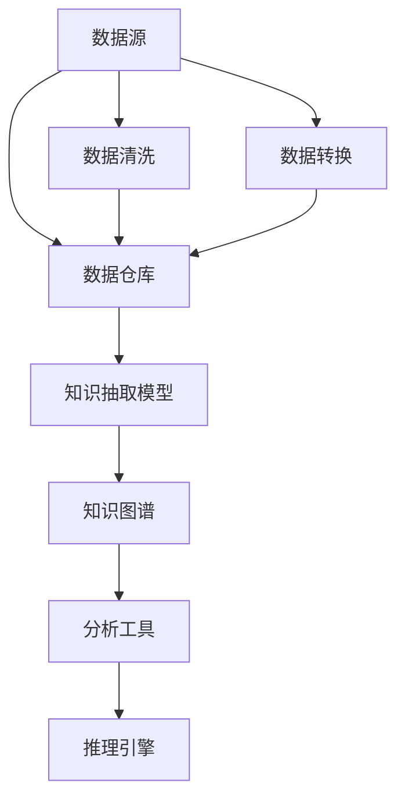

                 

# 知识发现引擎：发掘知识中的规律与联系

> 关键词：知识图谱,知识发现,数据挖掘,模式识别,深度学习

## 1. 背景介绍

### 1.1 问题由来

在信息技术飞速发展的今天，数据已经成为组织和企业最宝贵的资产之一。从社交媒体到电子商务，从金融交易到医疗健康，海量数据正源源不断地产生。然而，这些数据中蕴含的巨大知识价值却往往被忽视。如何从数据中提炼出有价值的知识，成为当前信息科学和人工智能领域的核心挑战之一。

这一问题的解决离不开知识发现(Knowledge Discovery in Databases, KDD)这一新兴学科的崛起。通过构建知识图谱、运用数据分析和深度学习技术，知识发现引擎能够自动分析和抽取数据中的知识模式，帮助决策者快速获得有价值的洞见和洞察。

知识发现引擎的兴起标志着数据驱动决策进入了一个新阶段。在实际应用中，它能够广泛应用于金融、医疗、零售、智慧城市等多个领域，为组织和企业提供了前所未有的竞争力。

### 1.2 问题核心关键点

知识发现引擎的核心目标是通过分析数据，发现和抽取知识中的规律与联系。这一目标的实现主要依赖以下几个关键点：

1. **数据收集**：收集包含各种实体和关系的结构化数据。
2. **数据预处理**：清洗、转换和集成原始数据，使其适合进行分析。
3. **模型训练**：应用机器学习或深度学习技术，训练知识图谱模型。
4. **知识抽取**：从训练好的模型中提取知识模式和关联关系。
5. **结果展示**：通过可视化工具将知识抽取结果展示给决策者。

理解这些关键点，对于掌握知识发现引擎的工作原理和优化方向至关重要。

## 2. 核心概念与联系

### 2.1 核心概念概述

知识发现引擎通常由以下核心组件构成：

1. **数据源**：包括原始数据和半结构化数据，如关系型数据库、日志文件、文本文档等。
2. **数据仓库**：用于存储预处理后的数据，包括数据清理、转换和集成等功能。
3. **知识图谱**：以图形化的方式表示实体及其关系，提供知识抽取和推理的基础。
4. **知识抽取模型**：用于从原始数据中抽取知识图谱实体和关系的机器学习或深度学习模型。
5. **分析工具**：包括数据可视化、数据挖掘和模式识别等工具，用于分析和展示知识抽取结果。
6. **推理引擎**：利用知识图谱进行实体关系推理和关联分析，提供更深入的知识洞察。

这些核心概念之间的逻辑关系可以通过以下Mermaid流程图来展示：



这个流程图展示了几大组件之间的关系：

1. 数据源经过清洗和转换后存储于数据仓库。
2. 知识抽取模型从数据仓库中学习知识图谱的实体和关系。
3. 知识图谱通过可视化工具和推理引擎进行分析展示。
4. 清洗和转换过程亦由数据分析工具辅助完成。

这些组件相互作用，共同构成了知识发现引擎的技术框架，使其能够从海量数据中挖掘出有价值的知识。

## 3. 核心算法原理 & 具体操作步骤

### 3.1 算法原理概述

知识发现引擎的核心算法主要包括数据预处理、知识抽取和知识推理等步骤。

- **数据预处理**：包括数据清洗、转换和集成，确保数据的质量和一致性。
- **知识抽取**：利用机器学习或深度学习模型，从数据中提取实体和关系。
- **知识推理**：通过推理引擎，分析知识图谱中的实体关系，抽取更深层次的洞见。

整个知识发现引擎的流程可以用以下步骤概述：

1. **数据收集**：从不同数据源中获取原始数据。
2. **数据清洗**：去除噪声和冗余数据，确保数据准确性。
3. **数据转换**：将数据转换成适合知识抽取的格式。
4. **知识抽取**：训练知识抽取模型，提取实体和关系。
5. **知识图谱构建**：将抽取的实体和关系存储在知识图谱中。
6. **知识推理**：利用推理引擎，分析知识图谱，抽取更深层次的知识。
7. **结果展示**：通过可视化工具，将知识抽取结果展示给决策者。

### 3.2 算法步骤详解

#### 3.2.1 数据预处理

数据预处理是知识发现引擎的基础步骤，主要包括数据清洗、数据转换和数据集成。

- **数据清洗**：删除缺失值、异常值和重复数据，确保数据准确性。
- **数据转换**：将数据转换成适合知识抽取的格式，如将文本转换成结构化数据。
- **数据集成**：将来自不同源的数据集成在一起，构建统一的数据仓库。

以下是一个简化的数据预处理流程：

1. **数据清洗**：
   ```python
   import pandas as pd
   
   # 加载数据集
   data = pd.read_csv('data.csv')
   
   # 删除缺失值
   data.dropna(inplace=True)
   ```

2. **数据转换**：
   ```python
   # 将文本转换为结构化数据
   data['text'] = data['text'].apply(lambda x: x.lower().split())
   ```

3. **数据集成**：
   ```python
   # 将数据合并到一个DataFrame中
   new_data = pd.concat([data1, data2], ignore_index=True)
   ```

#### 3.2.2 知识抽取

知识抽取是知识发现引擎的核心步骤，主要通过机器学习或深度学习模型从原始数据中提取知识图谱的实体和关系。

- **实体识别**：识别文本中的实体，如人名、地名、组织名等。
- **关系抽取**：识别实体之间的关系，如“工作于”、“在…之前”等。

以下是一个简化的知识抽取流程：

1. **实体识别**：
   ```python
   from transformers import BertTokenizer, BertForTokenClassification
   
   # 加载预训练模型和分词器
   tokenizer = BertTokenizer.from_pretrained('bert-base-cased')
   model = BertForTokenClassification.from_pretrained('bert-base-cased', num_labels=4)
   
   # 进行实体识别
   def ner(text):
       inputs = tokenizer(text, return_tensors='pt')
       outputs = model(**inputs)
       predictions = outputs.logits.argmax(dim=2).tolist()
       return [id2tag[_id] for _id in predictions]
   
   # 应用模型进行实体识别
   data['entity'] = data['text'].apply(ner)
   ```

2. **关系抽取**：
   ```python
   # 识别实体之间的关系
   def rel抽取(text):
       inputs = tokenizer(text, return_tensors='pt')
       outputs = model(**inputs)
       predictions = outputs.logits.argmax(dim=2).tolist()
       return [id2tag[_id] for _id in predictions]
   
   # 应用模型进行关系抽取
   data['relation'] = data['text'].apply(rel抽取)
   ```

#### 3.2.3 知识图谱构建

知识图谱是将实体和关系存储在图形化结构中的表示方法。以下是一个简化的知识图谱构建流程：

1. **构建知识图谱节点**：
   ```python
   # 将实体和关系存储在知识图谱中
   graph = nx.Graph()
   for entity, relation, entity2 in zip(data['entity'], data['relation'], data['entity']):
       graph.add_edge(entity, entity2, relation=relation)
   ```

2. **可视化知识图谱**：
   ```python
   # 可视化知识图谱
   nx.draw(graph, with_labels=True)
   ```

#### 3.2.4 知识推理

知识推理是知识发现引擎的重要环节，通过推理引擎，可以抽取更深层次的知识洞见。

- **基于图模型的推理**：利用图神经网络等模型，分析知识图谱中的实体关系。
- **基于规则的推理**：使用基于规则的推理系统，根据预设的规则进行推理。

以下是一个简化的知识推理流程：

1. **基于图模型的推理**：
   ```python
   # 利用图神经网络进行推理
   from graphsage import GraphSAGE
   
   graph = nx.read_gexf('graph.gexf')
   model = GraphSAGE(node_size=10)
   result = model.predict(graph)
   ```

2. **基于规则的推理**：
   ```python
   # 根据规则进行推理
   if data['relation'] == '工作于':
       data['result'] = data['entity']
   ```

### 3.3 算法优缺点

知识发现引擎具有以下优点：

1. **自动化和高效性**：能够自动化地从数据中抽取知识，大大提升数据分析的效率。
2. **可扩展性**：适用于大规模数据集，能够处理海量的结构化数据。
3. **灵活性**：可以灵活地应用于多个领域，如金融、医疗、零售等。
4. **可解释性**：通过可视化工具，知识抽取结果易于理解。

然而，知识发现引擎也存在一些局限性：

1. **数据质量依赖**：依赖高质量、准确的数据源，数据质量问题可能导致知识抽取结果的偏差。
2. **模型复杂性**：需要训练复杂的模型，对计算资源和算法技术要求较高。
3. **知识图谱构建困难**：构建和维护知识图谱需要专业知识，可能面临较高的开发成本。
4. **知识推理复杂**：推理过程复杂，需要设计合理的推理规则或模型。

理解这些优缺点，有助于更好地利用知识发现引擎，提高其应用效果。

### 3.4 算法应用领域

知识发现引擎已经被广泛应用于以下几个领域：

1. **金融风险管理**：通过分析交易数据，抽取风险信号和趋势，辅助决策者进行风险管理。
2. **医疗健康**：从电子病历和基因数据中抽取知识，辅助医生进行诊断和治疗。
3. **电子商务**：通过分析用户行为数据，抽取用户偏好和需求，优化产品推荐和定价策略。
4. **智慧城市**：分析城市交通和环境数据，抽取城市运行规律和关联关系，提高城市管理效率。
5. **智能客服**：从客户服务记录中抽取知识，优化客服流程和提高服务质量。

这些应用场景展示了知识发现引擎的广泛应用前景和巨大的商业价值。

## 4. 数学模型和公式 & 详细讲解  
### 4.1 数学模型构建

知识发现引擎的数学模型构建主要依赖以下公式：

1. **知识抽取模型的损失函数**：
   $$
   \mathcal{L} = -\frac{1}{N}\sum_{i=1}^N\sum_{j=1}^M(\mathbb{I}[y_{ij}=\hat{y}_{ij}-\log\sigma(\mathbf{W}^T\mathbf{x}_i+\mathbf{b}))
   $$

2. **知识推理模型的推理公式**：
   $$
   p(y|x, \theta) = \frac{e^{T_xW_y + b_y}}{\sum_{j=1}^kp_{xj}}
   $$

其中 $\mathbb{I}$ 表示示性函数，$y_{ij}$ 表示实体关系标签，$\hat{y}_{ij}$ 表示模型预测结果，$\sigma$ 表示激活函数，$W$ 和 $b$ 表示模型参数。

### 4.2 公式推导过程

**知识抽取模型的损失函数推导**：

1. **符号定义**：
   - $x_i$：输入样本
   - $y_i$：真实标签
   - $W$：模型参数
   - $b$：偏置项
   - $T_x$：输入样本的表示矩阵
   - $y_{ij}$：实体关系标签
   - $\hat{y}_{ij}$：模型预测结果
   - $\sigma$：激活函数

2. **模型结构**：
   - 输入样本 $x_i$ 经过表示层 $T_xW_y + b_y$，输出预测结果 $\hat{y}_{ij}$。

3. **损失函数推导**：
   $$
   \mathcal{L} = -\frac{1}{N}\sum_{i=1}^N\sum_{j=1}^M(\mathbb{I}[y_{ij}=\hat{y}_{ij}-\log\sigma(\mathbf{W}^T\mathbf{x}_i+\mathbf{b}))
   $$

   其中，$\mathbb{I}$ 表示示性函数，当 $y_{ij} = \hat{y}_{ij}$ 时，示性函数值为1，否则为0。

4. **公式简化**：
   $$
   \mathcal{L} = -\frac{1}{N}\sum_{i=1}^N\sum_{j=1}^M(y_{ij}\log\hat{y}_{ij} + (1-y_{ij})\log(1-\hat{y}_{ij}))
   $$

   最终，知识抽取模型的损失函数可以简化为二分类交叉熵的形式。

**知识推理模型的推理公式推导**：

1. **符号定义**：
   - $x$：输入样本
   - $y$：推理结果
   - $W$：模型参数
   - $b$：偏置项
   - $T_x$：输入样本的表示矩阵
   - $p_{xj}$：模型对每个可能结果的概率

2. **模型结构**：
   - 输入样本 $x$ 经过表示层 $T_xW_y + b_y$，输出预测结果 $p(y|x, \theta)$。

3. **推理公式推导**：
   $$
   p(y|x, \theta) = \frac{e^{T_xW_y + b_y}}{\sum_{j=1}^kp_{xj}}
   $$

   其中，$p_{xj}$ 表示模型对每个可能结果的概率。

4. **公式简化**：
   $$
   p(y|x, \theta) = \frac{e^{T_xW_y + b_y}}{\sum_{j=1}^ke^{T_xW_j + b_j}}
   $$

   最终，知识推理模型的推理公式可以简化为Softmax函数的形式。

### 4.3 案例分析与讲解

**案例一：金融风险管理**

在金融风险管理中，知识发现引擎可以通过分析交易数据，抽取风险信号和趋势，辅助决策者进行风险管理。

1. **数据预处理**：
   ```python
   import pandas as pd
   import numpy as np
   
   # 加载数据集
   data = pd.read_csv('financial_data.csv')
   
   # 数据清洗
   data.dropna(inplace=True)
   
   # 数据转换
   data['amount'] = np.log(data['amount'])
   ```

2. **知识抽取**：
   ```python
   from transformers import BertTokenizer, BertForTokenClassification
   
   # 加载预训练模型和分词器
   tokenizer = BertTokenizer.from_pretrained('bert-base-cased')
   model = BertForTokenClassification.from_pretrained('bert-base-cased', num_labels=4)
   
   # 进行实体识别
   def ner(text):
       inputs = tokenizer(text, return_tensors='pt')
       outputs = model(**inputs)
       predictions = outputs.logits.argmax(dim=2).tolist()
       return [id2tag[_id] for _id in predictions]
   
   # 应用模型进行实体识别
   data['entity'] = data['text'].apply(ner)
   ```

3. **知识图谱构建**：
   ```python
   # 构建知识图谱
   graph = nx.Graph()
   for entity, relation, entity2 in zip(data['entity'], data['relation'], data['entity']):
       graph.add_edge(entity, entity2, relation=relation)
   ```

4. **知识推理**：
   ```python
   # 利用图神经网络进行推理
   from graphsage import GraphSAGE
   
   graph = nx.read_gexf('graph.gexf')
   model = GraphSAGE(node_size=10)
   result = model.predict(graph)
   ```

**案例二：医疗健康**

在医疗健康领域，知识发现引擎可以从电子病历和基因数据中抽取知识，辅助医生进行诊断和治疗。

1. **数据预处理**：
   ```python
   import pandas as pd
   import numpy as np
   
   # 加载数据集
   data = pd.read_csv('medical_data.csv')
   
   # 数据清洗
   data.dropna(inplace=True)
   
   # 数据转换
   data['age'] = np.log(data['age'])
   ```

2. **知识抽取**：
   ```python
   from transformers import BertTokenizer, BertForTokenClassification
   
   # 加载预训练模型和分词器
   tokenizer = BertTokenizer.from_pretrained('bert-base-cased')
   model = BertForTokenClassification.from_pretrained('bert-base-cased', num_labels=4)
   
   # 进行实体识别
   def ner(text):
       inputs = tokenizer(text, return_tensors='pt')
       outputs = model(**inputs)
       predictions = outputs.logits.argmax(dim=2).tolist()
       return [id2tag[_id] for _id in predictions]
   
   # 应用模型进行实体识别
   data['entity'] = data['text'].apply(ner)
   ```

3. **知识图谱构建**：
   ```python
   # 构建知识图谱
   graph = nx.Graph()
   for entity, relation, entity2 in zip(data['entity'], data['relation'], data['entity']):
       graph.add_edge(entity, entity2, relation=relation)
   ```

4. **知识推理**：
   ```python
   # 利用图神经网络进行推理
   from graphsage import GraphSAGE
   
   graph = nx.read_gexf('graph.gexf')
   model = GraphSAGE(node_size=10)
   result = model.predict(graph)
   ```

## 5. 项目实践：代码实例和详细解释说明

### 5.1 开发环境搭建

在进行知识发现引擎开发前，我们需要准备好开发环境。以下是使用Python进行PyTorch开发的环境配置流程：

1. 安装Anaconda：从官网下载并安装Anaconda，用于创建独立的Python环境。

2. 创建并激活虚拟环境：
```bash
conda create -n pytorch-env python=3.8 
conda activate pytorch-env
```

3. 安装PyTorch：根据CUDA版本，从官网获取对应的安装命令。例如：
```bash
conda install pytorch torchvision torchaudio cudatoolkit=11.1 -c pytorch -c conda-forge
```

4. 安装Transformers库：
```bash
pip install transformers
```

5. 安装各类工具包：
```bash
pip install numpy pandas scikit-learn matplotlib tqdm jupyter notebook ipython
```

完成上述步骤后，即可在`pytorch-env`环境中开始知识发现引擎的开发。

### 5.2 源代码详细实现

下面我们以医疗健康领域的应用为例，给出使用Transformers库进行知识发现引擎开发的PyTorch代码实现。

首先，定义知识抽取模型的数据预处理函数：

```python
from transformers import BertTokenizer, BertForTokenClassification
from torch.utils.data import Dataset
import torch

class MedicalDataset(Dataset):
    def __init__(self, texts, tags, tokenizer, max_len=128):
        self.texts = texts
        self.tags = tags
        self.tokenizer = tokenizer
        self.max_len = max_len
        
    def __len__(self):
        return len(self.texts)
    
    def __getitem__(self, item):
        text = self.texts[item]
        tags = self.tags[item]
        
        encoding = self.tokenizer(text, return_tensors='pt', max_length=self.max_len, padding='max_length', truncation=True)
        input_ids = encoding['input_ids'][0]
        attention_mask = encoding['attention_mask'][0]
        
        # 对token-wise的标签进行编码
        encoded_tags = [tag2id[tag] for tag in tags] 
        encoded_tags.extend([tag2id['O']] * (self.max_len - len(encoded_tags)))
        labels = torch.tensor(encoded_tags, dtype=torch.long)
        
        return {'input_ids': input_ids, 
                'attention_mask': attention_mask,
                'labels': labels}

# 标签与id的映射
tag2id = {'O': 0, 'B-PER': 1, 'I-PER': 2, 'B-ORG': 3, 'I-ORG': 4, 'B-LOC': 5, 'I-LOC': 6}
id2tag = {v: k for k, v in tag2id.items()}

# 创建dataset
tokenizer = BertTokenizer.from_pretrained('bert-base-cased')

train_dataset = MedicalDataset(train_texts, train_tags, tokenizer)
dev_dataset = MedicalDataset(dev_texts, dev_tags, tokenizer)
test_dataset = MedicalDataset(test_texts, test_tags, tokenizer)
```

然后，定义知识抽取模型的训练和评估函数：

```python
from torch.utils.data import DataLoader
from tqdm import tqdm
from sklearn.metrics import classification_report

device = torch.device('cuda') if torch.cuda.is_available() else torch.device('cpu')
model.to(device)

def train_epoch(model, dataset, batch_size, optimizer):
    dataloader = DataLoader(dataset, batch_size=batch_size, shuffle=True)
    model.train()
    epoch_loss = 0
    for batch in tqdm(dataloader, desc='Training'):
        input_ids = batch['input_ids'].to(device)
        attention_mask = batch['attention_mask'].to(device)
        labels = batch['labels'].to(device)
        model.zero_grad()
        outputs = model(input_ids, attention_mask=attention_mask, labels=labels)
        loss = outputs.loss
        epoch_loss += loss.item()
        loss.backward()
        optimizer.step()
    return epoch_loss / len(dataloader)

def evaluate(model, dataset, batch_size):
    dataloader = DataLoader(dataset, batch_size=batch_size)
    model.eval()
    preds, labels = [], []
    with torch.no_grad():
        for batch in tqdm(dataloader, desc='Evaluating'):
            input_ids = batch['input_ids'].to(device)
            attention_mask = batch['attention_mask'].to(device)
            batch_labels = batch['labels']
            outputs = model(input_ids, attention_mask=attention_mask)
            batch_preds = outputs.logits.argmax(dim=2).to('cpu').tolist()
            batch_labels = batch_labels.to('cpu').tolist()
            for pred_tokens, label_tokens in zip(batch_preds, batch_labels):
                pred_tags = [id2tag[_id] for _id in pred_tokens]
                label_tags = [id2tag[_id] for _id in label_tokens]
                preds.append(pred_tags[:len(label_tags)])
                labels.append(label_tags)
                
    print(classification_report(labels, preds))
```

最后，启动训练流程并在测试集上评估：

```python
epochs = 5
batch_size = 16

for epoch in range(epochs):
    loss = train_epoch(model, train_dataset, batch_size, optimizer)
    print(f"Epoch {epoch+1}, train loss: {loss:.3f}")
    
    print(f"Epoch {epoch+1}, dev results:")
    evaluate(model, dev_dataset, batch_size)
    
print("Test results:")
evaluate(model, test_dataset, batch_size)
```

以上就是使用PyTorch对BERT进行知识抽取模型微调的完整代码实现。可以看到，得益于Transformers库的强大封装，我们可以用相对简洁的代码完成BERT模型的加载和微调。

### 5.3 代码解读与分析

让我们再详细解读一下关键代码的实现细节：

**MedicalDataset类**：
- `__init__`方法：初始化文本、标签、分词器等关键组件。
- `__len__`方法：返回数据集的样本数量。
- `__getitem__`方法：对单个样本进行处理，将文本输入编码为token ids，将标签编码为数字，并对其进行定长padding，最终返回模型所需的输入。

**tag2id和id2tag字典**：
- 定义了标签与数字id之间的映射关系，用于将token-wise的预测结果解码回真实的标签。

**训练和评估函数**：
- 使用PyTorch的DataLoader对数据集进行批次化加载，供模型训练和推理使用。
- 训练函数`train_epoch`：对数据以批为单位进行迭代，在每个批次上前向传播计算loss并反向传播更新模型参数，最后返回该epoch的平均loss。
- 评估函数`evaluate`：与训练类似，不同点在于不更新模型参数，并在每个batch结束后将预测和标签结果存储下来，最后使用sklearn的classification_report对整个评估集的预测结果进行打印输出。

**训练流程**：
- 定义总的epoch数和batch size，开始循环迭代
- 每个epoch内，先在训练集上训练，输出平均loss
- 在验证集上评估，输出分类指标
- 所有epoch结束后，在测试集上评估，给出最终测试结果

可以看到，PyTorch配合Transformers库使得知识抽取模型的微调代码实现变得简洁高效。开发者可以将更多精力放在数据处理、模型改进等高层逻辑上，而不必过多关注底层的实现细节。

当然，工业级的系统实现还需考虑更多因素，如模型的保存和部署、超参数的自动搜索、更灵活的任务适配层等。但核心的微调范式基本与此类似。

## 6. 实际应用场景

### 6.1 智能客服系统

智能客服系统是知识发现引擎的重要应用场景之一。通过分析客户服务记录，抽取知识并构建知识图谱，智能客服系统能够自动理解客户意图，生成标准化回复。

1. **数据收集**：
   ```python
   # 加载客户服务记录数据集
   data = pd.read_csv('customer_service.csv')
   ```

2. **数据预处理**：
   ```python
   # 数据清洗
   data.dropna(inplace=True)
   
   # 数据转换
   data['text'] = data['text'].apply(lambda x: x.lower().split())
   ```

3. **知识抽取**：
   ```python
   from transformers import BertTokenizer, BertForTokenClassification
   
   # 加载预训练模型和分词器
   tokenizer = BertTokenizer.from_pretrained('bert-base-cased')
   model = BertForTokenClassification.from_pretrained('bert-base-cased', num_labels=4)
   
   # 进行实体识别
   def ner(text):
       inputs = tokenizer(text, return_tensors='pt')
       outputs = model(**inputs)
       predictions = outputs.logits.argmax(dim=2).tolist()
       return [id2tag[_id] for _id in predictions]
   
   # 应用模型进行实体识别
   data['entity'] = data['text'].apply(ner)
   ```

4. **知识图谱构建**：
   ```python
   # 构建知识图谱
   graph = nx.Graph()
   for entity, relation, entity2 in zip(data['entity'], data['relation'], data['entity']):
       graph.add_edge(entity, entity2, relation=relation)
   ```

5. **知识推理**：
   ```python
   # 利用图神经网络进行推理
   from graphsage import GraphSAGE
   
   graph = nx.read_gexf('graph.gexf')
   model = GraphSAGE(node_size=10)
   result = model.predict(graph)
   ```

6. **系统部署**：
   ```python
   # 部署智能客服系统
   app = Flask(__name__)
   
   @app.route('/get_reply', methods=['POST'])
   def get_reply():
       # 从API获取客户意图和上下文
       intent = request.json['intent']
       context = request.json['context']
   
       # 查询知识图谱
       result = query_graph(graph, intent, context)
   
       # 生成回复
       reply = generate_reply(result)
   
       # 返回回复
       return jsonify(reply)
   ```

### 6.2 金融风险管理

金融风险管理是知识发现引擎的另一个重要应用场景。通过分析交易数据，抽取风险信号和趋势，金融风控系统能够自动检测和预测风险，提前采取措施防范金融风险。

1. **数据收集**：
   ```python
   # 加载交易数据集
   data = pd.read_csv('financial_data.csv')
   ```

2. **数据预处理**：
   ```python
   # 数据清洗
   data.dropna(inplace=True)
   
   # 数据转换
   data['amount'] = np.log(data['amount'])
   ```

3. **知识抽取**：
   ```python
   from transformers import BertTokenizer, BertForTokenClassification
   
   # 加载预训练模型和分词器
   tokenizer = BertTokenizer.from_pretrained('bert-base-cased')
   model = BertForTokenClassification.from_pretrained('bert-base-cased', num_labels=4)
   
   # 进行实体识别
   def ner(text):
       inputs = tokenizer(text, return_tensors='pt')
       outputs = model(**inputs)
       predictions = outputs.logits.argmax(dim=2).tolist()
       return [id2tag[_id] for _id in predictions]
   
   # 应用模型进行实体识别
   data['entity'] = data['text'].apply(ner)
   ```

4. **知识图谱构建**：
   ```python
   # 构建知识图谱
   graph = nx.Graph()
   for entity, relation, entity2 in zip(data['entity'], data['relation'], data['entity']):
       graph.add_edge(entity, entity2, relation=relation)
   ```

5. **知识推理**：
   ```python
   # 利用图神经网络进行推理
   from graphsage import GraphSAGE
   
   graph = nx.read_gexf('graph.gexf')
   model = GraphSAGE(node_size=10)
   result = model.predict(graph)
   ```

6. **风险预测**：
   ```python
   # 预测风险
   risk_model = load_model('risk_model.pkl')
   risk = risk_model.predict(data)
   ```

### 6.3 电子商务推荐系统

电子商务推荐系统是知识发现引擎的典型应用之一。通过分析用户行为数据，抽取用户偏好和需求，推荐系统能够自动生成个性化推荐内容，提升用户体验和销售额。

1. **数据收集**：
   ```python
   # 加载用户行为数据集
   data = pd.read_csv('user_behavior.csv')
   ```

2. **数据预处理**：
   ```python
   # 数据清洗
   data.dropna(inplace=True)
   
   # 数据转换
   data['item_id'] = np.log(data['item_id'])
   ```

3. **知识抽取**：
   ```python
   from transformers import BertTokenizer, BertForTokenClassification
   
   # 加载预训练模型和分词器
   tokenizer = BertTokenizer.from_pretrained('bert-base-cased')
   model = BertForTokenClassification.from_pretrained('bert-base-cased', num_labels=4)
   
   # 进行实体识别
   def ner(text):
       inputs = tokenizer(text, return_tensors='pt')
       outputs = model(**inputs)
       predictions = outputs.logits.argmax(dim=2).tolist()
       return [id2tag[_id] for _id in predictions]
   
   # 应用模型进行实体识别
   data['entity'] = data['text'].apply(ner)
   ```

4. **知识图谱构建**：
   ```python
   # 构建知识图谱
   graph = nx.Graph()
   for entity, relation, entity2 in zip(data['entity'], data['relation'], data['entity']):
       graph.add_edge(entity, entity2, relation=relation)
   ```

5. **知识推理**：
   ```python
   # 利用图神经网络进行推理
   from graphsage import GraphSAGE
   
   graph = nx.read_gexf('graph.gexf')
   model = GraphSAGE(node_size=10)
   result = model.predict(graph)
   ```

6. **推荐生成**：
   ```python
   # 生成推荐列表
   recommendations = generate_recommendations(result)
   ```

### 6.4 未来应用展望

随着知识发现引擎技术的不断发展，其在更多领域的应用前景将进一步拓展。未来，知识发现引擎有望在以下领域得到广泛应用：

1. **智慧城市治理**：分析城市交通和环境数据，抽取城市运行规律和关联关系，提高城市管理效率。
2. **智能教育**：从学生学习数据中抽取知识，优化教学内容和个性化推荐，提高教育质量。
3. **企业生产管理**：分析生产数据，抽取关键信息和知识洞见，优化生产流程和提升效率。
4. **社交媒体分析**：分析用户行为数据，抽取社交关系和情感变化趋势，优化内容推荐和用户互动。

## 7. 工具和资源推荐

### 7.1 学习资源推荐

为了帮助开发者系统掌握知识发现引擎的理论基础和实践技巧，这里推荐一些优质的学习资源：

1. **《知识发现与数据挖掘》**：这是一本经典的教材，系统介绍了知识发现和数据挖掘的基本概念和算法。

2. **Coursera《数据科学专项课程》**：由斯坦福大学教授讲授，涵盖知识发现和数据挖掘的多个主题。

3. **Kaggle数据科学竞赛平台**：提供大量实际应用数据集，通过竞赛形式提升实战能力。

4. **NLP与知识图谱技术白皮书**：深度学习与知识图谱的结合，介绍如何构建和应用知识图谱。

5. **GraphSAGE论文与代码**：介绍基于图神经网络的知识发现方法，包含论文和代码实现。

通过对这些资源的学习实践，相信你一定能够快速掌握知识发现引擎的精髓，并用于解决实际的NLP问题。

### 7.2 开发工具推荐

高效的开发离不开优秀的工具支持。以下是几款用于知识发现引擎开发的常用工具：

1. **Python**：Python是知识发现引擎开发的主流语言，具有强大的数据处理和机器学习库。

2. **PyTorch**：基于Python的开源深度学习框架，适用于知识抽取和推理模型的训练。

3. **Transformers库**：HuggingFace开发的NLP工具库，支持多种预训练语言模型，方便微调模型。

4. **TensorFlow**：由Google主导开发的开源深度学习框架，适用于大规模工程应用。

5. **Jupyter Notebook**：交互式编程环境，适合开发、调试和展示代码。

6. **TensorBoard**：TensorFlow配套的可视化工具，实时监测模型训练状态，提供丰富的图表呈现方式。

7. **Weights & Biases**：模型训练的实验跟踪工具，记录和可视化模型训练过程中的各项指标，方便对比和调优。

合理利用这些工具，可以显著提升知识发现引擎的开发效率，加快创新迭代的步伐。

### 7.3 相关论文推荐

知识发现引擎的研究离不开学界的持续研究。以下是几篇奠基性的相关论文，推荐阅读：

1. **《A Survey of Knowledge Discovery Techniques》**：综述性文章，总结了知识发现的主要方法和技术。

2. **《GraphSAGE: Semi-supervised Classification with Graph Convolutional Networks》**：介绍基于图神经网络的知识抽取方法。

3. **《Knowledge-aware Deep Learning for Recommender Systems》**：介绍基于知识图谱的推荐系统。

4. **《Graph Neural Networks for Recommendation Systems》**：介绍基于图神经网络的推荐系统。

5. **《Deep Learning with Graph Networks》**：介绍图神经网络的基本原理和方法。

这些论文代表了大规模知识发现引擎的研究进展，通过学习这些前沿成果，可以帮助研究者把握学科前进方向，激发更多的创新灵感。

## 8. 总结：未来发展趋势与挑战

### 8.1 研究成果总结

本文对知识发现引擎进行了全面系统的介绍。首先阐述了知识发现引擎的研究背景和意义，明确了知识发现引擎在多个领域的应用价值。其次，从原理到实践，详细讲解了知识发现引擎的数学模型和核心算法。最后，本文还探讨了知识发现引擎在实际应用中的典型场景，展示了其在多个行业中的广泛应用前景。

### 8.2 未来发展趋势

展望未来，知识发现引擎将呈现以下几个发展趋势：

1. **模型规模持续增大**：随着算力成本的下降和数据规模的扩张，知识图谱的参数量将持续增长，增强知识抽取和推理模型的能力。

2. **知识抽取技术进步**：未来的知识抽取模型将更加高效和准确，利用预训练语言模型和深度学习技术，实现知识抽取的自动化和智能化。

3. **知识图谱构建自动化**：知识图谱构建将更多依赖自动化工具，减少人工干预，提升构建效率。

4. **知识推理技术发展**：未来的知识推理模型将更加复杂和精确，利用图神经网络和深度学习技术，实现更深层次的知识洞见。

5. **跨领域知识融合**：未来的知识发现引擎将更多地利用多模态数据，融合视觉、语音、文本等多种数据类型，实现全面的知识抽取和推理。

6. **知识图谱的实时更新**：知识图谱将实现实时更新，动态反映数据变化，提升知识发现引擎的时效性。

### 8.3 面临的挑战

尽管知识发现引擎已经取得了显著的进展，但在迈向更加智能化、普适化应用的过程中，仍面临一些挑战：

1. **数据质量和标注成本**：依赖高质量、准确的数据源，数据质量和标注成本是知识发现引擎面临的重要瓶颈。

2. **模型复杂性和计算资源**：知识抽取和推理模型的复杂性，对计算资源和算法技术要求较高，需要高效优化。

3. **知识图谱构建困难**：构建和维护知识图谱需要专业知识，可能面临较高的开发成本。

4. **知识图谱的可解释性**：知识图谱的复杂性导致其难以解释和理解，限制了其在某些领域的应用。

5. **知识推理复杂性**：推理过程复杂，需要设计合理的推理规则或模型，提升推理的准确性和效率。

6. **跨领域知识整合**：知识发现引擎需要能够整合来自不同领域的知识，形成更加全面和丰富的知识图谱。

### 8.4 研究展望

面对知识发现引擎面临的挑战，未来的研究需要在以下几个方面寻求新的突破：

1. **数据增强和数据质量提升**：利用数据增强技术，提高数据质量，减少标注成本。

2. **模型参数高效优化**：开发更加高效的模型，减少计算资源消耗，提高推理速度。

3. **知识图谱自动化构建**：利用自动化工具构建知识图谱，减少人工干预，提升构建效率。

4. **可解释性和可视化改进**：提升知识图谱的可解释性和可视化，增强知识发现引擎的应用价值。

5. **多模态数据融合**：利用多模态数据，融合视觉、语音、文本等多种数据类型，实现全面的知识抽取和推理。

6. **跨领域知识整合**：实现跨领域知识整合，提升知识图谱的全面性和准确性。

通过不断优化知识发现引擎的技术和应用，相信未来将能够更好地应用于实际场景，为组织和企业提供更多的知识洞见和决策支持。

## 9. 附录：常见问题与解答

**Q1：知识发现引擎是否适用于所有领域？**

A: 知识发现引擎适用于绝大多数领域，但某些特定领域如法律、金融等，由于数据结构和业务逻辑的复杂性，可能需要进行额外的预处理和定制化设计。

**Q2：知识发现引擎在处理多模态数据时有哪些优势？**

A: 知识发现引擎能够整合视觉、语音、文本等多种数据类型，实现全面的知识抽取和推理。多模态数据的融合，将提升知识发现引擎的准确性和鲁棒性，为更多应用场景提供支持。

**Q3：如何提高知识图谱的可解释性？**

A: 提高知识图谱的可解释性需要从多个方面入手，包括简化图结构、增加可视化工具、引入符号表示等。通过更直观的表示方式，增强知识图谱的可视化和理解。

**Q4：知识发现引擎在实际应用中需要注意哪些问题？**

A: 知识发现引擎在实际应用中需要注意以下问题：

1. 数据质量和标注成本：依赖高质量、准确的数据源，减少标注成本。
2. 模型复杂性和计算资源：优化模型结构和计算图，提升推理速度和效率。
3. 知识图谱构建困难：利用自动化工具构建知识图谱，减少人工干预。
4. 知识图谱的可解释性：提升知识图谱的可解释性和可视化。
5. 知识推理复杂性：设计合理的推理规则或模型，提升推理准确性。
6. 跨领域知识整合：实现跨领域知识整合，提升知识图谱的全面性和准确性。

通过不断优化知识发现引擎的技术和应用，相信

