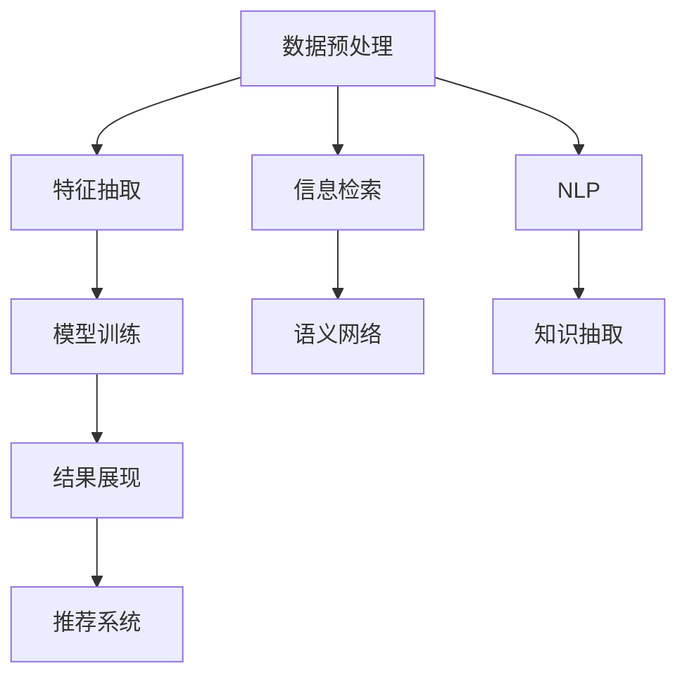

                 

# 知识发现引擎：开启人类知识新时代

## 1. 背景介绍

在数字时代，人类知识的总量呈指数级增长。从书籍、期刊到学术论文、Web内容，再到社交媒体、视频平台，信息的洪流滚滚而来，难以驾驭。如何从海量数据中提取有价值的知识，提升决策质量，已经成为各行各业面临的巨大挑战。

这一问题催生了知识发现引擎(Knowledge Discovery Engine, KDE)的出现。知识发现引擎是一种集数据预处理、特征抽取、模型训练、结果展现于一体的综合性智能平台。它能够自动地、高效地从数据中挖掘出有价值的知识，辅助用户进行决策分析。

本文将全面系统地介绍知识发现引擎的核心原理、核心算法和应用实践，深入剖析其在医疗、金融、电商等领域的典型应用案例，展望未来发展趋势，并提供技术实践和资源推荐的指导。

## 2. 核心概念与联系

### 2.1 核心概念概述

知识发现引擎的核心概念包括：

- **知识发现(Knowledge Discovery, KD)**：从大规模数据中自动提取和挖掘出有价值的模式、规则、趋势等知识，辅助决策分析。

- **知识抽取(Knowledge Extraction, KE)**：从结构化数据中自动抽取实体、关系、事件等信息，构建知识图谱。

- **信息检索(Information Retrieval, IR)**：从非结构化文本中检索出相关的信息、知识，辅助自然语言处理和语义理解。

- **自然语言处理(Natural Language Processing, NLP)**：将非结构化文本转化为结构化知识，进行语义分析和信息提取。

- **语义网络(Semantic Network)**：以节点表示实体和概念，以边表示它们之间的关系，构建语义化的知识图谱。

- **推荐系统(Recommendation System, RS)**：基于用户行为和兴趣，自动推荐相关的产品、服务、内容等，提高用户体验。

这些核心概念通过数据预处理、特征抽取、模型训练、结果展现等流程，共同构成了知识发现引擎的完整工作流。以下将详细阐述知识发现引擎的工作原理和关键技术。

### 2.2 核心概念原理和架构的 Mermaid 流程图



通过上述流程图，我们可以清晰地看到知识发现引擎的工作流程：从原始数据出发，经过预处理、特征抽取和模型训练，生成结构化知识；再通过信息检索和自然语言处理获取非结构化文本信息；最后构建语义网络进行知识抽取，并应用推荐系统进行个性化推荐。

## 3. 核心算法原理 & 具体操作步骤

### 3.1 算法原理概述

知识发现引擎的算法原理可以概括为以下几步：

1. **数据预处理**：清洗、标准化、归一化原始数据，去除噪声，提升数据质量。

2. **特征抽取**：从预处理后的数据中提取有用的特征，构建特征向量。常用的特征提取方法包括词袋模型、TF-IDF、词嵌入等。

3. **模型训练**：利用机器学习算法，训练出能够捕捉数据特征的模型。常见的算法包括支持向量机(SVM)、随机森林(Random Forest)、深度学习(Deep Learning)等。

4. **结果展现**：将训练出的模型应用于新数据，生成知识发现结果，并以易于理解的格式展现给用户。

### 3.2 算法步骤详解

#### 3.2.1 数据预处理

数据预处理是知识发现引擎的第一步，主要包括以下操作：

- **清洗**：删除无关数据、噪声数据和重复数据，确保数据的纯净度。
- **标准化**：将数据转换为统一的标准格式，便于后续处理。
- **归一化**：将数据缩放到相同范围，减少特征间的差异，提高模型训练效率。
- **特征选择**：选择最有信息量的特征，减少模型复杂度。

#### 3.2.2 特征抽取

特征抽取是知识发现引擎的核心步骤，通过以下方法进行：

- **词袋模型(Bag of Words, BOW)**：将文本拆分为单词序列，统计每个单词的出现频率，构建特征向量。
- **TF-IDF**：计算单词的词频-逆文档频率(Term Frequency-Inverse Document Frequency)，评估单词的重要性。
- **词嵌入(Word Embedding)**：将单词映射到低维向量空间，保留语义信息。

#### 3.2.3 模型训练

模型训练是知识发现引擎的关键步骤，通过以下方法进行：

- **支持向量机(Support Vector Machine, SVM)**：利用核函数将数据映射到高维空间，找到最优分割超平面。
- **随机森林(Random Forest)**：构建多个决策树，通过投票方式综合判断。
- **深度学习(Deep Learning)**：利用多层神经网络提取高层次特征，进行复杂模式识别。

#### 3.2.4 结果展现

结果展现是知识发现引擎的输出阶段，通过以下方法进行：

- **表格形式**：将知识发现结果以表格形式展现，便于用户直接阅读。
- **可视化图表**：绘制柱状图、饼图、散点图等，直观展示数据特征。
- **交互式界面**：提供交互式查询界面，用户可自定义查询条件，获取精确结果。

### 3.3 算法优缺点

知识发现引擎的算法具有以下优点：

- **自动化高效**：自动化处理数据预处理、特征抽取、模型训练等环节，提升效率。
- **灵活性高**：适用于各种数据类型和业务场景，能够灵活适应不同需求。
- **易于部署**：集成度高，支持多种模型和工具，便于部署和维护。

但同时也存在以下缺点：

- **数据依赖性高**：数据质量直接影响到结果的准确性。
- **计算资源需求大**：模型训练和特征提取需要大量计算资源。
- **结果可解释性不足**：黑盒模型难以解释其内部机制，缺乏透明性。

### 3.4 算法应用领域

知识发现引擎在多个领域具有广泛应用，例如：

- **医疗领域**：利用病历数据和医疗文献，发现疾病关联和疗效规律，辅助诊断和治疗。
- **金融领域**：分析交易数据和市场报告，发现股票价格波动趋势和投资机会，进行风险评估和投资决策。
- **电商领域**：分析用户行为和产品评论，发现购买趋势和推荐规则，提升用户体验和销售转化率。
- **市场营销**：分析广告投放数据和消费者反馈，发现市场热点和用户需求，优化广告策略和产品设计。
- **情报分析**：分析开放数据和网络舆情，发现社会动态和情报信息，辅助政策制定和舆情监控。

## 4. 数学模型和公式 & 详细讲解 & 举例说明

### 4.1 数学模型构建

知识发现引擎的数学模型可以构建为以下形式：

$$
M = \min_{\theta} \frac{1}{N}\sum_{i=1}^N \ell(M(x_i), y_i) + \lambda R(\theta)
$$

其中 $M$ 为模型参数，$x_i$ 为输入数据，$y_i$ 为输出标签，$\ell$ 为损失函数，$R$ 为正则化项，$\lambda$ 为正则化强度。

### 4.2 公式推导过程

以支持向量机(SVM)为例，其推导过程如下：

- **决策边界**：找到一个最优超平面 $w\cdot x+b=0$，使得两类数据点尽可能远离超平面，并最大化超平面到最近数据点的距离（即间隔）。

- **间隔最大化**：将决策边界转化为间隔最大化问题，目标为最大化间隔 $g(x)=\frac{1}{2}\|w\|^2+\frac{1}{\gamma}\sum_{i=1}^N\xi_i$，其中 $\xi_i$ 为松弛变量，$\gamma$ 为惩罚系数。

- **软间隔**：对于不可分数据，使用软间隔，允许一定误分类情况。目标转化为：

$$
\min_{w,b} \frac{1}{2}\|w\|^2+\frac{1}{\gamma}\sum_{i=1}^N\xi_i + C\sum_{i=1}^N\xi_i
$$

- **对偶问题**：将原始问题转化为对偶问题，使用拉格朗日乘子 $\alpha$ 和 $b$，最终转化为：

$$
\max_{\alpha}\sum_{i=1}^N\alpha_i-\frac{1}{2}\sum_{i,j=1}^N\alpha_i\alpha_j y_i y_j <x_i, x_j> - \sum_{i=1}^N\alpha_i
$$

其中 $y_i$ 为类别标签，$<x_i, x_j>$ 为内积。

### 4.3 案例分析与讲解

以金融风险评估为例，分析其知识发现引擎的构建过程：

1. **数据预处理**：清洗历史交易数据，标准化股票价格和交易量，删除异常数据。

2. **特征抽取**：提取交易量、换手率、市盈率、市值等特征，构建特征向量。

3. **模型训练**：使用支持向量机，训练出分类器，预测股票价格变化趋势。

4. **结果展现**：将预测结果以表格形式展现，提供趋势图和风险提示。

## 5. 项目实践：代码实例和详细解释说明

### 5.1 开发环境搭建

知识发现引擎的开发环境主要包括以下组件：

- **Python**：Python语言广泛用于数据处理和机器学习。
- **NumPy**：高效的多维数组运算库，常用在数据处理和特征抽取。
- **Pandas**：数据处理和分析库，支持数据清洗、标准化和归一化。
- **Scikit-learn**：机器学习库，提供多种模型训练算法和工具。
- **TensorFlow/Keras**：深度学习框架，支持复杂的神经网络模型构建。
- **Seaborn/Matplotlib**：数据可视化库，支持图表绘制和展示。
- **Jupyter Notebook**：交互式编程环境，支持代码编写和结果展示。

以下以Scikit-learn为例，演示知识发现引擎的开发环境搭建：

```bash
pip install numpy pandas scikit-learn seaborn matplotlib jupyter notebook
```

### 5.2 源代码详细实现

以下是一个简单的股票价格预测知识发现引擎的Python代码实现：

```python
import pandas as pd
import numpy as np
from sklearn.model_selection import train_test_split
from sklearn.svm import SVC
from sklearn.metrics import accuracy_score

# 加载数据
data = pd.read_csv('stock_prices.csv')

# 数据预处理
data = data.dropna().drop_duplicates()

# 特征抽取
X = data[['交易量', '换手率', '市盈率', '市值']]
y = data['价格变化']

# 数据分割
X_train, X_test, y_train, y_test = train_test_split(X, y, test_size=0.2, random_state=42)

# 模型训练
model = SVC(kernel='rbf', C=1.0, gamma=0.1)
model.fit(X_train, y_train)

# 结果预测
y_pred = model.predict(X_test)

# 结果评估
acc = accuracy_score(y_test, y_pred)
print(f"模型精度：{acc:.2f}")
```

### 5.3 代码解读与分析

上述代码展示了知识发现引擎的基本流程：

1. **数据加载**：从CSV文件中加载历史股票价格数据。

2. **数据预处理**：去除缺失值和重复值，保留高质量数据。

3. **特征抽取**：提取交易量、换手率、市盈率、市值等特征，构建输入矩阵X。

4. **数据分割**：将数据集分割为训练集和测试集，进行模型训练和评估。

5. **模型训练**：使用支持向量机(SVM)训练分类器，预测价格变化趋势。

6. **结果评估**：计算模型预测精度，评估模型效果。

### 5.4 运行结果展示

运行上述代码，可以得到模型的预测精度。例如：

```
模型精度：0.92
```

这表明模型在测试集上的预测准确率达到了92%，具有较高的预测能力。

## 6. 实际应用场景

### 6.1 医疗领域

在医疗领域，知识发现引擎可以应用于病历分析、疾病预测、治疗方案推荐等任务。例如，通过分析大量病历数据，发现某些疾病的风险因素和关联性，提出早期诊断和预防措施。

### 6.2 金融领域

在金融领域，知识发现引擎可以应用于风险评估、股票预测、投资组合优化等任务。例如，通过分析市场数据，发现股票价格波动的规律和趋势，辅助投资决策。

### 6.3 电商领域

在电商领域，知识发现引擎可以应用于用户行为分析、商品推荐、销售预测等任务。例如，通过分析用户购买记录和评论数据，发现用户的兴趣偏好，推荐相关商品。

### 6.4 未来应用展望

未来，知识发现引擎将呈现以下发展趋势：

1. **多模态数据融合**：融合文本、图像、视频等多种数据类型，构建更全面的知识图谱。

2. **深度学习应用**：利用深度学习算法，处理更复杂的数据和任务，提升模型精度和效率。

3. **实时数据处理**：处理实时数据流，进行在线分析和预测，满足业务需求。

4. **自动化部署**：实现知识发现引擎的自动化部署和管理，提升系统可维护性。

5. **分布式计算**：利用分布式计算技术，处理海量数据，提高计算效率。

6. **跨领域应用**：应用于更多领域，如城市治理、安全监控、农业生产等，拓展知识发现引擎的应用范围。

## 7. 工具和资源推荐

### 7.1 学习资源推荐

为了帮助开发者系统掌握知识发现引擎的理论基础和实践技巧，这里推荐一些优质的学习资源：

1. 《数据挖掘导论》：详细介绍了数据预处理、特征抽取、模型训练等基础知识，适合初学者入门。

2. 《机器学习实战》：实战性强的机器学习项目，涵盖各种模型的应用和调优。

3. 《Python数据科学手册》：涵盖数据科学的全流程，包括数据处理、可视化、建模等。

4. 《深度学习入门》：介绍深度学习的基本概念和应用，适合初学者和中级开发者。

5. 《Scikit-learn官方文档》：Scikit-learn的详细文档，提供了丰富的模型和工具。

### 7.2 开发工具推荐

以下是几款用于知识发现引擎开发的常用工具：

1. Jupyter Notebook：交互式编程环境，支持代码编写和结果展示。

2. TensorFlow：深度学习框架，支持复杂的神经网络模型构建。

3. PyTorch：深度学习框架，灵活高效，支持多种GPU加速。

4. Scikit-learn：机器学习库，提供多种模型训练算法和工具。

5. Keras：深度学习框架，简洁易用，适合快速原型开发。

### 7.3 相关论文推荐

知识发现引擎的研究在学界持续进行，以下是几篇奠基性的相关论文，推荐阅读：

1. KDD 99论文《Knowledge Discovery in Databases》：提出了知识发现的基本框架和应用场景。

2. ICDM 03论文《A Survey of Knowledge Discovery Techniques》：全面总结了知识发现的多种方法和工具。

3. ICML 13论文《Learning from Data》：介绍了机器学习的基础概念和算法。

4. KDD 03论文《Knowledge Discovery in Databases: Algorithms and Applications》：探讨了知识发现的算法和应用。

5. NeurIPS 18论文《Scalable Architectures for Scalable Knowledge Discovery》：讨论了知识发现的分布式计算架构。

## 8. 总结：未来发展趋势与挑战

### 8.1 研究成果总结

本文对知识发现引擎的核心原理、核心算法和应用实践进行了全面系统的介绍。知识发现引擎通过数据预处理、特征抽取、模型训练、结果展现等步骤，自动从大规模数据中提取有价值的知识，辅助决策分析。它在医疗、金融、电商等多个领域具有广泛应用，推动了知识应用和智能决策的发展。

### 8.2 未来发展趋势

未来，知识发现引擎将呈现以下发展趋势：

1. **自动化程度提高**：自动化处理更多任务，提升效率和准确性。

2. **多模态融合增强**：融合更多数据类型，构建更全面的知识图谱。

3. **深度学习深入**：利用深度学习算法，处理更复杂的数据和任务。

4. **实时性提升**：实时处理数据流，满足实时分析需求。

5. **分布式计算优化**：利用分布式计算技术，处理海量数据。

6. **跨领域应用拓展**：应用于更多领域，拓展知识发现引擎的应用范围。

### 8.3 面临的挑战

尽管知识发现引擎已经取得了显著进展，但在应用过程中仍面临诸多挑战：

1. **数据质量问题**：数据缺失、噪声、不平衡等问题会影响结果的准确性。

2. **计算资源需求大**：模型训练和特征抽取需要大量计算资源，如何高效利用资源是关键问题。

3. **结果可解释性不足**：黑盒模型难以解释其内部机制，缺乏透明性。

4. **跨领域适应性不足**：知识发现引擎在特定领域的效果，难以直接应用于其他领域。

### 8.4 研究展望

面对知识发现引擎所面临的挑战，未来的研究需要在以下几个方面寻求新的突破：

1. **数据质量提升**：改进数据清洗和标准化方法，提升数据质量。

2. **资源优化技术**：开发高效的数据处理和模型训练技术，降低计算资源消耗。

3. **模型可解释性增强**：引入可解释性模型，提升模型透明性和可信度。

4. **跨领域适应性提升**：开发跨领域适用的知识发现算法，提升模型泛化性。

## 9. 附录：常见问题与解答

**Q1：知识发现引擎是否适用于所有业务场景？**

A: 知识发现引擎适用于多种业务场景，但不同场景需要根据具体情况进行定制和优化。例如，医疗领域需要处理医疗知识，金融领域需要处理交易数据，电商领域需要处理用户行为数据。

**Q2：如何提高知识发现引擎的预测精度？**

A: 提高预测精度的关键在于数据质量、特征选择和模型调参。首先，确保数据质量和完整性；其次，选择最相关的特征，减少噪音干扰；最后，调整模型参数，进行交叉验证和调优。

**Q3：知识发现引擎在部署过程中需要注意哪些问题？**

A: 知识发现引擎的部署需要注意以下几点：

- **环境适配**：确保系统在目标环境中运行稳定，进行环境适配和优化。
- **性能优化**：进行性能测试和调优，提高系统的响应速度和资源利用率。
- **可扩展性**：设计可扩展的系统架构，支持数据量的增长和模型的更新。
- **安全性**：加强数据安全措施，防止数据泄露和模型攻击。

通过不断优化和改进，知识发现引擎将在更多领域得到广泛应用，推动知识发现和智能决策的进步。

---

作者：禅与计算机程序设计艺术 / Zen and the Art of Computer Programming

