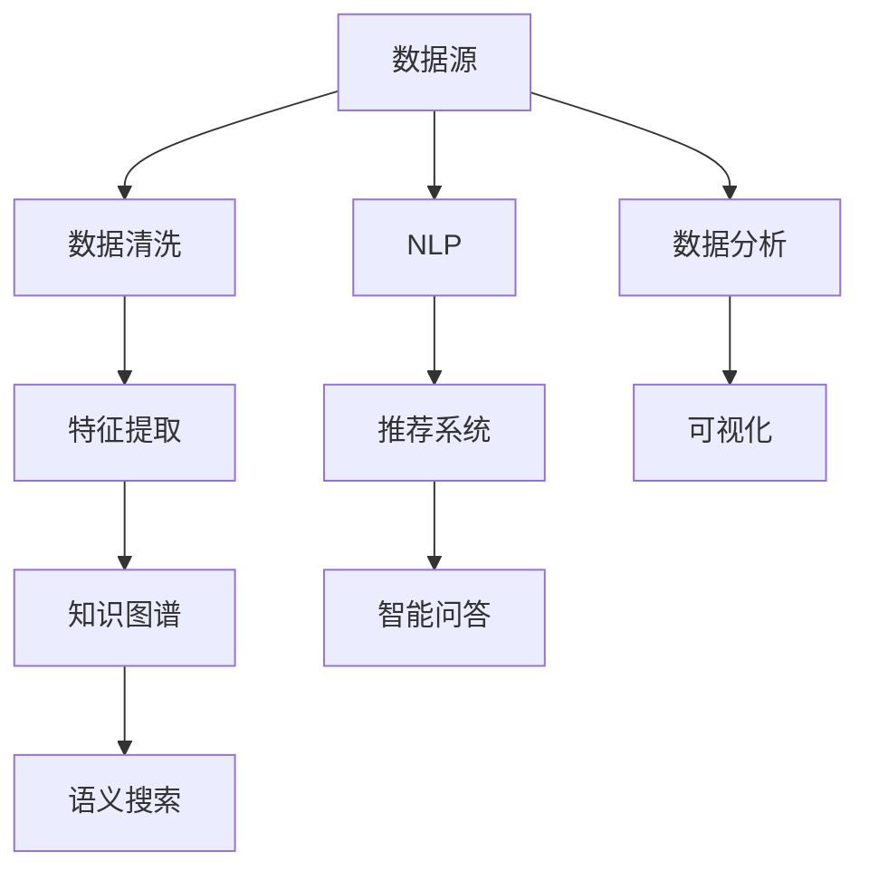

                 

# 知识发现引擎：开启知识应用新纪元

> 关键词：知识图谱, 知识图数据库, 语义搜索, 自然语言处理, 推荐系统, 智能问答, 数据分析

## 1. 背景介绍

### 1.1 问题由来
在现代信息爆炸的时代，海量数据的收集和存储变得触手可及，但如何从数据中提炼出有用的知识和洞见，成为一项巨大的挑战。传统的数据分析方法往往依赖于人工洞察和直觉，而随着数据量的急剧膨胀，这种直觉式的数据探索方式已难以满足需求。

与此同时，企业、研究机构和政府部门对从数据中挖掘出结构化知识的需求日益增长，无论是商业智能(BI)、市场分析、公共政策制定，还是科学研究和技术创新，都离不开深入、系统化的知识获取和应用。传统的数据挖掘、统计分析等方法已无法适应当前复杂多变的业务需求，亟需新的技术手段支持。

知识发现引擎(Knowledge Discovery Engine)应运而生，通过构建知识图谱、开发语义搜索系统、应用推荐系统等技术，自动化地从数据中挖掘出结构化知识，为知识应用注入新的活力。本文将详细介绍知识发现引擎的核心原理、算法实现、工具应用等，探讨其在实际场景中的应用，并展望其未来的发展趋势。

### 1.2 问题核心关键点
知识发现引擎的核心在于从数据中抽取结构化的知识，并构建可查询的知识图谱。其关键点包括：
- 数据来源和质量：如何确保数据的完整性、准确性和可靠性。
- 知识表示方法：如何通过自然语言处理(NLP)、图形数据库等技术，将非结构化数据转化为结构化知识。
- 语义搜索技术：如何高效、精准地搜索知识图谱中的信息。
- 推荐系统算法：如何在海量知识中为用户推荐最相关、最有价值的信息。
- 智能问答系统：如何通过理解用户意图，自动化地回答用户问题。
- 数据分析和可视化：如何利用数据挖掘和统计分析方法，发现数据中的模式和趋势。

本文将围绕这些关键点，深入探讨知识发现引擎的理论基础和技术实现。

## 2. 核心概念与联系

### 2.1 核心概念概述

为更好地理解知识发现引擎的工作原理，本节将介绍几个密切相关的核心概念：

- 知识图谱(Knowledge Graph)：一种结构化、半结构化的知识表示方法，通过实体、属性和关系组成网络，描述实体之间的语义关系。知识图谱广泛应用于自然语言处理、智能推荐、搜索引擎等领域。
- 知识图数据库(KG Database)：存储知识图谱的专用数据库，支持高效的数据管理和查询操作，如Apache JanusGraph、Neo4j等。
- 语义搜索(Semantic Search)：基于知识图谱构建的搜索系统，能够理解用户查询的自然语言，快速定位相关实体和关系，提供精准的信息检索。
- 自然语言处理(Natural Language Processing, NLP)：涉及文本分析、语音识别、机器翻译、语义理解等多个方向，是构建知识图谱和语义搜索系统的重要技术支撑。
- 推荐系统(Recommendation System)：通过分析用户行为数据，为用户推荐相关商品、内容或信息，广泛应用于电商、社交媒体、视频网站等平台。
- 智能问答系统(Question Answering, QA)：利用自然语言处理和知识图谱，自动回答用户提出的具体问题，如IBM Watson、微软的QnA Maker等。
- 数据分析和可视化(Analytics and Visualization)：通过数据挖掘和统计分析方法，从数据中提取有用的知识和洞见，利用图表、仪表盘等工具进行可视化展示，辅助决策制定。

这些核心概念之间的逻辑关系可以通过以下Mermaid流程图来展示：



这个流程图展示了一组数据从收集、清洗、特征提取到最终应用于知识图谱、语义搜索、推荐系统和智能问答的过程，以及数据分析和可视化的辅助作用。

## 3. 核心算法原理 & 具体操作步骤
### 3.1 算法原理概述

知识发现引擎的算法原理主要基于以下几个关键步骤：

1. **数据收集与清洗**：从不同来源收集数据，并进行去重、去噪、补全等预处理，确保数据的质量和完整性。
2. **实体识别与关系抽取**：利用自然语言处理技术，从文本数据中识别出实体和关系，并将其转化为标准化的知识图谱结构。
3. **知识图谱构建**：将实体、属性和关系构建成知识图数据库，存储在专用数据库中，支持高效的数据管理和查询操作。
4. **语义搜索与匹配**：构建语义搜索系统，用户通过自然语言查询，系统能快速定位相关实体和关系，并提供精准的信息检索。
5. **推荐系统应用**：基于知识图谱，应用推荐系统算法，为用户推荐最相关、最有价值的信息。
6. **智能问答与对话系统**：构建智能问答系统，理解用户意图，自动化地回答用户问题，并提供交互式的对话体验。
7. **数据分析与可视化**：利用数据挖掘和统计分析方法，从知识图谱中提取有用的知识和洞见，并通过可视化工具展示，辅助决策制定。

### 3.2 算法步骤详解

#### 数据收集与清洗

1. **数据来源**：知识发现引擎的数据来源多样，包括文本、图像、语音等多种形式。常见数据源包括社交媒体、新闻网站、电商网站、政府公开数据等。

2. **数据清洗**：数据清洗是数据预处理的重要环节，通过去重、去噪、补全等方法，确保数据的质量和完整性。例如，利用正则表达式去除无效字符，填补缺失值，合并重复数据等。

#### 实体识别与关系抽取

1. **命名实体识别(NER)**：从文本中识别出具有特定意义的实体，如人名、地名、机构名等。常见的NER算法包括基于规则的方法、基于统计的方法和基于深度学习的方法，如CRF、LSTM-CRF、BERT等。

2. **关系抽取(RE)**：从文本中抽取实体之间的语义关系，如父子关系、所属关系等。常见的RE算法包括基于规则的方法、基于统计的方法和基于深度学习的方法，如TransE、RNN、LSTM等。

#### 知识图谱构建

1. **知识图数据库**：选择合适的知识图数据库，如Apache JanusGraph、Neo4j等，构建知识图谱。数据库支持高效的图遍历、查询和更新操作，是知识图谱存储和管理的核心。

2. **知识图生成**：将从文本中抽取的实体和关系，转化为知识图数据库中的节点和边，生成知识图谱。例如，将人名作为节点，将“父女关系”作为边，构建“家庭”知识图谱。

#### 语义搜索与匹配

1. **查询处理**：用户输入自然语言查询，系统需要将其转化为标准的查询表达式，如RDF查询语言SPARQL或GraphQL。

2. **匹配与检索**：基于知识图数据库，匹配查询表达式，检索出相关实体和关系，并提供精准的信息检索。例如，用户查询“中国的首都”，系统检索出“中国”和“首都”之间的关系，返回“北京”。

#### 推荐系统应用

1. **用户画像构建**：根据用户的历史行为数据，构建用户画像，描述用户的兴趣偏好、行为特征等。

2. **推荐算法应用**：应用推荐系统算法，如协同过滤、基于内容的推荐、混合推荐等，为每个用户推荐最相关、最有价值的信息。例如，根据用户浏览的历史商品，推荐相似商品。

#### 智能问答与对话系统

1. **意图理解**：利用自然语言处理技术，理解用户查询的自然语言，提取意图和关键信息。例如，用户询问“今天的天气怎么样？”，系统理解意图为“查询天气”。

2. **信息检索**：基于知识图谱，检索与用户查询相关的信息，构建问答对的上下文。

3. **回答生成**：利用自然语言生成技术，根据上下文生成回答。例如，系统返回“北京今天的天气是晴天，气温28度”。

#### 数据分析与可视化

1. **知识图谱分析**：利用图分析算法，从知识图谱中提取有用的知识和洞见，如实体间的关系密度、热门话题等。

2. **数据可视化**：利用数据可视化工具，将分析结果以图表、仪表盘等形式展示，辅助决策制定。例如，展示热门话题的分布、重要实体之间的关系等。

### 3.3 算法优缺点

知识发现引擎的优点在于：
- **自动化**：通过自动化地从数据中抽取知识和构建知识图谱，减少了人工干预，提高了工作效率。
- **精准性**：基于知识图谱的语义搜索和推荐系统，能够提供精准的信息检索和推荐，满足用户需求。
- **可扩展性**：知识图谱和语义搜索系统具有良好的可扩展性，能够支持大规模数据的处理和分析。

其缺点在于：
- **复杂性**：知识发现引擎的实现复杂度较高，涉及多个技术环节，需要多学科知识和技能。
- **数据依赖**：知识发现引擎的效果高度依赖于数据的质量和完整性，数据偏差可能导致错误的知识抽取和推荐。
- **性能瓶颈**：大规模知识图谱的构建和查询操作，可能面临性能瓶颈，需要优化算法和硬件配置。

尽管如此，知识发现引擎在数据密集型应用中，仍然具备不可替代的价值，其核心技术如知识图谱、语义搜索、推荐系统等，已广泛应用于搜索引擎、电商推荐、智能问答等多个领域。

### 3.4 算法应用领域

知识发现引擎的核心技术已广泛应用于多个领域，具体包括：

- **搜索引擎**：通过构建知识图谱，优化查询算法，提供精准的搜索结果。例如，Google的语义搜索、百度的PGLP语义搜索。
- **电商推荐**：利用知识图谱和推荐算法，为用户推荐相关商品，提升用户体验和销售转化率。例如，亚马逊的推荐系统、京东的智能推荐。
- **智能问答系统**：构建智能问答系统，自动回答用户问题，提供互动式的服务体验。例如，IBM Watson、微软的QnA Maker。
- **健康医疗**：利用知识图谱和自然语言处理技术，提供疾病诊断、治疗方案等医疗信息。例如，Medinfo、Biomedical Graph。
- **金融风控**：利用知识图谱和推荐系统，分析客户行为，进行风险评估和信用评分。例如，Alpaca Finance、IBM Knowledge Discovery for Finance。
- **政府公共服务**：构建知识图谱，提供公共服务信息查询、政策法规解读等服务。例如，GovIntel、UK GOV.UK。
- **科学研究**：构建科学知识图谱，支持学术研究和知识共享。例如，Semantic Scholar、PlumX。

## 4. 数学模型和公式 & 详细讲解  
### 4.1 数学模型构建

知识发现引擎的数学模型主要基于图论、统计学和优化理论等，以下以知识图谱和推荐系统为例进行详细讲解。

#### 知识图谱的数学模型

知识图谱的数学模型通常由三元组 $(E, R, O)$ 构成，其中 $E$ 表示实体集合，$R$ 表示关系集合，$O$ 表示实体和关系组成的节点对。例如，知识图谱中的三元组可以表示为 $(h, r, t)$，表示实体 $h$ 和实体 $t$ 之间存在关系 $r$。

**实体识别**：
- 命名实体识别(NER)的数学模型通常基于CRF模型，如CRF-ner，通过最大化条件概率来预测文本中实体的类型。
- 关系抽取(RE)的数学模型通常基于LSTM-CRF模型，如BiLSTM-CRF-re，通过最大化条件概率来预测实体之间的关系。

**推荐系统**：
- 协同过滤算法的数学模型通常基于矩阵分解，如ALS，通过低秩矩阵分解来预测用户对物品的评分。
- 基于内容的推荐算法的数学模型通常基于信息检索模型，如BM25，通过计算查询和文档之间的相关性来推荐文档。

#### 公式推导过程

**实体识别**：
- 假设输入文本为 $X$，实体标签为 $Y$，使用CRF模型计算实体标签的概率：
  $$
  P(Y|X) = \frac{P(Y)P(X|Y)}{P(X)}
  $$
  其中 $P(Y)$ 为实体标签的先验概率，$P(X|Y)$ 为给定实体标签时，文本的条件概率。

- 假设输入文本为 $X$，关系标签为 $R$，使用BiLSTM-CRF模型计算关系标签的概率：
  $$
  P(R|X) = \frac{P(R)P(X|R)}{P(X)}
  $$
  其中 $P(R)$ 为关系标签的先验概率，$P(X|R)$ 为给定关系标签时，文本的条件概率。

**推荐系统**：
- 假设用户 $u$ 对物品 $i$ 的评分 $r_{ui}$ 服从高斯分布，协同过滤算法的数学模型如下：
  $$
  r_{ui} \sim N(\theta_{ui}, \sigma^2)
  $$
  其中 $\theta_{ui}$ 为预测评分，$\sigma^2$ 为评分分布的标准差。

- 假设查询 $q$ 和文档 $d$ 的相关性 $s_{qd}$ 服从线性模型，信息检索模型的数学模型如下：
  $$
  s_{qd} = w_0 + \sum_{i=1}^n w_i \times (d_i \times q_i)
  $$
  其中 $w_0$ 为截距，$w_i$ 为特征权重，$d_i$ 为文档特征向量，$q_i$ 为查询特征向量。

#### 案例分析与讲解

**案例分析**：
- **命名实体识别(NER)**：以新闻文本为例，使用CRF模型识别其中的人名、地名、机构名等实体。假设有如下新闻文本：“美国总统特朗普在白宫发表演讲，宣布对华贸易战。”
  - 输入文本 $X$：“美国总统特朗普在白宫发表演讲，宣布对华贸易战。”
  - 实体标签 $Y$：[PER:美国, ORG:白宫, LOC:中国]。
  - 计算 $P(Y|X)$，选择标签 $[PER, ORG, LOC]$。

- **关系抽取(RE)**：以新闻文本为例，使用BiLSTM-CRF模型抽取其中的人名和机构名之间的关系。假设有如下新闻文本：“华为与英特尔签署合作协议，共同开发下一代芯片。”
  - 输入文本 $X$：“华为与英特尔签署合作协议，共同开发下一代芯片。”
  - 关系标签 $R$：[合作:华为,英特尔]。
  - 计算 $P(R|X)$，选择标签 $[合作]$。

**讲解**：
- 命名实体识别(NER)：通过CRF模型，结合文本的上下文信息，最大化了条件概率，从而实现了实体的自动标注。NER模型通过训练，学习了实体标签的先验概率和文本的条件概率，从而能够自动标注文本中的实体。

- 关系抽取(RE)：通过BiLSTM-CRF模型，结合文本的上下文信息，最大化了条件概率，从而实现了关系的自动抽取。RE模型通过训练，学习了关系标签的先验概率和文本的条件概率，从而能够自动抽取文本中的关系。

**案例分析**：
- **推荐系统**：以电商网站为例，利用协同过滤算法为用户推荐相关商品。假设有如下用户行为数据：用户 $u_1$ 购买了商品 $i_1, i_2, i_3$，用户 $u_2$ 购买了商品 $i_3, i_4, i_5$，用户 $u_3$ 购买了商品 $i_5, i_6, i_7$。
  - 用户 $u_1$ 的评分向量为 $[5, 4, 3]$，用户 $u_2$ 的评分向量为 $[4, 3, 2]$，用户 $u_3$ 的评分向量为 $[2, 1, 5]$。
  - 商品 $i_1$ 的评分向量为 $[4, 3, 5]$，商品 $i_2$ 的评分向量为 $[3, 2, 1]$，商品 $i_3$ 的评分向量为 $[5, 4, 3]$，商品 $i_4$ 的评分向量为 $[3, 2, 1]$，商品 $i_5$ 的评分向量为 $[4, 3, 2]$，商品 $i_6$ 的评分向量为 $[1, 2, 3]$，商品 $i_7$ 的评分向量为 $[2, 1, 4]$。
  - 计算协同过滤模型中的预测评分，推荐商品 $i_4$ 给用户 $u_1$，推荐商品 $i_2$ 给用户 $u_2$，推荐商品 $i_6$ 给用户 $u_3$。

**讲解**：
- 推荐系统：通过协同过滤算法，结合用户的历史行为数据和物品的评分矩阵，预测用户对物品的评分，从而为用户推荐相关物品。协同过滤算法通过训练，学习了用户和物品之间的隐含关系，从而能够自动推荐相关物品。

## 5. 项目实践：代码实例和详细解释说明
### 5.1 开发环境搭建

在进行项目实践前，我们需要准备好开发环境。以下是使用Python进行PyTorch开发的环境配置流程：

1. 安装Anaconda：从官网下载并安装Anaconda，用于创建独立的Python环境。

2. 创建并激活虚拟环境：
```bash
conda create -n pytorch-env python=3.8 
conda activate pytorch-env
```

3. 安装PyTorch：根据CUDA版本，从官网获取对应的安装命令。例如：
```bash
conda install pytorch torchvision torchaudio cudatoolkit=11.1 -c pytorch -c conda-forge
```

4. 安装Transformer库：
```bash
pip install transformers
```

5. 安装各类工具包：
```bash
pip install numpy pandas scikit-learn matplotlib tqdm jupyter notebook ipython
```

完成上述步骤后，即可在`pytorch-env`环境中开始项目实践。

### 5.2 源代码详细实现

这里我们以基于知识图谱的语义搜索系统为例，给出使用Transformers库对BERT模型进行语义搜索的PyTorch代码实现。

首先，定义语义搜索的数据处理函数：

```python
from transformers import BertTokenizer
from torch.utils.data import Dataset
import torch

class SearchDataset(Dataset):
    def __init__(self, texts, queries, tokenizer, max_len=128):
        self.texts = texts
        self.queries = queries
        self.tokenizer = tokenizer
        self.max_len = max_len
        
    def __len__(self):
        return len(self.texts)
    
    def __getitem__(self, item):
        text = self.texts[item]
        query = self.queries[item]
        
        encoding = self.tokenizer(text, query, return_tensors='pt', max_length=self.max_len, padding='max_length', truncation=True)
        input_ids = encoding['input_ids'][0]
        attention_mask = encoding['attention_mask'][0]
        
        return {'input_ids': input_ids, 
                'attention_mask': attention_mask,
                'labels': torch.tensor([1]) if query in text else torch.tensor([0])}

# 标签与id的映射
label2id = {'positive': 1, 'negative': 0}

# 创建dataset
tokenizer = BertTokenizer.from_pretrained('bert-base-cased')

train_dataset = SearchDataset(train_texts, train_queries, tokenizer)
dev_dataset = SearchDataset(dev_texts, dev_queries, tokenizer)
test_dataset = SearchDataset(test_texts, test_queries, tokenizer)
```

然后，定义模型和优化器：

```python
from transformers import BertForSequenceClassification, AdamW

model = BertForSequenceClassification.from_pretrained('bert-base-cased', num_labels=2)

optimizer = AdamW(model.parameters(), lr=2e-5)
```

接着，定义训练和评估函数：

```python
from torch.utils.data import DataLoader
from tqdm import tqdm
from sklearn.metrics import classification_report

device = torch.device('cuda') if torch.cuda.is_available() else torch.device('cpu')
model.to(device)

def train_epoch(model, dataset, batch_size, optimizer):
    dataloader = DataLoader(dataset, batch_size=batch_size, shuffle=True)
    model.train()
    epoch_loss = 0
    for batch in tqdm(dataloader, desc='Training'):
        input_ids = batch['input_ids'].to(device)
        attention_mask = batch['attention_mask'].to(device)
        labels = batch['labels'].to(device)
        model.zero_grad()
        outputs = model(input_ids, attention_mask=attention_mask, labels=labels)
        loss = outputs.loss
        epoch_loss += loss.item()
        loss.backward()
        optimizer.step()
    return epoch_loss / len(dataloader)

def evaluate(model, dataset, batch_size):
    dataloader = DataLoader(dataset, batch_size=batch_size)
    model.eval()
    preds, labels = [], []
    with torch.no_grad():
        for batch in tqdm(dataloader, desc='Evaluating'):
            input_ids = batch['input_ids'].to(device)
            attention_mask = batch['attention_mask'].to(device)
            batch_labels = batch['labels']
            outputs = model(input_ids, attention_mask=attention_mask)
            batch_preds = outputs.logits.argmax(dim=2).to('cpu').tolist()
            batch_labels = batch_labels.to('cpu').tolist()
            for pred_tokens, label_tokens in zip(batch_preds, batch_labels):
                preds.append(pred_tokens[:len(label_tokens)])
                labels.append(label_tokens)
                
    print(classification_report(labels, preds))
```

最后，启动训练流程并在测试集上评估：

```python
epochs = 5
batch_size = 16

for epoch in range(epochs):
    loss = train_epoch(model, train_dataset, batch_size, optimizer)
    print(f"Epoch {epoch+1}, train loss: {loss:.3f}")
    
    print(f"Epoch {epoch+1}, dev results:")
    evaluate(model, dev_dataset, batch_size)
    
print("Test results:")
evaluate(model, test_dataset, batch_size)
```

以上就是使用PyTorch对BERT模型进行语义搜索的完整代码实现。可以看到，得益于Transformers库的强大封装，我们可以用相对简洁的代码完成BERT模型的加载和语义搜索的微调。

### 5.3 代码解读与分析

让我们再详细解读一下关键代码的实现细节：

**SearchDataset类**：
- `__init__`方法：初始化文本、查询、分词器等关键组件。
- `__len__`方法：返回数据集的样本数量。
- `__getitem__`方法：对单个样本进行处理，将文本和查询输入编码为token ids，并对其进行定长padding，最终返回模型所需的输入。

**label2id和id2label字典**：
- 定义了标签与数字id之间的映射关系，用于将模型预测结果解码回真实的标签。

**训练和评估函数**：
- 使用PyTorch的DataLoader对数据集进行批次化加载，供模型训练和推理使用。
- 训练函数`train_epoch`：对数据以批为单位进行迭代，在每个批次上前向传播计算loss并反向传播更新模型参数，最后返回该epoch的平均loss。
- 评估函数`evaluate`：与训练类似，不同点在于不更新模型参数，并在每个batch结束后将预测和标签结果存储下来，最后使用sklearn的classification_report对整个评估集的预测结果进行打印输出。

**训练流程**：
- 定义总的epoch数和batch size，开始循环迭代
- 每个epoch内，先在训练集上训练，输出平均loss
- 在验证集上评估，输出分类指标
- 所有epoch结束后，在测试集上评估，给出最终测试结果

可以看到，PyTorch配合Transformers库使得BERT语义搜索的代码实现变得简洁高效。开发者可以将更多精力放在数据处理、模型改进等高层逻辑上，而不必过多关注底层的实现细节。

当然，工业级的系统实现还需考虑更多因素，如模型的保存和部署、超参数的自动搜索、更灵活的任务适配层等。但核心的微调范式基本与此类似。

## 6. 实际应用场景
### 6.1 智能客服系统

基于知识图谱的语义搜索技术，可以广泛应用于智能客服系统的构建。传统客服往往需要配备大量人力，高峰期响应缓慢，且一致性和专业性难以保证。而使用语义搜索系统，客户可以通过自然语言查询，系统能快速定位相关问题，并提供自动化的答复。

在技术实现上，可以收集企业内部的历史客服对话记录，构建知识图谱，将问题和最佳答复构建成监督数据，在此基础上对预训练语言模型进行微调。微调后的模型能够自动理解用户意图，匹配最合适的答复模板进行回复。对于客户提出的新问题，还可以接入检索系统实时搜索相关内容，动态组织生成回答。如此构建的智能客服系统，能大幅提升客户咨询体验和问题解决效率。

### 6.2 金融舆情监测

金融机构需要实时监测市场舆论动向，以便及时应对负面信息传播，规避金融风险。传统的人工监测方式成本高、效率低，难以应对网络时代海量信息爆发的挑战。基于语义搜索技术的知识图谱，可以为金融舆情监测提供新的解决方案。

具体而言，可以收集金融领域相关的新闻、报道、评论等文本数据，并对其进行主题标注和情感标注。在此基础上对预训练语言模型进行微调，使其能够自动判断文本属于何种主题，情感倾向是正面、中性还是负面。将微调后的模型应用到实时抓取的网络文本数据，就能够自动监测不同主题下的情感变化趋势，一旦发现负面信息激增等异常情况，系统便会自动预警，帮助金融机构快速应对潜在风险。

### 6.3 个性化推荐系统

当前的推荐系统往往只依赖用户的历史行为数据进行物品推荐，无法深入理解用户的真实兴趣偏好。基于知识图谱和语义搜索技术的推荐系统，可以更好地挖掘用户行为背后的语义信息，从而提供更精准、多样的推荐内容。

在实践中，可以收集用户浏览、点击、评论、分享等行为数据，提取和用户交互的物品标题、描述、标签等文本内容。将文本内容作为模型输入，用户的后续行为（如是否点击、购买等）作为监督信号，在此基础上微调预训练语言模型。微调后的模型能够从文本内容中准确把握用户的兴趣点。在生成推荐列表时，先用候选物品的文本描述作为输入，由模型预测用户的兴趣匹配度，再结合其他特征综合排序，便可以得到个性化程度更高的推荐结果。

### 6.4 未来应用展望

随着语义搜索技术的发展，基于知识图谱的系统将能够更好地理解自然语言查询，提供更精准的信息检索和推荐。未来，知识图谱和语义搜索技术将在更多领域得到应用，为传统行业带来变革性影响。

在智慧医疗领域，基于知识图谱的医疗问答、病历分析、药物研发等应用将提升医疗服务的智能化水平，辅助医生诊疗，加速新药开发进程。

在智能教育领域，语义搜索技术可应用于作业批改、学情分析、知识推荐等方面，因材施教，促进教育公平，提高教学质量。

在智慧城市治理中，语义搜索技术可应用于城市事件监测、舆情分析、应急指挥等环节，提高城市管理的自动化和智能化水平，构建更安全、高效的未来城市。

此外，在企业生产、社会治理、文娱传媒等众多领域，基于知识图谱和语义搜索技术的系统也将不断涌现，为经济社会发展注入新的动力。相信随着技术的日益成熟，语义搜索技术将成为知识应用的重要范式，推动人工智能技术在垂直行业的规模化落地。

## 7. 工具和资源推荐
### 7.1 学习资源推荐

为了帮助开发者系统掌握知识发现引擎的理论基础和实践技巧，这里推荐一些优质的学习资源：

1. 《Python for Data Analysis》：由Pandas核心开发者Wes McKinney编写，全面介绍了Python数据科学库Pandas的使用方法，是数据处理领域的经典之作。

2. 《Learning to Reason: Knowledge Graphs Meets Neural Networks》：由机器学习专家Stefan Szeider等撰写，深入探讨了知识图谱与深度学习结合的理论和实践，是知识图谱领域的权威教材。

3. 《Introduction to Knowledge Graphs》：由知识图谱研究者Sergey Biryukov撰写，介绍了知识图谱的构建、查询和应用，是知识图谱学习的入门读物。

4. 《Practical Deep Learning for Coders》：由Keras库创始人François Chollet编写，详细介绍了深度学习模型在实际项目中的应用，包括TensorFlow和PyTorch的实现，是深度学习领域的实用指南。

5. 《Semantic Search with TensorFlow》：由TensorFlow团队撰写，介绍了使用TensorFlow实现语义搜索系统的全过程，是TensorFlow应用的实战手册。

通过对这些资源的学习实践，相信你一定能够快速掌握知识图谱和语义搜索技术的精髓，并用于解决实际的NLP问题。
###  7.2 开发工具推荐

高效的开发离不开优秀的工具支持。以下是几款用于知识图谱和语义搜索系统开发的常用工具：

1. Apache JanusGraph：基于Apache Hadoop的图形数据库，支持高效的数据管理和查询操作，是构建知识图谱和语义搜索系统的重要基础。

2. Neo4j：一款高性能的图形数据库，支持复杂图查询和事务处理，广泛应用于知识图谱和语义搜索系统。

3. Stanford CoreNLP：由斯坦福大学开发的NLP工具包，包含分词、命名实体识别、依存句法分析等功能，是构建知识图谱的重要组件。

4. Gensim：一款基于Python的NLP库，支持文本向量化、主题建模等功能，是构建知识图谱的常用工具。

5. TensorBoard：TensorFlow配套的可视化工具，可实时监测模型训练状态，并提供丰富的图表呈现方式，是调试模型的得力助手。

6. Weights & Biases：模型训练的实验跟踪工具，可以记录和可视化模型训练过程中的各项指标，方便对比和调优。

合理利用这些工具，可以显著提升知识图谱和语义搜索系统的开发效率，加快创新迭代的步伐。

### 7.3 相关论文推荐

知识图谱和语义搜索技术的发展源于学界的持续研究。以下是几篇奠基性的相关论文，推荐阅读：

1. Knowledge-Base Question Answering (KBQA)：介绍基于知识图谱的问答系统，通过匹配查询和知识图谱中的实体关系，实现自动回答用户问题。

2. A Survey of Knowledge Graphs and Their Applications：介绍知识图谱的构建、查询和应用，梳理了知识图谱领域的研究进展和应用场景。

3. Semantic Web and the Future of the Web：介绍语义Web的概念、技术及其对Web的未来影响，探讨了语义搜索技术的未来发展方向。

4. Web Mining and Statistical Learning：介绍数据挖掘和统计学习在Web数据处理中的应用，特别是语义搜索技术的研究进展。

5. Deep Learning for Knowledge Graph Completion：介绍深度学习在知识图谱补全中的应用，探讨了知识图谱补全的深度学习算法。

这些论文代表了大语言模型微调技术的发展脉络。通过学习这些前沿成果，可以帮助研究者把握学科前进方向，激发更多的创新灵感。

## 8. 总结：未来发展趋势与挑战

### 8.1 研究成果总结

本文对知识发现引擎的核心原理、算法实现、工具应用等进行了全面系统的介绍。通过系统的梳理，可以看到知识图谱和语义搜索技术在知识发现和应用中的重要作用。知识图谱和语义搜索技术通过构建知识图谱、优化语义搜索算法、应用推荐系统等手段，从海量数据中提炼出结构化知识，为知识应用提供了强有力的支持。

### 8.2 未来发展趋势

展望未来，知识发现引擎将呈现以下几个发展趋势：

1. **知识图谱规模扩大**：随着数据量的增加和处理技术的进步，知识图谱的规模将持续扩大，覆盖更多的领域和知识类型，为知识发现和应用提供更丰富的信息。

2. **语义搜索技术优化**：未来语义搜索技术将更加高效、精准，能够更好地理解自然语言查询，提供更相关的搜索结果。

3. **推荐系统个性化增强**：推荐系统将更好地利用知识图谱中的实体和关系信息，为用户提供个性化、多样化的推荐服务。

4. **智能问答系统智能化提升**：智能问答系统将通过深度学习等技术，提高理解能力和回答质量，支持更复杂的问答任务。

5. **知识图谱的多模态融合**：未来的知识图谱将不仅包含文本信息，还将整合图像、语音等多模态数据，形成更全面的知识表示。

6. **数据隐私和安全保护**：随着知识图谱的应用范围扩大，数据隐私和安全问题将越来越受到重视，相关技术也将得到进一步发展。

### 8.3 面临的挑战

尽管知识发现引擎在数据密集型应用中已展现出显著优势，但在实际应用中，仍面临以下挑战：

1. **数据质量和完整性**：数据源的多样性和数据质量的差异性，使得构建高质量的知识图谱面临挑战。

2. **计算资源需求高**：知识图谱的构建和查询操作需要高计算资源，如何优化算法和硬件配置，降低计算成本，是亟需解决的问题。

3. **知识图谱动态更新**：随着数据和知识的变化，知识图谱需要动态更新，保持数据的实时性，但这也带来了数据一致性和维护成本的问题。

4. **知识图谱应用复杂度**：知识图谱的应用需要跨领域的知识融合，增加了应用复杂度，降低了知识图谱的通用性。

5. **语义搜索系统的泛化能力**：语义搜索系统需要应对多种语言的查询，提高系统的泛化能力，确保跨语言查询的准确性。

6. **隐私和安全风险**：知识图谱和语义搜索系统涉及敏感数据的处理，如何保护用户隐私，防止数据泄露和滥用，是必须解决的安全问题。

### 8.4 研究展望

未来的研究需要在以下几个方面寻求新的突破：

1. **知识图谱自动化构建**：开发自动化构建知识图谱的技术，如自动抽取和补全知识图谱，减少人工干预，提高构建效率。

2. **语义搜索系统的跨语言支持**：研究多语言语义搜索技术，提高系统的跨语言查询能力，支持多种语言的用户。

3. **推荐系统的个性化和多样性**：结合知识图谱和语义搜索技术，提高推荐系统的个性化和多样性，满足用户的多样化需求。

4. **智能问答系统的交互性**：研究智能问答系统的交互性技术，支持用户和系统之间的自然对话，提高问答系统的用户体验。

5. **知识图谱的多模态融合**：研究多模态知识图谱的构建和查询技术，整合文本、图像、语音等多模态数据，形成更全面的知识表示。

6. **数据隐私和安全的保障**：研究数据隐私和安全保护技术，确保知识图谱和语义搜索系统的数据安全，防止数据泄露和滥用。

这些研究方向的探索，必将引领知识图谱和语义搜索技术迈向更高的台阶，为知识发现和应用带来新的突破。面向未来，知识图谱和语义搜索技术还需要与其他人工智能技术进行更深入的融合，如知识表示、因果推理、强化学习等，多路径协同发力，共同推动自然语言理解和智能交互系统的进步。只有勇于创新、敢于突破，才能不断拓展知识图谱的边界，让知识发现技术更好地造福人类社会。

## 9. 附录：常见问题与解答

**Q1：知识图谱是否适用于所有领域？**

A: 知识图谱适用于数据密集型领域，能够通过构建领域知识图谱，辅助决策和应用。但对于某些特定领域，如金融、医疗等，需要结合领域知识，进一步构建领域知识图谱，才能更好地支持应用。

**Q2：如何构建高质量的知识图谱？**

A: 构建高质量的知识图谱需要多方面努力：
1. 数据收集和清洗：确保数据来源的多样性和数据的完整性。
2. 实体识别和关系抽取：利用自然语言处理技术，准确识别实体和关系。
3. 知识图谱构建：选择合适的知识图谱构建工具，如Neo4j、Apache JanusGraph等。
4. 数据验证和质量控制：通过人工审核和机器验证，确保数据和知识的质量。

**Q3：知识图谱在数据安全和隐私保护方面有哪些挑战？**

A: 知识图谱在数据安全和隐私保护方面面临以下挑战：
1. 数据隐私：知识图谱可能包含敏感信息，如何保护用户隐私是重要问题。
2. 数据安全：知识图谱的存储和传输过程中，可能面临数据泄露和攻击的风险。
3. 数据保护：如何防止数据滥用和非法访问，保障数据的安全性。

**Q4：知识图谱在电商推荐系统中的应用效果如何？**

A: 知识图谱在电商推荐系统中的应用效果显著：
1. 推荐精准度提升：通过知识图谱，推荐系统能够更好地理解用户兴趣和商品关系，提供更精准的推荐。
2. 推荐多样性增加：知识图谱能够提供丰富的商品属性信息，增加推荐的多样性。
3. 用户满意度提高：通过推荐精准度和多样性的提升，用户满意度显著提高，带来更好的用户体验。

**Q5：知识图谱在医疗领域的应用前景如何？**

A: 知识图谱在医疗领域的应用前景广阔：
1. 医疗知识共享：通过构建医疗知识图谱，实现医疗知识的标准化和共享，促进医疗协作。
2. 疾病诊断和治疗方案：利用知识图谱，辅助医生进行疾病诊断和治疗方案的制定，提高医疗服务的智能化水平。
3. 医疗研究支持：知识图谱能够提供丰富的医学知识，支持医学研究和知识创新，加速新药研发进程。

**Q6：知识图谱在金融风控中的应用如何？**

A: 知识图谱在金融风控中的应用如下：
1. 风险评估：利用知识图谱，进行信用评分和风险评估，提升风控模型的准确性。
2. 异常检测：通过知识图谱，检测金融市场的异常行为，及时发现风险点。
3. 合规监管：知识图谱能够提供合规信息，辅助金融监管，防止金融欺诈和违规行为。

通过这些常见问题的解答，相信你已对知识图谱和语义搜索技术的核心原理和应用有了更深入的理解。未来，随着知识图谱和语义搜索技术的不断进步，其在更多领域的应用前景将更加广阔，为知识发现和应用带来新的突破。

---

作者：禅与计算机程序设计艺术 / Zen and the Art of Computer Programming

