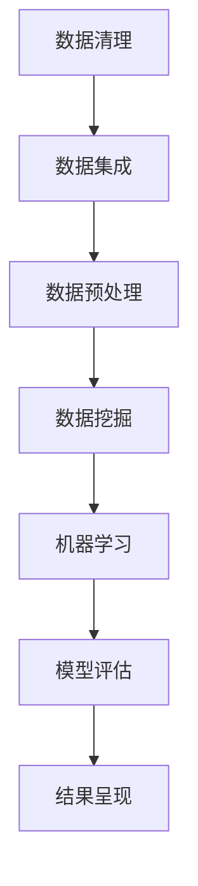

                 

# 知识发现引擎：知识海洋中的探索者

> 关键词：知识发现引擎,知识海洋,探索者,数据挖掘,机器学习

## 1. 背景介绍

在数字化时代，海量的数据成为企业竞争的核心资源。然而，传统的数据处理方式难以充分利用这些资源，数据利用率低、信息不充分等问题严重制约了企业决策和创新能力的提升。为此，知识发现(Knowledge Discovery, KDD)技术应运而生，成为企业数据驱动决策的重要工具。

知识发现是指从海量数据中挖掘出有价值的信息和知识，以支撑企业战略制定、运营优化、产品创新等决策过程。作为知识发现的“引擎”，知识发现引擎利用先进的数据挖掘和机器学习技术，自动化的分析和挖掘数据背后的知识模式，帮助企业从海量数据中提取关键信息。

## 2. 核心概念与联系

### 2.1 核心概念概述

为了更好地理解知识发现引擎的原理与操作，本节将介绍几个关键概念：

- **知识发现(KDD)**：从数据中自动发现知识、信息和洞察的过程，涵盖了数据清理、数据集成、数据选择、数据挖掘、模型评估、结果呈现等多个环节。

- **数据挖掘**：通过数据分析、统计、机器学习等手段，从数据中自动发现有意义的信息和知识的过程。

- **机器学习**：利用数据训练算法模型，从数据中自动学习知识模式的过程。

- **数据集成**：将来自不同源的数据集进行合并和清洗，构建统一的数据视图。

- **数据预处理**：包括数据清洗、数据转换、数据归一化等，以提高数据质量和可用性。

- **模型评估与验证**：通过评估指标（如准确率、召回率、F1值等）对模型性能进行验证，确保模型有效且可靠。

- **结果呈现与可视化**：将分析结果以图形、图表、报表等形式呈现，帮助决策者直观理解信息与知识。

这些概念通过一定的联系，构成了知识发现引擎的核心工作流程。通过数据的清理、集成和预处理，为后续的数据挖掘和机器学习提供了坚实的基础。模型评估和结果呈现，则帮助企业将发现的知识应用于决策和实践中。

### 2.2 核心概念原理和架构的 Mermaid 流程图



## 3. 核心算法原理 & 具体操作步骤

### 3.1 算法原理概述

知识发现引擎的核心原理包括数据挖掘和机器学习。数据挖掘主要用于从数据中提取有价值的模式和规律，机器学习则用于训练算法模型，自动地发现数据的潜在模式和关系。

- **数据挖掘算法**：包括关联规则挖掘、分类、聚类、异常检测等。例如，关联规则挖掘可用于发现购物篮分析中的频繁项集，分类可用于构建预测模型，聚类可用于对数据进行分组和细分，异常检测可用于识别数据中的离群点。

- **机器学习算法**：包括监督学习、非监督学习、半监督学习等。例如，监督学习可用于分类、回归、序列预测等，非监督学习可用于聚类、降维等，半监督学习可用于利用少量标注数据进行模型训练。

### 3.2 算法步骤详解

知识发现引擎的操作过程一般包括以下几个关键步骤：

1. **数据准备**：
   - 收集数据集，并进行清洗和预处理，去除噪声和缺失值。
   - 集成来自不同源的数据，构建统一的数据视图。

2. **数据探索**：
   - 进行数据可视化，了解数据的基本特征和分布情况。
   - 进行统计分析，探索数据中的规律和异常点。

3. **模型选择**：
   - 根据问题类型和数据特点，选择合适的数据挖掘算法和机器学习算法。
   - 确定算法的参数，并进行交叉验证和调参。

4. **模型训练**：
   - 将准备好的数据集分成训练集和测试集。
   - 使用训练集对模型进行训练，更新模型参数。

5. **模型评估**：
   - 使用测试集对模型进行评估，计算评估指标（如准确率、召回率、F1值等）。
   - 根据评估结果，调整模型参数和算法选择。

6. **模型部署**：
   - 将训练好的模型部署到实际应用系统中。
   - 实时收集数据，对模型进行迭代训练和优化。

### 3.3 算法优缺点

知识发现引擎具有以下优点：
- **自动化**：自动化的数据挖掘和模型训练，大幅提升数据利用效率。
- **灵活性**：适用于多种数据类型和问题类型，灵活性高。
- **可解释性**：通过可视化和结果呈现，结果具有较高的可解释性。

同时，也存在以下缺点：
- **数据质量依赖**：依赖数据的质量和完整性，难以处理噪声和异常数据。
- **计算复杂度较高**：特别是对于大规模数据集和高维数据，计算复杂度高。
- **模型泛化能力有限**：对于数据分布发生变化或新数据，模型的泛化能力可能不足。
- **结果可靠性依赖**：结果的可靠性依赖于模型选择和参数设置，需要仔细调参。

### 3.4 算法应用领域

知识发现引擎已经在金融、零售、医疗、社交媒体等多个领域得到了广泛应用，推动了企业决策和运营的智能化升级：

- **金融领域**：用于风险评估、信用评分、市场预测、欺诈检测等，帮助金融机构更好地控制风险和提高收益。
- **零售行业**：用于客户细分、推荐系统、销售预测、库存管理等，帮助零售商提升客户体验和运营效率。
- **医疗领域**：用于疾病预测、患者分类、药物发现、基因分析等，助力医疗机构提高诊断和治疗水平。
- **社交媒体**：用于舆情分析、用户行为分析、内容推荐等，帮助社交平台优化用户体验和内容推送。

## 4. 数学模型和公式 & 详细讲解 & 举例说明

### 4.1 数学模型构建

知识发现引擎的数学模型构建主要涉及统计学、机器学习等领域。以分类问题为例，常见的数学模型包括：

- **逻辑回归模型**：
$$
\hat{y} = \frac{1}{1 + e^{-\mathbf{w} \cdot \mathbf{x} + b}}
$$
其中 $\mathbf{w}$ 为模型参数，$b$ 为偏置项。

- **决策树模型**：
$$
\hat{y} = \sum_{i=1}^n \mathbf{w}_i G_i(\mathbf{x})
$$
其中 $G_i$ 为第 $i$ 个决策树的预测函数，$\mathbf{w}_i$ 为第 $i$ 个树的权重。

- **支持向量机模型**：
$$
\hat{y} = \mathrm{sign}(\sum_{i=1}^n \mathbf{w}_i \mathbf{x}_i + b)
$$
其中 $\mathbf{w}_i$ 为支持向量的权重，$b$ 为偏置项。

### 4.2 公式推导过程

以逻辑回归模型为例，推导其在分类问题中的预测函数和损失函数：

假设数据集为 $\{(\mathbf{x}_i,y_i)\}_{i=1}^N$，其中 $\mathbf{x}_i$ 为特征向量，$y_i \in \{0,1\}$ 为标签。

定义模型参数 $\mathbf{w} \in \mathbb{R}^d$，$b \in \mathbb{R}$。逻辑回归模型的预测函数为：
$$
\hat{y}_i = \frac{1}{1 + e^{-\mathbf{w} \cdot \mathbf{x}_i + b}}
$$

为了最小化预测误差，定义损失函数为交叉熵损失：
$$
\mathcal{L}(\mathbf{w},b) = -\frac{1}{N} \sum_{i=1}^N [y_i \log \hat{y}_i + (1-y_i) \log (1-\hat{y}_i)]
$$

将预测函数带入损失函数，得到：
$$
\mathcal{L}(\mathbf{w},b) = -\frac{1}{N} \sum_{i=1}^N \left[ y_i \log \frac{1}{1 + e^{-\mathbf{w} \cdot \mathbf{x}_i + b}} + (1-y_i) \log \frac{e^{-\mathbf{w} \cdot \mathbf{x}_i + b}}{1 + e^{-\mathbf{w} \cdot \mathbf{x}_i + b}} \right]
$$

简化得：
$$
\mathcal{L}(\mathbf{w},b) = -\frac{1}{N} \sum_{i=1}^N y_i \log \frac{1}{1 + e^{-\mathbf{w} \cdot \mathbf{x}_i + b}} - \frac{1}{N} \sum_{i=1}^N (1-y_i) \log e^{-\mathbf{w} \cdot \mathbf{x}_i + b}
$$

进一步简化得：
$$
\mathcal{L}(\mathbf{w},b) = -\frac{1}{N} \sum_{i=1}^N \left[ y_i \log \frac{1}{1 + e^{-\mathbf{w} \cdot \mathbf{x}_i + b}} + (1-y_i) \log (e^{-\mathbf{w} \cdot \mathbf{x}_i + b)} \right]
$$

最终得到：
$$
\mathcal{L}(\mathbf{w},b) = -\frac{1}{N} \sum_{i=1}^N [y_i \log \hat{y}_i + (1-y_i) \log (1-\hat{y}_i)]
$$

使用梯度下降等优化算法求解最小化问题，得到模型参数 $\mathbf{w}$ 和 $b$。

### 4.3 案例分析与讲解

以信用评分问题为例，探索如何利用知识发现引擎进行数据挖掘和机器学习。

**问题描述**：给定一组客户的信用历史数据，包括收入、消费、还款历史等，预测客户的信用评分，分为“好”、“一般”、“差”三类。

**数据准备**：
- 收集客户的收入、消费、还款历史等数据，并进行清洗和预处理。
- 将数据集分为训练集和测试集。

**数据探索**：
- 绘制客户收入、消费、还款历史的分布图，了解数据的基本特征。
- 计算收入、消费、还款历史与信用评分的相关性，识别关键特征。

**模型选择**：
- 根据问题类型和数据特点，选择逻辑回归模型。
- 设置模型的参数，并进行交叉验证和调参。

**模型训练**：
- 使用训练集对模型进行训练，更新模型参数。

**模型评估**：
- 使用测试集对模型进行评估，计算准确率、召回率、F1值等指标。
- 根据评估结果，调整模型参数和算法选择。

**结果呈现**：
- 将模型预测结果以图表和报表形式呈现，供决策者参考。

## 5. 项目实践：代码实例和详细解释说明

### 5.1 开发环境搭建

在进行知识发现引擎的实践开发前，需要准备好开发环境。以下是使用Python进行Scikit-Learn开发的开发环境配置流程：

1. 安装Anaconda：从官网下载并安装Anaconda，用于创建独立的Python环境。

2. 创建并激活虚拟环境：
```bash
conda create -n kdd-env python=3.8 
conda activate kdd-env
```

3. 安装Scikit-Learn：
```bash
conda install scikit-learn
```

4. 安装各类工具包：
```bash
pip install numpy pandas matplotlib seaborn
```

完成上述步骤后，即可在`kdd-env`环境中开始项目开发。

### 5.2 源代码详细实现

下面以信用评分问题为例，给出使用Scikit-Learn对逻辑回归模型进行训练和评估的Python代码实现。

```python
import pandas as pd
from sklearn.model_selection import train_test_split
from sklearn.linear_model import LogisticRegression
from sklearn.metrics import accuracy_score, confusion_matrix, classification_report

# 加载数据集
data = pd.read_csv('credit_score.csv')

# 数据预处理
X = data[['income', 'consumption', 'repayment']]
y = data['credit_score']

# 数据拆分
X_train, X_test, y_train, y_test = train_test_split(X, y, test_size=0.2, random_state=42)

# 训练模型
model = LogisticRegression(solver='lbfgs')
model.fit(X_train, y_train)

# 预测和评估
y_pred = model.predict(X_test)
print('Accuracy:', accuracy_score(y_test, y_pred))
print('Confusion Matrix:', confusion_matrix(y_test, y_pred))
print('Classification Report:', classification_report(y_test, y_pred))
```

### 5.3 代码解读与分析

让我们再详细解读一下关键代码的实现细节：

**加载数据集**：
- 使用Pandas库加载数据集。

**数据预处理**：
- 选择特征`income`、`consumption`、`repayment`作为输入变量`X`。
- 将标签`credit_score`作为输出变量`y`。

**数据拆分**：
- 使用Scikit-Learn的`train_test_split`方法将数据集划分为训练集和测试集，比例为80%和20%。

**训练模型**：
- 创建逻辑回归模型实例`model`，选择`lbfgs`优化器。
- 使用训练集`X_train`和`y_train`对模型进行训练。

**预测和评估**：
- 使用训练好的模型`model`对测试集`X_test`进行预测。
- 使用`accuracy_score`计算预测准确率。
- 使用`confusion_matrix`计算混淆矩阵。
- 使用`classification_report`输出分类报告。

## 6. 实际应用场景

### 6.1 金融风险管理

知识发现引擎在金融风险管理中具有广泛应用。通过挖掘客户信用数据，帮助金融机构识别高风险客户，防范信用风险。金融机构可以利用知识发现引擎构建预测模型，对客户的信用评分进行预测，及时发现并防范潜在的信用风险。此外，知识发现引擎还可以用于识别和预测金融欺诈行为，提升金融安全水平。

### 6.2 零售市场营销

零售企业可以利用知识发现引擎进行市场细分和客户分析，提升市场营销效果。通过挖掘消费者的购买行为、偏好和消费习惯等数据，知识发现引擎可以帮助零售企业识别不同的客户群体，制定个性化的营销策略，提升销售转化率和客户满意度。此外，知识发现引擎还可以用于商品推荐系统，通过分析用户历史购买记录和浏览行为，推荐相关的商品，提升用户体验。

### 6.3 医疗健康管理

在医疗健康领域，知识发现引擎可以帮助医疗机构提高诊断和治疗水平。通过挖掘患者的病历、诊断结果和药物使用等数据，知识发现引擎可以帮助医生识别高风险患者，提高诊断准确率。此外，知识发现引擎还可以用于药物发现，通过分析药物成分和临床试验数据，发现新的药物组合和疗效，加速新药研发进程。

### 6.4 未来应用展望

随着技术的不断进步，知识发现引擎将在更多领域得到应用，推动人工智能技术的广泛落地：

1. **智能制造**：通过挖掘生产数据和设备运行状态，知识发现引擎可以帮助制造企业提高生产效率，优化生产流程。
2. **智慧城市**：通过挖掘城市交通、能源、环境等数据，知识发现引擎可以帮助城市管理者优化城市资源配置，提升城市管理水平。
3. **智能教育**：通过挖掘学生学习数据和教师教学行为，知识发现引擎可以帮助教育机构提高教学质量和学生学习效果。
4. **环境保护**：通过挖掘环境监测数据和人类活动数据，知识发现引擎可以帮助环境保护机构识别环境问题，制定应对策略。

未来，随着数据量的不断增加和技术的不断进步，知识发现引擎将变得更加智能化和高效化，成为企业决策和运营的重要工具。

## 7. 工具和资源推荐

### 7.1 学习资源推荐

为了帮助开发者系统掌握知识发现引擎的理论基础和实践技巧，这里推荐一些优质的学习资源：

1. 《Python机器学习》：用Python实现机器学习算法的经典书籍，适合初学者入门。
2. 《数据挖掘导论》：介绍数据挖掘基本概念和算法的经典教材，适合深入学习。
3. 《深度学习》（Ian Goodfellow等著）：介绍深度学习基本概念和应用的经典书籍，适合进一步学习。
4. Kaggle：全球最大的数据科学竞赛平台，提供大量数据集和竞赛，适合实践练习。
5. Coursera和Udacity：提供大量数据科学和机器学习相关课程，适合在线学习。

通过对这些资源的学习实践，相信你一定能够快速掌握知识发现引擎的精髓，并用于解决实际的NLP问题。

### 7.2 开发工具推荐

高效的开发离不开优秀的工具支持。以下是几款用于知识发现引擎开发的常用工具：

1. Scikit-Learn：基于Python的开源机器学习库，提供大量经典的机器学习算法和工具。
2. TensorFlow：由Google主导开发的深度学习框架，支持分布式计算，适合大规模数据处理。
3. PyTorch：基于Python的开源深度学习框架，灵活性高，适合研究和实验。
4. Weights & Biases：模型训练的实验跟踪工具，可以记录和可视化模型训练过程中的各项指标。
5. TensorBoard：TensorFlow配套的可视化工具，可实时监测模型训练状态，提供丰富的图表呈现方式。

合理利用这些工具，可以显著提升知识发现引擎的开发效率，加快创新迭代的步伐。

### 7.3 相关论文推荐

知识发现引擎的发展源于学界的持续研究。以下是几篇奠基性的相关论文，推荐阅读：

1. KDD Cup（国际知识发现竞赛）：推动了数据挖掘和机器学习技术的发展，提供大量实际应用场景的案例分析。
2. Data Mining：ACM的顶级期刊，涵盖数据挖掘领域最新研究成果，适合学术研究。
3. IEEE Transactions on Knowledge and Data Engineering：IEEE的顶级期刊，涵盖知识发现和数据挖掘领域的最新研究成果，适合学术研究。
4. Journal of Artificial Intelligence Research：人工智能领域的顶级期刊，涵盖机器学习和知识发现领域的最新研究成果，适合学术研究。

这些论文代表了大数据挖掘和知识发现技术的发展脉络。通过学习这些前沿成果，可以帮助研究者把握学科前进方向，激发更多的创新灵感。

## 8. 总结：未来发展趋势与挑战

### 8.1 研究成果总结

知识发现引擎已经在大数据挖掘和智能决策中发挥了重要作用。在金融、零售、医疗、教育等领域，知识发现引擎帮助企业从海量数据中挖掘出有价值的信息和知识，提升了决策和运营的智能化水平。

### 8.2 未来发展趋势

展望未来，知识发现引擎的发展趋势包括：

1. **自动化**：自动化挖掘和分析过程，减少人工干预，提升效率和准确性。
2. **自适应**：根据数据和任务的变化，自动调整算法和参数，提升模型适应能力。
3. **联邦学习**：通过分布式计算，在保护隐私的前提下，提升模型泛化能力。
4. **多模态融合**：结合图像、语音、文本等多种数据类型，提升知识发现的能力和深度。
5. **智能交互**：结合自然语言处理和计算机视觉技术，提升知识发现引擎的人机交互体验。

### 8.3 面临的挑战

尽管知识发现引擎已经取得了显著成果，但仍面临诸多挑战：

1. **数据质量**：依赖高质量、完整的数据，难以处理噪声和异常数据。
2. **模型复杂度**：模型复杂度高，计算和存储成本高。
3. **可解释性**：模型的内部机制和决策过程难以解释，缺乏透明度。
4. **隐私保护**：处理敏感数据时，隐私保护问题难以解决。
5. **跨领域适用性**：不同领域的数据和任务具有多样性，通用模型难以适应所有场景。

### 8.4 研究展望

未来，知识发现引擎的研究方向包括：

1. **模型优化**：通过算法优化、参数压缩、模型蒸馏等技术，提升知识发现引擎的效率和可解释性。
2. **跨领域应用**：结合领域知识，提升知识发现引擎在不同领域的应用能力。
3. **自适应学习**：结合强化学习、迁移学习等技术，提升知识发现引擎的适应能力和泛化能力。
4. **多模态融合**：结合多种数据类型，提升知识发现引擎的多模态分析能力。
5. **隐私保护**：结合联邦学习、差分隐私等技术，解决数据隐私保护问题。

通过在上述方向上的持续探索，相信知识发现引擎将不断突破现有瓶颈，成为企业智能化决策的重要工具。

## 9. 附录：常见问题与解答

**Q1：知识发现引擎是否适用于所有数据类型和问题类型？**

A: 知识发现引擎适用于多种数据类型和问题类型，但不同类型的数据和问题可能需要不同的算法和模型。例如，对于文本数据，通常使用自然语言处理技术进行处理；对于图像数据，通常使用计算机视觉技术进行处理。

**Q2：知识发现引擎在处理大规模数据时是否存在计算瓶颈？**

A: 知识发现引擎在处理大规模数据时确实存在计算瓶颈。为了提高处理效率，通常需要采用分布式计算、模型压缩、参数蒸馏等技术。

**Q3：知识发现引擎在处理不同类型的数据时是否需要不同的预处理步骤？**

A: 是的，不同类型的数据需要不同的预处理步骤。例如，文本数据需要进行分词、去除停用词等处理，图像数据需要进行图像增强、特征提取等处理。

**Q4：知识发现引擎的结果是否可以用于指导实际决策？**

A: 是的，知识发现引擎的结果可以用于指导实际决策。例如，在金融风险管理中，通过挖掘客户信用数据，可以识别高风险客户，防范信用风险。

**Q5：知识发现引擎在实际应用中是否需要持续更新和维护？**

A: 是的，知识发现引擎在实际应用中需要持续更新和维护。随着数据和业务的变化，模型和算法需要不断优化和调整，以保持其有效性和准确性。

---

作者：禅与计算机程序设计艺术 / Zen and the Art of Computer Programming

