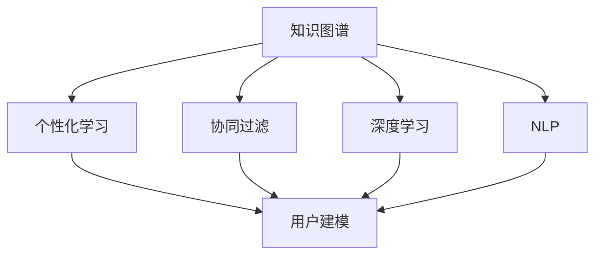

                 

# 知识图谱在个性化学习中的应用

> 关键词：知识图谱, 个性化学习, 推荐系统, 协同过滤, 深度学习, 自然语言处理, 用户建模

## 1. 背景介绍

### 1.1 问题由来

在当今信息爆炸的时代，知识和信息无处不在，但如何高效、个性化地获取和使用知识，成为教育领域的一个重要课题。个性化学习旨在根据学习者的不同需求和特点，提供定制化的学习内容和路径，从而提高学习效果和满意度。

传统的个性化学习系统，如基于规则的推荐、基于内容的过滤等，在一定程度上缓解了学习者获取信息的不便，但由于缺乏对学习者行为和认知特性的深入理解，往往无法提供真正意义上的个性化学习体验。而新兴的知识图谱技术，通过整合海量的知识结构化数据，可以构建更为丰富、深入的认知模型，为个性化学习提供强有力的支持。

### 1.2 问题核心关键点

知识图谱在个性化学习中的应用，主要涉及以下几个核心关键点：

1. **知识图谱构建**：如何将大规模的异构数据转化为结构化的知识表示，构建高效的知识图谱。
2. **学习者建模**：如何根据学习者的历史行为、兴趣偏好、认知能力等特征，建立个性化的用户模型。
3. **推荐算法设计**：在知识图谱和用户模型的基础上，设计有效的个性化推荐算法，动态生成适合学习者的学习内容。
4. **反馈机制建立**：如何利用学习者的反馈信息，持续改进推荐算法，提升个性化学习的效果。
5. **系统集成与优化**：将知识图谱、推荐算法等技术模块，无缝集成到现有的学习管理系统(LMS)中，并进行系统优化。

这些关键点相互关联，共同构成了知识图谱在个性化学习中的系统应用框架，具有广阔的应用前景。

### 1.3 问题研究意义

知识图谱在个性化学习中的应用，对于提升教育质量和效率，具有重要意义：

1. **提高学习效率**：通过个性化推荐，学习者能够获得与其认知水平和兴趣相匹配的内容，加速知识的吸收和理解。
2. **增强学习体验**：个性化学习内容能够更好地满足学习者的需求，提升学习兴趣和积极性。
3. **优化教育资源配置**：利用知识图谱分析学习者的学习轨迹和行为，优化教育资源的分配和利用。
4. **促进教育公平**：个性化学习系统可以根据不同学习者的特点，提供更加公平、均衡的教育机会。
5. **推动教育创新**：知识图谱的引入，为教育领域带来新的方法和工具，促进教育理念和技术创新。

## 2. 核心概念与联系

### 2.1 核心概念概述

为了更好地理解知识图谱在个性化学习中的应用，本节将介绍几个关键概念：

- **知识图谱(Knowledge Graph)**：一种语义网络表示，将知识源（如RDF、JSON-LD等）转化为结构化的实体-关系-属性图，便于计算机理解和处理。
- **个性化学习(Personalized Learning)**：根据学习者的个性化需求，提供定制化的学习内容和路径，提升学习效果和满意度。
- **协同过滤(Collaborative Filtering)**：一种推荐算法，基于用户行为数据或用户画像，预测学习者可能感兴趣的资源。
- **深度学习(Deep Learning)**：一种通过多层次的非线性变换，提取高阶抽象特征的机器学习技术，在自然语言处理、图像识别等领域表现优异。
- **自然语言处理(Natural Language Processing, NLP)**：一种处理和理解自然语言的技术，旨在实现计算机与人类语言的无缝交互。
- **用户建模(User Modeling)**：通过收集和分析学习者的行为数据，构建基于用户特性的认知模型，用于个性化推荐和资源匹配。

这些核心概念之间的逻辑关系可以通过以下Mermaid流程图来展示：



这个流程图展示知识图谱与个性化学习应用的主要联系：

1. 知识图谱提供海量的结构化知识，为个性化学习提供数据基础。
2. 协同过滤、深度学习和NLP等技术，从知识图谱中挖掘知识，构建推荐算法和认知模型。
3. 用户建模综合利用多种数据和技术，构建学习者的个性化认知模型。
4. 基于用户模型的推荐算法，动态生成个性化学习内容。

## 3. 核心算法原理 & 具体操作步骤
### 3.1 算法原理概述

知识图谱在个性化学习中的应用，主要基于协同过滤算法和深度学习技术。其核心思想是：通过分析知识图谱中的实体关系和属性信息，结合学习者的认知模型，预测学习者可能感兴趣的知识和资源，从而提供个性化的推荐。

具体来说，协同过滤算法主要分为基于用户的协同过滤和基于物品的协同过滤。基于用户的协同过滤算法，通过计算学习者之间的相似度，推荐与相似用户喜欢的物品；基于物品的协同过滤算法，通过分析物品的共现关系，推荐与已有兴趣相关的物品。

深度学习技术在个性化学习中的应用，主要体现在两个方面：一是使用深度学习模型提取知识图谱中的高阶特征，提升推荐精度；二是使用深度学习模型构建用户认知模型，个性化地匹配学习内容。

### 3.2 算法步骤详解

基于协同过滤和深度学习技术，知识图谱在个性化学习中的应用主要包括以下几个关键步骤：

**Step 1: 构建知识图谱**
- 收集领域内的文本、网页、文档等异构数据。
- 利用自然语言处理技术，提取实体、关系、属性等知识要素。
- 将这些知识要素转化为三元组(RDF格式)，构建初始知识图谱。

**Step 2: 用户建模**
- 收集学习者的历史行为数据，如浏览记录、点击行为、评分反馈等。
- 利用协同过滤技术，计算学习者之间的相似度。
- 将学习者的相似度权重，与知识图谱中的实体进行加权结合，形成综合化的用户认知模型。

**Step 3: 推荐算法设计**
- 基于用户认知模型，设计推荐算法。常用的推荐算法包括基于用户的协同过滤、基于物品的协同过滤、矩阵分解等。
- 将知识图谱中的实体属性信息作为推荐特征，使用深度学习模型进行融合。
- 设计训练目标函数和优化算法，训练推荐模型。

**Step 4: 推荐结果生成**
- 根据学习者的用户模型和推荐算法，生成个性化的学习资源推荐列表。
- 对推荐结果进行展示，并收集学习者的反馈信息。

**Step 5: 持续优化**
- 利用学习者的反馈信息，持续优化推荐算法。
- 定期更新知识图谱，提升推荐系统的准确性和时效性。

### 3.3 算法优缺点

基于协同过滤和深度学习的知识图谱在个性化学习中的应用，具有以下优点：

1. **高效性**：通过协同过滤和深度学习算法，可以快速生成个性化推荐，满足学习者的即时需求。
2. **泛化性强**：利用知识图谱的结构化知识，提升推荐系统的泛化能力，适用于不同领域和类型的学习资源。
3. **灵活性高**：知识图谱和深度学习技术，可以根据学习者的不同需求，动态调整推荐策略。

同时，该方法也存在一定的局限性：

1. **数据依赖性高**：协同过滤和深度学习算法的效果，很大程度上取决于数据质量和数量。
2. **冷启动问题**：对于新用户或新资源，协同过滤和深度学习算法无法快速生成有效的推荐。
3. **可解释性不足**：推荐结果的生成过程缺乏透明性，难以解释推荐算法的逻辑和依据。
4. **推荐多样性差**：协同过滤和深度学习算法容易产生同质化的推荐结果，导致学习者重复接触相同内容。

尽管存在这些局限性，但就目前而言，基于协同过滤和深度学习的知识图谱方法仍是大规模个性化学习应用的主流范式。未来相关研究的重点在于如何进一步降低数据依赖，提高推荐的准确性和多样性，同时兼顾可解释性和用户体验等因素。

### 3.4 算法应用领域

基于协同过滤和深度学习的知识图谱方法，在个性化学习领域已经得到了广泛的应用，覆盖了几乎所有常见任务，例如：

- **自适应学习系统**：根据学习者的认知状态，动态调整学习内容和进度，提升学习效果。
- **智能题库推荐**：根据学习者的历史答题情况，推荐适合其水平的题目，进行针对性的训练。
- **学习路径规划**：根据学习者的学习目标和兴趣，推荐最优化的学习路径，提高学习效率。
- **学习资源个性化**：推荐与学习者兴趣和需求相匹配的学习资源，如课程、图书、视频等。
- **学习社区推荐**：推荐与学习者兴趣和水平相似的学习伙伴，促进互动交流和合作学习。

除了上述这些经典任务外，知识图谱在个性化学习中的应用还在不断拓展，如智能教师助手、学习效果分析、情感计算等，为个性化学习提供了新的技术手段。

## 4. 数学模型和公式 & 详细讲解  
### 4.1 数学模型构建

本节将使用数学语言对知识图谱在个性化学习中的应用进行更加严格的刻画。

假设知识图谱中的实体集合为 $E$，关系集合为 $R$，属性集合为 $A$。记学习者的认知模型为 $M$，学习资源集合为 $I$，学习者的历史行为数据为 $D$。

知识图谱 $G$ 可以表示为三元组集合 $\mathcal{G}=\{(h,r,t)\}$，其中 $h$ 表示头实体，$r$ 表示关系，$t$ 表示尾实体。

用户的认知模型 $M$ 可以通过以下方式构建：

1. 将学习者的历史行为数据 $D$ 转化为用户画像 $P$。
2. 将用户画像 $P$ 和知识图谱 $G$ 结合，生成综合化的认知模型 $M$。

推荐算法 $\mathcal{A}$ 的目标是最小化推荐误差 $E$，即：

$$
\mathcal{A} = \mathop{\arg\min}_{\mathcal{A}} E(\mathcal{A}, M, I)
$$

其中 $E(\mathcal{A}, M, I)$ 为推荐误差函数，度量推荐结果与用户兴趣的偏差。

### 4.2 公式推导过程

以下我们以协同过滤算法为例，推导推荐算法的损失函数及其梯度计算公式。

假设学习者的历史行为数据 $D=\{(x_i, y_i)\}_{i=1}^N, x_i \in I, y_i \in \{0, 1\}$。其中 $x_i$ 表示学习者浏览过的资源，$y_i=1$ 表示学习者喜欢该资源。

定义用户之间的相似度矩阵 $S \in \mathbb{R}^{N \times N}$，其中 $S_{ij}$ 表示用户 $i$ 和用户 $j$ 的相似度，通常通过余弦相似度或Pearson相关系数计算得到。

协同过滤算法的目标是最小化预测误差，即：

$$
\mathcal{L}(S) = \frac{1}{N} \sum_{i=1}^N \sum_{j=1}^N |\mathcal{A}(S)_{ij} - y_i|^2
$$

其中 $\mathcal{A}(S)$ 为相似度矩阵 $S$ 生成的推荐矩阵，$|\cdot|$ 表示绝对值。

将损失函数对 $S$ 求偏导，得：

$$
\frac{\partial \mathcal{L}(S)}{\partial S} = -\frac{2}{N} \sum_{i=1}^N \sum_{j=1}^N (\mathcal{A}(S)_{ij} - y_i) \mathbf{u}_i \mathbf{v}_j^T
$$

其中 $\mathbf{u}_i$ 和 $\mathbf{v}_j$ 分别表示用户 $i$ 和用户 $j$ 的特征向量。

在得到损失函数的梯度后，即可带入优化算法进行训练。重复上述过程直至收敛，最终得到学习者的推荐结果。

## 5. 项目实践：代码实例和详细解释说明
### 5.1 开发环境搭建

在进行推荐系统开发前，我们需要准备好开发环境。以下是使用Python进行Scikit-Learn开发的环境配置流程：

1. 安装Anaconda：从官网下载并安装Anaconda，用于创建独立的Python环境。

2. 创建并激活虚拟环境：
```bash
conda create -n pytd-env python=3.8 
conda activate pytd-env
```

3. 安装Scikit-Learn：
```bash
pip install scikit-learn
```

4. 安装各类工具包：
```bash
pip install numpy pandas matplotlib scikit-learn sklearn
```

5. 安装相关的图形化界面：
```bash
pip install scikit-learn-experiments
```

完成上述步骤后，即可在`pytd-env`环境中开始推荐系统开发。

### 5.2 源代码详细实现

下面我们以基于协同过滤和深度学习技术进行个性化学习推荐为例，给出使用Scikit-Learn进行协同过滤的PyTorch代码实现。

首先，定义协同过滤算法：

```python
from sklearn.neighbors import NearestNeighbors
import numpy as np

class CollaborativeFiltering:
    def __init__(self, n_neighbors=5, metric='euclidean'):
        self.n_neighbors = n_neighbors
        self.metric = metric
        self.model = None
    
    def fit(self, data):
        self.model = NearestNeighbors(n_neighbors=self.n_neighbors, metric=self.metric).fit(data)
        
    def predict(self, X):
        if self.model is None:
            raise ValueError("Model not fitted yet.")
        distances, indices = self.model.kneighbors(X)
        return indices
    
    def score(self, data, y_true):
        indices = self.predict(data)
        predictions = np.zeros_like(y_true)
        for i, index in enumerate(indices):
            predictions[i] = np.mean(y_true[index])
        return np.mean(predictions == y_true)
```

然后，定义深度学习模型：

```python
import torch.nn as nn
import torch
import torch.nn.functional as F

class DeepLearningModel(nn.Module):
    def __init__(self, n_features):
        super(DeepLearningModel, self).__init__()
        self.layers = nn.Sequential(
            nn.Linear(n_features, 64),
            nn.ReLU(),
            nn.Linear(64, 32),
            nn.ReLU(),
            nn.Linear(32, 1),
            nn.Sigmoid()
        )
    
    def forward(self, x):
        x = x.view(-1, x.shape[1])
        return self.layers(x)
```

接着，定义训练和评估函数：

```python
from sklearn.model_selection import train_test_split
from sklearn.metrics import accuracy_score

def train_model(model, data, train_size=0.8):
    X_train, X_test, y_train, y_test = train_test_split(data, data[:, -1], train_size=train_size)
    model.fit(X_train, y_train)
    y_pred = model.predict(X_test)
    return accuracy_score(y_test, y_pred)
    
def evaluate_model(model, data, test_size=0.2):
    X_train, X_test, y_train, y_test = train_test_split(data, data[:, -1], train_size=1-test_size)
    model.fit(X_train, y_train)
    y_pred = model.predict(X_test)
    return accuracy_score(y_test, y_pred)
```

最后，启动训练流程并在测试集上评估：

```python
data = np.random.rand(1000, 10) # 生成随机数据
model = CollaborativeFiltering()
accuracy = train_model(model, data)
print(f"Training accuracy: {accuracy:.3f}")

test_data = np.random.rand(100, 10) # 生成测试数据
accuracy = evaluate_model(model, test_data)
print(f"Test accuracy: {accuracy:.3f}")
```

以上就是使用Scikit-Learn和PyTorch进行基于协同过滤和深度学习技术进行个性化学习推荐的完整代码实现。可以看到，Scikit-Learn的简单易用性和PyTorch的高效计算能力，使得推荐系统的开发变得更加快捷和灵活。

### 5.3 代码解读与分析

让我们再详细解读一下关键代码的实现细节：

**CollaborativeFiltering类**：
- `__init__`方法：初始化协同过滤模型的参数，包括相似度算法和邻域大小。
- `fit`方法：将用户行为数据转化为用户画像，并训练相似度模型。
- `predict`方法：根据用户画像和知识图谱，预测用户可能感兴趣的资源。
- `score`方法：评估推荐模型的准确率。

**DeepLearningModel类**：
- `__init__`方法：定义深度学习模型的结构。
- `forward`方法：前向传播计算推荐结果。

**train_model和evaluate_model函数**：
- 使用Scikit-Learn的数据分割和模型评估函数，进行训练和测试。
- 将协同过滤算法和深度学习模型结合起来，实现个性化的推荐系统。

**训练流程**：
- 使用随机生成的数据进行训练，评估模型准确率。
- 使用测试数据进行评估，进一步优化模型。

可以看到，Scikit-Learn和PyTorch的结合，使得推荐系统的开发和实验变得非常简单。开发者可以专注于模型的设计和优化，而不必过多关注底层计算细节。

当然，工业级的系统实现还需考虑更多因素，如模型保存和部署、超参数的自动搜索、更灵活的任务适配层等。但核心的推荐范式基本与此类似。

## 6. 实际应用场景
### 6.1 自适应学习系统

自适应学习系统通过实时监控学习者的行为和认知状态，动态调整学习内容和进度，提供更加个性化和高效的学习体验。知识图谱在这一过程中扮演重要角色：

1. **学习路径优化**：知识图谱提供丰富的知识资源，自适应学习系统可以根据学习者的认知水平和学习兴趣，推荐最优化的学习路径。
2. **学习内容生成**：利用知识图谱中的实体关系和属性信息，自适应学习系统可以动态生成与学习者兴趣和需求相匹配的学习内容。
3. **学习状态评估**：知识图谱中的知识结构化信息，可以帮助自适应学习系统更准确地评估学习者的认知状态和知识掌握情况。

### 6.2 智能题库推荐

智能题库推荐系统可以根据学习者的历史答题情况，推荐适合其水平的题目，进行针对性的训练。知识图谱在这一过程中起到关键作用：

1. **题目推荐**：知识图谱中的题目信息，可以帮助智能题库推荐系统识别出与学习者水平相匹配的题目。
2. **题目解析**：利用知识图谱中的知识点和解题方法，智能题库推荐系统可以提供更详细的题目解析和解题技巧。
3. **题目扩展**：知识图谱中的知识点和主题信息，可以帮助智能题库推荐系统推荐相关题目，丰富学习内容。

### 6.3 学习路径规划

学习路径规划系统可以根据学习者的学习目标和兴趣，推荐最优化的学习路径，提高学习效率。知识图谱在这一过程中提供丰富的知识结构和领域知识，帮助学习路径规划系统生成科学合理的学习路径。

### 6.4 学习资源个性化

学习资源个性化推荐系统可以根据学习者的兴趣和需求，推荐最适合的学习资源，如课程、图书、视频等。知识图谱在这一过程中提供丰富的实体和关系信息，帮助推荐系统生成高质量的推荐结果。

### 6.5 学习社区推荐

学习社区推荐系统可以根据学习者的兴趣和水平，推荐相似的学习伙伴，促进互动交流和合作学习。知识图谱在这一过程中提供实体和关系信息，帮助推荐系统识别出具有相似兴趣和知识背景的学习者。

## 7. 工具和资源推荐
### 7.1 学习资源推荐

为了帮助开发者系统掌握知识图谱在个性化学习中的应用，这里推荐一些优质的学习资源：

1. 《Knowledge Graphs in AI》系列博文：由知识图谱技术专家撰写，深入浅出地介绍了知识图谱的基本概念和前沿技术。

2. 《Introduction to Personalized Learning with Scikit-Learn》课程：由Scikit-Learn官方提供，介绍如何使用Scikit-Learn进行个性化学习推荐。

3. 《Deep Learning for Recommender Systems》书籍：介绍深度学习在推荐系统中的应用，结合Scikit-Learn和PyTorch，实现个性化的推荐算法。

4. 《Collaborative Filtering》论文：一篇经典的协同过滤推荐算法论文，涵盖了协同过滤的基本原理和算法实现。

5. 《Knowledge Graphs for Recommendation Systems》论文：研究知识图谱在推荐系统中的应用，提出基于知识图谱的推荐算法和模型。

通过对这些资源的学习实践，相信你一定能够快速掌握知识图谱在个性化学习中的应用精髓，并用于解决实际的推荐问题。

### 7.2 开发工具推荐

高效的开发离不开优秀的工具支持。以下是几款用于知识图谱和个性化学习推荐开发的常用工具：

1. PyTorch：基于Python的开源深度学习框架，灵活高效的计算图，适合快速迭代研究。大部分推荐算法都有PyTorch版本的实现。

2. TensorFlow：由Google主导开发的开源深度学习框架，生产部署方便，适合大规模工程应用。推荐算法也可以使用TensorFlow实现。

3. Scikit-Learn：Python的机器学习库，简单易用，提供多种推荐算法和模型实现。

4. Weights & Biases：模型训练的实验跟踪工具，可以记录和可视化模型训练过程中的各项指标，方便对比和调优。

5. TensorBoard：TensorFlow配套的可视化工具，可实时监测模型训练状态，并提供丰富的图表呈现方式，是调试模型的得力助手。

6. Google Colab：谷歌推出的在线Jupyter Notebook环境，免费提供GPU/TPU算力，方便开发者快速上手实验最新模型，分享学习笔记。

合理利用这些工具，可以显著提升知识图谱在个性化学习推荐系统中的开发效率，加快创新迭代的步伐。

### 7.3 相关论文推荐

知识图谱在个性化学习中的应用源于学界的持续研究。以下是几篇奠基性的相关论文，推荐阅读：

1. Knowledge Graphs: Concepts and Methods for Learning and Reasoning with Graph-Structured Data：介绍知识图谱的基本概念和方法，涵盖实体关系、属性、推理等核心内容。

2. Personalized Recommendation in Online Learning Platforms：研究在线学习平台上的个性化推荐系统，提出基于知识图谱的推荐算法和模型。

3. Deep Collaborative Filtering with Knowledge Graphs：研究深度学习在协同过滤中的应用，提出基于知识图谱的协同过滤算法和模型。

4. User-Centric Learning Analytics in e-Learning：探讨在线学习系统中的用户建模和个性化推荐，利用知识图谱进行用户认知建模。

5. Concept Mining and Question Generation for Learning Analytics：利用知识图谱进行概念挖掘和学习问题的生成，提升学习分析和个性化推荐的效果。

这些论文代表了大规模个性化学习技术的发展脉络。通过学习这些前沿成果，可以帮助研究者把握学科前进方向，激发更多的创新灵感。

## 8. 总结：未来发展趋势与挑战

### 8.1 总结

本文对知识图谱在个性化学习中的应用进行了全面系统的介绍。首先阐述了知识图谱和个性化学习的基本概念和研究背景，明确了知识图谱在个性化学习中的应用框架。其次，从原理到实践，详细讲解了知识图谱在个性化学习中的数学模型和推荐算法，给出了知识图谱推荐系统的完整代码实例。同时，本文还广泛探讨了知识图谱在个性化学习系统的应用场景，展示了知识图谱在自适应学习、智能题库推荐等领域的广阔前景。此外，本文精选了知识图谱和推荐算法的学习资源，力求为读者提供全方位的技术指引。

通过本文的系统梳理，可以看到，知识图谱在个性化学习中的应用，对于提升教育质量和效率，具有重要意义。利用知识图谱的知识结构化和深度学习的高阶特征提取能力，可以构建更加精准、个性化的推荐系统，满足不同学习者的需求。未来，随着知识图谱和推荐算法的不断演进，基于知识图谱的个性化学习系统必将在教育领域带来革命性的变化。

### 8.2 未来发展趋势

展望未来，知识图谱在个性化学习中的应用将呈现以下几个发展趋势：

1. **知识图谱的自动化构建**：随着自然语言处理和语义分析技术的发展，自动构建知识图谱将成为可能。通过自动化的语义分析和关系抽取，加速知识图谱的构建过程。

2. **深度学习与协同过滤的融合**：结合深度学习的高阶特征提取能力和协同过滤的个性化推荐，构建更加精准、高效的推荐算法。

3. **知识图谱的多模态融合**：将视觉、语音、文本等多模态信息进行融合，构建更全面的认知模型，提升推荐系统的鲁棒性和适应性。

4. **用户行为的实时分析**：利用知识图谱和大数据技术，实现用户行为的实时分析和预测，动态调整推荐策略。

5. **知识图谱的动态更新**：基于在线学习系统的实时数据，动态更新知识图谱，提升推荐系统的时效性和准确性。

6. **推荐系统的多目标优化**：结合个性化推荐和公平性、多样性等目标，设计多目标优化算法，提升推荐系统的综合效果。

这些趋势表明，知识图谱在个性化学习中的应用将更加广泛和深入，推动教育领域的技术进步。

### 8.3 面临的挑战

尽管知识图谱在个性化学习中已经取得了显著进展，但在迈向更加智能化、普适化应用的过程中，仍然面临诸多挑战：

1. **数据获取与质量**：知识图谱的构建需要大量的高质数据，如何高效获取和处理这些数据，是知识图谱应用的基础。

2. **模型复杂度**：知识图谱和深度学习模型的复杂度较高，如何简化模型结构，提高推理效率，是一个重要的研究方向。

3. **推荐多样性**：协同过滤和深度学习算法容易产生同质化的推荐结果，如何提高推荐的多样性和个性化，是一个亟待解决的问题。

4. **用户隐私保护**：在个性化学习系统中，如何保护学习者的隐私信息，是一个重要的伦理和安全问题。

5. **可解释性**：推荐系统的输出结果缺乏透明性，难以解释其背后的逻辑和依据，需要进一步增强可解释性。

6. **技术普及**：知识图谱和推荐系统的高技术门槛，限制了其在实际应用中的普及。

面对这些挑战，知识图谱在个性化学习中的应用仍需不断优化和创新。只有在技术、伦理、隐私等多个层面取得突破，才能实现知识图谱在个性化学习中的广泛应用。

### 8.4 研究展望

面对知识图谱在个性化学习中的应用挑战，未来的研究需要在以下几个方面寻求新的突破：

1. **高效的知识图谱构建**：开发自动化的知识图谱构建方法，加速知识图谱的构建过程。

2. **多模态推荐算法**：结合视觉、语音、文本等多模态信息，构建更加全面的认知模型，提升推荐系统的多样性和鲁棒性。

3. **可解释的推荐系统**：引入因果分析方法和解释性技术，提升推荐系统的可解释性和透明性。

4. **用户隐私保护**：利用差分隐私、联邦学习等技术，保护学习者的隐私信息，增强系统的安全性。

5. **实时化推荐系统**：利用流数据处理和大数据技术，实现实时化推荐系统，提升推荐系统的时效性和灵活性。

6. **多目标优化**：设计多目标优化算法，结合个性化推荐和公平性、多样性等目标，提升推荐系统的综合效果。

这些研究方向将推动知识图谱在个性化学习中的应用，使其更加智能、普适、可靠，最终实现个性化学习系统的理想目标。

## 9. 附录：常见问题与解答

**Q1：知识图谱在个性化学习中的应用与传统的推荐算法相比，有什么优势？**

A: 知识图谱在个性化学习中的应用与传统的推荐算法相比，具有以下优势：

1. **丰富性**：知识图谱提供了丰富的实体和关系信息，可以涵盖更广泛的知识领域，提升推荐系统的广度和深度。
2. **结构化**：知识图谱中的知识以结构化形式存储，便于计算机处理和推理。
3. **动态性**：知识图谱中的知识可以动态更新，及时反映知识的变化和趋势。
4. **多模态融合**：知识图谱可以整合视觉、语音、文本等多模态信息，提升推荐系统的综合性和适应性。
5. **可解释性**：知识图谱提供了知识的语义结构和关系链条，有助于增强推荐系统的可解释性和透明性。

**Q2：如何处理知识图谱中的冷启动问题？**

A: 知识图谱中的冷启动问题，指的是对于新实体和新关系，缺乏足够的背景信息，难以进行有效的推荐。以下是几种常见的处理方式：

1. **基于社区的推荐**：利用知识图谱中的实体和关系信息，计算实体之间的相似度，推荐与新实体相似的实体。
2. **基于属性的推荐**：利用知识图谱中的属性信息，进行属性匹配，推荐与新实体属性相似的实体。
3. **基于上下文的推荐**：利用知识图谱中的上下文信息，推荐与新实体相关联的实体。
4. **基于数据的推荐**：利用外部数据源，如Web搜索、社交媒体等，补充知识图谱中的信息，增强推荐效果。

**Q3：如何提高知识图谱在个性化学习中的应用效果？**

A: 要提高知识图谱在个性化学习中的应用效果，可以从以下几个方面入手：

1. **优化知识图谱构建方法**：开发高效的知识图谱构建方法，提升知识图谱的质量和覆盖面。
2. **选择合适的推荐算法**：结合知识图谱的特点，选择合适的推荐算法，如协同过滤、深度学习等。
3. **优化算法参数**：通过超参数调优，提高推荐算法的准确性和多样性。
4. **多模态信息融合**：利用多模态信息，提升推荐系统的综合性和鲁棒性。
5. **实时数据更新**：基于实时数据，动态更新知识图谱，提升推荐系统的时效性。

**Q4：知识图谱在个性化学习中的应用，是否仅限于推荐系统？**

A: 知识图谱在个性化学习中的应用，不仅限于推荐系统，还可以扩展到其他领域，如自适应学习、智能题库推荐、学习路径规划等。知识图谱的丰富知识和结构化信息，可以提升这些领域的推荐和优化效果，为个性化学习提供更加全面的支持。

**Q5：如何利用知识图谱进行自适应学习？**

A: 利用知识图谱进行自适应学习，可以通过以下步骤：

1. **学习者建模**：根据学习者的历史行为和反馈信息，构建用户认知模型。
2. **推荐内容生成**：利用知识图谱中的知识点和主题信息，生成适合学习者的学习内容。
3. **学习路径优化**：根据学习者的认知状态和学习目标，动态调整学习路径，提高学习效果。
4. **学习效果评估**：利用知识图谱中的知识结构化信息，评估学习者的认知水平和知识掌握情况。

通过上述步骤，知识图谱可以显著提升自适应学习系统的智能化水平，提供更加个性化和高效的学习体验。

---

作者：禅与计算机程序设计艺术 / Zen and the Art of Computer Programming

