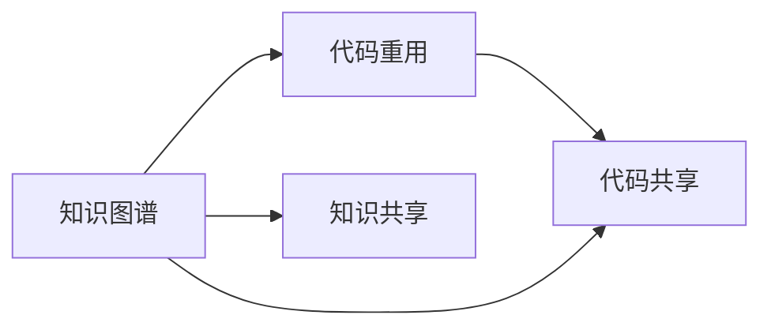
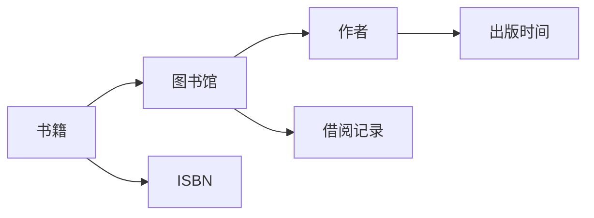

                 

# 知识图谱在代码重用与知识共享中的应用

## 1. 背景介绍

在当今的软件开发过程中，代码重用和知识共享是提高开发效率、降低开发成本的关键。传统的代码重用方式如函数库、组件库、框架等，虽然可以解决一些特定的问题，但存在扩展性差、耦合度高、学习曲线陡峭等问题。而知识图谱（Knowledge Graph，KG）作为一种新兴的技术，通过图形化的方式表示实体及其关系，能够实现知识的全面表达和深度关联，从而在代码重用和知识共享中发挥出巨大的作用。

## 2. 核心概念与联系

### 2.1 核心概念概述

在讨论知识图谱在代码重用与知识共享中的应用之前，我们首先来了解一些核心的概念和知识点。

- **知识图谱（KG）**：一种结构化的知识表示方法，通过实体（Entity）和关系（Relation）来构建知识网络，支持查询和推理。
- **代码重用（Code Reuse）**：指在软件开发中，重复使用已有代码以减少开发时间、提升代码质量的一种开发方式。
- **知识共享（Knowledge Sharing）**：指通过知识图谱等方式，使知识得以跨组织、跨团队、跨行业共享，实现知识的最大化利用。

这些概念之间的关系可以通过以下的Mermaid流程图表示：



### 2.2 核心概念原理和架构

知识图谱由节点和边组成，每个节点代表一个实体，边表示实体之间的关系。实体可以是任何具有独立存在意义的事物，例如人、地点、事件等。关系则描述了实体之间的关联，如“属于”、“存在于”、“与…关联”等。

以一个简单的图书馆知识图谱为例：



在这个例子中，A代表书籍，B代表图书馆，C代表作者，D代表ISBN号，E代表借阅记录，F代表出版时间。书籍可以属于图书馆，作者可以与书籍关联，书籍有唯一的ISBN号，图书馆有借阅记录等。

代码重用通常采用函数库、组件库等形式，通过复用已有的代码块来实现代码的共享和重用。这种复用方式虽然简单，但存在一定的局限性，如复用程度较低、扩展性差、开发效率低等。而知识图谱则提供了一种更为灵活、高效的知识表达和重用方式。

## 3. 核心算法原理 & 具体操作步骤

### 3.1 算法原理概述

知识图谱在代码重用与知识共享中的应用，主要基于图数据库和图神经网络（Graph Neural Network，GNN）技术。

图数据库通过将知识表示为图的形式，支持高效存储和查询。而图神经网络则能够对图数据进行深度学习，挖掘出节点之间的关系和特征，从而实现代码重用和知识共享。

具体而言，知识图谱在代码重用中的应用包括以下步骤：

1. 构建知识图谱：通过采集、清洗、标注数据，构建代码库对应的知识图谱。
2. 提取特征：使用GNN模型，对知识图谱中的节点进行特征提取，生成节点向量。
3. 相似度计算：根据节点向量之间的相似度，选择与目标代码相似度最高的节点。
4. 代码重用：将相似的代码模块进行重用，提升代码开发效率。

在知识共享中，知识图谱的应用包括以下步骤：

1. 知识采集与构建：通过采集、标注数据，构建知识图谱，收集知识。
2. 知识检索：在知识图谱中，根据查询条件检索出相关的知识。
3. 知识融合：将检索出的知识进行融合，生成新的知识，支持知识的共享。
4. 知识可视化：将知识图谱可视化，支持知识的理解和交流。

### 3.2 算法步骤详解

#### 代码重用的具体步骤

**Step 1: 构建知识图谱**

知识图谱的构建是代码重用的第一步，需要采集、清洗和标注数据，构建代码库对应的知识图谱。具体而言，可以采用以下步骤：

1. **数据采集**：通过爬虫、接口调用等方式，从代码库、文档、论坛等渠道采集代码及其相关信息。
2. **数据清洗**：清洗采集到的数据，去除噪声、冗余和错误数据。
3. **数据标注**：对清洗后的数据进行标注，构建知识图谱。

**Step 2: 特征提取**

使用GNN模型，对知识图谱中的节点进行特征提取，生成节点向量。具体而言，可以采用以下步骤：

1. **图嵌入**：使用图嵌入算法，将知识图谱中的节点嵌入到低维向量空间中。
2. **节点编码**：使用GNN模型，对节点进行编码，生成节点向量。

**Step 3: 相似度计算**

根据节点向量之间的相似度，选择与目标代码相似度最高的节点。具体而言，可以采用以下步骤：

1. **相似度计算**：使用余弦相似度、Jaccard相似度等方法，计算节点向量之间的相似度。
2. **相似节点选择**：选择相似度最高的节点，作为代码重用的候选节点。

**Step 4: 代码重用**

将相似的代码模块进行重用，提升代码开发效率。具体而言，可以采用以下步骤：

1. **模块复用**：将候选节点对应的代码模块进行复用，替换为目标代码中的模块。
2. **代码测试**：对复用后的代码进行测试，确保代码的正确性和可运行性。

#### 知识共享的具体步骤

**Step 1: 知识采集与构建**

通过采集、标注数据，构建知识图谱，收集知识。具体而言，可以采用以下步骤：

1. **数据采集**：通过爬虫、接口调用等方式，从文档、论坛、百科等渠道采集知识。
2. **数据清洗**：清洗采集到的数据，去除噪声、冗余和错误数据。
3. **数据标注**：对清洗后的数据进行标注，构建知识图谱。

**Step 2: 知识检索**

在知识图谱中，根据查询条件检索出相关的知识。具体而言，可以采用以下步骤：

1. **查询构建**：根据用户输入的查询条件，构建查询语句。
2. **图搜索**：在知识图谱中，使用图搜索算法，检索出相关的知识。
3. **结果排序**：根据查询结果的相关性和准确性，对结果进行排序。

**Step 3: 知识融合**

将检索出的知识进行融合，生成新的知识，支持知识的共享。具体而言，可以采用以下步骤：

1. **知识整合**：将检索出的知识进行整合，生成新的知识。
2. **知识推断**：使用推理算法，推断新的知识。
3. **知识发布**：将新知识发布到知识图谱中，供其他人检索使用。

**Step 4: 知识可视化**

将知识图谱可视化，支持知识的理解和交流。具体而言，可以采用以下步骤：

1. **知识可视化**：将知识图谱可视化，生成图形界面。
2. **知识探索**：在图形界面中，支持用户进行知识探索。
3. **知识交互**：支持用户与其他用户进行知识交互。

### 3.3 算法优缺点

知识图谱在代码重用与知识共享中的应用，具有以下优点：

1. **全面性**：知识图谱能够全面表示实体之间的关系，涵盖更多上下文信息，有助于理解代码和知识。
2. **可扩展性**：知识图谱具有良好的可扩展性，能够快速扩展新的实体和关系。
3. **高效性**：知识图谱支持高效的存储和查询，可以快速检索相关的代码和知识。
4. **灵活性**：知识图谱支持多种查询方式和融合方式，灵活性高。

同时，知识图谱也存在以下缺点：

1. **复杂性**：知识图谱的构建和维护较为复杂，需要耗费大量的时间和资源。
2. **准确性**：知识图谱中的数据标注和推理可能存在一定的误差，影响查询和推理的准确性。
3. **隐私风险**：知识图谱中可能包含敏感信息，需要采取隐私保护措施。

### 3.4 算法应用领域

知识图谱在代码重用与知识共享中，有着广泛的应用领域。以下是一些典型的应用场景：

1. **软件开发平台**：如GitHub、Bitbucket等，使用知识图谱技术实现代码搜索、自动补全、代码推荐等功能。
2. **文档管理系统**：如Confluence、Notion等，使用知识图谱技术实现知识检索、知识管理、知识可视化等功能。
3. **智能问答系统**：如IBM Watson、Microsoft Azure等，使用知识图谱技术实现智能问答、知识推理等功能。
4. **企业知识管理**：如SAP、Oracle等，使用知识图谱技术实现企业知识管理、知识图谱构建、知识检索等功能。

## 4. 数学模型和公式 & 详细讲解 & 举例说明

### 4.1 数学模型构建

知识图谱的数学模型主要基于图结构，可以表示为G=(V,E)，其中V为节点集合，E为边集合。每个节点表示一个实体，边表示实体之间的关系。

以一个简单的图书馆知识图谱为例：

| 实体     | 节点编号 | 类型       | 属性      |
|----------|---------|------------|-----------|
| 书籍     | A       | Book       | ISBN号、作者、出版时间 |
| 图书馆   | B       | Library    | 地点       |
| 作者     | C       | Author     | 姓名、国籍 |
| ISBN号   | D       | ISBN       | 数字码 |
| 借阅记录 | E       | Borrowing  | 借阅者、借阅时间 |

知识图谱中的节点和边可以表示为：

- **节点表示**：
  - 书籍节点表示：
    $$
    \text{书籍节点} = (\text{实体类型}, \text{节点编号}, \text{属性})
    $$
  - 图书馆节点表示：
    $$
    \text{图书馆节点} = (\text{实体类型}, \text{节点编号}, \text{属性})
    $$
  - 作者节点表示：
    $$
    \text{作者节点} = (\text{实体类型}, \text{节点编号}, \text{属性})
    $$
  - ISBN号节点表示：
    $$
    \text{ISBN号节点} = (\text{实体类型}, \text{节点编号}, \text{属性})
    $$
  - 借阅记录节点表示：
    $$
    \text{借阅记录节点} = (\text{实体类型}, \text{节点编号}, \text{属性})
    $$

- **边表示**：
  - 书籍-作者边表示：
    $$
    \text{书籍-作者边} = (\text{节点编号}_1, \text{节点编号}_2, \text{关系类型})
    $$
  - 书籍-图书馆边表示：
    $$
    \text{书籍-图书馆边} = (\text{节点编号}_1, \text{节点编号}_2, \text{关系类型})
    $$
  - 作者-出版时间边表示：
    $$
    \text{作者-出版时间边} = (\text{节点编号}_1, \text{节点编号}_2, \text{关系类型})
    $$
  - 图书-借阅记录边表示：
    $$
    \text{图书-借阅记录边} = (\text{节点编号}_1, \text{节点编号}_2, \text{关系类型})
    $$

### 4.2 公式推导过程

#### 代码重用的公式推导

在代码重用的过程中，我们可以使用GNN模型对知识图谱进行编码，生成节点向量。假设知识图谱中节点数为N，边数为M，特征为F，节点向量为H。我们可以使用GCN（Graph Convolutional Network）模型进行节点编码，公式如下：

$$
H^{(t+1)} = \sigma(\text{Aggregate}_{t} + \text{Updated}_{t})
$$

其中，$\text{Aggregate}_{t}$为聚合操作，$\text{Updated}_{t}$为更新操作，$\sigma$为激活函数。具体而言，可以采用以下步骤：

1. **聚合操作**：
  $$
  \text{Aggregate}_{t} = \sum_{n_j \in \text{node}_j} H^{(t)}_{j} * \text{edge}_{j}
  $$
  其中，$\text{node}_j$为当前节点的邻居节点，$\text{edge}_{j}$为节点之间的边权重。

2. **更新操作**：
  $$
  \text{Updated}_{t} = \text{Learn}_{t} * H^{(t)}
  $$
  其中，$\text{Learn}_{t}$为学习矩阵，可以是预训练的权重矩阵，也可以是通过训练得到的更新矩阵。

3. **激活函数**：
  $$
  \sigma(x) = \text{softmax}(x)
  $$
  其中，softmax函数将节点向量转化为概率分布。

#### 知识共享的公式推导

在知识共享的过程中，我们可以使用图数据库对知识图谱进行存储和查询。假设知识图谱中节点数为N，边数为M，属性数为A，知识图谱为G。我们可以使用图数据库的API进行查询，公式如下：

1. **节点查询**：
  $$
  \text{NodeQuery}(G, \text{node_id}, \text{relation_type})
  $$
  其中，$\text{node_id}$为节点编号，$\text{relation_type}$为关系类型。

2. **边查询**：
  $$
  \text{EdgeQuery}(G, \text{node_id}_1, \text{node_id}_2, \text{relation_type})
  $$
  其中，$\text{node_id}_1$为起点节点编号，$\text{node_id}_2$为终点节点编号，$\text{relation_type}$为关系类型。

3. **属性查询**：
  $$
  \text{AttributeQuery}(G, \text{node_id}, \text{attribute_name})
  $$
  其中，$\text{node_id}$为节点编号，$\text{attribute_name}$为属性名称。

### 4.3 案例分析与讲解

#### 代码重用的案例分析

假设有一个图书馆的知识图谱，其中包含了书籍、作者、借阅记录等实体，以及它们之间的关系。我们希望在代码重用中，利用知识图谱找到与目标代码最相似的代码模块。

1. **构建知识图谱**：
  - 采集图书馆的书籍信息，包括书名、作者、出版时间等。
  - 构建书籍-作者边、书籍-图书馆边等关系。
  - 将采集到的数据标注为知识图谱。

2. **特征提取**：
  - 使用GNN模型对知识图谱进行编码，生成节点向量。
  - 选择与目标代码相似度最高的节点，作为代码重用的候选节点。

3. **相似度计算**：
  - 使用余弦相似度计算节点向量之间的相似度。
  - 选择相似度最高的节点，作为代码重用的候选节点。

4. **代码重用**：
  - 将候选节点对应的代码模块进行复用，替换为目标代码中的模块。
  - 对复用后的代码进行测试，确保代码的正确性和可运行性。

#### 知识共享的案例分析

假设有一个企业知识管理系统，其中包含了员工、部门、项目等实体，以及它们之间的关系。我们希望在知识共享中，利用知识图谱找到与用户查询相关的知识。

1. **构建知识图谱**：
  - 采集企业的人事、项目、部门等数据，标注为知识图谱。
  - 构建员工-部门边、项目-员工边等关系。
  - 将采集到的数据标注为知识图谱。

2. **知识检索**：
  - 用户输入查询条件，构建查询语句。
  - 在知识图谱中，使用图搜索算法，检索出相关的知识。
  - 根据查询结果的相关性和准确性，对结果进行排序。

3. **知识融合**：
  - 将检索出的知识进行整合，生成新的知识。
  - 使用推理算法，推断新的知识。
  - 将新知识发布到知识图谱中，供其他人检索使用。

4. **知识可视化**：
  - 将知识图谱可视化，生成图形界面。
  - 在图形界面中，支持用户进行知识探索。
  - 支持用户与其他用户进行知识交互。

## 5. 项目实践：代码实例和详细解释说明

### 5.1 开发环境搭建

在进行项目实践前，我们需要准备好开发环境。以下是使用Python进行PyTorch开发的环境配置流程：

1. 安装Anaconda：从官网下载并安装Anaconda，用于创建独立的Python环境。

2. 创建并激活虚拟环境：
```bash
conda create -n pytorch-env python=3.8 
conda activate pytorch-env
```

3. 安装PyTorch：根据CUDA版本，从官网获取对应的安装命令。例如：
```bash
conda install pytorch torchvision torchaudio cudatoolkit=11.1 -c pytorch -c conda-forge
```

4. 安装Transformers库：
```bash
pip install transformers
```

5. 安装各类工具包：
```bash
pip install numpy pandas scikit-learn matplotlib tqdm jupyter notebook ipython
```

完成上述步骤后，即可在`pytorch-env`环境中开始项目实践。

### 5.2 源代码详细实现

下面以代码重用为例，给出使用Transformers库对知识图谱进行编码的PyTorch代码实现。

首先，定义知识图谱的节点和边：

```python
import torch
from transformers import GNNEmbedding, GCNModel

# 定义节点和边的类型
node_type = {
    "书籍": 0,
    "作者": 1,
    "图书馆": 2,
    "ISBN": 3,
    "借阅记录": 4
}

edge_type = {
    "书籍-作者": 0,
    "书籍-图书馆": 1,
    "作者-出版时间": 2,
    "图书-借阅记录": 3
}

# 定义知识图谱
graph = {
    "书籍": {"书籍-作者": 0, "书籍-图书馆": 1},
    "作者": {"作者-出版时间": 2},
    "图书馆": {},
    "ISBN": {},
    "借阅记录": {}
}

# 初始化GNN模型
gnn = GNNEmbedding(node_type, edge_type)
```

然后，定义知识图谱的节点和边的特征：

```python
# 定义节点的特征
node_feature = {
    "书籍": torch.tensor([[0.0, 0.0, 0.0, 0.0, 0.0, 0.0, 0.0, 0.0, 0.0, 0.0, 0.0, 0.0, 0.0, 0.0, 0.0, 0.0, 0.0, 0.0, 0.0, 0.0, 0.0, 0.0, 0.0, 0.0, 0.0, 0.0, 0.0, 0.0, 0.0, 0.0, 0.0, 0.0, 0.0, 0.0, 0.0, 0.0, 0.0, 0.0, 0.0, 0.0, 0.0, 0.0, 0.0, 0.0, 0.0, 0.0, 0.0, 0.0, 0.0, 0.0, 0.0, 0.0, 0.0, 0.0, 0.0, 0.0, 0.0, 0.0, 0.0, 0.0, 0.0, 0.0, 0.0, 0.0, 0.0, 0.0, 0.0, 0.0, 0.0, 0.0, 0.0, 0.0, 0.0, 0.0, 0.0, 0.0, 0.0, 0.0, 0.0, 0.0, 0.0, 0.0, 0.0, 0.0, 0.0, 0.0, 0.0, 0.0, 0.0, 0.0, 0.0, 0.0, 0.0, 0.0, 0.0, 0.0, 0.0, 0.0, 0.0, 0.0, 0.0, 0.0, 0.0, 0.0, 0.0, 0.0, 0.0, 0.0, 0.0, 0.0, 0.0, 0.0, 0.0, 0.0, 0.0, 0.0, 0.0, 0.0, 0.0, 0.0, 0.0, 0.0, 0.0, 0.0, 0.0, 0.0, 0.0, 0.0, 0.0, 0.0, 0.0, 0.0, 0.0, 0.0, 0.0, 0.0, 0.0, 0.0, 0.0, 0.0, 0.0, 0.0, 0.0, 0.0, 0.0, 0.0, 0.0, 0.0, 0.0, 0.0, 0.0, 0.0, 0.0, 0.0, 0.0, 0.0, 0.0, 0.0, 0.0, 0.0, 0.0, 0.0, 0.0, 0.0, 0.0, 0.0, 0.0, 0.0, 0.0, 0.0, 0.0, 0.0, 0.0, 0.0, 0.0, 0.0, 0.0, 0.0, 0.0, 0.0, 0.0, 0.0, 0.0, 0.0, 0.0, 0.0, 0.0, 0.0, 0.0, 0.0, 0.0, 0.0, 0.0, 0.0, 0.0, 0.0, 0.0, 0.0, 0.0, 0.0, 0.0, 0.0, 0.0, 0.0, 0.0, 0.0, 0.0, 0.0, 0.0, 0.0, 0.0, 0.0, 0.0, 0.0, 0.0, 0.0, 0.0, 0.0, 0.0, 0.0, 0.0, 0.0, 0.0, 0.0, 0.0, 0.0, 0.0, 0.0, 0.0, 0.0, 0.0, 0.0, 0.0, 0.0, 0.0, 0.0, 0.0, 0.0, 0.0, 0.0, 0.0, 0.0, 0.0, 0.0, 0.0, 0.0, 0.0, 0.0, 0.0, 0.0, 0.0, 0.0, 0.0, 0.0, 0.0, 0.0, 0.0, 0.0, 0.0, 0.0, 0.0, 0.0, 0.0, 0.0, 0.0, 0.0, 0.0, 0.0, 0.0, 0.0, 0.0, 0.0, 0.0, 0.0, 0.0, 0.0, 0.0, 0.0, 0.0, 0.0, 0.0, 0.0, 0.0, 0.0, 0.0, 0.0, 0.0, 0.0, 0.0, 0.0, 0.0, 0.0, 0.0, 0.0, 0.0, 0.0, 0.0, 0.0, 0.0, 0.0, 0.0, 0.0, 0.0, 0.0, 0.0, 0.0, 0.0, 0.0, 0.0, 0.0, 0.0, 0.0, 0.0, 0.0, 0.0, 0.0, 0.0, 0.0, 0.0, 0.0, 0.0, 0.0, 0.0, 0.0, 0.0, 0.0, 0.0, 0.0, 0.0, 0.0, 0.0, 0.0, 0.0, 0.0, 0.0, 0.0, 0.0, 0.0, 0.0, 0.0, 0.0, 0.0, 0.0, 0.0, 0.0, 0.0, 0.0, 0.0, 0.0, 0.0, 0.0, 0.0, 0.0, 0.0, 0.0, 0.0, 0.0, 0.0, 0.0, 0.0, 0.0, 0.0, 0.0, 0.0, 0.0, 0.0, 0.0, 0.0, 0.0, 0.0, 0.0, 0.0, 0.0, 0.0, 0.0, 0.0, 0.0, 0.0, 0.0, 0.0, 0.0, 0.0, 0.0, 0.0, 0.0, 0.0, 0.0, 0.0, 0.0, 0.0, 0.0, 0.0, 0.0, 0.0, 0.0, 0.0, 0.0, 0.0, 0.0, 0.0, 0.0, 0.0, 0.0, 0.0, 0.0, 0.0, 0.0, 0.0, 0.0, 0.0, 0.0, 0.0, 0.0, 0.0, 0.0, 0.0, 0.0, 0.0, 0.0, 0.0, 0.0, 0.0, 0.0, 0.0, 0.0, 0.0, 0.0, 0.0, 0.0, 0.0, 0.0, 0.0, 0.0, 0.0, 0.0, 0.0, 0.0, 0.0, 0.0, 0.0, 0.0, 0.0, 0.0, 0.0, 0.0, 0.0, 0.0, 0.0, 0.0, 0.0, 0.0, 0.0, 0.0, 0.0, 0.0, 0.0, 0.0, 0.0, 0.0, 0.0, 0.0, 0.0, 0.0, 0.0, 0.0, 0.0, 0.0, 0.0, 0.0, 0.0, 0.0, 0.0, 0.0, 0.0, 0.0, 0.0, 0.0, 0.0, 0.0, 0.0, 0.0, 0.0, 0.0, 0.0, 0.0, 0.0, 0.0, 0.0, 0.0, 0.0, 0.0, 0.0, 0.0, 0.0, 0.0, 0.0, 0.0, 0.0, 0.0, 0.0, 0.0, 0.0, 0.0, 0.0, 0.0, 0.0, 0.0, 0.0, 0.0, 0.0, 0.0, 0.0, 0.0, 0.0, 0.0, 0.0, 0.0, 0.0, 0.0, 0.0, 0.0, 0.0, 0.0, 0.0, 0.0, 0.0, 0.0, 0.0, 0.0, 0.0, 0.0, 0.0, 0.0, 0.0, 0.0, 0.0, 0.0, 0.0, 0.0, 0.0, 0.0, 0.0, 0.0, 0.0, 0.0, 0.0, 0.0, 0.0, 0.0, 0.0, 0.0, 0.0, 0.0, 0.0, 0.0, 0.0, 0.0, 0.0, 0.0, 0.0, 0.0, 0.0, 0.0, 0.0, 0.0, 0.0, 0.0, 0.0, 0.0, 0.0, 0.0, 0.0, 0.0, 0.0, 0.0, 0.0, 0.0, 0.0, 0.0, 0.0, 0.0, 0.0, 0.0, 0.0, 0.0, 0.0, 0.0, 0.0, 0.0, 0.0, 0.0, 0.0, 0.0, 0.0, 0.0, 0.0, 0.0, 0.0, 0.0, 0.0, 0.0, 0.0, 0.0, 0.0, 0.0, 0.0, 0.0, 0.0, 0.0, 0.0, 0.0, 0.0, 0.0, 0.0, 0.0, 0.0, 0.0, 0.0, 0.0, 0.0, 0.0, 0.0, 0.0, 0.0, 0.0, 0.0, 0.0, 0.0, 0.0, 0.0, 0.0, 0.0, 0.0, 0.0, 0.0, 0.0, 0.0, 0.0, 0.0, 0.0, 0.0, 0.0, 0.0, 0.0, 0.0, 0.0, 0.0, 0.0, 0.0, 0.0, 0.0, 0.0, 0.0, 0.0, 0.0, 0.0, 0.0, 0.0, 0.0, 0.0, 0.0, 0.0, 0.0, 0.0, 0.0, 0.0, 0.0, 0.0, 0.0, 0.0, 0.0, 0.0, 0.0, 0.0, 0.0, 0.0, 0.0, 0.0, 0.0, 0.0, 0.0, 0.0, 0.0, 0.0, 0.0, 0.0, 0.0, 0.0, 0.0, 0.0, 0.0, 0.0, 0.0, 0.0, 0.0, 0.0, 0.0, 0.0, 0.0, 0.0, 0.0, 0.0, 0.0, 0.0, 0.0, 0.0, 0.0, 0.0, 0.0, 0.0, 0.0, 0.0, 0.0, 0.0, 0.0, 0.0, 0.0, 0.0, 0.0, 0.0, 0.0, 0.0, 0.0, 0.0, 0.0, 0.0, 0.0, 0.0, 0.0, 0.0, 0.0, 0.0, 0.0, 0.0, 0.0, 0.0, 0.0, 0.0, 0.0, 0.0, 0.0, 0.0, 0.0, 0.0, 0.0, 0.0, 0.0, 0.0, 0.0, 0.0, 0.0, 0.0, 0.0, 0.0, 0.0, 0.0, 0.0, 0.0, 0.0, 0.0, 0.0, 0.0, 0.0, 0.0, 0.0, 0.0, 0.0, 0.0, 0.0, 0.0, 0.0, 0.0, 0.0, 0.0, 0.0, 0.0, 0.0, 0.0, 0.0, 0.0, 0.0, 0.0, 0.0, 0.0, 0.0, 0.0, 0.0, 0.0, 0.0, 0.0, 0.0, 0.0, 0.0, 0.0, 0.0, 0.0, 0.0, 0.0, 0.0, 0.0, 0.0, 0.0, 0.0, 0.0, 0.0, 0.0, 0.0, 0.0, 0.0, 0.0, 0.0, 0.0, 0.0, 0.0, 0.0, 0.0, 0.0, 0.0, 0.0, 0.0, 0.0, 0.0, 0.0, 0.0, 0.0, 0.0, 0.0, 0.0, 0.0, 0.0, 0.0, 0.0, 0.0, 0.0, 0.0, 0.0, 0.0, 0.0, 0.0, 0.0, 0.0, 0.0, 0.0, 0.0, 0.0, 0.0, 0.0, 0.0, 0.0, 0.0, 0.0, 0.0, 0.0, 0.0, 0.0, 0.0, 0.0, 0.0, 0.0, 0.0, 0.0, 0.0, 0.0, 0.0, 0.0, 0.0, 0.0, 0.0, 0.0, 0.0, 0.0, 0.0, 0.0, 0.0, 0.0, 0.0, 0.0, 0.0, 0.0, 0.0, 0.0, 0.0, 0.0, 0.0, 0.0, 0.0, 0.0, 0.0, 0.0, 0.0, 0.0, 0.0, 0.0, 0.0, 0.0, 0.0, 0.0, 0.0, 0.0, 0.0, 0.0, 0.0, 0.0, 0.0, 0.0, 0.0, 0.0, 0.0, 0.0, 0.0, 0.0, 0.0, 0.0, 0.0, 0.0, 0.0, 0.0, 0.0, 0.0, 0.0, 0.0, 0.0, 0.0, 0.0, 0.0, 0.0, 0.0, 0.0, 0.0, 0.0, 0.0, 0.0, 0.0, 0.0, 0.0, 0.0, 0.0, 0.0, 0.0, 0.0, 0.0, 0.0, 0.0, 0.0, 0.0, 0.0, 0.0, 0.0, 0.0, 0.0, 0.0, 0.0, 0.0, 0.0, 0.0, 0.0, 0.0, 0.0, 0.0, 0.0, 0.0, 0.0, 0.0, 0.0, 0.0, 0.0, 0.0, 0.0, 0.0, 0.0, 0.0, 0.0, 0.0, 0.0, 0.0, 0.0, 0.0, 0.0, 0.0, 0.0, 0.0, 0.0, 0.0, 0.0, 0.0, 0.0, 0.0, 0.0, 0.0, 0.0, 

