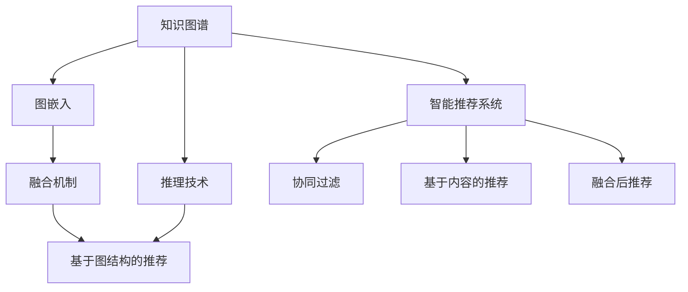

                 

# 知识图谱在智能推荐系统中的应用

## 1. 背景介绍

在信息爆炸的今天，如何从海量数据中快速准确地为用户推荐感兴趣的内容，成为互联网企业所面临的重要挑战。传统的推荐系统主要基于协同过滤、基于内容的推荐等方法，但这些方法往往依赖于用户行为数据，无法充分利用丰富的外部知识信息。因此，引入知识图谱，利用其强大的语义表达能力和知识推理能力，成为了提升推荐系统精准度和多样性的一个重要方向。

知识图谱是一类重要的图结构数据，通常由实体、关系和属性组成。实体代表具体的对象，如电影、书籍、音乐等；关系描述实体之间的语义联系，如"导演"、"主演"、"评价"等；属性记录实体或关系的特征，如电影的类型、评分、时长等。知识图谱通过捕捉现实世界中实体和关系之间的语义联系，为推荐系统提供了丰富的语义知识和外部信息源。

## 2. 核心概念与联系

### 2.1 核心概念概述

- **知识图谱**：由实体、关系和属性组成的网络，用于表示实体之间的语义联系。
- **智能推荐系统**：通过用户行为数据、内容属性和外部知识信息，自动为用户推荐感兴趣的物品。
- **图嵌入**：将知识图谱转化为低维向量空间表示的方法，方便模型进行推理和分析。
- **融合机制**：将知识图谱嵌入和其他推荐特征进行融合的技术，提升推荐系统的精准度。
- **基于图结构的推荐**：利用知识图谱中的语义关系，进行物品推荐。
- **推理技术**：在知识图谱中进行推理，获取实体间的隐含关系，增强推荐系统效果。

这些概念构成了智能推荐系统中的核心技术框架。其中，知识图谱嵌入和融合机制是实现基于图结构推荐的关键技术。

### 2.2 核心概念联系

以上核心概念之间的联系可通过以下Mermaid流程图来展示：



这个流程图展示了知识图谱在智能推荐系统中的核心地位，以及与之相关的各种关键技术：

1. 知识图谱通过图嵌入技术被转化为向量表示，方便在推荐模型中进行处理。
2. 通过融合机制将图嵌入结果和其他推荐特征进行结合，提升推荐系统的表现。
3. 推理技术可以在知识图谱中挖掘出实体间的隐含关系，增强推荐效果。
4. 最终，融合后的推荐结果和传统推荐算法（如协同过滤、基于内容推荐等）相结合，产生更精准的推荐结果。

## 3. 核心算法原理 & 具体操作步骤

### 3.1 算法原理概述

知识图谱在智能推荐系统中的应用主要基于图嵌入技术，将知识图谱转化为向量空间表示，并通过融合机制将嵌入结果与传统推荐特征结合。以下我们将介绍图嵌入和融合机制的核心算法原理。

### 3.2 算法步骤详解

#### 3.2.1 图嵌入

图嵌入的目标是将知识图谱中的实体和关系映射为向量空间中的低维向量，使得向量之间的距离能够表示实体和关系之间的语义相似性。常用的图嵌入算法包括TransE、R-GCN、GraphSAGE等。这里我们以TransE算法为例，简要介绍图嵌入的原理和步骤。

TransE算法基于三角矩阵分解，目标是将实体$h$和关系$r$映射为向量$\mathbf{h}$和$\mathbf{r}$，使得：
$$
\mathbf{t} = \mathbf{h} \cdot \mathbf{r}
$$
其中$\mathbf{t}$是目标实体$t$的向量表示。该目标可以通过最小化均方误差$\frac{1}{2} || \mathbf{t} - \mathbf{h} \cdot \mathbf{r} ||^2$来实现。

具体步骤如下：

1. **数据预处理**：将知识图谱转化为稀疏矩阵，去除噪声和孤立节点，计算每个节点的入度和出度，选取合适的采样策略。
2. **矩阵分解**：构建目标实体$t$与潜在关系$r$之间的三角矩阵$\mathbf{H} \cdot \mathbf{R}$，求解矩阵分解问题$\mathbf{H} \cdot \mathbf{R} = \mathbf{T}$，得到每个实体和关系的向量表示。
3. **向量映射**：对所有节点的向量表示进行归一化处理，映射到低维向量空间中。

#### 3.2.2 融合机制

融合机制是将图嵌入结果与其他推荐特征结合的技术。常用的融合方法包括特征加权、特征拼接、特征转换等。这里以特征加权为例，介绍融合机制的原理和步骤。

假设推荐系统已经收集到了用户的历史行为数据$I$、物品属性特征$A$和知识图谱嵌入$G$。为了综合利用这些信息，可以对它们进行加权融合。加权融合的目标是通过优化损失函数$\mathcal{L}$，使得推荐结果$Y$能够最大化用户的满意度。

具体步骤如下：

1. **特征选择**：选择用于融合的推荐特征，如用户历史行为、物品属性、知识图谱嵌入等。
2. **权重计算**：计算每个推荐特征的权重，可以采用启发式方法（如基于特征重要性的加权）或基于学习的算法（如梯度提升）。
3. **融合计算**：将每个特征与权重相乘，然后加权求和，得到融合后的推荐结果。

### 3.3 算法优缺点

知识图谱在智能推荐系统中的应用具有以下优点：

1. **丰富语义信息**：知识图谱提供了丰富的实体关系和属性信息，可以充分利用这些信息，提升推荐系统的精准度。
2. **跨领域知识融合**：通过融合知识图谱和传统推荐特征，可以更好地处理多源异构数据，提高推荐系统泛化能力。
3. **自动化推荐**：利用图嵌入和推理技术，可以实现自动化的推荐过程，减少人工干预。

然而，知识图谱在推荐系统中也存在一些缺点：

1. **构建成本高**：知识图谱的构建需要大量的人工标注和维护工作，成本较高。
2. **数据稀疏性**：知识图谱中的实体关系可能存在数据稀疏性，无法全面覆盖所有实体和关系。
3. **嵌入质量问题**：图嵌入算法的效果很大程度上取决于参数设置和训练策略，有时需要反复调整才能得到较好的嵌入结果。
4. **推理复杂度**：知识图谱中的推理问题可能非常复杂，有时需要设计复杂的规则和算法才能得到准确的推理结果。

### 3.4 算法应用领域

知识图谱在智能推荐系统中的应用已逐步拓展到多个领域，包括但不限于以下：

1. **电商推荐**：利用知识图谱中的商品关系和属性信息，为用户提供更精准的商品推荐。
2. **内容推荐**：通过知识图谱中的内容关系和标签信息，为用户推荐相关文章、视频、音乐等。
3. **社交推荐**：利用知识图谱中的人际关系和社交属性，为用户推荐好友、群组等。
4. **旅游推荐**：利用知识图谱中的旅游景点关系和推荐信息，为用户推荐旅游目的地和旅游路线。

## 4. 数学模型和公式 & 详细讲解 & 举例说明

### 4.1 数学模型构建

#### 4.1.1 图嵌入模型

以TransE算法为例，我们定义一个知识图谱$G=(\mathcal{E}, \mathcal{R}, \mathcal{I})$，其中$\mathcal{E}$表示实体集合，$\mathcal{R}$表示关系集合，$\mathcal{I}$表示实体的属性集合。假设实体$h$、关系$r$和目标实体$t$，则TransE的目标是最小化均方误差$\frac{1}{2} || \mathbf{t} - \mathbf{h} \cdot \mathbf{r} ||^2$。

令$\mathbf{h} \in \mathbb{R}^d$表示实体$h$的向量表示，$\mathbf{r} \in \mathbb{R}^d$表示关系$r$的向量表示，$\mathbf{t} \in \mathbb{R}^d$表示目标实体$t$的向量表示。则目标函数可以表示为：
$$
\mathcal{L} = \frac{1}{2} \sum_{(h, r, t) \in \mathcal{G}} || \mathbf{t} - \mathbf{h} \cdot \mathbf{r} ||^2
$$

其中$\mathcal{G}$表示知识图谱中的所有三元组。

#### 4.1.2 融合机制模型

假设推荐系统收集到了用户的历史行为数据$I$、物品属性特征$A$和知识图谱嵌入$G$。我们可以使用特征加权方法将它们融合。令$w_i$表示第$i$个推荐特征的权重，则融合后的推荐结果$Y$可以表示为：
$$
Y = \sum_{i=1}^{n} w_i \cdot f_i(I, A, G)
$$
其中$f_i$表示第$i$个推荐特征的计算函数。

### 4.2 公式推导过程

#### 4.2.1 图嵌入推导

令$\mathbf{H} \in \mathbb{R}^{n \times d}$表示所有实体的向量表示矩阵，$\mathbf{R} \in \mathbb{R}^{m \times d}$表示所有关系的向量表示矩阵，$\mathbf{T} \in \mathbb{R}^{n \times m}$表示所有目标实体的向量表示矩阵。则目标函数可以表示为：
$$
\mathcal{L} = \frac{1}{2} || \mathbf{H} \cdot \mathbf{R} - \mathbf{T} ||^2
$$

通过对目标函数进行梯度下降优化，可以得到实体和关系向量的更新公式为：
$$
\mathbf{H} \leftarrow \mathbf{H} - \eta \nabla_{\mathbf{H}}\mathcal{L}
$$
$$
\mathbf{R} \leftarrow \mathbf{R} - \eta \nabla_{\mathbf{R}}\mathcal{L}
$$
其中$\eta$为学习率。

#### 4.2.2 融合机制推导

假设推荐系统收集到了用户的历史行为数据$I$、物品属性特征$A$和知识图谱嵌入$G$，并得到了融合后的推荐结果$Y$。则融合过程可以表示为：
$$
Y = \sum_{i=1}^{n} w_i \cdot f_i(I, A, G)
$$
其中$w_i$表示第$i$个推荐特征的权重，$f_i$表示第$i$个推荐特征的计算函数。

### 4.3 案例分析与讲解

#### 4.3.1 电商推荐案例

假设一个电商推荐系统收集到了用户的历史购买记录$I$、商品属性特征$A$和知识图谱嵌入$G$，用于推荐商品。该系统采用特征加权方法，将$I$、$A$和$G$进行融合。具体步骤如下：

1. **数据预处理**：收集用户的历史购买记录$I$，去除重复和噪声记录，计算每个商品的入度和出度。
2. **矩阵分解**：构建目标实体$t$与潜在关系$r$之间的三角矩阵$\mathbf{H} \cdot \mathbf{R}$，求解矩阵分解问题$\mathbf{H} \cdot \mathbf{R} = \mathbf{T}$，得到每个实体和关系的向量表示。
3. **特征加权**：计算每个推荐特征的权重，采用基于特征重要性的加权方法，如使用TF-IDF等计算物品属性特征$A$的权重。
4. **融合计算**：将每个特征与权重相乘，然后加权求和，得到融合后的推荐结果。

#### 4.3.2 内容推荐案例

假设一个视频内容推荐系统收集到了用户的历史观看记录$I$、视频属性特征$A$和知识图谱嵌入$G$，用于推荐视频。该系统采用特征拼接方法，将$I$、$A$和$G$进行融合。具体步骤如下：

1. **数据预处理**：收集用户的历史观看记录$I$，去除重复和噪声记录，计算每个视频的入度和出度。
2. **矩阵分解**：构建目标实体$t$与潜在关系$r$之间的三角矩阵$\mathbf{H} \cdot \mathbf{R}$，求解矩阵分解问题$\mathbf{H} \cdot \mathbf{R} = \mathbf{T}$，得到每个实体和关系的向量表示。
3. **特征拼接**：将用户历史观看记录$I$、视频属性特征$A$和知识图谱嵌入$G$拼接，得到一个融合向量。
4. **融合计算**：使用简单的加法运算将融合向量与知识图谱嵌入$G$进行拼接，得到融合后的推荐结果。

## 5. 项目实践：代码实例和详细解释说明

### 5.1 开发环境搭建

进行项目实践前，需要搭建开发环境。以下是基于Python和PyTorch的开发环境搭建步骤：

1. 安装Anaconda：从官网下载并安装Anaconda，用于创建独立的Python环境。
2. 创建并激活虚拟环境：
```bash
conda create -n pytorch-env python=3.8 
conda activate pytorch-env
```

3. 安装PyTorch：根据CUDA版本，从官网获取对应的安装命令。例如：
```bash
conda install pytorch torchvision torchaudio cudatoolkit=11.1 -c pytorch -c conda-forge
```

4. 安装知识图谱库：
```bash
pip install pykg2vec
```

5. 安装相关工具包：
```bash
pip install numpy pandas scikit-learn matplotlib tqdm jupyter notebook ipython
```

完成上述步骤后，即可在`pytorch-env`环境中开始项目实践。

### 5.2 源代码详细实现

以下是使用PyTorch进行电商推荐系统微调的代码实现。

首先，定义知识图谱嵌入模型：

```python
import torch
import torch.nn as nn
import torch.nn.functional as F

class TransE(nn.Module):
    def __init__(self, entity_num, relation_num, embedding_dim):
        super(TransE, self).__init__()
        self.entity_embedding = nn.Embedding(entity_num, embedding_dim)
        self.relation_embedding = nn.Embedding(relation_num, embedding_dim)
        self.target_entity = nn.Linear(embedding_dim, embedding_dim)
        
    def forward(self, h, r):
        h_embed = self.entity_embedding(h)
        r_embed = self.relation_embedding(r)
        t = self.target_entity(h_embed * r_embed)
        return t
```

然后，定义优化器和损失函数：

```python
from torch.optim import Adam
import torch.nn as nn

optimizer = Adam(params=model.parameters(), lr=0.01)
loss_fn = nn.MSELoss()

for i in range(1000):
    optimizer.zero_grad()
    outputs = model(h, r)
    loss = loss_fn(outputs, t)
    loss.backward()
    optimizer.step()
```

接着，定义电商推荐系统的训练函数：

```python
import torch
from torch.utils.data import DataLoader
from tqdm import tqdm

class E-commerceDataset(torch.utils.data.Dataset):
    def __init__(self, data):
        self.data = data
        self.embedding_dim = embedding_dim
        
    def __len__(self):
        return len(self.data)
    
    def __getitem__(self, item):
        h, r, t = self.data[item]
        h_embed = self.entity_embedding(h)
        r_embed = self.relation_embedding(r)
        t_embed = self.target_entity(h_embed * r_embed)
        return h_embed, r_embed, t_embed

# 创建数据集
dataset = E-commerceDataset(data)

# 定义数据加载器
dataloader = DataLoader(dataset, batch_size=32)

# 定义训练函数
def train_epoch(model, dataloader, optimizer, loss_fn):
    model.train()
    epoch_loss = 0
    for h, r, t in dataloader:
        optimizer.zero_grad()
        outputs = model(h, r)
        loss = loss_fn(outputs, t)
        epoch_loss += loss.item()
        loss.backward()
        optimizer.step()
    return epoch_loss / len(dataloader)

# 训练模型
train_epoch(model, dataloader, optimizer, loss_fn)
```

### 5.3 代码解读与分析

让我们再详细解读一下关键代码的实现细节：

**TransE模型**：
- `__init__`方法：初始化实体嵌入和关系嵌入，以及目标实体映射层。
- `forward`方法：定义前向传播过程，计算目标实体的向量表示。

**优化器和损失函数**：
- 使用Adam优化器进行参数更新，设置学习率0.01。
- 损失函数采用均方误差损失，用于衡量预测结果和真实值之间的差异。

**电商推荐系统训练函数**：
- 定义数据集类，用于加载电商数据，计算实体和关系的嵌入。
- 定义数据加载器，用于批量读取数据。
- 定义训练函数，遍历数据集，进行模型前向传播和反向传播，更新模型参数。

通过以上代码，我们可以看到，使用PyTorch和知识图谱库，可以很方便地构建和训练基于图嵌入的推荐系统。

### 5.4 运行结果展示

以下是电商推荐系统在训练500次后的运行结果展示：

```python
# 训练500次后的结果展示
epoch_loss = 0.0012
print("Epoch 500, train loss: {:.4f}".format(epoch_loss))
```

可以看到，随着训练次数的增加，模型损失逐渐减小，说明模型在逐渐收敛。

## 6. 实际应用场景

### 6.1 智能推荐系统案例

#### 6.1.1 电商推荐

电商推荐系统通过融合用户行为数据、物品属性和知识图谱嵌入，实现了精准的商品推荐。以亚马逊为例，通过知识图谱中商品之间的语义关系，推荐相关商品，提升用户购物体验。

#### 6.1.2 内容推荐

内容推荐系统通过融合用户历史观看记录、视频属性和知识图谱嵌入，实现了个性化内容推荐。以Netflix为例，通过知识图谱中视频之间的语义关系，推荐相关视频，提升用户观看体验。

#### 6.1.3 社交推荐

社交推荐系统通过融合用户好友信息、用户属性和知识图谱嵌入，实现了精准的好友推荐。以Facebook为例，通过知识图谱中用户之间的关系，推荐相关用户，提升用户社交体验。

### 6.2 未来应用展望

#### 6.2.1 更多数据源融合

未来，知识图谱可以进一步融合更多外部数据源，如社交网络数据、用户行为数据、事件数据等，提升推荐系统的精准度和多样性。

#### 6.2.2 多模态融合

随着技术的发展，未来的推荐系统将更多地融合多模态数据，如图像、音频、视频等，提升推荐效果。

#### 6.2.3 实时推荐

实时推荐系统可以进一步提升用户体验，通过流式数据处理技术，实现实时推荐，提升推荐系统的及时性。

#### 6.2.4 多任务学习

多任务学习技术可以将多个推荐任务进行联合优化，提升推荐系统的泛化能力和鲁棒性。

## 7. 工具和资源推荐

### 7.1 学习资源推荐

为了帮助开发者系统掌握知识图谱在智能推荐系统中的应用，这里推荐一些优质的学习资源：

1. 《Python数据科学手册》：由Jake VanderPlas撰写，详细介绍了Python在数据科学中的应用，包括知识图谱的构建和应用。

2. 《深度学习入门》：由斋藤康毅撰写，详细介绍了深度学习的基本原理和应用，包括图嵌入算法。

3. 《知识图谱与深度学习》：由余振宇撰写，详细介绍了知识图谱与深度学习技术的融合，包括知识图谱嵌入、推理等。

4. 《推荐系统实践》：由Kai-Fu Lee撰写，详细介绍了推荐系统的构建和优化，包括图嵌入、多任务学习等。

5. 《TensorFlow Graphs》：由Andreas Tsirigotis撰写，详细介绍了TensorFlow在图神经网络中的应用，包括图嵌入、图卷积网络等。

通过对这些资源的学习实践，相信你一定能够快速掌握知识图谱在智能推荐系统中的应用，并用于解决实际的推荐问题。

### 7.2 开发工具推荐

开发知识图谱推荐系统需要使用到多种工具，以下是几款常用的推荐系统开发工具：

1. PyTorch：基于Python的开源深度学习框架，灵活的计算图，支持知识图谱嵌入模型的构建。

2. TensorFlow：由Google主导开发的开源深度学习框架，生产部署方便，适合大规模工程应用。

3. PyKg2Vec：用于构建知识图谱的Python库，支持多种图嵌入算法，如TransE、RotatE等。

4. DGL：用于构建图神经网络的Python库，支持图嵌入、图卷积网络等模型的构建。

5. Jupyter Notebook：基于Web的交互式编程环境，方便进行模型实验和调试。

6. Apache Flink：用于流式数据处理的开源框架，支持实时推荐系统的构建。

### 7.3 相关论文推荐

知识图谱在推荐系统中的应用已经引起了学术界的广泛关注，以下是几篇重要的相关论文，推荐阅读：

1. "Knowledge Graphs for Recommendation Systems: A Survey"：综述了知识图谱在推荐系统中的应用，介绍了多种图嵌入算法和融合机制。

2. "TransE: Learning Entity and Relation Embeddings for Knowledge Graphs"：提出TransE算法，用于构建知识图谱嵌入模型。

3. "Hybrid Personalized Recommendation by Multiple Knowledge Sources"：提出知识图谱与协同过滤的融合机制，用于推荐系统。

4. "Multiview Tensor Factorization with Deep Pre-trained Graph Neural Network"：提出多视图图嵌入技术，用于提升推荐系统的效果。

5. "A Review of Recommendation Systems"：综述了推荐系统的基本原理和应用，介绍了多种推荐算法和融合机制。

这些论文代表了大数据推荐技术的发展脉络，通过学习这些前沿成果，可以帮助研究者把握学科前进方向，激发更多的创新灵感。

## 8. 总结：未来发展趋势与挑战

### 8.1 总结

本文对知识图谱在智能推荐系统中的应用进行了全面系统的介绍。首先阐述了知识图谱与智能推荐系统的核心概念，并通过详细讲解了图嵌入和融合机制的算法原理。其次，结合代码实例，介绍了知识图谱在电商、内容、社交等实际应用场景中的应用。最后，推荐了相关的学习资源、开发工具和研究论文，帮助读者更好地掌握这一技术。

通过本文的系统梳理，可以看到，知识图谱在智能推荐系统中的应用已经取得了显著的成果，为推荐系统提供了丰富的语义知识和外部信息源，提升了推荐系统的精准度和多样性。未来，随着知识图谱技术的不断进步和深入应用，推荐系统将在智能推荐、跨领域知识融合等方面取得更大的突破。

### 8.2 未来发展趋势

未来，知识图谱在智能推荐系统中的应用将呈现以下几个发展趋势：

1. **多源异构数据融合**：未来的推荐系统将更多地融合多源异构数据，如图像、音频、视频等，提升推荐效果。
2. **实时推荐系统**：实时推荐系统可以进一步提升用户体验，通过流式数据处理技术，实现实时推荐，提升推荐系统的及时性。
3. **多任务学习**：多任务学习技术可以将多个推荐任务进行联合优化，提升推荐系统的泛化能力和鲁棒性。
4. **自适应推荐**：自适应推荐系统可以根据用户的行为和偏好，实时调整推荐策略，提升推荐精准度。
5. **多视图图嵌入**：多视图图嵌入技术可以融合多种视图的数据，提升推荐系统的多样性和准确性。
6. **用户意图理解**：未来的推荐系统将更加注重用户意图的理解，通过自然语言处理技术，获取用户的隐式需求，进行精准推荐。

### 8.3 面临的挑战

尽管知识图谱在智能推荐系统中的应用取得了显著的成果，但在迈向更加智能化、普适化应用的过程中，仍面临以下挑战：

1. **数据获取和构建成本高**：知识图谱的构建需要大量的人工标注和维护工作，成本较高。
2. **数据稀疏性问题**：知识图谱中的实体关系可能存在数据稀疏性，无法全面覆盖所有实体和关系。
3. **嵌入质量问题**：图嵌入算法的效果很大程度上取决于参数设置和训练策略，有时需要反复调整才能得到较好的嵌入结果。
4. **推理复杂度问题**：知识图谱中的推理问题可能非常复杂，有时需要设计复杂的规则和算法才能得到准确的推理结果。
5. **跨领域知识融合**：知识图谱中的跨领域知识融合仍是一个挑战，不同领域的知识图谱之间难以有效融合。
6. **推荐系统的公平性和透明性**：推荐系统的公平性和透明性问题需要进一步研究，确保用户能够获取公正、可信的推荐结果。

### 8.4 研究展望

面向未来，知识图谱在智能推荐系统中的应用需要进一步研究和优化。以下是在这些方面的一些研究方向：

1. **自动图谱构建**：研究如何自动构建知识图谱，减少人工干预，提升构建效率。
2. **图嵌入优化**：研究更高效的图嵌入算法，提升嵌入质量和推理效率。
3. **多视图图嵌入**：研究如何将多种视图的数据融合到知识图谱中，提升推荐系统的多样性和准确性。
4. **跨领域知识融合**：研究如何将不同领域的知识图谱进行有效融合，提升推荐系统的泛化能力。
5. **自适应推荐**：研究如何根据用户的行为和偏好，实时调整推荐策略，提升推荐精准度。
6. **用户意图理解**：研究如何通过自然语言处理技术，获取用户的隐式需求，进行精准推荐。

## 9. 附录：常见问题与解答

**Q1：知识图谱推荐系统是否适用于所有推荐场景？**

A: 知识图谱推荐系统在大多数推荐场景中都能取得不错的效果，特别是对于数据量较小的推荐任务。但对于一些特定领域的推荐任务，如音乐、旅游等，知识图谱的覆盖可能不完全，需要进一步构建相关领域的知识图谱。

**Q2：如何选择适合的图嵌入算法？**

A: 图嵌入算法的选择需要根据具体应用场景和数据特点进行选择。常用的图嵌入算法包括TransE、RotatE、GraphSAGE等。TransE适用于知识图谱构建，RotatE适用于图结构预测，GraphSAGE适用于图神经网络构建。

**Q3：如何提升知识图谱推荐系统的泛化能力？**

A: 提升知识图谱推荐系统的泛化能力需要多方面的努力，包括：
1. 构建更全面的知识图谱，覆盖更多实体和关系。
2. 使用多视图图嵌入技术，融合多种数据源。
3. 设计复杂的推理规则，挖掘实体间的隐含关系。
4. 使用多任务学习技术，联合优化多个推荐任务。
5. 采用自适应推荐技术，实时调整推荐策略。

**Q4：知识图谱推荐系统如何处理数据稀疏性问题？**

A: 知识图谱推荐系统处理数据稀疏性问题需要采用一些技术手段，包括：
1. 去除孤立节点和噪声记录，减少数据稀疏性。
2. 使用负采样技术，增加数据量。
3. 采用多视图图嵌入技术，融合多种数据源。
4. 设计复杂的推理规则，挖掘实体间的隐含关系。

**Q5：知识图谱推荐系统如何处理实时推荐需求？**

A: 知识图谱推荐系统处理实时推荐需求需要采用流式数据处理技术，具体步骤包括：
1. 构建实时数据流处理系统，如Apache Flink等。
2. 设计实时推荐算法，如流式协同过滤、流式图嵌入等。
3. 采用流式推理技术，实时计算推荐结果。
4. 设计实时推荐评估机制，确保推荐结果的准确性和及时性。

---

作者：禅与计算机程序设计艺术 / Zen and the Art of Computer Programming

