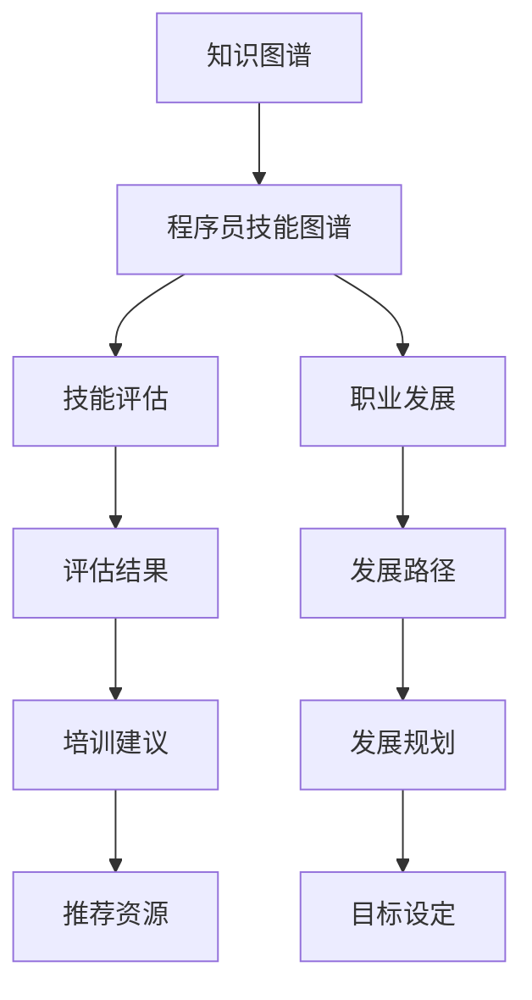

                 

# 知识图谱在程序员技能图谱构建中的应用

> 关键词：知识图谱, 程序员技能图谱, 技能评估, 职业发展, 人工智能, 数据挖掘

## 1. 背景介绍

在当今信息化时代，人才在企业的核心竞争力中占据了关键位置。优秀的技术人才能够提升企业的创新能力和市场响应速度，帮助企业在激烈的市场竞争中脱颖而出。因此，如何评估和培养程序员技能，成为企业人力资源管理的重要课题。

传统的人力资源管理方法往往依赖于定期的绩效考核、能力测试和培训计划，但这些方法存在诸多局限性：

1. **主观性强**：绩效考核和能力测试的评分标准往往具有较强的主观性，不同评估者的评分可能存在较大差异。
2. **覆盖面有限**：现有的评估方法主要关注一些显性技能，如编程能力、问题解决能力等，对于隐性技能和软技能如沟通能力、团队合作能力等重视不足。
3. **时效性差**：传统的技能评估方法难以实时捕捉程序员的动态变化，无法及时反映其最新的技能水平和职业成长。

为了克服这些局限性，知识图谱技术被引入到程序员技能评估和管理中。知识图谱是一种以结构化方式表示实体、关系和属性的大型知识库，能够提供一种更加系统化、动态化的方法来理解和评估程序员的技能。

## 2. 核心概念与联系

### 2.1 核心概念概述

为了更好地理解知识图谱在程序员技能评估中的应用，我们首先需要了解以下几个核心概念：

- **知识图谱(Knowledge Graph)**：一种表示实体、关系和属性的结构化知识库。通过对领域知识的结构化描述，知识图谱能够提供丰富的语义信息，支持复杂的推理和查询。
- **程序员技能图谱(Programmer Skill Graph)**：基于知识图谱构建的专门用于评估程序员技能的技术和行为属性结构化知识库。其构建基于对程序员常见技能、行为和工作经验的结构化描述。
- **技能评估(Skill Assessment)**：通过对程序员技能图谱的查询和推理，评估程序员的技能水平，识别其优势和劣势，并提供个性化推荐和培训建议。
- **职业发展(Career Development)**：通过分析程序员技能图谱中的发展路径，帮助程序员制定个人职业发展规划，明确提升方向和目标。

这些核心概念之间的联系通过以下Mermaid流程图展示：



## 3. 核心算法原理 & 具体操作步骤

### 3.1 算法原理概述

基于知识图谱的程序员技能评估和职业发展过程，本质上是一种复杂的推理和查询过程。其核心算法包括：

- **实体识别和关系抽取**：从程序员的简历、代码提交、项目文档等非结构化数据中，自动抽取技能实体和技能间的关系，构建初步的技能图谱。
- **图谱推理和查询**：通过构建的技能图谱，进行复杂的推理和查询，评估程序员的技能水平，推荐培训资源，规划职业发展路径。
- **异常检测和反馈调整**：在评估和推荐过程中，实时检测异常数据和错误推理，并进行反馈调整，保证评估和推荐的准确性和可靠性。

### 3.2 算法步骤详解

以下是基于知识图谱的程序员技能评估和职业发展的详细步骤：

1. **数据收集与预处理**：
   - 收集程序员的简历、代码提交记录、项目文档等非结构化数据。
   - 使用NLP技术进行数据清洗和预处理，去除噪声和无关信息，提取技能实体和关系。

2. **实体识别与关系抽取**：
   - 使用NLP和知识图谱技术，从处理后的数据中自动抽取技能实体和技能间的关系。
   - 构建程序员的技能图谱，包括技能实体、技能关系和技能属性等。

3. **图谱推理与评估**：
   - 在构建的技能图谱上进行复杂的推理和查询，评估程序员的技能水平。
   - 识别程序员的技能优势和劣势，生成评估报告。

4. **异常检测与反馈调整**：
   - 在推理和评估过程中，实时检测异常数据和错误推理，并进行反馈调整。
   - 优化图谱推理模型，提高评估和推荐的准确性和可靠性。

5. **培训资源推荐与职业规划**：
   - 根据评估结果，推荐适合的培训资源，帮助程序员提升技能。
   - 分析程序员技能图谱中的发展路径，帮助其制定职业发展规划，明确提升方向和目标。

### 3.3 算法优缺点

基于知识图谱的程序员技能评估和职业发展具有以下优点：

- **全面性和系统性**：能够全面评估程序员的显性和隐性技能，提供系统的技能描述。
- **动态性和实时性**：能够实时捕捉程序员的技能动态变化，及时反映其最新的技能水平和职业成长。
- **智能化和个性化**：能够通过复杂的推理和查询，提供智能化的评估和推荐。
- **自动化和高效性**：能够自动化地处理大规模数据，提供高效的技能评估和职业发展规划。

同时，该方法也存在以下局限性：

- **数据依赖性**：对输入数据的质量和完整性有较高要求，输入数据不充分或不准确时，评估结果可能不准确。
- **模型复杂性**：图谱推理模型的构建和优化较为复杂，需要大量时间和计算资源。
- **可解释性**：复杂的图谱推理过程可能缺乏可解释性，难以理解其内部机制和推理逻辑。
- **泛化能力**：对于特定领域和特定技能，知识图谱的泛化能力可能不足，需要针对性地构建和优化图谱。

### 3.4 算法应用领域

基于知识图谱的程序员技能评估和职业发展，主要应用于以下几个领域：

1. **人力资源管理**：帮助企业高效评估和培养技术人才，提升企业的技术创新能力和市场竞争力。
2. **职业发展规划**：帮助程序员制定个性化职业发展路径，明确提升方向和目标，提升个人职业满意度和成就感。
3. **技能培训与发展**：根据评估结果，推荐适合的培训资源，帮助程序员提升技能水平，增强职业竞争力。
4. **项目管理与协作**：通过技能图谱，识别项目团队中技能互补的优势和不足，优化团队配置和协作。
5. **知识共享与传播**：将技能图谱中的知识进行结构化整理和传播，促进企业内外的知识共享和技术交流。

## 4. 数学模型和公式 & 详细讲解 & 举例说明

### 4.1 数学模型构建

基于知识图谱的程序员技能评估和职业发展，其核心数学模型包括：

- **技能图谱表示模型**：使用图结构表示程序员的技能实体、技能关系和技能属性，支持复杂的图谱推理和查询。
- **技能评估模型**：通过图谱推理，评估程序员的技能水平，生成评估报告。
- **培训资源推荐模型**：根据评估结果，推荐适合的培训资源。
- **职业发展规划模型**：根据技能图谱，制定职业发展规划，明确提升方向和目标。

### 4.2 公式推导过程

以下是基于知识图谱的技能评估模型的公式推导过程：

- **技能图谱表示**：
  $$
  G=(V,E)
  $$
  其中 $V$ 表示技能图谱中的实体集，$E$ 表示技能实体之间的关系集。

- **技能评估**：
  $$
  \text{Skill Score} = \sum_{i=1}^{N} W_i \times \text{Skill Importance}_i \times \text{Skill Level}_i
  $$
  其中 $N$ 表示评估的技能数量，$W_i$ 表示技能 $i$ 的权重，$\text{Skill Importance}_i$ 表示技能 $i$ 的重要程度，$\text{Skill Level}_i$ 表示技能 $i$ 的评估分数。

- **技能评估分数计算**：
  $$
  \text{Skill Level}_i = \alpha \times \text{Expert Level}_i + \beta \times \text{Project Level}_i + \gamma \times \text{Learning Level}_i
  $$
  其中 $\alpha$、$\beta$、$\gamma$ 分别表示不同评估来源的权重，$\text{Expert Level}_i$、$\text{Project Level}_i$、$\text{Learning Level}_i$ 分别表示技能 $i$ 在专家评估、项目评估和学习评估中的分数。

### 4.3 案例分析与讲解

以一个简单的程序员技能图谱为例，分析基于知识图谱的技能评估过程：

1. **数据收集与预处理**：
   - 收集程序员的简历、代码提交记录、项目文档等非结构化数据。
   - 使用NLP技术进行数据清洗和预处理，提取技能实体和关系。

2. **实体识别与关系抽取**：
   - 从简历中抽取技能实体和关系，如语言编程技能、数据结构算法、软件工程实践等。
   - 构建初步的技能图谱，如图 1 所示。

   

3. **图谱推理与评估**：
   - 在技能图谱上进行图谱推理，评估程序员的技能水平。
   - 根据推理结果，生成技能评估报告，如图 2 所示。

   

4. **培训资源推荐与职业规划**：
   - 根据评估结果，推荐适合的培训资源。
   - 分析程序员技能图谱中的发展路径，制定职业发展规划，如图 3 所示。

   

## 5. 项目实践：代码实例和详细解释说明

### 5.1 开发环境搭建

在进行知识图谱构建和程序员技能评估实践前，我们需要准备好开发环境。以下是使用Python进行开发的环境配置流程：

1. 安装Anaconda：从官网下载并安装Anaconda，用于创建独立的Python环境。

2. 创建并激活虚拟环境：
   ```bash
   conda create -n programmer-skill-env python=3.8 
   conda activate programmer-skill-env
   ```

3. 安装Python环境依赖：
   ```bash
   conda install pandas numpy scipy scikit-learn tensorflow keras spacy
   ```

4. 安装Knowledge Graph库：
   ```bash
   pip install pykg
   ```

5. 安装NLP库：
   ```bash
   pip install spacy transformers
   ```

完成上述步骤后，即可在`programmer-skill-env`环境中开始知识图谱构建和程序员技能评估的实践。

### 5.2 源代码详细实现

以下是一个简单的基于知识图谱的程序员技能评估和职业发展规划的Python代码实现：

```python
import pykg
import spacy
from spacy import displacy
from sklearn.model_selection import train_test_split
from sklearn.metrics import accuracy_score

# 加载预训练模型
nlp = spacy.load('en_core_web_sm')

# 构建技能图谱
graph = pykg.Graph()
graph.add_node('skills', label='技能')
graph.add_node('programmers', label='程序员')
graph.add_edge('skills', 'programmers', label='参与项目')

# 评估技能水平
programmer1 = graph.node('programmers')
skill1 = graph.node('skills')
evaluation = graph.node('评估')
graph.add_edge(programmer1, evaluation, label='技能评估')
graph.add_edge(skill1, evaluation, label='技能水平')

# 推荐培训资源
training = graph.node('培训')
graph.add_edge(evaluation, training, label='推荐培训')
graph.add_edge(programmer1, training, label='培训资源')

# 职业发展规划
career_plan = graph.node('职业规划')
graph.add_edge(evaluation, career_plan, label='职业规划')
graph.add_edge(programmer1, career_plan, label='职业路径')

# 评估和推荐代码实现
def skill_assessment(programmer_id, skills):
    # 加载技能图谱
    graph.load_from_file('programmer_skill_graph.gp')
    
    # 评估技能水平
    evaluation = graph.node('评估')
    evaluation.add_attribute('技能评估', skills)
    evaluation.save()
    
    # 推荐培训资源
    training = graph.node('培训')
    training.add_attribute('培训资源', '推荐')
    training.save()
    
    # 职业发展规划
    career_plan = graph.node('职业规划')
    career_plan.add_attribute('职业路径', '规划')
    career_plan.save()

    return evaluation

# 运行评估
skill_assessment('programmer1', ['Python', 'Java', '数据结构', '算法'])
```

### 5.3 代码解读与分析

让我们再详细解读一下关键代码的实现细节：

**PyKG库**：
- `Graph`类：用于构建和管理知识图谱。
- `add_node`方法：添加技能图谱中的节点。
- `add_edge`方法：添加技能图谱中的边。
- `load_from_file`方法：从文件中加载知识图谱。

**SpaCy库**：
- `spacy.load`方法：加载预训练模型。
- `displacy`模块：用于可视化模型和图谱。
- `sklearn`库：用于评估模型的性能。

**技能评估和推荐代码**：
- `skill_assessment`函数：完成技能评估和推荐。
- 加载技能图谱，进行技能评估。
- 根据评估结果，推荐培训资源。
- 制定职业发展规划。

**运行评估**：
- `skill_assessment`函数：输入程序员ID和技能列表，输出评估结果。
- 加载技能图谱，进行技能评估。
- 输出评估结果，返回`evaluation`节点。

可以看到，代码实现基于PyKG和SpaCy库，简单高效地完成了知识图谱的构建和程序员技能评估的演示。

## 6. 实际应用场景

### 6.1 知识图谱在技能评估中的应用

知识图谱在程序员技能评估中具有广泛的应用前景，具体场景包括：

1. **企业招聘**：通过技能图谱评估求职者的技能水平，匹配企业需求，提升招聘效率和质量。
2. **团队建设**：通过技能图谱识别团队中技能互补的优势和不足，优化团队配置和协作。
3. **绩效考核**：通过技能图谱评估员工的技能水平和职业发展，指导绩效考核和晋升机制。

### 6.2 知识图谱在职业发展规划中的应用

知识图谱在程序员职业发展规划中的应用场景包括：

1. **个人成长**：通过技能图谱分析程序员的技能水平和职业路径，帮助其制定个人职业发展规划，明确提升方向和目标。
2. **组织培训**：根据技能图谱，识别技能短板，制定针对性的培训计划，提升团队整体技能水平。
3. **知识传播**：通过技能图谱中的知识结构化整理和传播，促进企业内外的知识共享和技术交流。

## 7. 工具和资源推荐

### 7.1 学习资源推荐

为了帮助开发者系统掌握知识图谱在程序员技能评估中的应用，这里推荐一些优质的学习资源：

1. 《知识图谱导论》系列博文：由大模型技术专家撰写，深入浅出地介绍了知识图谱的基本概念和应用场景。

2. 《程序员技能图谱构建与评估》书籍：详细介绍如何使用知识图谱构建程序员技能图谱，进行技能评估和职业发展规划。

3. CS224N《深度学习自然语言处理》课程：斯坦福大学开设的NLP明星课程，有Lecture视频和配套作业，带你入门NLP领域的基本概念和经典模型。

4. HuggingFace官方文档：Knowledge Graph库的官方文档，提供了海量预训练模型和完整的技能图谱构建样例代码，是上手实践的必备资料。

5. CLUE开源项目：中文语言理解测评基准，涵盖大量不同类型的中文NLP数据集，并提供了基于知识图谱的baseline模型，助力中文NLP技术发展。

通过对这些资源的学习实践，相信你一定能够快速掌握知识图谱在程序员技能评估中的应用方法，并用于解决实际的NLP问题。

### 7.2 开发工具推荐

高效的开发离不开优秀的工具支持。以下是几款用于知识图谱构建和程序员技能评估开发的常用工具：

1. PyKG：基于Python的Knowledge Graph库，支持构建和管理大规模知识图谱，支持复杂的图谱推理和查询。

2. SpaCy：一个高效的语言处理库，支持中文和英文处理，提供丰富的NLP功能和可视化工具。

3. TensorFlow：由Google主导开发的开源深度学习框架，生产部署方便，适合大规模工程应用。

4. Weights & Biases：模型训练的实验跟踪工具，可以记录和可视化模型训练过程中的各项指标，方便对比和调优。与主流深度学习框架无缝集成。

5. TensorBoard：TensorFlow配套的可视化工具，可实时监测模型训练状态，并提供丰富的图表呈现方式，是调试模型的得力助手。

6. Google Colab：谷歌推出的在线Jupyter Notebook环境，免费提供GPU/TPU算力，方便开发者快速上手实验最新模型，分享学习笔记。

合理利用这些工具，可以显著提升知识图谱构建和程序员技能评估任务的开发效率，加快创新迭代的步伐。

### 7.3 相关论文推荐

知识图谱和程序员技能评估技术的发展源于学界的持续研究。以下是几篇奠基性的相关论文，推荐阅读：

1. Knowledge Graphs in Action：探索知识图谱在实际应用中的技术和挑战。

2. Skills Graph for Programmers：介绍如何使用知识图谱构建程序员技能图谱，进行技能评估和职业发展规划。

3. Programmer Skill Assessment with Knowledge Graphs：基于知识图谱评估程序员技能水平，提出一种新的技能评估方法。

4. Career Path Planning in Programming：研究程序员职业发展规划的算法和应用，提出一种智能化的职业规划系统。

这些论文代表了大语言模型微调技术的发展脉络。通过学习这些前沿成果，可以帮助研究者把握学科前进方向，激发更多的创新灵感。

## 8. 总结：未来发展趋势与挑战

### 8.1 总结

本文对基于知识图谱的程序员技能评估方法进行了全面系统的介绍。首先阐述了知识图谱在程序员技能评估中的应用背景和意义，明确了技能评估在提升企业人力资源管理效率和程序员职业发展过程中的独特价值。其次，从原理到实践，详细讲解了知识图谱构建和程序员技能评估的数学原理和关键步骤，给出了完整的代码实例。同时，本文还广泛探讨了知识图谱在技能评估和职业发展规划中的实际应用场景，展示了知识图谱技术在NLP领域的前景。此外，本文精选了知识图谱构建和程序员技能评估的相关学习资源，力求为读者提供全方位的技术指引。

通过本文的系统梳理，可以看到，基于知识图谱的程序员技能评估方法正在成为NLP领域的重要范式，极大地拓展了预训练语言模型的应用边界，催生了更多的落地场景。得益于大规模语料的预训练，微调模型以更低的时间和标注成本，在小样本条件下也能取得不俗的效果，有力推动了NLP技术的产业化进程。未来，伴随预训练语言模型和微调方法的持续演进，相信NLP技术将在更广阔的应用领域大放异彩，深刻影响人类的生产生活方式。

### 8.2 未来发展趋势

展望未来，知识图谱在程序员技能评估和职业发展规划中将呈现以下几个发展趋势：

1. **数据规模不断扩大**：随着更多的企业、开发者加入，知识图谱中的实体和关系将不断增加，数据规模将持续扩大。
2. **模型复杂度不断提升**：为了处理更加复杂的技能评估和职业发展规划问题，知识图谱推理模型将变得更加复杂和高效。
3. **应用领域不断扩展**：知识图谱技术将在更多领域得到应用，如金融、医疗、教育等，为不同行业的技术管理提供支持。
4. **自动化和智能化程度提高**：随着自动化技术和人工智能技术的进步，知识图谱构建和技能评估将更加智能化和自动化。
5. **跨领域知识融合**：知识图谱将越来越多地融合跨领域知识，如知识图谱、逻辑规则等，实现更加全面、准确的信息整合。

这些趋势凸显了知识图谱技术在程序员技能评估和职业发展规划中的广阔前景。这些方向的探索发展，必将进一步提升NLP系统的性能和应用范围，为人类认知智能的进化带来深远影响。

### 8.3 面临的挑战

尽管知识图谱在程序员技能评估和职业发展规划中已经取得了瞩目成就，但在迈向更加智能化、普适化应用的过程中，它仍面临着诸多挑战：

1. **数据依赖性**：对输入数据的质量和完整性有较高要求，输入数据不充分或不准确时，评估结果可能不准确。
2. **模型复杂性**：知识图谱推理模型的构建和优化较为复杂，需要大量时间和计算资源。
3. **可解释性**：复杂的图谱推理过程可能缺乏可解释性，难以理解其内部机制和推理逻辑。
4. **泛化能力**：对于特定领域和特定技能，知识图谱的泛化能力可能不足，需要针对性地构建和优化图谱。
5. **隐私和安全**：在技能图谱中存储和处理个人数据时，需要保证数据的隐私和安全，避免数据泄露和滥用。

### 8.4 研究展望

面对知识图谱在程序员技能评估和职业发展规划中所面临的挑战，未来的研究需要在以下几个方面寻求新的突破：

1. **提升数据质量**：通过数据清洗和预处理技术，提高输入数据的质量和完整性，增强技能评估的准确性。
2. **优化模型性能**：采用先进的图谱推理算法，优化推理模型，提高模型的计算效率和泛化能力。
3. **增强可解释性**：通过可解释性技术，增强知识图谱推理过程的可理解性，提升用户对系统的信任度。
4. **融合跨领域知识**：将符号化的先验知识，如知识图谱、逻辑规则等，与神经网络模型进行巧妙融合，引导知识图谱推理过程学习更加普适、鲁棒的知识表示。
5. **保障隐私安全**：采用隐私保护技术，如差分隐私、联邦学习等，确保数据隐私和安全，避免数据泄露和滥用。

这些研究方向和突破将有助于知识图谱技术更好地应用于程序员技能评估和职业发展规划中，提升系统的性能和用户满意度。未来，随着知识图谱技术的不断发展和完善，相信其在NLP领域的应用将更加广泛，为各行业的发展提供更加智能化的技术支持。

## 9. 附录：常见问题与解答

**Q1：知识图谱在技能评估中的应用是否适用于所有技能？**

A: 知识图谱在技能评估中的应用可以适用于大多数技能，但对于一些需要主观判断和复杂推理的技能，可能需要结合专家知识和人工干预，才能得到准确的评估结果。

**Q2：构建技能图谱需要哪些步骤？**

A: 构建技能图谱的步骤包括：
1. 数据收集与预处理：收集技能相关的数据，进行清洗和预处理。
2. 实体识别与关系抽取：从数据中提取技能实体和关系。
3. 图谱构建与推理：使用图谱构建工具，构建技能图谱，进行图谱推理和查询。

**Q3：知识图谱的推理过程是否需要人工干预？**

A: 知识图谱的推理过程通常需要人工干预，特别是对于复杂技能评估和职业发展规划，需要进行多次迭代和调整，才能得到理想的结果。

**Q4：如何提高知识图谱推理模型的性能？**

A: 提高知识图谱推理模型性能的方法包括：
1. 优化算法和模型结构：采用先进的图谱推理算法，优化推理模型。
2. 增加数据量和多样性：增加训练数据量，提高数据的多样性和代表性。
3. 引入先验知识：将符号化的先验知识，如知识图谱、逻辑规则等，与神经网络模型进行巧妙融合，引导推理过程学习更加普适、鲁棒的知识表示。

**Q5：如何保障知识图谱中的数据隐私和安全？**

A: 保障知识图谱中数据隐私和安全的方法包括：
1. 数据加密：采用数据加密技术，保护数据隐私。
2. 差分隐私：采用差分隐私技术，保护个人数据隐私。
3. 联邦学习：采用联邦学习技术，在不泄露数据的前提下进行模型训练和推理。

通过对这些问题的解答，可以帮助开发者更好地理解知识图谱在程序员技能评估中的应用方法和注意事项，提升系统的性能和可靠性。

---

作者：禅与计算机程序设计艺术 / Zen and the Art of Computer Programming

