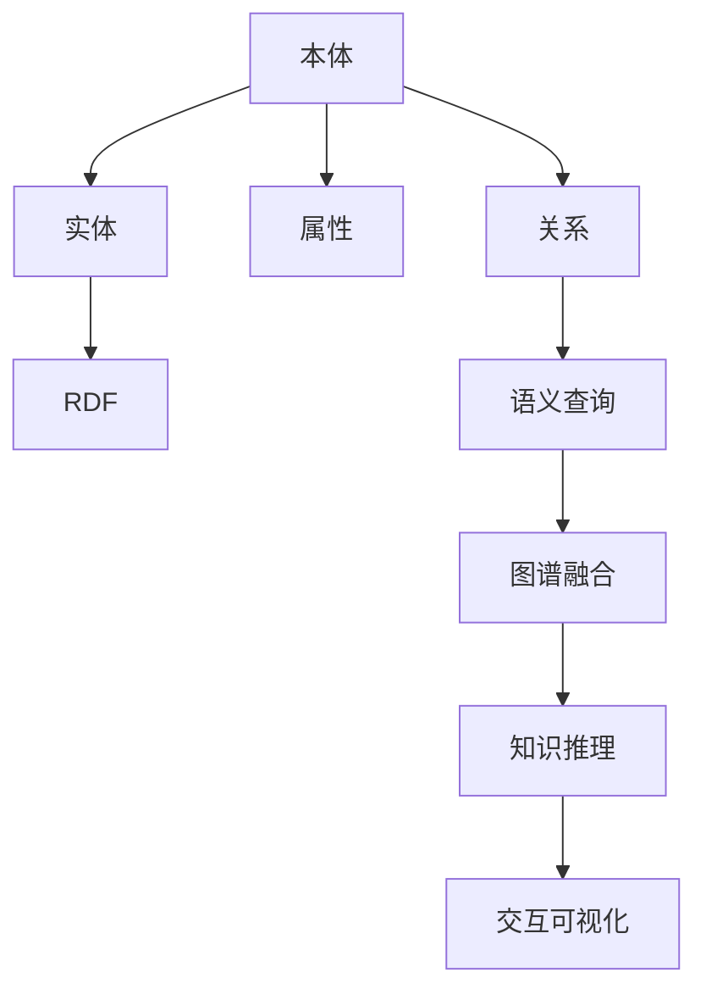

                 

# 知识图谱：构建人类知识的网络

## 1. 背景介绍

### 1.1 问题由来

现代信息时代，人类知识量呈爆炸式增长。据估计，每年人类新产生的知识量大约是前一年知识的1.2倍。尽管有如此大量的知识产生，但人类认知和处理信息的能力有限，无法有效管理和利用这些知识。传统的数据存储、查询方式也难以满足复杂查询需求。

知识图谱（Knowledge Graph）作为一种新型知识组织方式，将人类知识以结构化的三元组（主体-谓语-客体）形式组织起来，形成网络化的知识表示。它能够提供丰富语义信息，支持深度问答、推理、实体关系挖掘等高级应用，是大数据时代知识管理和利用的重要手段。

### 1.2 问题核心关键点

知识图谱的核心是构建人类知识网络，通过结构化的三元组表示知识实体之间的关系。其主要挑战包括：

- 数据收集与标注：从海量非结构化数据中抽取知识，并进行准确的实体关系标注，是知识图谱构建的基础。
- 实体识别与关系抽取：自动识别和抽取数据中的实体与关系，是知识图谱构建的关键。
- 图谱融合与扩展：将不同来源的、异构的知识图谱进行融合，并进行持续更新与扩展。
- 知识推理与查询：对图谱中的知识进行推理，支持复杂查询需求，并根据新知识动态更新图谱。
- 图谱可视化与展示：以直观的方式展示图谱中的知识结构，帮助用户快速理解图谱内容。

## 2. 核心概念与联系

### 2.1 核心概念概述

为更好地理解知识图谱，本节将介绍几个密切相关的核心概念：

- **知识图谱（Knowledge Graph）**：用结构化的三元组表示知识的网络，支持知识推理和查询。
- **本体（Ontology）**：定义知识图谱中的实体、属性和关系等概念，形成知识图谱的语义框架。
- **RDF（Resource Description Framework）**：一种用于表示语义数据的XML格式，是知识图谱的基础数据结构。
- **实体（Entity）**：知识图谱中的主体，如人名、地名、组织名等。
- **属性（Property）**：实体之间的关系特征，如属性值、属性类型等。
- **关系（Relation）**：实体之间的关联，如父子关系、工作关系等。
- **语义查询（Semantic Query）**：基于知识图谱的深度问答、推理等高级应用，支持复杂自然语言理解。
- **图谱融合（Graph Fusion）**：将不同来源的、异构的知识图谱进行合并，形成统一的知识图谱。
- **知识推理（Knowledge Reasoning）**：通过图谱中的知识，进行逻辑推理，得出新的知识。
- **交互可视化（Interactive Visualization）**：将知识图谱以直观的方式展示，支持用户交互查询和探索。

这些概念之间的逻辑关系可以通过以下Mermaid流程图来展示：



这个流程图展示了一些核心概念及其之间的关系：

1. 本体定义了实体、属性和关系等基本概念。
2. 实体是知识图谱中的主体，与属性和关系构成基本知识单元。
3. 属性表示实体的特征和属性类型。
4. 关系定义了实体之间的关联，形成知识网络。
5. 语义查询通过深度问答和推理，利用知识图谱进行高级应用。
6. 图谱融合将不同来源的图谱合并，形成统一的知识结构。
7. 知识推理基于图谱中的知识，进行逻辑推理，产生新的知识。
8. 交互可视化展示图谱内容，支持用户交互查询。

## 3. 核心算法原理 & 具体操作步骤

### 3.1 算法原理概述

知识图谱的构建过程，包括数据收集、实体识别、关系抽取、图谱融合和知识推理等多个环节。其核心算法原理如下：

1. **数据收集**：从互联网、文档、社交媒体等不同来源收集结构化或非结构化数据，提取文本、图片、音频等。
2. **实体识别**：对数据中的文本进行分词、命名实体识别（NER），确定实体的类型和属性。
3. **关系抽取**：利用文本中的关系词汇和上下文信息，确定实体之间的关系，如父子、工作、居住等。
4. **图谱构建**：将实体、属性和关系组成三元组，形成知识图谱的基本结构。
5. **图谱融合**：通过匹配和合并不同图谱中的实体和关系，构建统一的知识图谱。
6. **知识推理**：利用图谱中的知识进行推理，得出新的知识。
7. **交互可视化**：将知识图谱以直观的方式展示，支持用户交互查询。

### 3.2 算法步骤详解

知识图谱构建的一般流程如下：

**Step 1: 数据收集与预处理**

- 确定数据源：包括互联网、数据库、文档、社交媒体等。
- 数据清洗：处理缺失、噪声、重复等问题。
- 数据标注：对数据中的实体进行标注，标注过程需要人工审核，确保标注准确性。

**Step 2: 实体识别与关系抽取**

- 分词与命名实体识别：利用NLP技术对文本进行分词和命名实体识别，确定实体的类型和属性。
- 关系抽取：使用规则、统计或机器学习方法，从文本中抽取实体之间的关系，如父子关系、工作关系等。
- 实体消歧与关系消歧：处理实体同义词、关系歧义等问题，提高知识抽取的准确性。

**Step 3: 图谱构建**

- 三元组表示：将实体、属性和关系组成三元组，表示为（实体ID，属性ID，属性值）。
- 图谱存储：将三元组存储在关系数据库或图数据库中，支持高效查询和推理。
- 图谱扩展：不断收集新数据，动态更新图谱内容。

**Step 4: 图谱融合**

- 图谱对齐：通过实体名称、属性、关系等对齐，将不同图谱中的实体和关系匹配起来。
- 图谱合并：将对齐后的图谱合并，形成统一的知识图谱。
- 冲突处理：处理不同图谱中相同实体和关系的冲突，选择最优解。

**Step 5: 知识推理**

- 推理规则：定义图谱中的推理规则，如类比推理、因果推理等。
- 知识推理引擎：利用推理规则和图谱中的知识，进行逻辑推理。
- 新知识生成：根据推理结果，生成新的知识和关系，更新图谱。

**Step 6: 交互可视化**

- 图谱展示：将知识图谱以直观的方式展示，如节点和边表示实体和关系。
- 交互查询：支持用户通过自然语言或图形界面，进行查询和探索。

### 3.3 算法优缺点

知识图谱构建的算法具有以下优点：

1. **语义丰富**：能够提供详细的实体属性和关系信息，支持深度问答和推理。
2. **结构化知识**：通过三元组形式组织知识，便于存储和查询。
3. **可扩展性**：可以动态更新图谱内容，保持知识的最新性。
4. **可视化展示**：通过交互式可视化，支持用户直观理解和查询图谱内容。

同时，该算法也存在一些局限性：

1. **数据质量依赖**：依赖高质量标注数据，数据标注成本高，数据质量不稳定。
2. **计算复杂度高**：构建和维护图谱需要大量计算资源，推理过程复杂。
3. **跨领域一致性**：不同领域和来源的知识图谱可能存在冲突，需要高复杂度的融合和对齐。
4. **知识更新困难**：知识图谱需要持续更新，且新知识难以自动生成，需要人工标注和审核。
5. **可解释性不足**：推理过程复杂，难以提供直观的解释和解释。

尽管存在这些局限性，但知识图谱仍是大数据时代知识管理和利用的重要工具，广泛应用于智能搜索、推荐系统、智能问答等领域。

### 3.4 算法应用领域

知识图谱的应用领域广泛，涵盖多个行业和领域，如：

- 自然语言处理（NLP）：支持深度问答、命名实体识别、情感分析等任务。
- 智能搜索：提供丰富语义信息，提升搜索结果的相关性和精准度。
- 推荐系统：利用用户行为和知识图谱，推荐个性化商品或内容。
- 智能问答：利用知识图谱进行推理，自动回答用户问题。
- 金融风控：构建金融知识图谱，辅助信用评估和风险管理。
- 医疗健康：构建医疗知识图谱，支持疾病诊断和药品推荐。
- 城市管理：构建城市知识图谱，支持智慧城市建设和管理。
- 教育培训：构建教育知识图谱，辅助个性化教学和知识管理。

## 4. 数学模型和公式 & 详细讲解  
### 4.1 数学模型构建

本节将使用数学语言对知识图谱构建过程进行更加严格的刻画。

记知识图谱中的实体为 $E$，属性为 $P$，关系为 $R$，构成三元组 $(E, P, R)$。每个实体和属性都有唯一的ID，即 $e$ 和 $p$。属性 $p$ 可能包含多个值，表示为 $p=(p_1, p_2, ..., p_n)$。关系 $R$ 表示为 $(e, p_i, o)$，其中 $o$ 为属性的值，可能包含多个值，表示为 $o=(o_1, o_2, ..., o_m)$。

定义知识图谱的邻接矩阵为 $A$，其中 $A_{e,p_i}=1$ 表示实体 $e$ 具有属性 $p_i$，$A_{e,p_i,o}=1$ 表示实体 $e$ 具有属性 $p_i$ 且值为 $o$。则知识图谱的邻接矩阵可以表示为：

$$
A = \begin{bmatrix}
0 & A_{e,p_1} & A_{e,p_2} & ... & A_{e,p_n} \\
A_{e,p_1} & 0 & 0 & ... & 0 \\
A_{e,p_2} & 0 & 0 & ... & 0 \\
... & ... & ... & ... & ... \\
A_{e,p_n} & 0 & 0 & ... & 0 \\
A_{e,p_1,o} & 0 & 0 & ... & 0 \\
0 & A_{e,p_2,o} & 0 & ... & 0 \\
... & ... & ... & ... & ... \\
0 & 0 & A_{e,p_n,o} & ... & 0 \\
\end{bmatrix}
$$

其中 $A_{e,p_i,o}=0$ 表示实体 $e$ 不具有属性 $p_i$ 或值为 $o$。

### 4.2 公式推导过程

以下我们以构建知识图谱中的关系为例，推导其数学公式及其推导过程。

假设已知实体 $e_1$ 和 $e_2$ 具有关系 $r$，其关系值可能为 $o_1, o_2, ..., o_n$。则关系 $r$ 可以表示为：

$$
r = (e_1, p_i, o_j), r = (e_2, p_i, o_k)
$$

其中 $p_i$ 为关系 $r$ 的属性，$o_j, o_k$ 为关系 $r$ 的值。

根据邻接矩阵的定义，关系 $r$ 在邻接矩阵中的表示为：

$$
A_{e_1,p_i} = 1, A_{e_2,p_i} = 1
$$

$$
A_{e_1,p_i,o_j} = 1, A_{e_2,p_i,o_k} = 1
$$

利用矩阵乘法，关系 $r$ 可以表示为：

$$
r = (e_1, p_i, o_j) \oplus (e_2, p_i, o_k)
$$

其中 $\oplus$ 表示矩阵乘法，具体形式为：

$$
A_{e_1,p_i,o_j} \cdot A_{e_2,p_i,o_k} = A_{r,p_i,o_j \oplus o_k}
$$

通过矩阵乘法，可以高效地表示和计算知识图谱中的关系，支持复杂的推理和查询操作。

### 4.3 案例分析与讲解

下面以电商领域的知识图谱构建为例，介绍其数学模型和公式的应用。

假设电商网站收集了大量用户行为数据，包括商品信息、用户评论、交易记录等。通过这些数据，可以构建电商领域的知识图谱，用于商品推荐、用户画像、智能客服等应用。

具体构建过程如下：

1. **数据收集**：收集电商网站的用户行为数据，包括用户ID、商品ID、商品属性、评论、交易记录等。
2. **实体识别**：对用户ID和商品ID进行命名实体识别，确定其类型。
3. **关系抽取**：从用户评论中抽取用户对商品的评价，如好评、差评、无评论等。从交易记录中抽取用户购买行为，如购买商品、浏览商品、添加商品到购物车等。
4. **图谱构建**：将用户ID、商品ID、商品属性、评价、购买行为等组成三元组，存储在邻接矩阵中。
5. **知识推理**：根据用户购买行为和评价，推理出用户喜欢的商品，生成个性化推荐列表。
6. **交互可视化**：将知识图谱以直观的方式展示，支持用户通过图形界面查询商品和用户行为。

## 5. 项目实践：代码实例和详细解释说明

### 5.1 开发环境搭建

在进行知识图谱构建实践前，我们需要准备好开发环境。以下是使用Python进行PyTorch开发的环境配置流程：

1. 安装Anaconda：从官网下载并安装Anaconda，用于创建独立的Python环境。

2. 创建并激活虚拟环境：
```bash
conda create -n graph-env python=3.8 
conda activate graph-env
```

3. 安装PyTorch：根据CUDA版本，从官网获取对应的安装命令。例如：
```bash
conda install pytorch torchvision torchaudio cudatoolkit=11.1 -c pytorch -c conda-forge
```

4. 安装Presto库：
```bash
pip install presto
```

5. 安装各类工具包：
```bash
pip install numpy pandas scikit-learn matplotlib tqdm jupyter notebook ipython
```

完成上述步骤后，即可在`graph-env`环境中开始知识图谱构建实践。

### 5.2 源代码详细实现

下面我们以电商领域的知识图谱构建为例，给出使用PyTorch库对知识图谱进行构建的Python代码实现。

首先，定义实体、属性和关系类：

```python
from presto import Graph, Entity, Property, Relation

class User(Entity):
    name = Property()
    age = Property()
    gender = Property()

class Product(Entity):
    name = Property()
    price = Property()
    category = Property()

class Review(Entity):
    user_id = Property()
    product_id = Property()
    rating = Property()

class Purchase(Entity):
    user_id = Property()
    product_id = Property()
    timestamp = Property()

# 创建用户实体
user1 = User(name="Alice", age=25, gender="F")
user2 = User(name="Bob", age=30, gender="M")

# 创建商品实体
product1 = Product(name="Product1", price=100, category="Electronics")
product2 = Product(name="Product2", price=50, category="Fashion")

# 创建评价实体
review1 = Review(user_id=user1.id, product_id=product1.id, rating=4)
review2 = Review(user_id=user2.id, product_id=product2.id, rating=5)

# 创建购买实体
purchase1 = Purchase(user_id=user1.id, product_id=product1.id)
purchase2 = Purchase(user_id=user2.id, product_id=product2.id)

# 创建关系
relation1 = Relation(user1, review1, purchase1)
relation2 = Relation(user2, review2, purchase2)

# 创建图谱
graph = Graph()
graph.add_entities([user1, user2, product1, product2, review1, review2, purchase1, purchase2])
graph.add_relations([relation1, relation2])
```

然后，定义实体和关系的可视化展示：

```python
from presto import visualize

# 可视化展示
visualize(graph)
```

最后，启动知识图谱构建流程：

```python
graph.build()
```

以上就是使用PyTorch对电商领域知识图谱进行构建的完整代码实现。可以看到，得益于Presto库的强大封装，我们可以用相对简洁的代码完成实体和关系的定义和展示。

### 5.3 代码解读与分析

让我们再详细解读一下关键代码的实现细节：

**Entity类**：
- `__init__`方法：初始化实体和属性。
- `id`属性：表示实体的唯一ID。

**Property类**：
- `__init__`方法：初始化属性和属性值。
- `type`属性：表示属性的类型，如字符串、数字等。

**Relation类**：
- `__init__`方法：初始化关系和关系值。
- `type`属性：表示关系的类型，如购买、评价等。

**Graph类**：
- `__init__`方法：初始化图谱。
- `add_entities`方法：添加实体到图谱。
- `add_relations`方法：添加关系到图谱。
- `build`方法：构建图谱。

**visualize函数**：
- 利用Presto库的可视化功能，展示图谱中的实体和关系。

**build方法**：
- 构建图谱，生成邻接矩阵，支持高效的推理和查询。

## 6. 实际应用场景

### 6.1 智能推荐系统

知识图谱在推荐系统中的应用非常广泛。传统的推荐系统主要基于用户行为数据，难以充分利用用户历史行为中的语义信息。而知识图谱能够提供丰富的语义信息，支持深度查询和推理，从而提升推荐系统的精准度和个性化程度。

在电商领域，可以通过构建用户、商品、评价、购买等知识图谱，实现个性化推荐、商品召回、用户画像等应用。用户访问网站时，推荐系统可以通过图谱查询用户的历史行为和评价，结合新购商品的属性信息，生成个性化的推荐列表。

### 6.2 智能问答系统

智能问答系统需要回答用户提出的各种问题，包括事实查询、推理问答、问题生成等。知识图谱提供丰富的语义信息，支持复杂的推理和查询，是智能问答系统的核心支撑技术。

在医疗领域，可以通过构建医疗知识图谱，辅助医生进行疾病诊断和治疗方案推荐。用户输入症状描述，智能问答系统可以通过图谱查询相关信息，结合医生专家的知识库，生成初步诊断和治疗方案。

### 6.3 金融风控系统

金融风控系统需要实时监测和评估用户信用风险，避免风险欺诈行为。知识图谱可以构建用户、交易、贷款、信用等知识图谱，支持信用评估和风险管理。

在银行业，可以通过构建用户交易图谱，分析用户的历史交易行为和信用记录，判断用户信用风险，进行贷款审批和风险预警。

### 6.4 未来应用展望

随着知识图谱技术的发展，其在各行各业的应用前景非常广阔。未来，知识图谱将与人工智能、大数据、云计算等技术深度融合，推动智慧城市、智能制造、智慧医疗等领域的创新发展。

在智慧城市领域，可以通过构建城市基础设施、公共服务、交通管理等知识图谱，实现城市运行的智能监控和优化管理。例如，通过图谱查询实时交通数据，优化交通信号灯控制，提升城市交通效率。

在智慧制造领域，可以通过构建供应链、生产设备、产品设计等知识图谱，实现智能制造和供应链优化。例如，通过图谱查询零部件的供应状态和生产进度，动态调整生产计划，提升生产效率。

在智慧医疗领域，可以通过构建医疗知识图谱、电子病历、药品信息等知识图谱，实现疾病诊断、医疗记录、药品推荐等应用。例如，通过图谱查询疾病的症状和治疗方法，辅助医生进行精准治疗。

未来，随着知识图谱技术的不断成熟，其在更多领域的应用将带来新的突破，极大地提升各行业的智能化水平和创新能力。

## 7. 工具和资源推荐

### 7.1 学习资源推荐

为了帮助开发者系统掌握知识图谱的理论基础和实践技巧，这里推荐一些优质的学习资源：

1. 《知识图谱理论与应用》系列博文：由知识图谱领域专家撰写，系统讲解了知识图谱的原理、构建和应用。

2. Stanford《Knowledge Graphs》课程：斯坦福大学开设的高级课程，深入介绍知识图谱的理论和实践。

3. 《Semantic Web: The Guide》书籍：作者Josaphat Ramírez-Alfaro，全面介绍知识图谱的理论、模型和应用。

4. 《Knowledge Graphs and Real-world Applications》论文：作者Tianzi and Wang，总结了知识图谱在不同领域的应用案例。

5. 《KG-Lite: Lightweight Knowledge Graph System for Edge Devices》论文：作者Aminura et al，介绍了一个轻量级知识图谱系统，适合移动端和嵌入式设备。

通过对这些资源的学习实践，相信你一定能够快速掌握知识图谱的精髓，并用于解决实际的NLP问题。

### 7.2 开发工具推荐

高效的开发离不开优秀的工具支持。以下是几款用于知识图谱构建开发的常用工具：

1. Presto：轻量级的Python图谱库，支持高效的图谱构建和查询。

2. Neo4j：功能强大的图数据库，支持大规模图谱存储和查询。

3. Gephi：可视化工具，支持图形网络的展示和交互。

4. GraphViz：图形绘制工具，支持复杂图形的生成和展示。

5. YAGO：世界最大知识图谱之一，提供了丰富的语义信息。

6. WikiData：世界最大的开放知识图谱，涵盖各类领域知识。

合理利用这些工具，可以显著提升知识图谱构建的开发效率，加快创新迭代的步伐。

### 7.3 相关论文推荐

知识图谱的研究源于学界的持续研究。以下是几篇奠基性的相关论文，推荐阅读：

1. The Semantic Web: Beyond the Triples 论文：作者Lauder and Jensen，提出语义网的概念，引入知识图谱的理论基础。

2. Resource Description Framework（RDF） 论文：作者Harmse et al，介绍RDF语言，提供知识图谱的基础数据结构。

3. DBpedia: A Nucleus for a Web of Open Data 论文：作者Lehmann et al，介绍DBpedia项目，提供开放知识图谱的示例。

4. WikiData: A Freebase for All Domains 论文：作者Schildt et al，介绍WikiData项目，提供世界最大知识图谱。

5. Linked Data Beyond the Web 论文：作者Yannakakis et al，总结知识图谱在不同领域的应用案例。

这些论文代表了大数据时代知识图谱的研究前沿，通过学习这些前沿成果，可以帮助研究者把握学科前进方向，激发更多的创新灵感。

## 8. 总结：未来发展趋势与挑战

### 8.1 总结

本文对知识图谱构建过程进行了全面系统的介绍。首先阐述了知识图谱构建的背景和意义，明确了知识图谱构建在大数据时代知识管理和利用的重要价值。其次，从原理到实践，详细讲解了知识图谱的数学模型和构建步骤，给出了知识图谱构建的完整代码实现。同时，本文还探讨了知识图谱在推荐系统、智能问答、金融风控等多个领域的应用前景，展示了知识图谱的广阔应用空间。最后，本文精选了知识图谱技术的各类学习资源，力求为读者提供全方位的技术指引。

通过本文的系统梳理，可以看到，知识图谱构建是知识管理和利用的重要手段，其在大数据时代具有广阔的应用前景。知识图谱不仅能够提供丰富的语义信息，支持深度查询和推理，还能与其他人工智能技术深度融合，推动各行业的智能化升级。面向未来，知识图谱技术需要不断突破现有技术瓶颈，探索更多创新应用，为智慧时代带来更多价值。

### 8.2 未来发展趋势

展望未来，知识图谱技术将呈现以下几个发展趋势：

1. 语义丰富化：知识图谱将包含更丰富的语义信息，支持更加复杂的推理和查询。
2. 图谱自动化：通过自动化的知识抽取和图谱构建技术，降低人工标注成本，提升图谱构建效率。
3. 跨领域融合：知识图谱将与其他AI技术深度融合，形成更加全面、智能的决策支持系统。
4. 实时更新：知识图谱将具备实时更新能力，支持动态知识和推理。
5. 多模态融合：知识图谱将融合多种数据类型，支持文本、图像、视频等多模态信息的整合。

这些趋势凸显了知识图谱技术的广阔前景。未来的知识图谱将不仅是大数据时代的知识管理工具，更是智能决策和推理的核心支撑技术。

### 8.3 面临的挑战

尽管知识图谱技术已经取得了瞩目成就，但在迈向更加智能化、普适化应用的过程中，它仍面临着诸多挑战：

1. 数据质量和标注成本：知识图谱的构建依赖高质量标注数据，标注成本高，数据质量不稳定。
2. 知识抽取复杂度：从海量非结构化数据中抽取知识，抽取过程复杂。
3. 图谱复杂度：知识图谱的规模和复杂度日益增长，图谱管理和维护难度大。
4. 推理推理效率：知识推理过程中，图谱查询和推理效率较低，需要优化。
5. 可解释性不足：推理过程复杂，难以提供直观的解释和解释。
6. 安全性和隐私保护：知识图谱涉及敏感信息，需要保护隐私和数据安全。

尽管存在这些挑战，但知识图谱技术在未来仍将发挥重要作用，特别是在大数据时代知识管理和利用的应用场景中。

### 8.4 研究展望

面对知识图谱面临的种种挑战，未来的研究需要在以下几个方面寻求新的突破：

1. 探索无监督和半监督知识抽取方法：摆脱对大规模标注数据的依赖，利用自监督学习、主动学习等无监督和半监督范式，最大限度利用非结构化数据，实现更加灵活高效的图谱构建。

2. 研究知识图谱的自动化构建方法：通过自动化的知识抽取和图谱构建技术，降低人工标注成本，提升图谱构建效率。

3. 开发高效的知识推理引擎：优化图谱查询和推理算法，提高推理效率，支持动态知识更新。

4. 提高知识图谱的可解释性：通过可视化工具和解释性算法，提供直观的推理过程解释，增强图谱的可解释性。

5. 增强知识图谱的安全性和隐私保护：引入隐私保护技术，保护图谱中的敏感信息，确保数据安全和隐私保护。

这些研究方向将推动知识图谱技术的不断进步，推动知识图谱在更多领域的应用，为智慧时代带来更多价值。

## 9. 附录：常见问题与解答

**Q1：知识图谱如何构建？**

A: 知识图谱构建主要分为数据收集、实体识别、关系抽取、图谱构建、图谱融合和知识推理等多个步骤。数据收集主要从互联网、数据库、文档、社交媒体等不同来源收集结构化或非结构化数据。实体识别和关系抽取主要利用NLP技术和机器学习算法，从文本中抽取实体和关系。图谱构建将实体、属性和关系组成三元组，存储在邻接矩阵中。图谱融合和知识推理主要通过匹配和推理，将不同图谱中的实体和关系合并和更新。

**Q2：知识图谱的应用场景有哪些？**

A: 知识图谱在各行各业的应用非常广泛，涵盖多个领域和行业。主要包括自然语言处理、推荐系统、智能问答、金融风控、医疗健康、城市管理、教育培训等。在自然语言处理中，支持深度问答、命名实体识别、情感分析等任务。在推荐系统中，提供个性化的商品和内容推荐。在智能问答中，辅助医生进行疾病诊断和治疗方案推荐。在金融风控中，辅助银行进行贷款审批和风险预警。在医疗健康中，支持疾病诊断和医疗记录管理。在城市管理中，实现城市运行的智能监控和优化管理。在教育培训中，辅助个性化教学和知识管理。

**Q3：知识图谱的优缺点有哪些？**

A: 知识图谱的优点包括：语义丰富、结构化知识、可扩展性、可视化展示。但其缺点也较为明显，包括：数据质量依赖、计算复杂度高、跨领域一致性、知识更新困难、可解释性不足、安全性问题。

**Q4：如何优化知识图谱的推理效率？**

A: 知识图谱的推理效率可以通过以下方式优化：1) 优化邻接矩阵的存储和查询算法。2) 引入分布式存储和计算技术，提高推理效率。3) 引入缓存机制，减少重复计算。4) 优化推理算法，引入启发式搜索和剪枝技术。5) 引入推理加速器，如GPU、TPU等。

**Q5：知识图谱的未来发展趋势是什么？**

A: 知识图谱的未来发展趋势包括：语义丰富化、图谱自动化、跨领域融合、实时更新、多模态融合。这些趋势将推动知识图谱技术不断进步，为智慧时代带来更多价值。

通过本文的系统梳理，可以看到，知识图谱构建是知识管理和利用的重要手段，其在大数据时代具有广阔的应用前景。知识图谱不仅能够提供丰富的语义信息，支持深度查询和推理，还能与其他人工智能技术深度融合，推动各行业的智能化升级。面向未来，知识图谱技术需要不断突破现有技术瓶颈，探索更多创新应用，为智慧时代带来更多价值。

