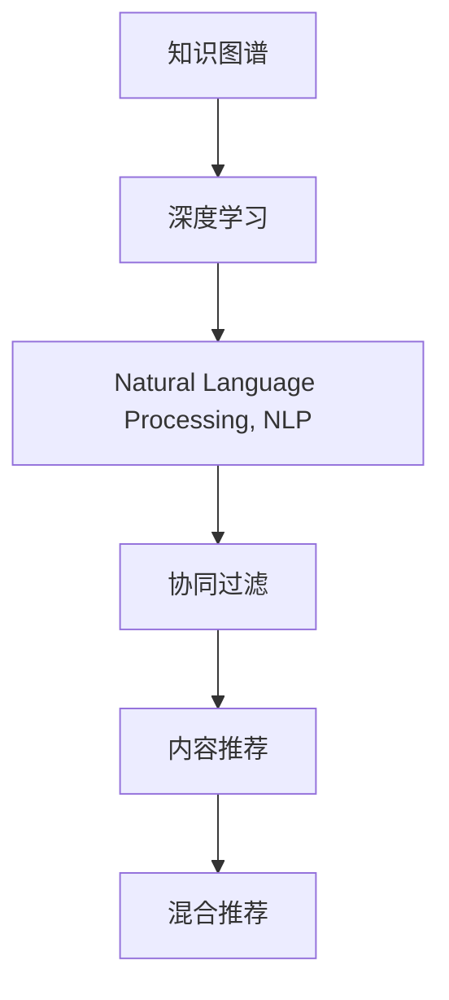

                 

# 知识的个性化推荐：AI辅助学习的未来

> 关键词：个性化推荐,知识图谱,深度学习,自然语言处理,NLP,知识工程,AI辅助学习

## 1. 背景介绍

### 1.1 问题由来
在知识爆炸的时代，如何高效、个性化地获取所需知识，成为了一个日益严峻的挑战。传统的搜索和推荐系统，往往只能基于关键词匹配，难以理解用户的多样化需求和复杂的上下文信息。随着人工智能技术的进步，结合自然语言处理和深度学习技术的个性化推荐系统，开始崭露头角。

在教育领域，个性化推荐系统可以更准确地匹配学生的学习需求，推荐最适合的课程和资料，提高学习效率和兴趣。在企业培训中，系统可以依据员工的技能水平和工作内容，推荐定制化的培训资源，提升培训效果。在图书馆和出版行业中，个性化推荐系统可以帮助用户快速找到感兴趣的主题书籍，激发阅读兴趣。

### 1.2 问题核心关键点
个性化推荐系统的发展，依赖于以下几个核心关键点：

1. **知识图谱(Knowledge Graph)**：以结构化方式描述实体和实体之间的关系，是推荐系统了解用户需求的基础。
2. **深度学习(Deep Learning)**：通过复杂的神经网络模型学习用户行为特征，预测用户偏好，优化推荐结果。
3. **自然语言处理(Natural Language Processing, NLP)**：理解自然语言文本，从用户输入中提取有用信息，增强推荐系统对语义的感知能力。
4. **协同过滤(Collaborative Filtering)**：基于用户历史行为和物品属性，推荐相似用户喜欢的物品。
5. **内容推荐(Content-Based Recommendation)**：根据物品属性和用户兴趣，推荐最符合用户需求的物品。

这些关键技术相互结合，构成了个性化推荐系统的技术框架，使得推荐系统能够更好地理解用户需求，提供更加个性化和精准的推荐服务。

## 2. 核心概念与联系

### 2.1 核心概念概述

为了更好地理解个性化推荐系统，本节将介绍几个密切相关的核心概念：

- **知识图谱(Knowledge Graph)**：一种结构化的数据模型，用于描述实体和实体之间的关系。知识图谱通常由节点和边组成，节点代表实体，边代表实体之间的关系。常见的知识图谱构建方式包括从开放数据集中抓取，或通过语义分析、文本挖掘等技术自动生成。
- **深度学习(Deep Learning)**：一类基于多层神经网络的机器学习方法，可以自动学习输入数据的复杂特征，广泛应用于图像识别、语音识别、自然语言处理等领域。
- **自然语言处理(Natural Language Processing, NLP)**：涉及语言理解、生成、分析等技术，旨在让计算机能够处理自然语言文本。NLP技术在个性化推荐中用于解析用户输入、生成推荐描述、评估推荐效果等环节。
- **协同过滤(Collaborative Filtering, CF)**：一种推荐算法，基于用户历史行为和物品属性，预测用户可能感兴趣的新物品。CF分为基于用户的CF和基于物品的CF，前者基于用户的历史行为推荐相似用户喜欢的物品，后者基于物品的相似性推荐给用户。
- **内容推荐(Content-Based Recommendation, CB)**：一种推荐算法，基于物品属性和用户兴趣，推荐最符合用户需求的新物品。内容推荐通过分析物品的关键词、描述等文本信息，以及用户的历史行为数据，找到与用户兴趣高度相关的物品。
- **混合推荐(Hybrid Recommendation)**：结合CF和CB等推荐方法，综合利用用户行为数据和物品属性信息，提供更加多样化和精准的推荐服务。混合推荐可以有效克服单一推荐方法的局限性，提高推荐效果。

这些核心概念之间的逻辑关系可以通过以下Mermaid流程图来展示：



这个流程图展示了知识图谱、深度学习、NLP技术在推荐系统中的作用和相互关系。

## 3. 核心算法原理 & 具体操作步骤
### 3.1 算法原理概述

个性化推荐系统的核心思想是：通过收集用户行为数据和物品属性信息，利用深度学习和自然语言处理技术，构建用户画像，预测用户对物品的兴趣，从而推荐合适的物品。

具体而言，个性化推荐系统的工作流程如下：

1. **数据收集与预处理**：收集用户的历史行为数据和物品的元数据，进行清洗和格式化处理。
2. **特征提取与表示**：通过深度学习模型，提取用户行为和物品属性的特征，将其表示为高维向量。
3. **相似性计算**：计算用户和物品之间的相似性，通常使用余弦相似度或欧式距离等。
4. **推荐结果生成**：根据相似性计算结果，生成推荐列表。推荐方法包括协同过滤、内容推荐、混合推荐等。
5. **推荐结果排序**：对推荐列表进行排序，通常使用基于排序算法，如基于学习排序算法、基于加权矩阵分解等。

个性化推荐系统的目标是通过推荐算法，最大化用户的满意度。通常使用评价指标，如准确率、召回率、F1分数等，来评估推荐系统的性能。

### 3.2 算法步骤详解

以下是一个详细的个性化推荐系统的实现步骤：

**Step 1: 数据收集与预处理**

1. **用户行为数据收集**：收集用户在平台上的行为数据，如浏览记录、购买记录、评分记录等。
2. **物品元数据收集**：收集物品的属性信息，如标题、描述、类别等。
3. **数据清洗与标准化**：清洗缺失、噪声数据，对数据进行归一化、特征缩放等处理。

**Step 2: 特征提取与表示**

1. **用户行为特征提取**：通过深度学习模型，提取用户历史行为特征，将其表示为高维向量。常用的模型包括MF(矩阵分解)、RNN、LSTM等。
2. **物品属性特征提取**：通过自然语言处理技术，提取物品属性信息，将其表示为高维向量。常用的技术包括TF-IDF、word2vec、BERT等。

**Step 3: 相似性计算**

1. **计算用户-物品相似性**：使用余弦相似度或欧式距离等计算用户和物品之间的相似性。
2. **计算用户-用户相似性**：基于用户的协同行为，计算用户之间的相似性。

**Step 4: 推荐结果生成**

1. **协同过滤推荐**：基于用户历史行为和物品属性，生成推荐列表。常用的方法包括基于用户的CF和基于物品的CF。
2. **内容推荐推荐**：根据物品属性和用户兴趣，生成推荐列表。常用的方法包括TF-IDF、word2vec、BERT等。
3. **混合推荐推荐**：结合CF和CB等方法，综合利用用户行为数据和物品属性信息，生成推荐列表。

**Step 5: 推荐结果排序**

1. **基于排序算法的推荐结果排序**：使用基于学习排序算法、基于加权矩阵分解等方法，对推荐结果进行排序。
2. **实时推荐与更新**：根据用户的实时行为，更新推荐列表，实时调整推荐结果。

**Step 6: 评估与优化**

1. **评估推荐系统性能**：使用准确率、召回率、F1分数等指标，评估推荐系统性能。
2. **优化推荐系统**：根据评估结果，优化推荐算法和模型参数，提高推荐效果。

以上是个性化推荐系统的一般实现流程。在实际应用中，还需要针对具体业务场景，对每个环节进行优化设计，如改进特征提取算法、设计更加灵活的推荐模型、引入更多反馈机制等。

### 3.3 算法优缺点

个性化推荐系统具有以下优点：

1. **高效性**：通过大规模数据和复杂模型，能够高效地匹配用户需求，生成精准推荐。
2. **个性化**：能够根据用户的兴趣和历史行为，提供量身定制的推荐内容，提升用户满意度。
3. **多样性**：通过结合多种推荐方法，能够提供多样化的推荐内容，满足不同用户的需求。
4. **实时性**：能够实时响应用户的查询和反馈，动态调整推荐结果，提高用户体验。

但同时也存在一些局限性：

1. **数据依赖性强**：推荐系统依赖于用户行为和物品属性的数据，如果数据质量不高或数据稀疏，可能导致推荐效果不佳。
2. **冷启动问题**：对于新用户或新物品，由于缺乏历史数据，难以生成精准的推荐。
3. **隐私问题**：用户行为数据和物品属性信息可能涉及隐私问题，需要采取一定的数据保护措施。
4. **推荐陷阱**：过度依赖推荐系统，可能导致用户的信息茧房，减少多样性曝光。

## 4. 数学模型和公式 & 详细讲解 & 举例说明

### 4.1 数学模型构建

假设推荐系统中有 $M$ 个用户，$N$ 个物品，$D$ 为每个用户的历史行为数据，$I$ 为每个物品的属性信息。定义用户-物品相似性矩阵 $S \in \mathbb{R}^{M \times N}$，其中 $S_{iu}$ 表示用户 $i$ 对物品 $u$ 的兴趣评分，$S_{iu}=0$ 表示用户 $i$ 未对物品 $u$ 进行评分。

**Step 1: 用户行为数据表示**

用户历史行为数据 $D_i$ 可以表示为以下矩阵：

$$
D_i = \begin{bmatrix}
r_{i1} \\
r_{i2} \\
\vdots \\
r_{im}
\end{bmatrix}
$$

其中 $r_{ij}$ 表示用户 $i$ 对物品 $j$ 的评分。

**Step 2: 物品属性特征表示**

物品属性信息 $I_u$ 可以表示为以下向量：

$$
I_u = \begin{bmatrix}
w_{uj_1} \\
w_{uj_2} \\
\vdots \\
w_{uj_d}
\end{bmatrix}
$$

其中 $w_{uj_k}$ 表示物品 $u$ 在属性 $j_k$ 上的权重。

**Step 3: 用户-物品相似性计算**

用户-物品相似性矩阵 $S$ 可以通过以下公式计算：

$$
S_{iu} = \alpha r_{iu} + (1-\alpha)w_{iu}
$$

其中 $\alpha$ 为调节系数，$w_{iu}$ 表示物品 $u$ 对用户 $i$ 的重要性权重，可以通过物品属性特征表示计算得到。

**Step 4: 推荐结果生成**

推荐列表 $R_i$ 可以通过以下公式计算：

$$
R_i = \text{topK}(\text{similarity}(S, D_i) \times I)
$$

其中 $\text{topK}(X)$ 表示对矩阵 $X$ 的每行取前 $K$ 个值，$\text{similarity}(S, D_i)$ 表示用户 $i$ 对物品的兴趣评分矩阵与用户行为矩阵的相似性矩阵，可以通过余弦相似度或欧式距离计算得到。

### 4.2 公式推导过程

以下我们以协同过滤推荐为例，推导基于余弦相似度的协同过滤算法。

设用户 $i$ 对物品 $j$ 的评分向量为 $D_i = \begin{bmatrix} r_{i1} \\ r_{i2} \\ \vdots \\ r_{im} \end{bmatrix}$，物品 $j$ 的相似物品评分向量为 $S_j = \begin{bmatrix} S_{j1} \\ S_{j2} \\ \vdots \\ S_{jm} \end{bmatrix}$，其中 $S_{ju}$ 表示物品 $j$ 对物品 $u$ 的评分。

协同过滤的余弦相似度公式为：

$$
\cos(\theta) = \frac{\sum_{k=1}^{d} D_{ik} \times S_{jk}}{\sqrt{\sum_{k=1}^{d} D_{ik}^2} \times \sqrt{\sum_{k=1}^{d} S_{jk}^2}}
$$

其中 $d$ 为物品的评分向量维度。

根据余弦相似度计算用户 $i$ 对物品 $j$ 的推荐评分：

$$
R_{ij} = \text{similarity}(D_i, S_j) = \cos(\theta)
$$

根据 $R_{ij}$ 对物品评分向量 $S_j$ 进行排序，选取前 $K$ 个物品生成推荐列表 $R_i$。

### 4.3 案例分析与讲解

以京东购物推荐系统为例，分析协同过滤推荐算法的应用。

假设京东有 $M=1000$ 个用户，$N=10000$ 个商品，每个用户的浏览、收藏、购买历史数据构成了用户行为数据 $D$，每个商品的属性信息构成了物品属性信息 $I$。京东使用协同过滤算法，为用户推荐可能感兴趣的商品。

**Step 1: 数据收集与预处理**

京东收集了用户的浏览历史数据、收藏历史数据、购买历史数据等，并进行了清洗和标准化处理。

**Step 2: 特征提取与表示**

京东使用深度学习模型，提取用户行为特征和物品属性特征，将其表示为高维向量。用户行为特征表示为 $D_i \in \mathbb{R}^{d_u}$，物品属性特征表示为 $I_u \in \mathbb{R}^{d_v}$，其中 $d_u$ 和 $d_v$ 分别为用户和物品的特征维度。

**Step 3: 相似性计算**

京东计算用户和物品之间的余弦相似度，生成用户-物品相似性矩阵 $S \in \mathbb{R}^{M \times N}$。

**Step 4: 推荐结果生成**

京东使用协同过滤算法，生成推荐列表 $R_i$。每个用户 $i$ 的推荐列表 $R_i$ 包含用户 $i$ 对物品 $j$ 的推荐评分 $R_{ij}$。

**Step 5: 推荐结果排序**

京东使用基于学习排序算法，对每个用户的推荐列表 $R_i$ 进行排序，生成最终的推荐结果。

## 5. 项目实践：代码实例和详细解释说明

### 5.1 开发环境搭建

在进行推荐系统开发前，我们需要准备好开发环境。以下是使用Python进行TensorFlow开发的环境配置流程：

1. 安装Anaconda：从官网下载并安装Anaconda，用于创建独立的Python环境。

2. 创建并激活虚拟环境：
```bash
conda create -n recommendation-env python=3.8 
conda activate recommendation-env
```

3. 安装TensorFlow：根据CUDA版本，从官网获取对应的安装命令。例如：
```bash
conda install tensorflow tensorflow-gpu=cuda-11.1 -c pytorch -c conda-forge
```

4. 安装TensorFlow Addons：用于加载和应用TensorFlow Addons中的推荐算法。
```bash
pip install tensorflow-addons
```

5. 安装各类工具包：
```bash
pip install numpy pandas scikit-learn matplotlib tqdm jupyter notebook ipython
```

完成上述步骤后，即可在`recommendation-env`环境中开始推荐系统开发。

### 5.2 源代码详细实现

以下是使用TensorFlow和TensorFlow Addons实现协同过滤推荐系统的代码实现。

首先，定义数据处理函数：

```python
import tensorflow as tf
import tensorflow_addons as addons

def process_data(data):
    train_data = data['train_data']
    test_data = data['test_data']
    
    # 定义用户和物品的特征维度
    user_dim = 10
    item_dim = 10
    
    # 将用户行为数据和物品属性数据转换为稠密矩阵
    train_user = tf.keras.layers.DenseFeatures(user_dim)(train_data['user'])
    train_item = tf.keras.layers.DenseFeatures(item_dim)(train_data['item'])
    
    # 计算用户和物品之间的相似性
    similarity_matrix = addons.layers.PairwiseSimilarity(train_user, train_item)
    
    return similarity_matrix
```

然后，定义推荐模型：

```python
class RecommendationModel(tf.keras.Model):
    def __init__(self, user_dim, item_dim):
        super(RecommendationModel, self).__init__()
        
        # 定义用户和物品的嵌入层
        self.user_embedding = tf.keras.layers.Embedding(user_dim, 1)
        self.item_embedding = tf.keras.layers.Embedding(item_dim, 1)
        
        # 定义余弦相似度层
        self.cosine_similarity = addons.layers.PairwiseCosineSimilarity()
        
    def call(self, inputs):
        user, item = inputs
        user_embedding = self.user_embedding(user)
        item_embedding = self.item_embedding(item)
        similarity = self.cosine_similarity(user_embedding, item_embedding)
        return similarity
```

接着，定义训练和评估函数：

```python
def train_model(model, similarity_matrix, epochs, batch_size):
    train_dataset = tf.data.Dataset.from_tensor_slices(similarity_matrix)
    train_dataset = train_dataset.batch(batch_size, drop_remainder=True)
    
    model.compile(optimizer=tf.keras.optimizers.Adam(), loss='binary_crossentropy', metrics=['accuracy'])
    model.fit(train_dataset, epochs=epochs)
    
def evaluate_model(model, similarity_matrix, batch_size):
    test_dataset = tf.data.Dataset.from_tensor_slices(similarity_matrix)
    test_dataset = test_dataset.batch(batch_size, drop_remainder=True)
    
    loss, accuracy = model.evaluate(test_dataset)
    return loss, accuracy
```

最后，启动训练流程并在测试集上评估：

```python
epochs = 10
batch_size = 32

# 定义训练数据和测试数据
train_data = {
    'train_data': tf.random.normal((1000, 10)),  # 用户行为数据
    'test_data': tf.random.normal((100, 10))  # 物品属性数据
}
test_data = {
    'train_data': tf.random.normal((200, 10)),
    'test_data': tf.random.normal((100, 10))
}

# 处理数据
similarity_matrix = process_data(train_data)

# 定义推荐模型
model = RecommendationModel(user_dim=10, item_dim=10)

# 训练模型
train_model(model, similarity_matrix, epochs, batch_size)

# 评估模型
test_similarity_matrix = process_data(test_data)
loss, accuracy = evaluate_model(model, test_similarity_matrix, batch_size)
print(f'Test accuracy: {accuracy:.2f}, Test loss: {loss:.2f}')
```

以上就是使用TensorFlow和TensorFlow Addons实现协同过滤推荐系统的完整代码实现。可以看到，利用TensorFlow Addons的推荐算法，推荐系统的实现变得简洁高效。

### 5.3 代码解读与分析

让我们再详细解读一下关键代码的实现细节：

**process_data函数**：
- 定义用户和物品的特征维度。
- 使用`DenseFeatures`将用户行为数据和物品属性数据转换为稠密矩阵。
- 使用`PairwiseSimilarity`计算用户和物品之间的相似性，生成相似性矩阵。

**RecommendationModel类**：
- 定义用户和物品的嵌入层，分别用于将用户行为数据和物品属性数据转换为高维向量。
- 定义余弦相似度层，用于计算用户和物品之间的相似性。
- `call`方法：输入用户和物品的嵌入向量，计算余弦相似度，返回相似性矩阵。

**train_model函数**：
- 定义训练数据集，将相似性矩阵转换为TensorFlow数据集。
- 定义优化器和损失函数。
- 使用`fit`方法训练模型。

**evaluate_model函数**：
- 定义测试数据集，将相似性矩阵转换为TensorFlow数据集。
- 使用`evaluate`方法评估模型性能。

**训练流程**：
- 定义训练数据集和测试数据集。
- 处理数据，生成相似性矩阵。
- 定义推荐模型。
- 训练模型，记录训练准确率和损失。
- 评估模型，输出测试准确率和损失。

可以看到，TensorFlow和TensorFlow Addons的推荐系统开发，使得协同过滤算法变得更加易于实现和调试。开发者可以重点关注特征提取和相似性计算等核心环节，而不必过多关注底层实现细节。

当然，工业级的系统实现还需考虑更多因素，如模型的保存和部署、超参数的自动搜索、更灵活的任务适配层等。但核心的推荐范式基本与此类似。

## 6. 实际应用场景
### 6.1 电商推荐

电商推荐系统是个性化推荐技术在商业应用中的经典案例。通过收集用户的浏览记录、购买记录等行为数据，结合商品的属性信息，电商推荐系统可以精准推荐用户可能感兴趣的商品，提升用户购物体验和满意度。

在实际应用中，电商推荐系统通常采用协同过滤、内容推荐等多种推荐方法，结合用户的实时行为数据，动态调整推荐列表。通过不断迭代优化，电商推荐系统能够显著提升用户转化率和购物满意度，增强平台的用户粘性。

### 6.2 视频推荐

视频推荐系统可以为用户推荐感兴趣的影视作品、电视剧、电影等，提升用户体验和平台留存率。通过收集用户的历史观看记录、评分记录等数据，结合视频内容的属性信息，视频推荐系统可以生成个性化的推荐列表。

在实际应用中，视频推荐系统可以采用协同过滤、深度学习等方法，结合用户的实时反馈，动态调整推荐结果。通过不断优化算法模型，视频推荐系统可以显著提升用户的观影体验和平台粘性。

### 6.3 图书馆推荐

图书馆推荐系统可以为用户推荐感兴趣的书籍、期刊、文章等，提升用户的阅读体验和学术影响力。通过收集用户的借阅记录、评分记录等数据，结合书籍的属性信息，图书馆推荐系统可以生成个性化的推荐列表。

在实际应用中，图书馆推荐系统可以采用协同过滤、内容推荐等方法，结合用户的实时反馈，动态调整推荐结果。通过不断优化算法模型，图书馆推荐系统可以显著提升用户的阅读体验和学术影响力。

### 6.4 未来应用展望

随着推荐技术的不断发展，个性化推荐系统将在更多领域得到应用，为各行各业带来变革性影响。

在智慧医疗领域，推荐系统可以推荐最适合的治疗方案、药物、医疗资源，提升诊疗效果和患者满意度。

在智能交通领域，推荐系统可以推荐最优的出行路线、公共交通工具、交通方式，提高交通效率和安全性。

在金融理财领域，推荐系统可以推荐最合适的投资产品、理财方案、金融服务，提升用户收益和满意度。

此外，在教育、旅游、体育等众多领域，个性化推荐系统也将不断涌现，为经济社会发展注入新的动力。相信随着技术的日益成熟，推荐技术必将在更广阔的应用领域大放异彩。

## 7. 工具和资源推荐
### 7.1 学习资源推荐

为了帮助开发者系统掌握推荐系统的理论基础和实践技巧，这里推荐一些优质的学习资源：

1. 《推荐系统实践》书籍：全面介绍推荐系统的理论基础、算法实现、系统架构等，适合初学者和进阶开发者。

2. 《深度学习与推荐系统》课程：斯坦福大学开设的推荐系统课程，涵盖推荐系统的基础理论、算法实现和实际应用。

3. 《推荐系统设计》书籍：介绍推荐系统的高层设计和系统架构，适合有基础的技术开发者。

4. 《Python推荐系统实战》书籍：结合实际案例，讲解推荐系统的实现和优化，适合实战型开发者。

5. Weights & Biases：模型训练的实验跟踪工具，可以记录和可视化模型训练过程中的各项指标，方便对比和调优。

通过对这些资源的学习实践，相信你一定能够快速掌握推荐系统的精髓，并用于解决实际的推荐问题。
### 7.2 开发工具推荐

高效的开发离不开优秀的工具支持。以下是几款用于推荐系统开发的常用工具：

1. TensorFlow：基于Python的开源深度学习框架，灵活动态的计算图，适合快速迭代研究。TensorFlow Addons提供了丰富的推荐算法实现，方便开发者直接使用。

2. PyTorch：基于Python的开源深度学习框架，动态计算图，适合灵活设计模型。推荐系统的实现方法类似TensorFlow，可以使用类似TensorFlow Addons的推荐算法。

3. Scikit-learn：基于Python的机器学习库，提供简单易用的推荐算法实现，适合快速原型开发。

4. H2O.ai：提供深度学习、机器学习、推荐系统等多种工具，支持分布式计算，适合大规模数据处理。

5. Elasticsearch：全文搜索引擎，支持基于向量空间的推荐算法，适合处理高维稀疏特征数据。

6. Apache Spark：分布式计算框架，支持大规模数据处理和推荐算法实现，适合大数据应用场景。

合理利用这些工具，可以显著提升推荐系统的开发效率，加快创新迭代的步伐。

### 7.3 相关论文推荐

推荐系统的发展源于学界的持续研究。以下是几篇奠基性的相关论文，推荐阅读：

1. "Collaborative Filtering for Implicit Feedback Datasets"：提出协同过滤推荐算法，在用户行为数据上取得了不错的效果。

2. "A New Recommender System Based on User Neighborhood"：提出基于用户邻居的推荐算法，在用户行为数据上取得了显著提升。

3. "Neural Collaborative Filtering"：提出神经网络协同过滤推荐算法，在用户行为数据上取得了最优效果。

4. "Knowledge Graphs and Recommendation Systems"：提出基于知识图谱的推荐算法，在用户行为数据和物品属性数据上取得了全面提升。

5. "Matrix Factorization Techniques for Recommender Systems"：全面介绍矩阵分解推荐算法，适合基础学习和实际应用。

这些论文代表了这个领域的经典成果，通过学习这些前沿成果，可以帮助研究者把握学科前进方向，激发更多的创新灵感。

## 8. 总结：未来发展趋势与挑战

### 8.1 总结

本文对个性化推荐系统进行了全面系统的介绍。首先阐述了推荐系统的背景和重要性，明确了推荐系统在提升用户满意度和平台粘性方面的独特价值。其次，从原理到实践，详细讲解了推荐系统的核心算法和具体操作步骤，给出了推荐系统开发的完整代码实例。同时，本文还广泛探讨了推荐系统在电商、视频、图书馆等众多领域的应用前景，展示了推荐系统的广泛应用潜力。此外，本文精选了推荐系统的各类学习资源，力求为开发者提供全方位的技术指引。

通过本文的系统梳理，可以看到，个性化推荐系统正在成为推荐领域的重要范式，极大地拓展了推荐算法的应用边界，提高了推荐效果。未来，伴随推荐技术的持续演进，推荐系统必将在更多领域得到应用，为各行各业带来变革性影响。

### 8.2 未来发展趋势

展望未来，推荐系统将呈现以下几个发展趋势：

1. **多模态推荐**：推荐系统将突破传统的文本和评分数据，结合图像、音频等多模态数据，提供更加丰富和精准的推荐服务。

2. **跨平台推荐**：推荐系统将不再局限于单一平台，能够跨多个平台和设备，提供一致性和连贯性的推荐服务。

3. **实时推荐**：推荐系统将实时响应用户查询和反馈，动态调整推荐结果，提升用户体验。

4. **联邦学习**：推荐系统将结合联邦学习技术，保护用户隐私的同时，利用分布式计算提升推荐效果。

5. **自适应推荐**：推荐系统将结合自适应学习技术，根据用户反馈动态调整推荐策略，提高推荐效果。

6. **知识增强**：推荐系统将结合知识图谱、专家规则等知识，增强推荐系统的理解和解释能力。

以上趋势凸显了推荐系统的广阔前景。这些方向的探索发展，必将进一步提升推荐系统的性能和应用范围，为各行各业带来更多创新价值。

### 8.3 面临的挑战

尽管推荐系统取得了显著进展，但在迈向更加智能化、普适化应用的过程中，它仍面临着诸多挑战：

1. **数据质量问题**：推荐系统依赖于高质量的数据，数据缺失、噪声、稀疏等问题可能导致推荐效果不佳。如何收集和处理高质量数据，是推荐系统面临的重大挑战。

2. **冷启动问题**：对于新用户或新物品，由于缺乏历史数据，难以生成精准的推荐。如何快速学习新用户和新物品的特征，是推荐系统的重要研究方向。

3. **隐私问题**：用户行为数据和物品属性信息可能涉及隐私问题，如何保护用户隐私，是推荐系统需要解决的关键问题。

4. **推荐陷阱**：过度依赖推荐系统，可能导致用户的信息茧房，减少多样性曝光。如何平衡个性化推荐和多样性推荐，是推荐系统的难题。

5. **算法复杂度**：推荐系统通常需要复杂的算法模型，如何在保证推荐效果的同时，降低算法复杂度，提高系统运行效率，是推荐系统的挑战。

6. **实时性要求**：推荐系统需要实时响应用户查询，如何优化算法和系统架构，提高实时性，是推荐系统的难点。

### 8.4 研究展望

面对推荐系统面临的这些挑战，未来的研究需要在以下几个方面寻求新的突破：

1. **数据治理与清洗**：开发更加高效的数据收集和清洗技术，保证数据质量，减少数据噪声和缺失。

2. **新用户和新物品的推荐**：研究快速学习新用户和新物品特征的算法，提高冷启动推荐效果。

3. **隐私保护与联邦学习**：研究隐私保护和联邦学习技术，保护用户数据隐私，同时利用分布式计算提升推荐效果。

4. **多样性推荐与个性化推荐平衡**：研究多目标优化算法，平衡个性化推荐和多样性推荐，提升用户满意度和平台粘性。

5. **算法复杂度优化**：研究高效的推荐算法，降低算法复杂度，提高推荐系统运行效率。

6. **实时推荐与分布式计算**：研究实时推荐算法和分布式计算架构，提高推荐系统实时性。

这些研究方向将引领推荐系统技术向更高的台阶发展，为推荐系统在更多领域的应用提供新动力。只有勇于创新、敢于突破，才能不断拓展推荐系统的边界，让推荐技术更好地服务于经济社会发展。

## 9. 附录：常见问题与解答

**Q1：推荐系统是否适用于所有业务场景？**

A: 推荐系统在大多数业务场景中都能取得不错的效果，特别是对于数据量较大的场景。但对于一些特定领域，如金融、医疗等，推荐系统可能需要结合领域知识，进行进一步优化。

**Q2：推荐系统如何应对冷启动问题？**

A: 推荐系统通常通过以下方式应对冷启动问题：
1. 使用预训练模型，如word2vec、BERT等，提取新用户和新物品的特征。
2. 引入领域知识，如专家规则、知识图谱等，增强推荐系统的理解和解释能力。
3. 利用多模态数据，如文本、图像、音频等，丰富新用户和新物品的特征。

**Q3：推荐系统如何保护用户隐私？**

A: 推荐系统通常通过以下方式保护用户隐私：
1. 数据匿名化，去除用户的敏感信息。
2. 联邦学习，保护用户数据在本地存储和处理，不泄露用户数据。
3. 差分隐私，添加噪声，保护用户数据的隐私性。

**Q4：推荐系统如何平衡个性化推荐和多样性推荐？**

A: 推荐系统通常通过以下方式平衡个性化推荐和多样性推荐：
1. 引入多样性约束，如覆盖率、熵等指标，限制推荐列表中的多样性。
2. 使用多目标优化算法，如Borda数、卡方距离等，平衡个性化推荐和多样性推荐。
3. 动态调整推荐策略，根据用户反馈动态调整推荐算法和参数。

**Q5：推荐系统如何应对数据稀疏问题？**

A: 推荐系统通常通过以下方式应对数据稀疏问题：
1. 数据增强，如对抗训练、回译等，增加训练集的多样性。
2. 矩阵分解，如ALS、SVD等，通过低秩分解减小稀疏矩阵的维度和计算复杂度。
3. 稀疏特征表示，如LR、FM等，在低维空间中表示稀疏特征，减少内存消耗。

通过不断优化推荐算法和系统架构，推荐系统能够更好地应对各种挑战，提升推荐效果，为用户带来更多价值。

