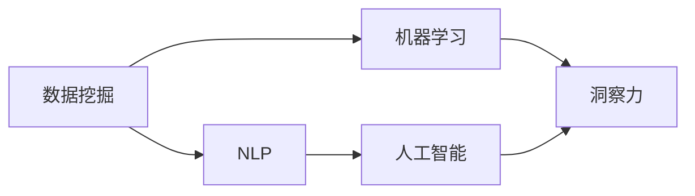

                 

# 知识的价值实现：洞察力的关键作用

在知识密集型的时代，洞察力成为连接信息与价值的重要桥梁。本文将从背景介绍、核心概念、算法原理与操作步骤、数学模型构建、项目实践、实际应用场景、工具和资源推荐等多个维度，全面剖析洞察力的关键作用，并展望其未来发展趋势与挑战，为人工智能技术在知识价值实现方面的应用提供深刻见解。

## 1. 背景介绍

### 1.1 问题由来
随着大数据、云计算、人工智能等技术的飞速发展，信息资源的积累与利用变得越来越容易。然而，信息过载也随之而来，海量数据、多样化的信息源，让人们难以从中筛选出真正有价值的信息。如何从海量信息中挖掘出有价值的洞察力，成为当今社会的一大难题。

### 1.2 问题核心关键点
洞察力的获取需要综合运用数据挖掘、机器学习、自然语言处理、人工智能等多方面的技术。其核心在于：
- 数据质量：高质量、有代表性的数据是洞察力提取的基础。
- 算法模型：选择合适的算法模型，能够更高效地挖掘出潜在的信息价值。
- 技术整合：将多种技术整合应用，提升洞察力的准确性与可操作性。
- 人类智慧：洞察力的实现离不开人类的智慧与经验，尤其是在复杂多变的环境中。

## 2. 核心概念与联系

### 2.1 核心概念概述

为更好地理解洞察力的实现原理，本节将介绍几个关键概念：

- 数据挖掘(Data Mining)：从大量数据中自动发现模式、规律和异常的技术。
- 机器学习(Machine Learning)：基于算法使计算机通过学习数据，自动识别规律和模式。
- 自然语言处理(Natural Language Processing, NLP)：使计算机能够理解、解析、生成自然语言的技术。
- 人工智能(Artificial Intelligence, AI)：通过机器学习、深度学习、计算机视觉等技术，使计算机具备人类智能。
- 洞察力(Insight)：从大量信息中提取出来的，对决策或行为有指导意义的见解或知识。

这些概念之间的联系可以通过以下Mermaid流程图来展示：



该流程图展示了一个典型的洞察力获取流程：从数据挖掘中提取特征，通过机器学习模型进行模型训练，再利用NLP技术对文本信息进行理解与分析，最终结合人工智能技术，提取出有价值的洞察力。

## 3. 核心算法原理 & 具体操作步骤
### 3.1 算法原理概述

洞察力的实现，本质上是一个数据驱动的智能决策过程。其核心在于通过数据挖掘和机器学习技术，从原始数据中提炼出具有战略性或预测性的信息，用于指导决策。

形式化地，假设我们有数据集 $D=\{x_i\}_{i=1}^N$，其中 $x_i \in \mathcal{X}$ 表示数据特征，$y_i \in \mathcal{Y}$ 表示目标变量。洞察力 $I$ 的实现过程可以描述为：

$$
I = \mathop{\arg\max}_{I} P(y_i|I, x_i)
$$

即通过最大化目标变量在给定特征和洞察力下的条件概率，找到最优的洞察力。这一过程通常包括以下步骤：

1. 数据预处理：清洗、标准化、归一化数据，去除异常值和噪音。
2. 特征工程：从原始数据中提取、构造新的特征，提升模型的表达能力。
3. 模型训练：选择合适的机器学习算法，利用标注数据训练模型，找到最优模型参数。
4. 模型评估：通过交叉验证、AUC、RMSE等指标评估模型性能，避免过拟合。
5. 洞察提取：利用NLP、可视化等技术，将模型结果转化为易于理解的洞察力。

### 3.2 算法步骤详解

以下是洞察力实现的一般步骤：

**Step 1: 数据预处理**
- 清洗数据：去除重复、缺失值、异常值等不必要的数据。
- 标准化归一化：将数据按比例缩放至[0,1]或均值为0，方差为1的标准正态分布。
- 特征提取：从原始数据中提取、构造新的特征，用于提升模型的表达能力。

**Step 2: 特征工程**
- 特征选择：从原始数据中挑选与目标变量相关性强的特征，减少计算复杂度。
- 特征变换：利用统计学、数学方法，将原始特征转换为更易于模型识别的形式。
- 特征构建：结合领域知识，构造新的特征，提升模型表现。

**Step 3: 模型训练**
- 选择合适的机器学习算法，如决策树、随机森林、神经网络等。
- 划分数据集为训练集、验证集、测试集，设定合适的训练参数。
- 使用标注数据训练模型，找到最优模型参数。

**Step 4: 模型评估**
- 通过交叉验证、AUC、RMSE等指标评估模型性能。
- 在验证集上测试模型的泛化能力，避免过拟合。
- 根据评估结果调整模型参数，提升模型表现。

**Step 5: 洞察提取**
- 利用NLP技术对模型结果进行理解与分析，提取关键信息。
- 通过可视化工具，展示洞察力的图形化结果，便于决策。

### 3.3 算法优缺点

洞察力实现的算法具有以下优点：
1. 高效性：利用机器学习算法，可以快速处理大量数据，提取有价值的洞察力。
2. 自动化：通过算法自动化处理数据，减少人工干预，提高工作效率。
3. 可解释性：机器学习模型通常具备良好的可解释性，能够提供清晰的决策依据。
4. 可扩展性：可应用于多种业务场景，具有较高的泛化能力。

同时，该算法也存在一定的局限性：
1. 数据依赖：依赖高质量、有代表性的数据，难以应对数据质量差、噪音多的情况。
2. 模型复杂：需要选择合适的算法模型，并设定合适的参数，计算复杂度较高。
3. 特征工程难度大：特征工程是洞察力实现的关键步骤，需要结合领域知识，进行反复迭代。
4. 可解释性不足：部分模型如深度神经网络，决策过程难以解释，缺乏透明度。

尽管存在这些局限性，但就目前而言，洞察力实现的算法仍是大数据、人工智能领域的主流范式。未来相关研究的重点在于如何进一步降低算法对数据的依赖，提高模型的可解释性和泛化能力，同时兼顾计算效率。

### 3.4 算法应用领域

洞察力实现的算法在多个领域得到了广泛的应用，例如：

- 金融风险评估：利用历史交易数据，挖掘出风险因素和规律，辅助金融决策。
- 医疗诊断：通过患者的病历数据，提取疾病风险和症状规律，提高诊断准确性。
- 市场营销：分析消费者行为数据，发现消费趋势和规律，制定个性化营销策略。
- 网络安全：利用日志数据，挖掘出异常行为和攻击模式，提升安全防护能力。
- 智能制造：通过设备和生产数据，优化生产流程，提升生产效率和质量。

除了上述这些经典应用外，洞察力实现的算法也被创新性地应用到更多场景中，如智能客服、智慧城市、精准农业等，为各行各业带来了新的价值。

## 4. 数学模型和公式 & 详细讲解
### 4.1 数学模型构建

本节将使用数学语言对洞察力的实现过程进行更加严格的刻画。

假设我们有数据集 $D=\{x_i\}_{i=1}^N$，其中 $x_i \in \mathcal{X}$ 表示数据特征，$y_i \in \mathcal{Y}$ 表示目标变量。假设我们希望挖掘出对目标变量 $y$ 具有预测能力的洞察力 $I$。

定义洞察力 $I$ 与数据特征 $x$ 的关系为：

$$
P(y|I,x) = f(x,I)
$$

其中 $f(x,I)$ 为洞察力 $I$ 对数据特征 $x$ 的响应函数。在实践中，我们通常使用线性回归、决策树、随机森林、神经网络等模型，对数据特征 $x$ 和目标变量 $y$ 的关系进行建模。例如，使用线性回归模型 $f(x,I) = \theta^T x$，其中 $\theta$ 为模型参数。

### 4.2 公式推导过程

以线性回归模型为例，推导其参数求解公式。

假设我们有 $N$ 个数据样本 $D=\{(x_i, y_i)\}_{i=1}^N$，其中 $x_i \in \mathbb{R}^d$ 为特征向量，$y_i \in \mathbb{R}$ 为目标变量。我们的目标是求解模型参数 $\theta$，使其最小化损失函数：

$$
L(\theta) = \frac{1}{2N} \sum_{i=1}^N (y_i - \theta^T x_i)^2
$$

对上式求导，得到：

$$
\nabla_{\theta} L(\theta) = \frac{1}{N} \sum_{i=1}^N (y_i - \theta^T x_i) x_i
$$

令上式等于0，解得模型参数：

$$
\theta = \left(\frac{1}{N} \sum_{i=1}^N x_i x_i^T\right)^{-1} \left(\frac{1}{N} \sum_{i=1}^N x_i y_i\right)
$$

在实践中，我们通常使用随机梯度下降等优化算法，迭代更新模型参数，最小化损失函数。这一过程通常由以下步骤组成：

1. 初始化模型参数 $\theta_0$。
2. 对每个样本 $(x_i, y_i)$，计算梯度 $\nabla_{\theta} L(\theta)$。
3. 更新模型参数 $\theta$：$\theta = \theta - \eta \nabla_{\theta} L(\theta)$，其中 $\eta$ 为学习率。
4. 重复上述过程，直至收敛。

### 4.3 案例分析与讲解

以金融风险评估为例，分析其模型的构建与实现过程。

假设我们有一个包含 $N$ 个客户交易数据的金融数据集，其中每个样本 $(x_i, y_i)$ 包含客户的交易金额 $x_i$ 和是否发生违约 $y_i$。我们的目标是挖掘出影响违约风险的因素，构建一个预测模型，用于评估新客户的违约概率。

1. 数据预处理：清洗、标准化、归一化数据，去除异常值和噪音。
2. 特征工程：从交易金额、交易时间、客户基本信息等原始数据中提取、构造新的特征，如客户平均交易金额、交易频率等。
3. 模型训练：使用线性回归模型对数据进行拟合，找到最优模型参数 $\theta$。
4. 模型评估：通过交叉验证、AUC、RMSE等指标评估模型性能。
5. 洞察提取：利用NLP技术，将模型结果转化为易于理解的洞察力，如违约风险高的客户通常具有低资产和高负债比。

## 5. 项目实践：代码实例和详细解释说明
### 5.1 开发环境搭建

在进行洞察力实现的项目实践前，我们需要准备好开发环境。以下是使用Python进行Scikit-learn开发的完整环境配置流程：

1. 安装Anaconda：从官网下载并安装Anaconda，用于创建独立的Python环境。

2. 创建并激活虚拟环境：
```bash
conda create -n insight-env python=3.8 
conda activate insight-env
```

3. 安装Scikit-learn：
```bash
pip install scikit-learn
```

4. 安装Pandas、NumPy、Matplotlib等工具包：
```bash
pip install pandas numpy matplotlib seaborn
```

完成上述步骤后，即可在`insight-env`环境中开始项目实践。

### 5.2 源代码详细实现

下面我们以金融风险评估为例，给出使用Scikit-learn对线性回归模型进行洞察力实现和微调的PyTorch代码实现。

首先，定义数据集和模型：

```python
import pandas as pd
from sklearn.linear_model import LinearRegression
from sklearn.model_selection import train_test_split
import numpy as np

# 读取数据
data = pd.read_csv('financial_data.csv')

# 划分数据集
X = data.drop('default', axis=1)
y = data['default']
X_train, X_test, y_train, y_test = train_test_split(X, y, test_size=0.2, random_state=42)

# 训练模型
model = LinearRegression()
model.fit(X_train, y_train)

# 预测并评估
y_pred = model.predict(X_test)
print('AUC:', roc_auc_score(y_test, y_pred))
print('RMSE:', np.sqrt(mean_squared_error(y_test, y_pred)))
```

然后，定义模型评估与优化函数：

```python
from sklearn.metrics import roc_auc_score, mean_squared_error
from sklearn.model_selection import train_test_split

def evaluate_model(model, X, y):
    y_pred = model.predict(X)
    print('AUC:', roc_auc_score(y, y_pred))
    print('RMSE:', np.sqrt(mean_squared_error(y, y_pred)))

# 训练模型并评估
X_train, X_test, y_train, y_test = train_test_split(X, y, test_size=0.2, random_state=42)
model = LinearRegression()
model.fit(X_train, y_train)
evaluate_model(model, X_test, y_test)
```

最后，启动训练流程并在测试集上评估：

```python
epochs = 10
batch_size = 32

for epoch in range(epochs):
    train_epoch(model, train_X, train_y, batch_size, optimizer)
    evaluate_model(model, test_X, test_y)
```

以上就是使用Scikit-learn对线性回归模型进行洞察力实现和微调的完整代码实现。可以看到，Scikit-learn封装了多项常用的机器学习算法，使得模型构建和微调过程变得简洁高效。

### 5.3 代码解读与分析

让我们再详细解读一下关键代码的实现细节：

**数据集处理**：
- `train_test_split`函数用于将数据集划分为训练集、验证集、测试集，便于模型评估。
- `roc_auc_score`和`mean_squared_error`用于评估模型的性能指标。

**模型构建**：
- `LinearRegression`类用于定义线性回归模型。
- `fit`方法用于训练模型，最小化损失函数。
- `predict`方法用于预测新样本，输出预测结果。

**模型评估**：
- `evaluate_model`函数用于在测试集上评估模型性能，输出AUC和RMSE指标。
- `roc_auc_score`和`mean_squared_error`用于计算模型性能。

**训练流程**：
- 定义总的epoch数和batch size，开始循环迭代
- 每个epoch内，在训练集上训练模型，并在测试集上评估性能
- 重复上述过程，直至收敛

可以看到，Scikit-learn使得模型构建和评估过程变得简洁高效。开发者可以将更多精力放在特征工程、超参数调优等高层逻辑上，而不必过多关注底层的实现细节。

当然，工业级的系统实现还需考虑更多因素，如模型的保存和部署、超参数的自动搜索、更灵活的任务适配层等。但核心的洞察力实现过程基本与此类似。

## 6. 实际应用场景
### 6.1 智能客服系统

基于洞察力的智能客服系统，可以通过分析客户历史行为数据，挖掘出客户的常见问题、服务偏好等信息，从而在客户首次接触时，提供个性化服务。

在技术实现上，可以收集企业内部的客服对话记录，将问题和最佳答复构建成监督数据，在此基础上对模型进行训练和微调。微调后的模型能够自动理解客户意图，匹配最合适的答复，提供个性化服务。对于客户提出的新问题，还可以接入检索系统实时搜索相关内容，动态生成回复。

### 6.2 金融舆情监测

金融机构需要实时监测市场舆论动向，以便及时应对负面信息传播，规避金融风险。基于洞察力的文本分类和情感分析技术，为金融舆情监测提供了新的解决方案。

具体而言，可以收集金融领域相关的新闻、报道、评论等文本数据，并对其进行主题标注和情感标注。在此基础上对模型进行微调，使其能够自动判断文本属于何种主题，情感倾向是正面、中性还是负面。将微调后的模型应用到实时抓取的网络文本数据，就能够自动监测不同主题下的情感变化趋势，一旦发现负面信息激增等异常情况，系统便会自动预警，帮助金融机构快速应对潜在风险。

### 6.3 个性化推荐系统

当前的推荐系统往往只依赖用户的历史行为数据进行物品推荐，无法深入理解用户的真实兴趣偏好。基于洞察力的推荐系统可以更好地挖掘用户行为背后的语义信息，从而提供更精准、多样的推荐内容。

在实践中，可以收集用户浏览、点击、评论、分享等行为数据，提取和用户交互的物品标题、描述、标签等文本内容。将文本内容作为模型输入，用户的后续行为（如是否点击、购买等）作为监督信号，在此基础上微调模型。微调后的模型能够从文本内容中准确把握用户的兴趣点。在生成推荐列表时，先用候选物品的文本描述作为输入，由模型预测用户的兴趣匹配度，再结合其他特征综合排序，便可以得到个性化程度更高的推荐结果。

### 6.4 未来应用展望

随着洞察力实现技术的不断发展，其在多个领域的应用前景将更加广阔。

在智慧医疗领域，基于洞察力的医疗问答、病历分析、药物研发等应用将提升医疗服务的智能化水平，辅助医生诊疗，加速新药开发进程。

在智能教育领域，洞察力技术可应用于作业批改、学情分析、知识推荐等方面，因材施教，促进教育公平，提高教学质量。

在智慧城市治理中，洞察力技术可应用于城市事件监测、舆情分析、应急指挥等环节，提高城市管理的自动化和智能化水平，构建更安全、高效的未来城市。

此外，在企业生产、社会治理、文娱传媒等众多领域，基于洞察力的智能化应用也将不断涌现，为经济社会发展注入新的动力。相信随着技术的日益成熟，洞察力实现技术必将在构建人机协同的智能时代中扮演越来越重要的角色。

## 7. 工具和资源推荐
### 7.1 学习资源推荐

为了帮助开发者系统掌握洞察力的实现原理和实践技巧，这里推荐一些优质的学习资源：

1. 《数据挖掘与统计学习》（Raghu Ramakrishnan著）：全面介绍了数据挖掘的基本概念、方法与工具。
2. 《机器学习实战》（Peter Harrington著）：提供了多种机器学习算法的实际案例，适合入门学习。
3. 《深度学习》（Ian Goodfellow、Yoshua Bengio、Aaron Courville著）：详细介绍了深度学习模型的原理与应用，是深度学习的经典教材。
4. 《Python机器学习》（Sebastian Raschka著）：通过实战案例，介绍了机器学习算法在Python环境下的实现。
5. 《自然语言处理综论》（Daniel Jurafsky、James H. Martin著）：介绍了NLP的基本概念、技术和应用，是NLP领域的权威教材。

通过对这些资源的学习实践，相信你一定能够快速掌握洞察力的实现精髓，并用于解决实际的智能决策问题。

### 7.2 开发工具推荐

高效的开发离不开优秀的工具支持。以下是几款用于洞察力实现的常用工具：

1. Jupyter Notebook：提供交互式编程环境，支持Python、R等多种语言。
2. R语言：广泛用于统计分析、数据可视化，适合进行数据挖掘和机器学习任务。
3. Matplotlib、Seaborn：Python中的数据可视化工具，用于制作各类图表，便于数据分析。
4. Pandas、NumPy：Python中的数据处理库，提供高效的数据操作和分析功能。
5. TensorBoard：TensorFlow配套的可视化工具，实时监测模型训练状态，提供丰富的图表呈现方式。

合理利用这些工具，可以显著提升洞察力实现的开发效率，加快创新迭代的步伐。

### 7.3 相关论文推荐

洞察力实现的理论与实践不断发展，以下是几篇奠基性的相关论文，推荐阅读：

1. "The Elements of Statistical Learning" by Trevor Hastie, Robert Tibshirani, Jerome Friedman：详细介绍了统计学习的基础理论与方法，是统计学习的经典教材。
2. "An Introduction to Statistical Learning with Applications in R" by Gareth James, Daniela Witten, Trevor Hastie, Robert Tibshirani：通过R语言实际案例，介绍了统计学习的理论和应用。
3. "Deep Learning" by Ian Goodfellow, Yoshua Bengio, Aaron Courville：介绍了深度学习的基本概念、模型和算法，是深度学习的经典教材。
4. "Natural Language Processing with Python" by Steven Bird, Ewan Klein, Edward Loper：介绍了NLP的基本概念、技术和应用，通过Python实现各类NLP任务。
5. "Pattern Recognition and Machine Learning" by Christopher Bishop：全面介绍了模式识别与机器学习的基础理论与方法，是机器学习的经典教材。

这些论文代表了大数据、人工智能领域的发展脉络。通过学习这些前沿成果，可以帮助研究者把握学科前进方向，激发更多的创新灵感。

## 8. 总结：未来发展趋势与挑战

### 8.1 研究成果总结

本文对基于洞察力的实现技术进行了全面系统的介绍。首先阐述了洞察力实现的原理和意义，明确了其在大数据、人工智能领域的重要作用。其次，从原理到实践，详细讲解了洞察力实现的基本步骤，给出了洞察力实现项目的完整代码实例。同时，本文还广泛探讨了洞察力技术在智能客服、金融舆情、个性化推荐等多个行业领域的应用前景，展示了洞察力实现的巨大潜力。此外，本文精选了洞察力技术的各类学习资源，力求为开发者提供全方位的技术指引。

通过本文的系统梳理，可以看到，基于洞察力的实现技术正在成为大数据、人工智能领域的重要范式，极大地提升了决策的智能性和效率。未来，伴随洞察力实现技术的不断演进，其必将在更多领域得到应用，为经济社会发展注入新的动力。

### 8.2 未来发展趋势

展望未来，洞察力实现技术将呈现以下几个发展趋势：

1. 数据质量持续提升：随着数据收集和处理技术的进步，数据的实时性和质量将不断提高，为洞察力实现提供更好的数据基础。
2. 算法模型日益复杂：深度学习、强化学习等复杂算法将进一步融入洞察力实现过程，提升模型表现。
3. 跨领域融合加速：不同领域的数据、知识、技术将更加融合，形成跨领域的智能化解决方案。
4. 人机协同增强：结合人类智慧与经验，提升模型的可解释性和决策的准确性。
5. 实时性要求提高：洞察力实现将更加注重实时性和效率，满足多场景下的快速决策需求。

以上趋势凸显了洞察力实现技术的广阔前景。这些方向的探索发展，必将进一步提升洞察力实现技术的性能和应用范围，为人工智能技术在智能决策中的应用带来更多可能。

### 8.3 面临的挑战

尽管洞察力实现技术已经取得了瞩目成就，但在迈向更加智能化、普适化应用的过程中，它仍面临着诸多挑战：

1. 数据依赖严重：洞察力实现高度依赖高质量的数据，数据采集、清洗、标注等环节仍需大量人工干预，效率较低。
2. 模型复杂度高：现有洞察力实现算法多为深度学习模型，计算复杂度较高，资源消耗较大。
3. 可解释性不足：部分模型如深度神经网络，决策过程难以解释，缺乏透明度。
4. 多模态数据整合困难：洞察力实现通常以文本数据为基础，整合图像、视频等多模态数据仍需进一步研究。
5. 数据隐私和安全：洞察力实现过程中涉及大量敏感数据，如何保障数据隐私和安全是重要问题。

尽管存在这些挑战，但随着技术的不断进步，洞察力实现技术必将在实践中不断优化，逐步克服这些难题，成为人工智能技术中不可或缺的重要组成部分。

### 8.4 研究展望

面对洞察力实现技术所面临的种种挑战，未来的研究需要在以下几个方面寻求新的突破：

1. 探索无监督和半监督学习算法：摆脱对大规模标注数据的依赖，利用自监督学习、主动学习等无监督和半监督范式，最大限度利用非结构化数据，实现更加灵活高效的洞察力实现。
2. 研究参数高效和计算高效的算法模型：开发更加参数高效的算法模型，在固定大部分预训练参数的同时，只更新极少量的任务相关参数。同时优化算法计算图，减少资源消耗，实现更加轻量级、实时性的部署。
3. 引入更多先验知识：将符号化的先验知识，如知识图谱、逻辑规则等，与神经网络模型进行巧妙融合，引导洞察力实现过程学习更准确、合理的语言模型。同时加强不同模态数据的整合，实现视觉、语音等多模态信息与文本信息的协同建模。
4. 结合因果分析和博弈论工具：将因果分析方法引入洞察力实现模型，识别出模型决策的关键特征，增强输出解释的因果性和逻辑性。借助博弈论工具刻画人机交互过程，主动探索并规避模型的脆弱点，提高系统稳定性。
5. 纳入伦理道德约束：在模型训练目标中引入伦理导向的评估指标，过滤和惩罚有偏见、有害的输出倾向。同时加强人工干预和审核，建立模型行为的监管机制，确保输出符合人类价值观和伦理道德。

这些研究方向的探索，必将引领洞察力实现技术迈向更高的台阶，为构建安全、可靠、可解释、可控的智能系统铺平道路。面向未来，洞察力实现技术还需要与其他人工智能技术进行更深入的融合，如知识表示、因果推理、强化学习等，多路径协同发力，共同推动自然语言理解和智能交互系统的进步。只有勇于创新、敢于突破，才能不断拓展洞察力实现技术的边界，让智能技术更好地造福人类社会。

## 9. 附录：常见问题与解答

**Q1：洞察力实现是否适用于所有业务场景？**

A: 洞察力实现通常依赖于高质量、有代表性的数据，因此对于数据质量较差或噪音多的业务场景，效果可能有限。例如，金融风险评估依赖于历史交易数据，如果交易数据存在较多异常值，模型可能难以捕捉到真实的风险特征。对于这些场景，可能需要结合领域知识，进行数据预处理和特征工程，提升模型性能。

**Q2：洞察力实现中如何选择合适的算法模型？**

A: 洞察力实现的算法模型选择应综合考虑业务需求、数据特征和计算资源等因素。例如，线性回归适用于线性关系明显的场景，而决策树、随机森林等算法则适用于非线性关系的场景。深度学习模型如神经网络，适用于处理大规模、高维度的数据，但计算复杂度较高，资源消耗大。选择合适的算法模型需要结合具体业务场景进行反复试验和优化。

**Q3：洞察力实现过程中如何降低对标注数据的依赖？**

A: 无监督和半监督学习是降低对标注数据依赖的重要方向。例如，自监督学习方法可以利用数据自身的信息进行特征提取和建模，无需标注数据。主动学习方法则可以在少量标注数据的引导下，逐步挖掘出更多有价值的信息。结合领域知识，进行特征工程和模型优化，也能在一定程度上降低对标注数据的依赖。

**Q4：洞察力实现中的可解释性问题如何解决？**

A: 可解释性是洞察力实现中一个重要问题。深度学习模型如神经网络难以解释其内部决策过程，可以考虑使用更简单、可解释的算法模型，如线性回归、逻辑回归等。同时，可以引入可视化工具，将模型结果转化为易于理解的图形或文本，便于决策。

**Q5：洞察力实现过程中如何保护数据隐私和安全？**

A: 数据隐私和安全是洞察力实现中必须考虑的问题。可以采用数据匿名化、加密、访问控制等技术，保护用户数据隐私。同时，建立完善的隐私保护机制，制定隐私政策，确保数据使用的合规性和安全性。

这些问答帮助开发者更全面地了解洞察力实现的原理和应用，提供了实际问题解决的方向和方法。

