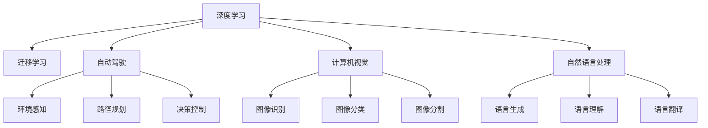

                 

## 1. 背景介绍

### 1.1 问题由来
随着科技的快速发展和信息爆炸，知识的传承和创新已成为我们面临的一大挑战。如何高效、系统地传递知识，并在此基础上实现创新，是现代教育、科学研究和产业发展的重要课题。在信息技术领域，尤其是在人工智能和计算机科学中，洞察力（Insight）扮演着关键角色。本文将深入探讨洞察力的作用，并阐述其在知识传承与创新中的重要性。

### 1.2 问题核心关键点
洞察力是指通过深入分析和理解复杂现象背后的本质关系，从而获得新的视角、想法和解决方案的能力。在人工智能和计算机科学中，洞察力体现为对问题的独特见解、模型的深度理解以及技术的创新应用。这不仅有助于解决具体问题，还能推动学科的前沿研究和技术突破。

### 1.3 问题研究意义
洞察力在知识传承与创新中的作用不可忽视。通过深入分析复杂问题，洞察力能帮助研究者发现新的研究方向，提升模型和算法的效果，推动技术进步和产业应用。具体而言：
- **提升问题解决能力**：洞察力使研究者能够从表象深入本质，找到问题的根源，从而设计出更有效的解决方案。
- **促进技术创新**：洞察力推动研究者发现现有技术的局限和不足，探索新的技术路径和应用场景。
- **加速知识传播**：洞察力使知识传播更为精准、有效，促进知识的快速积累和传递。

## 2. 核心概念与联系

### 2.1 核心概念概述

洞察力在人工智能和计算机科学中的应用，涉及以下几个核心概念：

- **深度学习**：基于神经网络的机器学习方法，通过多层次的非线性变换提取特征，实现对复杂数据的高效处理。
- **迁移学习**：将一个领域学习到的知识迁移到另一个领域，以提高在新领域的性能。
- **自动驾驶**：使用人工智能技术实现车辆的自主驾驶，包括环境感知、路径规划、决策控制等。
- **自然语言处理**：研究如何让计算机理解和处理自然语言，实现语言生成、理解和翻译等功能。
- **计算机视觉**：使计算机具备视觉感知能力，进行图像识别、分类、分割等任务。

这些概念之间存在着紧密的联系，深度学习提供了计算基础，迁移学习实现了知识迁移，自动驾驶和计算机视觉是深度学习的具体应用，自然语言处理则是计算机与人类沟通的桥梁。洞察力在这些领域中起着关键作用，帮助研究者理解问题本质，提出创新解决方案。

### 2.2 核心概念原理和架构的 Mermaid 流程图



这个流程图展示了核心概念之间的联系和应用场景。深度学习是这些领域的基础，迁移学习实现了知识的迁移和应用，自动驾驶、计算机视觉和自然语言处理则具体体现了深度学习的强大能力。

## 3. 核心算法原理 & 具体操作步骤

### 3.1 算法原理概述

洞察力的获取和应用是一个复杂的系统工程，涉及多个层次的分析和处理。下面以深度学习模型为例，阐述其算法原理和操作步骤。

深度学习模型通常包括输入层、若干隐藏层和输出层。输入层接收原始数据，隐藏层通过非线性变换提取特征，输出层给出最终预测结果。通过反向传播算法，模型能够自动调整权重和偏置，优化预测结果。

洞察力的获取，体现在对隐藏层的特征表示进行深入分析，理解特征之间的关系和规律。这通常需要借助可视化工具和技术，如t-SNE、PCA、LIME等，对模型进行解释和分析。

### 3.2 算法步骤详解

1. **数据准备**：收集和标注数据集，确保数据的多样性和代表性。
2. **模型训练**：使用深度学习框架，如TensorFlow、PyTorch等，训练模型。
3. **特征分析**：利用可视化工具对隐藏层的特征进行分析和解释，理解特征之间的关系和规律。
4. **洞察力提取**：根据特征分析结果，提取新的洞察力，包括特征间的组合、新特征的引入等。
5. **模型优化**：基于洞察力，优化模型结构和参数，提升模型的性能。
6. **应用验证**：在新的数据集上验证优化后的模型，确保其效果。

### 3.3 算法优缺点

深度学习模型具有以下优点：
- **自动特征提取**：能够自动从原始数据中提取特征，无需手动设计特征。
- **高精度**：在大规模数据集上训练，能够获得较高的预测精度。
- **可扩展性**：模型结构可扩展，支持复杂的任务和多模态数据。

同时，深度学习模型也存在一些局限性：
- **数据依赖性强**：需要大量标注数据进行训练，数据不足时效果不佳。
- **可解释性差**：模型作为"黑盒"，难以解释其内部工作机制和决策逻辑。
- **计算资源需求高**：训练和推理过程需要大量的计算资源。

### 3.4 算法应用领域

洞察力在深度学习模型的应用，体现在多个领域：

- **医学影像分析**：利用深度学习模型分析医学影像，提取洞察力，帮助诊断疾病。
- **自然语言生成**：使用深度学习模型生成自然语言文本，提供洞察力，提升文本生成质量。
- **推荐系统**：通过深度学习模型分析用户行为数据，提取洞察力，优化推荐算法，提升用户体验。
- **自动驾驶**：使用深度学习模型分析环境感知数据，提取洞察力，优化决策控制策略，提高驾驶安全性。
- **计算机视觉**：通过深度学习模型分析图像数据，提取洞察力，提升图像识别和分类的精度。

## 4. 数学模型和公式 & 详细讲解 & 举例说明

### 4.1 数学模型构建

以自然语言处理为例，我们可以构建以下数学模型：

假设输入文本为 $x = (x_1, x_2, ..., x_n)$，其中 $x_i$ 为单词或字符。定义 $w$ 为单词嵌入向量，$h$ 为隐藏层表示，$o$ 为输出层表示。则模型的计算过程可以表示为：

$$
h = f(Wx + b)
$$

$$
o = g(h)
$$

其中 $W$ 和 $b$ 为线性变换的权重和偏置，$f$ 和 $g$ 为激活函数。$h$ 表示隐藏层的特征表示，$o$ 表示最终的输出结果。

### 4.2 公式推导过程

为了更好地理解模型的计算过程，我们以一个简单的例子进行推导。假设输入文本为 "The cat in the hat"，单词嵌入向量 $w = (w_{The}, w_{cat}, w_{in}, w_{the}, w_{hat})$。设 $W$ 为线性变换矩阵，则：

$$
h = Ww + b
$$

假设 $W$ 为如下矩阵：

$$
W = \begin{bmatrix}
    w_{The} & w_{cat} & w_{in} & w_{the} & w_{hat}
\end{bmatrix}
$$

则 $h$ 的计算结果为：

$$
h = \begin{bmatrix}
    h_1 & h_2 & h_3 & h_4 & h_5
\end{bmatrix}
$$

进一步，假设激活函数 $f$ 为ReLU，则：

$$
h = max(0, Ww + b)
$$

$$
o = g(h)
$$

最终的输出 $o$ 即为模型对输入文本的预测结果。

### 4.3 案例分析与讲解

以BERT模型为例，我们分析其特征表示。BERT模型采用了Transformer结构，通过自监督预训练任务进行训练，能够获得高质量的语言表示。通过对BERT模型的隐藏层表示进行分析和解释，我们可以发现一些重要的洞察力：

- **上下文依赖性**：BERT模型能够捕捉到单词之间的上下文依赖关系，理解语义和语法结构。
- **多层次特征表示**：BERT模型通过多层次的特征提取，能够捕捉到不同层次的语言特征。
- **对抗性训练**：BERT模型通过对抗性训练，提高了模型的鲁棒性和泛化能力。

## 5. 项目实践：代码实例和详细解释说明

### 5.1 开发环境搭建

为了进行深度学习模型的开发，我们需要安装以下工具和库：

1. **Python**：安装Python 3.7或以上版本。
2. **NumPy**：用于科学计算。
3. **Pandas**：用于数据处理。
4. **Scikit-learn**：用于机器学习模型的训练和评估。
5. **TensorFlow** 或 **PyTorch**：深度学习框架。
6. **Jupyter Notebook**：交互式编程环境。

使用以下命令安装：

```bash
pip install numpy pandas scikit-learn tensorflow torch jupyter notebook
```

### 5.2 源代码详细实现

下面以一个简单的自然语言处理任务——情感分类为例，展示深度学习模型的开发过程。

首先，准备数据集：

```python
import pandas as pd
from sklearn.model_selection import train_test_split

data = pd.read_csv('data.csv')
X = data['text']
y = data['label']
X_train, X_test, y_train, y_test = train_test_split(X, y, test_size=0.2, random_state=42)
```

接着，定义模型：

```python
import tensorflow as tf
from tensorflow.keras import layers

model = tf.keras.Sequential([
    layers.Embedding(input_dim=10000, output_dim=128, input_length=100),
    layers.Conv1D(128, 5, activation='relu'),
    layers.MaxPooling1D(5),
    layers.Flatten(),
    layers.Dense(64, activation='relu'),
    layers.Dense(1, activation='sigmoid')
])
```

然后，编译和训练模型：

```python
model.compile(optimizer='adam', loss='binary_crossentropy', metrics=['accuracy'])
model.fit(X_train, y_train, epochs=10, batch_size=64, validation_data=(X_test, y_test))
```

最后，评估模型：

```python
loss, accuracy = model.evaluate(X_test, y_test)
print('Test loss:', loss)
print('Test accuracy:', accuracy)
```

### 5.3 代码解读与分析

在上述代码中，我们使用了TensorFlow框架构建了一个简单的卷积神经网络模型，用于情感分类任务。具体步骤如下：

1. **数据准备**：使用Pandas库读取数据集，并进行划分。
2. **模型定义**：使用Sequential模型，依次添加嵌入层、卷积层、池化层、全连接层和输出层。
3. **模型编译**：设置优化器、损失函数和评价指标。
4. **模型训练**：使用fit方法进行模型训练，指定训练轮数和批量大小。
5. **模型评估**：使用evaluate方法进行模型评估，输出损失和准确率。

## 6. 实际应用场景

### 6.1 医学影像分析

深度学习模型在医学影像分析中具有广泛应用，如肿瘤检测、病灶分割等。通过洞察力，研究者可以从影像中提取重要的特征和模式，提高诊断的准确性和效率。

以肿瘤检测为例，深度学习模型可以对CT或MRI图像进行特征提取，识别出肿瘤的边界和大小。通过对模型的特征表示进行深入分析，研究者可以发现肿瘤与其他组织的区别，从而提升诊断效果。

### 6.2 自然语言生成

自然语言生成（NLG）是深度学习模型在NLP领域的重要应用之一。通过洞察力，研究者可以优化模型的生成策略，提升生成的自然度。

以新闻摘要为例，深度学习模型可以对长文章进行自动摘要。通过对模型特征表示的分析，研究者可以发现哪些部分更可能包含关键信息，从而优化摘要的生成。

### 6.3 推荐系统

推荐系统通过洞察力，能够更好地理解用户的行为和偏好，优化推荐结果。研究者可以通过分析用户的历史行为数据，发现用户的兴趣点和行为模式，从而提供个性化的推荐。

以电商推荐为例，深度学习模型可以对用户的购买历史、浏览记录进行分析，提取洞察力，优化推荐算法，提升用户的购物体验。

### 6.4 自动驾驶

自动驾驶系统通过深度学习模型进行环境感知和决策控制。洞察力可以帮助研究者优化模型的感知能力和决策策略，提升驾驶的安全性和可靠性。

以车辆检测为例，深度学习模型可以对摄像头图像进行特征提取，识别出车辆和其他物体。通过对模型特征表示的分析，研究者可以发现车辆的位置和速度，从而优化决策策略。

## 7. 工具和资源推荐

### 7.1 学习资源推荐

为了深入学习深度学习模型和洞察力，以下是一些优质的学习资源：

1. **深度学习入门**：吴恩达的《机器学习》课程，介绍了深度学习的理论和实践。
2. **自然语言处理**：斯坦福大学的《CS224N》课程，介绍了NLP的基本概念和前沿技术。
3. **计算机视觉**：《深度学习与计算机视觉》课程，介绍了深度学习在计算机视觉中的应用。
4. **自动驾驶**：Udacity的《自动驾驶纳米学位》课程，介绍了自动驾驶的基本原理和关键技术。

### 7.2 开发工具推荐

以下是一些常用的开发工具：

1. **TensorFlow**：深度学习框架，支持动态图和静态图计算。
2. **PyTorch**：深度学习框架，支持动态图和自动微分。
3. **Keras**：深度学习框架，易于使用，支持多种后端。
4. **Jupyter Notebook**：交互式编程环境，支持Python代码的编写和执行。
5. **Google Colab**：免费的云服务，支持GPU和TPU计算。

### 7.3 相关论文推荐

以下是一些关于深度学习模型和洞察力的重要论文：

1. **《深度学习》**：Ian Goodfellow等著，介绍了深度学习的理论和实践。
2. **《自然语言处理与深度学习》**：Yoshua Bengio等著，介绍了NLP与深度学习的结合。
3. **《计算机视觉：模型与学习》**：Simon J.D. Prince著，介绍了计算机视觉的基本概念和前沿技术。
4. **《深度学习与自动驾驶》**：Andrew Ng等著，介绍了深度学习在自动驾驶中的应用。

## 8. 总结：未来发展趋势与挑战

### 8.1 研究成果总结

本文探讨了洞察力在深度学习模型中的应用，从算法原理到操作步骤，详细讲解了其工作机制。通过案例分析，展示了洞察力在多个领域的应用效果。通过学习资源和工具的推荐，帮助读者深入学习深度学习模型和洞察力。

### 8.2 未来发展趋势

展望未来，深度学习模型和洞察力将继续推动人工智能的发展，具体趋势如下：

1. **模型的可解释性**：未来，深度学习模型将更加注重可解释性，通过洞察力提升模型的透明度。
2. **多模态融合**：深度学习模型将更多地融合多模态数据，提升对复杂问题的理解和处理能力。
3. **边缘计算**：深度学习模型将更多地应用于边缘计算环境，提高实时性和可靠性。
4. **自动学习**：深度学习模型将更多地使用自动学习技术，提升模型的自适应能力和泛化能力。
5. **跨领域应用**：深度学习模型将更多地应用于跨领域问题，提升模型的通用性和应用范围。

### 8.3 面临的挑战

深度学习模型和洞察力在应用过程中也面临一些挑战：

1. **数据依赖性**：深度学习模型需要大量标注数据进行训练，数据获取和标注成本较高。
2. **可解释性差**：深度学习模型作为"黑盒"，难以解释其内部工作机制和决策逻辑。
3. **计算资源需求高**：深度学习模型训练和推理需要大量计算资源，成本较高。
4. **泛化能力差**：深度学习模型容易过拟合，泛化能力较差。
5. **安全性问题**：深度学习模型可能存在安全隐患，需要加强安全防护措施。

### 8.4 研究展望

未来，深度学习模型和洞察力将更多地应用于实际场景，具体展望如下：

1. **医学影像分析**：深度学习模型将更多地应用于医学影像分析，提升诊断的准确性和效率。
2. **自然语言生成**：深度学习模型将更多地应用于自然语言生成，提升生成的自然度和质量。
3. **推荐系统**：深度学习模型将更多地应用于推荐系统，提升推荐的效果和用户体验。
4. **自动驾驶**：深度学习模型将更多地应用于自动驾驶，提升驾驶的安全性和可靠性。
5. **计算机视觉**：深度学习模型将更多地应用于计算机视觉，提升图像识别和分类的精度。

## 9. 附录：常见问题与解答

### Q1：深度学习模型和洞察力有什么区别？

A：深度学习模型是一种基于神经网络的机器学习方法，通过多层次的非线性变换提取特征，实现对复杂数据的高效处理。洞察力是指通过深入分析和理解复杂现象背后的本质关系，从而获得新的视角、想法和解决方案的能力。深度学习模型是洞察力的实现手段之一，而洞察力是通过对模型的特征表示进行深入分析，获得的新视角和解决方案。

### Q2：深度学习模型需要大量标注数据进行训练，如何降低标注成本？

A：深度学习模型需要大量标注数据进行训练，数据获取和标注成本较高。为了降低标注成本，可以采用以下方法：
1. **数据增强**：通过对原始数据进行旋转、平移、缩放等操作，生成更多的训练样本。
2. **半监督学习**：利用少量标注数据和大量无标注数据进行训练，提升模型的泛化能力。
3. **主动学习**：利用模型对样本的置信度，主动选择最有用的样本进行标注。
4. **迁移学习**：将一个领域学习到的知识迁移到另一个领域，减少在新领域的标注需求。

### Q3：深度学习模型作为"黑盒"，难以解释其内部工作机制和决策逻辑，如何解决？

A：深度学习模型作为"黑盒"，难以解释其内部工作机制和决策逻辑。为了提高模型的可解释性，可以采用以下方法：
1. **可视化技术**：通过可视化工具（如t-SNE、PCA、LIME等）对模型的特征表示进行解释和分析，理解模型的决策过程。
2. **简化模型结构**：通过减少模型的层数和参数，简化模型的结构，提高模型的可解释性。
3. **注意力机制**：在模型中添加注意力机制，引导模型关注输入中的关键部分，提高模型的可解释性。
4. **对比学习**：利用对比学习技术，增强模型的鲁棒性和泛化能力，提高模型的可解释性。

### Q4：深度学习模型在应用过程中如何提高计算效率？

A：深度学习模型在应用过程中，计算资源需求高，需要大量的计算资源。为了提高计算效率，可以采用以下方法：
1. **模型裁剪**：去除不必要的层和参数，减小模型尺寸，提高推理速度。
2. **量化加速**：将浮点模型转为定点模型，压缩存储空间，提高计算效率。
3. **模型并行**：利用分布式计算技术，将模型并行化，提高计算效率。
4. **混合精度训练**：使用混合精度训练技术，提高计算效率，减少内存占用。
5. **硬件加速**：利用GPU、TPU等硬件设备，提高计算效率。

### Q5：深度学习模型在应用过程中如何提高安全性？

A：深度学习模型在应用过程中，可能存在安全隐患，需要加强安全防护措施。为了提高安全性，可以采用以下方法：
1. **数据脱敏**：对敏感数据进行脱敏处理，保护用户隐私。
2. **访问鉴权**：对访问深度学习模型进行鉴权，防止未授权访问。
3. **模型加密**：对深度学习模型进行加密处理，保护模型安全。
4. **异常检测**：实时监测模型的运行状态，发现异常情况进行告警。
5. **安全审计**：定期对深度学习模型进行安全审计，发现并修复安全漏洞。

---

作者：禅与计算机程序设计艺术 / Zen and the Art of Computer Programming

