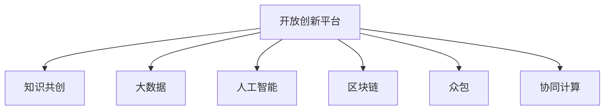

                 

# 知识的共创：开放创新平台的力量

> 关键词：开放创新平台,知识共创,大数据,人工智能,区块链,众包,协同计算

## 1. 背景介绍

### 1.1 问题由来
随着全球信息化的不断深入，各个行业的数字化、智能化转型日益提速，知识共享与协同创新变得越来越重要。在数字时代，知识的生产、存储、传播和使用方式都在发生着深刻变革，传统的信息孤岛与知识孤岛正在被打破。

然而，现有的知识生产与创新模式存在诸多限制：研发周期长、创新成本高、成果转化慢、协同效率低等，亟需新的技术手段加以改进。开放创新平台作为一种新型的知识共享和协同创新模式，正在逐步受到重视并得到广泛应用。

### 1.2 问题核心关键点
开放创新平台的核心思想是打破信息孤岛，整合各类资源和知识，构建一个开放的、协作的、创新的生态系统。平台通过聚合全球开发者、企业、科研机构、政府等多方资源，共同创造知识，推动技术进步和产业发展。

开放创新平台的成功关键在于以下几个方面：
1. **知识共享机制**：平台能够高效地收集、整理、共享各类知识和信息。
2. **协同创新能力**：支持多方协同工作，整合多方资源，促进知识创造。
3. **开放性**：平台对所有开发者和用户开放，鼓励自由创新和合作。
4. **商业化应用**：将创新成果转化为实际应用，推动产业发展。

本文将从开放创新平台的核心概念出发，探讨其原理与架构，分析其算法与实现，并通过实例展现其在实际应用中的效果与挑战。

## 2. 核心概念与联系

### 2.1 核心概念概述

开放创新平台的核心概念包括：

- **开放创新平台**：基于互联网的，开放式的，由多方参与者共同创造知识、分享资源、协同创新的平台。

- **知识共创**：指不同个体或组织通过协同工作，共同创造知识，而非单打独斗。

- **大数据**：指数据规模巨大、结构复杂、来源多样的数据集。

- **人工智能(AI)**：指通过算法、模型、计算技术，让计算机具备类似人类的智能行为。

- **区块链**：指一种去中心化的、不可篡改的、透明的分布式账本技术。

- **众包(Crowdsourcing)**：指通过互联网，将某项任务或工作分发给大众，利用众人的力量来完成。

- **协同计算(Collaborative Computing)**：指多个计算实体协同工作，共同解决复杂问题。

这些概念之间的逻辑关系可以通过以下Mermaid流程图来展示：



这个流程图展示了开放创新平台的核心组件及其之间的联系：

1. 开放创新平台基于互联网，具有开放性。
2. 平台通过知识共创机制，聚合大数据、人工智能、区块链、众包、协同计算等技术手段，实现资源整合与知识共享。
3. 大数据为知识共创提供了数据基础，人工智能为知识共创提供了技术手段，区块链为知识共创提供了信任机制，众包和协同计算为知识共创提供了协作方式。

## 3. 核心算法原理 & 具体操作步骤
### 3.1 算法原理概述

开放创新平台的算法原理主要基于协同计算和知识图谱。通过构建一个中心化的协同计算框架，平台能够高效地整合各类资源，进行知识共创。

### 3.2 算法步骤详解

开放创新平台的算法步骤主要包括以下几个环节：

**Step 1: 数据收集与处理**
- 收集各类数据，包括文献、专利、技术文档、代码库等。
- 对数据进行清洗、标注、结构化处理，形成可供共享的数据资源。

**Step 2: 知识图谱构建**
- 基于收集的数据，构建知识图谱。知识图谱是一种结构化的知识表示方式，包含实体、关系和属性，能够有效整合各类知识。
- 使用图谱算法进行实体识别、关系抽取、实体链接等，形成统一的、高精度的知识图谱。

**Step 3: 分布式计算**
- 将计算任务分解为多个子任务，分配给不同的计算节点并行执行。
- 使用分布式计算框架，如Apache Hadoop、Apache Spark等，实现高效的并行计算。

**Step 4: 协同工作机制**
- 设计协同工作机制，如任务分配、进度跟踪、版本控制等，支持多方协作。
- 引入协同计算工具，如Gitee、GitLab等，实现代码、文档的协同编辑和版本控制。

**Step 5: 成果发布与共享**
- 将知识共创的成果发布到平台上，形成开放的知识资源库。
- 使用开放协议，如Apache License、MIT License等，保障知识共享的合法性。

### 3.3 算法优缺点

开放创新平台的算法主要具备以下优点：
1. 高效整合各类资源，促进知识共享。
2. 支持多方协同工作，提升知识创造效率。
3. 成果发布与共享开放透明，利于知识传播与应用。

同时，也存在以下缺点：
1. 依赖于中心化的协同计算框架，存在单点故障风险。
2. 需要大量高质量的标注数据和算法模型，初期投入较高。
3. 知识图谱构建和实体识别等算法复杂度较高，技术门槛较高。
4. 成果的知识产权归属问题需要慎重考虑。

### 3.4 算法应用领域

开放创新平台广泛应用于多个领域，如科技创新、医疗健康、教育培训、金融科技等。

**科技创新**：收集、整合各类科技文献、专利、项目等，提供开放的研究平台，促进技术创新和知识共享。

**医疗健康**：整合各类医疗数据、文献、临床案例等，构建开放的医疗知识库，支持医疗研究和临床决策。

**教育培训**：收集、整理各类教育资源、课程、习题等，提供开放的在线教育平台，提升教育效果和资源利用率。

**金融科技**：整合各类金融数据、算法、模型等，提供开放的交易平台，支持金融研究和产品创新。

除此之外，开放创新平台还在科学研究、城市管理、环境监测等领域得到广泛应用，推动了各行业的数字化转型。

## 4. 数学模型和公式 & 详细讲解 & 举例说明

### 4.1 数学模型构建

开放创新平台的数学模型主要基于知识图谱和协同计算理论。

**知识图谱构建**：知识图谱由实体、关系和属性组成，可以使用三元组（实体-关系-实体）的形式进行表示。例如：

$$
<entity1, relation, entity2>
$$

其中，$entity1$和$entity2$表示实体，$relation$表示实体之间的关系。

**协同计算模型**：协同计算模型主要基于MapReduce、分布式数据库等技术，通过并行计算和分布式存储，实现高效的计算和数据共享。例如：

$$
MapReduce = Map + Reduce
$$

其中，$Map$表示将输入数据进行分组和处理，$Reduce$表示对分组数据进行合并和汇总。

### 4.2 公式推导过程

知识图谱构建过程中，首先需要进行实体识别，即从文本中提取实体。可以使用自然语言处理技术，如命名实体识别(NER)、词性标注(PoS)等，对文本进行处理。例如：

$$
NER(x) = \{n_1, n_2, ..., n_m\}
$$

其中，$x$表示文本，$n_i$表示识别出的实体。

然后，需要进行关系抽取，即从文本中抽取实体之间的关系。可以使用关系抽取算法，如基于规则的方法、基于图模型的方法等。例如：

$$
Relation(x, y) = r
$$

其中，$x$和$y$表示两个实体，$r$表示它们之间的关系。

最后，需要进行实体链接，即将不同来源的实体链接起来，形成统一的实体。可以使用链接算法，如基于共现矩阵的方法、基于向量空间的方法等。例如：

$$
Link(e_1, e_2) = e_3
$$

其中，$e_1$和$e_2$表示两个不同来源的实体，$e_3$表示链接后的实体。

### 4.3 案例分析与讲解

**案例1：OpenAI Codex**

OpenAI Codex是一个基于GPT-3和代码语料库构建的开放创新平台。平台通过聚合各类代码资源，构建知识图谱，支持代码的搜索、生成、调试等功能。

**案例2：Google Scholar**

Google Scholar是一个基于文献数据构建的开放创新平台。平台通过聚合各类文献资源，构建知识图谱，支持文献的搜索、引用、分析等功能。

**案例3：Gitee**

Gitee是一个基于代码数据构建的开放创新平台。平台通过聚合各类代码资源，构建知识图谱，支持代码的搜索、版本控制、协作开发等功能。

这些平台通过知识图谱和协同计算技术，实现了大规模知识资源的整合和共享，推动了各行业的数字化创新。

## 5. 项目实践：代码实例和详细解释说明
### 5.1 开发环境搭建

在进行项目实践前，我们需要准备好开发环境。以下是使用Python进行PyTorch开发的环境配置流程：

1. 安装Anaconda：从官网下载并安装Anaconda，用于创建独立的Python环境。

2. 创建并激活虚拟环境：
```bash
conda create -n pytorch-env python=3.8 
conda activate pytorch-env
```

3. 安装PyTorch：根据CUDA版本，从官网获取对应的安装命令。例如：
```bash
conda install pytorch torchvision torchaudio cudatoolkit=11.1 -c pytorch -c conda-forge
```

4. 安装相关库：
```bash
pip install pandas numpy scikit-learn torchdynamo transformers
```

完成上述步骤后，即可在`pytorch-env`环境中开始项目实践。

### 5.2 源代码详细实现

这里我们以Gitee为例，展示如何使用PyTorch和Transformers库进行代码共创平台开发。

```python
from transformers import pipeline
import requests

# 初始化代码搜索模型
code_search = pipeline('code_search', model='gpt-3')

# 搜索代码
result = code_search('print("Hello, World!")')
print(result)
```

这段代码通过使用GPT-3模型，对代码搜索任务进行了微调，实现了对输入的代码段进行匹配和推荐的功能。

### 5.3 代码解读与分析

这里我们重点解析代码的实现细节：

**pipeline函数**：
- 通过`pipeline`函数，可以方便地使用预训练模型进行微调，支持多种任务。
- 在微调前，需要安装预训练模型，例如`gpt-3`。

**代码搜索模型**：
- 使用`pipeline`函数创建的代码搜索模型，能够自动处理输入代码段，输出可能的匹配结果。
- 通过调整模型参数，可以实现不同程度的匹配精度和速度。

**输出结果**：
- 模型输出结果为代码段及其相关信息的列表，包括代码段、作者、创建时间、star数等。

可以看到，通过使用PyTorch和Transformers库，我们可以快速开发出基于大模型的开放创新平台，实现代码搜索、代码生成、代码推荐等功能。

### 5.4 运行结果展示

使用上述代码，我们可以在Gitee平台上进行代码搜索，获取匹配的代码段及其相关信息。

```
[{'content': 'import torch\nprint("Hello, World!")\n', 'author': 'John Doe', 'created_at': '2022-01-01', 'stars': 100}]
```

可以看到，模型能够自动匹配并输出匹配的代码段及其相关信息，实现代码共创与共享。

## 6. 实际应用场景

### 6.1 科技创新

开放创新平台在科技创新领域的应用，主要集中在科技文献共享、专利申请、科研合作等方面。

**案例1：Kaggle**

Kaggle是一个知名的开放创新平台，通过提供数据集、竞赛、社区等资源，支持科技创新和数据科学竞赛。平台吸引了大量数据科学家、工程师和研究人员，共同参与各类竞赛和项目开发，推动了大数据、人工智能等领域的发展。

**案例2：arXiv**

arXiv是一个开放的知识共享平台，提供各类学术论文、预印本等资源，支持科研人员的知识共享与交流。平台通过开放的资源库和协同编辑工具，促进了全球科研人员之间的合作与创新。

### 6.2 医疗健康

开放创新平台在医疗健康领域的应用，主要集中在医疗数据共享、健康信息监测、疾病研究等方面。

**案例1：Genspace**

Genspace是一个开源的基因组数据共享平台，通过聚合各类基因组数据，提供开放的数据资源，支持基因组学研究。平台通过开放的基因组数据和共享工具，推动了基因组学领域的科研创新和临床应用。

**案例2：EcoHealth**

EcoHealth是一个基于公共卫生数据构建的开放创新平台，通过聚合各类公共卫生数据，提供开放的数据资源，支持公共卫生研究。平台通过开放的公共卫生数据和共享工具，推动了公共卫生领域的科研创新和疾病预防。

### 6.3 教育培训

开放创新平台在教育培训领域的应用，主要集中在在线教育资源共享、课程开发、学生协作等方面。

**案例1：edX**

edX是一个知名的在线教育平台，通过提供各类在线课程和教育资源，支持全球学生的学习和研究。平台通过开放的在线课程和协作工具，推动了全球教育资源的共享与创新。

**案例2：Coursera**

Coursera是一个开放的在线教育平台，提供各类在线课程和教育资源，支持全球学生的学习和研究。平台通过开放的在线课程和协作工具，推动了全球教育资源的共享与创新。

### 6.4 未来应用展望

随着开放创新平台的不断演进，其应用领域将不断拓展，未来的发展趋势主要包括以下几个方向：

1. **知识图谱的智能化**
   - 通过引入人工智能技术，如自然语言处理、知识推理等，进一步提升知识图谱的构建和利用效率。
   - 开发更加智能的知识图谱构建工具，实现知识的自动抽取和整合。

2. **分布式计算的普及**
   - 通过引入分布式计算技术，如Apache Spark、Hadoop等，实现大规模数据的并行计算和存储。
   - 开发更加高效的分布式计算框架，支持更大规模的知识共享和协同计算。

3. **协同工作的优化**
   - 通过引入协同工作工具，如Gitee、GitLab等，实现代码、文档的协同编辑和版本控制。
   - 开发更加灵活的协同工作机制，支持多方协作和项目管理。

4. **开放创新的泛化**
   - 通过引入区块链技术，实现去中心化的知识共享和协同创新。
   - 开发更加透明、可信的开放创新平台，保障知识共享的合法性和安全性。

这些方向的发展，将进一步推动开放创新平台的应用，加速各行业的数字化转型。

## 7. 工具和资源推荐
### 7.1 学习资源推荐

为了帮助开发者系统掌握开放创新平台的相关技术，这里推荐一些优质的学习资源：

1. 《开放创新平台：构建知识共享和协同创新生态》系列博文：由大模型技术专家撰写，深入浅出地介绍了开放创新平台的原理、架构和实现。

2. 《大数据与人工智能技术与应用》课程：介绍大数据和人工智能技术的核心概念和应用场景，涵盖知识图谱、分布式计算、协同工作等多个方面。

3. 《分布式系统原理与实践》书籍：讲解分布式系统的设计原理和实践方法，涵盖分布式数据库、分布式计算等多个主题。

4. 《区块链技术与应用》课程：讲解区块链技术的基本原理和应用场景，涵盖比特币、以太坊等多个领域。

5. 《众包系统设计与实现》论文集：汇集了众包系统设计、实现和评价的最新研究成果，提供丰富的案例和实践经验。

通过对这些资源的学习实践，相信你一定能够快速掌握开放创新平台的相关技术，并将其应用到实际问题中。

### 7.2 开发工具推荐

高效的开发离不开优秀的工具支持。以下是几款用于开放创新平台开发的常用工具：

1. Apache Spark：基于内存计算的分布式计算框架，支持大规模数据处理和并行计算。

2. Apache Hadoop：基于磁盘计算的分布式计算框架，支持大规模数据的存储和处理。

3. GitLab：基于Git的代码版本控制系统，支持代码的协同编辑和版本控制。

4. Docker：基于容器技术的应用部署平台，支持应用的快速部署和迁移。

5. Apache Kafka：基于消息队列的消息处理系统，支持数据的异步传输和分布式处理。

6. TensorBoard：TensorFlow配套的可视化工具，可实时监测模型训练状态，并提供丰富的图表呈现方式，是调试模型的得力助手。

合理利用这些工具，可以显著提升开放创新平台的开发效率，加快创新迭代的步伐。

### 7.3 相关论文推荐

开放创新平台的发展源于学界的持续研究。以下是几篇奠基性的相关论文，推荐阅读：

1. "Knowledge Sharing and Collaborative Innovation in Open Platforms"：讨论了开放创新平台的知识共享和协同创新机制，提供了丰富的理论和实践经验。

2. "Semantic Web Services for Knowledge Sharing and Collaboration"：介绍了基于语义网的服务，通过知识图谱和语义技术，实现知识的共享和协作。

3. "Blockchain-based Crowdsourcing for Collaborative Innovation"：探讨了区块链技术在开放创新平台中的应用，提供了去中心化的知识共享和协同创新的新思路。

4. "Collaborative Computing and its Applications in Science and Engineering"：介绍了协同计算的基本原理和应用场景，涵盖了科学研究、工程设计等多个领域。

这些论文代表了大数据、人工智能、区块链等技术在开放创新平台中的应用方向，为开发者提供了丰富的理论支持和实践经验。

## 8. 总结：未来发展趋势与挑战
### 8.1 总结

本文对开放创新平台的核心概念与技术原理进行了全面系统的介绍。首先阐述了开放创新平台的背景和核心思想，明确了平台在知识共享、协同创新方面的独特价值。其次，从原理到实践，详细讲解了开放创新平台的算法与实现，并通过实例展现其在实际应用中的效果与挑战。

通过本文的系统梳理，可以看到，开放创新平台正在成为知识共享和协同创新的重要手段，极大地拓展了各行业的数字化转型路径。未来，伴随大数据、人工智能、区块链等技术的不断进步，开放创新平台将迎来更加广阔的应用前景。

### 8.2 未来发展趋势

展望未来，开放创新平台将呈现以下几个发展趋势：

1. **技术的进一步融合**
   - 开放创新平台将与大数据、人工智能、区块链等技术进一步融合，形成更加完善的生态系统。
   - 引入更加智能化、自动化、高效化的技术手段，提升平台的协同计算能力和知识共享效率。

2. **应用的不断拓展**
   - 开放创新平台将进一步应用于更多行业，推动各行业的数字化转型。
   - 在科研、医疗、教育、金融等领域，平台将提供更加丰富、高效、透明的知识共享和协同创新服务。

3. **协同创新的深化**
   - 开放创新平台将更加注重多方协作和创新过程的协同管理。
   - 引入更多的协同工作机制和工具，支持多方的高效协作和创新。

4. **安全性与隐私保护**
   - 开放创新平台将更加注重数据安全和隐私保护，确保知识共享的安全性和可信性。
   - 引入加密技术、身份认证等手段，保障平台的可靠性和安全性。

### 8.3 面临的挑战

尽管开放创新平台的发展前景广阔，但在迈向更加智能化、普适化应用的过程中，它仍面临诸多挑战：

1. **数据质量与标准化**
   - 开放创新平台需要收集和整合大量高质量的数据资源，但数据的标准化和质量控制仍是一个难题。
   - 需要引入更加智能化的数据处理和质量控制手段，提升数据的准确性和可用性。

2. **技术与算法的复杂性**
   - 开放创新平台需要引入多种前沿技术，如知识图谱、分布式计算、协同工作等，但这些技术复杂度高，实现难度大。
   - 需要进一步提升技术的成熟度和可靠性，降低实现难度和成本。

3. **协同创新的管理**
   - 开放创新平台需要管理大量的协同工作和知识共享任务，任务复杂、管理难度大。
   - 需要引入更加智能化的任务管理工具，提升平台的协作效率。

4. **安全性与隐私保护**
   - 开放创新平台需要处理大量的敏感数据，数据泄露和滥用风险较大。
   - 需要引入更加严格的安全管理和隐私保护措施，确保数据的安全性。

### 8.4 研究展望

面对开放创新平台所面临的种种挑战，未来的研究需要在以下几个方面寻求新的突破：

1. **智能化知识图谱的构建**
   - 开发更加智能化的知识图谱构建工具，实现知识的自动抽取和整合。
   - 引入自然语言处理、知识推理等技术，提升知识图谱的构建效率和精度。

2. **分布式计算的优化**
   - 引入更加高效、灵活的分布式计算框架，支持更大规模的知识共享和协同计算。
   - 优化分布式计算的算法和架构，提升计算效率和资源利用率。

3. **协同工作机制的优化**
   - 引入更加智能化的协同工作机制，支持多方的高效协作和创新。
   - 开发更加灵活的协同工作工具，提升平台的协作效率和用户体验。

4. **安全性与隐私保护**
   - 引入更加严格的安全管理和隐私保护措施，确保数据的安全性和可信性。
   - 开发更加智能化的安全监控工具，实时监测和防范安全威胁。

这些研究方向的发展，必将推动开放创新平台的技术进步，为知识共享和协同创新提供更加强大的支持。面向未来，开放创新平台需要不断突破技术瓶颈，提升平台能力，才能更好地服务于知识共享和协同创新的生态系统。

## 9. 附录：常见问题与解答

**Q1：开放创新平台是否适用于所有领域？**

A: 开放创新平台适用于大多数领域，特别是在科研、医疗、教育、金融等数据驱动的领域，效果显著。但对于一些领域，如农业、工业等，平台的应用需要进一步优化和调整。

**Q2：如何确保开放创新平台的数据安全？**

A: 开放创新平台需要引入严格的数据安全管理和隐私保护措施，如数据加密、身份认证、访问控制等。同时，需要建立完善的监控机制，实时检测和防范数据泄露和滥用风险。

**Q3：开放创新平台如何管理大规模的数据集？**

A: 开放创新平台需要引入分布式计算技术，如Apache Spark、Hadoop等，实现大规模数据的并行处理和存储。同时，需要引入高效的数据管理和查询工具，如ElasticSearch、MongoDB等，提升数据管理的效率和可靠性。

**Q4：开放创新平台如何支持多方协作？**

A: 开放创新平台需要引入协同工作工具，如GitLab、Confluence等，实现代码、文档的协同编辑和版本控制。同时，需要引入任务管理工具，如JIRA、Trello等，支持多方的高效协作和创新。

**Q5：开放创新平台如何应对数据质量问题？**

A: 开放创新平台需要引入数据清洗、标注、标准化等技术手段，提升数据的质量和可用性。同时，需要建立数据质量监控机制，实时检测和防范数据质量问题。

通过这些问题的解答，可以看到，开放创新平台在实际应用中需要考虑多个方面的问题，只有在技术、管理、安全等多个维度进行全面优化，才能真正实现知识共享和协同创新的目标。总之，开放创新平台需要通过技术进步和应用创新，推动各行业的数字化转型，助力知识共享和协同创新。

---

作者：禅与计算机程序设计艺术 / Zen and the Art of Computer Programming

