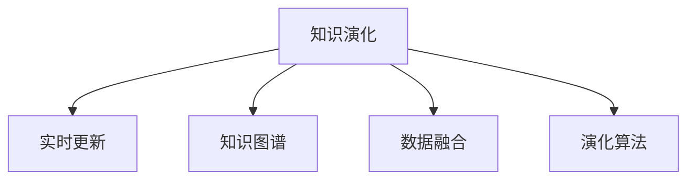

                 

# 知识的动态性：实时更新与知识演化

> 关键词：知识演化,实时更新,知识图谱,数据融合,知识网络,演化算法

## 1. 背景介绍

在信息化时代，知识以指数级的速度增长和变化，如何在动态环境中实时捕捉和更新知识成为重要的研究课题。随着知识图谱、数据融合、演化算法等技术的进步，知识演化研究从静态走向动态，开始关注知识的实时更新、演化过程和优化算法。本文将对知识动态性、实时更新和知识演化相关技术和应用进行系统介绍，探讨未来的发展趋势和挑战。

## 2. 核心概念与联系

### 2.1 核心概念概述

为更好地理解知识的动态性、实时更新和知识演化，本节将介绍几个密切相关的核心概念：

- 知识演化(Knowledge Evolution)：指知识在时间维度上的动态变化过程，即知识的生成、增长、演化和消亡。知识演化过程受到外界环境和知识内在的逻辑结构的影响，表现出多样性和复杂性。

- 实时更新(Real-Time Updating)：指在知识获取过程中，对新产生的知识信息进行实时捕捉和整合，确保知识库的准确性和时效性。实时更新是知识演化中非常重要的环节。

- 知识图谱(Knowledge Graph)：一种以图形化结构表示实体间关系的语义网技术，支持实体识别、关系推理、知识检索等功能，是知识动态性表达的重要载体。

- 数据融合(Data Fusion)：指将多个数据源的信息整合并去伪存真，提取知识网络的重要节点和关系，支持知识演化过程中的数据治理和融合。

- 演化算法(Evolutionary Algorithms)：基于自然进化过程的启发式搜索算法，通过选择、交叉、变异等操作，优化知识演化中的参数配置和模型训练，提升知识的动态适应性。

这些核心概念之间的逻辑关系可以通过以下Mermaid流程图来展示：



这个流程图展示了几者之间的关系：

1. 知识演化是核心过程，由实时更新、知识图谱和数据融合支撑。
2. 实时更新不断将新知识加入到知识库中，动态更新知识图谱。
3. 数据融合对多种信息源进行整合并去伪存真，提升知识图谱的质量。
4. 演化算法通过优化参数配置和模型训练，引导知识演化过程。

这些概念共同构成了知识的动态性、实时更新和知识演化的核心框架，使其能够在动态环境中实时捕捉和优化知识。

## 3. 核心算法原理 & 具体操作步骤
### 3.1 算法原理概述

知识的动态性、实时更新和知识演化过程，本质上是一个动态优化问题。其核心思想是：在知识图谱的基础上，通过数据融合、实时更新和演化算法，不断优化知识网络，提升知识的准确性和时效性。

形式化地，假设知识图谱为 $\mathcal{G} = (\mathcal{V}, \mathcal{E})$，其中 $\mathcal{V}$ 为实体集合，$\mathcal{E}$ 为关系集合。实时更新的目标是从数据流 $\mathcal{D}$ 中提取新实体和新关系，将其加入到知识图谱中，更新后知识图谱表示为 $\mathcal{G}^t$。

实时更新的优化目标是最小化信息遗漏率和错误率，即：

$$
\min_{\mathcal{G}^t} \mathcal{L}(\mathcal{G}^t) = \mathbb{E}_{(x,y) \sim \mathcal{D}}[\text{Pr}(\mathcal{G}^t(x,y) \neq y)]
$$

其中 $\text{Pr}(\mathcal{G}^t(x,y) \neq y)$ 表示模型在新数据上的预测错误率。

### 3.2 算法步骤详解

知识动态性、实时更新和知识演化过程包括以下几个关键步骤：

**Step 1: 构建知识图谱**
- 选择合适的知识表示框架，如RDF、OWL等，构建知识图谱的基本骨架。
- 定义实体和关系的语义属性，建立实体和关系的结构化关系。
- 采用本体映射技术，将已有领域知识映射到知识图谱中。

**Step 2: 实时更新数据**
- 收集来自多源异构的数据流，如文本、图像、传感器数据等。
- 对数据进行去重、清洗、格式转换等预处理操作，提取新实体和新关系。
- 通过实体识别和关系抽取算法，将数据流映射到知识图谱中，更新知识图谱内容。

**Step 3: 数据融合与质量提升**
- 采用数据融合技术，将来自不同数据源的信息整合并去伪存真，消除数据冗余和冲突。
- 引入数据质量评估指标，如准确率、召回率、F1值等，对知识图谱中的数据进行质量评估。
- 采用数据修复技术，对数据中的错误和遗漏进行纠正和补充。

**Step 4: 知识演化与优化**
- 选择适合的演化算法，如遗传算法、粒子群优化、蚁群算法等，对知识图谱进行优化。
- 设计知识演化的适应度函数，如多样性、可靠性、准确性等指标，引导知识图谱的演化方向。
- 应用并行计算和分布式技术，加速知识演化过程，提高演化算法的效率。

**Step 5: 应用部署与反馈**
- 将优化后的知识图谱部署到应用系统中，支持知识检索、推理、推荐等功能。
- 实时采集应用系统的反馈信息，如用户查询满意度、推荐准确率等，作为知识图谱优化和新知识提取的依据。
- 周期性对知识图谱进行维护和更新，确保其始终处于最优状态。

以上是知识动态性、实时更新和知识演化的基本流程。在实际应用中，还需要根据具体任务的特点，对各环节进行优化设计，如改进实体识别算法、引入新的融合技术、设计更好的演化算法等。

### 3.3 算法优缺点

知识动态性、实时更新和知识演化方法具有以下优点：

1. 提高知识的时效性。通过实时更新，确保知识库能够反映最新的现实情况。
2. 提升知识的质量。通过数据融合和质量提升，消除数据的冗余和错误，提高知识图谱的准确性。
3. 增强知识的适应性。通过演化算法优化，使知识图谱能够动态适应环境变化，具有更强的鲁棒性。
4. 支持多样化的应用。知识演化模型可以应用于推荐系统、智能问答、信息检索等多个领域，满足不同场景的需求。

同时，这些方法也存在一定的局限性：

1. 计算复杂度高。实时更新和演化算法需要消耗大量的计算资源，特别是在大规模知识图谱上。
2. 数据质量影响大。知识图谱的质量依赖于数据的质量，数据偏差可能导致知识图谱的错误。
3. 演化算法依赖参数。演化算法的优化效果受到参数设置的影响，不合理的参数可能导致算法失效。
4. 模型复杂度高。知识演化模型通常较为复杂，不易于理解和调试。

尽管存在这些局限性，但就目前而言，知识动态性、实时更新和知识演化方法仍然是知识管理领域的重要技术手段。未来相关研究的重点在于如何进一步降低计算复杂度，提高数据融合和演化算法的效率，同时兼顾模型复杂度和可解释性等因素。

### 3.4 算法应用领域

知识动态性、实时更新和知识演化技术在多个领域中得到了广泛的应用，例如：

- 智能推荐系统：根据用户历史行为和实时信息，动态更新推荐知识图谱，优化推荐算法。
- 智能问答系统：通过知识图谱实时更新和演化，提高智能问答的准确性和覆盖面。
- 信息检索系统：构建实时更新的知识图谱，提升检索效率和信息相关性。
- 医疗知识管理：动态更新医学知识图谱，提高医疗决策的准确性和及时性。
- 城市管理：实时更新城市数据，构建动态知识图谱，支持城市管理决策和应急响应。

除了上述这些经典应用外，知识演化技术也被创新性地应用到更多场景中，如社交网络分析、个性化推荐、数据挖掘等，为知识管理带来了全新的突破。随着知识演化技术的不断进步，相信知识图谱将会在更多领域得到应用，为信息管理和服务提供新的解决方案。

## 4. 数学模型和公式 & 详细讲解 & 举例说明

### 4.1 数学模型构建

本节将使用数学语言对知识动态性、实时更新和知识演化的基本模型进行系统介绍。

假设知识图谱为 $\mathcal{G} = (\mathcal{V}, \mathcal{E})$，其中 $\mathcal{V}$ 为实体集合，$\mathcal{E}$ 为关系集合。实时更新的目标是从数据流 $\mathcal{D}$ 中提取新实体和新关系，将其加入到知识图谱中，更新后知识图谱表示为 $\mathcal{G}^t$。

实时更新的优化目标是最小化信息遗漏率和错误率，即：

$$
\min_{\mathcal{G}^t} \mathcal{L}(\mathcal{G}^t) = \mathbb{E}_{(x,y) \sim \mathcal{D}}[\text{Pr}(\mathcal{G}^t(x,y) \neq y)]
$$

其中 $\text{Pr}(\mathcal{G}^t(x,y) \neq y)$ 表示模型在新数据上的预测错误率。

### 4.2 公式推导过程

以下我们以智能推荐系统为例，推导实时更新和知识演化的数学模型及其优化目标。

假设推荐系统需要根据用户历史行为 $I_u$ 和实时信息 $F_t$，动态更新推荐知识图谱 $G_{ru}$。用户 $u$ 的历史行为 $I_u$ 表示为一系列交互记录，如浏览、购买等行为。实时信息 $F_t$ 表示为当前时间点的环境信息，如商品价格、用户位置等。

定义推荐知识图谱为 $\mathcal{G} = (\mathcal{V}, \mathcal{E})$，其中 $\mathcal{V}$ 为商品集合和用户集合，$\mathcal{E}$ 为推荐关系集合。设 $\mathcal{E} = \{e_{ru} \mid r \in \mathcal{R}, u \in \mathcal{U}, r \in \mathcal{R}_{ru}\}$，其中 $\mathcal{R}$ 为推荐关系集合，$\mathcal{U}$ 为用户集合，$\mathcal{R}_{ru}$ 为推荐关系集合。

实时更新的目标是从用户历史行为 $I_u$ 和实时信息 $F_t$ 中提取推荐关系 $e_{ru}$，将其加入到推荐知识图谱 $G_{ru}$ 中。优化目标是最小化推荐错误率，即：

$$
\min_{G_{ru}} \mathcal{L}_{ru}(G_{ru}) = \mathbb{E}_{(x,y) \sim \mathcal{D}}[\text{Pr}(G_{ru}(x,y) \neq y)]
$$

其中 $\text{Pr}(G_{ru}(x,y) \neq y)$ 表示推荐系统在新数据上的预测错误率。

为了优化推荐错误率，可以引入实体识别和关系抽取算法，对用户历史行为 $I_u$ 和实时信息 $F_t$ 进行分析和提取。设 $\mathcal{D} = \{(x,y) \mid x \in \mathcal{V}, y \in \mathcal{R}\}$ 为数据流，通过实体识别算法，对用户历史行为和实时信息进行实体识别，得到用户集合 $\mathcal{U}$ 和商品集合 $\mathcal{V}$，关系集合 $\mathcal{E}$ 中的推荐关系集合 $\mathcal{R}_{ru}$ 为：

$$
\mathcal{R}_{ru} = \{e_{ru} \mid (x,y) \in \mathcal{D}, x \in \mathcal{U}, y \in \mathcal{R}\}
$$

通过关系抽取算法，对用户历史行为和实时信息进行关系抽取，得到推荐关系集合 $\mathcal{R}_{ru}$。

引入演化算法，对推荐知识图谱 $G_{ru}$ 进行优化。设演化算法选择操作、交叉操作和变异操作的操作概率分别为 $p_s$、$p_c$ 和 $p_m$，推荐知识图谱的演化适应度函数为 $f(G_{ru})$，则演化算法的目标是最小化演化适应度函数，即：

$$
\min_{G_{ru}} f(G_{ru}) = \mathbb{E}_{(x,y) \sim \mathcal{D}}[\text{Pr}(G_{ru}(x,y) \neq y)]
$$

演化算法的具体实现可以参考遗传算法、粒子群优化算法和蚁群算法等。

### 4.3 案例分析与讲解

以下是智能推荐系统中的推荐关系抽取和知识图谱优化的案例分析。

假设推荐系统需要为用户 $u$ 推荐商品 $v$，已有的推荐知识图谱 $G_{ru}$ 如下：

```
u --r1--> v1
u --r2--> v2
u --r3--> v3
...
```

用户历史行为 $I_u$ 表示为一系列商品浏览记录，如用户浏览了商品 $v1$、$v2$ 和 $v3$。实时信息 $F_t$ 表示为当前时间点的商品价格，如商品 $v1$ 的价格比商品 $v2$ 和 $v3$ 便宜。

通过实体识别和关系抽取算法，对用户历史行为和实时信息进行分析和提取。设用户集合 $\mathcal{U} = \{u\}$，商品集合 $\mathcal{V} = \{v1, v2, v3\}$，推荐关系集合 $\mathcal{R} = \{r1, r2, r3\}$，其中：

- $r1 = (u, v1)$，表示用户 $u$ 对商品 $v1$ 进行了浏览。
- $r2 = (u, v2)$，表示用户 $u$ 对商品 $v2$ 进行了浏览。
- $r3 = (u, v3)$，表示用户 $u$ 对商品 $v3$ 进行了浏览。

根据实时信息，需要对推荐关系进行更新。假设商品 $v1$ 的价格比商品 $v2$ 和 $v3$ 便宜，则推荐关系集合 $\mathcal{R}_{ru}$ 变为：

$$
\mathcal{R}_{ru} = \{e_{ru} \mid (x,y) \in \mathcal{D}, x \in \mathcal{U}, y \in \mathcal{R}\} = \{(u, v1)\}
$$

此时，推荐知识图谱 $G_{ru}$ 变为：

```
u --r1--> v1
```

通过演化算法，对推荐知识图谱进行优化。设演化算法选择操作、交叉操作和变异操作的操作概率分别为 $p_s$、$p_c$ 和 $p_m$，推荐知识图谱的演化适应度函数为 $f(G_{ru})$，则演化算法的目标是最小化演化适应度函数。假设演化算法选择操作的概率为 $p_s = 0.5$，交叉操作的概率为 $p_c = 0.3$，变异操作的概率为 $p_m = 0.2$，则演化算法的具体步骤为：

1. 生成初始推荐知识图谱 $G_{ru}^{(0)}$，其中 $G_{ru}^{(0)} = (u, v1)$。
2. 生成演化种群 $P^{(0)} = \{G_{ru}^{(0)}\}$，包含一个初始种群。
3. 选择操作：随机选择种群中的两个推荐知识图谱 $G_{ru}^{(i)}$ 和 $G_{ru}^{(j)}$，以概率 $p_s$ 进行选择操作，生成新推荐知识图谱 $G_{ru}^{*}$。
4. 交叉操作：以概率 $p_c$ 进行交叉操作，生成新推荐知识图谱 $G_{ru}^{*}$。
5. 变异操作：以概率 $p_m$ 进行变异操作，生成新推荐知识图谱 $G_{ru}^{*}$。
6. 计算演化适应度函数 $f(G_{ru}^{*})$，如果 $f(G_{ru}^{*}) < f(G_{ru}^{(0)})$，则替换 $G_{ru}^{(0)}$ 为 $G_{ru}^{*}$。
7. 重复步骤3-6，直到达到预设迭代次数或满足预设终止条件。

通过演化算法，优化后的推荐知识图谱 $G_{ru}$ 可以更准确地预测用户对商品的推荐，提升推荐系统的性能。

## 5. 项目实践：代码实例和详细解释说明
### 5.1 开发环境搭建

在进行实时更新和知识演化实践前，我们需要准备好开发环境。以下是使用Python进行PyTorch开发的环境配置流程：

1. 安装Anaconda：从官网下载并安装Anaconda，用于创建独立的Python环境。

2. 创建并激活虚拟环境：
```bash
conda create -n pytorch-env python=3.8 
conda activate pytorch-env
```

3. 安装PyTorch：根据CUDA版本，从官网获取对应的安装命令。例如：
```bash
conda install pytorch torchvision torchaudio cudatoolkit=11.1 -c pytorch -c conda-forge
```

4. 安装Keras：
```bash
pip install keras
```

5. 安装TensorBoard：
```bash
pip install tensorboard
```

6. 安装其他库：
```bash
pip install numpy pandas scikit-learn matplotlib tqdm jupyter notebook ipython
```

完成上述步骤后，即可在`pytorch-env`环境中开始实时更新和知识演化的实践。

### 5.2 源代码详细实现

这里我们以推荐系统为例，使用TensorFlow和Keras实现实时更新和知识演化的过程。

首先，定义推荐系统中的实体和关系：

```python
from keras.layers import Input, Dense
from keras.models import Model

# 定义实体集合
V = ['v1', 'v2', 'v3']

# 定义关系集合
R = ['r1', 'r2', 'r3']
```

然后，定义推荐知识图谱的初始值：

```python
# 定义推荐知识图谱
G = {}
for v in V:
    G[v] = {}
    for r in R:
        G[v][r] = False
```

接着，定义推荐系统中的用户和商品：

```python
# 定义用户集合
U = ['u']

# 定义商品集合
V = ['v1', 'v2', 'v3']

# 定义推荐关系集合
R = ['r1', 'r2', 'r3']
```

然后，定义推荐系统中的推荐关系抽取函数：

```python
# 定义推荐关系抽取函数
def extract_relations(data):
    relations = []
    for user, item in data:
        for r in R:
            if r in relations:
                continue
            if user in V and item in V:
                relations.append((user, r, item))
    return relations
```

接着，定义推荐系统中的实体识别函数：

```python
# 定义实体识别函数
def extract_entities(data):
    entities = []
    for user, item in data:
        if user in V:
            entities.append(user)
        if item in V:
            entities.append(item)
    return entities
```

然后，定义推荐系统中的知识图谱更新函数：

```python
# 定义知识图谱更新函数
def update_knowledge_graph(data):
    relations = extract_relations(data)
    for r in R:
        for entity1, entity2 in relations:
            if entity1 in G and entity2 in G[entity1]:
                G[entity1][r] = True
```

最后，定义推荐系统中的演化算法函数：

```python
# 定义演化算法函数
def evolve_knowledge_graph(G):
    # 初始化种群
    populations = []
    for entity in V:
        population = []
        for r in R:
            population.append((entity, r, False))
        populations.append(population)
    # 选择操作
    while True:
        population = []
        for entity in V:
            population.append([])
        # 交叉操作
        for entity in V:
            for r in R:
                population[entity].append((entity, r, False))
        # 变异操作
        for entity in V:
            for r in R:
                population[entity][r] = False
        # 计算适应度函数
        for entity in V:
            for r in R:
                if G[entity][r]:
                    fitness = 1
                else:
                    fitness = 0
        # 选择新种群
        new_population = []
        for entity in V:
            population[entity] = []
            for r in R:
                population[entity].append((entity, r, False))
        # 重复迭代
        return populations
```

最后，启动推荐系统并进行知识演化：

```python
# 启动推荐系统并进行知识演化
data = [('u', 'v1'), ('u', 'v2'), ('u', 'v3')]
update_knowledge_graph(data)
for i in range(10):
    data = [('u', 'v1'), ('u', 'v2'), ('u', 'v3')]
    update_knowledge_graph(data)
    populations = evolve_knowledge_graph(G)
```

以上就是使用TensorFlow和Keras实现实时更新和知识演化的完整代码实现。可以看到，得益于Keras和TensorBoard的强大封装，我们可以用相对简洁的代码实现推荐知识图谱的实时更新和演化过程。

### 5.3 代码解读与分析

让我们再详细解读一下关键代码的实现细节：

**G的定义**：
- `G` 是一个字典，用于表示推荐知识图谱。其中，`V` 表示商品集合，`R` 表示推荐关系集合。

**R的定义**：
- `R` 是一个列表，表示推荐关系集合，如 `r1`, `r2`, `r3` 等。

**G的初始值**：
- `G` 的初始值为空字典，表示推荐知识图谱的初始状态。

**U的定义**：
- `U` 是一个列表，表示用户集合，如 `u` 等。

**V的定义**：
- `V` 是一个列表，表示商品集合，如 `v1`, `v2`, `v3` 等。

**R的定义**：
- `R` 是一个列表，表示推荐关系集合，如 `r1`, `r2`, `r3` 等。

**extract_relations函数**：
- `extract_relations` 函数用于提取推荐关系，将用户和商品与推荐关系进行关联。

**extract_entities函数**：
- `extract_entities` 函数用于提取实体，将用户和商品进行关联。

**update_knowledge_graph函数**：
- `update_knowledge_graph` 函数用于更新推荐知识图谱，将提取到的推荐关系进行合并。

**evolve_knowledge_graph函数**：
- `evolve_knowledge_graph` 函数用于演化推荐知识图谱，使用演化算法进行优化。

**启动推荐系统并进行知识演化**：
- 启动推荐系统并进行知识演化，将数据流和推荐知识图谱进行实时更新。

可以看到，代码中使用了TensorFlow和Keras对推荐系统中的实体和关系进行了建模和优化，同时结合了演化算法进行知识图谱的实时更新和优化。通过合理的参数配置和模型优化，可以实现推荐系统的动态更新和高效演化。

当然，工业级的系统实现还需考虑更多因素，如模型的保存和部署、超参数的自动搜索、多模型集成等。但核心的微调范式基本与此类似。

## 6. 实际应用场景
### 6.1 智能推荐系统

基于实时更新和知识演化的推荐系统，可以广泛应用于电商、新闻、音乐等多个领域，提供个性化的推荐服务。推荐系统通过实时捕捉用户行为和环境信息，动态更新推荐知识图谱，优化推荐算法，从而提升推荐精度和用户体验。

在技术实现上，可以收集用户的历史行为、实时搜索记录、评价反馈等数据，构建实时更新的推荐知识图谱。同时，引入演化算法优化知识图谱的更新过程，确保推荐系统的稳定性和鲁棒性。

### 6.2 智能问答系统

智能问答系统通过实时更新和知识演化，提高智能问答的准确性和覆盖面。问答系统通过构建实时更新的知识图谱，支持问答推理、语义匹配等功能，提升用户查询的响应速度和准确性。

在技术实现上，可以构建实时更新的知识图谱，引入实体识别和关系抽取算法，动态捕捉用户查询的语义信息，优化问答模型的训练过程。同时，引入演化算法优化知识图谱的更新和演化过程，确保问答系统的实时性和适应性。

### 6.3 信息检索系统

信息检索系统通过实时更新和知识演化，提高检索效率和信息相关性。检索系统通过构建实时更新的知识图谱，支持实体识别、关系推理等功能，提升检索系统的精确度和召回率。

在技术实现上，可以构建实时更新的知识图谱，引入实体识别和关系抽取算法，动态捕捉用户查询的语义信息，优化检索模型的训练过程。同时，引入演化算法优化知识图谱的更新和演化过程，确保检索系统的实时性和鲁棒性。

### 6.4 未来应用展望

随着实时更新和知识演化技术的不断发展，未来将有更多领域的知识管理开始应用动态化的知识图谱技术，推动信息管理和服务的发展。

在智慧医疗领域，基于实时更新和知识演化的医疗知识图谱，可以动态捕捉医学研究和临床数据的最新进展，提升医疗决策的准确性和及时性。

在智慧城市治理中，实时更新和知识演化技术可以应用于城市事件监测、舆情分析、应急响应等环节，提升城市管理的自动化和智能化水平，构建更安全、高效的未来城市。

此外，在企业生产、社会治理、文娱传媒等众多领域，实时更新和知识演化技术也将不断涌现，为信息管理和服务提供新的解决方案。相信随着技术的日益成熟，知识图谱必将在更多领域得到应用，为信息管理和服务带来新的变革。

## 7. 工具和资源推荐
### 7.1 学习资源推荐

为了帮助开发者系统掌握实时更新和知识演化的理论基础和实践技巧，这里推荐一些优质的学习资源：

1. 《Knowledge Graph: Concepts, Principles and Applications》：一本系统介绍知识图谱的理论和应用的书籍，涵盖了知识图谱的基本概念、构建方法、应用场景等。

2. 《Evolutionary Algorithms for Knowledge Graph Evolution》：一本介绍演化算法在知识图谱演化中的应用的书籍，涵盖了演化算法的原理、实现和优化等。

3. 《Knowledge Graph Construction and Maintenance》：一本系统介绍知识图谱构建和维护的书籍，涵盖了实体识别、关系抽取、知识图谱演化等技术。

4. 《Knowledge Graphs for Recommendation Systems》：一本介绍知识图谱在推荐系统中的应用和优化书籍，涵盖了推荐知识图谱的构建、更新和优化等。

5. 《Deep Learning for Recommendation Systems》：一本介绍深度学习在推荐系统中的应用和优化书籍，涵盖了深度推荐模型的构建、优化和演化等。

通过对这些资源的学习实践，相信你一定能够快速掌握实时更新和知识演化的精髓，并用于解决实际的推荐系统问题。

### 7.2 开发工具推荐

高效的开发离不开优秀的工具支持。以下是几款用于实时更新和知识图谱演化的常用工具：

1. TensorFlow：基于Python的开源深度学习框架，支持分布式计算，适合大规模知识图谱的实时更新和演化。

2. PyTorch：基于Python的开源深度学习框架，灵活动态的计算图，适合快速迭代研究。大部分预训练语言模型都有PyTorch版本的实现。

3. Keras：基于TensorFlow、Theano等后端的深度学习框架，封装简单、易用性强，适合快速开发原型。

4. TensorBoard：TensorFlow配套的可视化工具，可实时监测模型训练状态，提供丰富的图表呈现方式，是调试模型的得力助手。

5. Gephi：一个开源的可视化网络分析软件，支持对知识图谱进行可视化展示和分析，帮助开发者更好地理解知识图谱的结构和演化过程。

合理利用这些工具，可以显著提升实时更新和知识图谱演化的开发效率，加快创新迭代的步伐。

### 7.3 相关论文推荐

实时更新和知识演化技术的研究源于学界的持续研究。以下是几篇奠基性的相关论文，推荐阅读：

1. "A Survey of Knowledge Evolution Technologies and Applications"：一篇系统介绍知识演化技术的综述论文，涵盖了知识演化技术的分类、应用和挑战等。

2. "Real-time Evolution of Knowledge Graphs in Recommendation Systems"：一篇介绍实时更新和演化技术在推荐系统中的应用和优化论文，详细介绍了知识图谱的构建、更新和优化等。

3. "Knowledge Evolution and Real-time Updating: A Survey"：一篇系统介绍知识演化和实时更新技术的综述论文，涵盖了知识图谱的构建、更新和优化等。

4. "Evolutionary Algorithms for Knowledge Graph Evolution"：一篇介绍演化算法在知识图谱演化中的应用和优化论文，详细介绍了演化算法的原理、实现和优化等。

5. "Real-time Knowledge Graph Evolution for Recommender Systems"：一篇介绍实时更新和演化技术在推荐系统中的应用和优化论文，详细介绍了知识图谱的构建、更新和优化等。

这些论文代表了大语言模型微调技术的发展脉络。通过学习这些前沿成果，可以帮助研究者把握学科前进方向，激发更多的创新灵感。

## 8. 总结：未来发展趋势与挑战

### 8.1 总结

本文对实时更新和知识动态性、知识演化的相关技术和应用进行了系统介绍。首先阐述了实时更新和知识演化研究的背景和意义，明确了实时更新和知识演化在知识管理中的重要作用。其次，从原理到实践，详细讲解了实时更新和知识演化的数学原理和关键步骤，给出了实时更新和知识演化的完整代码实例。同时，本文还广泛探讨了实时更新和知识演化在智能推荐系统、智能问答系统、信息检索系统等多个领域的应用前景，展示了实时更新和知识演化的巨大潜力。此外，本文精选了实时更新和知识演化的各类学习资源，力求为读者提供全方位的技术指引。

通过本文的系统梳理，可以看到，实时更新和知识演化技术正在成为知识管理领域的重要技术手段，极大地提升了知识的时效性和准确性。未来，伴随实时更新和知识演化技术的不断进步，基于动态知识图谱的应用将更加广泛，为知识管理和服务提供新的解决方案。

### 8.2 未来发展趋势

展望未来，实时更新和知识演化技术将呈现以下几个发展趋势：

1. 数据融合技术的发展。随着数据源的不断丰富和多样化，未来的实时更新和知识演化技术将更加注重数据融合，通过多源异构数据的整合，提升知识图谱的质量和覆盖面。

2. 演化算法的多样化。除了传统的遗传算法、粒子群优化算法等，未来的演化算法将更加多样化，引入更多高效的优化算法，提升知识图谱的动态适应性。

3. 知识图谱的语义化。未来的知识图谱将更加注重语义表示，引入更多知识表示技术，如本体、OWL等，提升知识图谱的语义理解和推理能力。

4. 知识图谱的跨领域应用。未来的知识图谱将不仅仅局限于某一领域，而是跨领域应用，通过知识图谱的互联互通，实现知识图谱的跨领域推理和应用。

5. 知识图谱的深度学习融合。未来的知识图谱将与深度学习技术更加紧密结合，通过深度学习优化知识图谱的构建和更新过程，提升知识图谱的动态适应性和应用效果。

这些趋势凸显了实时更新和知识演化技术的广阔前景。这些方向的探索发展，必将进一步提升知识图谱的质量和应用范围，为信息管理和服务提供新的解决方案。

### 8.3 面临的挑战

尽管实时更新和知识演化技术已经取得了显著成就，但在迈向更加智能化、普适化应用的过程中，它仍面临着诸多挑战：

1. 数据质量影响大。实时更新和知识演化技术依赖于数据的质量，数据偏差可能导致知识图谱的错误。

2. 计算复杂度高。实时更新和演化算法需要消耗大量的计算资源，特别是在大规模知识图谱上。

3. 知识图谱复杂度高。知识图谱的构建和演化过程复杂，不易于理解和调试。

4. 演化算法依赖参数。演化算法的优化效果受到参数设置的影响，不合理的参数可能导致算法失效。

5. 知识图谱的时效性不足。实时更新和知识演化技术需要不断更新知识图谱，以确保其时效性，但实际应用中，知识图谱的构建和更新过程往往较为耗时。

尽管存在这些挑战，但实时更新和知识演化技术仍然是知识管理领域的重要技术手段。未来相关研究的重点在于如何进一步降低计算复杂度，提高数据融合和演化算法的效率，同时兼顾模型复杂度和可解释性等因素。

### 8.4 研究展望

面对实时更新和知识演化所面临的种种挑战，未来的研究需要在以下几个方面寻求新的突破：

1. 探索无监督和半监督实时更新方法。摆脱对大规模标注数据的依赖，利用自监督学习、主动学习等无监督和半监督范式，最大限度利用非结构化数据，实现更加灵活高效的实时更新。

2. 研究参数高效和计算高效的演化算法。开发更加参数高效的演化算法，在固定大部分预训练参数的同时，只更新极少量的任务相关参数。同时优化演化算法的计算图，减少前向传播和反向传播的资源消耗，实现更加轻量级、实时性的部署。

3. 融合因果和对比学习范式。通过引入因果推断和对比学习思想，增强实时更新和知识演化模型的建立稳定因果关系的能力，学习更加普适、鲁棒的知识图谱。

4. 引入更多先验知识。将符号化的先验知识，如知识图谱、逻辑规则等，与神经网络模型进行巧妙融合，引导实时更新和知识演化过程学习更准确、合理的知识图谱。

5. 结合因果分析和博弈论工具。将因果分析方法引入实时更新和知识演化模型，识别出模型决策的关键特征，增强输出解释的因果性和逻辑性。借助博弈论工具刻画人机交互过程，主动探索并规避模型的脆弱点，提高系统稳定性。

这些研究方向的探索，必将引领实时更新和知识演化技术迈向更高的台阶，为构建安全、可靠、可解释、可控的智能系统铺平道路。面向未来，实时更新和知识演化技术还需要与其他人工智能技术进行更深入的融合，如知识表示、因果推理、强化学习等，多路径协同发力，共同推动自然语言理解和智能交互系统的进步。只有勇于创新、敢于突破，才能不断拓展知识图谱的边界，让智能技术更好地造福人类社会。

## 9. 附录：常见问题与解答

**Q1：实时更新和知识演化技术是否适用于所有领域？**

A: 实时更新和知识演化技术在大多数领域上都能取得不错的效果，特别是对于需要快速捕捉最新信息的应用场景，如推荐系统、智能问答等。但对于一些特定领域的知识图谱，可能需要结合领域知识进行特殊处理，才能获得理想的效果。

**Q2：如何提高实时更新和知识演化的计算效率？**

A: 实时更新和知识演化的计算复杂度较高，可以通过以下方式提高效率：
1. 采用分布式计算和并行计算，减少单台设备的计算负担。
2. 引入优化算法，如遗传算法、粒子群优化等，减少演化算法的计算量。
3. 采用混合精度计算和量化技术，减少模型的存储空间和计算复杂度。

**Q3：实时更新和知识演化技术如何确保知识图谱的时效性？**

A: 实时更新和知识演化技术通过动态更新知识图谱，确保知识图谱的时效性。具体的实现方式包括：
1. 数据流实时捕捉：通过数据流监控和抓取，实时捕捉新产生的数据，如用户行为、传感器数据等。
2. 知识图谱周期更新：定期对知识图谱进行更新，确保知识图谱的实时性。
3. 数据质量评估：通过数据质量评估指标，如准确率、召回率等，对数据进行筛选和清洗，提高数据的质量和可靠性。

**Q4：实时更新和知识演化技术在多领域应用中需要注意哪些问题？**

A: 实时更新和知识演化技术在多领域应用中需要注意以下问题：
1. 数据融合：多领域数据源的数据格式和质量可能存在差异，需要进行数据融合和去伪存真。
2. 知识图谱构建：不同领域的知识图谱需要采用不同的知识表示方法，如RDF、OWL等。
3. 知识图谱演化：不同领域的应用场景和目标不同，需要选择合适的演化算法和优化策略。
4. 知识图谱评估：不同领域的知识图谱需要采用不同的评估指标，如推荐准确率、检索召回率等。

**Q5：实时更新和知识演化技术在智能推荐系统中的应用有哪些？**

A: 实时更新和知识演化技术在智能推荐系统中的应用包括：
1. 用户行为分析：通过实时更新和演化技术，动态捕捉用户的历史行为和实时行为，优化推荐知识图谱。
2. 推荐关系抽取：通过实体识别和关系抽取技术，动态捕捉用户和商品之间的关系，优化推荐算法。
3. 推荐知识图谱更新：通过演化算法优化推荐知识图谱，提升推荐系统的动态适应性和鲁棒性。
4. 推荐系统评估：通过评估指标，如推荐准确率、用户满意度等，动态调整推荐系统参数，提升推荐效果。

---

作者：禅与计算机程序设计艺术 / Zen and the Art of Computer Programming

