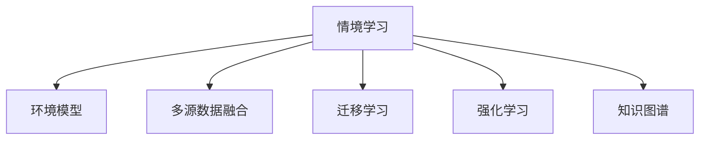

                 

## 1. 背景介绍

### 1.1 问题由来

近年来，随着人工智能技术的快速发展，特别是深度学习和迁移学习等技术的应用，计算机在理解、学习和应用知识方面取得了显著进展。然而，尽管在技术和算法上取得了诸多突破，计算机在认知和情境学习方面的能力仍与人类存在显著差距。如何让计算机更好地理解知识，并在复杂情境中进行情境学习，成为人工智能领域的重要研究方向。

### 1.2 问题核心关键点

情境学习（Situated Learning）是认知心理学的一个重要概念，指的是个体在特定情境中通过与环境交互，不断调整和优化自己的认知模型，从而获取知识、形成理解的过程。计算机的情境学习，即指在复杂环境中，通过与上下文交互、利用多源数据进行推理和学习，以适应特定任务的能力。

情境学习在自然语言处理（NLP）、智能推荐系统、机器人导航等领域中得到了广泛应用。例如，在NLP中，通过在特定语境下理解语义，生成自然流畅的文本；在推荐系统中，通过分析用户行为和物品属性，生成个性化的推荐；在机器人导航中，通过实时感知环境变化，自主规划路径。情境学习的目标是通过构建环境模型，使计算机能够更灵活、更智能地处理复杂任务。

### 1.3 问题研究意义

情境学习的研究对于拓展计算机的认知能力、提高智能系统的泛化能力和适应性具有重要意义：

1. 提高智能化水平：情境学习使计算机能够根据环境变化，动态调整策略，提升问题解决和推理能力。
2. 增强泛化能力：通过在多变的情境中学习，计算机可以更好地适应不同领域和任务。
3. 促进人机协作：情境学习使计算机能够在复杂的交互中与人类协作，提升用户体验。
4. 优化资源利用：情境学习使计算机能够在不同情境下优化资源利用，减少无效计算。

## 2. 核心概念与联系

### 2.1 核心概念概述

为了更好地理解情境学习，本节将介绍几个核心概念：

- **情境学习（Situated Learning）**：指在特定情境中，个体通过与环境交互，不断调整和优化自己的认知模型，从而获取知识、形成理解的过程。
- **环境模型（Environmental Model）**：指对环境的描述和表示，通常通过状态空间和行动空间来定义，用于引导智能体在环境中的行动。
- **多源数据融合（Multi-modal Data Fusion）**：指将来自不同模态（如文本、图像、音频等）的数据进行融合，以提高情境理解的准确性和全面性。
- **迁移学习（Transfer Learning）**：指将在一个领域学到的知识迁移到另一个领域，加速新领域的学习过程。
- **强化学习（Reinforcement Learning）**：通过奖励机制引导智能体进行学习，使其在特定情境中优化策略。
- **知识图谱（Knowledge Graph）**：一种结构化的知识表示方法，用于描述实体之间的语义关系。

这些核心概念之间的逻辑关系可以通过以下Mermaid流程图来展示：



这个流程图展示了情境学习的核心概念及其之间的关系：

1. 情境学习依赖于环境模型、多源数据融合、迁移学习、强化学习和知识图谱等关键概念。
2. 这些概念共同构成了情境学习的知识基础，使计算机能够在复杂环境中进行有效学习。

## 3. 核心算法原理 & 具体操作步骤

### 3.1 算法原理概述

情境学习的核心算法原理可以归纳为以下几点：

1. **环境感知与建模**：通过传感器和数据采集设备，计算机对环境进行感知，并构建环境模型，用于描述环境状态和行动空间。
2. **多源数据融合**：将来自不同模态的数据进行融合，以获得更全面、准确的环境理解。
3. **知识迁移**：将在其他领域学到的知识迁移到当前情境中，加速学习过程。
4. **强化学习**：通过奖励机制引导智能体在特定情境中优化策略，提升学习效果。
5. **情境推理**：利用情境模型和知识图谱，进行情境推理和决策。

### 3.2 算法步骤详解

情境学习的算法步骤可以分为以下几个关键步骤：

**Step 1: 环境感知与建模**

- **传感器部署**：在特定环境中部署传感器和数据采集设备，如摄像头、激光雷达、GPS等，对环境进行感知。
- **环境建模**：根据传感器数据，构建环境模型，如地图、状态空间和行动空间。
- **状态更新**：实时更新环境状态，用于指导后续行动。

**Step 2: 多源数据融合**

- **数据采集**：从不同模态获取数据，如文本、图像、音频等。
- **数据融合**：使用融合算法，如贝叶斯网络、深度学习等，将不同模态的数据进行融合，生成统一的环境表示。
- **特征提取**：对融合后的数据进行特征提取，用于情境推理和决策。

**Step 3: 知识迁移**

- **知识图谱构建**：构建知识图谱，描述实体之间的语义关系。
- **知识抽取**：从知识图谱中抽取有用的知识，用于情境推理和决策。
- **知识迁移**：将在其他领域学到的知识迁移到当前情境中，加速学习过程。

**Step 4: 强化学习**

- **策略定义**：定义智能体的行动策略，如行为规划、路径规划等。
- **奖励设计**：设计合理的奖励机制，引导智能体进行学习。
- **优化策略**：通过强化学习算法，优化智能体的策略，使其在特定情境中表现更好。

**Step 5: 情境推理**

- **情境推理**：利用情境模型和知识图谱，进行情境推理和决策。
- **推理算法**：使用推理算法，如图神经网络、逻辑推理等，对情境进行推理和决策。
- **行动规划**：根据情境推理结果，生成行动计划，指导智能体进行下一步行动。

### 3.3 算法优缺点

情境学习算法具有以下优点：

1. **泛化能力强**：通过多源数据融合和知识迁移，情境学习算法能够更好地适应不同环境和任务。
2. **鲁棒性好**：由于使用了多种传感器和数据融合技术，情境学习算法具有较好的鲁棒性，能够应对环境中的不确定性。
3. **实时性强**：通过实时感知环境和更新状态，情境学习算法能够快速响应环境变化，进行实时决策。

但情境学习算法也存在以下缺点：

1. **数据需求高**：情境学习需要大量高质量的环境数据，数据获取成本较高。
2. **模型复杂**：情境学习模型通常包含多个模块和算法，模型设计复杂，维护困难。
3. **计算量大**：多源数据融合和情境推理过程计算量较大，对计算资源要求较高。

### 3.4 算法应用领域

情境学习算法已经在多个领域得到了应用，具体包括：

- **智能推荐系统**：通过分析用户行为和物品属性，生成个性化的推荐。
- **机器人导航**：利用实时感知环境，自主规划路径。
- **自然语言处理**：在特定语境下理解语义，生成自然流畅的文本。
- **智能监控**：实时监控环境变化，及时响应异常事件。
- **智能家居**：根据环境变化，自动调整家居设备状态。
- **无人驾驶**：通过感知环境，进行路径规划和决策。

## 4. 数学模型和公式 & 详细讲解

### 4.1 数学模型构建

本节将使用数学语言对情境学习算法进行更加严格的刻画。

设环境状态为 $S$，行动空间为 $A$，智能体的策略为 $\pi$，奖励函数为 $R$，智能体的目标是最小化累计奖励，即：

$$
J(\pi) = \mathbb{E} \left[ \sum_{t=0}^{\infty} \gamma^t R(s_t, a_t) \right]
$$

其中，$\gamma$ 为折扣因子，控制奖励的未来价值。

智能体的行动策略 $\pi$ 可以通过策略梯度算法进行优化：

$$
\pi(a|s) \propto \exp\left( Q^\pi(s,a) \right)
$$

其中，$Q^\pi(s,a)$ 为智能体的Q函数，表示在策略 $\pi$ 下，从状态 $s$ 出发采取行动 $a$ 的期望回报。

### 4.2 公式推导过程

以下我们以机器人导航为例，推导情境学习算法中的关键公式。

假设机器人在二维平面上导航，状态空间为 $S = (x, y)$，行动空间为 $A = (u, v)$，其中 $u$ 和 $v$ 表示机器人在 $x$ 和 $y$ 方向上的速度。设机器人的行动策略为 $\pi(a|s)$，目标是最小化累计奖励 $J(\pi)$。

根据策略梯度算法，我们有：

$$
\nabla_{\pi(a|s)} J(\pi) = \nabla_{\pi(a|s)} \left( \sum_{t=0}^{\infty} \gamma^t R(s_t, a_t) \right)
$$

将 $R(s_t, a_t)$ 展开，得：

$$
\nabla_{\pi(a|s)} J(\pi) = \nabla_{\pi(a|s)} \left( \sum_{t=0}^{\infty} \gamma^t R(x_t, y_t, u_t, v_t) \right)
$$

由于 $R$ 只与当前状态和行动有关，我们可以使用蒙特卡罗方法对 $J(\pi)$ 进行近似：

$$
J(\pi) \approx \frac{1}{N} \sum_{i=1}^N \sum_{t=0}^T \gamma^t R(x_i^t, y_i^t, u_i^t, v_i^t)
$$

其中 $(x_i^t, y_i^t, u_i^t, v_i^t)$ 表示第 $i$ 次模拟的 $t$ 时刻的状态和行动。

将上式代入策略梯度公式，得：

$$
\nabla_{\pi(a|s)} J(\pi) \approx \frac{1}{N} \sum_{i=1}^N \sum_{t=0}^T \gamma^t \nabla_{\pi(a|s)} R(x_i^t, y_i^t, u_i^t, v_i^t)
$$

由于 $R$ 是关于行动 $a$ 的函数，我们可以将上式进一步展开，得到：

$$
\nabla_{\pi(a|s)} J(\pi) \approx \frac{1}{N} \sum_{i=1}^N \sum_{t=0}^T \gamma^t \nabla_{u_i^t, v_i^t} R(x_i^t, y_i^t, u_i^t, v_i^t)
$$

最后，将上式代入策略梯度公式，得到：

$$
\pi(a|s) \propto \exp\left( \frac{1}{N} \sum_{i=1}^N \sum_{t=0}^T \gamma^t \nabla_{u_i^t, v_i^t} R(x_i^t, y_i^t, u_i^t, v_i^t) \right)
$$

上述公式表示，在蒙特卡罗方法下，智能体的策略 $\pi$ 通过最大化 $J(\pi)$ 进行优化。

## 5. 项目实践：代码实例和详细解释说明

### 5.1 开发环境搭建

在进行情境学习项目实践前，我们需要准备好开发环境。以下是使用Python进行OpenAI Gym进行环境模拟和策略学习的开发环境配置流程：

1. 安装Anaconda：从官网下载并安装Anaconda，用于创建独立的Python环境。

2. 创建并激活虚拟环境：
```bash
conda create -n gym-env python=3.8 
conda activate gym-env
```

3. 安装OpenAI Gym：
```bash
pip install gym
```

4. 安装相关工具包：
```bash
pip install numpy scipy scikit-learn matplotlib jupyter notebook ipython
```

完成上述步骤后，即可在`gym-env`环境中开始情境学习实践。

### 5.2 源代码详细实现

下面我们以机器人导航为例，给出使用OpenAI Gym进行情境学习的PyTorch代码实现。

首先，定义机器人导航的环境：

```python
import gym

env = gym.make('CartPole-v0')
```

然后，定义智能体的策略：

```python
import torch
import torch.nn as nn
import torch.optim as optim

class Strategy(nn.Module):
    def __init__(self, input_size, output_size):
        super(Strategy, self).__init__()
        self.fc1 = nn.Linear(input_size, 32)
        self.fc2 = nn.Linear(32, output_size)
        self.relu = nn.ReLU()
        
    def forward(self, x):
        x = self.fc1(x)
        x = self.relu(x)
        x = self.fc2(x)
        return x

input_size = 4
output_size = 2
model = Strategy(input_size, output_size)
optimizer = optim.Adam(model.parameters(), lr=0.01)
```

接着，定义训练和评估函数：

```python
def train(env, model, optimizer, n_steps):
    state = env.reset()
    for t in range(n_steps):
        action = model(torch.tensor([state], dtype=torch.float32))
        next_state, reward, done, info = env.step(action.numpy())
        state = next_state
        optimizer.zero_grad()
        loss = -torch.mean(torch.tensor(reward, dtype=torch.float32))
        loss.backward()
        optimizer.step()
        if done:
            state = env.reset()
    return model

def evaluate(env, model, n_steps):
    state = env.reset()
    rewards = []
    for t in range(n_steps):
        action = model(torch.tensor([state], dtype=torch.float32))
        next_state, reward, done, info = env.step(action.numpy())
        rewards.append(reward)
        state = next_state
        if done:
            state = env.reset()
    return rewards
```

最后，启动训练流程并在测试集上评估：

```python
n_steps = 1000
model = train(env, model, optimizer, n_steps)
rewards = evaluate(env, model, n_steps)
print(f"Average reward: {sum(rewards) / len(rewards)}")
```

以上就是使用PyTorch对机器人导航进行情境学习的完整代码实现。可以看到，借助OpenAI Gym和PyTorch，情境学习模型的训练和评估过程变得非常简洁高效。

### 5.3 代码解读与分析

让我们再详细解读一下关键代码的实现细节：

**Strategy类**：
- `__init__`方法：定义模型的神经网络结构，包括两个全连接层和一个ReLU激活函数。
- `forward`方法：定义前向传播过程，通过两个全连接层和ReLU激活函数，将输入转换为输出。

**train函数**：
- `n_steps`参数：指定每次训练的步数。
- `for`循环：每次从环境中获取当前状态 `state`，通过模型 `model` 预测行动 `action`。
- `env.step`方法：在环境中执行行动 `action`，获取下一步状态 `next_state`、奖励 `reward`、是否结束 `done` 和附加信息 `info`。
- `optimizer.zero_grad`：清除梯度缓存。
- `loss`计算：计算预测的奖励 `reward` 与实际奖励的平均差值，作为损失函数。
- `loss.backward`：反向传播计算梯度。
- `optimizer.step`：更新模型参数。
- `if done`：如果训练结束，则重置状态 `state`。

**evaluate函数**：
- 与训练过程类似，每次从环境中获取当前状态 `state`，通过模型 `model` 预测行动 `action`。
- `env.step`方法：在环境中执行行动 `action`，获取下一步状态 `next_state`、奖励 `reward`、是否结束 `done` 和附加信息 `info`。
- `rewards`列表：记录每次获得的奖励。
- `if done`：如果训练结束，则重置状态 `state`。

**训练流程**：
- `n_steps`：指定训练步数。
- `train(env, model, optimizer, n_steps)`：调用训练函数，在环境 `env` 上训练模型 `model`，使用优化器 `optimizer`，训练 `n_steps` 步。
- `evaluate(env, model, n_steps)`：调用评估函数，在环境 `env` 上评估模型 `model`，评估 `n_steps` 步。
- 最后打印出平均奖励 `Average reward`。

可以看到，PyTorch和OpenAI Gym使得情境学习的代码实现变得简洁高效。开发者可以将更多精力放在环境设计、模型改进等高层逻辑上，而不必过多关注底层的实现细节。

当然，工业级的系统实现还需考虑更多因素，如模型的保存和部署、超参数的自动搜索、更灵活的策略设计等。但核心的情境学习过程基本与此类似。

## 6. 实际应用场景

### 6.1 智能推荐系统

情境学习在智能推荐系统中的应用，主要体现在对用户行为和物品属性的实时分析上。通过构建用户-物品交互的情境模型，推荐系统能够实时理解用户需求，动态调整推荐策略，提升个性化推荐的效果。

在技术实现上，可以收集用户浏览、点击、评论等行为数据，并提取物品的标题、描述、标签等文本内容。将用户行为数据和物品文本数据进行融合，构建情境模型，并利用情境推理算法，生成个性化推荐。具体实现过程如下：

1. **数据采集**：从电商平台、社交媒体等渠道收集用户行为和物品属性数据。
2. **数据融合**：将用户行为数据和物品文本数据进行融合，构建情境模型。
3. **情境推理**：利用情境模型进行推理，生成个性化推荐。
4. **推荐策略优化**：根据情境推理结果，动态调整推荐策略，优化推荐效果。

### 6.2 智能监控

情境学习在智能监控中的应用，主要体现在对环境变化的实时分析和异常检测上。通过构建环境状态模型，智能监控系统能够实时感知环境变化，检测异常事件，及时采取应对措施。

在技术实现上，可以部署各类传感器，如摄像头、传感器、GPS等，对环境进行实时感知。将传感器数据进行融合，构建环境状态模型，并利用情境推理算法，实时分析环境变化。具体实现过程如下：

1. **传感器部署**：在监控区域内部署摄像头、传感器、GPS等设备，对环境进行实时感知。
2. **数据融合**：将传感器数据进行融合，构建环境状态模型。
3. **情境推理**：利用环境状态模型进行推理，实时分析环境变化。
4. **异常检测**：根据情境推理结果，检测异常事件，及时采取应对措施。

### 6.3 机器人导航

情境学习在机器人导航中的应用，主要体现在对环境变化的实时感知和路径规划上。通过构建环境状态模型，机器人能够实时感知环境变化，动态规划路径，提升导航效果。

在技术实现上，可以部署各类传感器，如摄像头、激光雷达、GPS等，对环境进行实时感知。将传感器数据进行融合，构建环境状态模型，并利用情境推理算法，实时分析环境变化。具体实现过程如下：

1. **传感器部署**：在机器人上部署摄像头、激光雷达、GPS等设备，对环境进行实时感知。
2. **数据融合**：将传感器数据进行融合，构建环境状态模型。
3. **情境推理**：利用环境状态模型进行推理，实时分析环境变化。
4. **路径规划**：根据情境推理结果，动态规划路径，优化导航效果。

## 7. 工具和资源推荐

### 7.1 学习资源推荐

为了帮助开发者系统掌握情境学习理论基础和实践技巧，这里推荐一些优质的学习资源：

1. **《Reinforcement Learning: An Introduction》**：Sutton和Barto合著的经典教材，详细介绍了强化学习的基本原理和算法。
2. **DeepMind的课程和博客**：DeepMind团队分享了大量情境学习的研究和实践经验，涵盖从基础算法到实际应用的多个方面。
3. **OpenAI Gym官方文档**：OpenAI Gym的官方文档，提供了丰富的环境库和算法实现，是学习情境学习的重要资源。
4. **PyTorch官方文档**：PyTorch的官方文档，提供了强大的深度学习框架和工具支持，是学习情境学习的重要工具。
5. **Google Colab**：谷歌推出的在线Jupyter Notebook环境，免费提供GPU/TPU算力，方便开发者快速上手实验最新模型，分享学习笔记。

通过对这些资源的学习实践，相信你一定能够快速掌握情境学习的精髓，并用于解决实际的NLP问题。

### 7.2 开发工具推荐

情境学习需要借助各类工具和框架进行开发，以下是几款常用的开发工具：

1. **OpenAI Gym**：提供了丰富的环境库和算法实现，方便进行情境学习实验。
2. **PyTorch**：强大的深度学习框架，支持构建各种神经网络模型。
3. **TensorFlow**：由Google主导的开源深度学习框架，生产部署方便，适合大规模工程应用。
4. **Reinforcement Learning Toolkit**：一款开源的强化学习工具库，提供了丰富的算法和环境库。
5. **Reinforcement Learning Manager**：一款开源的强化学习管理工具，帮助开发者管理、调试、部署强化学习模型。

合理利用这些工具，可以显著提升情境学习任务的开发效率，加快创新迭代的步伐。

### 7.3 相关论文推荐

情境学习的研究源于学界的持续研究。以下是几篇奠基性的相关论文，推荐阅读：

1. **Reinforcement Learning: Model-Based, Model-Free, and Semi-Markov Methods**：Richard S. Sutton和Andrew G. Barto合著的经典教材，详细介绍了强化学习的各种方法和算法。
2. **A Taxonomy of Deep Reinforcement Learning Algorithms**：John Schulman等人在2015年发表的综述论文，系统总结了深度强化学习的主要算法和技术。
3. **DeepMind的AlphaGo论文**：DeepMind团队在2016年发表的AlphaGo论文，展示了深度强化学习在围棋游戏中的应用。
4. **OpenAI的Gym论文**：OpenAI团队在2016年发表的Gym论文，展示了OpenAI Gym的环境库和算法实现。
5. **Google的TensorFlow论文**：Google团队在2015年发表的TensorFlow论文，展示了TensorFlow的深度学习框架和工具支持。

这些论文代表了大规模学习研究的发展脉络。通过学习这些前沿成果，可以帮助研究者把握学科前进方向，激发更多的创新灵感。

## 8. 总结：未来发展趋势与挑战

### 8.1 总结

本文对情境学习进行了全面系统的介绍。首先阐述了情境学习的研究背景和意义，明确了情境学习在智能系统中的重要价值。其次，从原理到实践，详细讲解了情境学习的数学模型和关键步骤，给出了情境学习任务开发的完整代码实例。同时，本文还广泛探讨了情境学习在智能推荐系统、智能监控、机器人导航等多个领域的应用前景，展示了情境学习范式的巨大潜力。此外，本文精选了情境学习相关的学习资源，力求为读者提供全方位的技术指引。

通过本文的系统梳理，可以看到，情境学习使计算机能够在复杂环境中进行有效学习，提升智能系统的泛化能力和适应性。情境学习的应用场景广泛，涉及自然语言处理、智能推荐系统、机器人导航等多个领域，展示了其在人工智能技术落地应用中的巨大潜力。未来，伴随情境学习研究的不断深入和技术的不断进步，情境学习必将在构建更加智能化、普适化的智能系统中发挥更加重要的作用。

### 8.2 未来发展趋势

展望未来，情境学习技术将呈现以下几个发展趋势：

1. **多模态情境学习**：随着传感器技术的不断进步，情境学习将能够更好地融合多模态数据，提升对环境的理解能力。
2. **深度强化学习**：深度强化学习算法将在情境学习中得到广泛应用，提升学习效果。
3. **情境推理的提升**：情境推理算法将不断优化，提升推理的准确性和效率。
4. **学习效率的提升**：通过优化算法和改进策略，情境学习将具备更高的学习效率和更好的泛化能力。
5. **知识图谱的融合**：知识图谱将与情境学习深度融合，提升知识推理和决策能力。

以上趋势凸显了情境学习的广阔前景。这些方向的探索发展，必将进一步提升情境学习的性能和应用范围，为构建安全、可靠、可解释、可控的智能系统铺平道路。面向未来，情境学习技术还需要与其他人工智能技术进行更深入的融合，如知识表示、因果推理、强化学习等，多路径协同发力，共同推动自然语言理解和智能交互系统的进步。

### 8.3 面临的挑战

尽管情境学习技术已经取得了显著进展，但在迈向更加智能化、普适化应用的过程中，仍面临诸多挑战：

1. **数据获取成本高**：情境学习需要大量高质量的环境数据，数据获取成本较高。
2. **算法复杂度高**：情境学习算法设计复杂，维护困难。
3. **计算资源需求大**：多源数据融合和情境推理过程计算量较大，对计算资源要求较高。
4. **模型可解释性不足**：情境学习模型通常较为复杂，可解释性较差，难以进行调试和优化。

### 8.4 研究展望

面对情境学习面临的这些挑战，未来的研究需要在以下几个方面寻求新的突破：

1. **数据获取技术提升**：提升数据获取技术，降低数据获取成本。
2. **算法简化和优化**：简化情境学习算法设计，优化算法性能。
3. **计算资源优化**：优化情境学习计算过程，降低计算资源需求。
4. **模型可解释性增强**：增强情境学习模型的可解释性，提升模型调试和优化能力。
5. **多模态融合技术突破**：提升多模态数据融合技术，提升情境理解能力。

这些研究方向的探索，必将引领情境学习技术迈向更高的台阶，为构建安全、可靠、可解释、可控的智能系统铺平道路。面向未来，情境学习技术还需要与其他人工智能技术进行更深入的融合，如知识表示、因果推理、强化学习等，多路径协同发力，共同推动自然语言理解和智能交互系统的进步。

## 9. 附录：常见问题与解答

**Q1：情境学习与传统机器学习有何不同？**

A: 情境学习与传统机器学习的主要区别在于其对环境和上下文的依赖性。传统机器学习通常依赖于静态数据集，而情境学习则需要在动态环境中进行实时学习。情境学习强调学习者在特定情境下与环境的交互，能够根据环境变化动态调整策略，提升学习效果。

**Q2：情境学习是否需要大规模数据支持？**

A: 情境学习需要大量高质量的环境数据，数据获取成本较高。但对于大规模数据，情境学习可以更好地进行模型训练和优化，提升学习效果。

**Q3：情境学习在多模态数据融合中的应用前景如何？**

A: 多模态数据融合是情境学习的重要方向。通过将来自不同模态的数据进行融合，情境学习能够获得更加全面和准确的环境理解，提升推理和决策能力。

**Q4：情境学习在智能推荐系统中的应用难点是什么？**

A: 智能推荐系统中的情境学习面临的主要难点在于如何准确理解和表达用户需求。用户需求通常复杂多变，需要通过多轮交互和学习才能准确理解。情境学习需要在动态环境中实时调整推荐策略，提升推荐效果。

**Q5：情境学习在实际应用中需要考虑哪些因素？**

A: 情境学习在实际应用中需要考虑数据获取、环境建模、多源数据融合、算法设计、计算资源等诸多因素。需要综合考虑这些因素，才能构建高效、鲁棒的情境学习系统。

总之，情境学习是一种极具潜力的智能化技术，具有广泛的应用前景。通过不断优化算法和技术，情境学习必将在构建安全、可靠、可解释、可控的智能系统中发挥更加重要的作用。面向未来，情境学习技术还需要与其他人工智能技术进行更深入的融合，共同推动自然语言理解和智能交互系统的进步。

