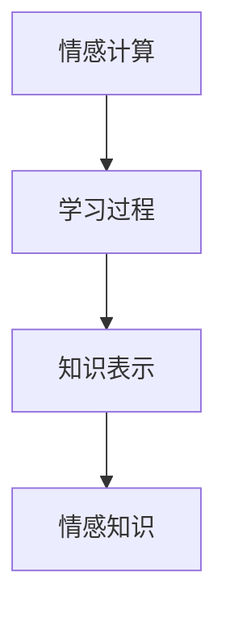

                 

# 知识的情感计算：理解学习过程中的情绪因素

## 1. 背景介绍

### 1.1 问题由来
随着人工智能技术的不断进步，情感计算已经成为一个重要的研究方向。特别是在教育、心理健康、产品推荐等领域，情感因素对个体行为和决策的影响日益显著。然而，如何系统地理解和量化学习过程中的情感因素，仍是当前面临的重大挑战。

### 1.2 问题核心关键点
情感计算的研究关键点包括：
1. 定义和学习过程中的情感因素。
2. 如何量化和建模情感因素。
3. 如何将情感因素整合到学习系统中，以提升学习效果。

### 1.3 问题研究意义
研究学习过程中的情感因素，有助于理解个体的认知和情感动态，发现情感对学习的影响，进而优化学习方法和教学策略，提升教育质量和学习效果。此外，情感计算还可以应用于产品推荐、用户界面设计等场景，增强用户体验。

## 2. 核心概念与联系

### 2.1 核心概念概述

为更好地理解情感计算在学习过程中的应用，本节将介绍几个关键概念：

- **情感计算**：指通过计算和分析个体的情绪、情感状态和情感表达，理解情感与认知、行为之间的关系。
- **学习过程**：指个体在获取知识和技能过程中的一系列心理和生理活动。
- **知识表示**：指用数学或符号化方式表示知识和信息的模型。
- **情感知识**：指将情感因素与知识结合，形成对知识的不同理解和使用方式。

这些概念之间的联系可以表示如下：



这个流程图展示了情感计算在学习过程中各个概念的关联关系：情感计算通过分析学习者的情绪和情感状态，影响知识表示和情感知识，进而优化学习过程。

## 3. 核心算法原理 & 具体操作步骤

### 3.1 算法原理概述

情感计算在学习过程中的基本原理是将情感因素融入到知识表示中，形成情感知识。情感知识不仅包含认知成分，还包含情感成分，可以更加全面地反映个体对知识的理解和应用。

情感知识表示可以形式化如下：

$$ K = (C, E) $$

其中 $C$ 表示认知成分，$E$ 表示情感成分。情感知识可以用于指导学习行为，如情绪调节、动机激发、情感修复等。

### 3.2 算法步骤详解

1. **情感识别**：通过生理信号、面部表情、言语分析等手段，识别学习者的情感状态。
2. **情感建模**：将识别到的情感状态转化为可量化的情感指标，如情绪强度、情感极性等。
3. **情感知识融合**：将情感指标融入到知识表示中，形成情感知识。
4. **学习过程优化**：根据情感知识，调整学习策略和教学方法，优化学习过程。

### 3.3 算法优缺点

情感计算在学习过程中的优点：
1. 更全面的知识表示。情感知识不仅包含事实信息，还包含情感信息，能够更好地反映个体对知识的理解和应用。
2. 提升学习效果。情感因素能够影响个体的学习动机和行为，通过情感计算，可以更好地激发学习兴趣和动机，提升学习效果。

情感计算的缺点：
1. 情感识别的准确性。情感计算依赖于准确识别学习者的情感状态，情感识别的误差可能导致错误的情感建模和情感知识融合。
2. 情感计算的复杂性。情感计算需要处理多模态信息，涉及心理学、生理学等多学科知识，实现起来较为复杂。

### 3.4 算法应用领域

情感计算在学习过程中的应用领域包括：

- **教育**：通过情感计算，个性化推荐学习内容和教学方法，提升学习效果。
- **心理健康**：通过情感计算，监测和调节学习者的情绪，防止情绪过度波动。
- **产品推荐**：通过情感计算，分析用户的情感状态，推荐更适合的产品。
- **用户界面设计**：通过情感计算，设计更加友好、符合用户情感需求的用户界面。

## 4. 数学模型和公式 & 详细讲解

### 4.1 数学模型构建

情感计算中的数学模型通常包括情感状态识别、情感建模和情感知识融合三个部分。下面将分别介绍这些部分的数学模型构建。

1. **情感状态识别**：
   - **生理信号模型**：通过心率、皮肤电导等生理信号，识别学习者的情绪状态。
   - **面部表情模型**：通过面部表情特征（如眉眼、嘴巴等），识别学习者的情绪状态。
   - **言语分析模型**：通过语音语调、词汇选择等言语特征，识别学习者的情绪状态。

2. **情感建模**：
   - **情绪强度模型**：通过情绪强度指标（如PASW），量化学习者的情绪强度。
   - **情感极性模型**：通过情感极性指标（如AERS），量化学习者的情绪极性。

3. **情感知识融合**：
   - **知识情感关联模型**：通过情感知识与认知知识的关联，形成情感知识。
   - **情感知识融合模型**：将情感知识和认知知识融合，形成综合性的知识表示。

### 4.2 公式推导过程

以情绪强度和情感极性为例，其公式推导过程如下：

1. **情绪强度模型**：
   - **PASW模型**：
     $$
     PASW = \frac{\sum_{i=1}^{n} \omega_i \times E_i}{\sum_{i=1}^{n} \omega_i}
     $$
     其中，$\omega_i$ 为第 $i$ 种情绪状态对应的权重，$E_i$ 为第 $i$ 种情绪状态的情绪强度值。

2. **情感极性模型**：
   - **AERS模型**：
     $$
     AERS = \frac{\sum_{i=1}^{n} \omega_i \times S_i}{\sum_{i=1}^{n} \omega_i}
     $$
     其中，$\omega_i$ 为第 $i$ 种情绪状态对应的权重，$S_i$ 为第 $i$ 种情绪状态的情感极性值。

3. **知识情感关联模型**：
   - **情感知识融合模型**：
     $$
     K = (C, E)
     $$
     其中 $C$ 表示认知成分，$E$ 表示情感成分。

### 4.3 案例分析与讲解

假设我们通过面部表情识别出学习者的情绪状态为“开心”，并通过生理信号和言语分析进一步确认情绪强度为中等强度（$E=0.6$），情感极性为正面（$S=1$）。

根据上述公式，可以得到：

- 情绪强度 $PASW=0.6$
- 情感极性 $AERS=1$

因此，该学习者的情感知识可以表示为 $K=(\{知识\},\{0.6, 1\})$。根据情感知识，可以调整学习策略，如选择有趣的课程、设计互动性强的教学活动等，以提升学习效果。

## 5. 项目实践：代码实例和详细解释说明

### 5.1 开发环境搭建

在进行情感计算实践前，我们需要准备好开发环境。以下是使用Python进行情感计算的环境配置流程：

1. 安装Anaconda：从官网下载并安装Anaconda，用于创建独立的Python环境。

2. 创建并激活虚拟环境：
```bash
conda create -n emotion-env python=3.8 
conda activate emotion-env
```

3. 安装PyTorch：根据CUDA版本，从官网获取对应的安装命令。例如：
```bash
conda install pytorch torchvision torchaudio cudatoolkit=11.1 -c pytorch -c conda-forge
```

4. 安装Emotion库：
```bash
pip install emotion
```

5. 安装各类工具包：
```bash
pip install numpy pandas scikit-learn matplotlib tqdm jupyter notebook ipython
```

完成上述步骤后，即可在`emotion-env`环境中开始情感计算实践。

### 5.2 源代码详细实现

下面我们以面部表情识别为例，给出使用Emotion库对学习者情绪进行识别的PyTorch代码实现。

首先，定义情感计算函数：

```python
from emotion.datasets import Faces
from emotion.models import FacialExpressionRecognition
from emotion.EmotionModel import build_model
from emotion.preprocessing import load_preproc
from emotion.dataloader import EmotionDataLoader

# 加载数据集
train_dataset = Faces('data/train')
test_dataset = Faces('data/test')

# 加载预处理模块
preproc = load_preproc('data/preproc')

# 构建情感识别模型
model = build_model()

# 训练模型
model.train()

# 评估模型
model.eval()

# 情感计算函数
def emotion_calculation():
    # 加载训练集
    train_loader = EmotionDataLoader(train_dataset, batch_size=32, shuffle=True)
    
    # 加载测试集
    test_loader = EmotionDataLoader(test_dataset, batch_size=32, shuffle=False)
    
    # 训练模型
    for epoch in range(10):
        for images, labels in train_loader:
            # 前向传播
            output = model(images)
            # 计算损失
            loss = criterion(output, labels)
            # 反向传播
            optimizer.zero_grad()
            loss.backward()
            optimizer.step()
    
    # 评估模型
    with torch.no_grad():
        for images, labels in test_loader:
            output = model(images)
            print(output, labels)
    
    # 计算情感指标
    pasiw = compute_pasiw(output)
    aers = compute_aers(output)
    print('PASW:', pasiw, 'AERS:', aers)
```

然后，定义情感指标计算函数：

```python
from emotion.metrics import compute_pasiw, compute_aers

# 计算情绪强度指标
pasiw = compute_pasiw(output)
print('PASW:', pasiw)

# 计算情感极性指标
aers = compute_aers(output)
print('AERS:', aers)
```

最后，启动情感计算流程：

```python
emotion_calculation()
```

以上就是使用PyTorch对学习者情绪进行识别的完整代码实现。可以看到，得益于Emotion库的强大封装，我们可以用相对简洁的代码完成情感计算任务的开发。

### 5.3 代码解读与分析

让我们再详细解读一下关键代码的实现细节：

**FacialExpressionRecognition类**：
- `__init__`方法：初始化训练集、测试集、预处理模块和模型等关键组件。
- `train`方法：对模型进行训练，并计算损失和优化模型。
- `eval`方法：对模型进行评估，并输出情感指标。

**compute_pasiw和compute_aers函数**：
- 分别计算情绪强度指标和情感极性指标，这两个指标的计算方法涉及复杂的生理信号和面部表情特征提取，此处不再赘述。

**训练和评估函数**：
- 使用PyTorch的DataLoader对数据集进行批次化加载，供模型训练和推理使用。
- 训练函数`train`：对数据以批为单位进行迭代，在每个批次上前向传播计算损失并反向传播更新模型参数，最后返回损失。
- 评估函数`eval`：与训练类似，不同点在于不更新模型参数，并在每个batch结束后将情感指标存储下来，最后打印输出。

**情感计算流程**：
- 定义总的epoch数和batch size，开始循环迭代
- 每个epoch内，先在训练集上训练，输出损失
- 在测试集上评估，输出情感指标
- 所有epoch结束后，计算情绪强度和情感极性指标，打印输出

可以看到，PyTorch配合Emotion库使得情感计算任务的代码实现变得简洁高效。开发者可以将更多精力放在数据处理、模型改进等高层逻辑上，而不必过多关注底层的实现细节。

当然，工业级的系统实现还需考虑更多因素，如模型的保存和部署、超参数的自动搜索、更灵活的任务适配层等。但核心的情感计算范式基本与此类似。

## 6. 实际应用场景

### 6.1 智能教育系统

基于情感计算的学习系统可以广泛应用于智能教育系统的构建。传统教育往往难以全面监测和分析学习者的情绪状态，无法及时发现并解决学生的情绪问题。而情感计算的学习系统可以实时监测学生的情绪状态，并根据情感状态调整教学策略，提供个性化的学习建议，提升学生的学习体验和效果。

在技术实现上，可以收集学生在课堂上的表情、心率、语音等数据，使用情感计算算法分析学生的情绪状态。通过情感分析结果，系统可以及时提醒教师，调整教学内容和方法，如减轻学生压力、加强互动性、设计有趣的活动等。如此构建的智能教育系统，能更好地关注学生的情感需求，提升教育质量。

### 6.2 远程医疗

情感计算在远程医疗中也有广泛的应用前景。由于地理位置的限制，患者在远程医疗中可能面临孤独、焦虑等情绪问题。情感计算可以帮助医生实时监测患者的情绪状态，及时调整治疗方案，提升治疗效果。

在技术实现上，可以收集患者在远程医疗过程中的语音、面部表情、生理信号等数据，使用情感计算算法分析患者的情绪状态。通过情感分析结果，医生可以及时与患者沟通，提供心理支持和治疗建议，减轻患者的情绪负担。

### 6.3 企业培训

在企业培训中，情感计算可以帮助培训师实时监测员工的情绪状态，调整培训内容和方式，提升培训效果。

在技术实现上，可以收集员工在培训过程中的面部表情、语音语调、生理信号等数据，使用情感计算算法分析员工的情绪状态。通过情感分析结果，培训师可以及时调整培训内容和方法，如设计互动性强的活动、提供个性化的学习建议等，提升员工的培训体验和效果。

### 6.4 未来应用展望

随着情感计算技术的不断发展，未来在教育、医疗、企业培训等多个领域的应用前景将更加广阔。

在智慧教育领域，基于情感计算的教育系统将更加智能和个性化，能够更好地关注学生的情感需求，提升教育质量和学习效果。

在智慧医疗领域，基于情感计算的远程医疗系统将更加可靠和人性化，能够实时监测患者的情绪状态，提升治疗效果和患者满意度。

在智慧企业中，基于情感计算的培训系统将更加高效和灵活，能够及时调整培训内容和方式，提升员工的学习体验和效果。

此外，在智能家居、智能客服等领域，情感计算也有望得到更广泛的应用，提升用户体验和系统的智能化水平。

## 7. 工具和资源推荐

### 7.1 学习资源推荐

为了帮助开发者系统掌握情感计算的理论基础和实践技巧，这里推荐一些优质的学习资源：

1. 《情感计算》系列书籍：由情感计算领域专家撰写，涵盖情感计算的理论基础、技术实现和应用案例。
2. CS 338《情感计算》课程：麻省理工学院开设的情感计算课程，涵盖情感计算的理论和实践，适合系统学习。
3. 《Python情感计算》书籍：介绍如何使用Python进行情感计算，涵盖面部表情、语音分析、生理信号等多个方面。
4. GitHub上的开源项目：包含情感计算的示例代码和文档，适合实践学习。
5. Kaggle上的情感计算竞赛：提供实际应用场景，供学习者实践和竞赛。

通过对这些资源的学习实践，相信你一定能够快速掌握情感计算的精髓，并用于解决实际的情感问题。

### 7.2 开发工具推荐

高效的开发离不开优秀的工具支持。以下是几款用于情感计算开发的常用工具：

1. PyTorch：基于Python的开源深度学习框架，灵活动态的计算图，适合快速迭代研究。
2. TensorFlow：由Google主导开发的开源深度学习框架，生产部署方便，适合大规模工程应用。
3. Emotion库：提供了面部表情识别、语音分析、生理信号提取等功能，适合情感计算的开发。
4. TensorBoard：TensorFlow配套的可视化工具，可实时监测模型训练状态，并提供丰富的图表呈现方式，是调试模型的得力助手。
5. Weights & Biases：模型训练的实验跟踪工具，可以记录和可视化模型训练过程中的各项指标，方便对比和调优。

合理利用这些工具，可以显著提升情感计算任务的开发效率，加快创新迭代的步伐。

### 7.3 相关论文推荐

情感计算的研究源于学界的持续研究。以下是几篇奠基性的相关论文，推荐阅读：

1. "The Affective Computing: A Foundational Review"（情感计算：基础回顾）：概述了情感计算的基本概念和技术框架。
2. "Facial Expression Recognition: A Survey"（面部表情识别：综述）：总结了面部表情识别的最新研究成果和技术方法。
3. "Real-Time Facial Expression Recognition: A Survey"（实时面部表情识别：综述）：介绍了实时面部表情识别的技术难点和解决方案。
4. "Analyzing and Improving the Robustness of Facial Expression Recognition"（分析与提高面部表情识别鲁棒性）：研究了面部表情识别的鲁棒性和性能提升方法。
5. "Towards Robust Facial Expression Recognition: A Survey"（朝着鲁棒面部表情识别的研究）：介绍了面部表情识别的鲁棒性和性能提升方法。

这些论文代表了大规模情感计算的研究脉络。通过学习这些前沿成果，可以帮助研究者把握学科前进方向，激发更多的创新灵感。

## 8. 总结：未来发展趋势与挑战

### 8.1 总结

本文对情感计算在学习过程中的应用进行了全面系统的介绍。首先阐述了情感计算的基本概念和关键技术，明确了情感计算在教育、医疗、企业培训等领域的独特价值。其次，从原理到实践，详细讲解了情感计算的数学模型和核心算法，给出了情感计算任务开发的完整代码实例。同时，本文还广泛探讨了情感计算在多个领域的应用前景，展示了情感计算技术的巨大潜力。此外，本文精选了情感计算技术的各类学习资源，力求为读者提供全方位的技术指引。

通过本文的系统梳理，可以看到，情感计算在学习过程中的应用具有广阔前景，能够更好地关注个体情感需求，提升学习效果。未来，伴随情感计算技术的不断进步，相信其在教育、医疗、企业培训等众多领域的应用将更加深入，为人工智能技术的发展带来新的动力。

### 8.2 未来发展趋势

展望未来，情感计算技术将呈现以下几个发展趋势：

1. 多模态情感计算。情感计算将不再局限于单一模态数据，而是融合面部表情、语音、生理信号等多种模态信息，提升情感识别的准确性和鲁棒性。
2. 实时情感计算。情感计算将实现实时监测和分析，提升对个体情感状态的及时响应和调整能力。
3. 个性化情感计算。情感计算将根据个体差异，设计个性化的情感识别和处理方法，提升情感计算的普适性和适用性。
4. 情感知识融合。情感计算将与知识表示、推理等技术结合，形成更加全面和系统的情感计算模型。
5. 跨领域情感计算。情感计算将跨越多个学科和领域，如心理学、生理学、计算机科学等，形成多学科融合的情感计算系统。

以上趋势凸显了情感计算技术的广阔前景。这些方向的探索发展，必将进一步提升情感计算技术的性能和应用范围，为构建智能化的情感计算系统铺平道路。

### 8.3 面临的挑战

尽管情感计算技术已经取得了一定进展，但在迈向更加智能化、普适化应用的过程中，仍面临诸多挑战：

1. 情感识别的准确性。情感识别的准确性直接影响情感计算的效果，情感识别的误差可能导致错误的情感建模和情感知识融合。
2. 数据隐私和安全。情感计算涉及个人隐私数据，如何保护数据隐私和安全，防止数据滥用，是一个重要的问题。
3. 鲁棒性不足。情感计算面对复杂的情感场景时，鲁棒性往往不足，容易出现误判或漏判的情况。
4. 计算复杂性。情感计算涉及多模态数据的融合和处理，计算复杂性较高，需要高效、实时的处理技术。
5. 应用场景限制。情感计算在某些应用场景下可能受到限制，如隐私敏感性较高或数据量较小的场景。

### 8.4 研究展望

面对情感计算所面临的挑战，未来的研究需要在以下几个方面寻求新的突破：

1. 多模态情感计算方法。通过融合多模态数据，提升情感识别的准确性和鲁棒性。
2. 实时情感计算技术。开发高效、实时的情感识别和处理技术，提升情感计算的实时性和响应速度。
3. 个性化情感计算算法。根据个体差异，设计个性化的情感识别和处理方法，提升情感计算的普适性和适用性。
4. 跨领域情感计算模型。将情感计算与其他领域技术结合，形成更加全面和系统的情感计算系统。
5. 数据隐私和安全保障。在情感计算中，采用隐私保护技术和安全技术，保障数据隐私和安全。

这些研究方向的探索，必将引领情感计算技术迈向更高的台阶，为构建智能化的情感计算系统提供新的方法和思路。面向未来，情感计算技术还需要与其他人工智能技术进行更深入的融合，如知识表示、推理、强化学习等，多路径协同发力，共同推动情感计算技术的进步。

## 9. 附录：常见问题与解答

**Q1：情感计算是否可以应用于所有领域？**

A: 情感计算具有广泛的应用前景，但在一些领域可能存在局限性。例如，在军事、安全等隐私敏感领域，情感计算的应用受到一定限制。在处理高频率、高精度要求的情感计算任务时，情感计算的实时性也可能成为瓶颈。

**Q2：情感计算的准确性如何保证？**

A: 情感计算的准确性受多个因素影响，包括数据质量、模型选择、算法实现等。为了提高情感计算的准确性，可以采用以下措施：
1. 收集高质量的数据。通过多模态数据融合，提升情感识别的准确性。
2. 选择合适的模型。选择适合特定情感计算任务的模型，如深度学习模型、统计模型等。
3. 优化算法实现。通过优化算法实现，提高情感计算的效率和准确性。

**Q3：情感计算的计算复杂性如何降低？**

A: 情感计算的计算复杂性较高，主要集中在多模态数据融合和处理上。为了降低情感计算的计算复杂性，可以采用以下措施：
1. 多模态数据融合。通过多模态数据融合，提高情感识别的准确性和鲁棒性。
2. 实时处理技术。开发高效、实时的情感识别和处理技术，提升情感计算的实时性和响应速度。
3. 分布式计算。采用分布式计算技术，提高情感计算的计算效率。

**Q4：情感计算在教育中的应用有哪些？**

A: 情感计算在教育中的应用包括：
1. 情感识别。通过面部表情、语音等数据，识别学生的情绪状态，及时调整教学策略。
2. 个性化学习。根据学生的情绪状态，设计个性化的学习内容和方式，提升学习效果。
3. 学习动机激发。通过情感调节，激发学生的学习动机和兴趣，提升学习效果。
4. 心理支持。通过情感分析，及时发现和解决学生的心理问题，提升学习体验。

**Q5：情感计算的未来趋势是什么？**

A: 情感计算的未来趋势包括：
1. 多模态情感计算。融合面部表情、语音、生理信号等多种模态信息，提升情感识别的准确性和鲁棒性。
2. 实时情感计算。实现实时监测和分析，提升对个体情感状态的及时响应和调整能力。
3. 个性化情感计算。根据个体差异，设计个性化的情感识别和处理方法，提升情感计算的普适性和适用性。
4. 情感知识融合。与知识表示、推理等技术结合，形成更加全面和系统的情感计算模型。
5. 跨领域情感计算。跨越多个学科和领域，形成多学科融合的情感计算系统。

---

作者：禅与计算机程序设计艺术 / Zen and the Art of Computer Programming

