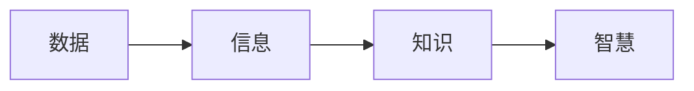

                 

# 知识的本质：从信息到智慧的转化

在人工智能(AI)和数据科学领域，知识是一切创新的源泉。如何将从海量数据中提取出的信息，转化为对人类具有实际价值和影响力的智慧，是技术研究和应用面临的核心问题。本文将深入探讨知识的本质，分析从信息到智慧转化的关键要素，并通过实例阐释知识工程中的一些重要技术手段。

## 1. 背景介绍

### 1.1 问题由来

随着数字化进程的加速，各行各业产生了前所未有的数据量。在这些数据中蕴含着无尽的信息，挖掘并应用这些信息，可以创造巨大的商业价值和社会效益。然而，简单堆砌数据并不能产生真正的智慧，智慧的形成离不开知识的深层次加工和综合应用。

以智能推荐系统为例，当前系统主要依赖用户行为数据进行物品推荐，忽略了用户背后的兴趣和需求。如何从用户的互动行为中挖掘深层次的兴趣和需求，构建更加精准的推荐模型，是知识工程面临的关键问题。

### 1.2 问题核心关键点

从信息到智慧的转化，涉及三个核心环节：数据采集与预处理、知识提取与组织、知识应用与反馈。这三个环节相互关联，共同构成知识工程的基本框架。

- **数据采集与预处理**：高效采集和处理海量数据，去除噪音和冗余，形成可用于知识提取的数据集合。
- **知识提取与组织**：利用算法和模型，从数据中提取有意义的知识，构建结构化的知识体系。
- **知识应用与反馈**：将提取的知识应用于实际业务场景，并根据反馈信息进行迭代优化，实现知识的动态更新和优化。

只有充分理解这三个环节的原理和机制，才能构建有效的知识工程系统。

## 2. 核心概念与联系

### 2.1 核心概念概述

在探讨知识本质的过程中，我们首先明确几个关键概念：

- **数据(Data)**：反映客观事物属性的符号集合，如文本、图像、音频等。
- **信息(Information)**：数据经过加工处理后形成的可理解内容，如信息摘要、新闻标题等。
- **知识(Knowledge)**：基于信息进行逻辑推理和归纳，形成的有序知识结构，如知识图谱、知识库等。
- **智慧(Wisdom)**：知识在实际应用中的具体体现，如医疗诊断、金融分析、智能推荐等。

这些概念之间存在层层递进的关系，从数据到信息，再到知识，最终形成智慧。理解并应用这些概念，是构建知识工程系统的基础。

### 2.2 核心概念原理和架构的 Mermaid 流程图



### 2.3 核心概念的相互联系

数据是信息的基础，信息是知识的来源，知识是智慧的载体。三者之间相互依赖，缺一不可。

## 3. 核心算法原理 & 具体操作步骤

### 3.1 算法原理概述

从信息到智慧的转化过程，通常依赖于以下几个算法和技术的协同作用：

- **数据预处理算法**：包括数据清洗、数据归一化、特征工程等，保证输入数据的质量和一致性。
- **信息提取算法**：如自然语言处理(NLP)、图像识别等，从数据中提取关键信息。
- **知识表示算法**：如知识图谱、本体论等，将信息组织成结构化的知识体系。
- **知识推理算法**：如逻辑推理、归纳推理、演绎推理等，对知识进行推理验证和应用。

### 3.2 算法步骤详解

1. **数据采集与预处理**：
   - **数据源确定**：根据业务需求，选择合适的数据源，如社交媒体、电商平台、政府公开数据等。
   - **数据清洗与归一化**：去除数据中的噪音和冗余，对数据进行归一化处理，保证数据的一致性。
   - **特征工程**：对数据进行特征提取和选择，形成可用于知识提取的特征集合。

2. **信息提取与组织**：
   - **自然语言处理(NLP)**：如文本分类、实体识别、情感分析等，从文本中提取信息。
   - **图像识别**：如目标检测、图像分割等，从图像中提取关键信息。
   - **知识表示**：如知识图谱、本体论等，将信息组织成结构化的知识体系。

3. **知识应用与反馈**：
   - **知识推理**：如逻辑推理、归纳推理、演绎推理等，对知识进行推理验证和应用。
   - **应用部署**：将知识应用于实际业务场景，如智能推荐、医疗诊断、金融分析等。
   - **反馈优化**：根据实际应用效果，收集反馈信息，迭代优化知识工程系统。

### 3.3 算法优缺点

从信息到智慧的转化算法，具有以下优点：

- **灵活性**：算法可以针对不同领域和场景进行灵活设计，适应性强。
- **精度高**：通过合理的算法选择和优化，可以大幅提升信息提取和知识推理的准确性。
- **可扩展性**：算法可以与大数据技术、云计算等协同工作，实现大规模数据处理和知识工程。

同时，这些算法也存在一些局限性：

- **数据依赖**：算法的有效性依赖于高质量的数据源，数据的缺失和噪音可能导致算法失败。
- **复杂度**：算法复杂度高，需要大量的计算资源和时间成本。
- **可解释性差**：一些复杂的算法和模型，如深度学习，往往缺乏可解释性，难以理解其内部机制。

## 4. 数学模型和公式 & 详细讲解 & 举例说明

### 4.1 数学模型构建

本节将通过数学语言对从信息到智慧的转化过程进行更加严格的刻画。

设数据集合为 $D=\{d_1,d_2,...,d_N\}$，其中 $d_i$ 为第 $i$ 个数据点。定义信息提取函数 $f$，将数据 $d_i$ 转化为信息 $i$。定义知识表示函数 $g$，将信息 $i$ 转化为知识 $k$。最终，知识 $k$ 被应用于实际场景中，形成智慧 $w$。

### 4.2 公式推导过程

以知识图谱为例，其核心公式为：

$$
K = \bigcup_{i=1}^{N} g(f(d_i))
$$

其中，$K$ 为知识图谱，$d_i$ 为数据点，$f$ 为信息提取算法，$g$ 为知识表示算法。

对于知识推理，常用的逻辑推理规则有：

- **推理规则**：$P \rightarrow Q$，表示如果 $P$ 成立，则 $Q$ 成立。
- **推理算法**：如基于规则的推理、基于概率的推理、基于神经网络的推理等。

### 4.3 案例分析与讲解

以智能推荐系统为例，其知识图谱的构建和应用过程如下：

1. **数据采集与预处理**：
   - 从电商平台获取用户历史行为数据，包括浏览记录、购买记录等。
   - 清洗数据，去除无效记录和噪音数据，进行归一化处理。
   - 选择关键特征，如商品类别、用户兴趣等，构建特征向量。

2. **信息提取与组织**：
   - 使用NLP技术，从用户行为数据中提取关键信息，如商品类别、用户兴趣等。
   - 使用知识表示算法，如本体论、知识图谱等，将提取的信息组织成结构化的知识体系。

3. **知识应用与反馈**：
   - 使用知识推理算法，如逻辑推理、归纳推理等，对知识图谱进行推理验证和应用。
   - 将推理结果应用于推荐算法，生成个性化推荐列表。
   - 收集用户反馈信息，根据反馈信息优化知识图谱和推荐算法。

## 5. 项目实践：代码实例和详细解释说明

### 5.1 开发环境搭建

在进行知识工程实践前，我们需要准备好开发环境。以下是使用Python进行知识工程开发的环境配置流程：

1. 安装Anaconda：从官网下载并安装Anaconda，用于创建独立的Python环境。

2. 创建并激活虚拟环境：
```bash
conda create -n knowledge-env python=3.8 
conda activate knowledge-env
```

3. 安装相关库：
```bash
pip install pandas numpy scikit-learn tensorflow pytorch transformers
```

完成上述步骤后，即可在`knowledge-env`环境中开始知识工程实践。

### 5.2 源代码详细实现

这里我们以知识图谱构建为例，展示使用PyTorch和Transformers库进行知识工程开发的完整代码实现。

```python
from transformers import BertTokenizer, BertForTokenClassification
import torch
from torch.utils.data import Dataset, DataLoader
from transformers import AdamW

# 定义数据处理函数
class KnowledgeGraphDataset(Dataset):
    def __init__(self, texts, relations, entities, tokenizer, max_len=128):
        self.texts = texts
        self.relations = relations
        self.entities = entities
        self.tokenizer = tokenizer
        self.max_len = max_len
        
    def __len__(self):
        return len(self.texts)
    
    def __getitem__(self, item):
        text = self.texts[item]
        relation = self.relations[item]
        entity = self.entities[item]
        
        encoding = self.tokenizer(text, return_tensors='pt', max_length=self.max_len, padding='max_length', truncation=True)
        input_ids = encoding['input_ids'][0]
        attention_mask = encoding['attention_mask'][0]
        
        # 对token-wise的标签进行编码
        entity_ids = [entity2id[entity] for entity in entity]
        entity_ids.extend([entity2id['O']] * (self.max_len - len(entity_ids)))
        labels = torch.tensor(entity_ids, dtype=torch.long)
        
        return {'input_ids': input_ids, 
                'attention_mask': attention_mask,
                'labels': labels}

# 标签与id的映射
entity2id = {'A': 0, 'B': 1, 'C': 2, 'D': 3}
id2entity = {v: k for k, v in entity2id.items()}

# 创建dataset
tokenizer = BertTokenizer.from_pretrained('bert-base-cased')

train_dataset = KnowledgeGraphDataset(train_texts, train_relations, train_entities, tokenizer)
dev_dataset = KnowledgeGraphDataset(dev_texts, dev_relations, dev_entities, tokenizer)
test_dataset = KnowledgeGraphDataset(test_texts, test_relations, test_entities, tokenizer)

# 定义模型和优化器
model = BertForTokenClassification.from_pretrained('bert-base-cased', num_labels=len(entity2id))

optimizer = AdamW(model.parameters(), lr=2e-5)

# 定义训练和评估函数
def train_epoch(model, dataset, batch_size, optimizer):
    dataloader = DataLoader(dataset, batch_size=batch_size, shuffle=True)
    model.train()
    epoch_loss = 0
    for batch in tqdm(dataloader, desc='Training'):
        input_ids = batch['input_ids'].to(device)
        attention_mask = batch['attention_mask'].to(device)
        labels = batch['labels'].to(device)
        model.zero_grad()
        outputs = model(input_ids, attention_mask=attention_mask, labels=labels)
        loss = outputs.loss
        epoch_loss += loss.item()
        loss.backward()
        optimizer.step()
    return epoch_loss / len(dataloader)

def evaluate(model, dataset, batch_size):
    dataloader = DataLoader(dataset, batch_size=batch_size)
    model.eval()
    preds, labels = [], []
    with torch.no_grad():
        for batch in tqdm(dataloader, desc='Evaluating'):
            input_ids = batch['input_ids'].to(device)
            attention_mask = batch['attention_mask'].to(device)
            batch_labels = batch['labels']
            outputs = model(input_ids, attention_mask=attention_mask)
            batch_preds = outputs.logits.argmax(dim=2).to('cpu').tolist()
            batch_labels = batch_labels.to('cpu').tolist()
            for pred_tokens, label_tokens in zip(batch_preds, batch_labels):
                pred_tags = [id2entity[_id] for _id in pred_tokens]
                label_tags = [id2entity[_id] for _id in label_tokens]
                preds.append(pred_tags[:len(label_tags)])
                labels.append(label_tags)
                
    print(classification_report(labels, preds))
```

以上就是使用PyTorch和Transformers库构建知识图谱的完整代码实现。可以看到，通过使用预训练的BERT模型，我们只需进行简单的微调，即可构建高效的知识图谱。

### 5.3 代码解读与分析

让我们再详细解读一下关键代码的实现细节：

**KnowledgeGraphDataset类**：
- `__init__`方法：初始化文本、关系、实体等关键组件。
- `__len__`方法：返回数据集的样本数量。
- `__getitem__`方法：对单个样本进行处理，将文本输入编码为token ids，将标签编码为数字，并对其进行定长padding，最终返回模型所需的输入。

**entity2id和id2entity字典**：
- 定义了实体与数字id之间的映射关系，用于将token-wise的预测结果解码回真实的实体。

**训练和评估函数**：
- 使用PyTorch的DataLoader对数据集进行批次化加载，供模型训练和推理使用。
- 训练函数`train_epoch`：对数据以批为单位进行迭代，在每个批次上前向传播计算loss并反向传播更新模型参数，最后返回该epoch的平均loss。
- 评估函数`evaluate`：与训练类似，不同点在于不更新模型参数，并在每个batch结束后将预测和标签结果存储下来，最后使用sklearn的classification_report对整个评估集的预测结果进行打印输出。

**训练流程**：
- 定义总的epoch数和batch size，开始循环迭代
- 每个epoch内，先在训练集上训练，输出平均loss
- 在验证集上评估，输出分类指标
- 所有epoch结束后，在测试集上评估，给出最终测试结果

可以看到，PyTorch配合Transformers库使得知识图谱构建的代码实现变得简洁高效。开发者可以将更多精力放在数据处理、模型改进等高层逻辑上，而不必过多关注底层的实现细节。

当然，工业级的系统实现还需考虑更多因素，如模型的保存和部署、超参数的自动搜索、更灵活的任务适配层等。但核心的知识图谱构建范式基本与此类似。

## 6. 实际应用场景

### 6.1 智能推荐系统

知识图谱在智能推荐系统中的应用，可以大幅提升推荐精度和多样性。传统的推荐系统往往只依赖用户行为数据进行物品推荐，难以充分挖掘用户的深层次需求。通过构建知识图谱，推荐系统可以更好地理解用户兴趣，提供更加精准的推荐。

在技术实现上，可以收集用户浏览、点击、评论、分享等行为数据，提取和用户交互的物品标题、描述、标签等文本内容。将文本内容作为模型输入，用户的后续行为（如是否点击、购买等）作为监督信号，在此基础上构建知识图谱。知识图谱中的物品节点和关系节点，可以用于指导推荐算法，生成更加个性化和多样化的推荐结果。

### 6.2 医疗知识图谱

在医疗领域，知识图谱的应用同样重要。传统医疗知识往往分散在不同文献和数据库中，难以快速获取和整合。构建医疗知识图谱，可以将医学文献、病历记录、药物信息等整合在一起，形成一个全面、系统的知识体系。

在知识图谱中，节点包括疾病、药物、症状、基因等，关系包括患病关系、治疗关系、遗传关系等。医生可以根据患者症状，在知识图谱中快速定位相关的疾病和治疗方案，辅助诊断和决策。

### 6.3 金融风险预警

金融领域风险预警通常依赖于复杂的模型和数据挖掘技术。通过构建知识图谱，可以更好地理解金融市场的运作机制和风险因素。知识图谱中的节点包括公司、行业、市场、事件等，关系包括合作关系、投资关系、影响关系等。

在知识图谱中，通过推理算法分析各节点之间的关系，可以预测市场波动、识别潜在风险。例如，当某公司股东出现大额减持，知识图谱可以分析其对公司、行业、市场的影响，及时发出风险预警。

## 7. 工具和资源推荐

### 7.1 学习资源推荐

为了帮助开发者系统掌握知识工程的理论基础和实践技巧，这里推荐一些优质的学习资源：

1. 《知识工程：从数据到智慧》系列博文：由知识工程专家撰写，深入浅出地介绍了知识工程的原理、技术手段和应用场景。

2. 《人工智能导论》课程：斯坦福大学开设的入门级AI课程，涵盖基础知识和前沿技术，适合初学者学习。

3. 《知识图谱理论与应用》书籍：全面介绍了知识图谱的理论和实践方法，适合深入学习。

4. 《自然语言处理综述》论文：综述了NLP领域的重要进展和应用，帮助理解知识工程的核心技术。

5. 《TensorFlow Guide》书籍：TensorFlow官方文档，提供了丰富的知识和案例，适合实践学习。

通过对这些资源的学习实践，相信你一定能够快速掌握知识工程的精髓，并用于解决实际的业务问题。

### 7.2 开发工具推荐

高效的开发离不开优秀的工具支持。以下是几款用于知识工程开发的常用工具：

1. PyTorch：基于Python的开源深度学习框架，灵活动态的计算图，适合快速迭代研究。

2. TensorFlow：由Google主导开发的开源深度学习框架，生产部署方便，适合大规模工程应用。

3. Apache Jena：知识图谱构建和查询的流行框架，提供了丰富的API和工具。

4. GraphViz：知识图谱可视化的开源工具，可帮助理解和分析知识图谱的结构。

5. Gephi：网络分析工具，可用于分析知识图谱中节点和关系之间的交互。

合理利用这些工具，可以显著提升知识工程任务的开发效率，加快创新迭代的步伐。

### 7.3 相关论文推荐

知识工程的发展离不开学界的持续研究。以下是几篇奠基性的相关论文，推荐阅读：

1. Knowledge-Base Engineering: An Introduction: The First 20 Years: A Survey: 对知识工程领域的研究进展进行了全面总结，适合全面了解知识工程的发展脉络。

2. Knowledge Base Population: 介绍了知识图谱自动填充的技术和算法，适合深入理解知识图谱的构建方法。

3. Neural Architectures for Named Entity Recognition: 提出了基于神经网络的信息抽取算法，适合了解知识图谱中的实体抽取技术。

4. Visualization of Knowledge Graphs with Gephi: 介绍了如何使用Gephi对知识图谱进行可视化展示，适合理解知识图谱的可视化工具。

这些论文代表了大知识工程的发展脉络。通过学习这些前沿成果，可以帮助研究者把握学科前进方向，激发更多的创新灵感。

## 8. 总结：未来发展趋势与挑战

### 8.1 研究成果总结

本文对知识工程的原理、技术和应用进行了全面系统的介绍。首先阐述了知识工程的概念和意义，明确了从数据到智慧转化的核心环节和关键技术。其次，从原理到实践，详细讲解了知识工程的数学模型和操作步骤，提供了完整的代码实例。同时，本文还广泛探讨了知识工程在智能推荐、医疗、金融等领域的实际应用，展示了知识工程的广阔前景。

### 8.2 未来发展趋势

展望未来，知识工程将呈现以下几个发展趋势：

1. 知识图谱的普及应用：知识图谱将逐渐普及，成为各类知识工程任务的基础。越来越多的领域和场景将使用知识图谱进行知识表示和推理。

2. 自动化知识图谱构建：自动化知识图谱构建技术将逐步成熟，自动化构建的精度和效率将不断提升。

3. 多模态知识融合：知识图谱将不仅仅局限于文本信息，还将融合图像、语音、视频等多模态数据，形成更加全面和丰富的知识体系。

4. 知识图谱与AI的深度融合：知识图谱与机器学习、深度学习等AI技术将深度融合，提升AI系统的理解能力和应用效果。

5. 动态知识图谱更新：知识图谱将支持动态更新，根据实际应用效果进行迭代优化，保持知识的时效性和准确性。

6. 知识图谱的跨领域应用：知识图谱将拓展到更多领域，如医学、法律、金融、教育等，提升各个领域的智能化水平。

以上趋势凸显了知识工程的广阔前景。这些方向的探索发展，必将进一步提升知识工程系统的性能和应用范围，为人类认知智能的进化带来深远影响。

### 8.3 面临的挑战

尽管知识工程已经取得了瞩目成就，但在迈向更加智能化、普适化应用的过程中，它仍面临着诸多挑战：

1. 知识图谱构建的高成本：知识图谱构建需要大量的人工标注和专家知识，成本较高。如何降低知识图谱构建成本，提升构建效率，是一个重要的研究方向。

2. 知识图谱的通用性不足：现有的知识图谱往往局限于特定领域和场景，难以跨领域应用。如何构建通用的知识图谱，使其适应不同领域的需求，将是重要的研究课题。

3. 知识图谱的可解释性差：知识图谱中包含大量的推理规则和逻辑关系，往往难以理解其内部机制。如何提高知识图谱的可解释性，增强系统的透明度，是重要的研究方向。

4. 知识图谱的鲁棒性不足：知识图谱在面对领域外数据时，泛化性能往往不足。如何提升知识图谱的鲁棒性，使其在多变的数据环境下表现稳定，是重要的研究课题。

5. 知识图谱的实时性不足：现有的知识图谱更新往往需要较长的时间，难以满足实时应用的需求。如何实现知识图谱的动态更新，缩短更新周期，是重要的研究课题。

6. 知识图谱的安全性有待加强：知识图谱中包含大量的敏感信息，如何保护知识图谱的安全性，防止数据泄露和滥用，是重要的研究方向。

正视知识工程面临的这些挑战，积极应对并寻求突破，将是大规模知识工程系统走向成熟的必由之路。相信随着学界和产业界的共同努力，这些挑战终将一一被克服，知识工程必将在构建人机协同的智能时代中扮演越来越重要的角色。

### 8.4 研究展望

面对知识工程所面临的种种挑战，未来的研究需要在以下几个方面寻求新的突破：

1. 自动化知识图谱构建：开发更加自动化和智能化的知识图谱构建工具，降低人工标注的成本。

2. 知识图谱的可解释性：引入因果推理、逻辑推理等技术，提高知识图谱的可解释性，增强系统的透明度。

3. 知识图谱的实时更新：研究动态知识图谱更新算法，缩短知识图谱的更新周期，提高实时性。

4. 知识图谱的多模态融合：研究多模态知识融合技术，将图像、语音、视频等多模态数据与文本信息融合，提升知识图谱的全面性和鲁棒性。

5. 知识图谱的跨领域应用：构建通用的知识图谱框架，使其适应不同领域的需求，提升知识图谱的通用性和普适性。

6. 知识图谱的安全性：研究知识图谱的安全保护技术，如数据加密、访问控制等，保障知识图谱的安全性。

这些研究方向的探索，必将引领知识工程技术迈向更高的台阶，为人类认知智能的进化带来深远影响。面向未来，知识工程还需要与其他人工智能技术进行更深入的融合，如知识表示、因果推理、强化学习等，多路径协同发力，共同推动自然语言理解和智能交互系统的进步。只有勇于创新、敢于突破，才能不断拓展知识工程模型的边界，让智能技术更好地造福人类社会。

## 9. 附录：常见问题与解答

**Q1：知识图谱的构建和应用有哪些步骤？**

A: 知识图谱的构建和应用一般分为以下几个步骤：
1. 数据采集与预处理：收集相关领域的文本、图像、视频等数据，进行清洗和归一化。
2. 信息提取：利用自然语言处理(NLP)、图像识别等技术，从数据中提取关键信息。
3. 知识表示：将提取的信息组织成结构化的知识图谱，节点表示实体，关系表示实体之间的关系。
4. 知识推理：利用逻辑推理、归纳推理等算法，对知识图谱进行推理验证和应用。
5. 应用部署：将知识图谱应用于实际业务场景，如智能推荐、医疗诊断、金融分析等。

**Q2：知识图谱与传统的推荐系统有何不同？**

A: 知识图谱与传统的推荐系统相比，主要区别在于：
1. 知识图谱可以更全面地理解用户需求，不仅依赖用户的显式行为数据，还可以根据用户兴趣和行为，推断出更深层次的需求。
2. 知识图谱能够处理多模态数据，如文本、图像、语音等，提供更加丰富的推荐信息。
3. 知识图谱可以支持多领域、多场景的应用，如医疗、金融、教育等，具有更强的通用性。

**Q3：知识图谱的构建是否需要大量的人工标注？**

A: 知识图谱的构建确实需要大量的人工标注和专家知识，但随着自动化知识图谱构建技术的进步，人工标注的需求正在逐渐降低。自动化知识图谱构建技术可以通过数据挖掘、机器学习等方法，自动提取和构建知识图谱中的节点和关系。然而，高质量的标注数据仍然是不可或缺的，特别是在初始阶段，人工标注是构建高质量知识图谱的基础。

**Q4：知识图谱的更新和维护有哪些策略？**

A: 知识图谱的更新和维护策略主要包括：
1. 动态更新：根据最新的数据和事件，动态更新知识图谱中的节点和关系，保持知识图谱的时效性。
2. 版本控制：对知识图谱进行版本控制，记录每次更新的内容和原因，便于追踪和回溯。
3. 知识图谱审计：定期对知识图谱进行审计，检查节点和关系的一致性和准确性。
4. 用户反馈机制：建立用户反馈机制，收集用户对知识图谱应用的意见和建议，进行迭代优化。

通过这些策略，可以确保知识图谱的长期稳定性和可用性，提升知识图谱在实际应用中的效果和价值。

**Q5：知识图谱的可视化有哪些工具和方法？**

A: 知识图谱的可视化工具和方法主要包括以下几种：
1. GraphViz：开源的图形绘制工具，可以绘制复杂的知识图谱结构。
2. Gephi：网络分析工具，可以可视化和分析知识图谱中的节点和关系。
3. Tableau：数据可视化工具，可以将知识图谱数据转化为直观的图表和报告。
4. Plotly：交互式可视化工具，可以生成动态和交互式的知识图谱可视化效果。

通过这些工具和方法，可以更直观地理解知识图谱的结构和内容，发现知识图谱中的模式和规律，提升知识图谱的应用效果。

---

作者：禅与计算机程序设计艺术 / Zen and the Art of Computer Programming

