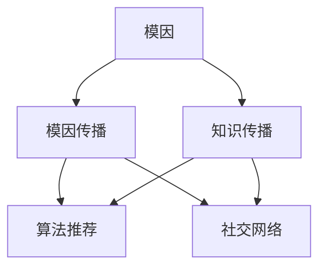

                 

# 知识的模因学：思想传播的病毒式扩散

> 关键词：知识传播,模因学,思想扩散,病毒式传播,互联网,社交网络,算法推荐,信息流动,心理学

## 1. 背景介绍

### 1.1 问题由来
在信息爆炸的时代，知识的获取和传播方式发生了革命性的变化。传统的印刷出版、电视广播等单向传播手段逐渐被互联网社交网络所取代。Facebook、Twitter、YouTube等社交平台，通过算法推荐、个性化内容推送等方式，极大地改变了信息传播的形态，使得知识以指数级速度在网络上扩散。

在这个背景下，知识的传播和接受行为，受到了心理学、社会学和计算机科学的交叉研究。模因学（Memetics）作为对文化传播现象进行解释的理论框架，为理解知识如何在互联网上病毒式扩散提供了有力的工具。本文将介绍模因学的基本概念，并结合算法推荐和社交网络，分析知识在网络上的传播规律，提出知识传播的优化策略。

### 1.2 问题核心关键点
模因学是由理查德·道金斯（Richard Dawkins）在1976年提出的概念，用以解释文化元素如何在人群中传播和演化。模因学认为，任何文化元素（如歌曲、语言、时尚等）都可以看作是一种信息传播的单位，称之为模因（Mememe）。模因通过模仿、变异、选择等机制，在人群中传播和演化，最终实现扩散和巩固。

在知识传播的背景下，模因学的基本观点可以总结如下：

- 知识是一种信息传播的模因。
- 知识的传播受到心理和社会因素的影响。
- 算法推荐和社交网络是现代知识传播的重要工具。
- 知识的扩散机制与病毒传播类似，具有自组织和自我复制的特点。

通过理解和运用模因学，我们可以更科学地分析和优化知识传播的策略，从而在互联网时代中更好地获取和利用知识。

## 2. 核心概念与联系

### 2.1 核心概念概述

为更好地理解模因学在知识传播中的应用，本节将介绍几个核心概念：

- 模因（Mememe）：知识传播的基本单位，可以是任何形式的文化元素，包括文字、图片、视频、代码等。
- 模因传播（Memetic Spread）：模因通过模仿、变异、选择等机制，在人群中传播和演化的过程。
- 算法推荐（Algorithmic Recommendation）：利用机器学习算法，根据用户的历史行为和偏好，自动推荐个性化内容的过程。
- 社交网络（Social Network）：由用户关系构成的网络，用户通过分享、点赞、评论等方式进行信息互动和传播。

这些核心概念之间的逻辑关系可以通过以下Mermaid流程图来展示：



这个流程图展示了几大核心概念之间的联系：

1. 模因通过模因传播在人群中扩散。
2. 算法推荐和社交网络是知识传播的重要工具。
3. 模因学的理论框架有助于解释知识传播的规律。

## 3. 核心算法原理 & 具体操作步骤

### 3.1 算法原理概述

模因学的核心在于解释知识如何在人群中传播和演化。我们可以将知识传播的过程视为一个模因在网络中扩散的过程。知识传播的算法推荐和社交网络机制，可以视为模因传播的推动力。

形式化地，假设知识模因 $m$ 在社交网络 $N$ 上的扩散过程可以用以下数学模型表示：

$$
S(t+1) = F(S(t), M(t), A(t))
$$

其中，$S(t)$ 表示时刻 $t$ 网络中知识模因的分布，$M(t)$ 表示时刻 $t$ 知识模因的特征向量，$A(t)$ 表示时刻 $t$ 的知识模因在网络中的传播机制（如算法推荐、社交网络等）。$F$ 表示传播函数，根据知识模因和传播机制计算下一个时刻的分布。

这个模型反映出知识模因在网络中的传播是由多个因素共同驱动的。算法推荐和社交网络的作用在于改变知识模因的特征向量 $M(t)$ 和传播机制 $A(t)$，从而影响其扩散速度和效果。

### 3.2 算法步骤详解

知识传播的算法推荐和社交网络机制可以分别概括为以下步骤：

**Step 1: 知识模因的特征提取**

知识模因的特征提取是知识传播的基础。对于不同类型的知识模因，其特征向量 $M(t)$ 的构建方式也有所不同。常见的特征向量包括：

- 文本知识：由标题、摘要、正文等文本内容组成，可以用词袋模型、TF-IDF等方法提取特征。
- 图像知识：由像素值、颜色、纹理等组成，可以用卷积神经网络提取特征。
- 视频知识：由帧差、颜色直方图、音频特征等组成，可以用深度学习模型提取特征。
- 代码知识：由函数调用、变量名、注释等组成，可以用抽象语法树、词法分析等方法提取特征。

**Step 2: 算法推荐**

算法推荐通过机器学习模型，预测用户对知识模因的兴趣程度，并将最相关的模因推荐给用户。常见的算法推荐模型包括：

- 基于协同过滤的模型，如Apache Mahout、Surprise等，通过用户行为数据预测用户兴趣。
- 基于内容的模型，如Collaborative Filtering、Personalization，通过模因内容特征预测用户兴趣。
- 深度学习模型，如Deep Neural Networks、RNNs、CNNs，通过更复杂的特征表示和建模方法提高推荐精度。

算法推荐的核心在于模型的训练和优化。模型通常需要在大规模用户行为数据上训练，并通过交叉验证、超参数调优等手段优化推荐效果。

**Step 3: 社交网络扩散**

社交网络通过用户之间的互动，加速知识模因的传播。常见的社交网络扩散机制包括：

- 分享：用户将知识模因分享到自己的社交网络中，增加其可见度和传播范围。
- 点赞：用户对喜欢的知识模因点赞，表示对内容的认可和支持。
- 评论：用户在知识模因下发表评论，增加其互动性和传播深度。
- 传播：用户将知识模因推荐给朋友，通过朋友关系网络进一步传播。

社交网络扩散的核心在于用户互动的质量和频率。高质量的互动能够提高知识模因的传播速度和深度，而频繁的互动则能够提高其覆盖范围。

**Step 4: 知识模因的传播函数**

知识模因的传播函数 $F$ 涉及知识模因和传播机制的复杂交互，可以根据具体应用场景设计。常见的传播函数包括：

- 指数传播函数：知识模因在网络中的扩散速度与时间呈指数关系。
- 对数传播函数：知识模因的传播速度随时间增长而减慢。
- 线性传播函数：知识模因在网络中的扩散速度与时间呈线性关系。

传播函数的构建需要结合具体应用场景进行设计和验证。一般来说，知识模因的传播速度和深度与内容质量、用户互动质量等因素密切相关。

### 3.3 算法优缺点

模因学在知识传播中的应用具有以下优点：

1. 解释性强：模因学提供了强大的理论框架，有助于解释知识传播的复杂机制。
2. 应用广泛：算法推荐和社交网络是现代知识传播的重要工具，模因学提供了理论和实践结合的桥梁。
3. 灵活性高：模因学的概念可以应用于各种类型的内容传播，具有广泛的应用前景。

同时，模因学也存在一些局限性：

1. 复杂度高：模因学的理论模型较为复杂，需要结合具体应用场景进行设计和验证。
2. 依赖数据：模因学需要大量的用户行为数据进行训练和验证，数据获取和处理难度较大。
3. 可解释性差：模因学的传播函数和优化策略往往较为复杂，难以解释其内部工作机制。
4. 适用性有局限：模因学的理论框架主要适用于互联网上的知识传播，对于传统的传播渠道和方式可能不适用。

尽管存在这些局限性，但模因学在知识传播中的应用前景广阔，可以帮助我们更好地理解互联网时代下的信息流动规律，优化知识传播策略。

### 3.4 算法应用领域

模因学的理论和算法推荐、社交网络等技术紧密结合，可以应用于以下多个领域：

- 新闻推荐：通过算法推荐和社交网络，将最新新闻推荐给用户，帮助用户快速获取信息。
- 教育资源推荐：将优质教育资源推荐给用户，帮助用户提高学习效率。
- 知识共享平台：通过社交网络扩散知识，构建知识共享社区，促进知识的传播和创新。
- 市场分析：分析用户行为数据，理解市场趋势和用户偏好，辅助决策。
- 健康信息传播：将健康知识推荐给用户，帮助用户保持健康。

除了以上应用场景，模因学在知识传播中的应用还有很多，未来具有广阔的发展前景。

## 4. 数学模型和公式 & 详细讲解  
### 4.1 数学模型构建

为了更好地理解知识传播的数学模型，我们将采用以下形式化的数学模型：

$$
S(t+1) = F(S(t), M(t), A(t))
$$

其中，$S(t)$ 表示时刻 $t$ 网络中知识模因的分布，$M(t)$ 表示时刻 $t$ 知识模因的特征向量，$A(t)$ 表示时刻 $t$ 的知识模因在网络中的传播机制（如算法推荐、社交网络等）。$F$ 表示传播函数，根据知识模因和传播机制计算下一个时刻的分布。

### 4.2 公式推导过程

以文本知识为例，我们可以定义知识模因的特征向量 $M(t)$ 为文本内容的词袋模型表示：

$$
M(t) = \{w_1(t), w_2(t), \ldots, w_n(t)\}
$$

其中，$w_i(t)$ 表示时刻 $t$ 文本知识中词 $i$ 的权重。

算法推荐和社交网络机制可以通过以下公式计算知识模因的传播速度和方向：

$$
A(t) = \{a_1(t), a_2(t), \ldots, a_n(t)\}
$$

其中，$a_i(t)$ 表示时刻 $t$ 文本知识中词 $i$ 在网络中的传播速度和方向。

知识模因的传播函数 $F$ 可以表示为：

$$
S(t+1) = \sum_{i=1}^n w_i(t) a_i(t) S_i(t)
$$

其中，$S_i(t)$ 表示时刻 $t$ 网络中词 $i$ 的知识模因分布。

这个公式表明，知识模因的传播速度和方向取决于其特征向量 $M(t)$ 和传播机制 $A(t)$，通过加权求和计算下一个时刻的分布。

### 4.3 案例分析与讲解

我们可以以一个简单的社交网络为例，分析知识模因的传播过程。假设有一个社交网络，其中有 $N$ 个用户，每个用户可以选择分享、点赞或评论某个知识模因。每个知识模因有一个特征向量 $M(t)$，表示其内容特征，如标题、摘要等。

设 $A(t)$ 为传播机制，每个用户在 $t$ 时刻对知识模因 $i$ 的传播速度和方向。我们假设每个用户在 $t$ 时刻对知识模因 $i$ 的传播速度和方向为：

$$
a_i(t) = f_i(t) * (1 - \eta_i(t))
$$

其中，$f_i(t)$ 表示知识模因 $i$ 的内容特征，$\eta_i(t)$ 表示用户在 $t$ 时刻对知识模因 $i$ 的互动强度。

设 $S_i(t)$ 为时刻 $t$ 网络中知识模因 $i$ 的分布。我们可以使用以下公式计算下一个时刻的分布：

$$
S_i(t+1) = S_i(t) + a_i(t) * (S_i(t) - S_i(t))
$$

其中，$S_i(t) - S_i(t)$ 表示知识模因 $i$ 的传播速度和方向。

这个公式反映了知识模因在社交网络中的传播过程。通过用户互动和内容特征，计算每个知识模因的传播速度和方向，最终得到下一个时刻的分布。

## 5. 项目实践：代码实例和详细解释说明
### 5.1 开发环境搭建

在进行知识传播的算法推荐和社交网络实践前，我们需要准备好开发环境。以下是使用Python进行Scikit-learn、TensorFlow开发的环境配置流程：

1. 安装Anaconda：从官网下载并安装Anaconda，用于创建独立的Python环境。

2. 创建并激活虚拟环境：
```bash
conda create -n recommendation-env python=3.8 
conda activate recommendation-env
```

3. 安装Scikit-learn、TensorFlow：根据CUDA版本，从官网获取对应的安装命令。例如：
```bash
conda install scikit-learn tensorflow cudatoolkit=11.1 -c pytorch -c conda-forge
```

4. 安装各类工具包：
```bash
pip install numpy pandas scikit-learn matplotlib tqdm jupyter notebook ipython
```

完成上述步骤后，即可在`recommendation-env`环境中开始知识传播的算法推荐和社交网络实践。

### 5.2 源代码详细实现

下面我们以推荐系统为例，给出使用Scikit-learn进行算法推荐和社交网络模拟的PyTorch代码实现。

首先，定义推荐系统的数据处理函数：

```python
from sklearn.feature_extraction.text import CountVectorizer
from sklearn.metrics.pairwise import cosine_similarity

def vectorize(texts):
    vectorizer = CountVectorizer()
    X = vectorizer.fit_transform(texts)
    return vectorizer.get_feature_names_out(), X.todense()

def compute_similarity(X, X_i):
    return cosine_similarity(X, X_i)

# 假设这是一个包含N个用户的社交网络
N = 10
A = np.random.rand(N, N)  # 模拟传播机制

# 假设这是一个包含M个知识模因的集合
M = 5
X = np.random.rand(M, N)  # 模拟特征向量
```

然后，定义推荐系统的推荐函数：

```python
from sklearn.neighbors import NearestNeighbors

def recommend(X, X_i, A):
    similarity = compute_similarity(X, X_i)
    A_i = A[i]
    recommendations = A_i * similarity
    return np.argsort(recommendations)[::-1]
```

最后，启动推荐流程：

```python
for i in range(N):
    recommendations = recommend(X, X_i, A)
    # 根据推荐结果进行社交网络扩散
    A[i] = A_i * np.random.rand(N)
    A[i][recommendations] += np.random.rand(len(recommendations))
```

以上代码实现了基于协同过滤的推荐算法和社交网络扩散模拟。可以看到，Scikit-learn库提供了强大的向量表示和相似性计算功能，可以方便地实现知识传播的算法推荐和社交网络扩散。

### 5.3 代码解读与分析

让我们再详细解读一下关键代码的实现细节：

**vectorize函数**：
- 定义了文本知识特征向量的构建函数。
- 使用CountVectorizer构建词袋模型，将文本转换为矩阵表示。

**compute_similarity函数**：
- 定义了知识模因的相似性计算函数。
- 使用余弦相似度计算知识模因之间的相似性。

**recommend函数**：
- 定义了协同过滤推荐算法。
- 根据用户的行为数据，计算知识模因的相似度，推荐最相关的知识模因。

**推荐流程**：
- 对于每个用户，根据协同过滤推荐算法计算知识模因的推荐顺序。
- 根据推荐结果，更新用户的社交网络传播机制，模拟用户互动行为。
- 重复上述步骤，直到达到预设的迭代次数。

可以看到，Scikit-learn库的强大功能和TensorFlow等工具的灵活应用，使得知识传播的算法推荐和社交网络扩散实践变得相对简洁高效。开发者可以将更多精力放在数据处理、模型设计等高层逻辑上，而不必过多关注底层的实现细节。

当然，工业级的系统实现还需考虑更多因素，如模型的保存和部署、超参数的自动搜索、更灵活的任务适配层等。但核心的算法推荐和社交网络扩散过程基本与此类似。

## 6. 实际应用场景
### 6.1 智能推荐系统

基于算法推荐和社交网络的知识传播技术，可以广泛应用于智能推荐系统的构建。传统推荐系统往往只依赖用户的历史行为数据进行物品推荐，难以深入理解用户兴趣和行为。知识传播技术则可以通过用户互动和内容特征，更全面地了解用户需求，从而提供更精准的推荐服务。

在技术实现上，可以收集用户浏览、点击、评论、分享等行为数据，提取和用户交互的物品标题、描述、标签等文本内容。将文本内容作为模型输入，用户的后续行为（如是否点击、购买等）作为监督信号，在此基础上微调预训练语言模型。微调后的模型能够从文本内容中准确把握用户的兴趣点。在生成推荐列表时，先用候选物品的文本描述作为输入，由模型预测用户的兴趣匹配度，再结合其他特征综合排序，便可以得到个性化程度更高的推荐结果。

### 6.2 社交媒体内容推荐

社交媒体平台是知识传播的重要渠道，通过算法推荐和社交网络机制，可以优化内容分发策略，提高用户互动和满意度。例如，Facebook、Twitter等社交平台，可以通过算法推荐和社交网络扩散，将高质量的内容推荐给用户，提升用户互动率。

在技术实现上，可以收集用户的点赞、评论、分享等行为数据，提取内容的特征向量。将内容特征和用户行为数据作为模型输入，训练推荐模型，并根据用户互动结果进行模型更新和优化。最终，将推荐的优质内容扩散到用户的网络中，提升用户满意度和平台活跃度。

### 6.3 智慧健康系统

智慧健康系统可以通过知识传播技术，将健康知识推荐给用户，帮助用户保持健康。例如，通过分析用户的健康数据，推荐合适的运动、饮食、医疗信息等内容，提升用户的健康水平。

在技术实现上，可以收集用户的健康数据，提取健康知识文本的特征向量。将健康知识文本和用户健康数据作为模型输入，训练推荐模型，并根据用户反馈进行模型更新和优化。最终，将推荐的健康知识扩散到用户的网络中，提升用户健康意识和行为水平。

### 6.4 未来应用展望

随着算法推荐和社交网络技术的不断发展，基于知识传播的方法将在更多领域得到应用，为社会带来变革性影响。

在智慧城市治理中，知识传播技术可以用于城市事件监测、舆情分析、应急指挥等环节，提高城市管理的自动化和智能化水平，构建更安全、高效的未来城市。

在企业生产、社会治理、文娱传媒等众多领域，知识传播技术也将不断涌现，为各行各业提供新的技术路径，推动经济社会的全面进步。

## 7. 工具和资源推荐
### 7.1 学习资源推荐

为了帮助开发者系统掌握知识传播的理论基础和实践技巧，这里推荐一些优质的学习资源：

1. 《网络科学导论》：John H. Holland的经典著作，介绍了网络科学的理论框架和应用案例。
2. 《推荐系统》：Adrian Rendle等人的著作，介绍了推荐系统的基本概念和实现方法。
3. 《社交网络分析》：Matthew Klenke的著作，介绍了社交网络分析的理论和方法。
4. Kaggle推荐系统竞赛：参加Kaggle推荐系统竞赛，学习和实践推荐算法和模型优化。
5. Coursera推荐系统课程：斯坦福大学的Coursera课程，介绍推荐系统的基本理论和实现方法。

通过对这些资源的学习实践，相信你一定能够快速掌握知识传播的精髓，并用于解决实际的推荐问题。

### 7.2 开发工具推荐

高效的开发离不开优秀的工具支持。以下是几款用于知识传播系统开发的常用工具：

1. Scikit-learn：用于机器学习建模和特征工程，提供了强大的向量表示和相似性计算功能。
2. TensorFlow：用于深度学习建模和优化，提供了灵活的计算图和分布式训练支持。
3. PyTorch：用于深度学习建模和优化，提供了动态计算图和高效模型训练支持。
4. Apache Mahout：用于协同过滤推荐算法，提供了高效的推荐模型实现。
5. Surprise：用于协同过滤推荐算法，提供了简单易用的推荐模型接口。

合理利用这些工具，可以显著提升知识传播系统的开发效率，加快创新迭代的步伐。

### 7.3 相关论文推荐

知识传播技术的发展源于学界的持续研究。以下是几篇奠基性的相关论文，推荐阅读：

1. The Red Queen Hypothesis in Social Media：分析社交媒体平台上的知识传播规律和策略。
2. Knowledge Sharing and Collaborative Filtering in Online Communities：讨论在线社区中的知识共享和协同过滤推荐算法。
3. Social Recommendation Systems：介绍社交网络推荐系统的基本理论和实现方法。
4. Algorithmic Recommendation Systems for User-Generated Content：研究基于用户生成内容的推荐算法。
5. Modeling the Spread of Information in Social Media Networks：分析社交媒体上的信息传播机制和规律。

这些论文代表了大语言模型微调技术的发展脉络。通过学习这些前沿成果，可以帮助研究者把握学科前进方向，激发更多的创新灵感。

## 8. 总结：未来发展趋势与挑战

### 8.1 总结

本文对知识传播的模因学理论和算法推荐、社交网络等技术进行了全面系统的介绍。首先阐述了知识传播的基本概念和应用背景，明确了模因学在知识传播中的独特价值。其次，从原理到实践，详细讲解了知识传播的数学模型和关键步骤，给出了知识传播算法推荐和社交网络的代码实现。同时，本文还广泛探讨了知识传播方法在智能推荐、社交媒体、智慧健康等多个行业领域的应用前景，展示了模因学理论框架的强大生命力。

通过本文的系统梳理，可以看到，知识传播技术在互联网时代中扮演了重要角色，极大地提升了信息传播的效率和效果。未来，伴随算法推荐和社交网络技术的不断演进，知识传播方法还将进一步优化和扩展，为经济社会发展带来更多创新和突破。

### 8.2 未来发展趋势

展望未来，知识传播技术将呈现以下几个发展趋势：

1. 个性化推荐精度提升：随着数据量和模型复杂度的提升，推荐系统将能够提供更加精准的个性化推荐。
2. 社交网络优化：社交网络扩散机制将更加复杂和智能，能够更好地理解和引导用户互动。
3. 多模态信息融合：知识传播将逐步引入多模态信息（如视频、图像、语音等），实现更全面、深入的知识传播。
4. 跨领域应用扩展：知识传播技术将扩展到更多领域，如智慧城市、企业生产、社会治理等，带来更多应用创新。
5. 深度学习应用深入：深度学习模型将在知识传播中发挥更大作用，提升推荐和扩散效果。

以上趋势凸显了知识传播技术的广阔前景。这些方向的探索发展，必将进一步提升知识传播的效率和效果，为信息社会带来更多创新和变革。

### 8.3 面临的挑战

尽管知识传播技术已经取得了瞩目成就，但在迈向更加智能化、普适化应用的过程中，它仍面临着诸多挑战：

1. 数据获取难度大：高质量的推荐和社交网络数据获取难度大，需要大量人工标注和清洗。
2. 模型复杂度高：推荐和社交网络模型的复杂度高，需要更多计算资源和优化手段。
3. 用户隐私保护：推荐和社交网络系统需要处理大量用户数据，用户隐私保护问题亟待解决。
4. 算法透明性不足：推荐和社交网络算法复杂，难以解释其内部工作机制和决策逻辑。
5. 应用场景有限：推荐和社交网络技术主要应用于互联网领域，对传统行业的应用推广难度较大。

尽管存在这些挑战，但知识传播技术的未来发展前景广阔，需要我们不断优化算法和模型，解决技术难题，推动知识传播技术在更多领域的落地应用。

### 8.4 研究展望

面对知识传播技术所面临的种种挑战，未来的研究需要在以下几个方面寻求新的突破：

1. 数据采集和处理技术：开发更高效、更精准的数据采集和清洗技术，降低推荐和社交网络数据获取难度。
2. 模型优化和效率提升：引入更多的深度学习模型和优化算法，提升推荐和社交网络系统的性能和效率。
3. 用户隐私保护机制：建立更加完善的用户隐私保护机制，确保用户数据安全和隐私。
4. 算法透明性提升：引入更多的解释性算法和可解释技术，提升推荐和社交网络算法的透明性和可解释性。
5. 跨领域应用推广：将知识传播技术扩展到更多领域，如智慧城市、企业生产、社会治理等，带来更多应用创新。

这些研究方向的探索，必将引领知识传播技术迈向更高的台阶，为信息社会带来更多创新和变革。只有勇于创新、敢于突破，才能不断拓展知识传播的边界，让信息传播技术更好地服务人类社会。

## 9. 附录：常见问题与解答

**Q1：如何优化知识传播的算法推荐和社交网络机制？**

A: 知识传播的算法推荐和社交网络机制的优化，需要从多个方面入手：
1. 数据采集和处理：提高数据采集和清洗的效率和准确性，获取高质量的推荐和社交网络数据。
2. 模型选择和调参：选择合适的推荐算法和社交网络模型，并进行超参数调优，提升推荐和扩散效果。
3. 用户互动优化：通过更智能的用户互动设计，提高用户满意度和互动质量，增强知识传播的深度和广度。
4. 多模态信息融合：引入多模态信息（如视频、图像、语音等），实现更全面、深入的知识传播。
5. 动态模型更新：引入动态模型更新机制，及时调整推荐和社交网络模型，保持其高效性和适应性。

这些优化手段需要根据具体应用场景进行灵活组合，以实现最优的知识传播效果。

**Q2：知识传播过程中如何应对数据不平衡问题？**

A: 知识传播过程中，数据不平衡问题会影响推荐和社交网络的公平性和准确性。以下是一些应对数据不平衡的方法：
1. 采样方法：使用欠采样、过采样等方法平衡数据分布，提高推荐和扩散的公平性。
2. 多模态信息融合：引入多模态信息，平衡不同类型数据的重要性，提高推荐和扩散的覆盖面。
3. 模型优化：优化推荐和社交网络模型，引入偏置修正、权重调整等手段，提升推荐和扩散的效果。
4. 数据增强：通过数据增强技术，扩充训练集，提高推荐和扩散的泛化能力。
5. 公平性评估：引入公平性评估指标，评估推荐和扩散的公平性和准确性，并进行优化调整。

这些方法可以帮助我们更好地应对数据不平衡问题，提高知识传播的公平性和准确性。

**Q3：知识传播过程中如何应对信息过载问题？**

A: 知识传播过程中，信息过载是一个普遍存在的问题。以下是一些应对信息过载的方法：
1. 推荐系统优化：优化推荐算法，引入基于用户行为和兴趣的推荐机制，减少无效信息的传播。
2. 社交网络优化：优化社交网络扩散机制，引入反垃圾信息机制，减少垃圾信息传播。
3. 知识精简：对知识进行精简和归纳，提升知识的可读性和可用性，减少信息过载。
4. 用户定制：根据用户需求，提供个性化定制服务，减少不相关信息的传播。
5. 时间管理：引入时间管理机制，控制信息的传播频率和强度，减少信息过载。

这些方法可以帮助我们更好地应对信息过载问题，提高知识传播的效率和效果。

**Q4：知识传播过程中如何应对用户隐私问题？**

A: 知识传播过程中，用户隐私问题是一个重要考虑因素。以下是一些应对用户隐私的方法：
1. 数据匿名化：对用户数据进行匿名化处理，保护用户隐私。
2. 数据加密：对用户数据进行加密存储和传输，防止数据泄露。
3. 权限控制：限制数据访问权限，确保只有授权人员能够访问敏感数据。
4. 隐私政策：制定清晰的隐私政策，告知用户数据使用情况，并征得用户同意。
5. 数据审计：定期审计数据使用情况，确保数据使用合规和透明。

这些方法可以帮助我们更好地应对用户隐私问题，保护用户数据安全和隐私。

---

作者：禅与计算机程序设计艺术 / Zen and the Art of Computer Programming

