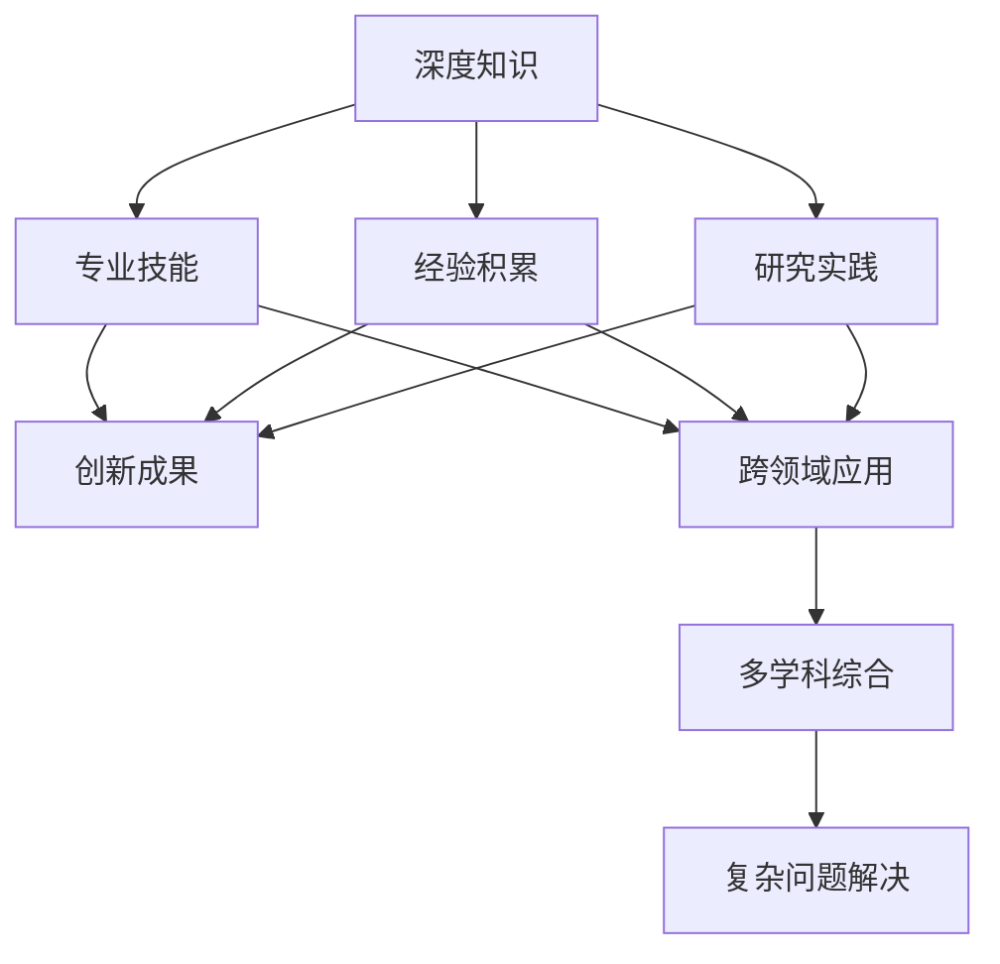

                 

## 1. 背景介绍

在当今快速发展的科技与知识经济时代，知识体系日益庞大而复杂，无论是学术研究还是工业实践，都面临着对知识深广度平衡的挑战。信息技术领域也不例外。专家与通才之间的平衡，以及知识体系中深度与广度的权衡，成为了一个亟待探讨和解决的重要问题。本文旨在深入分析这一问题，探讨如何在知识工程和人工智能领域中实现专才与通才的平衡。

## 2. 核心概念与联系

### 2.1 核心概念概述

为了更深入地探讨这一问题，我们首先定义几个关键概念：

**知识深度 (Depth)**：指在某特定领域内掌握的精细、专业性强的知识，通常由长时间积累和深入研究获得。

**知识广度 (Breadth)**：指在不同领域间所掌握的知识范围的广度，涵盖广泛、跨学科的知识体系。

**专才 (Specialist)**：在某一个领域有深入研究和实践经验，对特定问题有独特见解和解决方案的人。

**通才 (Generalist)**：在多个领域有广泛知识基础，具备跨学科整合和应用能力的人。

### 2.2 核心概念原理和架构的 Mermaid 流程图

以下是一个简单的 Mermaid 流程图，展示知识深度与广度的相互关系以及专才与通才之间的相互作用：



这个图表展示了一个从深度知识到专业技能、经验积累和研究实践，再到跨领域应用、创新成果，最终实现多学科综合和复杂问题解决的路径。

## 3. 核心算法原理 & 具体操作步骤

### 3.1 算法原理概述

在信息技术领域，专才与通才的平衡问题可以被抽象为一个知识工程问题，即如何在知识图谱中构建一个既能覆盖广泛领域，又能深入特定问题的知识网络。这涉及到知识的编码、检索、推理和应用等过程。知识工程的核心算法包括：

- **知识表示 (Knowledge Representation)**：将知识转化为计算机可以理解和处理的形式。
- **知识推理 (Knowledge Reasoning)**：基于逻辑或统计模型推导新的知识或验证已有知识。
- **知识检索 (Knowledge Retrieval)**：从知识库中检索与用户查询相关的知识。
- **知识应用 (Knowledge Application)**：将知识应用于特定任务或领域，如自然语言处理、机器学习等。

### 3.2 算法步骤详解

**Step 1: 构建知识图谱**

构建知识图谱是一个复杂的工程，涉及语义网、本体论等基础理论和实践。主要步骤包括：

1. **数据采集与预处理**：从各种来源（如书籍、数据库、网络资源）采集数据，并进行清洗和结构化处理。
2. **实体识别与关系抽取**：使用命名实体识别 (NER)、关系抽取 (Relation Extraction) 等技术识别知识图中的实体和关系。
3. **知识整合与编码**：将分散的知识整合成一个统一的知识图谱，并使用如RDF、OWL等格式进行编码。

**Step 2: 知识表示与推理**

知识表示是将知识结构化并形成知识图谱的过程。通常使用框架、逻辑、语义网等方法。

1. **框架表示**：使用框架将知识表示为对象、属性和方法的形式。
2. **逻辑表示**：使用一阶逻辑、描述逻辑等表示知识，并使用逻辑推理机进行推理。
3. **语义网表示**：使用RDF等语义网标准表示知识，使用推理引擎进行推理。

**Step 3: 知识检索与应用**

知识检索是从知识图谱中快速找到相关知识的过程。主要方法包括：

1. **基于规则的检索**：使用规则匹配检索相关知识。
2. **基于模型的检索**：使用机器学习模型预测相关性。
3. **基于图结构检索**：利用知识图谱的图结构进行检索。

**Step 4: 评估与优化**

评估知识工程的效果和性能，并根据评估结果进行优化。主要指标包括：

1. **准确率 (Accuracy)**：检索结果与实际答案的匹配度。
2. **召回率 (Recall)**：检索到的相关知识数量与全部相关知识的比例。
3. **F1值 (F1 Score)**：准确率和召回率的综合指标。
4. **推理效率**：知识推理的速度和资源消耗。

### 3.3 算法优缺点

知识工程的优点在于：

1. **系统化管理知识**：通过构建知识图谱，系统地管理大量知识，便于检索和应用。
2. **知识重用**：知识图谱中的知识可以被多个应用系统重用，提高效率。
3. **支持跨学科应用**：知识图谱可以跨越不同学科，支持跨领域的知识整合和应用。

缺点在于：

1. **构建复杂**：知识图谱的构建需要大量时间和资源，需要专业知识。
2. **维护困难**：知识图谱的动态更新和维护难度较大。
3. **数据不一致**：不同来源的数据可能存在不一致性，影响知识表示和推理的准确性。

### 3.4 算法应用领域

知识工程在多个领域中有着广泛的应用，例如：

1. **医疗知识工程**：构建医疗知识图谱，支持临床决策支持系统。
2. **金融知识工程**：构建金融知识图谱，支持风险评估和投资分析。
3. **教育知识工程**：构建教育知识图谱，支持个性化学习和智能教育。
4. **法律知识工程**：构建法律知识图谱，支持法律咨询和司法推理。

## 4. 数学模型和公式 & 详细讲解 & 举例说明

### 4.1 数学模型构建

知识工程的数学模型构建主要围绕知识图谱的表示和推理进行。

1. **知识表示模型**：如RDF、OWL、本体论模型等。
2. **知识推理模型**：如描述逻辑、一阶逻辑、概率图模型等。

### 4.2 公式推导过程

以概率图模型为例，知识推理的公式推导如下：

**一阶逻辑推理公式**：
$$ \phi \models \psi $$
表示在知识表示 $\phi$ 下，推理得到 $\psi$。

**概率图模型推理公式**：
$$ P(X) = \sum_{Y} P(X,Y) $$
表示在给定变量 $Y$ 的情况下，计算变量 $X$ 的概率。

**贝叶斯网络推理公式**：
$$ P(X_1, X_2, \ldots, X_n | Y_1, Y_2, \ldots, Y_m) = \frac{P(X_1, X_2, \ldots, X_n)}{P(Y_1, Y_2, \ldots, Y_m)} $$
表示在给定变量 $Y$ 的情况下，计算变量 $X$ 的概率。

### 4.3 案例分析与讲解

以医疗知识工程为例，构建医疗知识图谱的主要步骤如下：

1. **数据采集**：收集各种医疗文献、医疗数据库、电子病历等数据。
2. **实体抽取**：使用NER技术识别药物、疾病、症状等实体。
3. **关系抽取**：使用关系抽取技术识别药物与疾病、症状之间的关系。
4. **知识整合**：将上述抽取的知识整合到知识图谱中。
5. **知识推理**：使用推理引擎，如RDFS、OWL等，对知识图谱进行推理。
6. **评估优化**：使用准确率、召回率、F1值等指标评估知识图谱的性能，并进行优化。

## 5. 项目实践：代码实例和详细解释说明

### 5.1 开发环境搭建

开发环境搭建需要以下步骤：

1. **安装Python**：确保Python版本为3.8或以上。
2. **安装知识图谱工具包**：如GraphX、PyGraphviz等。
3. **准备数据集**：从医疗数据库、医疗文献中提取数据集。
4. **构建知识图谱**：使用PyGraphviz构建知识图谱。

### 5.2 源代码详细实现

**Step 1: 数据采集与预处理**

```python
import pandas as pd
from py2neo import Graph

# 连接Neo4j数据库
graph = Graph("http://localhost:7474", username="neo4j", password="password")

# 从数据库中读取数据
query = "MATCH (n) RETURN n"
data = pd.read_sql(query, con=graph.driver)
```

**Step 2: 实体识别与关系抽取**

```python
# 使用命名实体识别技术识别实体
from spacy import displacy
from spacy.matcher import Matcher
from spacy.lang.en import English

nlp = English()

# 定义命名实体匹配器
matcher = Matcher(nlp.vocab)

# 加载标签
pattern = [{'TEXT': {'regex': '/drug'}, 'OP': '?'}, {'TEXT': {'regex': '/condition'}]]
matcher.add('MATCHER', None, pattern)

# 匹配实体
doc = nlp("This drug was used to treat the condition")
matches = matcher(doc)
for match_id, start, end in matches:
    span = doc[start:end]
    print(span.text, span.label_)
```

**Step 3: 知识整合与编码**

```python
# 将实体和关系整合到知识图谱中
graph.run("CREATE (n:Drug {name: 'Xanax'})")
graph.run("MATCH (n:Drug {name: 'Xanax'})-[:TREATS]->(n:Condition {name: 'Anxiety Disorder'})")
```

**Step 4: 知识检索与推理**

```python
# 使用图结构检索相关知识
query = "MATCH (d:Drug)-[:TREATS]-(c:Condition) WHERE c.name = 'Anxiety Disorder' RETURN d.name"
data = pd.read_sql(query, con=graph.driver)
```

**Step 5: 评估与优化**

```python
# 评估知识图谱的性能
from sklearn.metrics import precision_recall_fscore_support

# 计算精确率、召回率、F1值
precision, recall, f1, _ = precision_recall_fscore_support(y_true, y_pred, average='micro')
print("Precision: {:.2f}%, Recall: {:.2f}%, F1 Score: {:.2f}%".format(precision * 100, recall * 100, f1 * 100))
```

### 5.3 代码解读与分析

通过上述代码示例，我们可以看到知识工程的开发流程：

- **数据采集与预处理**：从数据库或文本中提取数据，并进行清洗。
- **实体识别与关系抽取**：使用NER技术识别实体，使用关系抽取技术确定实体之间的关系。
- **知识整合与编码**：将实体和关系整合到知识图谱中。
- **知识检索与推理**：使用图结构检索相关知识，并使用推理引擎进行推理。
- **评估与优化**：评估知识图谱的性能，并根据评估结果进行优化。

## 6. 实际应用场景

### 6.1 医疗知识工程

医疗知识工程是知识工程的重要应用领域之一。构建医疗知识图谱，可以实现：

1. **疾病诊断**：利用知识图谱中的关系，快速找到与症状相关的疾病。
2. **药物推荐**：根据病人的症状和病情，推荐适合的药物。
3. **临床决策支持**：为医生提供全面的医学知识支持。

### 6.2 金融知识工程

金融知识工程主要应用于金融数据挖掘、风险评估、投资分析等场景。

1. **风险评估**：构建金融知识图谱，通过推理引擎评估投资风险。
2. **投资分析**：利用知识图谱进行市场分析和趋势预测。
3. **欺诈检测**：检测异常交易行为，防止金融欺诈。

### 6.3 教育知识工程

教育知识工程用于支持个性化学习和智能教育。

1. **个性化学习**：构建教育知识图谱，根据学生的学习情况和兴趣，推荐适合的课程和资源。
2. **智能教育**：利用知识图谱进行智能答疑和辅导。
3. **教育数据挖掘**：从海量教育数据中提取有价值的信息。

## 7. 工具和资源推荐

### 7.1 学习资源推荐

1. **《知识工程导论》**：详细介绍了知识工程的原理和方法，是学习知识工程的入门书籍。
2. **Coursera《知识工程》课程**：斯坦福大学开设的课程，涵盖了知识工程的各个方面。
3. **W3Schools**：提供知识工程的教程和示例，适合初学者学习。
4. **Google Scholar**：搜索学术论文，了解知识工程的研究前沿。

### 7.2 开发工具推荐

1. **PyGraphviz**：用于构建和可视化知识图谱的工具。
2. **GraphX**：用于构建和分析大规模图数据集的工具。
3. **Gephi**：用于可视化知识图谱的工具。
4. **Python**：开发知识工程应用的主要编程语言。

### 7.3 相关论文推荐

1. **《知识图谱：构建、查询与推理》**：介绍了知识图谱的基本概念和构建方法。
2. **《知识图谱在金融领域的应用研究》**：探讨了知识图谱在金融领域的具体应用。
3. **《基于本体论的医学知识表示与推理》**：讨论了医学知识图谱的构建和推理。

## 8. 总结：未来发展趋势与挑战

### 8.1 研究成果总结

知识工程的快速发展，使得专才与通才的平衡问题得到了更深入的研究和实践。以下研究成果可以总结为：

1. **深度学习和知识工程的结合**：利用深度学习对知识图谱进行优化和推理。
2. **多模态知识图谱**：将多种数据源（如文本、图像、视频）整合到知识图谱中。
3. **语义搜索与推荐**：利用知识图谱进行语义搜索和推荐。
4. **跨学科知识融合**：将不同领域的知识整合到知识图谱中，进行跨学科应用。

### 8.2 未来发展趋势

未来知识工程的发展趋势如下：

1. **自动化知识抽取**：利用深度学习技术，自动化地从文本中抽取知识，提高知识图谱构建的效率。
2. **自适应知识推理**：利用机器学习，根据上下文动态调整推理策略，提高推理的准确性和效率。
3. **实时知识更新**：利用数据流技术，实时更新知识图谱，保持知识的时效性。
4. **多语言知识工程**：构建多语言知识图谱，支持跨语言的语义理解和推理。
5. **可解释知识推理**：利用可解释性技术，提高知识推理的可解释性，增强系统透明度。

### 8.3 面临的挑战

知识工程在发展过程中仍面临诸多挑战：

1. **数据不一致性**：不同来源的数据可能存在不一致性，影响知识表示和推理的准确性。
2. **知识图谱规模庞大**：知识图谱的构建和维护需要大量资源和时间。
3. **计算复杂度**：知识推理和查询的计算复杂度较高，需要高效的算法和工具。
4. **知识图谱的可扩展性**：如何构建可扩展的知识图谱，支持更多的领域和应用。
5. **知识的动态变化**：如何动态更新知识图谱，保持知识的时效性和相关性。

### 8.4 研究展望

未来知识工程的研究方向包括：

1. **知识图谱的自动化构建**：利用深度学习、自然语言处理等技术，自动化构建知识图谱。
2. **跨语言知识图谱**：构建多语言的知识图谱，支持跨语言的语义理解和推理。
3. **知识图谱的可解释性**：利用可解释性技术，提高知识推理的可解释性，增强系统透明度。
4. **实时知识图谱**：利用数据流技术，实时更新知识图谱，保持知识的时效性。
5. **知识图谱的可视化**：利用可视化技术，直观展示知识图谱的结构和内容，支持知识发现和分析。

## 9. 附录：常见问题与解答

**Q1: 什么是知识工程？**

A: 知识工程是研究如何构建和应用知识图谱，利用计算机技术处理、管理和应用知识的领域。

**Q2: 知识工程的优点和缺点是什么？**

A: 优点：系统化管理知识、支持跨学科应用、知识重用等。缺点：构建复杂、维护困难、数据不一致等。

**Q3: 如何构建知识图谱？**

A: 主要步骤包括数据采集与预处理、实体识别与关系抽取、知识整合与编码、知识推理等。

**Q4: 知识工程的未来发展方向是什么？**

A: 自动化知识抽取、自适应知识推理、实时知识更新、多语言知识工程、知识图谱的可解释性等。

---

作者：禅与计算机程序设计艺术 / Zen and the Art of Computer Programming

