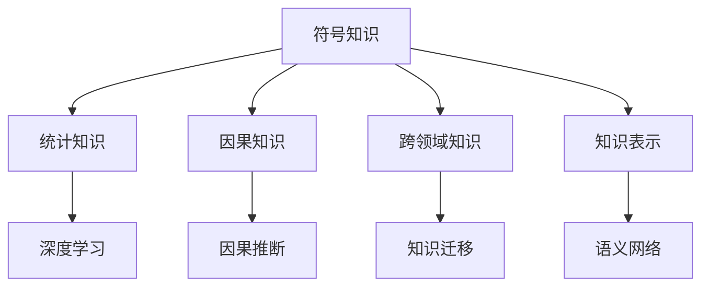
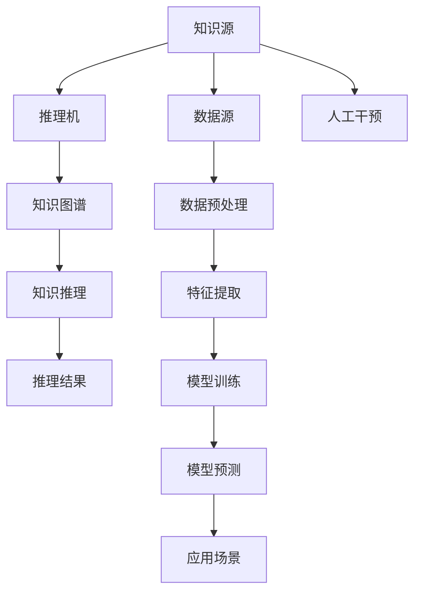
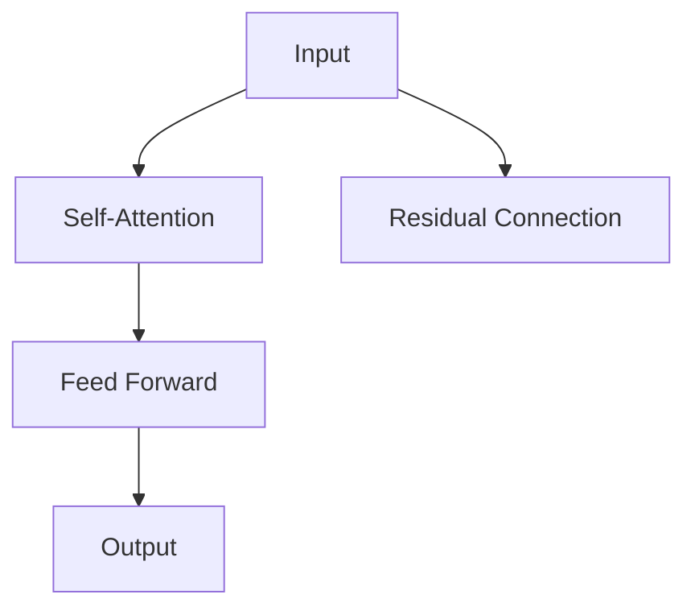

                 

# 知识的深度：从表象到本质的探索

## 1. 背景介绍

知识的获取是人类文明进步的基石。从古代的纸质书籍到现代的数字化信息，知识的形式和载体不断演变，但获取知识、理解知识的本质并没有改变。本文将深入探讨知识的深度，从表象到本质的探索，希望能为读者带来新的思考和洞见。

## 2. 核心概念与联系

### 2.1 核心概念概述

知识的深度（Depth of Knowledge）指的是知识在表象之下，能够触及事物本质的程度。从认知心理学的角度看，知识的深度不仅涉及到知识的广度和覆盖面，更关乎知识的内在联系和结构化程度。深度知识能够帮助人们更好地理解世界，做出明智的决策，甚至预测未来趋势。

在本节中，我们将介绍几个核心概念及其相互之间的联系：

- **符号知识（Symbolic Knowledge）**：传统的基于规则的知识表示方式，通过逻辑符号和公理体系构建。
- **统计知识（Statistical Knowledge）**：基于大规模数据训练的机器学习模型所学习到的知识。
- **因果知识（Causal Knowledge）**：关于因果关系和条件概率的知识，能够指导人们在复杂环境中做出合理的推断。
- **跨领域知识（Cross-Domain Knowledge）**：不同领域之间的知识迁移和融合，拓宽知识的广度和深度。
- **知识表示（Knowledge Representation）**：将知识结构化，便于存储、检索和推理。

这些概念之间的联系可以通过以下Mermaid流程图来展示：



### 2.2 核心概念原理和架构的 Mermaid 流程图



## 3. 核心算法原理 & 具体操作步骤

### 3.1 算法原理概述

从表象到本质的探索，涉及到知识的获取、表示和推理。深度知识的学习和应用需要跨学科的融合，包括认知心理学、人工智能、计算机科学等。本文将重点探讨统计知识在知识深度探索中的作用，结合因果知识、跨领域知识和知识表示方法，构建深度知识的算法框架。

深度学习算法基于大规模数据训练，能够学习到数据的复杂结构和内在关联。通过神经网络的层级结构，可以将数据从低维表象逐步提升到高维特征，最终挖掘出数据背后的深层次模式。这种算法框架能够有效地应对复杂环境下的知识和推理任务。

### 3.2 算法步骤详解

深度学习算法从数据预处理开始，经过特征提取和模型训练，最终实现推理和应用。以下是具体步骤：

1. **数据预处理**：清洗、标准化和归一化数据，去除噪音和异常值，构建合适的数据集。
2. **特征提取**：利用神经网络自动学习数据的特征表示，构建高维特征空间。
3. **模型训练**：在标注数据上训练神经网络模型，优化模型参数，使其能够适应目标任务。
4. **推理和应用**：将训练好的模型应用于新数据，进行推理和预测，输出深度知识结果。

### 3.3 算法优缺点

深度学习算法在知识深度探索中的优点包括：

- **自动特征提取**：能够自动学习数据的复杂特征，无需手工设计特征。
- **数据驱动**：能够利用大规模数据进行训练，学习到丰富的知识表示。
- **可扩展性**：通过增加模型层数和节点数，可以逐步提升知识深度。

然而，深度学习算法也存在一些缺点：

- **数据依赖**：需要大规模标注数据进行训练，数据获取成本高。
- **模型复杂**：模型结构复杂，难以解释和调试，容易出现过拟合。
- **计算资源需求高**：需要高性能计算设备和大量内存，训练和推理成本高。

### 3.4 算法应用领域

深度学习算法在知识深度探索中的应用领域广泛，包括但不限于：

- **自然语言处理（NLP）**：利用神经网络模型进行文本分类、情感分析、机器翻译等任务。
- **计算机视觉（CV）**：利用深度学习模型进行图像识别、目标检测、图像生成等任务。
- **语音识别**：利用深度学习模型进行语音转文字、语音情感分析等任务。
- **推荐系统**：利用深度学习模型进行用户行为分析、物品推荐等任务。
- **医疗诊断**：利用深度学习模型进行医学图像分析、疾病预测等任务。

## 4. 数学模型和公式 & 详细讲解 & 举例说明

### 4.1 数学模型构建

深度学习算法通常使用多层神经网络构建模型，每层包括多个神经元。在自然语言处理中，常用的模型包括卷积神经网络（CNN）、循环神经网络（RNN）和变压器（Transformer）等。

以Transformer模型为例，其核心结构包括多头自注意力机制（Multi-Head Self-Attention）和残差连接（Residual Connection），如图：



### 4.2 公式推导过程

Transformer模型的注意力机制公式如下：

$$
\text{Attention}(Q, K, V) = \text{Softmax}(\frac{QK^T}{\sqrt{d_k}})V
$$

其中，$Q$、$K$、$V$分别为查询、键和值向量，$d_k$为向量维度，$\text{Softmax}$函数将注意力权重归一化。

### 4.3 案例分析与讲解

以BERT模型为例，其在自然语言处理中的训练和推理过程如下：

1. **训练过程**：
   - 将文本输入BERT模型，通过Transformer编码器，得到单词向量表示。
   - 利用多个全连接层和激活函数，对单词向量进行多次转换，构建高维特征空间。
   - 利用分类器对特征向量进行分类，输出任务结果。

2. **推理过程**：
   - 将新文本输入BERT模型，得到单词向量表示。
   - 利用分类器对向量进行分类，输出任务结果。

## 5. 项目实践：代码实例和详细解释说明

### 5.1 开发环境搭建

为了实现深度学习算法，需要配置相应的开发环境。以下是Python和TensorFlow的开发环境配置流程：

1. 安装Anaconda：从官网下载并安装Anaconda，用于创建独立的Python环境。
2. 创建并激活虚拟环境：
```bash
conda create -n tensorflow-env python=3.8 
conda activate tensorflow-env
```

3. 安装TensorFlow：
```bash
conda install tensorflow -c pytorch -c conda-forge
```

4. 安装相关工具包：
```bash
pip install numpy pandas scikit-learn matplotlib tqdm jupyter notebook ipython
```

完成上述步骤后，即可在`tensorflow-env`环境中开始深度学习项目实践。

### 5.2 源代码详细实现

以下是使用TensorFlow实现自然语言处理中的文本分类任务的代码示例：

```python
import tensorflow as tf
from tensorflow.keras.datasets import imdb
from tensorflow.keras.models import Sequential
from tensorflow.keras.layers import Embedding, LSTM, Dense

# 加载IMDB数据集
(x_train, y_train), (x_test, y_test) = imdb.load_data(num_words=10000)

# 数据预处理
x_train = tf.keras.preprocessing.sequence.pad_sequences(x_train, maxlen=256)
x_test = tf.keras.preprocessing.sequence.pad_sequences(x_test, maxlen=256)

# 定义模型
model = Sequential()
model.add(Embedding(input_dim=10000, output_dim=128, input_length=256))
model.add(LSTM(units=128, dropout=0.2, recurrent_dropout=0.2))
model.add(Dense(units=1, activation='sigmoid'))

# 编译模型
model.compile(optimizer='adam', loss='binary_crossentropy', metrics=['accuracy'])

# 训练模型
model.fit(x_train, y_train, epochs=10, batch_size=128, validation_data=(x_test, y_test))

# 评估模型
test_loss, test_acc = model.evaluate(x_test, y_test)
print('Test accuracy:', test_acc)
```

### 5.3 代码解读与分析

**代码解读**：
- 加载IMDB数据集，使用前10000个单词的词典进行编码。
- 对序列数据进行填充，使其长度一致。
- 构建模型，包括Embedding、LSTM和Dense层。
- 编译模型，设置优化器和损失函数。
- 训练模型，使用交叉验证进行验证。
- 评估模型，输出测试集上的准确率。

**代码分析**：
- Embedding层将单词序列转换为向量表示。
- LSTM层通过时间序列建模，学习上下文信息。
- Dense层进行分类，输出二分类结果。
- 模型使用Adam优化器和二元交叉熵损失函数进行训练。

## 6. 实际应用场景

深度学习算法在知识深度探索中的实际应用场景丰富多样，以下是几个典型案例：

### 6.1 智能客服系统

智能客服系统利用深度学习算法对用户输入进行理解和分析，自动生成回复。通过学习大量的用户对话数据，模型能够理解用户意图，提供个性化服务。例如，利用BERT模型对用户问题和客服回复进行匹配，生成最佳回答，提高客服效率和用户体验。

### 6.2 医疗诊断系统

医疗诊断系统利用深度学习算法对医学影像进行分析和诊断。例如，通过卷积神经网络对X光片进行图像分类，识别异常情况；或利用循环神经网络对电子病历进行文本分析，提取关键信息。这些系统能够辅助医生进行快速、准确的诊断，减少误诊率。

### 6.3 金融风控系统

金融风控系统利用深度学习算法对交易数据进行分析和监控。例如，利用LSTM模型对用户交易行为进行预测，识别潜在的风险；或利用卷积神经网络对欺诈行为进行检测，提高安全防护水平。这些系统能够帮助金融机构提前预警风险，减少经济损失。

### 6.4 未来应用展望

随着深度学习算法的不断演进，其在知识深度探索中的应用前景广阔。未来，深度学习算法将与更多前沿技术进行融合，如因果推理、跨领域知识迁移等，提升系统的复杂度和应用场景的广泛性。例如：

- **因果推理**：将因果分析方法引入深度学习，挖掘数据背后的因果关系，提升预测和推理的准确性。
- **跨领域知识迁移**：利用知识图谱和语义网络，实现不同领域之间的知识迁移和融合，拓宽知识的应用范围。
- **多模态融合**：结合视觉、语音、文本等多种模态的数据，提升知识表示的全面性和深度。

## 7. 工具和资源推荐

### 7.1 学习资源推荐

为了更好地掌握深度学习算法，以下是一些优秀的学习资源推荐：

1. 《深度学习》（Goodfellow等）：全面介绍了深度学习的基本概念、算法和应用。
2. 《动手学深度学习》（李沐等）：通过动手实践，深入理解深度学习算法。
3. Coursera上的深度学习课程（吴恩达等）：系统讲解深度学习理论和实践。
4. PyTorch官方文档：提供详细的深度学习算法和框架使用指南。
5. TensorFlow官方文档：提供丰富的深度学习模型和算法实现。

### 7.2 开发工具推荐

为了高效实现深度学习算法，以下是一些常用的开发工具推荐：

1. PyTorch：基于Python的深度学习框架，提供灵活的动态计算图，适合研究性项目。
2. TensorFlow：由Google主导开发的深度学习框架，支持多种设备和分布式训练，适合生产环境。
3. Keras：高层API，简化深度学习模型的构建和训练过程。
4. Jupyter Notebook：交互式编程环境，支持Python代码块的交互执行。
5. Anaconda：Python环境管理工具，方便创建和管理虚拟环境。

### 7.3 相关论文推荐

以下是几篇深度学习算法领域的经典论文，推荐阅读：

1. 《ImageNet Classification with Deep Convolutional Neural Networks》（AlexNet）：介绍卷积神经网络在图像分类中的应用。
2. 《Long Short-Term Memory》：提出LSTM模型，解决序列数据的建模问题。
3. 《Attention is All You Need》（Transformer）：提出Transformer模型，解决序列到序列任务。
4. 《Deep Residual Learning for Image Recognition》（ResNet）：提出残差连接，解决深度网络退化问题。
5. 《The Unreasonable Effectiveness of Transfer Learning》：探讨知识迁移在深度学习中的作用。

## 8. 总结：未来发展趋势与挑战

### 8.1 总结

本文对深度学习算法在知识深度探索中的应用进行了全面系统的介绍。深度学习算法通过自动特征提取和数据驱动的训练，能够学习到复杂知识表示，适用于各种复杂的任务。通过不断探索和实践，深度学习算法在自然语言处理、计算机视觉、语音识别、推荐系统等领域取得了显著成果，推动了人工智能技术的发展。

### 8.2 未来发展趋势

未来，深度学习算法将在知识深度探索中呈现以下趋势：

1. **知识图谱与语义网络**：利用知识图谱和语义网络，实现知识的结构化和语义理解，提升知识的深度和广度。
2. **跨领域知识迁移**：通过知识迁移和融合，实现不同领域之间的知识共享，拓宽知识的应用范围。
3. **因果推理**：引入因果分析方法，挖掘数据背后的因果关系，提升预测和推理的准确性。
4. **多模态融合**：结合视觉、语音、文本等多种模态的数据，提升知识表示的全面性和深度。
5. **联邦学习**：在数据分布不均或隐私保护要求高的场景中，通过联邦学习实现知识共享和协同优化。

### 8.3 面临的挑战

尽管深度学习算法在知识深度探索中取得了巨大成功，但仍面临诸多挑战：

1. **数据依赖**：需要大规模标注数据进行训练，数据获取成本高。
2. **模型复杂**：模型结构复杂，难以解释和调试，容易出现过拟合。
3. **计算资源需求高**：需要高性能计算设备和大量内存，训练和推理成本高。
4. **泛化能力不足**：模型对新数据和新场景的泛化能力有限，容易出现偏差。
5. **伦理和安全问题**：深度学习算法可能存在偏见和歧视，需要加强伦理和安全监管。

### 8.4 研究展望

未来，深度学习算法在知识深度探索中仍需不断创新和突破：

1. **无监督学习**：探索无监督学习方法和技术，降低对标注数据的依赖。
2. **高效计算**：开发高效计算框架和算法，降低资源消耗，提升训练和推理速度。
3. **可解释性**：提升深度学习算法的可解释性，增强模型的透明性和可信度。
4. **公平性和伦理**：加强深度学习算法的公平性和伦理监管，防止歧视和偏见。

## 9. 附录：常见问题与解答

**Q1：深度学习算法是否适用于所有知识探索场景？**

A: 深度学习算法适用于复杂度较高、数据量较大的知识探索场景，但并不适用于所有场景。例如，对于一些需要手工设计特征的任务，深度学习算法可能难以发挥作用。因此，在应用深度学习算法时，需要根据具体任务的特点进行选择。

**Q2：如何缓解深度学习算法的过拟合问题？**

A: 缓解深度学习算法过拟合问题的方法包括：
1. 数据增强：通过回译、近义替换等方式扩充训练集。
2. 正则化：使用L2正则、Dropout、Early Stopping等避免过拟合。
3. 对抗训练：引入对抗样本，提高模型鲁棒性。
4. 参数高效微调：只调整少量参数(如Adapter、Prefix等)，减小过拟合风险。

**Q3：如何提高深度学习算法的泛化能力？**

A: 提高深度学习算法泛化能力的方法包括：
1. 数据集扩充：使用更大的数据集进行训练，提升模型的泛化能力。
2. 迁移学习：利用已有的知识进行迁移学习，降低新任务的训练难度。
3. 模型优化：通过模型剪枝、量化等技术优化模型结构，提高泛化能力。

**Q4：如何提升深度学习算法的可解释性？**

A: 提升深度学习算法可解释性的方法包括：
1. 可视化工具：使用可视化工具，如TensorBoard，展示模型的内部结构和参数。
2. 模型解释方法：利用模型解释方法，如LIME、SHAP，分析模型的预测结果。
3. 逻辑推理：通过逻辑推理，解释模型的决策过程，增强模型的透明性。

**Q5：深度学习算法在知识深度探索中面临哪些伦理问题？**

A: 深度学习算法在知识深度探索中面临的伦理问题包括：
1. 偏见和歧视：深度学习算法可能存在偏见和歧视，需要加强伦理监管。
2. 隐私保护：深度学习算法涉及大量个人信息，需要加强隐私保护措施。
3. 模型解释：深度学习算法的决策过程难以解释，需要增强模型的透明性和可信度。

通过本文的系统梳理，我们可以看到，深度学习算法在知识深度探索中的应用前景广阔。然而，在实际应用中，仍需不断探索和优化算法，确保模型的透明性、公平性和安全性，才能真正发挥深度学习的优势。

