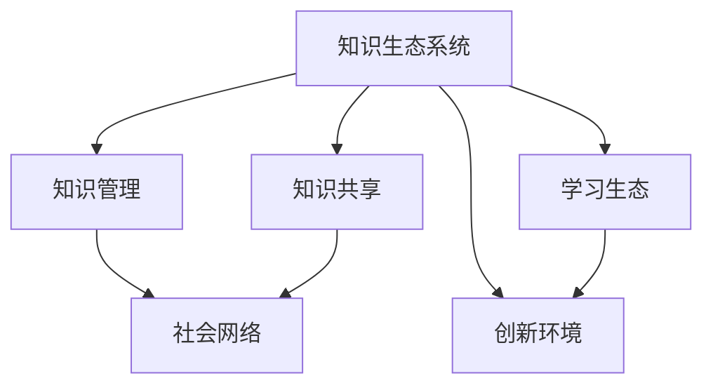

                 

# 知识的生态系统：个人、组织与社会的互动

> 关键词：知识生态系统, 知识共享, 知识管理, 社会网络, 学习生态, 创新环境

## 1. 背景介绍

### 1.1 问题由来
在数字时代的浪潮中，知识的获取、存储、共享和应用正在经历前所未有的变革。个人、组织和社会之间的知识生态系统正在重新构建，这不仅影响着知识的传播与获取方式，也深刻地改变着人类社会的发展轨迹。知识，作为一种独特的资源，其流通的效率与质量，对个人职业发展、组织创新能力以及社会整体的知识水平具有决定性的影响。

**问题核心关键点：**
- 知识生态系统在个人、组织、社会三个层面的互动机制是什么？
- 知识如何被有效地生成、传播和应用？
- 如何通过技术手段优化知识生态系统的运转效率？
- 未来的知识生态系统有哪些潜在的发展趋势？

## 2. 核心概念与联系

### 2.1 核心概念概述

为了理解知识生态系统的运作机制，需要明确几个关键概念：

- **知识生态系统(Knowledge Ecosystem)**：以知识为核心资源，通过个体、组织和社会的相互作用和依赖，形成的一种动态平衡的知识流通系统。
- **知识共享(Knowledge Sharing)**：指个体或组织之间，通过交流、合作、协作等方式，将知识进行传递和复制的过程。
- **知识管理(Knowledge Management)**：指对知识的获取、存储、检索、更新和应用进行有效管理的过程。
- **社会网络(Social Network)**：由个体之间的互动关系构成，反映了知识流通中的社会关系网。
- **学习生态(Learning Ecosystem)**：是指个体在学习过程中形成的相互联系的知识环境，包括学习者、学习资源、学习工具等要素。
- **创新环境(Innovation Environment)**：指支持知识创新、扩散和应用的社会环境，包括政策支持、资源配置、文化氛围等。

这些概念通过相互作用和依赖，构成了一个复杂的知识生态系统。

### 2.2 核心概念原理和架构的 Mermaid 流程图



**解释：**
- 知识生态系统通过知识共享（B）将知识在不同个体和组织间传播。
- 知识管理（C）确保知识的高效存储和应用。
- 社会网络（D）是知识传播的基础，反映了知识流通的社会关系。
- 学习生态（E）是知识应用和创新的一个环节，通过持续学习促进个体发展。
- 创新环境（F）为知识的创新与应用提供了必要的支持。

这些核心概念通过相互交织，构建了一个动态的知识生态系统，推动知识的流通和应用。

## 3. 核心算法原理 & 具体操作步骤

### 3.1 算法原理概述

知识生态系统的运作机制可以从知识生成、知识共享、知识管理和知识应用等多个角度进行分析。其核心算法原理主要包括以下几个方面：

- **知识生成**：通过学习、研究和创新等方式，生成新的知识内容。
- **知识共享**：通过社交媒体、知识库、论坛等平台，实现知识在不同个体和组织间的传递。
- **知识管理**：使用信息检索、元数据管理、知识图谱等技术，提高知识的检索和应用效率。
- **知识应用**：通过知识驱动的决策支持、人工智能、机器学习等技术，实现知识的深度应用和创新。

### 3.2 算法步骤详解

知识生态系统的核心算法步骤主要包括以下几个环节：

1. **数据收集与整理**：收集组织内外部的知识来源，如文档、会议记录、社交媒体等，并进行整理和清洗。
2. **知识存储与管理**：构建知识库和知识图谱，存储和管理知识数据。
3. **知识检索与推荐**：使用信息检索技术，实现快速准确的知识检索，并结合推荐系统，提供个性化知识推荐。
4. **知识共享与协作**：利用社交网络和协作平台，促进知识共享和协作。
5. **知识应用与创新**：将知识应用于实际工作、研究项目中，并利用机器学习和人工智能技术，推动知识创新。

### 3.3 算法优缺点

**优点：**
- **知识共享与协作**：促进个体与组织间的知识流动，提高知识传播效率。
- **知识管理**：提升知识存储和检索的效率，减少冗余重复劳动。
- **知识应用**：通过技术手段促进知识创新，提高决策和应用能力。

**缺点：**
- **数据隐私与安全**：知识共享过程中可能涉及数据隐私和安全问题。
- **知识质量难以控制**：知识的生成和传播过程中，质量难以完全保证。
- **技术依赖性**：技术手段的应用依赖于良好的技术基础设施。

### 3.4 算法应用领域

知识生态系统的构建与应用，已广泛渗透到多个领域：

- **教育与培训**：在线教育平台、MOOCs、学习管理系统等，支持知识的学习和传播。
- **企业与组织**：企业知识管理系统、内部论坛、协作工具等，支持知识的共享和应用。
- **科研与学术**：科研机构的知识库、学术论文数据库、学术网络等，支持知识的生成和传播。
- **公共服务**：政府知识门户、公共数据开放平台、在线咨询服务等，支持知识的公开和共享。

## 4. 数学模型和公式 & 详细讲解 & 举例说明

### 4.1 数学模型构建

知识生态系统的数学模型可以从多个角度进行构建，这里介绍一个简化的模型框架。

- **知识生成模型**：
  - $K_g = f(G, D)$，其中 $K_g$ 表示生成的知识量，$G$ 为研究团队的技术水平，$D$ 为研究所拥有的资源。
  - 模型假设知识生成量与团队技术水平和资源成正比。
  
- **知识共享模型**：
  - $K_s = g(N, R)$，其中 $K_s$ 表示共享的知识量，$N$ 为知识共享的个体或组织数量，$R$ 为知识共享的频率。
  - 模型假设知识共享量与参与个体或组织数量和频率成正比。

- **知识管理模型**：
  - $K_m = h(K_s, K_l)$，其中 $K_m$ 表示管理后的知识量，$K_s$ 为原始知识量，$K_l$ 为知识管理的效率。
  - 模型假设知识管理量与原始知识量和知识管理效率成正比。

- **知识应用模型**：
  - $K_a = K_m \times p$，其中 $K_a$ 表示应用的知识量，$p$ 为知识应用的比例。
  - 模型假设知识应用量与知识管理量成正比。

### 4.2 公式推导过程

根据以上模型，可以进一步推导知识生态系统的总知识量 $K$：

- $K = K_g + K_s + K_m + K_a$
- $K = f(G, D) + g(N, R) + h(K_s, K_l) + K_m \times p$

### 4.3 案例分析与讲解

以一个科研团队为例：
- **知识生成**：团队在最新的科研项目中产生了大量新知识，知识生成量为 $K_g = 5G \times D$。
- **知识共享**：团队成员定期在内部论坛和学术会议上分享知识，知识共享量为 $K_s = 2N \times R$。
- **知识管理**：团队使用知识管理系统，将共享知识整理存储，管理效率为 $K_l = 0.8$，知识管理量为 $K_m = K_s \times K_l$。
- **知识应用**：团队将管理后的知识应用于实际科研和项目中，应用比例为 $p = 0.6$，知识应用量为 $K_a = K_m \times p$。

将以上数据代入模型，计算总知识量：

- $K = 5G \times D + 2N \times R + K_s \times K_l + K_m \times p$
- $K = 5G \times D + 2N \times R + 2N \times R \times 0.8 + (2N \times R) \times 0.8 \times 0.6$
- $K = 5G \times D + 2N \times R + 1.6N \times R + 0.96N \times R$
- $K = (5G + 3.56N) \times D$

通过案例分析，可以看出知识生态系统中各个环节的相互依赖关系，以及影响总知识量的关键因素。

## 5. 项目实践：代码实例和详细解释说明

### 5.1 开发环境搭建

知识生态系统的开发环境搭建主要包括知识库和协作平台的搭建。这里以基于Django的Web应用为例：

1. 安装Python和Django。
2. 搭建Web服务器，安装Nginx和Gunicorn。
3. 搭建数据库（如MySQL或PostgreSQL）。
4. 安装Django框架及相关库（如Django REST Framework、Django Admin等）。

### 5.2 源代码详细实现

知识库的实现以MySQL数据库为基础，包含知识分类、标签、搜索等功能。以下是一个简单的数据模型：

```python
from django.db import models

class Knowledge(models.Model):
    title = models.CharField(max_length=200)
    content = models.TextField()
    category = models.CharField(max_length=50)
    created_at = models.DateTimeField(auto_now_add=True)
    updated_at = models.DateTimeField(auto_now=True)

    def __str__(self):
        return self.title
```

协作平台则利用Django的User模型和权限系统，支持用户注册、登录、协作等功能。以下是一个简单的User模型：

```python
from django.contrib.auth.models import AbstractUser
from django.db import models

class User(AbstractUser):
    is_knowledge_manager = models.BooleanField(default=False)

    def __str__(self):
        return self.username
```

### 5.3 代码解读与分析

**知识库模型**：
- `title`：知识标题。
- `content`：知识内容。
- `category`：知识分类。
- `created_at`：知识创建时间。
- `updated_at`：知识更新时间。

**用户模型**：
- `is_knowledge_manager`：用户是否为知识管理员。

**代码解释**：
- 使用Django的模型（Model）和字段（Field）定义知识库和用户的信息。
- 知识库模型使用`title`、`content`、`category`、`created_at`、`updated_at`字段存储知识的基本信息。
- 用户模型通过继承`AbstractUser`，添加`is_knowledge_manager`字段，用于标识知识管理员。
- 代码中的`__str__`方法用于将模型对象转换为字符串，方便展示。

**分析**：
- Django框架提供了丰富的数据模型和数据迁移功能，简化开发过程。
- 模型设计需要考虑业务需求，确保数据的规范化和可用性。
- 用户权限管理通过Django的内置权限系统实现，支持灵活的用户角色管理。

### 5.4 运行结果展示

搭建完成后，可以在Web界面进行知识的管理和检索。以下是一个简单的知识检索界面：

```html



  <h1>知识检索</h1>
  <form method="get" action="">
    <input type="text" name="q" placeholder="搜索知识...">
    <button type="submit">搜索</button>
  </form>
  <table>
    <thead>
      <tr>
        <th>标题</th>
        <th>内容</th>
        <th>分类</th>
        <th>创建时间</th>
        <th>更新时间</th>
        <th>操作</th>
      </tr>
    </thead>
    <tbody>
      
        <tr>
          <td>{{ knowledge.title }}</td>
          <td>{{ knowledge.content }}</td>
          <td>{{ knowledge.category }}</td>
          <td>{{ knowledge.created_at }}</td>
          <td>{{ knowledge.updated_at }}</td>
          <td><a href="">详情</a></td>
        </tr>
      
    </tbody>
  </table>

```

## 6. 实际应用场景

### 6.1 知识共享平台

知识共享平台通过提供一个开放的知识交流空间，促进个体和组织间的知识流动。平台可以包括博客、论坛、问答等形式，支持用户发布、评论、点赞等功能。

**应用示例**：
- **学术研究**：研究人员可以在平台上发布最新的科研成果，其他研究人员可以获取、评论和引用这些研究成果。
- **企业内部知识库**：企业员工可以在内部知识库中上传技术文档、项目报告等，供其他员工检索和学习。
- **社区知识分享**：技术爱好者可以在技术社区中分享个人项目、代码片段和开发经验，供其他开发者学习和参考。

### 6.2 企业知识管理系统

企业知识管理系统（KMS）通过集中存储和管理企业内部的知识资产，提高知识共享和应用效率。

**应用示例**：
- **文档管理**：企业可以集中存储各种文档资料，如用户手册、技术文档、培训资料等。
- **项目管理**：项目管理系统中集成知识管理功能，支持项目知识库、协作工具等，提高项目管理和团队协作效率。
- **知识搜索**：通过构建知识图谱和搜索引擎，快速定位和检索知识，支持知识驱动的决策支持。

### 6.3 教育学习平台

教育学习平台通过提供丰富的学习资源和协作工具，支持知识的学习和传播。

**应用示例**：
- **在线课程**：提供MOOCs和在线课程，支持大规模在线学习。
- **学习社区**：构建学习者社区，支持讨论、交流和协作。
- **学习路径规划**：通过推荐系统，为用户推荐学习路径和学习资源。

### 6.4 公共知识平台

公共知识平台通过开放数据和知识，支持社会各界获取和应用公共知识。

**应用示例**：
- **政府数据开放**：政府机构公开各类数据和报告，供公众查阅和学习。
- **科研数据共享**：科研机构开放科研项目数据，支持学术研究和知识传播。
- **社区知识库**：社区知识库提供各类实用知识和技巧，支持居民生活和学习。

## 7. 工具和资源推荐

### 7.1 学习资源推荐

为了系统掌握知识生态系统的理论和实践，以下推荐一些重要的学习资源：

1. **《知识生态系统：构建知识共享与创新的新范式》**：一本全面介绍知识生态系统理论的书籍，涵盖知识生成、共享、管理、应用等多个方面。
2. **Coursera《知识管理与创新》课程**：斯坦福大学提供的在线课程，介绍知识管理的基本概念和实践方法。
3. **Django官方文档**：Django框架的官方文档，提供详细的Web开发教程和实践指南。
4. **Jupyter Notebook**：一个强大的交互式编程环境，支持多种编程语言和数据处理工具。
5. **Google Colab**：谷歌提供的免费在线编程环境，支持GPU和TPU算力，方便快速实验和分享学习笔记。

### 7.2 开发工具推荐

构建知识生态系统的开发工具推荐如下：

1. **Django**：一个高层次的Web开发框架，提供丰富的数据模型和模板引擎。
2. **MySQL/PostgreSQL**：常用的关系型数据库，支持高并发和大量数据存储。
3. **Redis**：一个快速、高可用的内存数据库，支持缓存和实时数据处理。
4. **Django REST Framework**：一个Django的RESTful API框架，支持高效的数据API设计。
5. **Django Admin**：一个内置的管理界面，方便对数据进行管理和查询。

### 7.3 相关论文推荐

以下推荐几篇影响较大的知识生态系统相关论文：

1. **Knowledge Ecology: Towards a Socio-Technical System for Knowledge Management**：探讨知识生态系统的理论框架和实践应用。
2. **Social Media and Knowledge Sharing: An Empirical Study**：研究社交媒体对知识共享的影响，提供实证数据和分析。
3. **Collaborative Knowledge Management in Enterprises**：探讨企业知识管理的机制和策略，提供实践经验和方法。
4. **Knowledge Graphs in Educational Institutions**：研究知识图谱在教育机构的应用，提升知识管理和应用效率。
5. **Knowledge Ecosystems in Public Sector**：探讨政府知识生态系统的构建和应用，推动公共服务的智能化和数据化。

## 8. 总结：未来发展趋势与挑战

### 8.1 研究成果总结

本文介绍了知识生态系统的背景和核心概念，分析了知识生态系统在个人、组织和社会三个层面上的互动机制。通过构建数学模型和代码实例，展示了知识生态系统的实现过程和应用场景。推荐了相关的学习资源、开发工具和研究论文，为进一步研究和实践提供了参考。

### 8.2 未来发展趋势

未来知识生态系统的发展趋势主要包括以下几个方面：

1. **人工智能与知识管理融合**：利用人工智能技术，实现知识自动化处理和智能推荐。
2. **知识生态的全球化**：通过知识共享和协作，促进全球知识生态的发展。
3. **知识生态与大数据结合**：利用大数据技术，挖掘和分析知识生态中的数据，支持知识决策和应用。
4. **知识生态的定制化**：根据不同组织和个人的需求，构建定制化的知识生态系统。
5. **知识生态的可持续发展**：通过持续学习和创新，推动知识生态的可持续发展。

### 8.3 面临的挑战

知识生态系统在发展和应用过程中面临以下挑战：

1. **数据隐私与安全**：知识共享过程中涉及大量敏感数据，如何保障数据隐私和安全是重要挑战。
2. **知识质量控制**：知识生成和传播过程中，如何保证知识的质量和可靠性。
3. **技术平台互联互通**：不同平台之间的数据互联互通存在技术障碍，需要统一的标准和协议。
4. **知识共享的动力机制**：如何激励个体和组织积极参与知识共享，形成良好的知识生态。
5. **知识管理的复杂性**：知识生态系统复杂多变，如何实现高效的分类、检索和管理。

### 8.4 研究展望

未来知识生态系统的研究将从以下几个方向进行：

1. **知识生态系统的理论研究**：进一步完善知识生态系统的理论框架，提供更系统的理论指导。
2. **知识生态系统的技术创新**：开发新的技术手段，提升知识生态系统的效率和效果。
3. **知识生态系统的社会研究**：研究知识生态系统的社会影响和伦理问题，推动知识生态的健康发展。
4. **知识生态系统的应用推广**：通过实际案例，展示知识生态系统的应用效果和实践经验。

## 9. 附录：常见问题与解答

**Q1：知识生态系统如何与组织战略结合？**

A: 知识生态系统可以成为组织战略的重要组成部分，通过知识驱动的决策支持，提升组织的创新能力和竞争力。企业可以通过知识生态系统，将内外部知识进行整合和应用，实现知识与战略的协同。

**Q2：知识生态系统的维护和更新策略是什么？**

A: 知识生态系统的维护和更新策略主要包括以下几个方面：
- **定期审核和更新**：定期审核知识库中的内容，及时更新过时或错误的知识。
- **用户反馈机制**：建立用户反馈机制，收集用户对知识生态系统的意见和建议，进行改进和优化。
- **知识管理团队**：组建专业的知识管理团队，负责知识生态系统的维护和更新。

**Q3：知识生态系统与传统知识管理的区别是什么？**

A: 知识生态系统与传统知识管理的区别主要体现在以下几个方面：
- **开放性**：知识生态系统强调知识的开放共享，打破组织壁垒，促进跨领域知识的流通。
- **动态性**：知识生态系统具有高度的动态性和自我演化能力，能够及时响应外部环境的变化。
- **智能化**：知识生态系统通过人工智能和机器学习技术，实现知识的自动化处理和智能推荐。
- **个性化**：知识生态系统能够根据用户需求，提供个性化的知识服务和推荐。

**Q4：如何评估知识生态系统的性能和效果？**

A: 知识生态系统的性能和效果评估可以从以下几个方面进行：
- **知识共享率**：评估知识共享的频率和范围，衡量知识流通的效率。
- **知识应用率**：评估知识在实际工作中的应用情况，衡量知识的应用效果。
- **用户满意度**：通过用户调查和反馈，评估用户对知识生态系统的满意度。
- **知识质量**：评估知识库中知识的质量和可靠性，衡量知识生态系统的数据质量。

**Q5：知识生态系统与人工智能技术的结合方式有哪些？**

A: 知识生态系统与人工智能技术的结合方式主要包括以下几个方面：
- **知识检索与推荐**：利用机器学习和自然语言处理技术，实现高效的智能搜索和推荐。
- **知识生成与创新**：通过生成对抗网络（GAN）和深度学习技术，生成新的知识内容，促进知识创新。
- **知识可视化**：利用数据可视化和知识图谱技术，将复杂知识进行直观展示，帮助用户理解和应用。
- **知识驱动的决策支持**：通过知识挖掘和知识图谱技术，支持数据驱动的决策支持系统，提升决策质量。

---

作者：禅与计算机程序设计艺术 / Zen and the Art of Computer Programming

