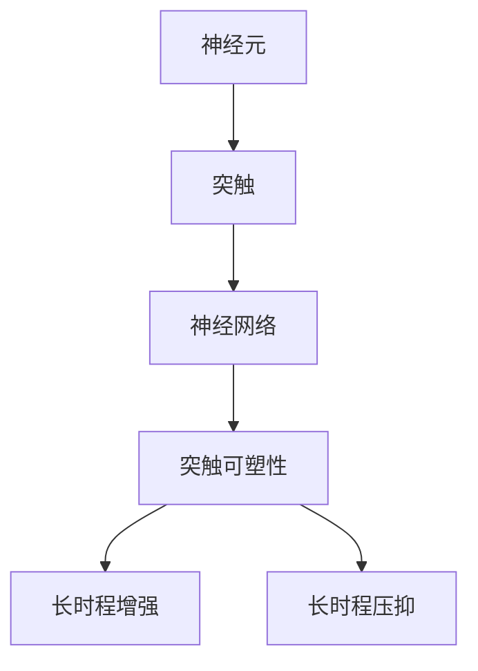
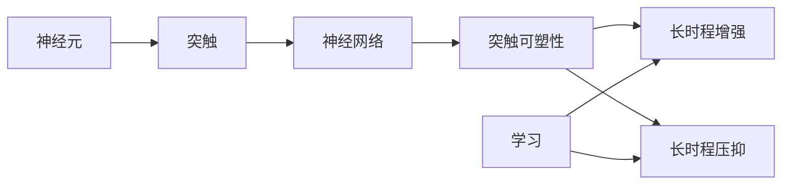

                 

# 知识的神经科学基础：大脑如何学习

## 1. 背景介绍

### 1.1 问题由来

人类学习知识的过程一直是一个备受关注的研究领域。随着神经科学、认知科学和人工智能的快速发展，人们越来越希望能够深入理解大脑是如何学习和存储知识的。在大脑中，神经元通过连接和协同工作，形成了复杂的神经网络结构。这些神经网络结构不仅能够处理信息，还能够存储和记忆这些信息。但是，这一过程究竟是如何发生的，又有哪些机制在其中起作用，仍是一个复杂而深刻的问题。

### 1.2 问题核心关键点

在探究大脑如何学习时，我们需要关注以下几个关键点：

1. 神经元之间的连接：神经元通过突触连接传递信息，而这些连接的存在和强度对信息的传递和存储至关重要。
2. 突触的可塑性：突触的强度可以通过学习和经验而改变，这一过程被称为突触可塑性。
3. 神经网络的结构：神经元之间的连接方式和结构对信息的处理和存储有重要影响。
4. 记忆的形成和巩固：大脑如何形成和巩固记忆，以及这些记忆如何被提取和应用。
5. 学习机制：包括经典的学习理论和现代神经科学中的学习模型，如Hebb规则和突触后增强等。

### 1.3 问题研究意义

深入理解大脑的学习机制，不仅有助于揭示人类认知和行为的根本原理，还为人工智能、神经工程和脑机接口等前沿技术的发展提供了重要的理论基础。此外，对于帮助理解和治疗脑疾病、促进教育和提升学习能力也有着重要意义。

## 2. 核心概念与联系

### 2.1 核心概念概述

为了更好地理解大脑的学习机制，我们需要了解一些关键概念：

1. **神经元（Neuron）**：构成神经网络的基本单位，能够接收和传递电信号。
2. **突触（Synapse）**：神经元之间的连接，负责传递电信号或化学物质信号。
3. **神经网络（Neural Network）**：由大量神经元通过突触连接组成的网络，用于处理和存储信息。
4. **突触可塑性（Synaptic Plasticity）**：突触强度的改变，是学习和记忆的基础。
5. **长时程增强（Long-Term Potentiation, LTP）**：一种突触可塑性现象，描述了学习过程中突触强度的增强。
6. **长时程压抑（Long-Term Depression, LTD）**：一种突触可塑性现象，描述了学习过程中突触强度的减弱。

这些概念之间存在着复杂的相互作用和联系，构成了大脑学习的基本框架。以下是一个Mermaid流程图，展示了这些概念之间的联系：



### 2.2 核心概念原理和架构的 Mermaid 流程图



这个流程图展示了神经元、突触和神经网络之间的关系，以及突触可塑性如何通过长时程增强和长时程压抑实现学习过程。

## 3. 核心算法原理 & 具体操作步骤

### 3.1 算法原理概述

大脑的学习过程可以被视为一种信号处理和信息存储的过程。在这一过程中，神经元通过突触传递电信号或化学物质信号，而这些信号的传递和强度变化，构成了学习的核心。

突触可塑性是这一过程的关键机制之一。突触可塑性指的是突触强度的改变，这一过程可以通过增强（增强突触强度）或减弱（减弱突触强度）来实现。长时程增强和长时程压抑是两种常见的突触可塑性现象。长时程增强描述了在学习过程中突触强度的增强，而长时程压抑则描述了突触强度的减弱。

### 3.2 算法步骤详解

#### 3.2.1 数据准备

1. 收集训练数据，确保数据的多样性和代表性。
2. 对数据进行预处理，如归一化、标准化等，以便于模型训练。
3. 将数据划分为训练集、验证集和测试集，以评估模型的性能。

#### 3.2.2 模型构建

1. 选择合适的神经网络架构，如卷积神经网络（CNN）、循环神经网络（RNN）等。
2. 定义模型的损失函数，如交叉熵、均方误差等。
3. 确定模型的优化器，如随机梯度下降（SGD）、Adam等。

#### 3.2.3 模型训练

1. 将数据输入模型，进行前向传播。
2. 计算损失函数，评估模型预测结果与真实结果的差异。
3. 反向传播计算梯度，使用优化器更新模型参数。
4. 重复上述步骤，直至模型收敛或达到预设的迭代次数。

#### 3.2.4 模型评估

1. 使用验证集评估模型的性能。
2. 使用测试集进行最终评估，确保模型的泛化能力。

### 3.3 算法优缺点

#### 3.3.1 优点

1. **高效性**：相比于传统的人类学习方式，神经网络模型可以在较短的时间内处理大量的数据。
2. **可解释性**：神经网络模型可以通过可视化工具（如权重矩阵、激活图等）来解释其决策过程。
3. **灵活性**：神经网络模型可以根据不同的任务和数据进行快速调整和优化。

#### 3.3.2 缺点

1. **复杂性**：神经网络模型的训练和优化过程较为复杂，需要大量计算资源。
2. **过拟合**：在处理复杂任务时，神经网络模型容易出现过拟合现象。
3. **依赖数据**：神经网络模型的性能高度依赖于训练数据的质量和数量。

### 3.4 算法应用领域

神经网络模型已经在许多领域得到了广泛应用，包括但不限于：

1. **图像识别**：如手写数字识别、人脸识别等。
2. **自然语言处理**：如语音识别、机器翻译等。
3. **推荐系统**：如电商推荐、广告推荐等。
4. **游戏AI**：如AlphaGo等。
5. **医疗诊断**：如医学影像分析、基因分析等。

## 4. 数学模型和公式 & 详细讲解

### 4.1 数学模型构建

神经网络模型的数学模型可以表示为：

$$
\hat{y} = f(\hat{w} \cdot x + b)
$$

其中，$f$ 为激活函数，$\hat{w}$ 为权重矩阵，$x$ 为输入向量，$b$ 为偏置向量，$\hat{y}$ 为模型预测输出。

### 4.2 公式推导过程

以单层感知机为例，推导其数学模型：

$$
\hat{y} = f(\hat{w} \cdot x + b)
$$

其中，$f$ 为激活函数，$\hat{w}$ 为权重向量，$x$ 为输入向量，$b$ 为偏置项。激活函数常用的有sigmoid、ReLU等。

对于二分类任务，我们可以定义损失函数为交叉熵损失：

$$
L(y, \hat{y}) = -(y \log \hat{y} + (1-y) \log (1-\hat{y}))
$$

在训练过程中，通过梯度下降等优化算法更新模型参数，最小化损失函数：

$$
\hat{w} = \hat{w} - \eta \nabla_{\hat{w}} L(y, \hat{y})
$$

其中，$\eta$ 为学习率。

### 4.3 案例分析与讲解

以图像识别任务为例，介绍神经网络模型的应用。

1. 数据准备：收集大量标注的图像数据，进行预处理。
2. 模型构建：使用卷积神经网络（CNN）架构，定义损失函数为交叉熵。
3. 模型训练：使用随机梯度下降（SGD）优化器进行模型训练。
4. 模型评估：使用验证集和测试集评估模型性能。

## 5. 项目实践：代码实例和详细解释说明

### 5.1 开发环境搭建

1. 安装Python和相关的依赖包，如TensorFlow、Keras等。
2. 准备训练数据集和验证集。
3. 搭建训练环境，配置GPU或TPU资源。

### 5.2 源代码详细实现

以下是一个使用Keras实现卷积神经网络进行图像分类的示例代码：

```python
from keras.models import Sequential
from keras.layers import Conv2D, MaxPooling2D, Dense, Flatten

# 定义模型
model = Sequential()
model.add(Conv2D(32, (3, 3), activation='relu', input_shape=(28, 28, 1)))
model.add(MaxPooling2D((2, 2)))
model.add(Conv2D(64, (3, 3), activation='relu'))
model.add(MaxPooling2D((2, 2)))
model.add(Flatten())
model.add(Dense(128, activation='relu'))
model.add(Dense(10, activation='softmax'))

# 编译模型
model.compile(optimizer='adam', loss='categorical_crossentropy', metrics=['accuracy'])

# 训练模型
model.fit(x_train, y_train, epochs=10, batch_size=32, validation_data=(x_test, y_test))
```

### 5.3 代码解读与分析

在上述代码中，我们定义了一个包含两个卷积层和两个全连接层的卷积神经网络。其中，卷积层用于提取图像特征，全连接层用于分类。使用adam优化器和交叉熵损失函数进行模型训练，并使用验证集评估模型性能。

## 6. 实际应用场景

### 6.1 智能医疗

在智能医疗领域，神经网络模型可以用于医学影像分析、基因分析等任务。例如，通过卷积神经网络（CNN）对医学影像进行分类和分析，可以提高诊断的准确率和效率。

### 6.2 金融交易

在金融交易领域，神经网络模型可以用于股票预测、风险评估等任务。通过时间序列分析和预测模型，可以提供更精准的市场预测和投资建议。

### 6.3 自动驾驶

在自动驾驶领域，神经网络模型可以用于环境感知、路径规划等任务。通过传感器数据和计算机视觉技术，可以实现更智能的自动驾驶系统。

### 6.4 未来应用展望

随着神经网络模型的不断发展，其在更多领域的应用前景将更加广阔。未来，我们可以期待更多创新应用的涌现，如智能制造、智能交通等。

## 7. 工具和资源推荐

### 7.1 学习资源推荐

1. 《深度学习》书籍：Ian Goodfellow等人所著，系统介绍了深度学习的基本原理和应用。
2. 《神经网络与深度学习》在线课程：由深度学习专家Andrew Ng开设的在线课程，内容详实、深入浅出。
3. TensorFlow官方文档：提供了丰富的学习资源和样例代码，适合快速入门和深入学习。
4. PyTorch官方文档：提供了简单易用的API和丰富的教程，适合快速迭代和优化。

### 7.2 开发工具推荐

1. Jupyter Notebook：免费的交互式笔记本，支持多种编程语言，适合科研和教学。
2. Google Colab：免费的GPU和TPU资源，适合高性能计算和数据处理。
3. TensorBoard：可视化工具，支持实时监控和结果展示。
4. Weights & Biases：模型训练和实验跟踪工具，支持自动记录和可视化。

### 7.3 相关论文推荐

1. Hebb, D. O. (1949). The organization of behavior: A neuropsychological theory. Courier Corporation.
2. Riedel, H., & Van Gerven, M. A. J. (2005). Neural networks for artificial intelligence. Cambridge University Press.
3. Goodfellow, I., Bengio, Y., & Courville, A. (2016). Deep learning. MIT Press.

## 8. 总结：未来发展趋势与挑战

### 8.1 研究成果总结

通过以上分析，我们可以看出，神经网络模型在大脑学习机制方面的研究已经取得了一定的进展，但仍有许多未知和挑战需要解决。未来，我们可以通过更深入的研究和更广泛的应用，进一步推动神经网络模型的发展和应用。

### 8.2 未来发展趋势

1. **更高效的计算**：随着计算能力的提升，神经网络模型的训练和推理效率将得到显著提升。
2. **更精确的模型**：通过更复杂的神经网络架构和更先进的训练算法，神经网络模型将能够处理更复杂和多样化的数据。
3. **更广泛的应用**：神经网络模型将在更多领域得到应用，如智能制造、智能交通等。

### 8.3 面临的挑战

1. **数据瓶颈**：神经网络模型需要大量的数据进行训练，但获取高质量数据的过程往往较为复杂。
2. **计算资源**：神经网络模型训练和推理需要大量的计算资源，如何提高计算效率和降低成本是一个重要挑战。
3. **可解释性**：神经网络模型缺乏可解释性，难以理解其决策过程和内部机制。

### 8.4 研究展望

1. **数据生成和增强**：通过数据生成和增强技术，提高数据多样性和数量，缓解数据瓶颈。
2. **计算优化**：通过模型压缩、量化加速等技术，降低计算资源需求。
3. **可解释性**：通过可视化工具和可解释性技术，增强模型的可解释性。

## 9. 附录：常见问题与解答

**Q1: 神经网络模型如何处理输入数据？**

A: 神经网络模型通过将输入数据转换为向量形式，然后进行向量化处理。例如，对于图像数据，可以使用卷积层和池化层提取特征；对于文本数据，可以使用嵌入层和RNN层处理。

**Q2: 神经网络模型的训练过程中容易出现过拟合，如何缓解这一问题？**

A: 缓解过拟合的方法包括：
1. 数据增强：通过旋转、缩放等操作，扩充训练数据集。
2. 正则化：使用L2正则化、Dropout等技术，防止模型过度拟合。
3. 模型集成：通过集成多个模型，提高模型的泛化能力。

**Q3: 神经网络模型的训练过程需要大量计算资源，如何优化训练过程？**

A: 优化训练过程的方法包括：
1. 模型压缩：使用模型剪枝、参数量化等技术，减小模型规模。
2. 分布式训练：使用分布式计算框架，提高训练效率。
3. 动态调整学习率：通过学习率调度算法，动态调整学习率，提高训练效果。

**Q4: 神经网络模型的可解释性较差，如何提高其可解释性？**

A: 提高神经网络模型可解释性的方法包括：
1. 可视化工具：使用可视化工具，如权重矩阵、激活图等，帮助理解模型的内部机制。
2. 可解释性技术：使用可解释性技术，如Attention机制、LIME等，提高模型的可解释性。
3. 模型简化：通过简化模型结构，降低模型的复杂度，提高可解释性。

---

作者：禅与计算机程序设计艺术 / Zen and the Art of Computer Programming

