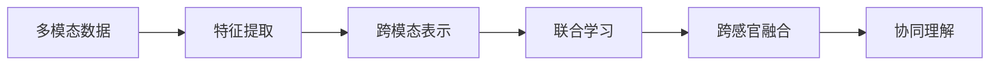

                 

# 知识的跨感官整合：多模态学习的优势

> 关键词：多模态学习,多感官融合,深度学习,认知神经科学,计算机视觉,自然语言处理,语音识别

## 1. 背景介绍

随着人工智能技术的不断进步，尤其是深度学习模型的快速发展，多模态学习成为了当前的热门研究领域。多模态学习是指在处理多种形式的数据（如文本、图像、声音等）时，将这些数据类型进行联合学习和整合，从而实现跨感官的协同表示和理解。多模态学习在诸如自动驾驶、医疗诊断、智能交互等领域中发挥了重要作用，展现了其强大的应用潜力。

### 1.1 问题由来

在传统的机器学习中，数据通常是以单一模态（如文本、图像或声音）的形式存在。这种单一模态的学习方式存在一定的局限性：

- 单一模态的数据往往无法充分表达复杂的信息，尤其是在需要综合不同感官信息的情况下。
- 单一模态的模型可能无法有效处理噪声或不确定性，导致输出结果的鲁棒性不足。
- 随着技术的发展，人们越来越多地依赖于多感官数据的融合，例如在智能家居中，传感器可以同时收集声音、图像和位置信息。

因此，多模态学习作为解决这些问题的关键方法，逐渐受到广泛的关注。通过多模态学习，模型可以从不同感官的数据中提取更有意义的特征，提升整体性能和泛化能力。

### 1.2 问题核心关键点

多模态学习的主要目标是通过联合学习和融合不同模态的数据，使模型能够更好地理解复杂场景和问题。核心关键点包括：

- **联合学习**：将不同模态的数据联合在一起，共同训练一个模型。
- **跨感官融合**：在不同模态的数据间进行特征融合，提高模型的感知能力和泛化能力。
- **跨模态表示**：将不同模态的数据转换为统一的表示形式，方便进行融合。
- **协同理解**：在模型中实现不同模态数据的协同理解，增强模型的解释性和可理解性。

这些关键点共同构成了多模态学习的基础框架，为其在实际应用中的广泛应用奠定了基础。

## 2. 核心概念与联系

### 2.1 核心概念概述

为了更好地理解多模态学习，我们将介绍几个关键概念：

- **多模态学习（Multimodal Learning）**：将多种形式的数据联合起来进行学习的技术。
- **联合学习（Joint Learning）**：将不同模态的数据作为同一模型的一部分，共同进行训练。
- **跨感官融合（Cross-Sensory Fusion）**：通过特征提取和融合，将不同感官的数据转换为统一的表示形式，方便模型进行联合学习。
- **跨模态表示（Cross-Modal Representation）**：将不同模态的数据映射到统一的表示空间，方便模型进行协同理解。
- **协同理解（Coherent Understanding）**：在模型中实现不同模态数据的联合推理和解释，增强模型的可解释性和可靠性。

这些概念之间通过联合学习、跨感官融合和跨模态表示相互联系，共同构成了多模态学习的核心框架。

### 2.2 核心概念原理和架构的 Mermaid 流程图



这个流程图展示了多模态学习的核心架构：

1. **多模态数据**：不同感官的数据被收集并送入模型。
2. **特征提取**：不同模态的数据被分别进行特征提取。
3. **跨模态表示**：不同模态的特征被映射到统一的表示空间。
4. **联合学习**：不同模态的特征在统一的模型中进行联合训练。
5. **跨感官融合**：不同模态的特征在模型中进一步融合。
6. **协同理解**：不同模态的数据在模型中实现协同推理和理解。

## 3. 核心算法原理 & 具体操作步骤

### 3.1 算法原理概述

多模态学习的核心在于联合学习和跨感官融合。其基本思想是通过将不同模态的数据融合在一起，构建一个统一的模型，从而提高模型的感知能力和泛化能力。常见的多模态学习方法包括特征融合、跨模态学习、协同表示等。

### 3.2 算法步骤详解

以下是一个典型的多模态学习流程：

1. **数据收集**：收集来自不同感官的数据，如文本、图像、声音等。
2. **特征提取**：对不同模态的数据进行特征提取，转换为模型可以处理的数值形式。
3. **跨模态表示**：将不同模态的特征映射到统一的表示空间，方便模型进行联合学习。
4. **联合学习**：使用统一的模型对不同模态的数据进行联合训练。
5. **跨感官融合**：在模型中实现不同模态特征的进一步融合。
6. **协同理解**：在模型中实现不同模态数据的联合推理和理解。

具体算法步骤如下：

**Step 1: 数据准备**
- 收集来自不同感官的数据，如文本、图像、声音等。
- 对数据进行预处理，包括清洗、标注、分片等。

**Step 2: 特征提取**
- 使用预训练的特征提取器（如CNN、RNN、Transformer等）对不同模态的数据进行特征提取。
- 将不同模态的特征转换为模型可以处理的数值形式。

**Step 3: 跨模态表示**
- 使用线性映射、非线性映射（如PCA、t-SNE等）将不同模态的特征映射到统一的表示空间。
- 确保不同模态的特征在统一空间中能够协同表示。

**Step 4: 联合学习**
- 构建一个多模态的联合学习模型，如双流模型、三流模型等。
- 使用联合损失函数对模型进行训练，确保不同模态的特征在模型中能够协同学习。

**Step 5: 跨感官融合**
- 在模型中实现不同模态特征的进一步融合，如使用Attention机制或融合操作（如拼接、拼接后的加权平均等）。
- 确保融合后的特征能够充分表达多模态的信息。

**Step 6: 协同理解**
- 在模型中实现不同模态数据的联合推理和理解，如使用注意力机制、融合后的特征进行联合推理。
- 增强模型的解释性和可靠性，使其能够更好地理解复杂场景和问题。

### 3.3 算法优缺点

多模态学习在提升模型性能和泛化能力方面具有显著优势，但也存在一些局限性：

**优点：**

- **综合信息**：多模态学习能够综合不同感官的数据，提升模型的感知能力。
- **鲁棒性增强**：多模态学习能够更好地处理噪声和不确定性，提高模型的鲁棒性。
- **协同理解**：多模态学习能够实现不同模态数据的联合推理和理解，增强模型的解释性和可理解性。

**缺点：**

- **数据复杂性**：多模态学习需要收集和处理多种形式的数据，增加了数据获取和处理的复杂性。
- **计算成本**：多模态学习需要处理多种形式的数据，计算成本较高。
- **模型复杂性**：多模态学习需要构建和优化复杂的联合学习模型，增加了模型设计和调优的难度。

### 3.4 算法应用领域

多模态学习已经在多个领域得到了广泛应用，包括：

- **智能家居**：通过融合声音、图像和位置信息，实现智能家居系统的自动化控制。
- **自动驾驶**：通过融合雷达、摄像头和激光雷达的信息，实现自动驾驶车辆的感知和决策。
- **医疗诊断**：通过融合病人的文本数据、图像数据和生理数据，实现更准确的医疗诊断。
- **情感分析**：通过融合语音、图像和文本数据，实现对用户情感的全面分析。
- **虚拟现实**：通过融合视觉、听觉和触觉信息，实现更逼真的虚拟现实体验。

## 4. 数学模型和公式 & 详细讲解

### 4.1 数学模型构建

多模态学习的数学模型通常包括以下几个部分：

- **特征提取**：将不同模态的数据转换为特征向量，使用线性映射或非线性映射。
- **跨模态表示**：将不同模态的特征向量映射到统一的表示空间。
- **联合损失函数**：定义联合学习中的损失函数，如多任务损失函数、多模态损失函数等。

### 4.2 公式推导过程

**特征提取**

假设有一个文本-图像联合学习任务，使用预训练的特征提取器分别对文本和图像进行特征提取。文本使用双向LSTM提取特征，图像使用CNN提取特征。

对于文本特征 $X_t$，使用双向LSTM提取特征，得到特征向量 $f_t$。

对于图像特征 $X_i$，使用CNN提取特征，得到特征向量 $f_i$。

**跨模态表示**

使用线性映射将文本特征 $f_t$ 和图像特征 $f_i$ 映射到统一的表示空间，得到联合表示 $h$。

$$ h = \begin{bmatrix} f_t \\ W f_i \end{bmatrix} $$

其中 $W$ 为跨模态映射矩阵，可以是随机初始化或使用预训练的权重。

**联合损失函数**

定义联合学习中的损失函数，如多任务损失函数，表示为：

$$ \mathcal{L} = \mathcal{L}_t + \mathcal{L}_i + \mathcal{L}_{ti} $$

其中 $\mathcal{L}_t$ 为文本任务损失，$\mathcal{L}_i$ 为图像任务损失，$\mathcal{L}_{ti}$ 为联合任务损失。

**公式推导**

以文本-图像联合学习的分类任务为例，推导联合损失函数 $\mathcal{L}$。

假设文本任务为二分类任务，图像任务也为二分类任务。

对于文本特征 $f_t$，使用softmax函数得到文本任务的预测概率 $p_t$：

$$ p_t = \text{softmax}(f_t W_t) $$

其中 $W_t$ 为文本任务分类器的权重矩阵。

对于图像特征 $f_i$，使用softmax函数得到图像任务的预测概率 $p_i$：

$$ p_i = \text{softmax}(f_i W_i) $$

其中 $W_i$ 为图像任务分类器的权重矩阵。

对于联合任务，定义联合损失函数 $\mathcal{L}_{ti}$ 为交叉熵损失函数：

$$ \mathcal{L}_{ti} = -\sum_{j=1}^2 (y_j \log p_{ti}) $$

其中 $y_j$ 为联合任务的标签，$p_{ti}$ 为联合任务的预测概率。

最终，联合损失函数 $\mathcal{L}$ 为：

$$ \mathcal{L} = \mathcal{L}_t + \mathcal{L}_i + \mathcal{L}_{ti} $$

### 4.3 案例分析与讲解

以智能家居系统的语音图像联合学习为例，介绍多模态学习的具体应用。

**数据收集**

智能家居系统收集用户的语音指令、图像数据和位置信息。

**特征提取**

语音指令使用预训练的语音识别模型进行特征提取，得到语音特征 $f_v$。

图像数据使用预训练的图像识别模型进行特征提取，得到图像特征 $f_i$。

**跨模态表示**

使用线性映射将语音特征 $f_v$ 和图像特征 $f_i$ 映射到统一的表示空间，得到联合表示 $h$。

$$ h = \begin{bmatrix} f_v \\ W f_i \end{bmatrix} $$

**联合学习**

构建联合学习模型，使用交叉熵损失函数进行训练，确保语音指令和图像数据在模型中能够协同学习。

**跨感官融合**

在模型中实现语音和图像特征的融合，使用Attention机制或融合操作，得到融合后的特征 $h'$。

**协同理解**

在模型中实现语音和图像数据的联合推理和理解，使用注意力机制或融合后的特征进行联合推理。

最终，智能家居系统能够根据用户语音指令和图像数据，实现房间照明、空调等设备的自动化控制。

## 5. 项目实践：代码实例和详细解释说明

### 5.1 开发环境搭建

在进行多模态学习项目实践前，需要准备好开发环境。以下是使用Python进行TensorFlow开发的环境配置流程：

1. 安装Anaconda：从官网下载并安装Anaconda，用于创建独立的Python环境。

2. 创建并激活虚拟环境：
```bash
conda create -n multimodal-env python=3.8 
conda activate multimodal-env
```

3. 安装TensorFlow：根据CUDA版本，从官网获取对应的安装命令。例如：
```bash
conda install tensorflow tensorflow-gpu -c conda-forge -c pypi
```

4. 安装Keras和PyTorch：
```bash
pip install keras torch torchvision torchaudio
```

5. 安装TensorFlow Addons：
```bash
pip install tensorflow-addons
```

6. 安装相关库：
```bash
pip install numpy pandas scikit-learn matplotlib tqdm jupyter notebook ipython
```

完成上述步骤后，即可在`multimodal-env`环境中开始多模态学习实践。

### 5.2 源代码详细实现

下面以文本-图像联合学习任务为例，给出使用TensorFlow实现多模态学习的过程。

首先，定义特征提取函数：

```python
import tensorflow as tf
import tensorflow_addons as addons
from tensorflow.keras.layers import LSTM, Dense, TimeDistributed, Attention

def build_model(text_len, img_len, n_words, n_classes):
    inputs = tf.keras.Input(shape=(text_len, ), dtype='int32', name='text_input')
    text = LSTM(256, return_sequences=True, mask_zero=True)(inputs)
    text = TimeDistributed(Dense(128))(text)
    
    inputs = tf.keras.Input(shape=(img_len, img_width, img_channels), dtype='float32', name='image_input')
    image = addons.layers.Convolution2D(Dense(128), (3,3), padding='same')(inputs)
    image = addons.layers.GlobalMaxPooling2D()(image)
    
    attention = addons.layers.Attention()([text, image])
    outputs = Dense(n_classes, activation='softmax')(attention)
    
    model = tf.keras.Model(inputs=[inputs, tf.keras.Input(shape=(text_len, ), dtype='int32', name='text_input')], outputs=outputs)
    return model
```

然后，定义训练和评估函数：

```python
def train(model, data_train, data_val, data_test, epochs, batch_size, learning_rate):
    model.compile(optimizer=tf.keras.optimizers.Adam(learning_rate), loss='categorical_crossentropy', metrics=['accuracy'])
    
    history = model.fit(data_train, epochs=epochs, batch_size=batch_size, validation_data=data_val, verbose=1)
    loss, accuracy = model.evaluate(data_test, verbose=0)
    
    print(f'Loss: {loss:.4f}')
    print(f'Accuracy: {accuracy:.4f}')
    
    return history

def evaluate(model, data_test, batch_size):
    loss, accuracy = model.evaluate(data_test, verbose=0)
    
    print(f'Loss: {loss:.4f}')
    print(f'Accuracy: {accuracy:.4f}')
    
    return loss, accuracy
```

最后，启动训练流程并在测试集上评估：

```python
text_len = 128
img_len = 32
img_width = 64
img_channels = 3
n_words = 1000
n_classes = 10

# 构建模型
model = build_model(text_len, img_len, n_words, n_classes)

# 加载数据集
data_train, data_val, data_test = load_data(text_len, img_len, img_width, img_channels, n_words, n_classes)

# 训练模型
history = train(model, data_train, data_val, data_test, epochs=10, batch_size=32, learning_rate=0.001)

# 评估模型
loss, accuracy = evaluate(model, data_test, batch_size=32)

print(f'Final Loss: {loss:.4f}')
print(f'Final Accuracy: {accuracy:.4f}')
```

以上就是使用TensorFlow对文本-图像联合学习任务进行多模态学习的完整代码实现。可以看到，通过TensorFlow的高级API，构建多模态模型的代码简洁高效。

### 5.3 代码解读与分析

让我们再详细解读一下关键代码的实现细节：

**build_model函数**：
- 定义模型的输入层，分别接收文本和图像数据。
- 对文本数据进行LSTM特征提取，使用Dense层降维。
- 对图像数据进行卷积操作，使用GlobalMaxPooling2D进行特征提取。
- 使用Attention层将文本和图像特征进行融合。
- 输出层为Dense层，使用softmax函数进行分类。

**train函数**：
- 使用Adam优化器编译模型，定义交叉熵损失函数。
- 使用fit函数对模型进行训练，记录训练过程中的损失和准确率。

**evaluate函数**：
- 使用evaluate函数对模型进行测试，输出测试集上的损失和准确率。

**训练流程**：
- 定义模型参数，包括文本和图像数据的长度、维度和通道数。
- 构建模型。
- 加载数据集，包括训练集、验证集和测试集。
- 训练模型，记录训练过程中的损失和准确率。
- 在测试集上评估模型，输出最终损失和准确率。

可以看到，TensorFlow的多模态学习实现非常简单，开发者可以很容易地将各种模型和数据格式进行组合，快速构建多模态模型并进行训练。

当然，工业级的系统实现还需考虑更多因素，如模型裁剪、量化加速、服务化封装等。但核心的多模态学习流程基本与此类似。

## 6. 实际应用场景

### 6.1 智能家居系统

多模态学习在智能家居系统中具有广泛应用，通过融合语音、图像和位置信息，实现房间照明、空调等设备的自动化控制。

在实践中，智能家居系统可以收集用户的语音指令、图像数据和位置信息，使用预训练的语音识别模型和图像识别模型进行特征提取，构建联合学习模型，实现联合训练和跨感官融合。最终，系统能够根据用户语音指令和图像数据，实现房间照明、空调等设备的自动化控制。

### 6.2 自动驾驶

自动驾驶系统通过融合雷达、摄像头和激光雷达的信息，实现车辆的感知和决策。

在实践中，自动驾驶系统可以使用预训练的雷达、摄像头和激光雷达识别模型进行特征提取，构建联合学习模型，实现联合训练和跨感官融合。最终，系统能够根据雷达、摄像头和激光雷达的信息，进行车辆的感知和决策，确保安全行驶。

### 6.3 医疗诊断

医疗诊断系统通过融合病人的文本数据、图像数据和生理数据，实现更准确的医疗诊断。

在实践中，医疗诊断系统可以使用预训练的自然语言处理模型和图像识别模型进行特征提取，构建联合学习模型，实现联合训练和跨感官融合。最终，系统能够根据病人的文本数据、图像数据和生理数据，进行更准确的医疗诊断，提升诊断准确率。

### 6.4 未来应用展望

随着多模态学习技术的不断进步，其在更多领域的应用前景值得期待：

- **虚拟现实**：通过融合视觉、听觉和触觉信息，实现更逼真的虚拟现实体验。
- **增强现实**：通过融合视觉和位置信息，实现更智能的增强现实应用。
- **智能交互**：通过融合语音、图像和位置信息，实现更自然的人机交互。

多模态学习将为人工智能技术带来更多的可能性，推动人类社会的进步和发展。

## 7. 工具和资源推荐

### 7.1 学习资源推荐

为了帮助开发者系统掌握多模态学习理论基础和实践技巧，这里推荐一些优质的学习资源：

1. **《多模态学习：联合学习、融合与表示》（Multimodal Learning: Joint Learning, Fusion, and Representation）**：介绍了多模态学习的核心概念、方法和应用场景。

2. **《深度学习基础：卷积神经网络与自然语言处理》（Deep Learning Basics: Convolutional Neural Networks and Natural Language Processing）**：介绍了多模态学习中的卷积神经网络和自然语言处理技术。

3. **《多模态机器学习》（Multimodal Machine Learning）**：提供了多模态学习的详细教程和实践案例。

4. **CS231n课程：卷积神经网络**：斯坦福大学开设的深度学习课程，详细介绍了卷积神经网络在图像识别中的应用。

5. **《多模态深度学习》（Multimodal Deep Learning）**：介绍了多模态深度学习的基本原理和应用。

通过对这些资源的学习实践，相信你一定能够快速掌握多模态学习的方法，并将其应用于实际问题中。

### 7.2 开发工具推荐

多模态学习开发离不开优秀的工具支持。以下是几款用于多模态学习开发的常用工具：

1. **TensorFlow**：谷歌开源的深度学习框架，提供了丰富的API和工具，支持多模态学习模型的构建和训练。

2. **PyTorch**：Facebook开源的深度学习框架，提供了动态计算图和丰富的模型库，支持多模态学习模型的构建和训练。

3. **Keras**：Google开源的深度学习框架，提供了简洁易用的API，支持多模态学习模型的构建和训练。

4. **TensorFlow Addons**：TensorFlow的扩展库，提供了多模态学习中常用的模块和工具，如Attention、TimeDistributed等。

5. **TensorBoard**：TensorFlow的可视化工具，可以实时监测模型训练状态，并提供丰富的图表呈现方式。

6. **Jupyter Notebook**：开源的交互式笔记本，支持Python代码的编写和执行，非常适合多模态学习模型的开发和调试。

合理利用这些工具，可以显著提升多模态学习任务的开发效率，加快创新迭代的步伐。

### 7.3 相关论文推荐

多模态学习的研究始于学术界，许多经典论文为多模态学习提供了理论和实践指导。以下是几篇奠基性的相关论文，推荐阅读：

1. **《深度多模态学习：框架与挑战》（Deep Multi-modal Learning: Framework and Challenges）**：介绍了多模态学习的框架和挑战，提供了多模态学习中的方法和技术。

2. **《跨模态特征学习：理论、方法和应用》（Cross-Modal Feature Learning: Theory, Methods, and Applications）**：介绍了跨模态特征学习的基本原理和应用场景。

3. **《深度多模态学习：方法、挑战与未来》（Deep Multi-modal Learning: Methods, Challenges, and Future）**：介绍了深度多模态学习的方法和未来发展方向。

4. **《多模态深度学习：方法、模型与应用》（Multimodal Deep Learning: Methods, Models, and Applications）**：提供了多模态深度学习的方法和模型。

5. **《多模态学习：理论与应用》（Multimodal Learning: Theory and Applications）**：介绍了多模态学习的理论和应用。

这些论文代表了大规模多模态学习的发展脉络。通过学习这些前沿成果，可以帮助研究者把握学科前进方向，激发更多的创新灵感。

## 8. 总结：未来发展趋势与挑战

### 8.1 研究成果总结

多模态学习作为一种新兴的深度学习技术，已经取得了显著的进展。通过联合学习和跨感官融合，多模态学习在智能家居、自动驾驶、医疗诊断等多个领域展示了其强大的应用潜力。研究者们从理论和实践两个层面深入探索多模态学习的核心技术，取得了诸多突破。

### 8.2 未来发展趋势

展望未来，多模态学习将呈现以下几个发展趋势：

1. **更加高效的多模态模型**：未来将出现更加高效的多模态模型，如使用混合模型、知识图谱等，提升模型的性能和效率。

2. **更加鲁棒的多模态模型**：未来将出现更加鲁棒的多模态模型，如使用对抗训练、迁移学习等，提高模型的泛化能力和鲁棒性。

3. **更加个性化的多模态模型**：未来将出现更加个性化的多模态模型，如使用个性化推荐系统等，提升用户体验和满意度。

4. **更加智能的多模态模型**：未来将出现更加智能的多模态模型，如使用跨模态推理等，提升模型的理解能力和推理能力。

5. **更加广泛的多模态应用**：未来将出现更加广泛的多模态应用，如虚拟现实、增强现实等，推动多模态技术的普及和应用。

6. **更加灵活的多模态模型**：未来将出现更加灵活的多模态模型，如使用多任务学习等，提高模型的任务泛化能力和应用场景覆盖率。

以上趋势展示了多模态学习的广阔前景。这些方向的探索发展，必将进一步推动多模态技术的进步，为人工智能技术带来更多的可能。

### 8.3 面临的挑战

尽管多模态学习技术取得了显著进展，但仍面临诸多挑战：

1. **数据复杂性**：多模态学习需要处理多种形式的数据，增加了数据获取和处理的复杂性。

2. **计算成本**：多模态学习需要处理多种形式的数据，计算成本较高。

3. **模型复杂性**：多模态学习需要构建和优化复杂的联合学习模型，增加了模型设计和调优的难度。

4. **鲁棒性不足**：多模态学习模型在面对噪声和不确定性时，泛化能力和鲁棒性仍需进一步提升。

5. **可解释性不足**：多模态学习模型的内部工作机制和决策逻辑不够透明，难以进行解释和调试。

6. **安全性不足**：多模态学习模型可能学习到有害信息，给实际应用带来安全隐患。

这些挑战需要研究者从多个层面进行探索和解决，才能推动多模态技术的持续进步。

### 8.4 研究展望

未来的研究将在以下几个方面寻求新的突破：

1. **无监督和半监督多模态学习**：探索无监督和半监督多模态学习方法，摆脱对大规模标注数据的依赖，充分利用非结构化数据。

2. **参数高效和多任务多模态学习**：开发更加参数高效和多任务多模态学习方法，提高模型的可扩展性和泛化能力。

3. **跨模态推理和知识图谱**：引入跨模态推理和知识图谱技术，增强多模态模型的理解和推理能力。

4. **多模态迁移学习和多任务学习**：探索多模态迁移学习和多任务学习技术，提高模型的跨领域迁移能力和任务泛化能力。

5. **模型压缩和加速**：开发模型压缩和加速技术，提高多模态模型的计算效率和资源利用率。

6. **鲁棒性和可解释性**：增强多模态模型的鲁棒性和可解释性，确保模型在实际应用中的可靠性和透明性。

这些研究方向的探索，必将引领多模态学习技术迈向更高的台阶，为人工智能技术带来更多的突破和发展。

## 9. 附录：常见问题与解答

**Q1: 什么是多模态学习？**

A: 多模态学习是一种深度学习技术，通过联合学习和融合不同模态的数据，使模型能够更好地理解复杂场景和问题。常见的模态包括文本、图像、声音等。

**Q2: 多模态学习有哪些优点？**

A: 多模态学习的主要优点包括：

- 综合信息：多模态学习能够综合不同感官的数据，提升模型的感知能力。

- 鲁棒性增强：多模态学习能够更好地处理噪声和不确定性，提高模型的鲁棒性。

- 协同理解：多模态学习能够实现不同模态数据的联合推理和理解，增强模型的解释性和可理解性。

**Q3: 多模态学习有哪些挑战？**

A: 多模态学习面临的主要挑战包括：

- 数据复杂性：多模态学习需要处理多种形式的数据，增加了数据获取和处理的复杂性。

- 计算成本：多模态学习需要处理多种形式的数据，计算成本较高。

- 模型复杂性：多模态学习需要构建和优化复杂的联合学习模型，增加了模型设计和调优的难度。

- 鲁棒性不足：多模态学习模型在面对噪声和不确定性时，泛化能力和鲁棒性仍需进一步提升。

- 可解释性不足：多模态学习模型的内部工作机制和决策逻辑不够透明，难以进行解释和调试。

- 安全性不足：多模态学习模型可能学习到有害信息，给实际应用带来安全隐患。

通过了解这些挑战，我们可以更好地应对多模态学习中的困难，推动技术的发展和应用。

**Q4: 多模态学习有哪些应用场景？**

A: 多模态学习已经在多个领域得到了广泛应用，包括：

- 智能家居系统：通过融合语音、图像和位置信息，实现房间照明、空调等设备的自动化控制。

- 自动驾驶：通过融合雷达、摄像头和激光雷达的信息，实现车辆的感知和决策。

- 医疗诊断：通过融合病人的文本数据、图像数据和生理数据，实现更准确的医疗诊断。

- 情感分析：通过融合语音、图像和文本数据，实现对用户情感的全面分析。

- 虚拟现实：通过融合视觉、听觉和触觉信息，实现更逼真的虚拟现实体验。

- 增强现实：通过融合视觉和位置信息，实现更智能的增强现实应用。

- 智能交互：通过融合语音、图像和位置信息，实现更自然的人机交互。

这些应用场景展示了多模态学习的广阔前景，未来将有更多领域受益于多模态学习技术。

**Q5: 多模态学习有哪些学习资源推荐？**

A: 以下是一些推荐的学习资源：

- 《多模态学习：联合学习、融合与表示》

- 《深度学习基础：卷积神经网络与自然语言处理》

- 《多模态机器学习》

- CS231n课程：卷积神经网络

- 《多模态深度学习》

这些资源可以帮助开发者系统掌握多模态学习理论基础和实践技巧，加速多模态学习技术的应用。

**Q6: 多模态学习有哪些开发工具推荐？**

A: 以下是一些推荐的开发工具：

- TensorFlow

- PyTorch

- Keras

- TensorFlow Addons

- TensorBoard

- Jupyter Notebook

这些工具可以大大提升多模态学习任务的开发效率，加快创新迭代的步伐。

**Q7: 多模态学习有哪些相关论文推荐？**

A: 以下是一些推荐的论文：

- 《深度多模态学习：框架与挑战》

- 《跨模态特征学习：理论、方法和应用》

- 《深度多模态学习：方法、挑战与未来》

- 《多模态深度学习：方法、模型与应用》

- 《多模态学习：理论与应用》

这些论文代表了大规模多模态学习的发展脉络，为多模态学习的研究提供了理论和实践指导。

---

作者：禅与计算机程序设计艺术 / Zen and the Art of Computer Programming

