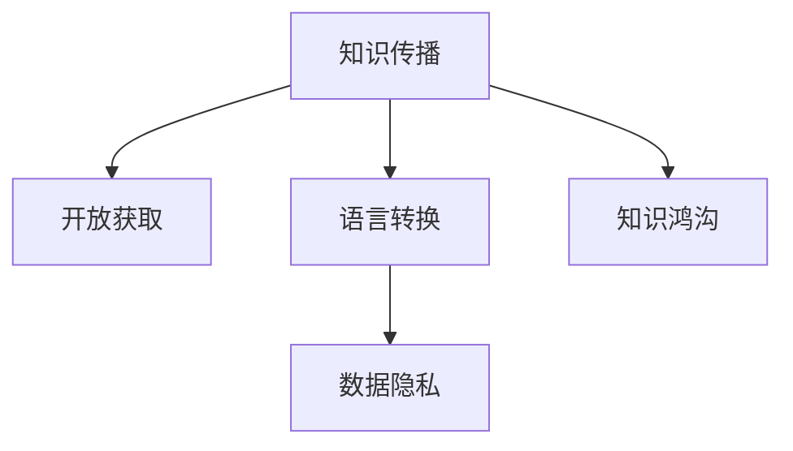

                 

# 知识的跨文化传播：全球化时代的挑战

在信息技术迅猛发展的今天，知识的传播和分享已不再受地域限制。全球化时代，各国文化、技术、经济交流日益频繁，知识的跨文化传播成为连接不同国家、不同民族的重要桥梁。然而，知识的跨文化传播并非没有挑战。本文将从核心概念与联系、核心算法原理与具体操作步骤、实际应用场景等多个维度，探讨全球化时代知识跨文化传播的现状与挑战，并提出相应的解决方案。

## 1. 背景介绍

### 1.1 问题由来

随着互联网和社交媒体的普及，全球化的知识传播已经成为现实。各国科研机构、企业和个人通过开放获取、学术交流、商业合作等多种方式，共享知识和研究成果，推动科技和社会的进步。然而，知识的跨文化传播也面临着诸多挑战，如文化差异、语言障碍、数据隐私、知识鸿沟等问题。

### 1.2 问题核心关键点

知识跨文化传播的关键点包括：

- **文化差异**：不同国家和地区的文化背景、价值观、习惯等差异，可能影响知识的接受和理解。
- **语言障碍**：语言是知识传播的重要载体，但不同语言之间的转换和理解障碍，限制了知识的普及和应用。
- **数据隐私**：在跨文化传播中，如何保护数据隐私和知识产权，是亟需解决的问题。
- **知识鸿沟**：全球范围内，不同地区和国家在科技、教育、医疗等领域存在显著的知识鸿沟，影响知识的公平分配和共享。

### 1.3 问题研究意义

全球化时代的知识跨文化传播，不仅促进了国际科研合作和创新，也加速了全球经济发展和社会进步。通过解决知识传播中的挑战，可以促进各国间的深度交流与合作，推动共同发展和繁荣。

## 2. 核心概念与联系

### 2.1 核心概念概述

为更好地理解知识的跨文化传播，本节将介绍几个核心概念：

- **知识传播**：通过多种方式，将知识从发送者传递到接收者的过程，包括学术交流、出版物发布、在线课程、社交媒体等。
- **开放获取**：在学术和科研成果中，通过开放获取平台，使所有人都能免费访问和使用的知识传播方式。
- **语言转换**：通过自动翻译、同声传译等技术，将知识从一种语言转换为另一种语言，促进全球范围的交流。
- **数据隐私**：在知识传播过程中，如何保护数据隐私，避免敏感信息泄露，是重要课题。
- **知识鸿沟**：由于地理位置、经济水平、教育资源等因素，不同地区和国家在知识和技能上的差异。

这些核心概念之间的逻辑关系可以通过以下Mermaid流程图来展示：



这个流程图展示了几大核心概念之间的联系：

1. 知识传播是基础，包括开放获取、语言转换等多种形式。
2. 语言转换是实现跨文化传播的重要技术手段。
3. 数据隐私是知识传播中需要重点保护的内容。
4. 知识鸿沟是全球化知识传播的重要障碍。

这些概念共同构成了全球化时代知识传播的基本框架，帮助我们理解和解决知识跨文化传播中的问题。

## 3. 核心算法原理 & 具体操作步骤

### 3.1 算法原理概述

知识的跨文化传播，通常基于以下几个步骤：

1. **知识收集**：从各类来源收集知识，包括学术论文、专利、书籍、视频等。
2. **语言转换**：通过翻译技术，将知识从源语言转换为目标语言。
3. **知识传播**：将转换后的知识，通过开放获取平台、社交媒体、在线课程等方式传播出去。
4. **知识应用**：接收者通过应用新知识，推动技术进步、经济增长、社会进步。

### 3.2 算法步骤详解

**Step 1: 收集知识源数据**
- 从学术数据库、专利库、开放获取平台、社交媒体等多种来源，收集知识源数据。
- 确保数据的质量和完整性，选择权威和可靠的来源。

**Step 2: 进行语言转换**
- 使用机器翻译或人工翻译，将知识从源语言转换为目标语言。
- 选择适合的知识类型和领域的翻译模型，如法律文档、科技论文、医学资料等。

**Step 3: 选择知识传播渠道**
- 根据目标受众的特点，选择合适的知识传播渠道。
- 开放获取平台如arXiv、PubMed等，适合科研领域；社交媒体如Twitter、Facebook等，适合大众传播；在线课程如Coursera、edX等，适合教育领域。

**Step 4: 评估知识传播效果**
- 通过定量分析（如访问量、下载量、引用量等）和定性分析（如用户反馈、评价等），评估知识传播效果。
- 收集数据，分析知识传播的覆盖范围和影响力。

**Step 5: 解决知识鸿沟**
- 针对知识鸿沟问题，采取多种措施，如提供免费在线课程、建立国际合作项目、培训本地人才等。
- 推动各国政府和机构加强合作，共享知识和资源。

### 3.3 算法优缺点

知识跨文化传播的主要优点包括：

1. **促进国际合作**：通过知识共享，各国科研机构和企业能够合作解决共同问题，推动技术创新。
2. **加速经济发展**：全球化知识传播，有助于技术转移和知识应用，提升各国经济发展水平。
3. **提升社会进步**：通过知识传播，改善教育、医疗、环境保护等领域的知识和技能水平，推动社会进步。

同时，该方法也存在一定的局限性：

1. **语言转换误差**：机器翻译在复杂语境下的翻译质量有限，可能影响知识的准确性。
2. **数据隐私风险**：开放获取平台和社交媒体上的数据可能面临隐私泄露的风险。
3. **知识鸿沟依然存在**：即使知识传播效果好，不同地区的知识鸿沟依然难以完全消除。

尽管存在这些局限性，但全球化知识传播的巨大价值，使得其成为不可逆转的趋势。未来相关研究的方向，仍在于如何提高语言转换的质量，保护数据隐私，缩小知识鸿沟。

### 3.4 算法应用领域

全球化知识传播已经在多个领域得到广泛应用，例如：

- **科研合作**：通过开放获取平台和学术交流，各国科研机构能够共享研究成果，共同推进科学前沿。
- **教育资源**：开放在线课程平台，提供免费的学习资源，帮助发展中国家提升教育水平。
- **医疗健康**：通过医学文献的翻译和传播，提升全球医疗健康水平，推动健康普惠。
- **环境保护**：共享环境保护技术和知识，推动全球可持续发展。

除了这些经典应用外，全球化知识传播还将在更多领域得到应用，如文化交流、社会治理、经济政策等，为人类社会的繁荣和发展贡献力量。

## 4. 数学模型和公式 & 详细讲解  
### 4.1 数学模型构建

知识跨文化传播的数学模型可以简单表示为：

$$
\text{传播效果} = f(\text{知识源质量}, \text{翻译质量}, \text{传播渠道选择}, \text{目标受众需求})
$$

其中，$f$表示一个复杂的函数，反映了知识传播的效果。

### 4.2 公式推导过程

为了更好地理解和评估知识传播效果，我们可以使用以下公式推导：

$$
\text{传播效果} = \text{知识源质量} \times \text{翻译质量} \times \text{传播渠道选择} \times \text{目标受众需求}
$$

在上述公式中，知识源质量、翻译质量、传播渠道选择和目标受众需求都是影响知识传播效果的重要因素。具体而言：

- 知识源质量：高质量的知识源能够提供更有价值和可靠的信息。
- 翻译质量：准确的翻译能够保证知识的正确传达。
- 传播渠道选择：选择合适的传播渠道，能够最大化知识的覆盖面和影响力。
- 目标受众需求：了解受众的需求和偏好，能够更好地满足其知识需求。

### 4.3 案例分析与讲解

以医学知识传播为例，分析不同因素对传播效果的影响。

- 知识源质量：来自权威医学期刊和会议的论文，通常具有较高的可信度。
- 翻译质量：使用专业的医学翻译团队，保证翻译的准确性和专业性。
- 传播渠道选择：通过PubMed和MedRxiv等开放获取平台，以及社交媒体和在线论坛，扩大知识的传播范围。
- 目标受众需求：针对不同国家和地区的医学需求，提供针对性的翻译和传播策略。

通过案例分析，可以看出，知识传播的效果取决于多个因素的综合作用。只有全面优化各个环节，才能达到理想的知识传播效果。

## 5. 项目实践：代码实例和详细解释说明
### 5.1 开发环境搭建

在进行知识传播实践前，我们需要准备好开发环境。以下是使用Python进行开发的Python环境配置流程：

1. 安装Anaconda：从官网下载并安装Anaconda，用于创建独立的Python环境。

2. 创建并激活虚拟环境：
```bash
conda create -n knowledge-env python=3.8 
conda activate knowledge-env
```

3. 安装相关Python包：
```bash
pip install numpy pandas requests beautifulsoup4 nltk transformers
```

4. 安装相关语言转换工具：
```bash
conda install openai
```

完成上述步骤后，即可在`knowledge-env`环境中开始知识传播实践。

### 5.2 源代码详细实现

这里以机器翻译工具OpenAI的GPT-3为例，展示如何实现知识的跨文化传播。

```python
import openai

# 初始化OpenAI API密钥
openai.api_key = "your_api_key"

# 翻译函数
def translate_text(text, source_lang, target_lang):
    response = openai.Completion.create(
        engine="text-davinci-003",
        prompt=f"Translate the following text from {source_lang} to {target_lang}: {text}",
        max_tokens=500
    )
    return response.choices[0].text

# 测试翻译效果
text = "这是一个测试文本。"
source_lang = "zh-CN"
target_lang = "en"
translated_text = translate_text(text, source_lang, target_lang)
print(f"原始文本：{text}")
print(f"翻译后的文本：{translated_text}")
```

在上述代码中，我们首先初始化了OpenAI的API密钥，然后定义了一个翻译函数`translate_text`，使用GPT-3模型进行文本翻译。最后，我们测试了翻译效果，输出原始文本和翻译后的文本。

### 5.3 代码解读与分析

这段代码展示了使用OpenAI GPT-3进行机器翻译的简单实现。通过OpenAI提供的API，我们可以方便地将任意文本从一种语言翻译成另一种语言，促进知识的跨文化传播。

## 6. 实际应用场景
### 6.1 全球科研合作平台

全球科研合作平台，如arXiv、PubMed等，通过开放获取学术论文和研究成果，促进了全球科研人员的交流与合作。科研人员可以通过平台获取最新的研究成果，参与国际学术会议，进行联合研究项目。

### 6.2 免费在线课程平台

在线课程平台，如Coursera、edX等，提供高质量的免费在线课程，帮助全球学生和专业人士提升知识和技能。这些平台通常支持多种语言，方便不同地区的学生学习。

### 6.3 跨国医疗健康项目

跨国医疗健康项目，如世界卫生组织（WHO）的疾病监测项目，通过共享医学文献和知识，提升全球医疗健康水平。各国科研机构和企业合作，共同研究和解决全球性的健康问题。

### 6.4 未来应用展望

伴随技术的发展，全球化知识传播将呈现以下几个趋势：

1. **深度学习技术的应用**：基于深度学习的翻译和知识抽取技术，将进一步提升知识的跨文化传播质量。
2. **跨语言自然语言处理**：多语言自然语言处理技术的发展，将使知识传播更加便捷和高效。
3. **知识图谱的构建**：通过知识图谱技术，构建全球知识网络，方便知识检索和共享。
4. **区块链技术的应用**：利用区块链技术，保护数据隐私和版权，提升知识传播的可信度。
5. **人工智能与人类协作**：未来，人工智能将更多地与人类协作，提高知识传播的准确性和效率。

这些趋势预示着全球化知识传播将迎来新的发展机遇，为人类社会的繁荣和进步贡献力量。

## 7. 工具和资源推荐
### 7.1 学习资源推荐

为了帮助开发者系统掌握全球化知识传播的理论基础和实践技巧，这里推荐一些优质的学习资源：

1. 《全球化知识传播》系列博文：由知识传播专家撰写，深入浅出地介绍了全球化知识传播的理论基础和实践方法。

2. 《全球化下的科学研究》课程：斯坦福大学开设的科学研究课程，探讨全球化对科研工作的影响，介绍国际科研合作平台和项目。

3. 《开放获取与知识共享》书籍：详细介绍了开放获取的原理、实践和未来发展方向，帮助理解全球化知识传播的机制。

4. OpenAI官方文档：提供GPT-3等模型的详细介绍和使用方法，是进行机器翻译等知识传播任务的重要资源。

5. WHO全球健康信息平台：世界卫生组织官方网站，提供全球健康相关的知识和信息资源。

通过对这些资源的学习实践，相信你一定能够快速掌握全球化知识传播的理论基础和实践技巧，用于解决实际的跨文化传播问题。

### 7.2 开发工具推荐

高效的开发离不开优秀的工具支持。以下是几款用于知识传播开发的常用工具：

1. Python：灵活易用的编程语言，广泛用于科学计算、数据分析等领域。
2. Anaconda：Python环境管理工具，方便创建和管理Python虚拟环境。
3. OpenAI GPT-3：领先的机器翻译和文本生成模型，支持多种语言的翻译和处理。
4. Jupyter Notebook：交互式编程工具，支持Python等编程语言的快速开发和测试。
5. GitHub：代码托管和协作平台，方便团队共享代码和文档。

合理利用这些工具，可以显著提升全球化知识传播的开发效率，加快创新迭代的步伐。

### 7.3 相关论文推荐

全球化知识传播的发展源于学界的持续研究。以下是几篇奠基性的相关论文，推荐阅读：

1. 《全球化知识传播的挑战与机遇》：探讨全球化知识传播的现状、挑战和未来发展方向。
2. 《开放获取平台在科研中的应用》：分析开放获取平台对全球科研合作的影响。
3. 《深度学习在机器翻译中的应用》：介绍深度学习技术在机器翻译中的应用和最新进展。
4. 《跨语言自然语言处理技术》：研究多语言自然语言处理技术，提升全球知识传播的便捷性。
5. 《区块链技术在数据隐私保护中的应用》：探讨区块链技术在数据隐私保护中的潜力。

这些论文代表了大规模知识传播的发展脉络。通过学习这些前沿成果，可以帮助研究者把握学科前进方向，激发更多的创新灵感。

## 8. 总结：未来发展趋势与挑战

### 8.1 总结

本文对全球化知识传播的理论基础和实践方法进行了全面系统的介绍。首先阐述了全球化知识传播的背景和意义，明确了知识传播在促进国际合作、加速经济发展、提升社会进步方面的重要价值。其次，从原理到实践，详细讲解了知识传播的数学模型和操作步骤，给出了具体实现案例。同时，本文还广泛探讨了知识跨文化传播在科研合作、在线教育、医疗健康等领域的实际应用，展示了其广阔的应用前景。此外，本文精选了知识传播的各类学习资源，力求为读者提供全方位的技术指引。

通过本文的系统梳理，可以看到，全球化知识传播在推动国际合作、提升知识水平、加速经济发展等方面具有重要意义。尽管面临诸多挑战，但通过技术创新和实践优化，全球化知识传播必将在未来迎来更大的发展机遇，成为连接不同国家和民族的重要桥梁。

### 8.2 未来发展趋势

展望未来，全球化知识传播将呈现以下几个发展趋势：

1. **深度学习技术的普及**：基于深度学习的翻译和知识抽取技术将进一步提升知识传播的质量和效率。
2. **多语言自然语言处理技术的发展**：多语言自然语言处理技术的发展，将使知识传播更加便捷和高效。
3. **知识图谱的构建**：通过知识图谱技术，构建全球知识网络，方便知识检索和共享。
4. **区块链技术的应用**：利用区块链技术，保护数据隐私和版权，提升知识传播的可信度。
5. **人工智能与人类协作**：未来，人工智能将更多地与人类协作，提高知识传播的准确性和效率。

这些趋势预示着全球化知识传播将迎来新的发展机遇，为人类社会的繁荣和进步贡献力量。

### 8.3 面临的挑战

尽管全球化知识传播已经取得了显著成果，但在迈向更加智能化、普适化应用的过程中，仍面临诸多挑战：

1. **语言转换的质量问题**：尽管机器翻译技术取得进展，但在复杂语境下仍存在翻译质量不足的问题。
2. **数据隐私和安全问题**：开放获取平台和社交媒体上的数据可能面临隐私泄露和滥用的风险。
3. **知识鸿沟依然存在**：尽管知识传播效果好，但不同地区的知识鸿沟依然难以完全消除。
4. **跨文化理解和接受**：不同文化背景下的知识接受和理解差异，可能影响知识传播的效果。

这些挑战需要各方共同努力，通过技术创新和政策引导，才能逐步解决。

### 8.4 研究展望

面对全球化知识传播所面临的挑战，未来的研究需要在以下几个方面寻求新的突破：

1. **提升机器翻译质量**：开发更加高效的机器翻译模型，特别是在复杂语境下的翻译准确性。
2. **保护数据隐私和版权**：研究区块链等技术，保障数据隐私和安全，提升知识传播的可信度。
3. **缩小知识鸿沟**：推动全球范围内的知识共享和教育合作，缩小不同地区和国家的知识鸿沟。
4. **促进跨文化理解和接受**：通过跨文化研究，提升不同文化背景下的知识接受和理解能力。
5. **实现知识图谱和知识抽取**：利用知识图谱技术，构建全球知识网络，方便知识检索和共享。

这些研究方向将引领全球化知识传播技术迈向更高的台阶，为人类社会的繁荣和进步贡献力量。面向未来，全球化知识传播需要各界协同发力，共同推动技术创新和应用落地。

## 9. 附录：常见问题与解答

**Q1：全球化知识传播是否适用于所有领域？**

A: 全球化知识传播在大多数领域都能够取得显著效果，特别是在科研、教育、医疗等领域。但对于一些特殊领域，如金融、法律等，需要结合具体情况进行定制化设计。

**Q2：机器翻译在跨文化传播中的作用是什么？**

A: 机器翻译是全球化知识传播的重要工具，通过自动翻译技术，可以将知识从源语言转换为目标语言，促进全球范围的知识共享和交流。

**Q3：数据隐私和知识传播之间的关系是什么？**

A: 数据隐私是知识传播中需要重点保护的内容，尤其是涉及个人隐私和敏感信息时。在开放获取和社交媒体平台上，如何保护数据隐私，是知识传播过程中需要解决的重要问题。

**Q4：全球化知识传播面临的主要挑战有哪些？**

A: 全球化知识传播面临的主要挑战包括语言转换误差、数据隐私风险、知识鸿沟和跨文化理解等。这些挑战需要通过技术创新和政策引导，逐步解决。

**Q5：未来全球化知识传播的发展方向是什么？**

A: 未来全球化知识传播将更加智能化、普适化，通过深度学习、多语言自然语言处理、知识图谱等技术，提升知识传播的质量和效率。同时，区块链技术的应用将保障数据隐私和版权，提升知识传播的可信度。

这些问题的解答，有助于更好地理解全球化知识传播的理论和实践，为解决实际问题提供指导。

---

作者：禅与计算机程序设计艺术 / Zen and the Art of Computer Programming

