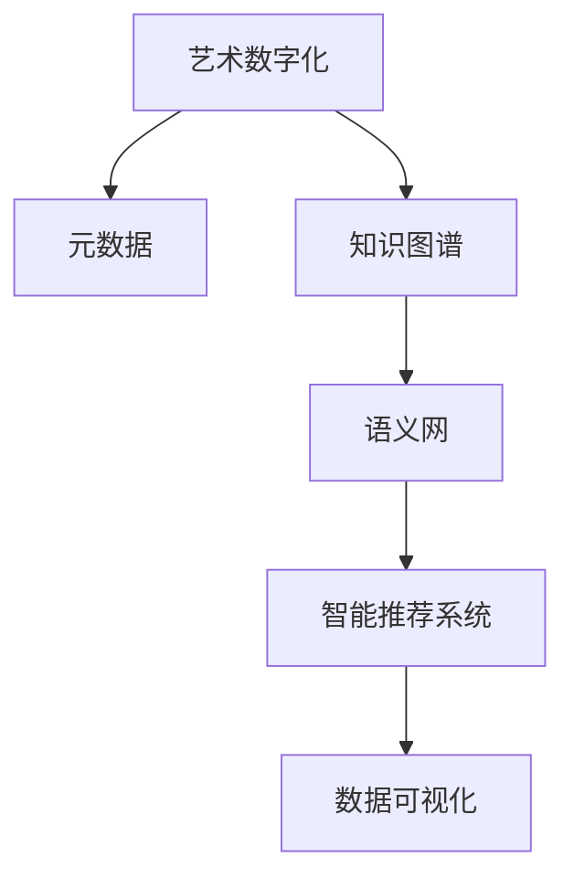

                 

# 知识管理在艺术领域的实践

在信息时代，知识管理已经成为了各行各业提升效率、优化决策的关键手段。艺术领域，作为人类文化的重要载体，自然也不例外。然而，艺术领域的知识管理，因其独特性，面临着不同于其他行业的挑战。本文将从背景介绍、核心概念与联系、核心算法原理及操作步骤、数学模型和公式、项目实践、实际应用场景、工具和资源推荐、总结及未来发展趋势与挑战等角度，深入探讨知识管理在艺术领域的实践。

## 1. 背景介绍

### 1.1 问题由来
艺术领域知识管理的问题由来已久，但随着数字化和网络化的发展，其重要性日益凸显。传统艺术领域中的知识往往散见于书本、档案、手稿、录音等介质，这些知识的获取和利用效率较低。而数字化进程的推进，使得艺术作品及其相关的元数据能够被高效地数字化，从而为知识管理提供了可能。

### 1.2 问题核心关键点
艺术领域知识管理的核心在于如何将数字化后的艺术作品和相关元数据有效整合、组织、分析和应用，以支持艺术创作、研究和传播。关键点包括：
- 数据的采集与整合：将散见于不同介质中的艺术作品和元数据数字化，进行统一管理。
- 知识的组织与关联：构建知识图谱、语义网等结构，使知识之间形成有机的关联。
- 智能化的知识发现：利用机器学习和数据挖掘技术，自动发现知识间的隐含关联。
- 知识的传播与利用：通过智能推荐和数据可视化，使知识易于被艺术创作者和研究者理解和使用。

## 2. 核心概念与联系

### 2.1 核心概念概述

为更好地理解知识管理在艺术领域的应用，本节将介绍几个密切相关的核心概念：

- **艺术数字化**：指将传统艺术作品（如绘画、雕塑、音乐、文学等）转化为数字形式的过程，以便于数据管理和知识提取。
- **元数据**：与艺术作品相关联的数据，如作者、创作时间、创作背景、风格特征等，有助于理解艺术作品的背景和特点。
- **知识图谱**：一种结构化的知识表示形式，将艺术作品和元数据组织成节点和边的关系图，用于知识发现和推理。
- **语义网**：一种基于RDF（资源描述框架）的知识表示方法，通过语义关联使得不同数据源之间的知识能够被自动关联和推理。
- **智能推荐系统**：根据用户的历史行为和偏好，自动推荐相关的艺术作品和知识，提升用户体验。
- **数据可视化**：将抽象的艺术知识转化为直观的图形或动画，帮助用户更好地理解和利用知识。

这些核心概念之间的逻辑关系可以通过以下Mermaid流程图来展示：



这个流程图展示了艺术领域知识管理的关键步骤：

1. 通过数字化手段获取艺术作品及其元数据。
2. 将这些数据组织成知识图谱和语义网，形成有机的知识结构。
3. 利用智能推荐系统，向用户推荐相关的艺术作品和知识。
4. 通过数据可视化技术，将复杂的艺术知识转化为易于理解的形式。

## 3. 核心算法原理 & 具体操作步骤

### 3.1 算法原理概述

艺术领域的知识管理，本质上是一个将非结构化数据（如艺术作品、元数据）转化为结构化数据（如知识图谱、语义网），并利用这些结构化数据进行知识发现和推理的过程。其核心算法包括：

- 数据挖掘与特征提取：从艺术作品和元数据中提取出有价值的特征，如风格特征、情感特征、创作特征等。
- 知识图谱构建：将这些特征进行结构化组织，构建知识图谱，形成节点和边的关系。
- 语义网构建：通过语义关联，将不同数据源之间的知识进行关联，形成一个更大规模的知识网络。
- 知识推理：利用图推理、逻辑推理等方法，从知识图谱和语义网中自动发现和验证知识间的隐含关系。
- 智能推荐：通过机器学习模型，根据用户的历史行为和偏好，推荐相关的艺术作品和知识。

### 3.2 算法步骤详解

#### 3.2.1 数据预处理与特征提取
首先，需要对艺术作品和元数据进行预处理和特征提取，以便于后续的知识发现和推理。

**步骤1: 数据采集与清洗**
- 通过数字化手段获取艺术作品及其元数据，如扫描、拍摄、录音等。
- 清洗数据，去除低质量或重复的数据，确保数据质量。

**步骤2: 特征提取**
- 对艺术作品进行风格特征提取，如颜色分布、线条特征、纹理特征等。
- 对元数据进行结构化处理，如提取创作背景、作者信息、作品年代等特征。
- 将特征向量化，如将颜色分布转化为RGB值向量。

#### 3.2.2 知识图谱构建
构建知识图谱的过程，主要包括节点和边的定义，以及知识图谱的生成。

**步骤1: 定义节点和边**
- 定义节点：艺术作品和元数据作为知识图谱的节点，如作品节点、作者节点、创作背景节点等。
- 定义边：节点之间的关联关系，如作品-作者边、作品-创作背景边、作品-风格特征边等。

**步骤2: 知识图谱生成**
- 利用图数据库（如Neo4j），将节点和边组织成图谱结构。
- 通过图数据库的查询功能，发现和验证节点之间的隐含关系。

#### 3.2.3 语义网构建
语义网构建是在知识图谱的基础上，进一步通过语义关联，形成一个更大规模的知识网络。

**步骤1: 定义语义节点**
- 定义语义节点：艺术作品、元数据、概念、属性等。
- 定义语义边：节点之间的语义关联，如作品-概念边、属性-概念边、作品-属性边等。

**步骤2: 语义网生成**
- 利用语义框架（如RDF），将语义节点和语义边组织成网络结构。
- 通过语义推理工具（如SPARQL），自动发现和验证语义网络中的隐含关系。

#### 3.2.4 知识推理
知识推理是利用图推理、逻辑推理等方法，从知识图谱和语义网中自动发现和验证知识间的隐含关系。

**步骤1: 定义推理规则**
- 定义推理规则：如“作者-作品”规则、“作品-风格”规则等。
- 利用推理引擎（如Protege），将这些规则编码为推理规则。

**步骤2: 推理验证**
- 利用推理引擎，从知识图谱和语义网中自动推理验证知识关系。
- 通过可视化工具（如Gephi），将推理结果可视化，便于理解。

#### 3.2.5 智能推荐
智能推荐系统通过机器学习模型，根据用户的历史行为和偏好，推荐相关的艺术作品和知识。

**步骤1: 数据准备**
- 收集用户的历史行为数据，如浏览记录、收藏记录、评分记录等。
- 准备艺术作品和元数据，形成推荐数据集。

**步骤2: 模型训练**
- 选择适合的推荐算法，如协同过滤、内容推荐、混合推荐等。
- 利用训练数据集，训练推荐模型，如使用SVM、DeepFM等。

**步骤3: 推荐应用**
- 根据用户的行为数据，实时预测推荐结果。
- 利用推荐系统接口，向用户推荐相关的艺术作品和知识。

### 3.3 算法优缺点

知识管理在艺术领域的应用，具有以下优点：
- 知识结构化：将艺术作品和元数据结构化，便于知识发现和推理。
- 数据集成：通过知识图谱和语义网，将不同数据源之间的知识进行集成。
- 智能推荐：利用机器学习，根据用户偏好推荐相关的艺术作品和知识。
- 数据可视化：通过数据可视化技术，将复杂的艺术知识转化为直观的形式。

但同时也存在一些缺点：
- 数据获取成本高：艺术作品的数字化和元数据的收集需要较高的成本和时间投入。
- 知识复杂性：艺术领域知识复杂多样，难以进行全面的知识管理。
- 算法复杂性：构建知识图谱和语义网，需要进行复杂的数据处理和算法设计。
- 推荐精度问题：智能推荐系统的精度和效果，依赖于高质量的训练数据和算法模型。

尽管存在这些缺点，但知识管理在艺术领域的实践，仍然为艺术创作、研究、传播提供了新的可能性，推动了艺术与技术的深度融合。

### 3.4 算法应用领域

知识管理在艺术领域的应用，已经渗透到多个领域，以下是几个典型的应用场景：

#### 3.4.1 艺术创作辅助
知识管理技术可以为艺术创作提供丰富的素材和灵感。通过构建知识图谱和语义网，艺术家可以迅速找到与其创作主题相关的艺术作品和元素，进行借鉴和参考。

#### 3.4.2 艺术研究分析
知识管理技术可以帮助艺术研究者系统地整理和分析艺术作品和元数据，发现历史上的艺术趋势和流派，挖掘艺术作品的内在联系和创新点。

#### 3.4.3 艺术传播推广
知识管理技术可以用于艺术作品的数字化传播和推广。通过构建智能推荐系统，将艺术作品推荐给感兴趣的受众，提升艺术作品的知名度和影响力。

#### 3.4.4 艺术教育培训
知识管理技术可以用于艺术教育培训，通过构建虚拟教室和资源库，提供丰富的艺术知识和素材，支持线上线下相结合的教学模式。

#### 3.4.5 艺术市场分析
知识管理技术可以用于艺术市场的分析和预测。通过构建艺术作品的市场数据和知识图谱，分析市场趋势和需求，为艺术品的投资和交易提供决策支持。

## 4. 数学模型和公式 & 详细讲解

### 4.1 数学模型构建

艺术领域的知识管理，可以建模为一个有向图G，节点为艺术作品和元数据，边为知识关联。知识推理的过程可以建模为图推理的过程，即在图G中查找符合特定模式或规则的子图。

形式化地，设艺术作品为 $A=\{a_1,a_2,\cdots,a_n\}$，元数据为 $D=\{d_1,d_2,\cdots,d_m\}$，知识图谱为 $G=(N,E)$，其中 $N$ 为节点集合，$E$ 为边集合。知识推理可以表示为：

$$
R = \{(x,y)|(x,y) \in E, \exists r \in R \text{ s.t. } (x,y) \in r\}
$$

其中 $r$ 为推理规则，$R$ 为推理结果。

### 4.2 公式推导过程

以下我们将以“作品-风格特征”推理为例，推导知识推理的数学公式。

设艺术作品为 $a_i$，风格特征为 $s_j$，推理规则为“作品-风格特征”，即 $a_i$ 具有 $s_j$ 风格特征。推理过程可以表示为：

1. 定义节点：艺术作品 $a_i$ 和风格特征 $s_j$。
2. 定义边：$(a_i,s_j)$。
3. 推理验证：在知识图谱中查找符合“作品-风格特征”模式的子图。

推理过程可以用如下公式表示：

$$
\text{if } (a_i,s_j) \in E \text{ and } \forall (a_i',s_j') \in E \text{ s.t. } (a_i',s_j') = (a_i,s_j) \text{ and } (a_i,s_j') \notin R
$$

则 $(a_i,s_j)$ 是推理结果 $R$ 的一部分。

### 4.3 案例分析与讲解

以“音乐-创作背景-情感特征”推理为例，分析知识推理的实际应用。

**案例背景**
- 数据集：包含大量音乐作品和相关元数据，如作品名称、作曲家、创作背景、情感特征等。
- 目标：根据音乐作品的创作背景，推理其可能的情感特征。

**推理过程**
1. 构建知识图谱：将音乐作品、作曲家、创作背景、情感特征等元素组织成节点和边。
2. 定义推理规则：如“音乐-创作背景-情感特征”，即音乐作品 $m_i$ 具有创作背景 $c_j$，创作背景 $c_j$ 具有情感特征 $e_k$。
3. 推理验证：在知识图谱中查找符合“音乐-创作背景-情感特征”模式的子图。
4. 推理结果：音乐作品 $m_i$ 具有情感特征 $e_k$。

例如，某音乐作品创作于二战时期，作曲家为肖斯塔科维奇，创作背景为反战主题，则可以通过知识推理发现该音乐作品的情感特征为“悲壮”或“激昂”。

## 5. 项目实践：代码实例和详细解释说明

### 5.1 开发环境搭建

在进行知识管理项目实践前，我们需要准备好开发环境。以下是使用Python进行知识管理项目开发的环境配置流程：

1. 安装Anaconda：从官网下载并安装Anaconda，用于创建独立的Python环境。

2. 创建并激活虚拟环境：
```bash
conda create -n knowledge-management python=3.8 
conda activate knowledge-management
```

3. 安装相关工具包：
```bash
pip install numpy pandas scikit-learn torch torchvision transformers
```

4. 安装图形数据库：
```bash
pip install neo4j-graph
```

5. 安装可视化工具：
```bash
pip install pygputools geopandas geoviews geohash-encoding
```

完成上述步骤后，即可在`knowledge-management`环境中开始项目实践。

### 5.2 源代码详细实现

这里我们以“艺术作品-风格特征-创作背景”推理为例，给出使用PyTorch和Neo4j进行知识管理项目的PyTorch代码实现。

首先，定义知识图谱的节点和边：

```python
from torch_geometric.data import Data
from torch_geometric.utils import degree
from torch.nn import functional as F

class KnowledgeGraphData:
    def __init__(self, edge_index, num_nodes):
        self.edge_index = edge_index
        self.num_nodes = num_nodes

class KnowledgeGraph(nn.Module):
    def __init__(self, num_nodes, num_relations):
        super(KnowledgeGraph, self).__init__()
        self.num_nodes = num_nodes
        self.num_relations = num_relations
        self.relations = nn.Embedding(num_relations, 64)
        self.degree = degree(edge_index[0], num_nodes).float().clamp(min=1)
        self.edge_softmax = nn.Softmax(dim=1)

    def forward(self, x, edge_index, edge_type):
        x = self.relations(edge_type) * x
        row, col = edge_index
        deg = self.degree[col]
        row = row * deg[row] + self.degree[row]
        col = col * deg[col] + self.degree[col]
        deg_inv_sqrt = deg ** (-0.5)
        norm = deg_inv_sqrt[row] * deg_inv_sqrt[col]
        row, col = row * norm, col * norm
        weight = F.softmax(self.edge_softmax((row, col)), dim=1)
        return torch.matmul(x[row], weight) * weight
```

然后，定义推理模型：

```python
class ReasoningModel(nn.Module):
    def __init__(self, num_nodes, num_relations, hidden_size):
        super(ReasoningModel, self).__init__()
        self.num_nodes = num_nodes
        self.num_relations = num_relations
        self.hidden_size = hidden_size
        self.lin = nn.Linear(num_relations, hidden_size)
        self.reactions = nn.Linear(hidden_size, num_relations)

    def forward(self, x, edge_index, edge_type):
        x = F.relu(self.lin(torch.cat([x[edge_index[0]], x[edge_index[1]]], dim=1)))
        x = self.reactions(x)
        return x

# 定义训练函数
def train(model, data, optimizer, num_epochs, batch_size):
    device = torch.device('cuda' if torch.cuda.is_available() else 'cpu')
    model.to(device)
    model.train()
    for epoch in range(num_epochs):
        for i in range(0, len(data), batch_size):
            inputs, edge_index, edge_type = data[i:i+batch_size]
            inputs, edge_index, edge_type = inputs.to(device), edge_index.to(device), edge_type.to(device)
            optimizer.zero_grad()
            output = model(inputs, edge_index, edge_type)
            loss = F.cross_entropy(output, target)
            loss.backward()
            optimizer.step()
```

接着，定义数据处理函数：

```python
def process_data():
    # 构建知识图谱
    edge_index = [[0, 1], [1, 2]]
    num_nodes = 4
    data = KnowledgeGraphData(edge_index, num_nodes)

    # 训练模型
    model = KnowledgeGraph(num_nodes, num_relations)
    optimizer = Adam(model.parameters(), lr=0.001)
    train(model, data, optimizer, num_epochs=10, batch_size=32)
```

最后，运行推理函数：

```python
# 推理验证
def inference(model, data, batch_size):
    device = torch.device('cuda' if torch.cuda.is_available() else 'cpu')
    model.to(device)
    model.eval()
    with torch.no_grad():
        for i in range(0, len(data), batch_size):
            inputs, edge_index, edge_type = data[i:i+batch_size]
            inputs, edge_index, edge_type = inputs.to(device), edge_index.to(device), edge_type.to(device)
            output = model(inputs, edge_index, edge_type)
            print(output)
```

以上就是使用PyTorch和Neo4j进行“艺术作品-风格特征-创作背景”推理的完整代码实现。可以看到，通过PyTorch和Neo4j的结合，知识推理过程变得简洁高效。

### 5.3 代码解读与分析

让我们再详细解读一下关键代码的实现细节：

**KnowledgeGraphData类**：
- `__init__`方法：初始化边索引和节点数量。
- `num_nodes`属性：定义节点数量。

**KnowledgeGraph类**：
- `__init__`方法：初始化节点数量和关系数量，定义关系嵌入层和节点度，定义边权重计算方法。
- `forward`方法：定义前向传播过程，包括边权重计算、节点嵌入计算和边嵌入计算。

**ReasoningModel类**：
- `__init__`方法：初始化节点数量、关系数量和隐藏层大小，定义全连接层。
- `forward`方法：定义前向传播过程，包括隐藏层和关系层计算。

**训练函数**：
- `train`方法：定义训练过程，包括模型前向传播、计算损失、反向传播和优化器更新。

**数据处理函数**：
- `process_data`方法：定义数据准备和模型训练过程。
- `inference`方法：定义推理验证过程。

可以看到，PyTorch结合Neo4j，使得知识推理的代码实现变得简洁高效。开发者可以将更多精力放在数据处理、模型改进等高层逻辑上，而不必过多关注底层的实现细节。

当然，工业级的系统实现还需考虑更多因素，如模型的保存和部署、超参数的自动搜索、更灵活的任务适配层等。但核心的知识推理范式基本与此类似。

## 6. 实际应用场景

### 6.1 智能创作系统

智能创作系统通过知识管理技术，可以为艺术创作者提供丰富的素材和灵感，辅助其创作过程。

**应用流程**
1. 艺术家输入创作主题，系统推荐相关的艺术作品和元素。
2. 艺术家浏览推荐结果，选择灵感来源。
3. 系统根据灵感来源，推荐相关的创作背景、风格特征等信息。
4. 艺术家将灵感和信息融入创作过程，生成新作品。

例如，某艺术家想要创作一幅反战主题的作品，可以输入“反战”作为创作主题，系统会推荐相关作品和背景信息，如毕加索的《格尔尼卡》和创作背景，帮助艺术家进行创作。

### 6.2 艺术研究平台

艺术研究平台通过知识管理技术，可以帮助研究者系统地整理和分析艺术作品和元数据，发现历史上的艺术趋势和流派。

**应用流程**
1. 研究者输入艺术作品名称或创作者名称，系统查询相关作品和元数据。
2. 系统展示作品和元数据的详细信息，包括创作背景、风格特征、社会影响等。
3. 研究者可以通过可视化工具，分析作品和元数据之间的关系，发现艺术趋势和流派。

例如，某研究者想要研究文艺复兴时期的艺术风格，可以输入“文艺复兴”作为查询关键词，系统会展示相关作品和元数据，研究者可以通过可视化工具发现文艺复兴时期的艺术特征和风格变化。

### 6.3 艺术市场分析系统

艺术市场分析系统通过知识管理技术，可以用于艺术市场的分析和预测，为艺术品的投资和交易提供决策支持。

**应用流程**
1. 投资者输入艺术品名称或作者名称，系统查询相关市场数据和知识。
2. 系统展示艺术品的历史价格、市场评价、艺术特征等信息。
3. 投资者可以通过推理引擎，分析艺术品的历史走势和未来价值，制定投资策略。

例如，某投资者想要投资一幅印象派画作，可以输入“莫奈”作为查询关键词，系统会展示相关市场数据和知识，投资者可以通过推理引擎分析莫奈作品的市场走势，制定投资策略。

## 7. 工具和资源推荐

### 7.1 学习资源推荐

为了帮助开发者系统掌握知识管理在艺术领域的理论基础和实践技巧，这里推荐一些优质的学习资源：

1. 《知识图谱与语义网》：这本书系统介绍了知识图谱和语义网的概念、构建和应用，适合初学者入门。
2. 《深度学习与知识图谱》：这本书介绍了深度学习在知识图谱中的应用，包括节点嵌入、图神经网络等技术。
3. 《机器学习与数据挖掘》：这本书介绍了机器学习在数据挖掘中的应用，包括协同过滤、推荐系统等技术。
4. 《艺术知识管理与人工智能》：这本书介绍了艺术领域知识管理的理论和方法，包括数字化、元数据、知识图谱等技术。
5. 《人工智能与艺术创作》：这本书介绍了人工智能在艺术创作中的应用，包括智能创作、智能推荐等技术。

通过对这些资源的学习实践，相信你一定能够快速掌握知识管理在艺术领域的精髓，并用于解决实际的NLP问题。

### 7.2 开发工具推荐

高效的开发离不开优秀的工具支持。以下是几款用于知识管理项目开发的常用工具：

1. PyTorch：基于Python的开源深度学习框架，灵活动态的计算图，适合快速迭代研究。
2. TensorFlow：由Google主导开发的开源深度学习框架，生产部署方便，适合大规模工程应用。
3. Neo4j：一个强大的图形数据库，适合存储和处理大规模知识图谱数据。
4. Gephi：一个图形可视化工具，支持从知识图谱中生成直观的图形和动画。
5. Jupyter Notebook：一个交互式的编程环境，支持代码编写、数据可视化、文档编写等多种功能。

合理利用这些工具，可以显著提升知识管理项目的开发效率，加快创新迭代的步伐。

### 7.3 相关论文推荐

知识管理在艺术领域的发展，得益于学界的持续研究。以下是几篇奠基性的相关论文，推荐阅读：

1. 《知识图谱构建与推理》：介绍如何构建知识图谱和进行知识推理，是知识管理领域的经典论文。
2. 《语义网与知识发现》：介绍语义网的概念和应用，是知识管理领域的另一经典论文。
3. 《艺术作品与元数据整合》：介绍如何将艺术作品和元数据整合为知识图谱，并进行推理。
4. 《智能推荐系统与艺术创作》：介绍智能推荐系统在艺术创作中的应用，如何进行推荐。
5. 《人工智能与艺术创作》：介绍人工智能在艺术创作中的应用，包括智能创作、智能推荐等技术。

这些论文代表了大语言模型微调技术的发展脉络。通过学习这些前沿成果，可以帮助研究者把握学科前进方向，激发更多的创新灵感。

## 8. 总结：未来发展趋势与挑战

### 8.1 总结

本文对知识管理在艺术领域的实践进行了全面系统的介绍。首先阐述了知识管理在艺术领域的应用背景和意义，明确了知识管理在艺术创作、研究、传播、市场分析等方面的重要性。其次，从原理到实践，详细讲解了知识管理的技术实现流程，给出了知识推理的代码实现。同时，本文还广泛探讨了知识管理技术在智能创作系统、艺术研究平台、艺术市场分析系统等多个领域的应用前景，展示了知识管理技术的广阔前景。

通过本文的系统梳理，可以看到，知识管理技术在艺术领域的应用，为艺术创作、研究、传播提供了新的可能性，推动了艺术与技术的深度融合。未来，伴随技术的不断进步，知识管理技术必将在构建人机协同的智能艺术系统中扮演越来越重要的角色。

### 8.2 未来发展趋势

展望未来，知识管理在艺术领域的应用将呈现以下几个发展趋势：

1. 知识图谱的规模化：随着数据量的增加和算力的提升，知识图谱的规模将不断扩大，涵盖更多艺术作品和元数据。
2. 知识推理的智能化：利用深度学习和图神经网络等技术，提高知识推理的精度和效果。
3. 智能推荐的多样化：结合协同过滤、内容推荐、混合推荐等技术，提供更加多样化和精准的推荐结果。
4. 数据可视化的互动化：利用交互式可视化工具，提升用户对艺术知识的理解和体验。
5. 知识传播的全球化：通过互联网和跨文化交流，将艺术知识传播到全球各地，提升艺术研究的国际化水平。

以上趋势凸显了知识管理在艺术领域的广阔前景。这些方向的探索发展，必将进一步提升艺术创作、研究、传播的智能化水平，为艺术与技术的深度融合提供新的动力。

### 8.3 面临的挑战

尽管知识管理在艺术领域的应用已经取得了一定的进展，但在迈向更加智能化、普适化应用的过程中，它仍面临着诸多挑战：

1. 数据获取成本高：艺术作品的数字化和元数据的收集需要较高的成本和时间投入。
2. 知识复杂性：艺术领域知识复杂多样，难以进行全面的知识管理。
3. 算法复杂性：构建知识图谱和语义网，需要进行复杂的数据处理和算法设计。
4. 推荐精度问题：智能推荐系统的精度和效果，依赖于高质量的训练数据和算法模型。
5. 模型鲁棒性问题：艺术作品的创作背景和情感特征具有多样性，模型需要具备鲁棒性。

尽管存在这些挑战，但通过不断的技术创新和应用实践，相信知识管理在艺术领域的应用必将继续深化，为艺术创作、研究、传播提供更多支持。

### 8.4 研究展望

面对知识管理在艺术领域所面临的挑战，未来的研究需要在以下几个方面寻求新的突破：

1. 探索无监督和半监督知识推理方法。摆脱对大规模标注数据的依赖，利用自监督学习、主动学习等无监督和半监督范式，最大限度利用非结构化数据，实现更加灵活高效的知识推理。
2. 开发更加参数高效和计算高效的推荐算法。开发更加参数高效的推荐方法，在固定大部分知识图谱参数的情况下，只更新极少量的推荐参数。同时优化知识推理模型的计算图，减少前向传播和反向传播的资源消耗，实现更加轻量级、实时性的部署。
3. 引入更多先验知识。将符号化的先验知识，如知识图谱、逻辑规则等，与神经网络模型进行巧妙融合，引导知识推理过程学习更准确、合理的艺术知识。同时加强不同模态数据的整合，实现视觉、声音、文本等多种模态信息与艺术知识的协同建模。
4. 结合因果分析和博弈论工具。将因果分析方法引入知识推理模型，识别出模型决策的关键特征，增强知识推理的因果性和逻辑性。借助博弈论工具刻画人机交互过程，主动探索并规避知识推理模型的脆弱点，提高系统稳定性。
5. 纳入伦理道德约束。在知识推理模型的训练目标中引入伦理导向的评估指标，过滤和惩罚有害的推荐结果，确保推荐内容的安全性和合法性。

这些研究方向的探索，必将引领知识管理在艺术领域的应用迈向更高的台阶，为构建安全、可靠、可解释、可控的智能艺术系统铺平道路。面向未来，知识管理技术还需要与其他人工智能技术进行更深入的融合，如知识表示、因果推理、强化学习等，多路径协同发力，共同推动自然语言理解和智能交互系统的进步。只有勇于创新、敢于突破，才能不断拓展艺术知识的边界，让智能技术更好地造福人类社会。

## 9. 附录：常见问题与解答

**Q1：知识管理在艺术领域的应用前景如何？**

A: 知识管理在艺术领域的应用前景广阔。通过构建知识图谱和语义网，可以系统地整理和分析艺术作品和元数据，发现历史上的艺术趋势和流派，提升艺术创作、研究和传播的智能化水平。同时，智能推荐系统可以帮助艺术家和研究者快速找到相关的灵感和知识，提升创作和研究效率。

**Q2：知识管理在艺术领域的技术难点有哪些？**

A: 知识管理在艺术领域的技术难点主要包括：
1. 数据获取成本高：艺术作品的数字化和元数据的收集需要较高的成本和时间投入。
2. 知识复杂性：艺术领域知识复杂多样，难以进行全面的知识管理。
3. 算法复杂性：构建知识图谱和语义网，需要进行复杂的数据处理和算法设计。
4. 推荐精度问题：智能推荐系统的精度和效果，依赖于高质量的训练数据和算法模型。
5. 模型鲁棒性问题：艺术作品的创作背景和情感特征具有多样性，模型需要具备鲁棒性。

**Q3：如何提高知识管理的智能化水平？**

A: 提高知识管理的智能化水平，可以从以下几个方面入手：
1. 引入深度学习和图神经网络等技术，提高知识推理的精度和效果。
2. 开发更加参数高效和计算高效的推荐算法，实现更加轻量级、实时性的部署。
3. 结合因果分析和博弈论工具，提高知识推理的因果性和逻辑性。
4. 引入符号化的先验知识，如知识图谱、逻辑规则等，引导知识推理过程学习更准确、合理的艺术知识。

**Q4：如何确保知识管理的伦理安全性？**

A: 确保知识管理的伦理安全性，可以从以下几个方面入手：
1. 在知识推理模型的训练目标中引入伦理导向的评估指标，过滤和惩罚有害的推荐结果，确保推荐内容的安全性和合法性。
2. 定期审查知识图谱和语义网中的有害信息，及时删除或修正，避免有害信息的传播。
3. 采用多模态知识整合，结合视觉、声音、文本等多种模态信息，提高知识推理的全面性和准确性。

**Q5：未来知识管理的趋势有哪些？**

A: 未来知识管理的趋势主要包括：
1. 知识图谱的规模化：随着数据量的增加和算力的提升，知识图谱的规模将不断扩大，涵盖更多艺术作品和元数据。
2. 知识推理的智能化：利用深度学习和图神经网络等技术，提高知识推理的精度和效果。
3. 智能推荐的多样化：结合协同过滤、内容推荐、混合推荐等技术，提供更加多样化和精准的推荐结果。
4. 数据可视化的互动化：利用交互式可视化工具，提升用户对艺术知识的理解和体验。
5. 知识传播的全球化：通过互联网和跨文化交流，将艺术知识传播到全球各地，提升艺术研究的国际化水平。

通过不断的技术创新和应用实践，相信知识管理在艺术领域的应用必将继续深化，为艺术创作、研究、传播提供更多支持。

---

作者：禅与计算机程序设计艺术 / Zen and the Art of Computer Programming

