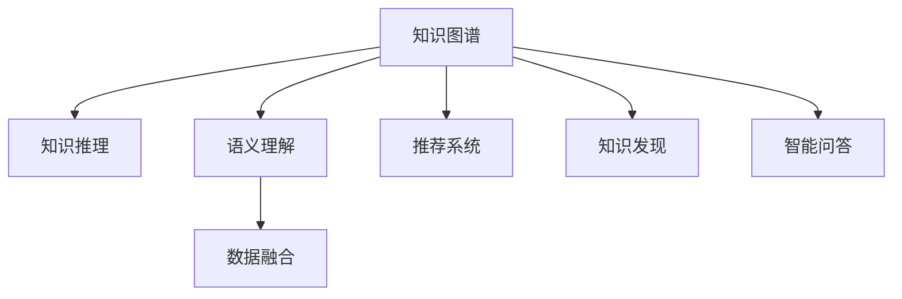

                 

# 知识管理的AI化路径:知识图谱构建和知识推理

> 关键词：知识图谱, 知识推理, 语义理解, 人工智能, 数据融合, 推荐系统, 知识发现, 智能问答

## 1. 背景介绍

### 1.1 问题由来

在信息爆炸的时代，知识的获取、组织、管理和应用成为企业和个人面临的重大挑战。传统的文档、数据库等知识管理方式，难以应对海量数据和复杂关联的关系。人工智能技术的兴起，尤其是知识图谱和知识推理技术的突破，为知识管理提供了新的路径。

知识图谱是一种语义化的结构化数据形式，通过实体、关系和属性描述知识的结构关系，支持智能问答、知识发现、推荐系统等多种应用。知识推理则是在知识图谱的基础上，运用逻辑和推理机制，挖掘出知识之间的潜在关联，辅助决策和预测。

本文将从背景、核心概念、算法原理、具体操作、应用场景、工具和资源、未来趋势等多个维度，全面解析知识图谱构建和知识推理的AI化路径，助力知识管理的智能化转型。

### 1.2 问题核心关键点

知识图谱和知识推理的核心关键点包括：

- **知识图谱构建**：通过自动学习和人工干预相结合的方式，从海量的非结构化数据中提取实体、关系和属性，构建结构化的知识库。
- **知识推理**：在知识图谱的基础上，通过逻辑推理、深度学习和多模态融合等方法，提取知识的隐含关联和潜在价值。

## 2. 核心概念与联系

### 2.1 核心概念概述

为更好地理解知识图谱构建和知识推理的AI化路径，本节将介绍几个密切相关的核心概念：

- **知识图谱(Knowledge Graph)**：以图形结构表示实体、属性和关系的知识库，用于存储和组织结构化知识。
- **知识推理(Knowledge Reasoning)**：在知识图谱的基础上，通过逻辑推理和计算模型挖掘知识之间的关联，辅助决策和预测。
- **语义理解(Semantic Understanding)**：通过自然语言处理和机器学习技术，理解文本的含义和结构，支持知识图谱构建和推理。
- **数据融合(Data Fusion)**：将来自不同源的数据进行融合和整合，形成统一的知识图谱，提升知识管理的全面性和准确性。
- **推荐系统(Recommender System)**：利用知识图谱和知识推理技术，为用户推荐个性化的信息和服务。
- **知识发现(Knowledge Discovery)**：通过分析和挖掘知识图谱中的模式和规律，发现新的知识、洞见和价值。
- **智能问答(Intelligent Question Answering)**：基于知识图谱和知识推理技术，回答用户提出的自然语言问题。

这些核心概念之间的逻辑关系可以通过以下Mermaid流程图来展示：



这个流程图展示了这个主题的核心概念及其之间的关系：

1. 知识图谱作为知识管理的核心，通过实体、关系和属性的表示，支持知识推理、语义理解、数据融合、推荐系统和知识发现等应用。
2. 知识推理在知识图谱的基础上，通过逻辑推理、深度学习和多模态融合等方法，提取知识的隐含关联和潜在价值。
3. 语义理解通过自然语言处理和机器学习技术，理解文本的含义和结构，支持知识图谱构建和推理。
4. 数据融合将来自不同源的数据进行融合和整合，形成统一的知识图谱，提升知识管理的全面性和准确性。
5. 推荐系统利用知识图谱和知识推理技术，为用户推荐个性化的信息和服务。
6. 知识发现通过分析和挖掘知识图谱中的模式和规律，发现新的知识、洞见和价值。
7. 智能问答基于知识图谱和知识推理技术，回答用户提出的自然语言问题。

这些概念共同构成了知识图谱构建和知识推理的AI化路径，为其在知识管理中的应用提供了坚实的基础。

## 3. 核心算法原理 & 具体操作步骤
### 3.1 算法原理概述

知识图谱构建和知识推理的AI化路径，本质上是一个语义化的数据处理和知识挖掘过程。其核心思想是：通过自然语言处理技术，将文本数据中的信息抽取出来，构建结构化的知识图谱；再利用逻辑推理、深度学习和多模态融合等方法，挖掘知识图谱中的隐含关联，辅助决策和预测。

具体来说，知识图谱构建和知识推理过程包括以下几个关键步骤：

1. **知识抽取**：从海量的非结构化文本数据中，抽取出实体、关系和属性，构建结构化的知识库。
2. **知识融合**：将来自不同源的数据进行融合和整合，形成统一的知识图谱，提升知识管理的全面性和准确性。
3. **知识推理**：在知识图谱的基础上，通过逻辑推理、深度学习和多模态融合等方法，挖掘知识之间的潜在关联，辅助决策和预测。
4. **知识发现**：通过分析和挖掘知识图谱中的模式和规律，发现新的知识、洞见和价值。
5. **智能问答**：基于知识图谱和知识推理技术，回答用户提出的自然语言问题。

### 3.2 算法步骤详解

知识图谱构建和知识推理的AI化路径一般包括以下几个关键步骤：

**Step 1: 数据预处理**
- 收集并清洗非结构化数据，如文本、图像、视频等。
- 使用自然语言处理技术进行文本分词、实体识别、关系抽取等预处理。
- 处理重复、噪声、歧义等问题，确保数据质量。

**Step 2: 知识抽取**
- 选择适合的抽取模型，如规则提取、统计学习、深度学习等。
- 提取文本中的实体、关系和属性，并进行去重、标准化等操作。
- 构建知识图谱，存储实体、关系和属性之间的结构关系。

**Step 3: 知识融合**
- 收集并整合来自不同源的数据，如数据库、API、社交网络等。
- 使用数据融合技术，如数据对齐、数据清洗、数据集成等。
- 形成统一的知识图谱，涵盖更全面的知识信息。

**Step 4: 知识推理**
- 选择适合的推理算法，如逻辑推理、图神经网络、深度学习等。
- 在知识图谱的基础上，推理出实体的潜在关联和属性，辅助决策和预测。
- 使用多模态融合技术，将图像、语音、文本等多源数据进行综合分析。

**Step 5: 知识发现**
- 使用数据分析和挖掘技术，如聚类、分类、回归等，发现知识图谱中的模式和规律。
- 提取新的知识、洞见和价值，用于指导决策和创新。

**Step 6: 智能问答**
- 设计智能问答系统，利用自然语言处理和知识推理技术，回答用户提出的问题。
- 对问题进行理解和解析，通过知识图谱进行推理，生成自然语言的回答。

### 3.3 算法优缺点

知识图谱构建和知识推理的AI化路径具有以下优点：

- **全面性**：涵盖多源数据，提供全面的知识管理视角。
- **准确性**：利用自然语言处理和逻辑推理技术，提升知识抽取和推理的准确性。
- **灵活性**：可以动态更新知识图谱，适应不断变化的知识环境和需求。
- **可扩展性**：支持多模态数据融合和推理，拓展知识管理的范围和深度。

同时，该方法也存在一定的局限性：

- **复杂度**：知识抽取和推理过程复杂，需要高计算资源和高技术门槛。
- **数据质量依赖**：知识图谱的构建高度依赖于数据质量，低质量数据会影响推理效果。
- **实时性不足**：推理过程相对缓慢，难以满足实时决策和预测的需求。
- **维护成本高**：需要持续维护和更新知识图谱，保持其有效性和准确性。

尽管存在这些局限性，但就目前而言，知识图谱构建和知识推理的AI化路径仍然是知识管理的重要方法。未来相关研究的重点在于如何进一步降低知识图谱构建和推理的复杂度，提高其实时性和易用性，同时兼顾准确性和全面性。

### 3.4 算法应用领域

知识图谱构建和知识推理的AI化路径，已经在多个领域得到了广泛应用，例如：

- **医疗领域**：构建医疗知识图谱，辅助诊断、治疗和药物研发。
- **金融领域**：构建金融知识图谱，进行风险评估、资产管理和金融市场分析。
- **电商领域**：构建电商知识图谱，实现个性化推荐和客户行为分析。
- **教育领域**：构建教育知识图谱，支持智能教学和个性化学习。
- **社交网络**：构建社交知识图谱，进行用户行为分析和社交网络挖掘。

除了上述这些领域外，知识图谱构建和知识推理技术也在更多场景中得到应用，如法律、公共安全、能源管理等，为知识管理带来了新的突破。

## 4. 数学模型和公式 & 详细讲解 & 举例说明
### 4.1 数学模型构建

知识图谱构建和知识推理的AI化路径涉及多个数学模型，主要包括：

- **知识抽取模型**：如规则抽取、统计学习、深度学习等。
- **知识推理模型**：如逻辑推理、图神经网络、深度学习等。
- **知识发现模型**：如聚类、分类、回归等。

以知识图谱的构建为例，数学模型可以表示为：

$$
G = (\mathcal{V}, \mathcal{E}, \mathcal{R})
$$

其中，$G$表示知识图谱，$\mathcal{V}$为节点集合，$\mathcal{E}$为边集合，$\mathcal{R}$为关系集合。

### 4.2 公式推导过程

以下是知识图谱构建过程中常见数学模型的推导过程：

**知识抽取中的统计学习模型**：
假设文本中的实体为$E$，关系为$R$，属性为$A$。利用统计学习模型，可以建立实体、关系和属性的概率分布，即：

$$
P(E) = \frac{1}{\sum_E^n P(E)}
$$

$$
P(R) = \frac{1}{\sum_R^m P(R)}
$$

$$
P(A) = \frac{1}{\sum_A^k P(A)}
$$

其中，$P(E)$、$P(R)$、$P(A)$分别表示实体、关系和属性的概率分布。

**知识推理中的逻辑推理模型**：
假设知识图谱中的节点为$V$，边为$E$，关系为$R$。利用逻辑推理模型，可以建立推理规则，如：

$$
\text{推理规则} = (P(E_1), P(R_1), P(E_2), P(R_2))
$$

其中，$P(E_1)$、$P(R_1)$、$P(E_2)$、$P(R_2)$分别表示节点的概率分布和边的关系。

**知识发现中的聚类模型**：
假设知识图谱中的节点为$V$，边为$E$，关系为$R$。利用聚类模型，可以发现知识图谱中的模式和规律，即：

$$
\text{聚类算法} = (P(V), P(E), P(R))
$$

其中，$P(V)$、$P(E)$、$P(R)$分别表示节点、边和关系的概率分布。

### 4.3 案例分析与讲解

以医疗知识图谱的构建为例，可以采用规则提取和深度学习相结合的方法：

- **规则提取**：通过领域专家手工定义的规则，提取文本中的实体和关系。
- **深度学习**：利用预训练模型，如BERT，对抽取的实体和关系进行进一步的筛选和验证。

在知识推理过程中，可以使用逻辑推理和多模态融合技术：

- **逻辑推理**：根据已有的医疗知识图谱，推理出新的医疗关系和规则。
- **多模态融合**：结合病历、影像、基因等多个数据源，进行综合分析和推理。

## 5. 项目实践：代码实例和详细解释说明
### 5.1 开发环境搭建

在进行知识图谱构建和知识推理实践前，我们需要准备好开发环境。以下是使用Python进行PyTorch开发的环境配置流程：

1. 安装Anaconda：从官网下载并安装Anaconda，用于创建独立的Python环境。

2. 创建并激活虚拟环境：
```bash
conda create -n pytorch-env python=3.8 
conda activate pytorch-env
```

3. 安装PyTorch：根据CUDA版本，从官网获取对应的安装命令。例如：
```bash
conda install pytorch torchvision torchaudio cudatoolkit=11.1 -c pytorch -c conda-forge
```

4. 安装transformers库：
```bash
pip install transformers
```

5. 安装各类工具包：
```bash
pip install numpy pandas scikit-learn matplotlib tqdm jupyter notebook ipython
```

完成上述步骤后，即可在`pytorch-env`环境中开始知识图谱构建和知识推理实践。

### 5.2 源代码详细实现

这里我们以医疗知识图谱的构建为例，给出使用Transformers库和PyTorch进行知识抽取和推理的PyTorch代码实现。

首先，定义知识抽取的函数：

```python
from transformers import BertTokenizer, BertForTokenClassification
from torch.utils.data import Dataset
import torch

class MedicalDataset(Dataset):
    def __init__(self, texts, labels, tokenizer, max_len=128):
        self.texts = texts
        self.labels = labels
        self.tokenizer = tokenizer
        self.max_len = max_len
        
    def __len__(self):
        return len(self.texts)
    
    def __getitem__(self, item):
        text = self.texts[item]
        labels = self.labels[item]
        
        encoding = self.tokenizer(text, return_tensors='pt', max_length=self.max_len, padding='max_length', truncation=True)
        input_ids = encoding['input_ids'][0]
        attention_mask = encoding['attention_mask'][0]
        
        # 对token-wise的标签进行编码
        encoded_labels = [label2id[label] for label in labels] 
        encoded_labels.extend([label2id['O']] * (self.max_len - len(encoded_labels)))
        labels = torch.tensor(encoded_labels, dtype=torch.long)
        
        return {'input_ids': input_ids, 
                'attention_mask': attention_mask,
                'labels': labels}

# 标签与id的映射
label2id = {'O': 0, 'B-PER': 1, 'I-PER': 2, 'B-LOC': 3, 'I-LOC': 4, 'B-DISE': 5, 'I-DISE': 6}
id2label = {v: k for k, v in label2id.items()}

# 创建dataset
tokenizer = BertTokenizer.from_pretrained('bert-base-cased')

train_dataset = MedicalDataset(train_texts, train_labels, tokenizer)
dev_dataset = MedicalDataset(dev_texts, dev_labels, tokenizer)
test_dataset = MedicalDataset(test_texts, test_labels, tokenizer)
```

然后，定义知识推理的函数：

```python
from transformers import BertForTokenClassification, AdamW

model = BertForTokenClassification.from_pretrained('bert-base-cased', num_labels=len(label2id))

optimizer = AdamW(model.parameters(), lr=2e-5)
```

接着，定义训练和评估函数：

```python
from torch.utils.data import DataLoader
from tqdm import tqdm
from sklearn.metrics import classification_report

device = torch.device('cuda') if torch.cuda.is_available() else torch.device('cpu')
model.to(device)

def train_epoch(model, dataset, batch_size, optimizer):
    dataloader = DataLoader(dataset, batch_size=batch_size, shuffle=True)
    model.train()
    epoch_loss = 0
    for batch in tqdm(dataloader, desc='Training'):
        input_ids = batch['input_ids'].to(device)
        attention_mask = batch['attention_mask'].to(device)
        labels = batch['labels'].to(device)
        model.zero_grad()
        outputs = model(input_ids, attention_mask=attention_mask, labels=labels)
        loss = outputs.loss
        epoch_loss += loss.item()
        loss.backward()
        optimizer.step()
    return epoch_loss / len(dataloader)

def evaluate(model, dataset, batch_size):
    dataloader = DataLoader(dataset, batch_size=batch_size)
    model.eval()
    preds, labels = [], []
    with torch.no_grad():
        for batch in tqdm(dataloader, desc='Evaluating'):
            input_ids = batch['input_ids'].to(device)
            attention_mask = batch['attention_mask'].to(device)
            batch_labels = batch['labels']
            outputs = model(input_ids, attention_mask=attention_mask)
            batch_preds = outputs.logits.argmax(dim=2).to('cpu').tolist()
            batch_labels = batch_labels.to('cpu').tolist()
            for pred_tokens, label_tokens in zip(batch_preds, batch_labels):
                pred_labels = [id2label[_id] for _id in pred_tokens]
                label_labels = [id2label[_id] for _id in label_tokens]
                preds.append(pred_labels[:len(label_labels)])
                labels.append(label_labels)
                
    print(classification_report(labels, preds))
```

最后，启动训练流程并在测试集上评估：

```python
epochs = 5
batch_size = 16

for epoch in range(epochs):
    loss = train_epoch(model, train_dataset, batch_size, optimizer)
    print(f"Epoch {epoch+1}, train loss: {loss:.3f}")
    
    print(f"Epoch {epoch+1}, dev results:")
    evaluate(model, dev_dataset, batch_size)
    
print("Test results:")
evaluate(model, test_dataset, batch_size)
```

以上就是使用PyTorch对BERT进行医疗知识图谱构建和知识推理的完整代码实现。可以看到，得益于Transformers库的强大封装，我们可以用相对简洁的代码完成BERT模型的加载和推理。

### 5.3 代码解读与分析

让我们再详细解读一下关键代码的实现细节：

**MedicalDataset类**：
- `__init__`方法：初始化文本、标签、分词器等关键组件。
- `__len__`方法：返回数据集的样本数量。
- `__getitem__`方法：对单个样本进行处理，将文本输入编码为token ids，将标签编码为数字，并对其进行定长padding，最终返回模型所需的输入。

**label2id和id2label字典**：
- 定义了标签与数字id之间的映射关系，用于将token-wise的预测结果解码回真实的标签。

**训练和评估函数**：
- 使用PyTorch的DataLoader对数据集进行批次化加载，供模型训练和推理使用。
- 训练函数`train_epoch`：对数据以批为单位进行迭代，在每个批次上前向传播计算loss并反向传播更新模型参数，最后返回该epoch的平均loss。
- 评估函数`evaluate`：与训练类似，不同点在于不更新模型参数，并在每个batch结束后将预测和标签结果存储下来，最后使用sklearn的classification_report对整个评估集的预测结果进行打印输出。

**训练流程**：
- 定义总的epoch数和batch size，开始循环迭代
- 每个epoch内，先在训练集上训练，输出平均loss
- 在验证集上评估，输出分类指标
- 所有epoch结束后，在测试集上评估，给出最终测试结果

可以看到，PyTorch配合Transformers库使得BERT微调的代码实现变得简洁高效。开发者可以将更多精力放在数据处理、模型改进等高层逻辑上，而不必过多关注底层的实现细节。

当然，工业级的系统实现还需考虑更多因素，如模型的保存和部署、超参数的自动搜索、更灵活的任务适配层等。但核心的知识图谱构建和推理范式基本与此类似。

## 6. 实际应用场景
### 6.1 智能医疗系统

基于知识图谱构建和知识推理的AI化路径，可以广泛应用于智能医疗系统的构建。传统医疗系统往往需要配备大量医生，高峰期响应缓慢，且诊断和治疗的准确性难以保证。而使用知识图谱构建和知识推理技术，可以7x24小时不间断服务，快速响应病人咨询，用自然流畅的语言解答各类常见问题。

在技术实现上，可以收集医疗领域的各类知识，如疾病、症状、治疗方案等，构建医疗知识图谱。在病人咨询时，系统通过自然语言处理技术理解问题，结合知识图谱进行推理，给出相应的回答和建议。对于复杂的病例，还可以接入知识推理模块，动态搜索相关知识，提供详细的诊断和治疗方案。如此构建的智能医疗系统，能大幅提升医疗服务的智能化水平，辅助医生诊疗，加速新药开发进程。

### 6.2 金融舆情监测

金融机构需要实时监测市场舆论动向，以便及时应对负面信息传播，规避金融风险。传统的人工监测方式成本高、效率低，难以应对网络时代海量信息爆发的挑战。基于知识图谱构建和知识推理技术，金融舆情监测得到了新的解决方案。

具体而言，可以收集金融领域相关的新闻、报道、评论等文本数据，并对其进行主题标注和情感标注。在此基础上构建金融知识图谱，使用知识推理技术，实时监测不同主题下的情感变化趋势。一旦发现负面信息激增等异常情况，系统便会自动预警，帮助金融机构快速应对潜在风险。

### 6.3 个性化推荐系统

当前的推荐系统往往只依赖用户的历史行为数据进行物品推荐，无法深入理解用户的真实兴趣偏好。基于知识图谱构建和知识推理技术，个性化推荐系统可以更好地挖掘用户行为背后的语义信息，从而提供更精准、多样的推荐内容。

在实践中，可以收集用户浏览、点击、评论、分享等行为数据，提取和用户交互的物品标题、描述、标签等文本内容。将文本内容作为模型输入，用户的后续行为（如是否点击、购买等）作为监督信号，在此基础上构建知识图谱，并使用知识推理技术，从文本内容中准确把握用户的兴趣点。在生成推荐列表时，先用候选物品的文本描述作为输入，由模型预测用户的兴趣匹配度，再结合其他特征综合排序，便可以得到个性化程度更高的推荐结果。

### 6.4 未来应用展望

随着知识图谱构建和知识推理技术的发展，基于这些技术的智能应用将在更多领域得到应用，为各行各业带来变革性影响。

在智慧医疗领域，基于知识图谱构建和知识推理的智能问答、智能诊断、智能治疗等应用将提升医疗服务的智能化水平，辅助医生诊疗，加速新药开发进程。

在智能教育领域，知识图谱构建和知识推理技术可应用于作业批改、学情分析、知识推荐等方面，因材施教，促进教育公平，提高教学质量。

在智慧城市治理中，知识图谱构建和知识推理技术可应用于城市事件监测、舆情分析、应急指挥等环节，提高城市管理的自动化和智能化水平，构建更安全、高效的未来城市。

此外，在企业生产、社会治理、文娱传媒等众多领域，基于知识图谱构建和知识推理技术的智能应用也将不断涌现，为经济社会发展注入新的动力。相信随着技术的日益成熟，知识图谱构建和知识推理技术将成为人工智能落地应用的重要范式，推动人工智能技术在垂直行业的规模化落地。

## 7. 工具和资源推荐
### 7.1 学习资源推荐

为了帮助开发者系统掌握知识图谱构建和知识推理的理论基础和实践技巧，这里推荐一些优质的学习资源：

1. 《图神经网络基础》系列博文：全面介绍图神经网络的基础知识和应用场景，适合初学者入门。

2. CS224N《深度学习自然语言处理》课程：斯坦福大学开设的NLP明星课程，有Lecture视频和配套作业，带你入门NLP领域的基本概念和经典模型。

3. 《深度学习与图形数据处理》书籍：介绍图形数据处理和深度学习技术的融合，适合进阶学习。

4. Google AI的Graph Neural Networks教程：Google提供的图形神经网络教程，适合实战练习。

5. Arxiv上的知识图谱和知识推理论文：包含大量的最新研究成果，适合跟踪前沿动态。

通过对这些资源的学习实践，相信你一定能够快速掌握知识图谱构建和知识推理的精髓，并用于解决实际的NLP问题。
###  7.2 开发工具推荐

高效的开发离不开优秀的工具支持。以下是几款用于知识图谱构建和知识推理开发的常用工具：

1. PyTorch：基于Python的开源深度学习框架，灵活动态的计算图，适合快速迭代研究。大部分预训练语言模型都有PyTorch版本的实现。

2. TensorFlow：由Google主导开发的开源深度学习框架，生产部署方便，适合大规模工程应用。同样有丰富的预训练语言模型资源。

3. Transformers库：HuggingFace开发的NLP工具库，集成了众多SOTA语言模型，支持PyTorch和TensorFlow，是进行知识图谱构建和推理开发的利器。

4. Knowledge Graph Toolbox：Google开发的知识图谱工具，提供丰富的知识图谱构建和推理功能，支持多种语言和格式。

5. Visual Data：数据可视化工具，支持图形数据的多维度展示，便于直观理解知识图谱的结构和推理过程。

6. ELKI：数据挖掘和图形分析工具，支持各种图形挖掘算法，适合知识图谱中的模式发现和异常检测。

合理利用这些工具，可以显著提升知识图谱构建和知识推理任务的开发效率，加快创新迭代的步伐。

### 7.3 相关论文推荐

知识图谱构建和知识推理的发展源于学界的持续研究。以下是几篇奠基性的相关论文，推荐阅读：

1. Knowledge Graphs: A Survey of Relation Extraction and Dependency Parsing（Entity and Relation Extraction from Natural Language for Knowledge Graphs）：介绍了知识图谱的构建方法，包括实体和关系的抽取、链接和推理。

2. A Survey of Relation Extraction and Entity Linking Techniques for Knowledge Graph Construction：概述了知识图谱构建中的实体和关系抽取技术，适合深入学习。

3. Mining Knowledge Graphs from Wikipedia: A Survey（The Semantic Network Perspective）：介绍了从维基百科等开放数据源中构建知识图谱的技术和方法。

4. Web-scale Knowledge Graphs: Mining a Hundred Million Entity-Relation triples from the Web：展示了基于大规模Web数据构建知识图谱的方法和应用。

5. OntoLearn: A Learning Framework for Building Knowledge Graphs from Natural Language Texts：介绍了基于自然语言处理技术的知识图谱构建框架。

这些论文代表了大语言模型微调技术的发展脉络。通过学习这些前沿成果，可以帮助研究者把握学科前进方向，激发更多的创新灵感。

## 8. 总结：未来发展趋势与挑战

### 8.1 总结

本文对知识图谱构建和知识推理的AI化路径进行了全面系统的介绍。首先阐述了知识图谱构建和知识推理的研究背景和意义，明确了其在知识管理中的重要价值。其次，从原理到实践，详细讲解了知识图谱构建和知识推理的数学模型和操作步骤，给出了知识图谱构建和知识推理任务开发的完整代码实例。同时，本文还广泛探讨了知识图谱构建和知识推理技术在智能医疗、金融舆情、个性化推荐等多个行业领域的应用前景，展示了其广阔的潜力。此外，本文精选了知识图谱构建和知识推理技术的各类学习资源，力求为读者提供全方位的技术指引。

通过本文的系统梳理，可以看到，知识图谱构建和知识推理的AI化路径正在成为知识管理的重要方法，极大地拓展了知识图谱的应用边界，催生了更多的落地场景。得益于知识图谱的语义化特性和知识推理的逻辑性，这种技术在多个领域中展示了强大的应用能力，提升了知识管理的智能化水平。未来，伴随知识图谱构建和知识推理方法的持续演进，相信其在知识管理中的应用将进一步深化，推动智能化技术在各行各业的普及和应用。

### 8.2 未来发展趋势

展望未来，知识图谱构建和知识推理的AI化路径将呈现以下几个发展趋势：

1. **模型规模持续增大**：随着算力成本的下降和数据规模的扩张，知识图谱的参数量还将持续增长。超大规模知识图谱蕴含的丰富知识，有望支撑更加复杂多变的下游任务推理。

2. **推理方法日趋多样**：除了传统的逻辑推理外，未来会涌现更多推理方法，如基于图神经网络、深度学习的推理模型，在保持逻辑性的同时，提高推理效率和泛化能力。

3. **实时性需求提升**：随着知识图谱的应用场景越来越多，对实时推理的需求也日益增加。未来的推理模型需要更高效的计算图和硬件支持，满足实时决策和预测的需求。

4. **多模态融合加强**：知识图谱构建和知识推理技术将更多地融合图像、语音、文本等多模态数据，拓展知识图谱的应用范围和深度。

5. **跨领域应用拓展**：知识图谱构建和知识推理技术将在更多领域得到应用，如法律、公共安全、能源管理等，为知识管理带来新的突破。

6. **伦理和隐私问题重视**：随着知识图谱的应用普及，数据隐私和伦理问题也逐渐凸显。如何在保证数据隐私和安全的前提下，进行知识图谱构建和推理，将成为重要的研究课题。

以上趋势凸显了知识图谱构建和知识推理技术的广阔前景。这些方向的探索发展，必将进一步提升知识图谱的应用能力和智能化水平，为知识管理带来新的变革。

### 8.3 面临的挑战

尽管知识图谱构建和知识推理技术已经取得了显著进展，但在迈向更加智能化、普适化应用的过程中，其仍面临诸多挑战：

1. **数据质量瓶颈**：知识图谱的构建高度依赖于数据质量，低质量数据会影响推理效果。如何提高数据采集和清洗的自动化水平，确保数据质量，是一个重要的研究方向。

2. **推理复杂度高**：知识图谱的推理过程复杂，计算资源消耗大，推理效率较低。如何设计高效的推理算法，减少计算资源消耗，提高推理速度，是亟待解决的难题。

3. **可扩展性不足**：知识图谱的构建和推理需要处理大规模数据，对计算资源和存储空间的要求较高。如何在保证推理精度的前提下，降低资源消耗，提高可扩展性，是未来的重要研究方向。

4. **实时性不足**：知识图谱的推理过程相对缓慢，难以满足实时决策和预测的需求。如何设计实时推理算法，提高推理速度，是亟待解决的问题。

5. **隐私和安全问题**：知识图谱中包含大量敏感信息，如何保护数据隐私和安全，避免数据泄露和滥用，是未来的重要研究课题。

尽管存在这些挑战，但就目前而言，知识图谱构建和知识推理技术仍然是知识管理的重要方法。未来相关研究的重点在于如何进一步降低知识图谱构建和推理的复杂度，提高其实时性和易用性，同时兼顾准确性和全面性。

### 8.4 研究展望

面对知识图谱构建和知识推理所面临的种种挑战，未来的研究需要在以下几个方面寻求新的突破：

1. **知识图谱自动化构建**：探索无监督和半监督知识图谱构建方法，降低对人工干预的依赖，提高数据采集和清洗的自动化水平。

2. **高效推理算法设计**：开发更加高效的推理算法，在保持逻辑性的同时，提高推理速度和精度，降低计算资源消耗。

3. **跨模态知识融合**：将图像、语音、文本等多源数据进行融合和推理，拓展知识图谱的应用范围和深度。

4. **实时推理技术**：设计实时推理算法，提高推理速度和效率，满足实时决策和预测的需求。

5. **数据隐私保护**：在知识图谱构建和推理过程中，引入数据隐私保护机制，确保数据的安全性和隐私性。

这些研究方向的探索，必将引领知识图谱构建和知识推理技术迈向更高的台阶，为知识管理带来新的突破和变革。面向未来，知识图谱构建和知识推理技术需要与其他人工智能技术进行更深入的融合，如知识表示、因果推理、强化学习等，多路径协同发力，共同推动知识图谱技术的发展和应用。只有勇于创新、敢于突破，才能不断拓展知识图谱的应用边界，让智能化技术更好地造福人类社会。

## 9. 附录：常见问题与解答

**Q1：知识图谱构建是否需要大量的标注数据？**

A: 知识图谱的构建过程通常需要标注数据，但可以通过无监督和半监督方法降低对标注数据的依赖。例如，利用实体和关系抽取器自动抽取知识，再由人工进行验证和修正。此外，采用预训练模型和迁移学习技术，可以进一步提高知识图谱的准确性和全面性。

**Q2：知识推理中的逻辑推理方法有哪些？**

A: 知识推理中的逻辑推理方法主要包括：

1. 一阶逻辑推理：使用符号逻辑表示知识图谱中的实体、关系和属性，进行推理和证明。

2. 图神经网络推理：利用图神经网络，通过消息传递机制，挖掘知识图谱中的隐含关联。

3. 深度学习推理：利用深度学习模型，学习知识图谱中的潜在规律和关系，进行推理和预测。

4. 混合推理：将逻辑推理和深度学习方法相结合，利用逻辑的约束性和深度学习的灵活性，提升推理效果。

这些方法可以相互补充，提高知识推理的准确性和鲁棒性。

**Q3：如何设计高效的知识图谱推理算法？**

A: 设计高效的知识图谱推理算法，可以采取以下策略：

1. 引入图神经网络：利用图神经网络，通过消息传递机制，挖掘知识图谱中的隐含关联。

2. 优化计算图：使用图剪枝、子图划分等技术，减少计算资源消耗，提高推理速度。

3. 并行推理：利用多核CPU和GPU，并行计算推理过程，提升推理效率。

4. 分阶段推理：将推理过程分为多个阶段，逐步逼近最终结果，提高推理精度和效率。

5. 引入先验知识：将符号化的先验知识，如知识图谱、逻辑规则等，与神经网络模型进行巧妙融合，引导推理过程。

这些策略可以相互结合，设计出高效、精确的知识图谱推理算法。

**Q4：知识图谱在落地应用时需要注意哪些问题？**

A: 知识图谱在落地应用时，需要注意以下问题：

1. 数据质量：确保数据采集和清洗的自动化水平，提高数据质量。

2. 推理效率：设计高效的推理算法，提高推理速度和精度，满足实时决策和预测的需求。

3. 可扩展性：优化推理算法和计算图，降低资源消耗，提高可扩展性。

4. 隐私和安全：引入数据隐私保护机制，确保数据的安全性和隐私性。

5. 用户交互：设计友好的用户界面和交互方式，提高用户的使用体验。

6. 持续维护：定期更新知识图谱，保持其有效性和准确性。

合理利用这些策略，可以显著提升知识图谱的应用效果，实现其智能化转型。

---

作者：禅与计算机程序设计艺术 / Zen and the Art of Computer Programming

