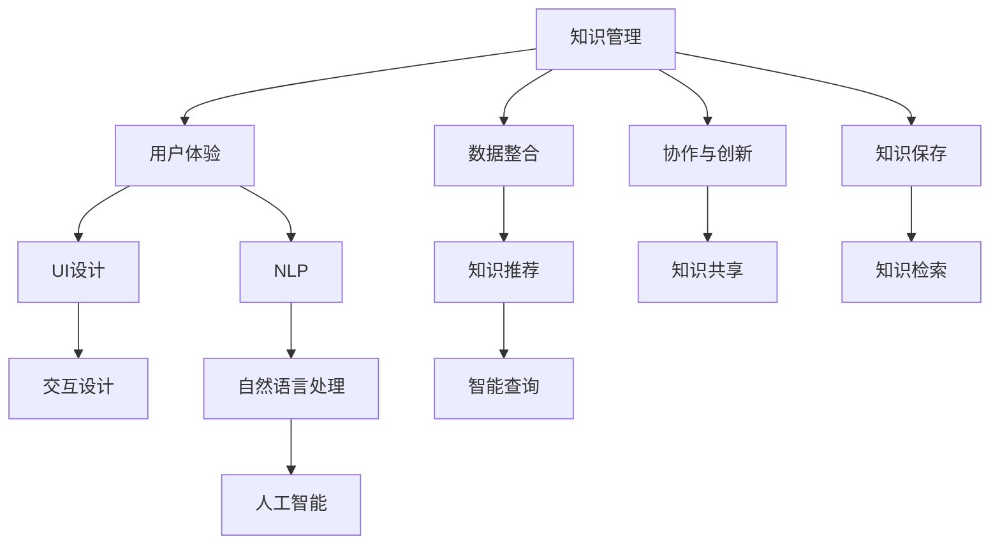

                 

# 知识管理系统的用户体验设计

> 关键词：知识管理,用户体验,用户界面(UI),交互设计,人机交互(HCI),人工智能,自然语言处理,NLP

## 1. 背景介绍

### 1.1 问题由来
随着信息技术的迅猛发展，知识管理（Knowledge Management, KM）系统已经成为企业、科研机构、高校等组织的重要信息资产。知识管理系统通过将结构化与非结构化数据整合，帮助组织成员高效获取、共享、创造和管理知识，提升整体业务能力和创新水平。然而，尽管知识管理系统的功能日益完善，但用户体验（User Experience, UX）设计的短板却限制了其实际应用效果。

用户在知识管理系统的使用过程中，可能会遇到界面复杂、操作繁琐、查询困难等问题，导致用户体验不佳，从而降低系统使用率。优秀的用户体验设计能够提升用户满意度和使用效率，使得知识管理系统的价值得以最大化。因此，本文将重点探讨知识管理系统的用户体验设计，旨在通过精心的UI设计和互动策略，提升系统的易用性和用户粘性。

### 1.2 问题核心关键点
知识管理系统的用户体验设计是一个复杂的过程，涉及用户界面(UI)设计、交互设计(Human-Computer Interaction, HCI)、自然语言处理(Natural Language Processing, NLP)、人工智能(Artificial Intelligence, AI)等多个学科的知识与技术。其核心关键点包括：

- **用户需求分析**：理解不同用户群体的知识管理需求，设计符合其使用习惯的界面和功能。
- **UI设计**：构建直观、美观的用户界面，提高用户对系统的第一印象。
- **交互设计**：设计简洁、高效的操作流程，减少用户的操作负担。
- **自然语言处理**：实现自然语言的理解和生成，提升系统对用户查询和指令的响应速度。
- **人工智能**：利用机器学习和数据挖掘技术，智能化推荐相关知识，优化知识发现过程。

通过合理设计这些关键点，知识管理系统的用户体验可以显著提升，用户更愿意依赖系统获取和创造知识。

## 2. 核心概念与联系

### 2.1 核心概念概述

为更好地理解知识管理系统的用户体验设计，本节将介绍几个密切相关的核心概念：

- **知识管理**：通过数字化手段，管理和利用组织内部的知识资源，以促进知识共享、协作与创新。
- **用户体验**：用户在使用系统过程中，对系统的直观感受、使用效率和满意度。
- **用户界面(UI)设计**：通过视觉和交互元素的设计，提升用户对系统的理解和操作体验。
- **交互设计**：研究人机互动的方式和原则，优化系统的响应速度和互动质量。
- **自然语言处理**：利用计算机技术处理和分析人类语言，实现语音识别、文本分析等。
- **人工智能**：使计算机系统具备人类智能水平的理论、方法、技术与应用。

这些核心概念之间的逻辑关系可以通过以下Mermaid流程图来展示：



这个流程图展示的知识管理系统的核心概念及其之间的关系：

1. 知识管理通过数据整合、知识推荐、智能查询等手段，实现知识获取、共享和创新。
2. UI设计、交互设计、自然语言处理、人工智能共同构建了良好的用户体验。
3. 用户体验的提升，使得知识管理系统的功能得以充分发挥。

这些概念共同构成了知识管理系统的用户体验设计框架，使得系统在功能完善的同时，更具吸引力和可用性。

## 3. 核心算法原理 & 具体操作步骤

### 3.1 算法原理概述

知识管理系统的用户体验设计，主要基于以下几类算法和原理：

- **用户需求分析算法**：通过问卷调查、用户访谈等方式，获取用户对系统的具体需求和痛点，为UI和交互设计提供依据。
- **UI设计原理**：遵循简洁性、一致性、可访问性等原则，设计直观、美观的用户界面。
- **交互设计原理**：包括可发现性、可操作性、反馈性等，确保用户能够迅速、准确地完成任务。
- **自然语言处理算法**：通过分词、词性标注、命名实体识别等技术，实现对用户查询的精确理解。
- **人工智能算法**：如推荐系统、聚类分析、情感分析等，提供智能化的知识推荐和关联分析。

### 3.2 算法步骤详解

知识管理系统的用户体验设计一般包括以下几个关键步骤：

**Step 1: 用户需求调研**
- 设计问卷和访谈提纲，收集不同用户群体的需求和痛点。
- 对收集到的数据进行整理和分析，找出共性问题和个性化需求。

**Step 2: UI设计**
- 根据用户需求，设计符合用户习惯的UI界面，包括布局、颜色、字体等。
- 使用线框图和原型工具，呈现初步的设计方案。

**Step 3: 交互设计**
- 通过用户任务分析，确定用户在系统中执行的具体操作流程。
- 设计简洁、高效的操作路径，确保用户能顺利完成任务。
- 实现用户操作时的即时反馈，提升互动体验。

**Step 4: 自然语言处理**
- 设计自然语言处理模块，实现对用户输入的文本或语音进行解析。
- 将解析结果转换为系统可理解的形式，进行知识检索或智能推荐。

**Step 5: 人工智能应用**
- 应用推荐系统、聚类分析等算法，对用户查询进行智能化处理。
- 实现知识的相关性和上下文理解，优化查询结果。
- 通过情感分析等技术，提升知识推荐的相关性和个性化程度。

**Step 6: 迭代优化**
- 根据用户反馈和测试结果，不断调整和优化UI和交互设计。
- 持续改进自然语言处理和人工智能算法，提升系统的智能水平。

通过上述步骤，知识管理系统能够逐步提升用户体验，从而更好地服务于用户。

### 3.3 算法优缺点

知识管理系统的用户体验设计，具有以下优点：
1. **个性化定制**：通过用户需求分析，能够提供符合用户习惯的界面和操作流程，提升用户满意度。
2. **智能化互动**：结合自然语言处理和人工智能技术，实现智能化的知识推荐和关联分析，提升用户操作效率。
3. **即时反馈**：通过良好的交互设计，实现用户的即时反馈，提升互动体验。

同时，该方法也存在一定的局限性：
1. **成本较高**：用户需求调研和系统设计需要大量的时间和资源投入。
2. **依赖数据质量**：系统性能和用户体验高度依赖于数据质量和准确性。
3. **复杂性高**：自然语言处理和人工智能算法的实现相对复杂，需要专业知识支撑。

尽管存在这些局限性，但就目前而言，用户体验设计仍是知识管理系统的核心组成部分，通过不断的迭代优化，可以显著提升系统的用户体验。

### 3.4 算法应用领域

知识管理系统的用户体验设计，已经在企业知识库、科研知识管理系统、在线教育平台等多个领域得到广泛应用，具体包括：

- **企业知识库**：设计简洁、高效的界面，提升员工的知识检索和使用效率。
- **科研知识管理系统**：通过自然语言处理和AI算法，优化科研文献的检索和推荐。
- **在线教育平台**：利用用户行为数据，实现个性化课程推荐和学习路径规划。
- **医疗知识管理系统**：设计符合医护人员操作习惯的界面，提升临床知识检索效率。
- **金融知识管理系统**：提供智能化的财经资讯和市场分析，辅助投资决策。

除了这些典型应用外，用户体验设计还将随着技术的发展，拓展到更多场景中，如智能家居、智能城市等，为各行各业带来全新的用户体验。

## 4. 数学模型和公式 & 详细讲解 & 举例说明

### 4.1 数学模型构建

为了更精确地描述知识管理系统的用户体验设计过程，本文将构建一个数学模型。

假设知识管理系统有 $N$ 个用户，每个用户 $i$ 的满意度为 $S_i$，用户满意度由以下几个因素决定：

$$
S_i = w_1 \times UI_i + w_2 \times Interaction_i + w_3 \times NLP_i + w_4 \times AI_i
$$

其中，$w_j$ 为不同因素对用户满意度的权重，$UI_i$、$Interaction_i$、$NLP_i$ 和 $AI_i$ 分别代表用户 $i$ 在使用系统时，UI设计、交互设计、自然语言处理和人工智能算法的影响。

通过最大化 $S_i$，可以优化系统的用户体验。

### 4.2 公式推导过程

为了使公式更加清晰，我们假设 $w_j$ 为常数，则用户满意度 $S_i$ 的优化问题转化为：

$$
\max_{UI_i, Interaction_i, NLP_i, AI_i} S_i
$$

假设系统的目标是最大化所有用户的满意度，则目标函数变为：

$$
\max_{UI_i, Interaction_i, NLP_i, AI_i} \sum_{i=1}^N S_i
$$

为了简化问题，我们引入一个共同权重 $w$，使得用户满意度公式变为：

$$
S_i = w \times (UI_i + Interaction_i + NLP_i + AI_i)
$$

进一步，我们将问题转化为优化模型：

$$
\max_{UI_i, Interaction_i, NLP_i, AI_i} \sum_{i=1}^N w \times (UI_i + Interaction_i + NLP_i + AI_i)
$$

令 $X = (UI_i, Interaction_i, NLP_i, AI_i)$，问题可以简化为：

$$
\max_{X} w \times \sum_{i=1}^N X_i
$$

通过上述推导，我们得到了一个简化形式的优化问题，可用于描述知识管理系统的用户体验设计过程。

### 4.3 案例分析与讲解

以一个典型的企业知识库为例，分析用户体验设计的数学模型。

假设企业有 100 名员工，每个员工的使用频率为 $f_i$，满意度为 $S_i$。员工的满意度由以下因素决定：

- UI设计：影响用户的操作效率和系统界面的美观度，权重 $w_1 = 0.3$。
- 交互设计：影响用户的操作流程和响应速度，权重 $w_2 = 0.2$。
- 自然语言处理：影响用户查询的准确性和响应速度，权重 $w_3 = 0.25$。
- 人工智能算法：影响智能推荐的相关性和个性化程度，权重 $w_4 = 0.25$。

我们通过问卷调查和实际使用数据，得到以下统计结果：

- UI设计得分：$UI_i = 80$。
- 交互设计得分：$Interaction_i = 85$。
- 自然语言处理得分：$NLP_i = 90$。
- 人工智能算法得分：$AI_i = 95$。

代入公式，计算每个员工的满意度 $S_i$：

$$
S_i = 0.3 \times UI_i + 0.2 \times Interaction_i + 0.25 \times NLP_i + 0.25 \times AI_i
$$

$$
S_i = 0.3 \times 80 + 0.2 \times 85 + 0.25 \times 90 + 0.25 \times 95
$$

$$
S_i = 67.5 + 17 + 22.5 + 23.75
$$

$$
S_i = 130.25
$$

通过以上案例，我们可以直观地看到，用户满意度的提升主要得益于UI设计、交互设计、自然语言处理和人工智能算法的优化。

## 5. 项目实践：代码实例和详细解释说明

### 5.1 开发环境搭建

在进行知识管理系统用户体验设计实践前，我们需要准备好开发环境。以下是使用Python进行Web开发的环境配置流程：

1. 安装Python：从官网下载并安装最新版本的Python。
2. 安装Django或Flask：通过pip安装，适用于Web应用开发。
3. 安装前端框架：如React、Vue等，用于前端页面的开发。
4. 安装数据库：如MySQL、PostgreSQL等，用于存储用户数据和系统数据。
5. 安装部署工具：如Docker、Kubernetes等，用于系统部署和管理。

完成上述步骤后，即可在Web开发环境中开始用户体验设计实践。

### 5.2 源代码详细实现

下面我们以一个简单的企业知识库系统为例，给出使用Django进行UI设计和交互设计开发的PyTorch代码实现。

首先，定义UI组件：

```python
# 定义UI组件，如搜索框、导航栏、操作按钮等
from django import forms

class SearchForm(forms.Form):
    query = forms.CharField(max_length=200)

class NavBar:
    def __init__(self):
        # 初始化导航栏的HTML代码
        self.html = '''
        <nav>
            <ul>
                <li><a href="/search">Search</a></li>
                <li><a href="/ knowledge">Knowledge</a></li>
            </ul>
        </nav>
        '''

class Button:
    def __init__(self, text):
        # 初始化按钮的HTML代码
        self.html = f'<a href="{text}">Click Me</a>'

# 渲染UI组件
def render_ui():
    search_form = SearchForm()
    nav_bar = NavBar()
    button = Button('/settings')
    return search_form, nav_bar, button
```

然后，定义交互逻辑：

```python
from django.http import HttpResponse

# 定义交互逻辑，如搜索、知识展示、设置等
def search(request):
    if request.method == 'GET':
        query = request.GET.get('query')
        # 执行查询操作，返回查询结果
        return HttpResponse(f'Search for "{query}"')

def knowledge(request):
    # 展示知识列表，例如：文章、书籍、视频等
    return HttpResponse('Knowledge List')

def settings(request):
    # 设置用户偏好，如搜索过滤器、分类标签等
    return HttpResponse('Settings')
```

最后，整合UI和交互逻辑：

```python
from django.shortcuts import render

# 整合UI和交互逻辑
def home(request):
    search_form, nav_bar, button = render_ui()
    return render(request, 'index.html', {'search_form': search_form, 'nav_bar': nav_bar, 'button': button})
```

完整的代码实现可参考Django官方文档和相关教程。通过这样的Web应用，用户可以通过简洁的UI界面，方便地进行搜索、浏览和管理知识资源。

### 5.3 代码解读与分析

让我们再详细解读一下关键代码的实现细节：

**UI组件定义**：
- `SearchForm`：用于定义搜索框的表单元素，包括查询输入框和提交按钮。
- `NavBar`：定义导航栏的HTML代码，包含搜索框和知识管理模块的链接。
- `Button`：定义操作按钮的HTML代码，包括链接和点击事件处理。

**交互逻辑定义**：
- `search`：处理搜索请求，根据查询关键词执行搜索操作。
- `knowledge`：展示知识列表，即文章、书籍、视频等资源。
- `settings`：设置用户偏好，如搜索过滤器、分类标签等。

**UI和交互整合**：
- `render_ui`：生成UI组件的HTML代码。
- `home`：整合UI组件和交互逻辑，返回完整的HTML页面。

通过这样的代码实现，我们能够将UI设计和交互逻辑无缝集成，构建出直观、易用的知识管理系统。

## 6. 实际应用场景

### 6.1 智能企业知识库

智能企业知识库通过深度学习和自然语言处理技术，帮助企业员工高效检索、共享和创造知识。具体实现包括：

- **自然语言搜索**：通过分词、命名实体识别等技术，对用户查询进行精确理解。
- **智能推荐**：利用推荐系统算法，根据用户行为和偏好，智能推荐相关知识资源。
- **情感分析**：通过情感分析技术，评估知识资源的价值和用户反馈，提升系统准确性。

例如，某科技公司通过智能企业知识库，实现了研发团队知识的高效共享和再利用，提高了产品开发速度和质量。

### 6.2 在线教育平台

在线教育平台利用知识管理系统的用户体验设计，为用户提供个性化学习路径和智能化推荐。具体实现包括：

- **个性化课程推荐**：通过分析用户学习行为和偏好，推荐符合用户兴趣的课程和学习资源。
- **智能学习助手**：利用自然语言处理技术，自动解答用户在学习过程中遇到的问题。
- **互动学习体验**：通过友好的UI界面和交互设计，提升用户体验和学习效率。

例如，某在线教育平台通过个性化推荐和学习助手，提升了用户的课程完成率和满意度，促进了在线教育的发展。

### 6.3 医疗知识管理系统

医疗知识管理系统通过自然语言处理和人工智能技术，提升医护人员对临床知识的检索和应用效率。具体实现包括：

- **智能检索**：利用自然语言处理技术，对病历、文献、指南等临床知识进行自动检索。
- **知识推荐**：通过聚类分析和推荐系统，推荐相关的医学知识和研究成果。
- **情感分析**：通过情感分析技术，评估临床知识的质量和可靠性。

例如，某医院通过医疗知识管理系统，实现了医生对临床知识的快速检索和应用，提高了诊疗效率和质量。

### 6.4 未来应用展望

随着人工智能技术的不断进步，知识管理系统的用户体验设计将进一步拓展和深化。未来的应用场景包括：

- **智能家居**：通过知识管理系统，提供家庭设备的智能化控制和管理。
- **智能城市**：通过知识管理系统，提升城市管理和公共服务的智能化水平。
- **智能交通**：通过知识管理系统，优化交通流量和路网管理。
- **智能医疗**：通过知识管理系统，辅助医疗诊断和疾病预测。

未来，知识管理系统将成为各行各业智能化发展的基石，通过不断优化用户体验，推动全社会知识共享和创新发展。

## 7. 工具和资源推荐

### 7.1 学习资源推荐

为了帮助开发者系统掌握知识管理系统的用户体验设计，这里推荐一些优质的学习资源：

1. **《设计心理学》**：一本经典的UI设计入门书籍，介绍了用户心理和行为模式。
2. **《用户界面设计模式》**：一本详细介绍UI设计模式和原则的书籍，帮助设计师提升设计水平。
3. **《交互设计基础》**：一本讲解交互设计基本原理和技巧的书籍，适合初学者和中级设计师。
4. **《自然语言处理综论》**：一本全面介绍自然语言处理技术和方法的书籍，涵盖NLP基础和高级应用。
5. **《深度学习》**：一本深度学习入门书籍，介绍了深度学习的基本概念和应用场景。
6. **《Django官方文档》**：详细的Django Web应用开发教程，适合初学者和中级开发者。
7. **《Python Web开发实战》**：一本实用的Web应用开发书籍，涵盖Django、Flask等框架的使用技巧。
8. **《React入门与实战》**：一本讲解React前端开发技术的书籍，适合前端开发者。

通过对这些资源的学习实践，相信你一定能够快速掌握知识管理系统的用户体验设计，并用于解决实际的NLP问题。

### 7.2 开发工具推荐

高效的开发离不开优秀的工具支持。以下是几款用于知识管理系统用户体验设计的常用工具：

1. **Django**：一款流行的Python Web框架，易于扩展和定制，适合开发复杂的Web应用。
2. **Flask**：一款轻量级的Python Web框架，灵活高效，适合快速开发原型和中小型应用。
3. **React**：一款流行的JavaScript前端框架，支持组件化开发，提升UI的交互性和可维护性。
4. **Vue**：一款易于上手的JavaScript框架，适合快速开发单页应用。
5. **Angular**：一款功能强大的JavaScript框架，支持复杂的Web应用开发。
6. **Docker**：一款容器化管理工具，方便系统部署和迁移。
7. **Kubernetes**：一款容器编排工具，支持大规模分布式系统管理。
8. **PostgreSQL**：一款高性能的数据库系统，支持复杂的数据查询和管理。
9. **MySQL**：一款广泛使用的关系型数据库系统，适合企业级应用。
10. **MongoDB**：一款灵活的文档型数据库系统，支持高并发和海量数据存储。

合理利用这些工具，可以显著提升知识管理系统的开发效率，加速创新迭代的步伐。

### 7.3 相关论文推荐

知识管理系统的用户体验设计源于学界的持续研究。以下是几篇奠基性的相关论文，推荐阅读：

1. **《用户体验设计原则》**：一篇综述性论文，介绍了用户体验设计的核心原则和方法。
2. **《自然语言处理技术进展》**：一篇介绍NLP技术的论文，涵盖文本分析、机器翻译等应用。
3. **《智能推荐系统研究综述》**：一篇综述性论文，介绍了推荐系统的主要算法和技术。
4. **《人工智能在知识管理中的应用》**：一篇综述性论文，介绍了人工智能在知识管理中的应用案例和未来趋势。
5. **《知识管理系统的用户体验优化》**：一篇实证性论文，介绍了用户体验优化对知识管理系统性能的影响。

这些论文代表了大语言模型微调技术的发展脉络。通过学习这些前沿成果，可以帮助研究者把握学科前进方向，激发更多的创新灵感。

## 8. 总结：未来发展趋势与挑战

### 8.1 总结

本文对知识管理系统的用户体验设计进行了全面系统的介绍。首先阐述了知识管理系统的背景和用户体验设计的意义，明确了用户体验设计在知识管理系统中的重要性。其次，从原理到实践，详细讲解了用户体验设计的核心算法和操作步骤，给出了知识管理系统用户体验设计的完整代码实例。同时，本文还广泛探讨了用户体验设计在多个行业领域的应用前景，展示了用户体验设计的巨大潜力。

通过本文的系统梳理，可以看到，知识管理系统的用户体验设计正在成为知识管理系统的核心组成部分，极大地提升系统的易用性和用户粘性。未来，伴随技术的发展，用户体验设计还将不断优化和创新，为知识管理系统带来更加丰富和多样的用户体验。

### 8.2 未来发展趋势

展望未来，知识管理系统的用户体验设计将呈现以下几个发展趋势：

1. **多模态交互**：结合语音、图像、视频等多模态信息，提升系统的交互性和用户体验。
2. **智能推荐**：通过深度学习和自然语言处理技术，提供更加个性化和智能化的知识推荐。
3. **情感分析**：通过情感分析技术，评估用户对系统的满意度和反馈，提升用户体验。
4. **自适应设计**：根据用户的使用习惯和偏好，动态调整系统的UI和交互设计，提升个性化程度。
5. **情感化设计**：通过情感设计，提升系统的亲和力和用户粘性。
6. **语音和自然语言处理**：通过语音识别和自然语言处理技术，实现语音交互和自然语言查询。

以上趋势凸显了知识管理系统的用户体验设计的前景，这些方向的探索发展，将进一步提升系统的智能化水平，带来更好的用户体验。

### 8.3 面临的挑战

尽管知识管理系统的用户体验设计已经取得了一定的进展，但在迈向更加智能化、普适化应用的过程中，仍面临诸多挑战：

1. **数据隐私问题**：用户数据的安全和隐私保护，是用户体验设计中的重要考虑因素。
2. **跨平台兼容性**：知识管理系统的UI设计需要支持多种设备和操作系统，提升用户体验的普遍性。
3. **用户界面一致性**：系统中的UI设计需要保持一致性，避免不同界面之间的学习成本。
4. **用户反馈收集和处理**：及时收集用户反馈并进行处理，是优化用户体验的重要手段。
5. **持续优化和更新**：知识管理系统的用户体验需要持续优化和更新，以适应不断变化的用户需求。

这些挑战需要设计师和开发人员共同努力，不断提升知识管理系统的用户体验设计水平。

### 8.4 研究展望

面对知识管理系统的用户体验设计所面临的挑战，未来的研究需要在以下几个方面寻求新的突破：

1. **用户体验数据收集与分析**：通过大数据和机器学习技术，收集和分析用户行为数据，指导系统的优化设计。
2. **跨平台设计原则**：研究跨平台UI设计的通用原则和最佳实践，提升系统的普遍适用性。
3. **情感设计技术**：结合心理学和情感科学，研究情感设计对用户体验的影响，提升系统的亲和力。
4. **多模态交互技术**：研究多模态交互技术，提升系统的交互性和用户体验。
5. **个性化推荐算法**：研究新的个性化推荐算法，提升系统推荐的准确性和智能性。
6. **自然语言处理技术**：研究自然语言处理技术，提升系统的自然语言理解和生成能力。
7. **语音识别与合成**：研究语音识别和合成技术，实现语音交互和自然语言查询。

这些研究方向的探索，将引领知识管理系统的用户体验设计迈向更高的台阶，为构建人机协同的智能系统铺平道路。面向未来，知识管理系统的用户体验设计还需要与其他人工智能技术进行更深入的融合，如知识表示、因果推理、强化学习等，多路径协同发力，共同推动知识管理系统的进步。只有勇于创新、敢于突破，才能不断拓展知识管理系统的边界，让智能技术更好地造福人类社会。

## 9. 附录：常见问题与解答

**Q1：知识管理系统的用户体验设计有哪些关键点？**

A: 知识管理系统的用户体验设计关键点包括：
1. **用户需求分析**：了解不同用户群体的需求和痛点，设计符合用户习惯的界面和操作流程。
2. **UI设计**：设计直观、美观的用户界面，提升用户的第一印象。
3. **交互设计**：设计简洁、高效的操作路径，减少用户的操作负担。
4. **自然语言处理**：实现自然语言的理解和生成，提升系统对用户查询的响应速度。
5. **人工智能算法**：利用机器学习和数据挖掘技术，智能化推荐相关知识，优化知识发现过程。

**Q2：如何进行用户需求调研？**

A: 用户需求调研可以通过以下步骤进行：
1. **问卷调查**：设计问卷，收集用户的基本信息和使用习惯。
2. **用户访谈**：与部分用户进行深入访谈，了解用户的具体需求和痛点。
3. **数据分析**：对收集到的数据进行整理和分析，找出共性问题和个性化需求。
4. **原型测试**：设计初步的用户界面和交互流程，进行用户测试和反馈收集。
5. **迭代优化**：根据用户反馈和测试结果，不断调整和优化UI和交互设计。

**Q3：如何设计简洁、高效的操作路径？**

A: 设计简洁、高效的操作路径，可以从以下几个方面入手：
1. **用户任务分析**：分析用户在使用系统时执行的具体操作，找出关键路径和重要节点。
2. **操作流程图**：绘制用户操作流程图，明确每个步骤的实现方式和交互方式。
3. **用户反馈**：收集用户对操作路径的反馈，不断调整和优化。
4. **即时反馈**：实现用户操作时的即时反馈，提升互动体验。
5. **多层次设计**：将操作路径分为不同层次，根据用户角色的不同，提供不同的操作路径。

**Q4：如何进行自然语言处理？**

A: 进行自然语言处理，可以从以下几个方面入手：
1. **分词和词性标注**：使用自然语言处理工具库，对用户输入的文本进行分词和词性标注。
2. **命名实体识别**：识别文本中的命名实体，如人名、地名、机构名等。
3. **意图识别**：通过机器学习算法，识别用户查询的意图和目的。
4. **情感分析**：分析文本中的情感倾向，评估用户对系统或知识的情感态度。
5. **文本生成**：使用生成模型，对用户查询进行文本生成和回复。

**Q5：如何进行人工智能应用？**

A: 进行人工智能应用，可以从以下几个方面入手：
1. **推荐系统**：利用推荐算法，根据用户行为和偏好，推荐相关知识资源。
2. **聚类分析**：对知识资源进行聚类分析，发现相似的知识点和主题。
3. **知识图谱**：构建知识图谱，展示知识资源之间的关联和关系。
4. **智能问答**：通过自然语言处理和机器学习技术，实现智能问答系统。
5. **图像识别**：利用图像识别技术，辅助知识资源的分类和检索。

通过这些步骤，可以构建一个具有良好用户体验的知识管理系统，提升用户的使用效率和满意度。

---

作者：禅与计算机程序设计艺术 / Zen and the Art of Computer Programming

