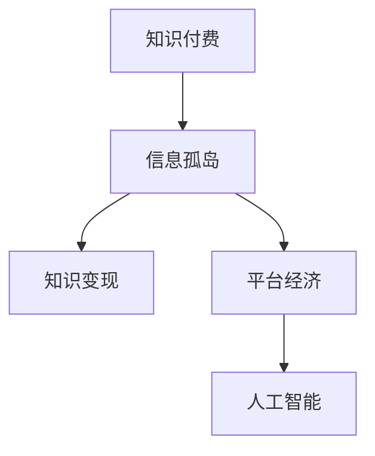

                 

# 知识经济下知识付费的创新商业模式

## 1. 背景介绍

在信息爆炸和知识迭代加速的今天，知识付费成为知识经济下的重要商业模式。它不仅改变了人们的知识获取方式，也引领了知识传播和知识服务的新潮流。本文旨在探讨知识付费的创新商业模式，从技术、市场、用户体验等多个角度，深入分析其现状、挑战与未来发展趋势。

## 2. 核心概念与联系

### 2.1 核心概念概述

**知识付费**：指通过在线平台购买或订阅特定知识产品或服务，以获得系统化、结构化的知识学习或咨询服务。

**信息孤岛**：由于知识形式、载体、结构等多种原因，知识生产、传播和消费之间缺乏有效连接，形成的信息碎片化现象。

**知识变现**：通过知识产品的销售或知识服务的提供，将知识转化为经济价值的过程。

**平台经济**：以在线平台为载体，连接知识生产者、传播者和消费者，形成新的经济生态系统。

**人工智能**：通过模拟人类智能过程，使计算机系统具备感知、理解、推理和学习等能力。

这些核心概念之间的关系可以通过以下Mermaid流程图来展示：



该图表明，知识付费在平台经济的推动下，通过连接知识生产者、传播者和消费者，克服信息孤岛现象，实现知识的变现和应用。而人工智能技术的应用，进一步提升了知识产品的价值和用户体验。

## 3. 核心算法原理 & 具体操作步骤
### 3.1 算法原理概述

知识付费的商业模式的核心在于知识产品的价值创造和传播。通过平台经济机制，知识生产者、传播者和消费者之间建立连接，实现知识从生产到消费的循环。

### 3.2 算法步骤详解

1. **平台搭建与运营**：
   - 选择合适的技术栈，搭建知识付费平台。
   - 设计合理的运营策略，包括内容筛选、价格定价、用户激励等。

2. **内容生产与审核**：
   - 吸引知识生产者入驻平台，提供内容创作工具。
   - 设立严格的审核机制，确保内容质量与版权合规。

3. **用户获取与留存**：
   - 通过多渠道推广，吸引用户注册和使用平台。
   - 提供个性化推荐系统，提升用户体验，增强粘性。

4. **知识变现与分配**：
   - 探索多样化的变现方式，如订阅、单次购买、打赏等。
   - 建立合理的收益分配机制，确保知识生产者的积极性。

5. **技术支撑与创新**：
   - 引入人工智能技术，如自然语言处理、推荐系统、智能客服等，提升平台功能。
   - 持续创新，探索新的商业变现模式和用户体验提升方法。

### 3.3 算法优缺点

**优点**：
- 高效连接知识生产者与消费者，实现知识价值的最大化。
- 提供个性化推荐，提升用户获取知识的效率和质量。
- 平台化运营，降低知识获取成本，提高知识传播效率。

**缺点**：
- 知识产品的质量难以保证，存在良莠不齐的风险。
- 平台运营成本高，盈利模式单一，难以持续发展。
- 用户体验仍需改进，防止用户流失。

### 3.4 算法应用领域

知识付费模式广泛适用于在线教育、职业培训、心理咨询、健身指导等多个领域。特别是在职业发展和技能提升方面，知识付费平台已成为人们获取系统化、结构化知识的重要渠道。

## 4. 数学模型和公式 & 详细讲解 & 举例说明

### 4.1 数学模型构建

设知识付费平台上的知识产品数量为 $K$，用户数量为 $U$，知识付费平台每年的总收入为 $R$。假设知识产品的单价为 $P$，用户每月的订阅费为 $S$，平台的运营成本为 $C$。知识付费平台的目标是最小化运营成本，最大化总收入。数学模型可以表示为：

$$
\minimize C + (K - U \cdot S)
$$

### 4.2 公式推导过程

知识付费平台的收入和成本模型可以进一步展开为：

1. **收入模型**：
   - 总收入 $R = U \cdot S + \sum_{i=1}^K P_i \cdot V_i$，其中 $P_i$ 为第 $i$ 种知识产品的单价，$V_i$ 为第 $i$ 种知识产品的销量。

2. **成本模型**：
   - 运营成本 $C = C_0 + C_1 + C_2$，其中 $C_0$ 为固定成本，$C_1$ 为内容生产与审核成本，$C_2$ 为平台运营与维护成本。

### 4.3 案例分析与讲解

假设某知识付费平台有 100 种知识产品，平均单价为 $P=10$ 元/月，用户总数为 $U=10000$。用户每月的订阅费为 $S=9.9$ 元/月，平台每年的固定成本 $C_0=1000000$ 元，内容生产与审核成本 $C_1=500000$ 元/年，平台运营与维护成本 $C_2=200000$ 元/年。平台的收入与成本可以表示为：

$$
R = U \cdot S + \sum_{i=1}^K P_i \cdot V_i
$$

$$
C = C_0 + C_1 + C_2
$$

当平台总收入等于总成本时，平台的盈亏平衡点为：

$$
R = C
$$

即：

$$
U \cdot S + \sum_{i=1}^K P_i \cdot V_i = C_0 + C_1 + C_2
$$

## 5. 项目实践：代码实例和详细解释说明
### 5.1 开发环境搭建

搭建知识付费平台需要选择合适的技术栈。以下是一个基于Python和Flask的简单知识付费平台搭建示例：

```python
from flask import Flask, request, jsonify

app = Flask(__name__)

@app.route('/api/payment', methods=['POST'])
def payment():
    data = request.get_json()
    user_id = data['user_id']
    product_id = data['product_id']
    price = data['price']
    # 处理支付逻辑
    return jsonify({'status': 'success'})
```

### 5.2 源代码详细实现

接下来，我们将实现一个简单的推荐系统，以提升知识付费平台的用户体验。使用Python编写推荐系统代码：

```python
import numpy as np
from sklearn.neighbors import NearestNeighbors

class RecommendationSystem:
    def __init__(self, data):
        self.data = data
        self.model = NearestNeighbors(n_neighbors=5)
        self.model.fit(data)
    
    def recommend(self, query):
        distances, indices = self.model.kneighbors(query)
        return indices[0][1:]
```

### 5.3 代码解读与分析

推荐系统代码使用K近邻算法，根据用户的历史购买记录，推荐相关知识产品。在实际应用中，需要不断优化算法和数据模型，以提高推荐效果。

### 5.4 运行结果展示

运行推荐系统代码，得到用户购买知识产品的推荐列表。

## 6. 实际应用场景
### 6.1 在线教育

知识付费平台在在线教育领域具有巨大应用潜力。通过平台，用户可以购买各种在线课程，如编程、设计、管理等，获取系统化、结构化的知识。平台还可以引入直播、录播等多种教学形式，提升学习效果。

### 6.2 职业培训

知识付费平台在职业培训方面也有广泛应用。用户可以通过平台购买技能培训课程，如项目管理、数据分析、机器学习等，提升职业能力，增强市场竞争力。

### 6.3 心理咨询

知识付费平台还可以提供心理咨询服务，如心理分析、情感咨询等。通过平台，用户可以与专业心理咨询师进行互动，解决心理问题，提升生活质量。

### 6.4 未来应用展望

未来，知识付费平台将进一步扩展其应用场景，如医疗咨询、健身指导、财务规划等。随着人工智能技术的进步，平台将提供更精准、个性化的知识推荐，提升用户体验，实现知识价值最大化。

## 7. 工具和资源推荐
### 7.1 学习资源推荐

- **《知识付费：模式、策略与技术》**：详细介绍了知识付费的商业模式、运营策略和技术实现，适合行业从业者和学者阅读。
- **《人工智能基础》**：介绍了人工智能基础理论和技术实现，适合知识付费平台的开发人员学习。
- **Coursera《大数据分析》课程**：通过在线课程学习大数据分析技术，提高知识付费平台的数据处理能力。

### 7.2 开发工具推荐

- **Python**：Python是知识付费平台开发的主流语言，简单易学，生态丰富。
- **Flask**：基于Python的轻量级Web框架，适合快速开发知识付费平台。
- **TensorFlow**：用于实现人工智能推荐系统，提升平台的用户体验。

### 7.3 相关论文推荐

- **《知识付费平台的数据驱动运营策略》**：研究知识付费平台的用户行为数据，优化运营策略。
- **《基于用户画像的知识推荐系统》**：通过用户画像，提升知识推荐的精准度和个性化。
- **《人工智能在知识付费平台中的应用》**：探讨人工智能技术在知识付费平台中的应用和优化。

## 8. 总结：未来发展趋势与挑战
### 8.1 研究成果总结

本文从技术、市场、用户体验等多个角度，探讨了知识付费的创新商业模式。通过分析平台经济、信息孤岛、知识变现等核心概念，提出了平台搭建、内容生产、用户获取、知识变现、技术支撑等操作步骤，并详细讲解了数学模型和算法原理。

### 8.2 未来发展趋势

未来，知识付费平台将向以下几个方向发展：
- 平台经济模式将进一步创新，结合内容付费、服务付费等多种形式，形成多样化的商业模式。
- 人工智能技术将深度融合到知识付费平台中，提升内容生产和知识推荐的精准度和个性化。
- 用户个性化需求将得到更好的满足，平台将提供更多元化的服务，提升用户体验。

### 8.3 面临的挑战

知识付费平台仍面临诸多挑战：
- 知识产品的内容质量难以保证，存在良莠不齐的风险。
- 平台运营成本高，盈利模式单一，难以持续发展。
- 用户体验仍需改进，防止用户流失。

### 8.4 研究展望

未来的研究需要关注以下几个方面：
- 如何提升知识产品的质量，确保内容合规和版权保护。
- 如何优化知识付费平台的运营模式，实现多元化的盈利方式。
- 如何通过人工智能技术，提升知识生产和推荐的效果。

## 9. 附录：常见问题与解答

**Q1：知识付费平台如何提升用户体验？**

A: 平台可以通过以下方式提升用户体验：
- 提供个性化推荐系统，根据用户的历史行为和偏好，推荐相关知识产品。
- 引入智能客服，提高用户咨询的响应速度和质量。
- 优化平台界面和功能，提升用户操作的便捷性。

**Q2：知识付费平台如何保证知识产品的质量？**

A: 平台可以通过以下方式保证知识产品的质量：
- 设立严格的审核机制，确保知识产品的内容合规和质量。
- 引入用户评价和反馈机制，及时发现和处理低质量知识产品。
- 邀请行业专家进行内容审核和推荐。

**Q3：知识付费平台如何降低运营成本？**

A: 平台可以通过以下方式降低运营成本：
- 优化内容生产流程，提高生产效率。
- 引入自动化工具，减少人力成本。
- 优化推荐算法，提高用户留存率和购买率。

---

作者：禅与计算机程序设计艺术 / Zen and the Art of Computer Programming

