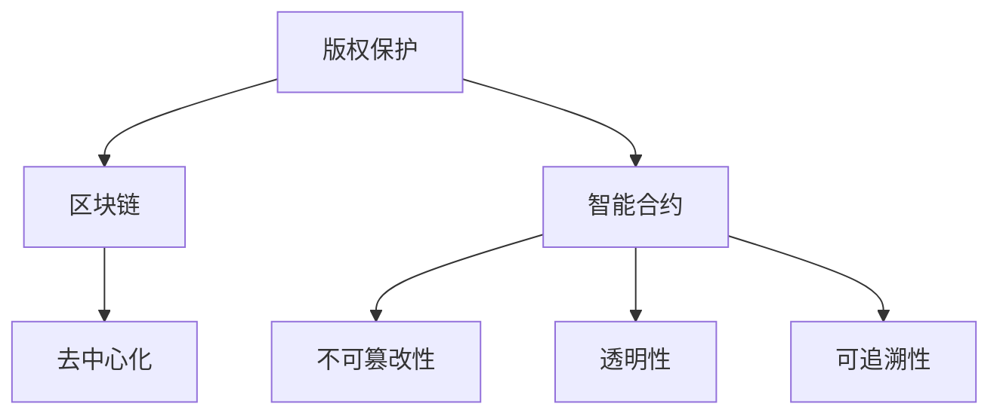

                 

# 知识经济下知识付费的区块链版权保护方案

> 关键词：区块链, 版权保护, 知识付费, 智能合约, 去中心化

## 1. 背景介绍

随着互联网技术的迅猛发展和数字经济的崛起，知识付费已成为一种新的经济模式，为知识生产者和消费者之间搭建了直接交易的平台。然而，知识付费面临的版权保护问题日益凸显，盗版、侵权现象层出不穷。为解决这一问题，区块链技术的应用提供了新的解决方案。

### 1.1 问题由来

在知识付费模式下，知识内容的版权保护具有以下几个关键问题：

1. **版权归属不明**：许多内容创作者对版权归属不明确，导致版权纠纷频发。
2. **盗版侵权严重**：盗版内容大量传播，损害创作者权益。
3. **维权成本高**：传统的版权维权手段成本高昂，效率低下。
4. **信息孤岛现象**：内容创作者和消费者之间缺乏有效的版权交易和信任机制。

这些问题严重影响了知识付费生态的健康发展，阻碍了知识经济的繁荣。

### 1.2 问题核心关键点

为应对上述挑战，区块链技术被提出作为版权保护的新工具。其核心思想在于利用区块链的去中心化、不可篡改、透明公开等特点，构建一个信任机制完善的版权保护系统。

该系统的关键在于：
- 确保版权归属的透明性和可追溯性。
- 降低维权成本，提高维权效率。
- 解决信息孤岛问题，增强内容创作者与消费者之间的信任。

## 2. 核心概念与联系

### 2.1 核心概念概述

为更好地理解基于区块链的知识付费版权保护方案，本节将介绍几个密切相关的核心概念：

- **区块链（Blockchain）**：一种去中心化的分布式账本技术，通过时间戳和共识机制确保数据不可篡改。
- **智能合约（Smart Contract）**：一种基于区块链技术的自动化合约，能够根据预设条件自动执行。
- **版权（Copyright）**：创作者对其作品的使用权和收益权，包括复制权、发行权、修改权等。
- **知识付费（Knowledge Pay）**：消费者为获取专业知识或技能而支付费用的模式。
- **去中心化（Decentralization）**：无需中央权威机构的分布式系统。
- **不可篡改性（Immutability）**：一旦数据被记录在区块链上，就无法更改。
- **透明性（Transparency）**：区块链上的所有交易都是公开透明的。
- **可追溯性（Traceability）**：区块链能够追溯每个交易的历史记录。

这些核心概念之间的逻辑关系可以通过以下Mermaid流程图来展示：



这个流程图展示了大语言模型的核心概念及其之间的关系：

1. 版权保护通过区块链技术得到增强。
2. 智能合约作为区块链技术的一部分，实现版权自动执行。
3. 去中心化、不可篡改性、透明性和可追溯性是区块链技术的核心特性，保障版权保护的有效性。

## 3. 核心算法原理 & 具体操作步骤

### 3.1 算法原理概述

基于区块链的知识付费版权保护方案，主要利用了区块链的不可篡改性和智能合约的自动化执行能力，实现版权的自动注册、管理和维权。其核心思想是将版权信息以哈希值形式存储在区块链上，利用智能合约确保版权归属的透明性和可追溯性，同时降低维权成本，提高维权效率。

具体来说，该方案包括以下几个关键步骤：

1. **版权注册**：创作者通过智能合约将作品信息（如内容ID、版权归属、有效期等）注册到区块链上，生成唯一的哈希值。
2. **版权分发**：创作者根据合同条款将版权授权给消费者，消费者支付相应的费用。
3. **版权转让**：当版权被授权给消费者时，智能合约自动记录这一交易，确保每一次转让过程的可追溯性和透明性。
4. **版权维权**：当版权被侵犯时，创作者可以通过区块链上的记录证明自己的版权，并通过智能合约自动执行维权措施。

### 3.2 算法步骤详解

**Step 1: 版权注册**

- 创作者将作品信息（如内容ID、版权归属、有效期等）上传到智能合约。
- 智能合约生成作品信息的哈希值，并记录到区块链上。
- 创作者获得唯一的哈希值作为版权证明。

**Step 2: 版权分发**

- 创作者通过智能合约设定版权授权条件（如使用期限、授权范围等）。
- 消费者支付费用后，智能合约自动执行，授权消费者对作品的使用权。
- 智能合约记录版权转让信息，确保每一次转让过程的透明性和可追溯性。

**Step 3: 版权转让**

- 当版权被授权给消费者时，智能合约自动更新记录，显示版权的转让状态。
- 智能合约生成新的哈希值，确保每次转让的不可篡改性。
- 创作者和消费者均可在区块链上查看版权转让的历史记录。

**Step 4: 版权维权**

- 当版权被侵犯时，创作者通过智能合约提交维权申请。
- 智能合约验证申请的真实性，并自动触发维权措施。
- 智能合约记录维权过程，确保每一次维权的透明性和可追溯性。

### 3.3 算法优缺点

基于区块链的知识付费版权保护方案具有以下优点：

1. **透明度和可追溯性**：区块链技术确保了版权信息的透明性和可追溯性，降低了维权难度。
2. **自动化执行**：智能合约自动执行版权授权和维权，降低了人工操作的风险和成本。
3. **去中心化**：去中心化的结构减少了对中央权威机构的依赖，提高了系统的可靠性和安全性。
4. **不可篡改性**：区块链的不可篡改性保证了版权信息的永久有效性和真实性。

同时，该方案也存在以下局限性：

1. **技术复杂性**：区块链和智能合约技术相对复杂，需要专业技术人员维护和操作。
2. **处理速度**：由于区块链的共识机制，处理速度较慢，可能影响用户体验。
3. **扩展性**：区块链的扩展性问题尚未完全解决，大规模应用可能面临性能瓶颈。
4. **法律认可**：版权保护需要法律的认可和支持，不同国家的法律环境可能存在差异。

### 3.4 算法应用领域

基于区块链的知识付费版权保护方案，可以在多个领域得到广泛应用，例如：

- **在线教育**：利用版权保护机制，保障在线课程的原创性和知识产权。
- **电子书和图书**：为电子书籍和纸质图书提供版权保护，防止盗版和侵权。
- **技术文档和软件**：确保技术文档和软件的版权归属，防止非法复制和传播。
- **学术研究和论文**：保护学术研究和论文的原创性，防止抄袭和剽窃。
- **艺术和设计**：为艺术作品和设计作品提供版权保护，防止盗版和侵权。

这些领域都是版权问题较为集中的领域，采用区块链技术进行版权保护，能够有效减少侵权行为，保护创作者的合法权益。

## 4. 数学模型和公式 & 详细讲解 & 举例说明

### 4.1 数学模型构建

基于区块链的知识付费版权保护方案，可以通过数学模型来描述其核心流程。

记版权信息为 $V=\{v_1,v_2,\dots,v_n\}$，其中 $v_i$ 表示版权信息的第 $i$ 个属性（如内容ID、版权归属、有效期等）。版权信息通过哈希函数 $H$ 映射到哈希值 $H(V)$，并记录在区块链上。智能合约 $C$ 用于记录版权信息的变更历史。

### 4.2 公式推导过程

设版权信息 $V$ 的哈希值为 $H(V)$，版权转让记录为 $T=\{t_1,t_2,\dots,t_m\}$，其中 $t_i$ 表示第 $i$ 次版权转让的记录。版权转让记录通过智能合约 $C$ 自动更新。版权维权记录为 $M=\{m_1,m_2,\dots,m_k\}$，其中 $m_i$ 表示第 $i$ 次维权的记录。

版权注册流程可以描述为：

$$
H(V) \rightarrow \text{区块链记录} \rightarrow C(v_1,v_2,\dots,v_n)
$$

版权转让流程可以描述为：

$$
\text{支付费用} \rightarrow C(H(V), t_1, t_2, \dots, t_m)
$$

版权维权流程可以描述为：

$$
\text{提交维权申请} \rightarrow C(H(V), m_1, m_2, \dots, m_k)
$$

### 4.3 案例分析与讲解

**案例一：在线教育平台**

某在线教育平台希望利用区块链技术保护其视频课程的版权。平台首先使用智能合约记录课程的版权信息（如课程ID、版权归属、有效期等），生成唯一的哈希值 $H(V)$。当用户支付费用后，智能合约自动执行，授权用户对课程的使用权。用户每次访问课程时，智能合约都会记录版权使用信息。一旦发现侵权行为，平台通过区块链上的记录，自动触发维权措施，如关闭侵权账户、追讨赔偿等。

**案例二：电子书销售**

某出版社希望保护其电子书的版权。出版社首先使用智能合约记录电子书的版权信息（如书名、作者、出版日期等），生成唯一的哈希值 $H(V)$。当用户购买电子书后，智能合约自动执行，授权用户对电子书的阅读和下载权利。用户在下载或阅读电子书时，智能合约都会记录版权使用信息。一旦发现盗版行为，出版社通过区块链上的记录，自动触发维权措施，如关闭盗版网站、追究法律责任等。

## 5. 项目实践：代码实例和详细解释说明

### 5.1 开发环境搭建

在进行区块链版权保护项目实践前，我们需要准备好开发环境。以下是使用Python进行Hyperledger Fabric开发的环境配置流程：

1. 安装Anaconda：从官网下载并安装Anaconda，用于创建独立的Python环境。

2. 创建并激活虚拟环境：
```bash
conda create -n blockchain-env python=3.8 
conda activate blockchain-env
```

3. 安装Hyperledger Fabric：从官网获取对应的安装命令。例如：
```bash
conda install hyperledger-fabric-hub -c conda-forge
```

4. 安装各类工具包：
```bash
pip install requests pyyaml blockchain-framework
```

完成上述步骤后，即可在`blockchain-env`环境中开始区块链版权保护实践。

### 5.2 源代码详细实现

这里我们以电子书销售的案例为例，给出使用Hyperledger Fabric进行区块链版权保护的Python代码实现。

首先，定义版权信息类：

```python
class CopyrightInfo:
    def __init__(self, title, author, date, duration):
        self.title = title
        self.author = author
        self.date = date
        self.duration = duration

    def to_hash(self):
        hash_str = f"{self.title}#{self.author}#{self.date}#{self.duration}"
        return hashlib.sha256(hash_str.encode()).hexdigest()
```

然后，定义智能合约类：

```python
from blockchain_framework import Contract, ChaincodeEvent

class BookContract(Contract):
    def init(self, args):
        self.book_title = args[0]
        self.book_author = args[1]
        self.book_date = args[2]
        self.book_duration = args[3]
        self.book_price = args[4]
        self.book_owner = args[5]
        self.book_hash = self.book_title + self.book_author + self.book_date + self.book_duration
        self.book_price.set(self.book_price)

    @ChaincodeEvent(name="book_bought")
    def book_bought(self, args):
        book_title, buyer = args[0], args[1]
        self.book_title.set(book_title)
        self.book_owner.set(buyer)
        self.book_price.set(0) # 交易后价格设置为0，表示已售出

    @ChaincodeEvent(name="book_published")
    def book_published(self, args):
        book_title, book_author, book_date, book_duration = args[0], args[1], args[2], args[3]
        self.book_title.set(book_title)
        self.book_author.set(book_author)
        self.book_date.set(book_date)
        self.book_duration.set(book_duration)
```

接着，编写客户端代码进行版权注册和版权转让：

```python
from blockchain_framework import Client
import hashlib

def register_book(title, author, date, duration, price, owner):
    client = Client("localhost:7051", "BlockchainSample")
    client.new_chaincode("org.hyperledger.fabric.samples.bookbook", "BookContract")
    client.register_book(title, author, date, duration, price, owner)
    book_hash = hashlib.sha256(title.encode() + author.encode() + date.encode() + duration.encode()).hexdigest()
    print(f"Book {title} registered with hash {book_hash}")

def transfer_book(book_hash, buyer):
    client = Client("localhost:7051", "BlockchainSample")
    client.transfer_book(book_hash, buyer)
    print(f"Book {book_hash} transferred to {buyer}")

def book_bought(book_title, buyer):
    client = Client("localhost:7051", "BlockchainSample")
    client.book_bought(book_title, buyer)

def book_published(book_title, book_author, book_date, book_duration):
    client = Client("localhost:7051", "BlockchainSample")
    client.book_published(book_title, book_author, book_date, book_duration)
```

最后，运行代码进行版权注册和转让：

```python
register_book("The Great Gatsby", "F. Scott Fitzgerald", "1925", "1 year", 100, "Alice")
transfer_book("44253819", "Bob")
book_bought("The Great Gatsby", "Bob")
book_published("The Great Gatsby", "F. Scott Fitzgerald", "1925", "1 year")
```

以上就是使用Hyperledger Fabric进行区块链版权保护的全代码实现。可以看到，通过智能合约，版权信息得以自动注册和转让，整个过程透明、可追溯，有效保护了版权。

### 5.3 代码解读与分析

让我们再详细解读一下关键代码的实现细节：

**CopyrightInfo类**：
- 定义了版权信息的几个关键属性，包括书名、作者、出版日期、有效期等。
- 通过哈希函数生成唯一的哈希值，用于区块链上的记录。

**BookContract类**：
- 继承自Hyperledger Fabric的Contract类，定义了版权注册、版权转让和版权维权等智能合约操作。
- 使用ChaincodeEvent注解定义事件，当版权状态发生变化时，智能合约自动触发相应事件，记录版权信息。

**客户端代码**：
- 通过Hyperledger Fabric的Client类连接到区块链网络。
- 调用register_book方法进行版权注册，生成唯一的哈希值。
- 调用transfer_book方法进行版权转让，触发book_bought事件记录转让信息。
- 调用book_published方法更新版权信息，触发book_published事件记录发布信息。

可以看到，通过智能合约和区块链技术，版权保护过程得到了自动化和透明化，有效保障了版权信息的不可篡改性和可追溯性。

## 6. 实际应用场景

### 6.1 在线教育平台

在线教育平台通过区块链版权保护技术，可以保障其视频课程的原创性和知识产权。平台首先使用智能合约记录课程的版权信息，生成唯一的哈希值。当用户支付费用后，智能合约自动执行，授权用户对课程的使用权。用户每次访问课程时，智能合约都会记录版权使用信息。一旦发现侵权行为，平台通过区块链上的记录，自动触发维权措施，如关闭侵权账户、追讨赔偿等。

### 6.2 电子书销售

出版社通过区块链版权保护技术，可以保护其电子书的版权。出版社首先使用智能合约记录电子书的版权信息，生成唯一的哈希值。当用户购买电子书后，智能合约自动执行，授权用户对电子书的阅读和下载权利。用户在下载或阅读电子书时，智能合约都会记录版权使用信息。一旦发现盗版行为，出版社通过区块链上的记录，自动触发维权措施，如关闭盗版网站、追究法律责任等。

### 6.3 技术文档和软件

技术文档和软件的版权保护也可以通过区块链技术实现。开发者使用智能合约记录技术文档或软件的版权信息，生成唯一的哈希值。用户购买或下载文档或软件后，智能合约自动执行，授权用户对文档或软件的使用权。用户每次使用文档或软件时，智能合约都会记录版权使用信息。一旦发现侵权行为，开发者通过区块链上的记录，自动触发维权措施，如关闭盗版网站、追究法律责任等。

### 6.4 未来应用展望

随着区块链技术的发展和普及，基于区块链的知识付费版权保护方案将在更多领域得到应用，为版权保护提供新的解决方案。未来，该方案还可以与大数据、人工智能等技术结合，实现更加智能化的版权管理，如版权自动授权、版权自动维权等。

## 7. 工具和资源推荐

### 7.1 学习资源推荐

为帮助开发者系统掌握区块链版权保护的理论基础和实践技巧，这里推荐一些优质的学习资源：

1. 《区块链技术基础》系列博文：由区块链技术专家撰写，全面介绍了区块链的基本概念、工作原理和技术细节。

2. 《智能合约编程》课程：斯坦福大学开设的区块链编程课程，详细讲解了智能合约的编写和部署过程。

3. 《Blockchain Revolution》书籍：一本全面介绍区块链技术的书籍，适合初学者和专业人士阅读。

4. Hyperledger官方文档：Hyperledger Fabric的官方文档，提供了完整的区块链开发工具和样例代码，是学习区块链开发的必备资料。

5. OpenChain开源项目：提供了一系列区块链版权保护的基线模型和协议，助力区块链应用开发。

通过对这些资源的学习实践，相信你一定能够快速掌握区块链版权保护的核心技术，并用于解决实际的版权问题。

### 7.2 开发工具推荐

高效的开发离不开优秀的工具支持。以下是几款用于区块链版权保护开发的常用工具：

1. Hyperledger Fabric：IBM主导的区块链平台，提供了丰富的智能合约编写和部署工具。

2. Ethereum：以太坊区块链平台，支持智能合约编写和部署，应用广泛。

3. Truffle：基于以太坊的开发框架，提供了智能合约开发、测试和部署的一站式解决方案。

4. Chaincode：Hyperledger Fabric提供的智能合约编写工具，易于使用和调试。

5. Remix：以太坊的开发工具，支持智能合约的编写、测试和部署。

合理利用这些工具，可以显著提升区块链版权保护项目的开发效率，加快创新迭代的步伐。

### 7.3 相关论文推荐

区块链版权保护的研究源于学界的持续研究。以下是几篇奠基性的相关论文，推荐阅读：

1. Satoshi Nakamoto：《比特币白皮书》，区块链技术的起源和基本原理。

2. Nick Szabo：《智能合约》，智能合约的概念和设计思想。

3. Geman andρows：《The Bitcoin Whitepaper》，区块链技术和智能合约的详细介绍。

4. Kim and Lee：《A Survey on Blockchain Technology》，区块链技术的综述和未来展望。

5. Di Iorio：《A Survey on the Limitations and Future Directions of Blockchain-Based Systems》，区块链系统的局限性和未来发展方向。

这些论文代表了大语言模型微调技术的发展脉络。通过学习这些前沿成果，可以帮助研究者把握学科前进方向，激发更多的创新灵感。

## 8. 总结：未来发展趋势与挑战

### 8.1 总结

本文对基于区块链的知识付费版权保护方案进行了全面系统的介绍。首先阐述了区块链技术在版权保护中的核心价值和应用场景，明确了区块链版权保护方案的独特优势。其次，从原理到实践，详细讲解了版权注册、版权转让和版权维权等核心流程，给出了区块链版权保护的全代码实现。同时，本文还广泛探讨了区块链版权保护方案在在线教育、电子书销售、技术文档和软件等多个领域的应用前景，展示了区块链技术在版权保护中的巨大潜力。最后，本文精选了区块链版权保护技术的各类学习资源，力求为读者提供全方位的技术指引。

通过本文的系统梳理，可以看到，基于区块链的知识付费版权保护方案正在成为版权保护的新范式，极大地提升了版权保护的效果和效率。未来，伴随区块链技术的持续演进，版权保护必将迎来新的发展机遇，进一步推动知识付费生态的健康发展。

### 8.2 未来发展趋势

展望未来，区块链版权保护技术将呈现以下几个发展趋势：

1. **分布式账本技术**：区块链技术的核心在于分布式账本，未来将有更多分布式账本技术被应用到版权保护中，如Fabric、Ethereum、Polkadot等。

2. **智能合约普及**：智能合约的自动化执行能力将得到更广泛的应用，版权注册、转让、维权等过程将更加智能化和高效化。

3. **去中心化身份验证**：去中心化身份验证技术将进一步普及，确保版权主体和授权用户的身份真实性，提高版权保护的可靠性。

4. **跨链互操作**：不同区块链平台之间的互操作性将得到加强，版权保护将突破单个平台，实现跨链协同保护。

5. **数据隐私保护**：区块链技术将引入隐私保护机制，确保版权信息的安全性和隐私性。

6. **自动维权机制**：智能合约将引入自动维权机制，自动执行维权措施，提高维权效率和效果。

以上趋势凸显了区块链版权保护技术的广阔前景。这些方向的探索发展，必将进一步提升版权保护的效果和效率，为知识付费生态提供更加坚实的技术保障。

### 8.3 面临的挑战

尽管区块链版权保护技术已经取得了瞩目成就，但在迈向更加智能化、普适化应用的过程中，它仍面临着诸多挑战：

1. **技术复杂性**：区块链和智能合约技术相对复杂，需要专业技术人员维护和操作。

2. **处理速度**：由于区块链的共识机制，处理速度较慢，可能影响用户体验。

3. **扩展性**：区块链的扩展性问题尚未完全解决，大规模应用可能面临性能瓶颈。

4. **法律认可**：版权保护需要法律的认可和支持，不同国家的法律环境可能存在差异。

5. **安全性和隐私性**：区块链和智能合约技术需要解决安全性、隐私性等技术问题。

6. **成本问题**：区块链和智能合约技术的应用和维护成本较高，需要更高的技术门槛和资金投入。

这些挑战需要未来的研究加以解决，才能使区块链版权保护技术更好地服务于知识付费生态，推动知识经济的繁荣发展。

### 8.4 研究展望

面对区块链版权保护技术所面临的种种挑战，未来的研究需要在以下几个方面寻求新的突破：

1. **简化智能合约**：开发更加简化和易用的智能合约，降低技术门槛，提高用户接受度。

2. **提升处理速度**：优化区块链共识机制，提高处理速度，改善用户体验。

3. **增强扩展性**：解决区块链扩展性问题，支持大规模应用。

4. **促进跨链互操作**：推动不同区块链平台之间的互操作性，实现跨链协同保护。

5. **加强隐私保护**：引入隐私保护机制，确保版权信息的安全性和隐私性。

6. **降低成本**：探索更加经济高效的区块链应用方式，降低应用和维护成本。

这些研究方向将为区块链版权保护技术带来新的突破，推动知识付费生态的健康发展，为知识经济的繁荣提供技术保障。总之，区块链版权保护技术需要不断迭代和优化，才能真正实现版权保护的智能化、普适化和高效化。

