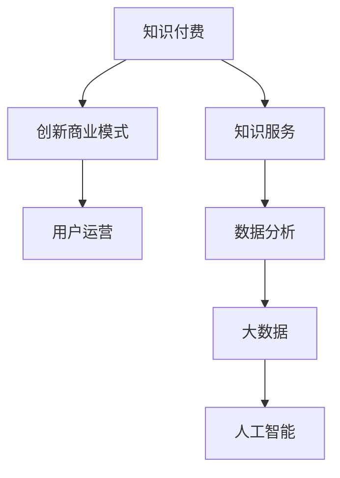

                 

# 知识经济时代下的知识付费 创新商业模式运营

> 关键词：知识付费,创新商业模式,知识服务,用户运营,数据分析,大数据,人工智能

## 1. 背景介绍

### 1.1 问题由来
随着信息技术的飞速发展，知识传播的门槛大幅降低，内容创作和分享变得前所未有的便捷。与此同时，海量信息的泛滥也导致了“信息过载”问题，用户在海量信息中难以快速、准确地获取有价值的内容。在这样的背景下，知识付费成为一种有效的解决方式。

知识付费是指用户为获取特定知识、技能或信息而支付费用的商业模式。它与传统的免费信息获取方式不同，通过对优质内容进行有偿提供，激励创作者生产更多高质量内容，同时也提升用户的获取效率和满意度。知识付费领域目前发展迅猛，涌现出诸多成功的平台和模式，如得到、知乎、小鹅通等。

### 1.2 问题核心关键点
知识付费的创新商业模式运营，核心在于如何高效整合知识资源、精准匹配用户需求，并通过合理的定价策略和运营手段，最大化平台的收益，同时提升用户体验。其关键点包括以下几个方面：

- **知识资源整合**：如何高效地整合多样化的知识资源，构建完整、丰富的知识体系，满足不同用户的多样化需求。
- **用户需求匹配**：如何精准地识别和匹配用户的具体需求，提供个性化的内容推荐，提高用户的粘性和满意度。
- **定价策略制定**：如何通过合理的定价策略，激励创作者和吸引用户，同时保证平台的盈利能力。
- **平台运营优化**：如何通过有效的用户运营、数据分析等手段，提升平台的活跃度和用户留存率。

## 2. 核心概念与联系

### 2.1 核心概念概述

为更好地理解知识付费的创新商业模式运营，本节将介绍几个密切相关的核心概念：

- **知识付费**：指用户为获取特定知识、技能或信息而支付费用的商业模式。常见的知识付费平台包括得到、知乎、小鹅通等。
- **创新商业模式**：指通过创新手段，如用户订阅、按需购买、知识众包等，提升知识服务的附加值和用户体验，实现商业变现。
- **知识服务**：指通过专业知识和技能提供服务，解决用户实际问题的过程。知识服务可以是线下的咨询、培训，也可以是线上的视频、文章、课程等。
- **用户运营**：指通过各种手段，如内容推荐、社群互动、活动营销等，提升用户粘性和满意度，实现用户增长和留存。
- **数据分析**：指通过收集和分析用户行为数据，了解用户需求和行为习惯，为产品优化和运营策略制定提供支持。
- **大数据**：指大规模、多样化的数据集，通过数据挖掘、机器学习等技术，发现数据中的规律和趋势，支持业务决策。
- **人工智能**：指模拟人类智能过程，实现语音识别、自然语言处理、图像识别等功能的综合性技术。在知识付费领域，人工智能技术可以用于内容推荐、用户画像分析、智能客服等。

这些核心概念之间的逻辑关系可以通过以下Mermaid流程图来展示：



这个流程图展示的知识付费的核心概念及其之间的关系：

1. 知识付费依托于高质量的知识服务。
2. 创新商业模式通过多样化的运营手段提升知识服务的附加值。
3. 用户运营通过精准的用户匹配和个性化推荐，提高用户满意度。
4. 数据分析和大数据技术为运营策略提供数据支持。
5. 人工智能技术提供技术手段，提升服务质量和效率。

这些概念共同构成了知识付费的创新商业模式运营框架，使其能够在知识服务领域提供高质量、个性化的内容，同时实现商业变现。通过理解这些核心概念，我们可以更好地把握知识付费的运营逻辑和优化方向。

## 3. 核心算法原理 & 具体操作步骤
### 3.1 算法原理概述

知识付费平台的核心算法通常包括内容推荐、用户画像分析、智能客服等，其中内容推荐算法是实现个性化知识服务的关键。内容推荐算法通过用户行为数据和知识内容属性，预测用户对内容的兴趣度，推荐最相关的知识资源。

内容推荐算法主要包括以下几个关键步骤：

1. **用户画像构建**：通过用户的行为数据（如浏览、购买、评分等），构建用户的兴趣画像。
2. **内容属性提取**：提取内容的关键属性（如分类、标签、关键词等），用于描述内容的特征。
3. **兴趣度计算**：根据用户画像和内容属性，计算用户对每个内容的兴趣度。
4. **推荐结果排序**：将内容按照兴趣度排序，选择最相关的几项推荐给用户。

### 3.2 算法步骤详解

以下以推荐算法的核心步骤为基础，详细讲解内容推荐算法的具体实现：

**Step 1: 用户画像构建**

用户画像的构建是推荐算法的基础。通过收集和分析用户的行为数据，可以构建用户的兴趣画像。具体步骤如下：

1. **数据收集**：收集用户在平台上的浏览、购买、评分等行为数据。
2. **特征提取**：提取行为数据的特征，如浏览时长、购买频率、评分等。
3. **降维处理**：通过降维算法（如PCA、LDA等）对特征进行降维，减少数据的维度。
4. **用户画像构建**：将降维后的特征作为用户画像的输入，构建用户的兴趣画像。

**Step 2: 内容属性提取**

内容属性提取是指从知识资源中提取关键特征，用于描述内容的特征。具体步骤如下：

1. **内容分析**：对知识资源进行文本分析、图像分析等，提取分类、标签、关键词等属性。
2. **特征选择**：选择与推荐任务最相关的属性，如关键词频率、分类标签等。
3. **特征编码**：将内容属性编码为向量，用于后续的计算。

**Step 3: 兴趣度计算**

兴趣度计算是推荐算法的核心部分，通过用户画像和内容属性，计算用户对每个内容的兴趣度。具体步骤如下：

1. **相似度计算**：计算用户画像和内容属性之间的相似度，可以使用余弦相似度、Jaccard相似度等。
2. **权重计算**：根据相似度计算用户对每个内容的权重。
3. **兴趣度计算**：将权重与内容属性相乘，得到用户对每个内容的兴趣度。

**Step 4: 推荐结果排序**

推荐结果排序是指将内容按照兴趣度排序，选择最相关的几项推荐给用户。具体步骤如下：

1. **排序算法**：选择排序算法（如Top K、协同过滤等）对内容进行排序。
2. **推荐结果生成**：将排序后的内容按照顺序推荐给用户。

### 3.3 算法优缺点

知识付费平台的内容推荐算法具有以下优点：

- **个性化推荐**：通过分析用户行为和内容属性，提供个性化的内容推荐，提升用户满意度。
- **高效匹配**：在大规模数据集上高效运行，快速生成推荐结果。
- **可扩展性强**：算法可以方便地集成到不同的平台和场景中，支持多设备、多渠道的用户访问。

同时，该算法也存在以下局限性：

- **数据依赖性强**：算法的准确性和效果高度依赖于数据的质量和量。
- **冷启动问题**：对于新用户或新内容，缺乏足够的数据，导致推荐效果不佳。
- **多模态数据处理**：不同类型的内容（如文本、图片、视频等）需要不同的处理方法，增加了算法的复杂度。
- **过拟合风险**：在处理大量数据时，容易出现过拟合现象，影响推荐效果。

### 3.4 算法应用领域

知识付费平台的内容推荐算法广泛应用于以下几个领域：

- **课程推荐**：为用户推荐适合的在线课程和学习资源。
- **图书推荐**：为用户推荐感兴趣的书籍和阅读内容。
- **视频推荐**：为用户推荐喜欢的视频和内容创作者。
- **资讯推荐**：为用户推荐新闻、文章、资讯等。
- **个性化定制**：根据用户需求，提供个性化的知识服务定制。

除了以上应用场景外，内容推荐算法还可以在电商、社交媒体、视频网站等领域发挥重要作用，提升平台的个性化服务水平。

## 4. 数学模型和公式 & 详细讲解 & 举例说明

### 4.1 数学模型构建

内容推荐算法的数学模型可以表示为：

$$
\hat{y}_i = f(x_i, u_j)
$$

其中 $x_i$ 表示第 $i$ 个内容，$u_j$ 表示第 $j$ 个用户，$\hat{y}_i$ 表示用户 $j$ 对内容 $x_i$ 的兴趣度。模型 $f$ 可以是一个简单的线性回归模型，也可以是一个复杂的深度神经网络。

### 4.2 公式推导过程

以线性回归模型为例，推导内容推荐算法的核心公式。假设用户 $u_j$ 对内容 $x_i$ 的兴趣度 $y_i$ 可以用以下公式表示：

$$
y_i = w_1 x_{i1} + w_2 x_{i2} + ... + w_n x_{in} + b
$$

其中 $w_1, w_2, ..., w_n$ 是模型的权重，$x_{i1}, x_{i2}, ..., x_{in}$ 是内容 $x_i$ 的属性，$b$ 是截距项。

通过最小二乘法，可以求得模型的参数 $w$ 和 $b$：

$$
w = \left(\sum_{i=1}^n x_i^T x_i\right)^{-1} \left(\sum_{i=1}^n x_i^T y_i\right)
$$

$$
b = \bar{y} - w^T \bar{x}
$$

其中 $\bar{x}$ 和 $\bar{y}$ 分别是内容属性和兴趣度的均值。

### 4.3 案例分析与讲解

以一个简单的课程推荐系统为例，讲解内容推荐算法的具体实现过程。

假设有一个在线教育平台，有 $M$ 门课程和 $N$ 名用户，平台希望为用户推荐感兴趣的课程。课程的属性包括课程名称、课程描述、老师等。用户的行为数据包括课程的浏览次数、购买次数、评分等。

- **数据收集**：平台收集用户的行为数据和课程的属性数据。
- **特征提取**：将课程属性和用户行为数据转化为向量表示。
- **模型训练**：使用线性回归模型训练用户对课程的兴趣度。
- **推荐生成**：根据用户画像和课程属性计算用户对每个课程的兴趣度，选择最相关的课程进行推荐。

## 5. 项目实践：代码实例和详细解释说明
### 5.1 开发环境搭建

在进行知识付费平台的开发实践前，我们需要准备好开发环境。以下是使用Python进行Django开发的环境配置流程：

1. 安装Anaconda：从官网下载并安装Anaconda，用于创建独立的Python环境。

2. 创建并激活虚拟环境：
```bash
conda create -n knowledge-platform python=3.8 
conda activate knowledge-platform
```

3. 安装Django：根据CUDA版本，从官网获取对应的安装命令。例如：
```bash
conda install django
```

4. 安装Flask、Scrapy、Pandas、Numpy等各类工具包：
```bash
pip install flask scrapy pandas numpy
```

5. 安装数据库管理系统：如MySQL、PostgreSQL等，用于存储用户数据和内容数据。

完成上述步骤后，即可在`knowledge-platform`环境中开始知识付费平台的开发实践。

### 5.2 源代码详细实现

下面以一个简单的课程推荐系统为例，给出使用Django框架对课程推荐系统进行开发的具体代码实现。

首先，定义课程和用户的数据模型：

```python
from django.db import models

class Course(models.Model):
    name = models.CharField(max_length=100)
    description = models.TextField()
    teacher = models.CharField(max_length=50)
    # 其他课程属性

class User(models.Model):
    username = models.CharField(max_length=100)
    # 其他用户属性
```

然后，定义推荐算法模型：

```python
from sklearn.ensemble import RandomForestRegressor
from sklearn.preprocessing import StandardScaler

class RecommendationModel:
    def __init__(self):
        self.model = RandomForestRegressor()
        self.scaler = StandardScaler()
        
    def fit(self, X, y):
        X_scaled = self.scaler.fit_transform(X)
        self.model.fit(X_scaled, y)
        
    def predict(self, X):
        X_scaled = self.scaler.transform(X)
        return self.model.predict(X_scaled)
```

接着，定义推荐函数：

```python
def recommend_courses(user_id, top_k=5):
    user_data = User.objects.filter(id=user_id).first()
    if not user_data:
        return []
    
    courses = Course.objects.all()
    features = pd.DataFrame(columns=['feature1', 'feature2', 'feature3', ...])  # 特征提取
    for course in courses:
        features = features.append(course.get_features())  # 将课程属性转化为数据帧
        
    # 计算用户对每个课程的兴趣度
    user_interest = self.predict(user_data.get_features())  # 预测用户对每个课程的兴趣度
    
    # 按兴趣度排序，选择最相关的课程
    courses_with_scores = list(zip(courses, user_interest))
    courses_with_scores.sort(key=lambda x: x[1], reverse=True)
    recommended_courses = [course[0] for course in courses_with_scores[:top_k]]
    
    return recommended_courses
```

最后，定义Web界面：

```python
from django.shortcuts import render, redirect
from .models import Course, User
from .recommendation import RecommendationModel

def home(request):
    recommended_courses = []
    if request.method == 'POST':
        user_id = request.POST.get('user_id')
        recommended_courses = recommend_courses(user_id)
    
    return render(request, 'home.html', {'courses': courses, 'recommended_courses': recommended_courses})
```

以上就是一个简单的课程推荐系统的代码实现。可以看到，通过Django框架，我们可以很方便地实现用户数据管理和推荐算法。

### 5.3 代码解读与分析

让我们再详细解读一下关键代码的实现细节：

**Course和User模型**：
- `Course` 模型表示课程，包含课程名称、描述、老师等信息。
- `User` 模型表示用户，包含用户名等信息。

**RecommendationModel类**：
- 定义了一个推荐模型类 `RecommendationModel`，其中包含了训练和预测两个方法。训练方法使用随机森林回归器，预测方法根据用户属性计算每个课程的兴趣度。

**recommend_courses函数**：
- 根据用户ID，获取用户数据。
- 提取所有课程的属性，构建特征矩阵。
- 使用训练好的推荐模型预测用户对每个课程的兴趣度。
- 根据兴趣度排序，选择最相关的课程进行推荐。

**home函数**：
- 通过HTTP请求获取用户ID。
- 调用推荐函数，获取推荐课程列表。
- 在Web页面上展示推荐课程列表。

以上代码展示了如何利用Django框架实现一个简单的课程推荐系统，帮助用户快速找到感兴趣的课程。

当然，在实际应用中，还需要考虑更多因素，如用户登录、课程评价、多渠道推荐等，才能实现一个完整的知识付费平台。但核心的推荐算法逻辑基本与此类似。

## 6. 实际应用场景
### 6.1 在线教育平台

在线教育平台是知识付费的重要应用场景之一。通过平台，用户可以轻松地获取各种在线课程和教育资源，提升自身的知识水平和技能。平台可以基于用户的学习行为数据，推荐合适的课程和学习资源，提升用户体验和满意度。

例如，得到、知乎等在线教育平台，通过推荐系统，向用户推荐适合其兴趣和需求的课程，帮助用户更好地规划学习路径，提升学习效果。此外，平台还可以根据用户的反馈和评价，不断优化推荐算法，提升推荐的准确性和个性化。

### 6.2 企业培训系统

企业培训系统是知识付费的另一个重要应用场景。企业内部培训可以提升员工的职业技能，推动企业的发展。通过知识付费平台，企业可以高效地采购、部署和管理在线课程，为员工提供系统化的培训服务。

例如，某大型企业通过知识付费平台，向员工推荐与岗位相关的课程，提升员工的职业技能。平台还可以根据员工的培训记录和反馈，不断优化推荐算法，提升培训效果。此外，平台还可以集成企业内部的知识库，提供个性化的定制培训服务。

### 6.3 智能助理

智能助理是知识付费的创新应用场景之一。通过智能助理，用户可以获取各种知识信息，如天气、健康、理财等，提升生活质量。智能助理可以基于用户的互动历史，推荐相关的信息和服务，提升用户体验。

例如，智能音箱通过推荐系统，向用户推荐与用户对话相关的信息和知识。智能助理还可以集成各种第三方服务，提供个性化的知识服务定制，提升用户的满意度和忠诚度。

### 6.4 未来应用展望

随着知识付费领域的不断拓展，未来将涌现更多创新应用场景，如智慧医疗、智慧旅游等。以下是几个可能的未来应用场景：

- **智慧医疗**：通过知识付费平台，医生可以获取最新的医学知识和研究成果，提升自身的医疗水平。患者可以通过平台获取医疗咨询和健康知识，提升自身的健康水平。
- **智慧旅游**：通过知识付费平台，游客可以获取旅游目的地和景点的相关信息，提升旅游体验。旅行社可以通过平台推荐适合用户的旅游线路和旅游服务，提升业务收入。

## 7. 工具和资源推荐
### 7.1 学习资源推荐

为了帮助开发者系统掌握知识付费的创新商业模式运营，这里推荐一些优质的学习资源：

1. 《知识付费大话》系列博文：由知识付费领域的专家撰写，深入浅出地介绍了知识付费的商业模式、运营策略等前沿话题。

2. CS229《机器学习》课程：斯坦福大学开设的机器学习课程，涵盖分类、回归、聚类等基本概念，并提供了丰富的推荐系统样例代码。

3. 《推荐系统实战》书籍：讲解了推荐系统的工作原理、算法实现和应用案例，是推荐系统开发者的必备书籍。

4. Kaggle推荐系统竞赛：通过参加Kaggle的推荐系统竞赛，可以积累实践经验，提升推荐算法的设计和实现能力。

5. Coursera《推荐系统》课程：由耶鲁大学教授主讲，介绍了推荐系统的基本原理、算法实现和应用场景，适合系统化学习。

通过对这些资源的学习实践，相信你一定能够快速掌握知识付费的运营逻辑和优化方向，并将其应用到实际的项目中。

### 7.2 开发工具推荐

高效的开发离不开优秀的工具支持。以下是几款用于知识付费平台开发常用的工具：

1. Django：基于Python的开源Web框架，支持快速开发Web应用。适合构建知识付费平台的用户管理和推荐系统等。

2. Flask：基于Python的开源Web框架，轻量级、易用性高。适合构建知识付费平台的API接口和后端服务。

3. Scrapy：Python爬虫框架，支持大规模数据采集和处理。适合构建知识付费平台的课程和用户数据爬虫。

4. Pandas：Python数据分析库，支持高效的数据处理和分析。适合构建知识付费平台的推荐算法和用户画像分析。

5. Numpy：Python科学计算库，支持高效的数值计算和矩阵运算。适合构建知识付费平台的推荐算法和模型训练。

6. TensorFlow：Google开发的开源深度学习框架，支持大规模机器学习模型训练。适合构建知识付费平台的推荐算法和用户画像分析。

合理利用这些工具，可以显著提升知识付费平台的开发效率，加快创新迭代的步伐。

### 7.3 相关论文推荐

知识付费领域的推荐算法研究，近年来取得了显著进展，以下是几篇奠基性的相关论文，推荐阅读：

1. "Collaborative Filtering for Implicit Feedback Datasets"（隐式反馈数据集上的协同过滤）：介绍了协同过滤算法在推荐系统中的应用。

2. "Feature-Rich Collaborative Filtering with Matrix Factorization"（特征丰富的协同过滤矩阵分解）：介绍了矩阵分解算法在推荐系统中的应用。

3. "A Systematic Analysis of Deep Learning for Recommendation Systems"（深度学习在推荐系统中的应用分析）：系统介绍了深度学习在推荐系统中的各种应用。

4. "Neural Collaborative Filtering"（神经协同过滤）：介绍了神经网络在推荐系统中的应用。

5. "Knowledge Graph-Based Recommender Systems"（基于知识图谱的推荐系统）：介绍了知识图谱在推荐系统中的应用。

这些论文代表了大数据推荐算法的演进脉络。通过学习这些前沿成果，可以帮助研究者把握推荐算法的未来方向，激发更多的创新灵感。

## 8. 总结：未来发展趋势与挑战

### 8.1 总结

本文对知识付费的创新商业模式运营进行了全面系统的介绍。首先阐述了知识付费的兴起背景和创新商业模式的运营关键点，明确了知识付费在提升知识服务附加值、满足用户多样化需求等方面的独特价值。其次，从原理到实践，详细讲解了推荐算法的核心步骤和具体实现，提供了知识付费平台的完整代码实例。同时，本文还广泛探讨了知识付费平台在在线教育、企业培训、智能助理等领域的实际应用，展示了知识付费的巨大潜力。此外，本文精选了知识付费领域的各类学习资源，力求为读者提供全方位的技术指引。

通过本文的系统梳理，可以看到，知识付费平台的创新商业模式运营已经取得了显著进展，知识付费成为一种有效的解决信息过载问题的方式。未来，随着知识付费领域的不断发展和演化，其应用场景将进一步拓展，为各行各业带来新的商业机遇和创新活力。

### 8.2 未来发展趋势

展望未来，知识付费平台的创新商业模式运营将呈现以下几个发展趋势：

1. **用户画像精细化**：随着数据的积累和技术的进步，用户画像将更加精细，推荐系统将更加精准和个性化。

2. **推荐算法多样化**：推荐算法将不仅限于传统的协同过滤和内容推荐，更多复杂的深度学习模型将被引入，如神经协同过滤、知识图谱推荐等。

3. **跨平台整合**：不同平台之间的数据和算法将被整合，形成统一的推荐系统，提升用户体验和粘性。

4. **实时推荐**：实时推荐系统将成为未来的发展方向，通过实时数据处理和模型更新，提供更加动态和个性化的推荐服务。

5. **社交网络整合**：社交网络中的关系数据将被整合到推荐系统中，提升推荐系统的多样性和丰富性。

6. **多模态数据融合**：推荐系统将处理更多类型的数据，如视频、图片、语音等，提升推荐系统的灵活性和鲁棒性。

以上趋势凸显了知识付费平台的巨大发展潜力，这些方向的探索发展，必将进一步提升知识服务的附加值和用户体验，推动知识付费平台的规模化落地。

### 8.3 面临的挑战

尽管知识付费平台的创新商业模式运营已经取得了显著成就，但在迈向更加智能化、普适化应用的过程中，它仍面临着诸多挑战：

1. **数据隐私和安全**：平台需要处理大量用户数据，如何保护用户隐私和数据安全，避免数据泄露和滥用，是平台运营的关键问题。

2. **冷启动问题**：对于新用户和新内容，缺乏足够的数据，导致推荐效果不佳。如何解决冷启动问题，提升新用户的体验，是平台需要解决的重要挑战。

3. **推荐算法鲁棒性**：推荐算法在处理多模态数据时，容易受到噪声和异常值的影响，导致推荐效果不稳定。如何提高推荐算法的鲁棒性，避免过拟合，是平台需要解决的关键问题。

4. **推荐系统公平性**：推荐系统容易受到偏见和歧视的影响，导致某些用户或内容被忽视。如何设计公平、无偏见的推荐算法，是平台需要解决的重要问题。

5. **用户行为建模**：用户的行为和需求是动态变化的，如何准确建模用户行为，提供动态和个性化的推荐服务，是平台需要解决的重要挑战。

6. **跨平台整合**：不同平台之间的数据和算法整合，需要解决数据格式、接口标准等技术问题，同时需要考虑用户体验和数据隐私问题。

正视知识付费平台面临的这些挑战，积极应对并寻求突破，将知识付费平台带向更加智能化、普适化应用。相信随着学界和产业界的共同努力，这些挑战终将一一被克服，知识付费平台必将在构建人机协同的智能时代中扮演越来越重要的角色。

### 8.4 研究展望

面对知识付费平台面临的种种挑战，未来的研究需要在以下几个方面寻求新的突破：

1. **数据隐私保护**：通过数据匿名化、加密技术、差分隐私等手段，保护用户数据隐私。

2. **冷启动问题解决**：通过协同过滤、内容推荐、混合推荐等方法，解决新用户和新内容的推荐问题。

3. **推荐算法鲁棒性**：引入深度学习模型、对抗训练等方法，提高推荐算法的鲁棒性和泛化能力。

4. **公平性设计**：引入多样性模型、公平性评估指标等方法，设计公平、无偏见的推荐算法。

5. **动态推荐**：通过实时数据处理、增量学习等方法，实现动态和个性化的推荐服务。

6. **跨平台整合**：通过标准化接口、联邦学习等方法，实现不同平台之间的数据和算法整合。

这些研究方向的探索，必将引领知识付费平台的创新商业模式运营迈向更高的台阶，为各行各业带来新的商业机遇和创新活力。面向未来，知识付费平台需要从数据、算法、技术、业务等多个维度协同发力，共同推动知识付费平台的创新发展。

## 9. 附录：常见问题与解答

**Q1：知识付费平台如何提升用户体验？**

A: 知识付费平台提升用户体验的关键在于个性化推荐和用户运营。通过精准的内容推荐，提升用户对平台的粘性。同时，通过用户互动、社群建设等手段，提升用户满意度和忠诚度。例如，智能助理可以基于用户的互动历史，推荐相关的信息和服务，提升用户体验。

**Q2：知识付费平台如何提升收益？**

A: 知识付费平台提升收益的关键在于合理的定价策略和高效的用户运营。通过精准的用户画像构建和个性化推荐，吸引更多优质用户和内容创作者。同时，通过用户订阅、广告、合作推广等手段，提升平台的收入来源和收益。例如，在线教育平台可以通过优质课程吸引更多用户，并通过课程购买和广告收入提升收益。

**Q3：知识付费平台如何应对数据隐私问题？**

A: 知识付费平台应对数据隐私问题的关键在于数据匿名化、加密技术和隐私保护政策。通过数据匿名化处理，保护用户隐私；通过加密技术，防止数据泄露；通过隐私保护政策，明确数据使用范围和保护措施。例如，智能助理可以通过数据加密和隐私保护技术，保护用户隐私和数据安全。

**Q4：知识付费平台如何应对冷启动问题？**

A: 知识付费平台应对冷启动问题的关键在于混合推荐和协同过滤。通过混合推荐方法，结合内容推荐和协同过滤，提升新用户和新内容的推荐效果。例如，在线教育平台可以结合课程推荐和用户行为分析，提升新用户的学习体验。

**Q5：知识付费平台如何提高推荐算法的鲁棒性？**

A: 知识付费平台提高推荐算法的鲁棒性的关键在于引入深度学习模型和对抗训练。通过深度学习模型，提高推荐算法的泛化能力；通过对抗训练，增强推荐算法的鲁棒性。例如，推荐系统可以使用对抗样本训练模型，提高模型的鲁棒性。

这些问题的解答，展示了知识付费平台在提升用户体验、收益、隐私保护、冷启动和推荐算法鲁棒性等方面的策略，为知识付费平台的运营提供了全面的技术指引。相信通过不断的探索和实践，知识付费平台必将不断优化，为用户和社会带来更多的价值。

---

作者：禅与计算机程序设计艺术 / Zen and the Art of Computer Programming

