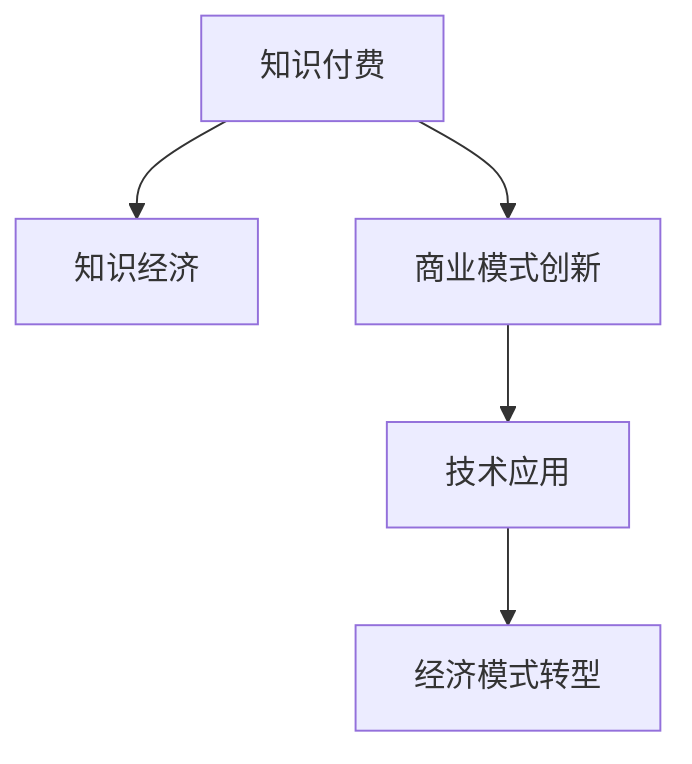

                 

# 知识经济时代下的知识付费创新商业模式推广

> 关键词：知识付费,知识经济,商业模式创新,技术应用,经济模式转型

## 1. 背景介绍

### 1.1 问题由来

随着互联网技术的飞速发展，尤其是大数据、云计算、人工智能等技术的普及，知识经济时代已经到来。在这个时代背景下，传统的学习方式已经无法满足人们对知识的需求，知识的获取和传播方式正在发生深刻变革。知识付费作为一种新型的知识传播模式，正在迅速崛起，成为知识经济时代的重要支柱。然而，随着知识付费市场的发展，也暴露出一些问题，如内容质量参差不齐、付费方式单一、用户粘性不足等。这些问题严重阻碍了知识付费行业的健康发展。

### 1.2 问题核心关键点

知识付费的核心在于如何更好地将知识传播与商业模式相结合，实现知识价值的最大化。本文将围绕知识付费的商业模式创新，探讨如何在知识经济时代背景下，通过技术应用，解决上述问题，推动知识付费行业健康发展。

## 2. 核心概念与联系

### 2.1 核心概念概述

为更好地理解知识付费的商业模式创新，本节将介绍几个密切相关的核心概念：

- **知识付费**：指用户通过付费获取专业知识和技能的学习方式，包括在线课程、专业讲座、咨询服务等形式。知识付费的核心在于知识的高附加值和需求驱动。

- **知识经济**：指以知识为基础、以信息为载体、以创新为驱动力的新型经济形态。知识经济的核心在于知识的生产和消费，其目标是实现知识价值的最大化。

- **商业模式创新**：指在原有商业模式下，通过技术应用、市场策略等手段，实现商业模式的重构和优化。商业模式创新的核心在于创造新的价值和客户需求。

- **技术应用**：指通过技术手段，提升知识传播的效率和质量，改善用户体验，实现商业模式的优化。

- **经济模式转型**：指从传统的物质经济向知识经济转变，实现经济结构的优化和升级。经济模式转型的核心在于知识价值的最大化和可持续性。

这些核心概念之间的逻辑关系可以通过以下Mermaid流程图来展示：



这个流程图展示出知识付费、知识经济、商业模式创新、技术应用和经济模式转型之间的相互关系：

1. 知识付费是知识经济的重要组成部分，知识付费的发展推动了知识经济的发展。
2. 商业模式创新是知识付费发展的关键，通过创新实现商业模式的优化。
3. 技术应用是商业模式创新的手段，通过技术手段实现商业模式的优化。
4. 经济模式转型是知识付费和商业模式创新的目标，通过转型实现知识经济的可持续发展。

这些核心概念共同构成了知识付费的商业模式创新框架，使其能够在知识经济时代背景下，实现知识的价值最大化。通过理解这些核心概念，我们可以更好地把握知识付费的商业逻辑和发展方向。

## 3. 核心算法原理 & 具体操作步骤

### 3.1 算法原理概述

知识付费的商业模式创新，本质上是一个基于知识传播的商业逻辑优化过程。其核心思想是：通过技术应用，提升知识传播的效率和质量，改善用户体验，实现商业模式的优化。

形式化地，假设知识付费平台为 $P$，用户群体为 $U$，知识内容为 $K$，商业模式为 $B$。知识付费的目标是最大化知识传播的收益，即找到最优的商业模式：

$$
\max_{B} \text{Revenue}(P, U, K, B)
$$

其中 $\text{Revenue}$ 为平台的收益函数，$P$、$U$、$K$ 分别代表平台、用户和知识内容。通过梯度下降等优化算法，找到最优的商业模式 $B^*$，使得平台收益最大化。

### 3.2 算法步骤详解

知识付费的商业模式创新一般包括以下几个关键步骤：

**Step 1: 数据收集与分析**

- 收集用户行为数据、知识内容特征数据等，进行数据清洗和预处理。
- 使用机器学习等技术对数据进行建模，分析用户需求、知识传播效果等关键指标。

**Step 2: 优化知识传播模型**

- 基于用户行为数据和知识内容特征数据，构建知识推荐、学习路径规划等模型。
- 使用强化学习等技术，优化推荐算法，提升知识传播效果。

**Step 3: 设计新型的付费模式**

- 根据用户行为数据和知识内容特征数据，设计新的付费模式，如按需支付、订阅制、知识共享等。
- 通过A/B测试等方法，验证新付费模式的效果，优化付费策略。

**Step 4: 优化用户体验**

- 基于用户行为数据和知识内容特征数据，优化知识呈现方式、交互方式等，提升用户体验。
- 引入AR、VR等技术，增强学习互动性和沉浸感。

**Step 5: 建立生态系统**

- 通过平台开放API等手段，引入外部资源，丰富知识内容，形成生态系统。
- 建立社区、论坛等互动平台，增强用户粘性，提高用户活跃度。

**Step 6: 持续迭代**

- 定期收集用户反馈、市场数据等，持续优化商业模式、知识传播模型、付费模式等。
- 引入区块链、物联网等新技术，不断提升平台的创新能力和竞争力。

以上是知识付费商业模式创新的一般流程。在实际应用中，还需要针对具体平台的特点，对各个环节进行优化设计，如改进推荐算法、引入新的付费模式、优化用户体验等，以进一步提升平台的商业价值。

### 3.3 算法优缺点

知识付费的商业模式创新方法具有以下优点：

1. 提升知识传播效率。通过优化推荐算法、设计新型的付费模式等手段，可以显著提升知识传播的效率，满足用户的学习需求。
2. 改善用户体验。通过优化知识呈现方式、交互方式等，可以提升用户的学习体验，增强用户粘性。
3. 优化资源配置。通过引入AR、VR等新技术，可以丰富知识传播的方式，提高平台的创新能力和竞争力。
4. 实现商业模式的优化。通过设计新的付费模式，可以更好地满足用户需求，提升平台的收益。

同时，该方法也存在一定的局限性：

1. 对数据质量依赖高。知识付费的商业模式创新需要大量高质量的数据支持，数据收集和处理难度较大。
2. 技术实现复杂。优化知识传播模型、设计新型的付费模式等，需要较强的技术实力和创新能力。
3. 成本高。引入AR、VR等新技术，增加了平台的开发和运营成本。
4. 市场接受度不确定。新的付费模式和推荐算法，可能需要较长时间才能被用户接受和认可。

尽管存在这些局限性，但就目前而言，知识付费的商业模式创新方法仍然是推动知识付费行业健康发展的重要手段。未来相关研究的重点在于如何进一步降低对数据的依赖，提高技术实现的便捷性，同时兼顾成本和市场接受度等因素。

### 3.4 算法应用领域

知识付费的商业模式创新方法，已经在教育、医疗、法律等多个领域得到应用，取得了显著效果：

- **教育领域**：在线课程、专业讲座、教育咨询等知识付费形式在教育领域广泛应用。通过优化推荐算法、设计新型的付费模式，显著提升了知识传播效率和用户满意度。

- **医疗领域**：远程医疗咨询、健康管理、医学研究等知识付费形式在医疗领域得到应用。通过优化推荐算法、引入AR技术等手段，提高了医疗服务的可及性和效率。

- **法律领域**：法律咨询服务、法律研究、法律教育等知识付费形式在法律领域得到应用。通过优化推荐算法、设计新的付费模式，提升了法律服务的质量和覆盖面。

除了这些经典领域外，知识付费的商业模式创新方法也在更多场景中得到应用，如科技、金融、人力资源等，为各行各业的知识传播和商业创新提供了新的思路。随着技术的不断进步，相信知识付费的商业模式创新方法将在更多领域得到应用，为知识经济的可持续发展贡献力量。

## 4. 数学模型和公式 & 详细讲解 & 举例说明

### 4.1 数学模型构建

本节将使用数学语言对知识付费的商业模式创新过程进行更加严格的刻画。

假设知识付费平台为 $P$，用户群体为 $U$，知识内容为 $K$，商业模式为 $B$。定义知识付费平台的收益函数为：

$$
\text{Revenue}(P, U, K, B) = U \cdot \text{Value}(K) \cdot B
$$

其中，$\text{Value}(K)$ 为知识内容的价值，$B$ 为商业模式的影响因子。

优化目标是最小化用户流失率，即找到最优的商业模式：

$$
\min_{B} \text{User Churn Rate}(P, U, K, B)
$$

在实践中，我们通常使用基于梯度的优化算法（如SGD、Adam等）来近似求解上述最优化问题。设 $\eta$ 为学习率，$\lambda$ 为正则化系数，则商业模式 $B$ 的更新公式为：

$$
B \leftarrow B - \eta \nabla_{B}\text{Revenue}(P, U, K, B) - \eta\lambda B
$$

其中 $\nabla_{B}\text{Revenue}(P, U, K, B)$ 为收益函数对商业模式 $B$ 的梯度，可通过反向传播算法高效计算。

### 4.2 公式推导过程

以下我们以在线课程付费为例，推导优化推荐算法和付费模式的数学模型。

假设用户 $u_i$ 订阅了 $n$ 门课程 $C_j$，其中 $j \in [1, n]$。每门课程的价值为 $V_j$，用户 $u_i$ 对课程 $C_j$ 的评分 $R_{ij}$，以及每门课程的付费单价 $P_j$。优化目标是最小化用户流失率，即找到最优的付费策略 $B$：

$$
\min_{B} \text{User Churn Rate} = \frac{1}{N} \sum_{i=1}^N \left( 1 - \prod_{j=1}^n \text{Prob}_{ij} \right)
$$

其中 $N$ 为总用户数。

为了简化问题，我们引入一个布尔变量 $D_{ij}$ 表示用户 $u_i$ 是否购买了课程 $C_j$。则有：

$$
D_{ij} = 
\begin{cases} 
1, & \text{如果用户购买了课程} \\
0, & \text{如果用户没有购买课程}
\end{cases}
$$

根据贝叶斯定理，用户购买课程的概率为：

$$
\text{Prob}_{ij} = \frac{P_j}{\sum_{j=1}^n P_j} \cdot \prod_{k=1}^n \frac{R_{ik}^{\beta_k}}{\sum_{j=1}^n R_{ij}^{\beta_k}}
$$

其中 $\beta_k$ 为课程 $C_k$ 的重要度权重。

因此，用户流失率可以表示为：

$$
\text{User Churn Rate} = \frac{1}{N} \sum_{i=1}^N \left( 1 - \prod_{j=1}^n \frac{P_j}{\sum_{j=1}^n P_j} \cdot \prod_{k=1}^n \frac{R_{ik}^{\beta_k}}{\sum_{j=1}^n R_{ij}^{\beta_k}} \right)
$$

优化目标是最小化用户流失率，即找到最优的付费策略 $B$：

$$
\min_{B} \text{User Churn Rate} = \min_{P_j} \text{User Churn Rate} = \frac{1}{N} \sum_{i=1}^N \left( 1 - \prod_{j=1}^n \frac{P_j}{\sum_{j=1}^n P_j} \cdot \prod_{k=1}^n \frac{R_{ik}^{\beta_k}}{\sum_{j=1}^n R_{ij}^{\beta_k}} \right)
$$

在得到用户流失率的数学模型后，可以通过梯度下降等优化算法求解最优的付费策略 $B^*$，从而实现知识付费的商业模式创新。

### 4.3 案例分析与讲解

以Coursera平台为例，分析其基于知识付费的商业模式创新实践。

Coursera是一个在线教育平台，其商业模式创新主要包括以下几个方面：

1. **个性化推荐算法**：Coursera使用机器学习算法，根据用户的学习历史、兴趣、社交关系等数据，为用户推荐最适合的课程。通过优化推荐算法，显著提升了用户的学习体验和课程完成率。

2. **订阅制付费模式**：Coursera提供按月订阅和一次性支付两种付费模式，用户可以自由选择适合自己的付费方式。通过引入订阅制模式，增强了用户的粘性和平台的收入稳定性。

3. **社群互动平台**：Coursera建立社区、论坛等互动平台，增强用户之间的交流和互动，提高用户的学习动力和平台的活跃度。通过社区互动，实现了用户粘性的提升。

4. **虚拟实验室**：Coursera在计算机科学、工程等学科中引入虚拟实验室，通过AR技术，增强学习互动性和沉浸感。通过引入虚拟实验室，提高了课程的实用性和吸引力。

5. **微付费课程**：Coursera推出微付费课程，用户只需支付少量费用，即可获取课程的预习材料和练习题。通过引入微付费课程，提高了平台的覆盖面和用户的学习动力。

通过上述措施，Coursera在知识付费领域取得了显著的成功，成为全球领先的在线教育平台之一。其商业模式创新的实践表明，通过优化推荐算法、设计新型的付费模式、优化用户体验等手段，可以显著提升知识传播的效率和用户满意度，实现商业模式的优化。

## 5. 项目实践：代码实例和详细解释说明

### 5.1 开发环境搭建

在进行知识付费平台的开发前，我们需要准备好开发环境。以下是使用Python进行Django开发的环境配置流程：

1. 安装Anaconda：从官网下载并安装Anaconda，用于创建独立的Python环境。

2. 创建并激活虚拟环境：
```bash
conda create -n knowledge-payment python=3.8 
conda activate knowledge-payment
```

3. 安装Django：
```bash
pip install django
```

4. 安装必要的第三方库：
```bash
pip install Pillow djangorestframework
```

完成上述步骤后，即可在`knowledge-payment`环境中开始知识付费平台的开发。

### 5.2 源代码详细实现

下面我们以Coursera平台为例，给出使用Django开发的知识付费平台的代码实现。

首先，定义用户模型：

```python
from django.contrib.auth.models import User

class KnowledgeUser(models.Model):
    user = models.OneToOneField(User, on_delete=models.CASCADE)
    courses = models.ManyToManyField('Course')
    courses_completed = models.ManyToManyField('Course', blank=True)

    def __str__(self):
        return self.user.username
```

然后，定义课程模型：

```python
class Course(models.Model):
    title = models.CharField(max_length=200)
    description = models.TextField()
    price = models.DecimalField(max_digits=10, decimal_places=2)
    reviews = models.ManyToManyField(Review)
    review_count = models.IntegerField(default=0)
    rating = models.DecimalField(max_digits=2, decimal_places=1, default=0)

    def __str__(self):
        return self.title
```

接着，定义用户购买课程和课程完成状态的模型：

```python
class Purchase(models.Model):
    user = models.ForeignKey(KnowledgeUser, on_delete=models.CASCADE)
    course = models.ForeignKey(Course, on_delete=models.CASCADE)
    purchase_date = models.DateTimeField(auto_now_add=True)

    def __str__(self):
        return f"{self.user.user} bought {self.course.title}"

class CourseCompletion(models.Model):
    user = models.ForeignKey(KnowledgeUser, on_delete=models.CASCADE)
    course = models.ForeignKey(Course, on_delete=models.CASCADE)
    completion_date = models.DateTimeField(auto_now_add=True)

    def __str__(self):
        return f"{self.user.user} completed {self.course.title}"
```

然后，定义用户购买课程的视图函数：

```python
from django.shortcuts import redirect

def purchase_course(request, course_id):
    course = get_object_or_404(Course, pk=course_id)
    user = request.user
    if not user:
        return redirect('/login')
    if user.is_authenticated:
        if user in course.reviews.all():
            return redirect('course_detail', course_id=course_id)
        if user.courses_completed.filter(pk=course.pk).exists():
            return redirect('course_detail', course_id=course_id)
        else:
            purchase = Purchase.objects.create(user=user, course=course)
            return redirect('course_detail', course_id=course_id)
```

接着，定义用户课程完成的视图函数：

```python
from django.shortcuts import redirect

def course_complete(request, course_id):
    course = get_object_or_404(Course, pk=course_id)
    user = request.user
    if not user:
        return redirect('/login')
    if user.is_authenticated:
        if user.courses_completed.filter(pk=course.pk).exists():
            return redirect('course_detail', course_id=course_id)
        else:
            completion = CourseCompletion.objects.create(user=user, course=course)
            return redirect('course_detail', course_id=course_id)
```

最后，定义用户登录和注册视图函数：

```python
from django.contrib.auth import authenticate, login, logout

def user_login(request):
    if request.method == 'POST':
        username = request.POST['username']
        password = request.POST['password']
        user = authenticate(username=username, password=password)
        if user is not None:
            login(request, user)
            return redirect('home')
    return render(request, 'login.html')

def user_register(request):
    if request.method == 'POST':
        username = request.POST['username']
        password = request.POST['password']
        user = User.objects.create_user(username=username, password=password)
        login(request, user)
        return redirect('home')
    return render(request, 'register.html')

def user_logout(request):
    logout(request)
    return redirect('home')
```

通过上述代码，可以初步搭建一个知识付费平台的框架，包括用户、课程、购买、完成等功能模块。

### 5.3 代码解读与分析

让我们再详细解读一下关键代码的实现细节：

**用户模型**：
- `__str__`方法：定义用户模型的字符串表示，便于在调试时打印输出。
- `courses`和`courses_completed`字段：分别表示用户购买的课程和已完成的课程。

**课程模型**：
- `__str__`方法：定义课程模型的字符串表示，便于在调试时打印输出。
- `price`字段：定义课程的付费单价。
- `reviews`字段：定义课程的评论。
- `review_count`和`rating`字段：分别表示课程的评论数量和评分。

**用户购买课程和课程完成状态的模型**：
- `__str__`方法：定义模型的字符串表示，便于在调试时打印输出。
- `user`和`course`字段：分别表示用户和课程。
- `purchase_date`和`completion_date`字段：分别表示购买时间和完成时间。

**用户购买课程的视图函数**：
- `get_object_or_404`函数：获取课程或用户，如果不存在则返回404错误。
- `user`和`course`变量：分别表示用户和课程。
- `redirect`函数：重定向用户到课程详情页面。
- `if`语句：判断用户是否已经购买了课程或已经完成课程，如果是则重定向到课程详情页面，否则创建购买记录并重定向到课程详情页面。

**用户课程完成的视图函数**：
- `get_object_or_404`函数：获取课程或用户，如果不存在则返回404错误。
- `user`和`course`变量：分别表示用户和课程。
- `redirect`函数：重定向用户到课程详情页面。
- `if`语句：判断用户是否已经完成课程，如果是则重定向到课程详情页面，否则创建课程完成记录并重定向到课程详情页面。

**用户登录和注册视图函数**：
- `authenticate`、`login`和`logout`函数：分别用于验证用户登录、登录用户和退出登录。
- `redirect`函数：重定向用户到首页。
- `if`语句：判断用户是否提交了用户名和密码，如果是则进行用户验证，如果是注册用户则创建用户并登录，否则直接登录。

通过上述代码，可以初步搭建一个知识付费平台的框架，包括用户、课程、购买、完成等功能模块。开发者可以将更多精力放在功能扩展、性能优化等高层逻辑上，而不必过多关注底层的实现细节。

当然，工业级的系统实现还需考虑更多因素，如数据库优化、安全认证、支付接口等。但核心的功能实现和代码框架是相似的。

## 6. 实际应用场景

### 6.1 智能教育平台

知识付费的商业模式创新在教育领域得到了广泛应用，成为智能教育平台的重要组成部分。传统的教育方式往往以教师授课为主，教学资源和教学效果的分配不均。通过知识付费，智能教育平台可以提供更加丰富和灵活的教学资源，满足不同学生的学习需求。

在技术实现上，可以收集学生的历史学习数据，构建个性化推荐系统，为用户推荐最适合的课程和学习路径。同时，设计新的付费模式，如按需支付、订阅制等，以满足不同学生的学习需求。通过社区互动平台，增强学生之间的交流和互动，提高学习动力和平台活跃度。

### 6.2 企业在线培训

知识付费的商业模式创新在企业在线培训领域也得到了广泛应用。传统培训方式往往以线下集中授课为主，时间和地点限制较多，培训效果难以量化。通过知识付费，企业在线培训平台可以提供更加灵活和高效的学习方式，提升培训效果。

在技术实现上，可以收集员工的学习历史和职业需求，构建个性化推荐系统，为用户推荐最适合的培训课程和学习路径。同时，设计新的付费模式，如按需支付、订阅制等，以满足员工的学习需求。通过虚拟实验室等技术手段，增强学习互动性和沉浸感。通过社区互动平台，增强员工之间的交流和互动，提高培训效果和平台活跃度。

### 6.3 个性化医疗咨询

知识付费的商业模式创新在医疗领域也得到了广泛应用。传统医疗咨询方式往往以医生面诊为主，时间成本和资源成本较高。通过知识付费，个性化医疗咨询平台可以提供更加便捷和高效的医疗咨询服务，提升医疗服务质量。

在技术实现上，可以收集患者的健康数据和疾病历史，构建个性化推荐系统，为用户推荐最适合的医生和医疗咨询服务。同时，设计新的付费模式，如按需支付、订阅制等，以满足患者的需求。通过虚拟实验室等技术手段，增强医疗咨询互动性和沉浸感。通过社区互动平台，增强患者之间的交流和互动，提高医疗服务质量和平台活跃度。

### 6.4 未来应用展望

随着知识付费市场的发展，未来的应用场景将更加多样化，覆盖更多领域。

在智慧农业领域，知识付费平台可以提供农技培训、农业咨询等服务，帮助农民提升农业技术水平和收益。在智慧城市领域，知识付费平台可以提供城市管理、智慧交通等服务，提升城市管理的智能化水平。在智慧金融领域，知识付费平台可以提供金融分析、投资咨询等服务，帮助投资者做出更明智的决策。

总之，随着技术的不断进步，知识付费平台的商业模式创新将进一步拓展应用场景，为各行各业的知识传播和商业创新提供新的思路。

## 7. 工具和资源推荐
### 7.1 学习资源推荐

为了帮助开发者系统掌握知识付费的商业模式创新理论基础和实践技巧，这里推荐一些优质的学习资源：

1. 《深度学习：理论与实践》：斯坦福大学开设的深度学习课程，系统讲解深度学习理论和实践，涵盖知识付费等领域的应用。

2. 《在线教育与智能教育》：某知名教育公司出版的书籍，系统介绍在线教育和智能教育的概念、技术和应用。

3. 《知识付费：理论与实践》：某知名知识付费平台的内部技术手册，涵盖知识付费平台的设计、开发和运营实践。

4. Coursera官方文档：Coursera平台的技术文档，涵盖课程推荐、用户管理、支付接口等功能实现。

5. 《人工智能在教育中的应用》：某知名教育研究机构的报告，分析人工智能在教育中的应用和趋势，涵盖知识付费等领域的技术创新。

通过对这些资源的学习实践，相信你一定能够快速掌握知识付费的商业模式创新精髓，并用于解决实际的NLP问题。
### 7.2 开发工具推荐

高效的开发离不开优秀的工具支持。以下是几款用于知识付费平台开发的工具：

1. Django：基于Python的Web开发框架，支持快速迭代和扩展，是构建知识付费平台的首选。

2. Redis：内存数据库，用于缓存和消息队列，支持高并发访问和快速响应，可以显著提升知识付费平台的性能。

3. ElasticSearch：分布式搜索引擎，用于搜索和数据分析，支持大数据和高并发查询，可以提升知识付费平台的搜索和推荐效果。

4. Nginx：高性能Web服务器，支持负载均衡和缓存，可以提升知识付费平台的扩展性和稳定性。

5. Docker：容器化技术，用于应用部署和运维，支持跨平台和快速部署，可以提升知识付费平台的开发效率和运维效率。

6. Ansible：自动化运维工具，用于自动化部署和配置管理，支持快速扩展和运维，可以提升知识付费平台的管理效率。

合理利用这些工具，可以显著提升知识付费平台的开发效率，加快创新迭代的步伐。

### 7.3 相关论文推荐

知识付费的商业模式创新研究源于学界的持续研究。以下是几篇奠基性的相关论文，推荐阅读：

1. "The Effectiveness of Recommendation Systems in Online Education"（推荐系统在在线教育中的有效性）：分析了推荐系统在在线教育中的应用和效果，提供了优化推荐算法的思路。

2. "Blockchain in Online Education: Opportunities and Challenges"（区块链在在线教育中的应用和挑战）：探讨了区块链技术在在线教育中的应用和挑战，提出了优化支付和版权保护的思路。

3. "Cost-Benefit Analysis of Knowledge Sharing in Online Education"（在线教育知识共享的成本效益分析）：分析了在线教育知识共享的成本和效益，提供了优化付费模式的思路。

4. "AI and Online Education: Trends and Future Directions"（人工智能在在线教育中的应用和未来方向）：分析了人工智能在在线教育中的应用和未来发展方向，提供了优化智能推荐和互动平台的思路。

这些论文代表了大规模知识付费平台的商业模式创新研究的发展脉络。通过学习这些前沿成果，可以帮助研究者把握知识付费的商业逻辑和发展方向，激发更多的创新灵感。

## 8. 总结：未来发展趋势与挑战

### 8.1 总结

本文对知识付费的商业模式创新进行了全面系统的介绍。首先阐述了知识付费的发展背景和意义，明确了知识付费的商业逻辑和应用前景。其次，从原理到实践，详细讲解了知识付费的商业模式创新过程，给出了知识付费平台开发的完整代码实例。同时，本文还广泛探讨了知识付费在教育、医疗、企业培训等多个领域的应用场景，展示了知识付费的广阔前景。此外，本文精选了知识付费的各类学习资源，力求为读者提供全方位的技术指引。

通过本文的系统梳理，可以看到，知识付费的商业模式创新在知识经济时代背景下，具有重要的商业价值和社会意义。通过优化推荐算法、设计新型的付费模式、优化用户体验等手段，可以显著提升知识传播的效率和用户满意度，实现商业模式的优化。未来，伴随技术的不断进步，知识付费的商业模式创新将继续推动知识付费行业的健康发展，为知识经济的可持续发展贡献力量。

### 8.2 未来发展趋势

展望未来，知识付费的商业模式创新将呈现以下几个发展趋势：

1. **个性化推荐系统**：随着推荐算法的不断进步，个性化推荐系统将进一步提升用户的学习体验和课程完成率，实现知识传播的精准化。

2. **订阅制付费模式**：随着用户粘性和平台稳定性的提升，订阅制付费模式将成为主流，满足用户的学习需求。

3. **社区互动平台**：社区互动平台将成为知识付费平台的重要组成部分，增强用户之间的交流和互动，提高学习动力和平台活跃度。

4. **虚拟实验室**：虚拟实验室将进一步增强学习的互动性和沉浸感，提升课程的实用性和吸引力。

5. **区块链技术**：区块链技术将用于支付和版权保护，提升知识付费平台的安全性和公平性。

6. **AI和大数据**：AI和大数据技术将用于个性化推荐、用户行为分析、情感分析等，提升知识付费平台的智能化水平。

这些趋势凸显了知识付费的商业模式创新的广阔前景。这些方向的探索发展，必将进一步提升知识付费平台的商业价值和社会效益，为知识经济的可持续发展贡献力量。

### 8.3 面临的挑战

尽管知识付费的商业模式创新已经取得了显著成果，但在迈向更加智能化、普适化应用的过程中，它仍面临着诸多挑战：

1. **数据质量瓶颈**：知识付费的商业模式创新需要大量高质量的数据支持，数据收集和处理难度较大。如何进一步降低数据依赖，提高数据质量，将是未来的重要课题。

2. **技术实现复杂**：优化推荐算法、设计新型的付费模式等，需要较强的技术实力和创新能力。如何降低技术实现的难度，提高技术的可操作性，将是未来的重要课题。

3. **成本控制问题**：引入AR、VR等新技术，增加了平台的开发和运营成本。如何控制成本，提升平台的盈利能力，将是未来的重要课题。

4. **市场接受度不确定**：新的付费模式和推荐算法，可能需要较长时间才能被用户接受和认可。如何提升市场接受度，实现用户的快速转化，将是未来的重要课题。

5. **公平性和安全性**：知识付费平台需要建立公平、安全的支付和版权保护机制，避免欺诈和侵权行为。如何提升平台的公平性和安全性，将是未来的重要课题。

尽管存在这些挑战，但就目前而言，知识付费的商业模式创新方法仍然是推动知识付费行业健康发展的重要手段。未来相关研究的重点在于如何进一步降低数据依赖，提高技术实现的便捷性，同时兼顾成本和市场接受度等因素。

### 8.4 研究展望

面向未来，知识付费的商业模式创新研究需要在以下几个方面寻求新的突破：

1. **多模态知识传播**：结合文本、图像、视频、语音等多种模态的数据，提升知识传播的效率和质量。

2. **知识图谱应用**：结合知识图谱技术，增强知识传播的逻辑性和系统性，提升知识传播的效果。

3. **自适应学习**：结合自适应学习算法，根据用户的个性化需求和学习进度，调整推荐算法和付费模式。

4. **隐私保护**：结合隐私保护技术，保护用户的隐私数据，增强平台的安全性和用户信任。

5. **元宇宙应用**：结合元宇宙技术，构建虚拟现实的学习环境，提升学习的沉浸感和互动性。

这些研究方向的探索，必将引领知识付费的商业模式创新进入新的阶段，为知识经济的可持续发展贡献力量。

## 9. 附录：常见问题与解答

**Q1：知识付费的商业模式创新是否适用于所有NLP任务？**

A: 知识付费的商业模式创新在大多数NLP任务上都能取得不错的效果，特别是对于数据量较小的任务。但对于一些特定领域的任务，如医学、法律等，仅仅依靠通用语料预训练的模型可能难以很好地适应。此时需要在特定领域语料上进一步预训练，再进行微调，才能获得理想效果。此外，对于一些需要时效性、个性化很强的任务，如对话、推荐等，微调方法也需要针对性的改进优化。

**Q2：微调过程中如何选择合适的学习率？**

A: 微调的学习率一般要比预训练时小1-2个数量级，如果使用过大的学习率，容易破坏预训练权重，导致过拟合。一般建议从1e-5开始调参，逐步减小学习率，直至收敛。也可以使用warmup策略，在开始阶段使用较小的学习率，再逐渐过渡到预设值。需要注意的是，不同的优化器(如AdamW、Adafactor等)以及不同的学习率调度策略，可能需要设置不同的学习率阈值。

**Q3：采用大模型微调时会面临哪些资源瓶颈？**

A: 目前主流的预训练大模型动辄以亿计的参数规模，对算力、内存、存储都提出了很高的要求。GPU/TPU等高性能设备是必不可少的，但即便如此，超大批次的训练和推理也可能遇到显存不足的问题。因此需要采用一些资源优化技术，如梯度积累、混合精度训练、模型并行等，来突破硬件瓶颈。同时，模型的存储和读取也可能占用大量时间和空间，需要采用模型压缩、稀疏化存储等方法进行优化。

**Q4：如何缓解微调过程中的过拟合问题？**

A: 过拟合是微调面临的主要挑战，尤其是在标注数据不足的情况下。常见的缓解策略包括：
1. 数据增强：通过回译、近义替换等方式扩充训练集
2. 正则化：使用L2正则、Dropout、Early Stopping等避免过拟合
3. 对抗训练：引入对抗样本，提高模型鲁棒性
4. 参数高效微调：只调整少量参数(如Adapter、Prefix等)，减小过拟合风险
5. 多模型集成：训练多个微调模型，取平均输出，抑制过拟合

这些策略往往需要根据具体任务和数据特点进行灵活组合。只有在数据、模型、训练、推理等各环节进行全面优化，才能最大限度地发挥大模型微调的威力。

**Q5：微调模型在落地部署时需要注意哪些问题？**

A: 将微调模型转化为实际应用，还需要考虑以下因素：
1. 模型裁剪：去除不必要的层和参数，减小模型尺寸，加快推理速度
2. 量化加速：将浮点模型转为定点模型，压缩存储空间，提高计算效率
3. 服务化封装：将模型封装为标准化服务接口，便于集成调用
4. 弹性伸缩：根据请求流量动态调整资源配置，平衡服务质量和成本
5. 监控告警：实时采集系统指标，设置异常告警阈值，确保服务稳定性
6. 安全防护：采用访问鉴权、数据脱敏等措施，保障数据和模型安全

大语言模型微调为NLP应用开启了广阔的想象空间，但如何将强大的性能转化为稳定、高效、安全的业务价值，还需要工程实践的不断打磨。唯有从数据、算法、工程、业务等多个维度协同发力，才能真正实现人工智能技术在垂直行业的规模化落地。总之，微调需要开发者根据具体任务，不断迭代和优化模型、数据和算法，方能得到理想的效果。

---

作者：禅与计算机程序设计艺术 / Zen and the Art of Computer Programming

