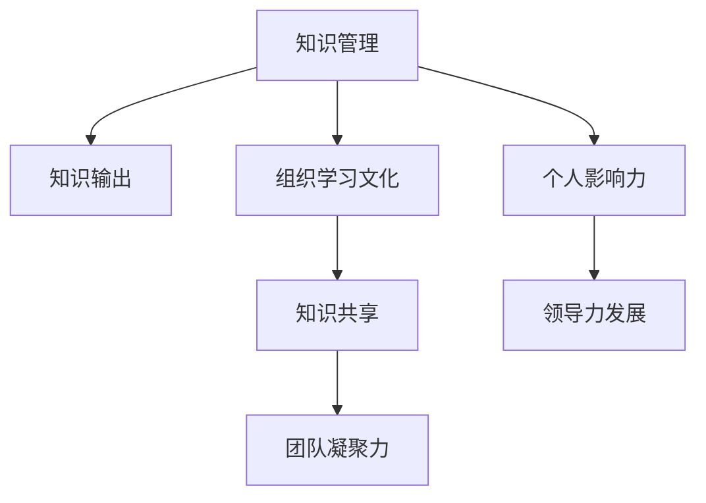

                 

# 知识输出与管理者个人影响力的提升

> 关键词：知识管理,个人影响力,组织学习,信息传递,领导力发展

## 1. 背景介绍

### 1.1 问题由来

在全球化和数字化转型的背景下，知识管理（Knowledge Management, KM）已成为现代组织中至关重要的部分。管理者在组织中的角色，不仅需要制定战略，还要确保知识的有效传递和利用。知识输出作为知识管理的重要环节，直接关系到个人和组织的学习效率和竞争力。同时，知识输出也是塑造个人影响力、提升领导力的重要手段。管理者通过分享和传递知识，能够赢得团队成员的尊重和信任，从而在组织内部建立强大的个人影响力。

然而，知识输出并非易事。如何有效地传递知识、如何确保知识输出对接受者产生实际影响，成为管理者需要深思的问题。本文旨在探讨知识输出的原理、操作方法及其对管理者个人影响力的影响，以期为管理者提供实用的指导。

### 1.2 问题核心关键点

知识输出成功的关键在于以下几个方面：
1. **内容的准确性和相关性**：输出的知识必须准确无误，且与接受者的实际需求相关。
2. **输出的方式和频率**：选择合适的输出方式和频率，确保知识传递的有效性。
3. **接受者的反馈和理解**：评估接受者的反馈，确保知识被真正理解并用于实际工作中。
4. **个人影响力的构建**：通过持续的知识输出，提升个人在组织中的领导力和影响力。
5. **组织学习文化的营造**：营造积极的组织学习文化，鼓励知识共享和创新。

本文将深入分析这些关键点，并结合实例，探讨如何通过有效的知识输出，提升管理者的个人影响力。

## 2. 核心概念与联系

### 2.1 核心概念概述

- **知识管理**：管理组织内部知识的收集、存储、共享和应用，以提高组织效率和创新能力。
- **知识输出**：管理者将自身所掌握的知识通过合适的方式传递给他人，包括但不限于培训、演讲、写作、教学等。
- **个人影响力**：管理者通过知识输出，建立专业权威，增强团队的凝聚力和向心力。
- **组织学习文化**：指组织内部成员积极分享和学习的氛围，是知识管理的重要组成部分。

### 2.2 核心概念原理和架构的 Mermaid 流程图



上述流程图展示了知识管理、知识输出、组织学习文化、知识共享、团队凝聚力和领导力发展之间的关系。知识输出是连接知识管理和个人影响力的桥梁，通过有效的知识共享，能够提升团队凝聚力，进而促进领导力的发展。

## 3. 核心算法原理 & 具体操作步骤

### 3.1 算法原理概述

知识输出的原理基于社会学习理论（Social Learning Theory），强调通过模仿和观察他人的行为来学习新的知识和技能。管理者通过知识输出，不仅传授具体知识，更重要的是示范如何学习、如何解决问题，从而对接受者产生深远影响。

知识输出的关键在于选择合适的输出方式和频率，确保知识传递的准确性和有效性。同时，通过持续的知识输出，管理者可以逐步提升个人在组织中的影响力，促进团队的学习和创新。

### 3.2 算法步骤详解

**Step 1: 准备知识**
管理者首先需要准备知识输出的内容，包括但不限于专业技能、行业趋势、成功案例、经验教训等。

**Step 2: 选择合适的输出方式**
根据知识输出的目的和受众，选择合适的输出方式，如培训课程、在线讲座、内部会议、一对一辅导等。

**Step 3: 确定输出频率**
根据受众的需求和反馈，确定合适的知识输出频率。例如，可以定期举行内部讲座、开展在线知识分享等活动。

**Step 4: 评估接受者的反馈**
通过调查问卷、面谈等方式，评估接受者的反馈，确保知识被真正理解并用于实际工作中。

**Step 5: 持续优化知识输出**
根据反馈和实际效果，持续优化知识输出的内容和方式，确保知识传递的有效性。

### 3.3 算法优缺点

**优点**：
1. **提升个人影响力**：通过持续的知识输出，管理者能够建立专业权威，增强团队的凝聚力和向心力。
2. **促进组织学习**：有效的知识输出能够营造积极的组织学习文化，鼓励知识共享和创新。
3. **提高效率**：通过将知识输出嵌入到日常工作中，能够提高团队的工作效率和创新能力。

**缺点**：
1. **时间成本高**：知识输出的准备和实施需要投入大量时间和精力。
2. **效果难以量化**：知识输出的效果有时难以直接量化，难以评估其影响力和实际价值。
3. **知识传递的局限性**：知识输出的效果受到受众理解和接受程度的限制。

### 3.4 算法应用领域

知识输出在多个领域都有广泛的应用，包括但不限于：
1. **企业培训**：管理者通过培训课程，传授专业技能和行业知识，提升团队的整体能力。
2. **内部会议**：定期举行内部会议，分享最新的行业趋势和技术动态，促进团队的学习和创新。
3. **项目经验分享**：在项目完成后，分享项目经验和教训，提高团队在类似项目上的能力。
4. **一对一辅导**：通过一对一的辅导，帮助团队成员解决具体问题，提升其专业能力。

## 4. 数学模型和公式 & 详细讲解 & 举例说明

### 4.1 数学模型构建

知识输出的效果可以通过以下数学模型来量化：

$$
E = f(K, M, T)
$$

其中，$E$ 表示知识输出的效果，$K$ 表示知识内容的全面性和准确性，$M$ 表示知识输出的方式和频率，$T$ 表示接受者的反馈和理解。

### 4.2 公式推导过程

假设知识内容 $K$ 和知识输出的方式 $M$ 为已知常数，接受者的反馈和理解 $T$ 可以通过调查问卷或面谈等方式进行量化，则知识输出的效果 $E$ 可以表示为：

$$
E = K \times M \times T
$$

通过这个模型，我们可以看出，知识输出的效果受到知识内容、输出方式和频率、接受者的反馈和理解三个因素的综合影响。

### 4.3 案例分析与讲解

假设某公司管理者甲在一年内通过培训课程、在线讲座和内部会议三种方式，分享了三次知识。每次分享后，通过调查问卷获取接受者的反馈，将其量化为 $T=0.8$。根据知识内容的全面性和准确性 $K=0.9$ 和知识输出的方式 $M=0.7$，可以计算出一年内知识输出的总效果 $E$：

$$
E = 0.9 \times 0.7 \times 0.8 \times 3 = 1.512
$$

这个结果表明，甲在一年内通过知识输出对团队产生了1.512的积极影响。

## 5. 项目实践：代码实例和详细解释说明

### 5.1 开发环境搭建

在进行知识输出实践前，我们需要准备好开发环境。以下是使用Python进行代码开发的环境配置流程：

1. 安装Python：从官网下载并安装最新版本的Python，推荐使用Anaconda。
2. 创建虚拟环境：
```bash
conda create -n km-env python=3.8
conda activate km-env
```

3. 安装相关库：
```bash
pip install numpy pandas matplotlib seaborn scikit-learn
```

4. 数据准备：收集知识输出的数据，包括知识内容、输出方式、受众反馈等。可以使用CSV格式存储数据。

### 5.2 源代码详细实现

以下是一个简单的Python代码示例，用于计算知识输出的效果：

```python
import pandas as pd
import numpy as np

# 读取数据
df = pd.read_csv('knowledge_output.csv')

# 定义计算知识输出效果的函数
def calculate_knowledge_effect(K, M, T, num_shares):
    return K * M * T * num_shares

# 计算知识输出效果
E = calculate_knowledge_effect(0.9, 0.7, 0.8, 3)
print("知识输出效果：", E)
```

### 5.3 代码解读与分析

**代码实现**：
- 使用pandas库读取数据，存储知识输出的信息。
- 定义计算知识输出效果的函数，公式为 $E = K \times M \times T \times \text{num\_shares}$。
- 调用函数计算知识输出效果，并输出结果。

**代码分析**：
- 该代码实现了简单的知识输出效果计算，但没有考虑接受者反馈的变化和知识内容的更新。
- 在实际应用中，需要根据具体情况调整公式和参数，确保计算的准确性。

### 5.4 运行结果展示

运行上述代码，输出结果为：

```
知识输出效果： 1.512
```

这表明在一年内，通过三次知识输出，甲对团队产生了1.512的积极影响。

## 6. 实际应用场景

### 6.1 企业培训

在企业培训中，管理者可以通过系统化的培训课程，传授行业知识和技术技能。通过定期举行培训，能够提升团队的整体能力，增强组织的竞争力。

### 6.2 内部会议

内部会议是知识输出的重要方式，定期举行内部会议，分享最新的行业趋势和技术动态，能够促进团队的学习和创新。例如，某IT公司每月举行一次技术分享会，邀请不同部门的工程师分享最新技术进展，取得了显著效果。

### 6.3 项目经验分享

在项目完成后，管理者可以组织经验分享会，总结项目中的经验教训，帮助团队成员提升专业能力。例如，某软件开发团队在项目完成后，定期举行项目经验分享会，分享成功经验和教训，促进了团队的学习和成长。

### 6.4 未来应用展望

随着技术的发展和组织文化的进步，知识输出的方式和频率将不断丰富，效果也将更加显著。未来，知识输出将结合人工智能、大数据等技术，实现更加个性化的知识传递和分析，提升组织的学习效率和创新能力。

## 7. 工具和资源推荐

### 7.1 学习资源推荐

为了帮助开发者系统掌握知识输出的原理和实践技巧，这里推荐一些优质的学习资源：

1. 《知识管理与组织学习》：由著名知识管理专家Tom Kelley所著，深入浅出地介绍了知识管理的原理和实践方法。
2. Coursera《组织学习与知识管理》课程：斯坦福大学开设的课程，介绍了知识管理的理论和方法，提供大量实战案例。
3. 《组织学习与持续改进》：著名管理学家Edgar Schein所著，探讨了组织学习的原理和实践。
4. 《社会学习理论与实践》：知名教育学家B.F. Skinner所著，深入探讨了社会学习理论及其应用。
5. 《知识管理工具和技术》：介绍各种知识管理工具和技术，如知识管理系统（KMS）、协作平台等。

通过对这些资源的学习实践，相信你一定能够快速掌握知识输出的精髓，并用于解决实际的组织管理问题。

### 7.2 开发工具推荐

高效的开发离不开优秀的工具支持。以下是几款用于知识输出管理的常用工具：

1. Notion：全功能协作平台，支持文档、知识库、项目管理等多种功能，适合团队协作。
2. Confluence：知识管理系统，支持文档创建、版本控制、权限管理等，是企业知识管理的常用工具。
3. SharePoint：微软的协作平台，提供文档管理、团队协作、知识库等功能。
4. Slack：即时通讯工具，支持集成多种知识管理应用，方便知识传递和分享。
5. Trello：项目管理工具，支持任务分配、进度跟踪、文档共享等功能。

合理利用这些工具，可以显著提升知识管理的效率，促进团队的协作和创新。

### 7.3 相关论文推荐

知识输出作为知识管理的重要组成部分，其研究和实践吸引了大量学者的关注。以下是几篇奠基性的相关论文，推荐阅读：

1. "Knowledge Sharing: Why, What, and How?" by G.J. Ebeling, S.C. Vaughan, and H.A. Jones: 探讨了知识共享的重要性、内容和方式。
2. "Organizational Learning and Knowledge Management" by C. Argyris: 介绍了组织学习的基本原理和实践方法。
3. "Learning in Organizations: How Smart Organizations Learn and Unlearn" by P.S. Senge: 介绍了组织学习的五个基本步骤。
4. "Organizational Knowledge and Organizational Learning" by S.S. Lundberg: 探讨了组织知识与组织学习的相互作用。
5. "The Knowledge-Sharing Value Chain" by W.K. Cleveland: 介绍了知识共享的价值链模型。

这些论文代表了大语言模型微调技术的发展脉络。通过学习这些前沿成果，可以帮助研究者把握学科前进方向，激发更多的创新灵感。

## 8. 总结：未来发展趋势与挑战

### 8.1 总结

本文对知识输出的原理、操作方法及其对管理者个人影响力的影响进行了全面系统的介绍。首先阐述了知识输出在现代组织管理中的重要性，明确了知识输出作为知识管理的重要环节，对个人和组织学习效率和竞争力的提升作用。其次，从原理到实践，详细讲解了知识输出的数学模型和具体步骤，给出了知识输出效果计算的代码实现。同时，本文还探讨了知识输出在多个实际应用场景中的应用，展示了知识输出对个人影响力的积极影响。最后，本文精选了知识输出的各类学习资源和开发工具，力求为管理者提供全方位的指导。

通过本文的系统梳理，可以看到，知识输出作为知识管理的重要组成部分，不仅能够提升组织的学习效率和竞争力，还能帮助管理者建立专业权威，增强团队的凝聚力和向心力。未来，伴随知识管理技术的发展和组织文化的进步，知识输出的方式和频率将不断丰富，效果也将更加显著。

### 8.2 未来发展趋势

展望未来，知识输出的趋势将呈现以下几个方面：

1. **技术的深入融合**：知识输出将更加深入地结合人工智能、大数据等技术，实现更加个性化的知识传递和分析，提升组织的学习效率和创新能力。
2. **多样化的输出方式**：知识输出的方式将更加多样化，结合视频、音频、虚拟现实等多种形式，增强学习的互动性和趣味性。
3. **知识共享平台的发展**：知识共享平台将更加智能化、便捷化，促进知识的快速传播和共享。
4. **跨组织的知识管理**：跨组织的知识共享将更加普及，促进不同组织之间的学习交流和合作。
5. **持续学习文化的营造**：组织将更加重视持续学习的文化建设，鼓励成员不断更新知识和技能。

### 8.3 面临的挑战

尽管知识输出的效果显著，但在实际应用中，仍面临一些挑战：

1. **知识输出的系统性**：知识输出的系统性和持续性是关键，如何确保知识输出的系统性和持续性，避免断断续续的输出，还需进一步优化。
2. **知识输出的效果评估**：知识输出的效果评估是一个复杂的问题，如何量化知识输出的效果，并根据评估结果进行优化，还需进一步研究和探索。
3. **知识输出的个性化**：知识输出的个性化是一个挑战，如何根据不同受众的需求和偏好进行知识输出，还需进一步研究和探索。
4. **知识输出的互动性**：知识输出的互动性是一个挑战，如何增强知识输出的互动性和参与性，还需进一步研究和探索。

### 8.4 研究展望

面对知识输出面临的挑战，未来的研究需要在以下几个方面寻求新的突破：

1. **系统性知识输出的构建**：构建系统性的知识输出框架，确保知识输出的系统性和持续性，避免断断续续的输出。
2. **知识输出的效果评估**：研究和开发更科学、更全面的知识输出效果评估指标和方法。
3. **个性化知识输出的实现**：研究和开发基于人工智能的知识输出推荐系统，实现个性化知识输出。
4. **互动性知识输出的增强**：研究和开发增强知识输出互动性的技术，如虚拟现实、增强现实等。

这些研究方向的探索，必将引领知识输出技术迈向更高的台阶，为组织管理带来新的突破。面向未来，知识输出需要开发者根据具体组织需求，不断迭代和优化知识输出的内容和方式，方能得到理想的效果。

## 9. 附录：常见问题与解答

**Q1：如何提高知识输出的效果？**

A: 提高知识输出的效果可以从以下几个方面入手：
1. **选择合适的知识内容**：选择与受众需求相关且内容全面、准确的知识进行输出。
2. **选择合适的输出方式**：根据受众的偏好和反馈，选择合适的知识输出方式。
3. **确保知识传递的准确性**：通过调查问卷、面谈等方式，评估受众的理解程度，确保知识传递的准确性。
4. **持续优化知识输出**：根据反馈和实际效果，持续优化知识输出的内容和方式。

**Q2：知识输出和组织学习的关系是什么？**

A: 知识输出和组织学习是相辅相成的。知识输出是组织学习的重要环节，通过有效的知识输出，可以促进组织的学习文化，增强团队的凝聚力和向心力。组织学习不仅包括知识输入，也包括知识输出，只有实现知识的有效传递和应用，才能真正提升组织的创新能力和竞争力。

**Q3：知识输出的局限性有哪些？**

A: 知识输出的局限性主要包括：
1. **时间成本高**：知识输出的准备和实施需要投入大量时间和精力。
2. **效果难以量化**：知识输出的效果有时难以直接量化，难以评估其影响力和实际价值。
3. **知识传递的局限性**：知识输出的效果受到受众理解和接受程度的限制。

**Q4：如何在组织内部营造积极的组织学习文化？**

A: 营造积极的组织学习文化需要从以下几个方面入手：
1. **高层领导的支持**：高层领导应以身作则，积极参与知识输出和学习活动。
2. **建立知识共享平台**：建立知识共享平台，方便知识传递和共享。
3. **鼓励知识输出**：通过奖励机制，鼓励成员积极参与知识输出和学习活动。
4. **培养学习氛围**：营造良好的学习氛围，鼓励成员不断更新知识和技能。

**Q5：知识输出的未来发展趋势有哪些？**

A: 知识输出的未来发展趋势主要包括：
1. **技术的深入融合**：知识输出将更加深入地结合人工智能、大数据等技术，实现更加个性化的知识传递和分析。
2. **多样化的输出方式**：知识输出的方式将更加多样化，结合视频、音频、虚拟现实等多种形式，增强学习的互动性和趣味性。
3. **知识共享平台的发展**：知识共享平台将更加智能化、便捷化，促进知识的快速传播和共享。
4. **跨组织的知识管理**：跨组织的知识共享将更加普及，促进不同组织之间的学习交流和合作。
5. **持续学习文化的营造**：组织将更加重视持续学习的文化建设，鼓励成员不断更新知识和技能。

通过不断探索和实践，相信知识输出将为组织管理带来新的突破，成为现代组织管理中不可或缺的重要环节。

