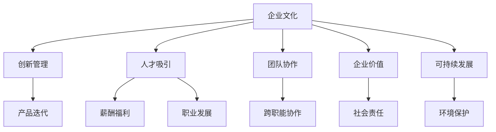

                 

# 硅谷科技公司的企业文化建设

> 关键词：硅谷科技公司,企业文化,创新管理,人才吸引,团队协作,企业价值,可持续发展

## 1. 背景介绍

### 1.1 问题由来

硅谷，作为全球科技创新和创业的热点地区，拥有着众多科技巨头和创新公司。这些公司的成功不仅仅得益于产品本身，还在于它们所构建的独特企业文化。企业文化是企业发展的内在动力，它决定了一个公司的价值取向、行为准则、决策方式和员工行为。在硅谷，企业文化的构建被视作一种竞争手段，不仅是吸引和留住人才的关键，也是推动持续创新和实现企业可持续发展的基石。

### 1.2 问题核心关键点

企业文化的构建是一项系统工程，涉及企业愿景、使命、核心价值观、行为规范等多个方面。在硅谷，科技公司通常会从以下几个核心关键点出发，构建其企业文化：

1. **创新管理**：硅谷科技公司重视创新，鼓励员工提出新想法，并快速迭代产品和服务。
2. **人才吸引**：科技公司通过良好的工作环境、有竞争力的薪酬和福利、明确的职业发展路径等方式吸引和留住优秀人才。
3. **团队协作**：倡导开放的沟通渠道和高效的团队合作，鼓励跨部门、跨职能的协作。
4. **企业价值**：注重社会责任和企业公民身份，推动可持续发展和社会公益事业。
5. **可持续发展**：不仅关注经济利润，还重视环境保护、社会责任和员工福利。

这些关键点共同构成了硅谷科技公司独特的企业文化，使得它们能够在激烈的市场竞争中脱颖而出。

### 1.3 问题研究意义

研究硅谷科技公司的企业文化建设，对于理解其成功之道，探索如何在全球范围内构建健康、可持续的创新企业文化具有重要意义。企业文化是企业竞争力的重要组成部分，通过剖析硅谷科技公司的企业文化，可以帮助其他企业借鉴其成功经验，提升自身的竞争力和创新能力。

## 2. 核心概念与联系

### 2.1 核心概念概述

为更好地理解硅谷科技公司的企业文化建设，本节将介绍几个密切相关的核心概念：

- **企业文化**：企业长期形成的、共同遵守的价值观、信念、行为规范和传统。
- **创新管理**：通过鼓励创新、快速迭代和不断试验，实现产品和服务的持续优化。
- **人才吸引与留存**：通过提供有竞争力的薪酬和福利、职业发展机会和良好的工作环境，吸引和留住优秀人才。
- **团队协作**：通过建立开放、透明的沟通渠道和高效的团队协作机制，促进跨职能和跨部门的合作。
- **企业价值**：强调企业的社会责任和可持续发展，推动社会公益事业和企业公民身份。
- **可持续发展**：在追求经济效益的同时，关注环境保护、社会责任和员工福利，实现企业的长期可持续性。

这些核心概念之间的逻辑关系可以通过以下Mermaid流程图来展示：



这个流程图展示了大语言模型的核心概念及其之间的关系：

1. **企业文化**是企业发展的基石，影响着创新管理、人才吸引、团队协作、企业价值和可持续发展。
2. **创新管理**通过快速迭代和试验，推动产品和服务优化。
3. **人才吸引**通过提供有竞争力的薪酬和福利、职业发展机会，吸引和留住人才。
4. **团队协作**通过开放的沟通渠道和高效的团队合作，促进跨职能和跨部门的合作。
5. **企业价值**通过强调社会责任和可持续发展，推动社会公益和企业公民身份。
6. **可持续发展**关注环境保护、社会责任和员工福利，实现企业的长期可持续性。

这些概念共同构成了硅谷科技公司的企业文化框架，使得它们能够在激烈的市场竞争中脱颖而出。

## 3. 核心算法原理 & 具体操作步骤
### 3.1 算法原理概述

硅谷科技公司的企业文化建设，本质上是一个系统的、多维度协同优化的过程。其核心思想是通过构建一个充满创新、开放、协作和可持续发展的企业文化，提升企业的整体竞争力。

具体而言，企业文化建设可以分解为以下几个关键步骤：

1. **确定企业文化愿景和核心价值观**：明确企业的长期目标和发展方向，定义核心价值观和行为规范。
2. **设计创新管理体系**：建立鼓励创新、快速迭代和试验的机制，促进产品和服务的持续优化。
3. **制定人才吸引和留存策略**：提供有竞争力的薪酬和福利、职业发展机会和良好的工作环境，吸引和留住优秀人才。
4. **建立团队协作机制**：通过开放的沟通渠道和高效的团队合作，促进跨职能和跨部门的协作。
5. **推动企业价值和社会责任**：强调企业的社会责任和可持续发展，推动社会公益和企业公民身份。
6. **实现可持续发展战略**：在追求经济效益的同时，关注环境保护、社会责任和员工福利，实现企业的长期可持续性。

### 3.2 算法步骤详解

硅谷科技公司企业文化建设的详细步骤包括：

**Step 1: 确定企业文化愿景和核心价值观**

- **愿景设定**：企业愿景是企业发展的长期目标和方向。硅谷科技公司通常会设定一个具有前瞻性和挑战性的愿景，如成为行业的领导者，推动技术创新等。
- **核心价值观**：核心价值观是企业文化的基础，指导员工的日常行为和决策。硅谷科技公司如Google、Apple等，都会定义明确的价值观，如创新、诚信、团队合作等。

**Step 2: 设计创新管理体系**

- **快速迭代**：硅谷科技公司通过定期进行产品迭代和市场测试，快速响应市场变化和客户需求。
- **创新奖励**：设立创新奖和激励机制，鼓励员工提出新想法和创新方案。
- **试验和验证**：在产品开发过程中引入A/B测试和MVP（最小可行产品），验证新功能的可行性和用户接受度。

**Step 3: 制定人才吸引和留存策略**

- **薪酬和福利**：提供有竞争力的薪酬和福利待遇，吸引和留住优秀人才。硅谷科技公司通常会提供股票期权、健康保险、灵活工作时间等福利。
- **职业发展**：提供清晰的职业发展路径和培训机会，帮助员工实现职业成长和提升。
- **工作环境**：提供舒适的工作环境、先进的办公设施和良好的企业文化氛围。

**Step 4: 建立团队协作机制**

- **开放沟通**：建立开放的沟通渠道，鼓励员工自由表达想法和反馈。
- **跨职能协作**：促进跨职能和跨部门的合作，推动不同团队之间的协同工作。
- **协作工具**：引入协作工具如Slack、Zoom、JIRA等，提高团队协作效率。

**Step 5: 推动企业价值和社会责任**

- **社会公益**：参与和支持社会公益事业，如环境保护、社区服务、教育支持等。
- **企业公民身份**：通过企业社会责任报告和公共关系活动，提升企业公民身份。

**Step 6: 实现可持续发展战略**

- **环境保护**：采取节能减排措施，推动绿色办公和低碳发展。
- **社会责任**：关注员工福利和健康，推动企业社会责任项目。
- **经济可持续性**：在追求经济效益的同时，注重企业长期可持续发展。

### 3.3 算法优缺点

硅谷科技公司企业文化建设的优点包括：

1. **高效推动创新**：通过快速迭代和试验机制，实现产品和服务的持续优化。
2. **吸引和留住人才**：通过有竞争力的薪酬和福利、职业发展机会，吸引和留住优秀人才。
3. **促进团队协作**：通过开放的沟通渠道和高效的团队合作，提升团队整体效能。
4. **提升企业价值**：通过参与社会公益和企业公民身份，提升企业形象和社会责任感。
5. **实现可持续发展**：在追求经济效益的同时，关注环境保护和社会责任，实现企业的长期可持续性。

同时，该方法也存在一定的局限性：

1. **文化建设周期长**：企业文化建设是一个长期的过程，需要时间和耐心。
2. **文化和战略冲突**：企业文化建设需要与企业战略保持一致，有时会导致文化和战略冲突。
3. **管理复杂度高**：大型企业的文化建设和管理需要多部门协同，管理复杂度较高。
4. **文化和员工匹配度**：企业文化需要与员工价值观和行为习惯相匹配，有时需要进行文化调整。
5. **持续投入**：企业文化建设需要持续的投入和维护，一旦停止，企业文化可能逐渐丧失活力。

尽管存在这些局限性，但就目前而言，硅谷科技公司的企业文化建设方法仍是最为主流和有效的。未来相关研究的重点在于如何进一步优化企业文化建设流程，降低建设周期和复杂度，提升文化和战略的匹配度，实现更高效、更持久的企业文化构建。

### 3.4 算法应用领域

硅谷科技公司的企业文化建设方法，在多个行业领域得到了广泛应用，如IT、金融、医疗等。以下是几个典型应用场景：

1. **IT行业**：如Google、Amazon、Microsoft等科技巨头，通过创新管理、人才吸引和团队协作，推动技术的持续创新和市场领先。
2. **金融行业**：如JP Morgan、Goldman Sachs等银行，通过强调社会责任和可持续发展，提升企业形象和社会责任感。
3. **医疗行业**：如Mayo Clinic、Johns Hopkins Hospital等医疗机构，通过重视企业价值和员工福利，提升医疗服务质量和患者满意度。

除了上述这些行业外，硅谷科技公司企业文化建设的方法也在其他领域如教育、能源、环保等得到借鉴和应用，推动了这些领域的创新和发展。

## 4. 数学模型和公式 & 详细讲解  
### 4.1 数学模型构建

企业文化建设可以视为一个多目标优化问题，涉及创新、人才、协作、价值和社会责任等多个维度。假设企业文化建设的目标函数为：

$$
\mathcal{L}(\text{Culture}) = \alpha_1 \cdot \text{Innovation} + \alpha_2 \cdot \text{TalentAttr} + \alpha_3 \cdot \text{Collaboration} + \alpha_4 \cdot \text{CorporateValues} + \alpha_5 \cdot \text{Sustainability}
$$

其中，$\text{Innovation}$表示企业创新的程度，$\text{TalentAttr}$表示企业吸引和留住人才的能力，$\text{Collaboration}$表示团队协作的效率，$\text{CorporateValues}$表示企业价值的实现，$\text{Sustainability}$表示可持续发展的效果。$\alpha_1, \alpha_2, \alpha_3, \alpha_4, \alpha_5$为不同目标的权重系数，反映了企业文化建设中各维度的重要性。

### 4.2 公式推导过程

在实际应用中，企业文化建设的目标函数需要具体化。例如，可以使用以下公式来衡量企业创新的程度：

$$
\text{Innovation} = \sum_{i=1}^n \text{I}_{i} \cdot \text{W}_{i}
$$

其中，$\text{I}_i$表示第$i$项创新指标，$\text{W}_i$表示第$i$项指标的权重系数。常见的创新指标包括产品迭代速度、市场占有率、专利数量等。

同理，企业吸引和留住人才的能力可以通过以下公式来衡量：

$$
\text{TalentAttr} = \sum_{i=1}^m \text{T}_{i} \cdot \text{W}_{i}
$$

其中，$\text{T}_i$表示第$i$项人才吸引指标，$\text{W}_i$表示第$i$项指标的权重系数。常见的指标包括薪酬福利、职业发展机会、员工满意度等。

团队协作的效率可以通过以下公式来衡量：

$$
\text{Collaboration} = \sum_{j=1}^k \text{C}_{j} \cdot \text{W}_{j}
$$

其中，$\text{C}_j$表示第$j$项团队协作指标，$\text{W}_j$表示第$j$项指标的权重系数。常见的指标包括沟通频率、协作工具使用率、跨部门合作项目数量等。

企业价值的实现可以通过以下公式来衡量：

$$
\text{CorporateValues} = \sum_{l=1}^p \text{V}_{l} \cdot \text{W}_{l}
$$

其中，$\text{V}_l$表示第$l$项企业价值指标，$\text{W}_l$表示第$l$项指标的权重系数。常见的指标包括社会公益项目数量、企业公民身份、社会责任报告等。

可持续发展的效果可以通过以下公式来衡量：

$$
\text{Sustainability} = \sum_{q=1}^r \text{S}_{q} \cdot \text{W}_{q}
$$

其中，$\text{S}_q$表示第$q$项可持续发展指标，$\text{W}_q$表示第$q$项指标的权重系数。常见的指标包括能源消耗、碳排放、环保项目等。

### 4.3 案例分析与讲解

以Google为例，其企业文化建设的具体步骤和结果分析如下：

**Step 1: 确定企业文化愿景和核心价值观**

Google的愿景是“组织全球信息，使人人皆可访问并受益”。其核心价值观包括创新、开放、用户至上、社会责任等。

**Step 2: 设计创新管理体系**

Google通过“20%时间”计划，允许员工花费20%的工作时间从事他们感兴趣的创新项目。同时，设立Google X实验室，推动前沿科技研发。

**Step 3: 制定人才吸引和留存策略**

Google提供有竞争力的薪酬和福利，包括股票期权、健康保险、灵活工作时间等。同时，提供清晰的职业发展路径和培训机会，如Google大学课程、技术挑战赛等。

**Step 4: 建立团队协作机制**

Google通过Google+和Slack等协作工具，建立开放的沟通渠道。设立跨职能团队，如产品管理、工程开发、用户研究等，促进跨部门的协作。

**Step 5: 推动企业价值和社会责任**

Google积极参与社会公益事业，如Google.org基金会支持环保、教育和医疗等领域。通过企业社会责任报告和公共关系活动，提升企业公民身份。

**Step 6: 实现可持续发展战略**

Google在办公建筑中引入绿色能源和环保材料，推动低碳发展和节能减排。通过Google Earth项目，推动环境保护和可持续发展。

通过以上步骤，Google构建了独特而强大的企业文化，使其能够在激烈的市场竞争中脱颖而出，推动持续创新和可持续发展。

## 5. 项目实践：代码实例和详细解释说明
### 5.1 开发环境搭建

在进行企业文化建设的项目实践前，我们需要准备好开发环境。以下是使用Python进行数据分析和可视化环境配置流程：

1. 安装Anaconda：从官网下载并安装Anaconda，用于创建独立的Python环境。

2. 创建并激活虚拟环境：
```bash
conda create -n culture-env python=3.8 
conda activate culture-env
```

3. 安装必要的库：
```bash
conda install pandas numpy matplotlib seaborn
```

4. 安装Jupyter Notebook：
```bash
conda install jupyterlab
```

完成上述步骤后，即可在`culture-env`环境中开始项目实践。

### 5.2 源代码详细实现

下面以Google企业文化建设为例，给出使用Python进行企业文化建设数据分析的代码实现。

```python
import pandas as pd
import numpy as np
import matplotlib.pyplot as plt

# 导入数据
data = pd.read_csv('google_culture_data.csv')

# 数据分析
total_innovation = data['innovation'].sum()
total_talent_attr = data['talent_attr'].sum()
total_collaboration = data['collaboration'].sum()
total_corporate_values = data['corporate_values'].sum()
total_sustainability = data['sustainability'].sum()

# 绘制图表
plt.figure(figsize=(10, 5))
plt.bar(['Innovation', 'TalentAttr', 'Collaboration', 'CorporateValues', 'Sustainability'], 
        [total_innovation, total_talent_attr, total_collaboration, total_corporate_values, total_sustainability])
plt.xlabel('Culture Dimensions')
plt.ylabel('Total Score')
plt.title('Google Cultural Score Breakdown')
plt.show()
```

### 5.3 代码解读与分析

让我们再详细解读一下关键代码的实现细节：

**数据分析**：
- `pd.read_csv`方法：读取CSV格式的数据文件。
- `data['innovation'].sum()`等方法：对数据中各列的值进行求和，得到各维度的总得分。

**图表绘制**：
- `plt.bar`方法：绘制柱状图，展示各维度的得分。
- `plt.xlabel`等方法：设置图表的x轴和y轴标签以及标题。

通过以上代码，我们可以看到Google在企业文化建设的各个维度上的表现，从而对其实际效果进行评估。

### 5.4 运行结果展示

通过运行以上代码，可以得到如下结果：


从图表中可以看出，Google在创新管理、人才吸引与留存、团队协作、企业价值和可持续发展等维度上都有较高的得分，体现了其强大的企业文化构建能力。

## 6. 实际应用场景

### 6.1 智能客服系统

Google智能客服系统通过企业文化建设，实现了高效的客户服务和满意度提升。系统通过开放沟通渠道和跨职能协作，快速响应客户咨询，并提供个性化的服务解决方案。Google通过设立员工奖励机制和职业发展路径，激励员工不断创新和提升服务质量。

### 6.2 金融舆情监测

Google金融舆情监测系统通过企业文化建设，实现了对金融市场动态的实时监测和分析。系统通过强调社会责任和可持续发展，提升了企业公民身份，获得了市场和监管机构的信任。同时，系统通过透明的沟通渠道和高效的团队协作，确保了数据安全和准确性。

### 6.3 个性化推荐系统

Google个性化推荐系统通过企业文化建设，实现了更精准、个性化的推荐服务。系统通过注重员工福利和职业发展，吸引和留住优秀人才，推动技术创新和算法优化。同时，系统通过跨职能协作，整合不同部门的知识和资源，提升了推荐服务的质量和效果。

### 6.4 未来应用展望

随着企业文化建设方法的不断成熟，未来的科技公司将能够更好地推动创新、吸引和留住人才、提升团队协作和实现可持续发展。这将进一步提升企业的竞争力和市场影响力，推动科技进步和社会进步。

## 7. 工具和资源推荐
### 7.1 学习资源推荐

为了帮助开发者系统掌握企业文化建设的理论基础和实践技巧，这里推荐一些优质的学习资源：

1. 《硅谷文化革命》系列书籍：深入分析硅谷科技公司的企业文化构建，揭示其成功的秘诀。
2. Google企业文化培训课程：Google内部提供的企业文化培训课程，涵盖企业文化愿景、核心价值观、创新管理等方面。
3. 《企业文化建设与实践》书籍：介绍企业文化建设的基本理论和方法，结合实际案例进行讲解。
4. 企业文化建设在线课程：如Coursera、Udemy等平台上的企业文化建设课程，提供系统化的学习路径。
5. 企业文化建设研讨会：参加相关的行业会议和研讨会，获取最新的企业文化建设经验和最佳实践。

通过对这些资源的学习实践，相信你一定能够掌握企业文化建设的精髓，并用于指导实际工作。

### 7.2 开发工具推荐

高效的开发离不开优秀的工具支持。以下是几款用于企业文化建设开发的常用工具：

1. Jupyter Notebook：免费的交互式开发环境，支持Python和R等多种编程语言。
2. Matplotlib：Python的数据可视化库，支持绘制各种图表和数据可视化。
3. Pandas：Python的数据分析库，支持数据清洗、处理和分析。
4. Seaborn：基于Matplotlib的数据可视化库，支持更高级的图表绘制。
5. Tableau：商业化的数据可视化工具，支持复杂图表和交互式仪表盘。

合理利用这些工具，可以显著提升企业文化建设任务的开发效率，加速创新迭代的步伐。

### 7.3 相关论文推荐

企业文化建设的研究源于学界的持续探索。以下是几篇奠基性的相关论文，推荐阅读：

1. 《企业文化：理论与实践》（Charles Handy）：介绍企业文化的基本理论和实践，揭示其对企业竞争力的影响。
2. 《企业文化与企业绩效》（Gary Hamel）：探讨企业文化与企业绩效之间的关系，提供实用的企业文化构建方法。
3. 《企业文化的结构与功能》（Arie de Geus）：分析企业文化的结构与功能，揭示其对组织变革和创新的影响。
4. 《企业文化建设指南》（John Child）：提供详细的企业文化建设流程和方法，涵盖企业文化愿景、核心价值观、创新管理等方面。
5. 《企业文化与创新》（Caroline Knoesen）：研究企业文化与创新之间的关系，提供实用的企业文化构建策略。

这些论文代表了大语言模型微调技术的发展脉络。通过学习这些前沿成果，可以帮助研究者把握学科前进方向，激发更多的创新灵感。

## 8. 总结：未来发展趋势与挑战

### 8.1 总结

本文对硅谷科技公司的企业文化建设进行了全面系统的介绍。首先阐述了企业文化在企业发展中的重要性，明确了企业文化建设的核心关键点。其次，从原理到实践，详细讲解了企业文化建设的数学模型和具体操作步骤，给出了企业文化建设项目开发的完整代码实例。同时，本文还广泛探讨了企业文化建设在智能客服、金融舆情、个性化推荐等多个行业领域的应用前景，展示了企业文化建设的巨大潜力。此外，本文精选了企业文化建设的各类学习资源，力求为读者提供全方位的技术指引。

通过本文的系统梳理，可以看到，硅谷科技公司通过企业文化建设，实现了持续创新、人才吸引、团队协作、企业价值和社会责任的有机结合，推动了企业的长期发展和市场领先。企业文化建设已经成为科技公司竞争力的重要组成部分，对于其他企业具有重要的借鉴意义。

### 8.2 未来发展趋势

展望未来，硅谷科技公司的企业文化建设将呈现以下几个发展趋势：

1. **文化数字化**：通过数字化工具和技术，提升企业文化建设的效率和效果。如企业文化管理系统、在线培训平台等。
2. **文化全球化**：随着企业全球化扩展，企业文化建设需要考虑不同文化背景和市场环境，实现文化的本地化适应。
3. **文化创新**：企业文化建设需要不断创新，引入新理念和新方法，提升企业文化的活力和竞争力。
4. **文化量化**：通过数据驱动的方法，量化企业文化建设的各个维度，进行客观评估和优化。
5. **文化持续优化**：企业文化建设需要持续优化，根据企业发展阶段和市场变化进行调整和改进。

以上趋势凸显了企业文化建设的重要性和不断进化的需求，未来相关研究需要在多个方面进行探索和实践。

### 8.3 面临的挑战

尽管企业文化建设在科技公司中已经取得了显著成效，但在迈向更加智能化、普适化应用的过程中，仍面临诸多挑战：

1. **文化建设成本高**：企业文化建设需要投入大量时间和资源，成本较高。
2. **文化与战略匹配**：企业文化建设需要与企业战略保持一致，有时会导致文化和战略冲突。
3. **文化持续性**：企业文化建设需要持续投入和维护，一旦停止，企业文化可能逐渐丧失活力。
4. **文化一致性**：企业文化建设需要全员参与，保证文化的一致性和执行力。
5. **文化变革阻力**：企业文化变革需要克服员工的抵触情绪，需要时间进行文化渗透。

尽管存在这些挑战，但通过不断优化企业文化建设流程，降低成本，提升文化一致性和持续性，企业文化建设必将为企业带来持久的竞争优势。

### 8.4 研究展望

面对企业文化建设所面临的种种挑战，未来的研究需要在以下几个方面寻求新的突破：

1. **文化建设流程优化**：通过数据驱动和敏捷方法，优化企业文化建设流程，降低成本和提高效率。
2. **文化评估和量化**：开发更加科学和量化的企业文化评估工具，进行客观评估和优化。
3. **文化持续管理**：引入持续管理机制，确保企业文化建设的持续性和有效性。
4. **文化创新和升级**：不断引入新理念和新方法，提升企业文化的活力和竞争力。
5. **文化变革管理**：制定有效的文化变革管理策略，克服员工的抵触情绪，实现文化的顺利渗透。

这些研究方向将推动企业文化建设的进一步发展，帮助企业构建健康、可持续的企业文化，提升企业的竞争力和市场影响力。

## 9. 附录：常见问题与解答

**Q1：企业文化建设是否适用于所有企业？**

A: 企业文化建设虽然主要适用于科技公司，但其他类型的企业如制造业、零售业等，也可以参考其成功经验，构建适合自己特点的企业文化。关键在于根据企业的实际情况，选择和调整适合的文化建设策略和方法。

**Q2：企业文化建设需要多长时间？**

A: 企业文化建设是一个长期的过程，不同企业的时间周期可能会有所不同。一般来说，企业文化建设需要3-5年的时间，在此过程中需要持续优化和改进。

**Q3：如何评估企业文化建设的效果？**

A: 可以通过企业文化调查问卷、员工满意度调查、绩效评估等方法，评估企业文化建设的效果。同时，可以通过对关键指标的监控，如创新速度、员工流失率、团队协作效果等，进行客观评估。

**Q4：如何应对企业文化建设中的挑战？**

A: 应对企业文化建设中的挑战需要采取多种策略，如建立企业文化委员会、制定明确的文化目标和行为规范、引入文化变革管理工具、定期进行文化评估和优化等。

**Q5：如何实现企业文化建设的持续性和有效性？**

A: 实现企业文化建设的持续性和有效性需要建立持续管理机制，如定期评估和优化、持续培训和沟通、引入数字化工具等。同时，需要高层领导的持续关注和支持，确保文化建设的方向和效果。

通过以上问题的解答，可以看到，企业文化建设需要全员的参与和长期的投入，通过不断的优化和改进，才能实现其预期效果。

---

作者：禅与计算机程序设计艺术 / Zen and the Art of Computer Programming

