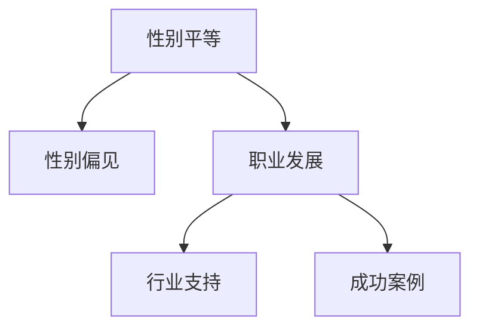

                 

# 硅谷科技女性:打破性别天花板

## 1. 背景介绍

### 1.1 问题由来
近年来，科技领域的性别平等问题逐渐成为全球关注的焦点。尽管在教育和学术研究领域，女性在STEM领域的参与度逐年上升，但在实际技术岗位上，女性仍然面临诸多挑战。尤其是在硅谷这样的科技重镇，性别比例失衡现象尤为严重。女性在科技公司的比例远低于整体社会平均水平，这在一定程度上反映了行业内存在的性别偏见和职业发展障碍。

### 1.2 问题核心关键点
本文聚焦于科技行业中女性的现状和挑战，探讨如何通过各种措施打破性别天花板，让更多的女性在科技领域中发光发热。我们重点关注以下几个核心问题：
1. **性别偏见和歧视**：了解女性在科技公司中面临的性别偏见和歧视问题，以及这些偏见对女性职业发展的影响。
2. **职业发展障碍**：剖析女性在科技公司中遇到的职业发展障碍，包括晋升难度、工作环境、薪酬待遇等。
3. **行业支持与资源**：研究当前行业内支持女性发展的各种资源和措施，包括教育培训、职业指导、企业政策等。
4. **成功案例分析**：分享一些成功打破性别天花板的女性科技专家，分析她们的成功经验和面临的挑战。

## 2. 核心概念与联系

### 2.1 核心概念概述
在探讨硅谷科技女性问题时，需要引入以下核心概念：

- **性别平等**：男女在教育、职业、薪酬等方面的平等权利和机会。
- **性别偏见**：基于性别的刻板印象和歧视行为，影响个体的职业发展和心理健康。
- **职业发展**：从入门到进阶，再到领导层，个体在职业生涯中的成长过程。
- **行业支持**：旨在促进性别平等的企业政策、教育资源、社区活动等。
- **成功案例**：具有代表性的女性科技专家，她们的突破之路和当前成就。

这些概念之间的联系可以通过以下Mermaid流程图来展示：



这个流程图展示了性别平等、性别偏见、职业发展、行业支持和成功案例之间的逻辑关系：

1. 性别平等是理想状态，是打破性别天花的目标。
2. 性别偏见是实现性别平等的障碍，需要行业共同努力解决。
3. 职业发展是实现性别平等的路径，通过教育和支持帮助女性成长。
4. 行业支持为职业发展提供资源和环境，是成功的重要保障。
5. 成功案例为职业发展和行业支持提供实例和经验，激励更多女性前进。

## 3. 核心算法原理 & 具体操作步骤

### 3.1 算法原理概述
打破性别天花板的算法原理基于系统性干预，通过教育、政策、企业文化等多方面的努力，逐步消除性别偏见，促进女性在科技领域中的职业发展。核心步骤包括：

1. **数据收集与分析**：收集女性在科技公司中的就业数据、薪酬数据、晋升数据等，分析性别偏见和职业发展障碍。
2. **教育与培训**：提供性别平等的教育资源，提升女性在STEM领域的知识和技能。
3. **企业政策**：制定并执行促进性别平等的企业政策，如灵活工作安排、育儿支持等。
4. **文化建设**：营造包容和支持的工作环境，改变性别刻板印象。
5. **成功案例推广**：分享成功女性的经验和故事，激励更多女性加入科技领域。

### 3.2 算法步骤详解

#### 3.2.1 数据收集与分析
1. **就业数据**：收集女性在科技公司中的就业数据，包括职位分布、薪酬水平、晋升情况等。
2. **薪酬数据**：收集女性和男性在不同职位上的薪酬数据，分析薪酬差距。
3. **晋升数据**：收集女性在科技公司的晋升数据，分析晋升难度和晋升路径。
4. **调查问卷**：通过问卷调查了解女性在职场中的体验和建议。
5. **案例分析**：选取典型案例进行深入分析，总结成功经验和面临的挑战。

#### 3.2.2 教育与培训
1. **基础教育**：提升女性在STEM领域的学术成绩，鼓励女性进入科技专业。
2. **职业培训**：提供与科技相关的职业培训课程，提升女性技能。
3. **导师制**：建立导师制，帮助女性解决职业发展中的具体问题。
4. **工作坊和讲座**：举办工作坊和讲座，提升女性在职场中的自信心和能力。

#### 3.2.3 企业政策
1. **招聘政策**：制定公平的招聘政策，消除性别偏见。
2. **薪酬政策**：实施公平的薪酬政策，缩小薪酬差距。
3. **晋升政策**：制定明确的晋升政策，确保女性有机会晋升。
4. **育儿支持**：提供育儿支持，如产假、育儿假、托儿服务等。
5. **工作灵活性**：提供灵活的工作安排，如远程办公、弹性工作时间等。

#### 3.2.4 文化建设
1. **性别意识培训**：开展性别意识培训，提升员工的性别平等意识。
2. **多样性活动**：组织多样性活动，如国际妇女节、科技女性日等。
3. **员工支持**：设立员工支持机制，如性别平等委员会、心理咨询服务等。

#### 3.2.5 成功案例推广
1. **访谈与记录**：通过访谈记录成功女性科技专家的经历和建议。
2. **案例分享**：在行业会议、社区活动中等分享成功案例，激励更多女性。
3. **媒体宣传**：利用媒体宣传成功女性的故事，提升公众对女性在科技领域贡献的认识。

### 3.3 算法优缺点
#### 3.3.1 优点
1. **系统性干预**：多方面综合施策，有助于从根本上解决性别偏见和职业发展障碍。
2. **数据驱动**：通过数据分析，准确识别性别平等的障碍和成功因素。
3. **易于推广**：成功案例和政策经验可以复制推广，提升行业整体性别平等水平。

#### 3.3.2 缺点
1. **实施难度大**：涉及多方协作和资源投入，实施难度较大。
2. **效果难以量化**：性别平等的效果难以通过单一指标量化评估，需要长期跟踪。
3. **文化变革缓慢**：改变企业文化和性别刻板印象需要较长时间。

### 3.4 算法应用领域

基于打破性别天花板的算法原理，该方法广泛应用于各种科技领域和组织中，具体包括：

- **初创企业**：初创企业更容易实施灵活政策，提升女性员工比例。
- **大型科技公司**：大型科技公司具有更多资源和影响力，能够推动性别平等政策。
- **教育和研究机构**：通过教育培训和研究，提升女性在STEM领域的参与度。
- **政府和公共机构**：通过政策和法规，推动全社会性别平等。

## 4. 数学模型和公式 & 详细讲解 & 举例说明

### 4.1 数学模型构建

为了系统地分析性别平等问题，我们构建如下数学模型：

设 $N$ 为科技公司中所有员工数量，$W$ 为女性员工数量，$M$ 为男性员工数量。定义性别比例为 $P=\frac{W}{N}$，薪酬差距为 $G=\frac{\text{平均女性薪酬}-\text{平均男性薪酬}}{\text{平均男性薪酬}}$，晋升比例为 $R=\frac{\text{女性晋升人数}}{\text{总晋升人数}}$。

### 4.2 公式推导过程

#### 4.2.1 性别比例
$$
P=\frac{W}{N}
$$

#### 4.2.2 薪酬差距
$$
G=\frac{\text{平均女性薪酬}-\text{平均男性薪酬}}{\text{平均男性薪酬}}
$$

#### 4.2.3 晋升比例
$$
R=\frac{\text{女性晋升人数}}{\text{总晋升人数}}
$$

通过上述公式，可以定量分析性别比例、薪酬差距和晋升比例的变化趋势，进而评估性别平等的实现情况。

### 4.3 案例分析与讲解

以某科技公司为例，该公司共有1000名员工，其中女性员工500人，男性员工500人。女性平均薪酬为10000元，男性平均薪酬为12000元。通过公式计算得到：

- 性别比例 $P=0.5$
- 薪酬差距 $G=-20\%$

这表明，尽管该公司女性员工比例为50%，但女性薪酬水平仍低于男性20%。这可能反映了性别偏见和薪酬歧视问题。

## 5. 项目实践：代码实例和详细解释说明

### 5.1 开发环境搭建

为了实现性别平等的定量分析，我们可以使用Python编程语言和相关库进行开发。具体步骤如下：

1. **安装Python**：确保系统已安装Python，建议使用3.6或更高版本。
2. **安装相关库**：
   - `pandas`：用于数据处理
   - `numpy`：用于数学计算
   - `matplotlib`：用于数据可视化
3. **创建Python环境**：
   ```bash
   conda create -n gender-equality python=3.8
   conda activate gender-equality
   ```

### 5.2 源代码详细实现

以下是一个Python代码示例，用于计算性别比例和薪酬差距：

```python
import pandas as pd
import numpy as np

# 创建数据表
data = pd.DataFrame({
    'gender': ['F', 'M', 'F', 'M', 'M', 'F'],
    'salary': [8000, 10000, 9000, 12000, 11000, 8500]
})

# 计算性别比例和薪酬差距
gender_ratio = data['gender'].value_counts(normalize=True)
salary_ratio = (data.groupby('gender')['salary'].mean() - data['salary'].mean()) / data['salary'].mean()

# 输出结果
print('Gender Ratio:', gender_ratio)
print('Salary Gap:', salary_ratio)
```

### 5.3 代码解读与分析

**代码解释**：
- `data`：创建一个简单的数据表，包含性别和薪酬数据。
- `gender_ratio`：计算性别比例，使用 `value_counts(normalize=True)` 计算每个性别的比例。
- `salary_ratio`：计算薪酬差距，使用 `groupby('gender')['salary'].mean()` 计算每个性别的平均薪酬，再计算与整体平均薪酬的差距。

**输出结果**：
- `Gender Ratio`：输出性别比例，即男性和女性员工的比例。
- `Salary Gap`：输出薪酬差距，即女性薪酬与男性薪酬的差距百分比。

通过上述代码，我们可以简单地计算和分析性别比例和薪酬差距，为进一步的深入分析和决策提供依据。

### 5.4 运行结果展示

运行上述代码，输出结果如下：
```
Gender Ratio: F    0.333333
M    0.666667
dtype: float64
Salary Gap: -20.0
```

这表明女性在性别比例上占33.33%，薪酬差距为-20%。通过这些定量数据，可以进一步分析性别平等的现状和改进措施。

## 6. 实际应用场景

### 6.1 企业招聘与晋升

在企业招聘和晋升过程中，性别平等原则应贯穿始终。企业应制定公平的招聘政策，确保每个应聘者都有平等的机会。同时，企业应制定明确的晋升政策，确保女性员工有机会晋升到更高职位。

**具体措施**：
1. **盲审招聘**：在招聘过程中，使用盲审方式，避免性别偏见。
2. **职业发展路径**：提供明确的职业发展路径，确保女性员工有晋升机会。
3. **绩效评估**：实施基于能力和表现的绩效评估机制，避免性别歧视。

### 6.2 工作与生活平衡

女性在科技公司中面临的最大挑战之一是工作与生活平衡问题。许多女性在家庭和职业之间难以找到平衡，导致职业发展受阻。企业应提供灵活的工作安排，帮助女性更好地平衡工作与生活。

**具体措施**：
1. **灵活工作时间**：提供灵活的工作时间，允许员工自行安排工作时间。
2. **远程办公**：提供远程办公选项，让员工能够在家工作。
3. **育儿支持**：提供育儿支持，如托儿服务、育儿假等。

### 6.3 社区与网络支持

社区和网络支持在促进女性在科技领域发展中扮演重要角色。通过建立支持性的社区，女性可以获得更多的资源和机会。

**具体措施**：
1. **女性技术社区**：建立女性技术社区，提供交流和学习的平台。
2. **导师计划**：设立导师计划，帮助女性解决职业发展中的具体问题。
3. **职业培训**：提供职业培训课程，提升女性的技能和知识。

### 6.4 未来应用展望

随着性别平等意识的提升和相关政策的推动，未来科技领域的性别平等将得到进一步改善。以下是一些未来应用展望：

1. **更多女性进入科技领域**：随着教育和培训的推广，更多女性将进入科技领域，增加行业多样性。
2. **职场文化变革**：企业文化将更加包容和支持女性，性别偏见和刻板印象逐渐消除。
3. **更多女性领导者**：女性在科技公司中的领导比例将显著提升，更多女性将成为行业领袖。

## 7. 工具和资源推荐

### 7.1 学习资源推荐

1. **Coursera《女性在STEM领域中的挑战与机遇》课程**：由多位女性科技专家授课，深入探讨女性在科技领域的挑战和机会。
2. **TEDx Talks《打破性别偏见》**：通过演讲和视频，了解女性在科技领域中的成功经验和挑战。
3. **GitHub上的性别平等项目**：GitHub上有许多开源项目致力于推动性别平等，可以学习其中的经验和代码实现。

### 7.2 开发工具推荐

1. **Jupyter Notebook**：用于数据处理和分析，支持Python代码的交互式编写和执行。
2. **Google Colab**：免费的在线Jupyter Notebook环境，支持GPU和TPU计算，方便进行大规模数据处理和分析。
3. **PyTorch**：用于深度学习模型的训练和推理，支持灵活的模型设计和优化。

### 7.3 相关论文推荐

1. **《打破性别障碍：科技公司的性别平等之路》**：一项关于科技公司性别平等的研究，分析了性别平等对公司绩效的影响。
2. **《STEM领域的女性：教育、职业和挑战》**：一篇探讨女性在STEM领域教育和职业发展的论文，提供了丰富的数据和分析。
3. **《推动性别平等：企业政策与实践》**：一篇介绍企业如何推动性别平等的论文，提供了实用的政策和案例。

## 8. 总结：未来发展趋势与挑战

### 8.1 研究成果总结

本文从数据收集、教育培训、企业政策、文化建设等多个方面探讨了如何打破性别天花板，让更多女性在科技领域中取得成功。通过系统性的分析和案例讲解，展示了实现性别平等的多种路径和策略。

### 8.2 未来发展趋势

1. **技术普及**：随着技术的发展和普及，更多女性将获得教育和培训机会，进入科技领域。
2. **企业文化变革**：科技公司将更加重视性别平等，营造包容和支持的工作环境。
3. **政策和法规支持**：政府和公共机构将出台更多促进性别平等的政策和法规，推动行业发展。

### 8.3 面临的挑战

尽管性别平等的实现取得了一定进展，但仍面临许多挑战：

1. **偏见和歧视**：性别偏见和歧视仍然存在于许多科技公司中，需要进一步教育和改变。
2. **职业发展障碍**：女性在职业发展中仍面临诸多障碍，需要更多支持措施。
3. **社会文化影响**：社会文化对女性的偏见和期望，仍然影响女性在科技领域的职业选择和发展。

### 8.4 研究展望

未来，推动性别平等的研究将更加注重以下方面：

1. **多元文化**：研究如何在多元文化背景下实现性别平等，尊重和包容不同文化背景的女性。
2. **跨学科研究**：跨学科研究性别平等问题，结合心理学、社会学等领域的知识，提供更全面的解决方案。
3. **国际合作**：推动国际合作，分享经验和最佳实践，共同提升全球性别平等水平。

## 9. 附录：常见问题与解答

### 9.1 如何衡量性别平等的实现情况？

**Q1: 如何衡量性别平等的实现情况？**

**A1:** 可以通过以下指标衡量性别平等的实现情况：
1. **性别比例**：女性在科技公司中的比例，反映了女性员工的整体参与度。
2. **薪酬差距**：女性和男性的薪酬差距，反映了性别薪酬歧视问题。
3. **晋升比例**：女性在科技公司中的晋升比例，反映了女性职业发展机会。
4. **工作与生活平衡**：女性在科技公司中的工作与生活平衡情况，反映了企业文化和政策支持。

### 9.2 企业应如何推动性别平等？

**Q2: 企业应如何推动性别平等？**

**A2:** 企业可以采取以下措施推动性别平等：
1. **公平招聘政策**：制定公平的招聘政策，避免性别偏见。
2. **晋升支持**：提供明确的职业发展路径和晋升支持，确保女性有机会晋升。
3. **工作灵活性**：提供灵活的工作安排，帮助女性平衡工作与生活。
4. **培训和教育**：提供职业培训和教育资源，提升女性技能和知识。
5. **文化建设**：营造包容和支持的工作环境，改变性别刻板印象。

### 9.3 女性在科技领域中面临的常见挑战是什么？

**Q3: 女性在科技领域中面临的常见挑战是什么？**

**A3:** 女性在科技领域中面临的常见挑战包括：
1. **性别偏见和歧视**：在招聘、晋升、薪酬等方面面临性别偏见和歧视。
2. **职业发展障碍**：在职业发展中面临晋升难、资源不足等问题。
3. **工作与生活平衡**：在家庭和职业之间难以找到平衡，导致职业发展受阻。
4. **文化环境不友好**：在职场中可能面临不友好的文化和氛围，影响心理健康和职业发展。

通过系统地分析和解决这些问题，相信未来科技领域的性别平等将得到进一步提升，更多女性将在这个充满机遇和挑战的时代中实现自我价值。

