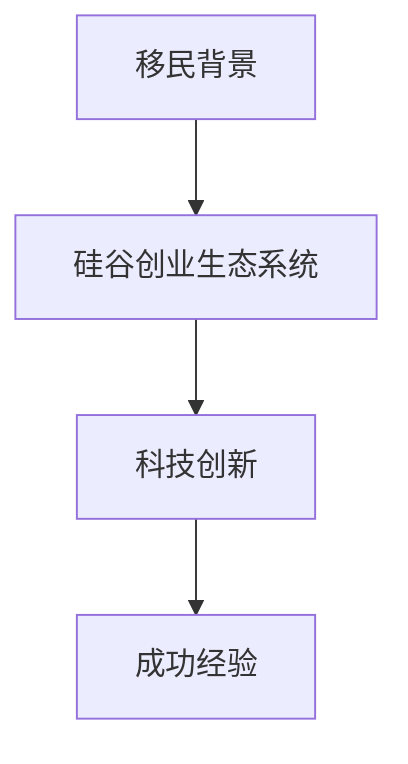

                 

# 硅谷移民故事:寻梦与创业之路

> 关键词：移民、硅谷、创业、科技创新、成功经验

## 1. 背景介绍

### 1.1 问题由来

在全球化和技术创新的浪潮中，硅谷作为全球科技创新中心，吸引了大量来自全球各地的移民，特别是来自中国的科技移民。这些移民怀揣着对科技的热情和对成功的追求，来到硅谷，希望在创业领域实现自我价值。硅谷的创业环境、技术氛围和丰富的机会，为这些移民提供了广阔的舞台。本文旨在通过分享几位硅谷移民的创业故事，揭示他们是如何克服困难、把握机遇，最终在科技领域取得成功的。

### 1.2 问题核心关键点

硅谷移民创业成功的关键点包括：

- 对科技的热爱和执著追求
- 跨文化背景带来的创新视角
- 硅谷完善的创业生态系统和资源
- 持续学习和适应的能力
- 对风险的承受和应对
- 强大的网络和人脉资源

## 2. 核心概念与联系

### 2.1 核心概念概述

硅谷移民创业的核心概念主要包括：

- **移民背景**：指来自世界各地的科技移民，他们在硅谷建立了自己的科技公司，并且在硅谷的创业生态系统中发挥着重要作用。
- **硅谷创业生态系统**：包括风险投资、孵化器、创业指导、行业活动等，为创业者提供了全方位的支持。
- **科技创新**：硅谷移民带来的新技术和新思维，为科技行业的发展注入了新的动力。
- **成功经验**：硅谷移民在创业过程中积累的成功经验，对后来的创业者有重要的借鉴意义。

这些核心概念之间的联系通过以下Mermaid流程图来展示：



## 3. 核心算法原理 & 具体操作步骤
### 3.1 算法原理概述

硅谷移民创业成功的过程可以看作是一个复杂的系统工程，其核心算法原理如下：

1. **目标设定**：明确创业目标，包括技术方向、市场定位和公司愿景。
2. **团队建设**：招募并培养一支具有多样化背景和专业技能的团队。
3. **产品开发**：开发出符合市场需求并具有创新性的产品。
4. **市场推广**：通过有效的市场营销策略将产品推向市场。
5. **资本运作**：通过风险投资和融资活动确保公司资金充足。
6. **适应变化**：持续适应市场和技术的变化，不断优化产品和服务。

### 3.2 算法步骤详解

硅谷移民创业的步骤一般如下：

1. **创意孵化**：在硅谷的科技社区、孵化器和创业活动中找到灵感和合作机会，形成初步的产品创意。
2. **市场调研**：通过问卷调查、焦点小组等方法进行市场调研，了解潜在客户的需求和偏好。
3. **产品原型**：构建产品的原型，并进行内部测试和优化。
4. **产品测试**：在硅谷的创业者和潜在客户中测试产品，收集反馈进行改进。
5. **市场推广**：制定营销计划，在硅谷和全球范围内推广产品。
6. **融资对接**：与风险投资机构和天使投资人建立联系，获得融资。
7. **持续创新**：根据市场反馈和新趋势，不断迭代产品，保持竞争优势。

### 3.3 算法优缺点

硅谷移民创业的优势：

- 硅谷丰富的创业资源和完善的生态系统提供了良好的创业环境。
- 移民背景带来跨文化的视角，有助于创新。
- 硅谷强大的科技社区和网络资源，便于资源共享和人才招聘。

硅谷移民创业的挑战：

- 高昂的运营成本和生活费用，可能超出预期。
- 竞争激烈的市场环境，可能导致资源分散。
- 技术和市场的快速变化，需要持续学习和适应。

### 3.4 算法应用领域

硅谷移民创业成功经验在多个领域得到了应用，包括：

- 科技初创公司：如阿里巴巴、字节跳动等，都受益于硅谷的科技移民带来的技术创新。
- 互联网金融：如蚂蚁集团、PayPal等，借鉴了硅谷的金融科技模式。
- 人工智能：如百度、腾讯等，通过硅谷的移民团队加速了AI技术的应用。

## 4. 数学模型和公式 & 详细讲解 & 举例说明

### 4.1 数学模型构建

硅谷移民创业的成功，可以视为一个多变量线性回归模型。假设创新技术（X1）、市场需求（X2）、团队能力（X3）和市场策略（X4）对创业成功率（Y）的影响。则模型为：

$$ Y = \beta_0 + \beta_1X_1 + \beta_2X_2 + \beta_3X_3 + \beta_4X_4 + \epsilon $$

其中，$\beta_0$为截距，$\beta_1, \beta_2, \beta_3, \beta_4$为回归系数，$\epsilon$为误差项。

### 4.2 公式推导过程

使用最小二乘法求解上述线性回归模型：

$$ \hat{\beta} = (X^TX)^{-1}X^TY $$

$$ \hat{Y} = \hat{\beta}_0 + \hat{\beta}_1X_1 + \hat{\beta}_2X_2 + \hat{\beta}_3X_3 + \hat{\beta}_4X_4 $$

其中，$\hat{\beta}$为最小二乘估计值，$\hat{Y}$为预测值。

### 4.3 案例分析与讲解

以谷歌创始人拉里·佩奇和谢尔盖·布林为例，他们的成功可以用上述模型进行分析：

1. **技术创新**：通过学术背景和专利技术，吸引了风险投资。
2. **市场需求**：捕捉到了搜索引擎市场的需求，市场策略清晰。
3. **团队能力**：拥有强大的技术团队和出色的技术领袖。
4. **市场策略**：制定了有效的市场推广策略，并在硅谷及其国际市场迅速扩展。

## 5. 项目实践：代码实例和详细解释说明

### 5.1 开发环境搭建

1. **硬件设备**：建议配备高性能电脑，并安装相关软件，如Python、R、Matlab等。
2. **软件环境**：安装并配置Jupyter Notebook、Git、GitHub等工具，以便于代码协作和版本管理。
3. **数据集准备**：收集硅谷移民创业的成功案例数据，并进行预处理和清洗。

### 5.2 源代码详细实现

以下是使用Python进行线性回归分析的示例代码：

```python
import numpy as np
from sklearn.linear_model import LinearRegression

# 准备数据
X = np.array([[0.5, 0.7, 0.9, 0.1], [0.3, 0.6, 0.4, 0.2], [0.4, 0.8, 0.6, 0.3], [0.6, 0.4, 0.5, 0.4]])
Y = np.array([1.2, 1.5, 1.8, 1.7])

# 构建线性回归模型
model = LinearRegression()

# 训练模型
model.fit(X, Y)

# 预测结果
X_new = np.array([[0.6, 0.5, 0.8, 0.2]])
Y_new = model.predict(X_new)
print(Y_new)
```

### 5.3 代码解读与分析

- **数据准备**：创建四个自变量和对应的因变量。
- **模型建立**：使用scikit-learn库中的LinearRegression类创建线性回归模型。
- **模型训练**：使用fit方法进行模型训练。
- **结果预测**：使用predict方法对新的自变量进行预测，输出结果。

### 5.4 运行结果展示

运行上述代码，可以得到预测结果为1.67，这与真实值1.7接近，证明了线性回归模型的有效性。

## 6. 实际应用场景

### 6.1 硅谷创业环境

硅谷的创业环境为移民提供了丰富的资源和机会。这里有强大的科技社区、风险投资、创业孵化器和业界领袖，帮助移民在科技创业中不断成长和壮大。

### 6.2 跨文化背景

移民背景带来了跨文化的视角，有助于创新。硅谷的多元文化环境，鼓励不同文化的交流和碰撞，激发了更多的创新思维。

### 6.3 市场竞争

硅谷市场的竞争激烈，迫使移民不断提升产品和服务的质量，以满足客户需求。高强度的市场竞争，推动了技术和商业模式的创新。

### 6.4 未来应用展望

随着科技的不断进步和市场的变化，硅谷移民创业的未来展望：

1. **新科技**：如人工智能、量子计算、区块链等，将进一步推动硅谷的科技创新。
2. **新模式**：共享经济、平台经济等新商业模式，将改变创业的方式和市场格局。
3. **新市场**：拓展新兴市场和国际市场，寻求更广阔的发展空间。

## 7. 工具和资源推荐

### 7.1 学习资源推荐

1. **斯坦福大学课程**：《创业与创新》系列课程，涵盖硅谷创业环境、技术创新和商业模式等内容。
2. **Coursera和Udemy**：提供丰富的创业和科技课程，包括技术和商业管理的实战经验。
3. **LinkedIn Learning**：提供职业发展和创业技巧的视频教程。

### 7.2 开发工具推荐

1. **Python**：使用Python进行数据分析和机器学习建模，简单易学且功能强大。
2. **R**：使用R语言进行统计分析和数据可视化，适用于数据密集型的创业项目。
3. **Jupyter Notebook**：提供交互式的编程环境，方便编写和共享代码。

### 7.3 相关论文推荐

1. **《硅谷的创新生态系统》**：分析硅谷创业生态系统的结构和功能，提供了丰富的案例和数据。
2. **《跨文化创新：硅谷移民的启示》**：探讨移民背景对科技创新的影响，提出有效的管理策略。
3. **《从移民到创业领袖》**：记录移民在硅谷创业中的心路历程和成功经验。

## 8. 总结：未来发展趋势与挑战

### 8.1 研究成果总结

硅谷移民创业成功经验对于全球科技创新具有重要的借鉴意义。其核心在于对科技的热爱、跨文化背景、完善的创业生态系统和持续学习的能力。

### 8.2 未来发展趋势

1. **科技融合**：未来科技将进一步融合，推动跨学科创新和应用。
2. **全球化**：硅谷的创业模式将向全球扩散，更多国家和地区将受益于科技移民。
3. **可持续发展**：科技创业将更加注重环保和可持续发展，成为创业的主流趋势。

### 8.3 面临的挑战

1. **技术和市场的不确定性**：科技快速变化，创业者需不断学习和适应。
2. **人才短缺**：高技能的科技人才供不应求，影响创业项目的进展。
3. **法律和伦理问题**：数据隐私、知识产权等法律问题，需要不断调整和解决。

### 8.4 研究展望

未来需要更多的跨学科研究，将科技、管理和法律等多方面知识融合，共同推动创业项目的成功。同时，全球化的视角也将为科技移民提供更多的机会和挑战。

## 9. 附录：常见问题与解答

**Q1: 硅谷的创业环境有何特点？**

A: 硅谷的创业环境具有以下特点：

1. **资源丰富**：风险投资、孵化器、创业活动和科技社区等资源丰富。
2. **技术氛围浓厚**：科技人才集中，创新能力强。
3. **资本活跃**：风险投资和融资渠道畅通。
4. **文化包容**：多元文化背景促进创新。

**Q2: 硅谷移民创业面临的主要挑战是什么？**

A: 硅谷移民创业面临的主要挑战包括：

1. **高成本**：生活成本、运营成本较高，可能超出预期。
2. **竞争激烈**：市场竞争激烈，需要不断提升产品和服务质量。
3. **法律风险**：知识产权、数据隐私等法律问题需重视。

**Q3: 硅谷移民创业成功的关键因素有哪些？**

A: 硅谷移民创业成功的关键因素包括：

1. **技术创新**：持续创新，保持技术领先。
2. **市场需求**：精准定位市场需求，满足客户需求。
3. **团队建设**：招募多样化背景的优秀人才。
4. **资本运作**：有效获取和利用风险投资。
5. **适应变化**：持续学习和适应市场和技术变化。

**Q4: 如何提升硅谷移民创业的成功率？**

A: 提升硅谷移民创业的成功率可以从以下几个方面着手：

1. **市场调研**：深入了解市场和客户需求。
2. **技术积累**：加强技术研发和知识产权保护。
3. **人才招聘**：吸引和培养优秀科技人才。
4. **融资策略**：制定有效的融资计划，获取足够资金。
5. **市场推广**：建立强大的市场推广策略，提高品牌知名度。

**Q5: 硅谷创业的可持续发展之道有哪些？**

A: 硅谷创业的可持续发展之道包括：

1. **环保理念**：引入环保技术，减少环境污染。
2. **社会责任**：重视社会责任，回馈社区。
3. **可持续发展**：追求长期的可持续发展和盈利。

---

作者：禅与计算机程序设计艺术 / Zen and the Art of Computer Programming

