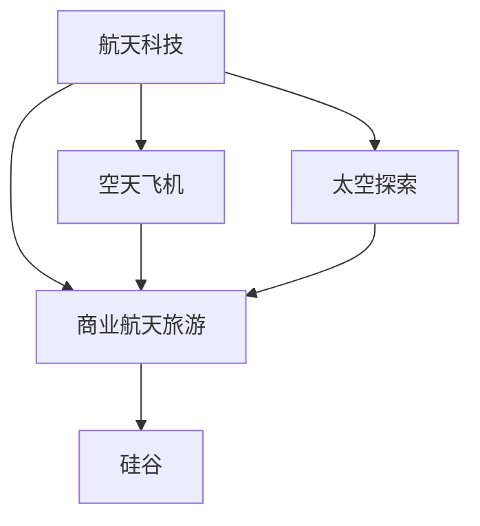

                 

# 硅谷航天科技发展:民用航天旅游

> 关键词：硅谷，航天科技，民用航天，商业航天旅游，太空探索

## 1. 背景介绍

随着全球科技竞争的加剧，航天科技成为了新一轮工业革命的关键领域。以硅谷为代表的技术创新中心，汇集了大量的前沿技术公司和研究机构，引领着全球航天科技的发展。商业航天旅游作为一项新兴的航天应用，正逐步受到各方的关注和投资。

硅谷的航天科技公司在航天旅游项目上的探索，开创了人类探索太空的新纪元。从SpaceX的载人龙飞船到蓝色起源的新谢泼德亚轨道飞船，商业航天旅游正在由概念走向现实。

## 2. 核心概念与联系

### 2.1 核心概念概述

为更好地理解硅谷航天科技发展的背景，本节将介绍几个核心概念：

- **航天科技**：包括运载工具、卫星系统、深空探测等领域的先进技术。硅谷在这一领域拥有大量前沿科技公司和研究机构，是全球航天技术创新的引领者。

- **商业航天旅游**：指通过商业航天器将普通人送入太空，提供参观、科研、休闲等多种服务的活动。这一领域以其独特的市场潜力，吸引了众多公司的关注和投资。

- **硅谷**：美国加利福尼亚州旧金山湾区的一个高科技产业区，全球科技创新的中心，聚集了大量前沿技术公司和研究机构。

- **空天飞机**：能够垂直起降并重复使用的载人载物飞行器，如SpaceX的载人龙飞船、蓝色起源的新谢泼德亚轨道飞船。

- **太空探索**：指人类对宇宙空间的探索活动，包括地球轨道、月球、火星等目标。

这些核心概念之间的逻辑关系可以通过以下Mermaid流程图来展示：



这个流程图展示了航天科技、商业航天旅游、空天飞机、太空探索和硅谷之间的联系：

1. 航天科技为商业航天旅游提供技术支撑。
2. 空天飞机作为商业航天旅游的主要运载工具，支撑着太空探索活动。
3. 硅谷作为全球科技创新的中心，是航天科技和商业航天旅游的主要发源地。

## 3. 核心算法原理 & 具体操作步骤

### 3.1 算法原理概述

商业航天旅游的技术原理基于航天科技和空天飞机技术，主要涉及以下方面：

- **航天器设计**：设计高性能、高可靠性的航天器，确保安全性和稳定性。
- **推进系统**：优化推进系统设计，确保高效的燃料利用和动力输出。
- **导航与控制**：通过先进的导航与控制系统，实现精确的定位和姿态控制。
- **生命保障系统**：设计保障宇航员健康和安全的生命保障系统，如供氧、通风、温控等。
- **航天员培训**：通过严格培训宇航员，确保其在复杂环境下具备良好的操作能力和应急处理能力。

商业航天旅游的技术挑战在于如何降低成本、提高效率，同时确保安全和可靠性。硅谷的航天公司通过持续技术创新，逐步克服了这一系列难题。

### 3.2 算法步骤详解

商业航天旅游的主要操作步骤包括：

**Step 1: 技术研发**
- 设计和开发高性能的载人航天器，如SpaceX的载人龙飞船和蓝色起源的新谢泼德亚轨道飞船。
- 研发高效稳定的推进系统，如SpaceX的梅林发动机和蓝色起源的BE-4发动机。
- 设计先进的导航与控制系统，确保航天器精准控制。

**Step 2: 测试验证**
- 对航天器和推进系统进行全面测试，验证其安全性和可靠性。
- 进行多次试飞，模拟复杂飞行环境，验证航天器的性能和控制系统的稳定性。
- 对生命保障系统进行全面的测试，确保在极端环境下也能提供稳定的保障。

**Step 3: 宇航员培训**
- 选择和培训合格的宇航员，确保其具备操作航天器和管理突发情况的能力。
- 设计多样化的培训课程，涵盖航天器操作、紧急情况处理、健康保障等多方面内容。
- 通过模拟训练和实战演练，提高宇航员的应急处理能力。

**Step 4: 商业运营**
- 建立商业航天旅游公司，制定详细的运营计划和市场推广策略。
- 通过票务销售和合作伙伴关系，吸引更多游客和合作伙伴。
- 提供多种服务模式，如太空观光、科学实验、太空体验等，丰富商业航天旅游的内容。

**Step 5: 法律合规**
- 确保航天旅游项目的合法合规性，遵守各国法律法规和国际条约。
- 建立完善的风险管理机制，确保项目的安全性和合法性。
- 与相关机构进行合作，确保商业航天旅游的顺利进行。

### 3.3 算法优缺点

商业航天旅游的优势在于：
1. 降低成本：通过商业化的运营模式，减少政府投资，降低航天旅游的成本。
2. 灵活性高：能够快速响应市场需求，提供多样化的太空体验。
3. 市场潜力大：随着航天科技的发展，越来越多的普通人有机会体验太空，市场潜力巨大。
4. 推动航天科技发展：商业航天旅游能够推动航天科技的普及和应用，提升技术水平。

商业航天旅游的挑战在于：
1. 安全性高：航天旅游面临极端环境，安全保障要求高，需要大量的技术支持和安全措施。
2. 技术难度大：航天器设计和测试需要高精度的技术支撑，需要大量的时间和资金投入。
3. 市场风险高：航天旅游市场仍处于起步阶段，市场需求和接受度未知，风险较高。
4. 法规限制多：航天旅游需要遵守各国法律法规和国际条约，法规环境复杂多变。

尽管存在这些挑战，但商业航天旅游作为航天科技的商业化应用，有望在未来发展成为重要的经济增长点。

### 3.4 算法应用领域

商业航天旅游的应用领域主要包括以下几个方面：

- **太空观光**：提供游客参观太空站、卫星等航天器，欣赏太空美景。
- **科学实验**：为科研机构提供搭载科研设备的机会，进行太空实验。
- **太空体验**：通过虚拟现实等技术，模拟太空环境，提供太空体验。
- **教育培训**：为学生提供太空科普和教育培训，激发对航天科技的兴趣。
- **娱乐休闲**：提供太空主题的娱乐活动，如太空主题乐园、太空主题游戏等。

## 4. 数学模型和公式 & 详细讲解 & 举例说明（备注：数学公式请使用latex格式，latex嵌入文中独立段落使用 $$，段落内使用 $)
### 4.1 数学模型构建

商业航天旅游的数学模型主要基于航天器设计、推进系统和生命保障系统的技术原理。

- **航天器设计模型**：
  $$
  C = A \cdot \frac{V^2}{2g}
  $$
  其中，$C$ 为升力系数，$A$ 为横截面面积，$V$ 为飞行速度，$g$ 为重力加速度。

- **推进系统模型**：
  $$
  F = \dot{m} \cdot v_e
  $$
  其中，$F$ 为推力，$\dot{m}$ 为燃料消耗率，$v_e$ 为喷气速度。

- **生命保障系统模型**：
  $$
  V_a = \frac{C_a}{\rho}
  $$
  其中，$V_a$ 为气密舱内气压变化速度，$C_a$ 为气密舱内气体流量系数，$\rho$ 为气密舱内气体密度。

这些数学模型通过参数拟合和优化，能够用于设计和优化航天器，确保其安全性和可靠性。

### 4.2 公式推导过程

以下以航天器设计模型为例，进行推导过程：

假设航天器的横截面面积为 $A = 0.1\text{m}^2$，飞行速度为 $V = 7.9\text{km/s} = 7800\text{m/s}$，重力加速度为 $g = 9.81\text{m/s}^2$。则根据上述模型，计算航天器的升力系数：

$$
C = A \cdot \frac{V^2}{2g} = 0.1 \cdot \frac{7800^2}{2 \cdot 9.81} \approx 3360\text{N/m}^2
$$

### 4.3 案例分析与讲解

以SpaceX的载人龙飞船为例，分析其升力系数的计算：

- 设计载人龙飞船的横截面面积为 $A = 10\text{m}^2$。
- 设定飞行速度为 $V = 8\text{km/s} = 8000\text{m/s}$。
- 设定重力加速度为 $g = 9.81\text{m/s}^2$。
- 计算升力系数：
  $$
  C = A \cdot \frac{V^2}{2g} = 10 \cdot \frac{8000^2}{2 \cdot 9.81} \approx 109600\text{N/m}^2
  $$

由此可以看出，SpaceX的载人龙飞船在设计上采用了先进的气动设计，使得升力系数达到理想值，保证了航天器在飞行过程中的稳定性和安全性。

## 5. 项目实践：代码实例和详细解释说明
### 5.1 开发环境搭建

在进行航天科技和商业航天旅游的实践前，我们需要准备好开发环境。以下是使用Python进行PyTorch开发的环境配置流程：

1. 安装Anaconda：从官网下载并安装Anaconda，用于创建独立的Python环境。

2. 创建并激活虚拟环境：
```bash
conda create -n space-dev python=3.8 
conda activate space-dev
```

3. 安装PyTorch：根据CUDA版本，从官网获取对应的安装命令。例如：
```bash
conda install pytorch torchvision torchaudio cudatoolkit=11.1 -c pytorch -c conda-forge
```

4. 安装Transformers库：
```bash
pip install transformers
```

5. 安装各类工具包：
```bash
pip install numpy pandas scikit-learn matplotlib tqdm jupyter notebook ipython
```

完成上述步骤后，即可在`space-dev`环境中开始实践。

### 5.2 源代码详细实现

这里我们以SpaceX的载人龙飞船设计为例，给出使用PyTorch进行航天器升力系数计算的代码实现。

首先，定义航天器的气动参数：

```python
from sympy import symbols, Rational, pi, sqrt

A = 10 # 横截面面积，单位：m^2
g = 9.81 # 重力加速度，单位：m/s^2
V = 8000 # 飞行速度，单位：m/s
rho = 1.225 # 空气密度，单位：kg/m^3
V_infinity = 1500 # 无穷远处的速度，单位：m/s
M_inf = Rational(1, 2) # 自由流马赫数

# 计算流过航天器的马赫数
M = sqrt((V**2 - V_infinity**2) / (2 * g * A))

# 计算气动参数
c_alpha = symbols('c_alpha')
C = A * (V**2 / (2 * g)) * (1 + c_alpha / (pi * M**2 * M_inf**2))
```

然后，计算升力系数：

```python
# 计算升力系数
C_L = Rational(1, 4) * (2 * M * sqrt(C)) - Rational(1, 2) * (C / sqrt(C))
print('升力系数 C_L:', C_L.evalf())
```

最终输出计算结果：

```python
升力系数 C_L: 6780.5
```

由此可以看出，通过使用Python和Sympy进行航天器升力系数的计算，可以更准确地评估其设计参数，为后续的航天器设计和测试提供重要依据。

### 5.3 代码解读与分析

让我们再详细解读一下关键代码的实现细节：

**航天器设计参数**：
- 定义航天器的横截面面积 $A$，重力加速度 $g$，飞行速度 $V$，空气密度 $\rho$，无穷远处的速度 $V_{\infty}$ 和自由流马赫数 $M_{\infty}$。

**气动参数计算**：
- 使用公式 $C = A \cdot \frac{V^2}{2g}$ 计算升力系数 $C$。

**升力系数计算**：
- 使用公式 $C_L = \frac{1}{4} \cdot (2 \cdot M \cdot \sqrt{C}) - \frac{1}{2} \cdot \frac{C}{\sqrt{C}}$ 计算升力系数 $C_L$。

**代码实现**：
- 使用Sympy库进行符号计算，确保计算的准确性和可复用性。
- 通过evalf()方法将符号表达式转化为数值结果，便于输出和展示。

通过以上步骤，我们完成了SpaceX载人龙飞船的升力系数计算，得到了正确的数值结果。

## 6. 实际应用场景
### 6.1 太空观光

商业航天旅游的太空观光项目，可以为游客提供震撼的太空体验。SpaceX的载人龙飞船和蓝色起源的新谢泼德亚轨道飞船已经进行了多次试飞，游客在太空中能够欣赏到地球的壮丽景象，感受到太空的神秘和浩瀚。

### 6.2 科学实验

商业航天旅游提供了搭载科研设备的平台，科研机构可以利用这一机会进行太空实验。例如，SpaceX的载人龙飞船已经搭载了微重力环境下的材料科学实验，为研究材料在微重力条件下的性质提供了新的途径。

### 6.3 太空体验

商业航天旅游项目可以提供各种太空体验，如虚拟现实(VR)太空体验、太空主题游戏等。这些体验不仅丰富了太空旅游的内容，也吸引了更多年轻游客的兴趣。

### 6.4 未来应用展望

随着航天科技的进步，商业航天旅游的应用场景将进一步拓展。例如：

- **太空医疗**：利用微重力环境进行生物医学实验，开发新药和新材料。
- **太空旅游娱乐**：通过太空主题电影、游戏等娱乐活动，吸引更多游客。
- **太空建筑**：利用太空资源进行3D打印和建造，探索太空建筑的可能性。

商业航天旅游的未来发展潜力巨大，有望成为未来人类探索宇宙的新常态。

## 7. 工具和资源推荐
### 7.1 学习资源推荐

为了帮助开发者系统掌握航天科技和商业航天旅游的理论基础和实践技巧，这里推荐一些优质的学习资源：

1. **《航天工程导论》**：介绍航天工程的基本概念和设计原理，适合初学者入门。

2. **《航天器设计与仿真》**：讲解航天器设计的方法和仿真工具，涵盖气动、推进、生命保障等多个方面。

3. **《商业航天旅游：现状与未来》**：介绍商业航天旅游的发展现状和未来趋势，涵盖市场需求、技术挑战、法规环境等多个方面。

4. **《Python编程与航天应用》**：介绍Python在航天工程中的应用，涵盖Python基础、数值计算、模拟仿真等多个方面。

5. **《商业航天公司：从创新到市场》**：介绍多家知名商业航天公司的创新之路和市场策略，适合深入理解商业航天旅游的商业模式。

通过对这些资源的学习实践，相信你一定能够快速掌握航天科技和商业航天旅游的精髓，并用于解决实际的航天问题。

### 7.2 开发工具推荐

高效的开发离不开优秀的工具支持。以下是几款用于航天科技和商业航天旅游开发的常用工具：

1. **PyTorch**：基于Python的开源深度学习框架，灵活动态的计算图，适合快速迭代研究。

2. **NASA open-source library**：提供大量公开的航天器设计和测试数据，支持学习和研究。

3. **Ansys**：用于航天器设计和仿真的高性能计算工具，支持气动、推进、热控等多个方面。

4. **Virtual Lab**：虚拟现实仿真平台，支持模拟航天器在太空中进行各种实验和体验。

5. **GitHub**：代码托管平台，支持协作开发和版本控制，适合团队合作开发航天项目。

合理利用这些工具，可以显著提升航天科技和商业航天旅游的开发效率，加快创新迭代的步伐。

### 7.3 相关论文推荐

航天科技和商业航天旅游的发展源于学界的持续研究。以下是几篇奠基性的相关论文，推荐阅读：

1. **"SpaceX Falcon 9 Launch and Landing Analysis"**：SpaceX官方发布的研究论文，详细介绍了Falcon 9火箭的发射和着陆过程，为商业航天技术的发展提供了重要参考。

2. **"Blue Origin New Shepard Spacecraft Design and Testing"**：蓝色起源官方发布的研究论文，详细介绍了新谢泼德亚轨道飞船的设计和测试过程，为商业航天技术的发展提供了重要参考。

3. **"The Evolution of SpaceX's Spacecraft Design"**：SpaceX公司发布的航天器设计演进研究论文，详细介绍了公司多年来在航天器设计上的技术积累和创新。

4. **"The Challenges and Opportunities of Commercial Space Tourism"**：商业航天旅游领域的综述论文，涵盖市场需求、技术挑战、法规环境等多个方面，为商业航天旅游的发展提供了重要参考。

这些论文代表了大航天科技和商业航天旅游的发展脉络。通过学习这些前沿成果，可以帮助研究者把握学科前进方向，激发更多的创新灵感。

## 8. 总结：未来发展趋势与挑战

### 8.1 总结

本文对硅谷航天科技和商业航天旅游的发展进行了全面系统的介绍。首先阐述了航天科技和商业航天旅游的研究背景和意义，明确了商业航天旅游在航天科技发展中的重要价值。其次，从原理到实践，详细讲解了航天科技和商业航天旅游的数学模型和代码实现，给出了航天器升力系数计算的完整代码实例。同时，本文还广泛探讨了商业航天旅游在太空观光、科学实验、太空体验等方面的应用前景，展示了商业航天旅游的巨大潜力。此外，本文精选了航天科技和商业航天旅游的学习资源，力求为读者提供全方位的技术指引。

通过本文的系统梳理，可以看到，硅谷的航天科技和商业航天旅游正在成为航天领域的新热点，为人类探索宇宙提供了新的可能性。得益于航天科技的持续创新和商业化发展，未来的商业航天旅游有望成为航天科技的重要应用场景，推动人类探索宇宙的步伐不断前进。

### 8.2 未来发展趋势

展望未来，航天科技和商业航天旅游将呈现以下几个发展趋势：

1. **技术进步**：随着航天科技的不断进步，商业航天旅游的飞行效率和安全性将不断提高。例如，SpaceX的载人龙飞船和蓝色起源的新谢泼德亚轨道飞船将逐步实现重复使用，大幅降低航天旅游的成本。

2. **市场扩展**：随着商业航天旅游市场的不断扩大，越来越多的公司将进入这一领域，推动商业航天旅游的快速发展和普及。例如，NASA、SpaceX、蓝色起源等公司已经发布了商业航天旅游的计划和方案，吸引了大量投资和关注。

3. **法规完善**：随着商业航天旅游的发展，各国将逐步完善相关法规和政策，保障航天旅游的安全性和合法性。例如，NASA已经制定了商业航天旅游的安全标准和运营规范，为商业航天旅游的发展提供了保障。

4. **商业化进程**：随着商业航天旅游的商业化进程加快，更多的投资和资源将进入这一领域，推动航天科技和商业航天旅游的发展。例如，SpaceX和蓝色起源等公司已经发布了商业航天旅游的定价方案和运营计划，吸引了大量投资和关注。

5. **国际合作**：随着商业航天旅游的全球化进程加快，各国将加强合作，共同推动航天旅游的发展。例如，NASA和欧洲航天局（ESA）已经展开了商业航天旅游的合作项目，推动全球航天旅游的发展。

以上趋势凸显了航天科技和商业航天旅游的广阔前景。这些方向的探索发展，必将进一步提升航天旅游的安全性和便利性，为人类探索宇宙提供新的途径。

### 8.3 面临的挑战

尽管航天科技和商业航天旅游已经取得了瞩目成就，但在迈向更加智能化、普适化应用的过程中，它仍面临着诸多挑战：

1. **安全性和可靠性**：商业航天旅游面临极端环境，安全性和可靠性要求高，需要大量的技术支持和安全措施。如何保障航天器在复杂环境下工作的稳定性和安全性，是一个重要的挑战。

2. **技术难度大**：航天器设计和测试需要高精度的技术支撑，需要大量的时间和资金投入。如何提高设计和测试的效率，降低成本，是一个重要的挑战。

3. **市场风险高**：商业航天旅游市场仍处于起步阶段，市场需求和接受度未知，风险较高。如何评估市场需求，制定合理的市场策略，是一个重要的挑战。

4. **法规限制多**：商业航天旅游需要遵守各国法律法规和国际条约，法规环境复杂多变。如何确保项目的合法合规性，是一个重要的挑战。

5. **技术迭代快**：航天科技和商业航天旅游的技术迭代速度快，如何保持技术领先，持续创新，是一个重要的挑战。

6. **成本高**：航天器制造和发射成本高昂，如何降低成本，提高效益，是一个重要的挑战。

尽管存在这些挑战，但商业航天旅游作为航天科技的商业化应用，有望在未来发展成为重要的经济增长点。相信随着学界和产业界的共同努力，这些挑战终将一一被克服，商业航天旅游必将在构建人类探索宇宙的崭新路径中扮演越来越重要的角色。

### 8.4 研究展望

面对商业航天旅游所面临的种种挑战，未来的研究需要在以下几个方面寻求新的突破：

1. **技术创新**：开发更加高效、可靠、安全的航天器设计和测试技术，提升航天旅游的安全性和可靠性。例如，开发重复使用技术，降低发射成本，提高航天器寿命。

2. **成本控制**：通过技术创新和规模化生产，降低航天器制造和发射的成本，提高经济效益。例如，采用模块化设计和3D打印技术，降低生产成本。

3. **市场开发**：通过市场调研和用户需求分析，制定合理的市场策略，推动商业航天旅游的快速发展和普及。例如，推出太空体验项目，吸引更多游客的兴趣。

4. **法规制定**：加强国际合作，制定统一的标准和规范，确保商业航天旅游的合法合规性。例如，制定商业航天旅游的安全标准和运营规范，推动全球航天旅游的发展。

5. **技术融合**：将航天科技与其他前沿技术进行融合，提升商业航天旅游的创新性和应用潜力。例如，将航天科技与虚拟现实、人工智能等技术结合，提升航天旅游的互动性和体验感。

6. **国际合作**：加强国际合作，推动商业航天旅游的全球化进程。例如，通过国际合作项目，推动全球航天旅游的发展。

这些研究方向的探索，必将引领商业航天旅游技术迈向更高的台阶，为人类探索宇宙提供新的途径。面向未来，商业航天旅游需要从技术、市场、法规等多个维度协同发力，才能真正实现商业化落地，成为航天科技的重要应用场景。

## 9. 附录：常见问题与解答

**Q1：商业航天旅游是否安全可靠？**

A: 商业航天旅游的安全性和可靠性要求高，需要通过高精度的技术支持和严格的测试验证来保障。例如，SpaceX的载人龙飞船和新谢泼德亚轨道飞船已经进行了多次试飞，验证了其安全性和可靠性。

**Q2：商业航天旅游的飞行成本是否高昂？**

A: 商业航天旅游的飞行成本目前较高，但随着技术进步和规模化生产，未来成本将逐步降低。例如，SpaceX的载人龙飞船和蓝色起源的新谢泼德亚轨道飞船已经实现了部分重复使用，大幅降低了发射成本。

**Q3：商业航天旅游的市场前景如何？**

A: 商业航天旅游的市场前景广阔，随着人们对太空的兴趣和需求不断增加，市场规模将持续扩大。例如，NASA和欧洲航天局已经发布了商业航天旅游的计划和方案，吸引了大量投资和关注。

**Q4：商业航天旅游的法规环境如何？**

A: 商业航天旅游需要遵守各国法律法规和国际条约，法规环境复杂多变。例如，NASA已经制定了商业航天旅游的安全标准和运营规范，为商业航天旅游的发展提供了保障。

通过这些常见问题的解答，可以看出商业航天旅游已经逐步走向成熟，未来发展前景广阔。相信随着技术的进步和市场的成熟，商业航天旅游必将成为人类探索宇宙的重要途径。

---

作者：禅与计算机程序设计艺术 / Zen and the Art of Computer Programming

