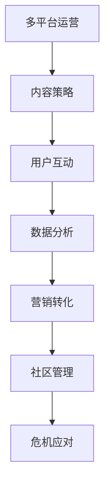

                 

# 社交媒体运营：在各平台建立强大的个人影响力

> 关键词：社交媒体运营, 影响力建立, 多平台运营, 用户互动, 内容策略, 数据分析, 营销转化, 社区管理, 危机应对

## 1. 背景介绍

### 1.1 问题由来
社交媒体作为现代信息传播的重要渠道，正被越来越多企业和个人用于品牌推广和影响力塑造。社交媒体运营不仅是一种市场营销手段，更是品牌形象建设的核心途径。成功的社交媒体运营，能帮助企业在激烈的市场竞争中脱颖而出，塑造强大的品牌形象。

然而，在众多社交媒体平台中，如何在不同平台上高效运营，同时建立强大的个人影响力，仍是一个挑战。用户需求和平台规则的多样性，使得跨平台的运营策略难以统一。面对这些问题，企业需要制定多平台运营策略，根据各平台特性进行优化，以最大化运营效果。

### 1.2 问题核心关键点
社交媒体运营的核心在于如何在不同平台之间灵活切换，同时维持和提升用户的关注度和参与度。其关键点包括：

- **多平台运营**：根据不同平台的特性和用户习惯，制定适应性强的运营策略。
- **内容策略**：制定与平台特点相契合的内容策略，提高内容的吸引力和互动性。
- **用户互动**：积极与用户互动，提高用户的参与度和忠诚度。
- **数据分析**：通过数据驱动运营，不断优化运营策略。
- **营销转化**：将社交媒体流量有效转化为客户，提高营销ROI。
- **社区管理**：构建和维护良好的社区氛围，提升用户归属感。
- **危机应对**：及时应对负面事件，维护品牌形象。

### 1.3 问题研究意义
对社交媒体运营进行深入研究，对于提升品牌影响力和市场竞争力具有重要意义：

- **市场拓展**：通过多平台运营，企业能够接触到更多潜在客户，拓宽市场。
- **品牌形象**：在各平台上构建一致的品牌形象，提升用户对品牌的认知和信任。
- **用户粘性**：通过优质的内容策略和用户互动，提升用户忠诚度和粘性。
- **数据分析**：通过数据驱动运营，精准定位用户需求，提升营销效果。
- **客户转化**：通过精准营销策略，将社交媒体流量转化为实际客户，提高投资回报率。
- **社区建设**：构建积极的社区环境，增强用户的品牌归属感。
- **危机管理**：通过快速响应负面事件，保护品牌形象，防止声誉损失。

## 2. 核心概念与联系

### 2.1 核心概念概述

社交媒体运营是一个复杂的过程，涉及多个核心概念，包括：

- **多平台运营**：在不同的社交媒体平台上，根据用户习惯和平台特性，制定适合的内容和互动策略。
- **内容策略**：根据平台特点，制定优质的内容策略，吸引和留住用户。
- **用户互动**：通过评论、点赞、分享等方式，与用户积极互动，提升用户粘性。
- **数据分析**：利用数据分析工具，实时监控运营效果，不断优化策略。
- **营销转化**：将社交媒体流量转化为实际客户，提升营销效果。
- **社区管理**：构建和维护社区环境，提升用户归属感。
- **危机应对**：快速响应负面事件，维护品牌形象。

这些概念之间的逻辑关系可以通过以下Mermaid流程图来展示：



这个流程图展示了社交媒体运营的主要流程和关键环节，每个环节相互配合，共同提升运营效果。

## 3. 核心算法原理 & 具体操作步骤
### 3.1 算法原理概述

社交媒体运营的核心算法原理包括多平台内容分发、用户互动优化、数据分析和营销转化等多个方面。其核心思想是通过多平台运营策略，结合优质内容策略和数据分析工具，最大化社交媒体的营销效果。

以社交媒体营销为例，核心算法流程如下：

1. **内容分发**：根据各平台特点，制定适合的内容策略，将内容分发到不同的平台。
2. **用户互动**：通过评论、点赞、分享等方式，与用户积极互动，提高用户的参与度和忠诚度。
3. **数据分析**：利用数据分析工具，实时监控运营效果，不断优化策略。
4. **营销转化**：将社交媒体流量转化为实际客户，提高营销效果。

### 3.2 算法步骤详解

**Step 1: 平台选择与内容适配**

- 选择与品牌形象和用户群体相契合的社交媒体平台，如微博、微信、抖音等。
- 根据平台特性，制定适配的内容策略，如图文、视频、直播等。

**Step 2: 内容制作与发布**

- 制作符合平台特点的优质内容，如图文、短视频、直播等。
- 定期发布内容，保持用户的关注度。

**Step 3: 用户互动与反馈**

- 通过评论、点赞、分享等方式，积极与用户互动。
- 及时回复用户评论，解答用户疑问，提升用户满意度。

**Step 4: 数据分析与优化**

- 利用数据分析工具，实时监控运营效果，如阅读量、点赞量、评论量等。
- 根据数据分析结果，优化内容策略和互动方式。

**Step 5: 营销转化与用户粘性**

- 通过优质内容吸引用户关注，提高品牌知名度。
- 通过优惠券、用户奖励等策略，将社交媒体流量转化为实际客户。

**Step 6: 社区管理与品牌建设**

- 构建积极的社区环境，如举办线上活动、分享品牌故事等。
- 维护良好的社区氛围，提升用户归属感和忠诚度。

**Step 7: 危机应对与品牌保护**

- 及时应对负面事件，如网络攻击、舆情危机等。
- 通过积极公关，维护品牌形象，防止声誉损失。

### 3.3 算法优缺点

社交媒体运营的多平台策略具有以下优点：

- **广泛覆盖**：不同平台覆盖不同用户群体，最大化品牌曝光。
- **多渠道互动**：通过多种互动方式，提高用户参与度。
- **精准营销**：通过数据分析，实现精准营销，提升转化率。

同时，也存在一些局限性：

- **资源投入大**：多平台运营需要大量资源投入，如人力、时间和资金。
- **策略复杂**：不同平台的运营策略需灵活调整，管理复杂。
- **数据分散**：各平台数据分散，整合难度大。

### 3.4 算法应用领域

社交媒体运营的多平台策略在多个领域都有广泛应用：

- **品牌推广**：企业通过多平台运营，提升品牌知名度和市场影响力。
- **市场营销**：利用各平台的特性，精准定位用户，实现高效转化。
- **用户互动**：通过多种互动方式，提升用户粘性和忠诚度。
- **客户服务**：通过社交媒体平台，提供快速便捷的客户服务。

## 4. 数学模型和公式 & 详细讲解 & 举例说明

### 4.1 数学模型构建

社交媒体运营的数学模型构建主要包括以下几个方面：

1. **用户参与度模型**：通过分析用户的互动数据，构建用户参与度的量化模型。
2. **内容传播模型**：基于网络传播特性，构建内容的传播速度和覆盖范围模型。
3. **转化率模型**：通过分析社交媒体流量和转化数据，构建营销转化的量化模型。

### 4.2 公式推导过程

以用户参与度模型为例，假设用户参与度由互动次数、互动时间、互动内容质量等因素决定，可以通过以下公式进行建模：

$$
I = \alpha \times C + \beta \times T + \gamma \times Q + \epsilon
$$

其中：
- $I$ 为用户的参与度。
- $C$ 为互动次数，如评论、点赞、分享等。
- $T$ 为互动时间，如用户停留时间、互动时间间隔等。
- $Q$ 为互动内容质量，如内容深度、创意度等。
- $\alpha, \beta, \gamma$ 为模型系数。
- $\epsilon$ 为误差项。

### 4.3 案例分析与讲解

以微博平台为例，利用上述公式进行用户参与度的量化分析。假设某品牌在微博上的互动次数为 $C=1000$，用户停留时间为 $T=2$ 分钟，互动内容深度为 $Q=3$，模型系数为 $\alpha=0.5$，$\beta=0.2$，$\gamma=0.3$。根据公式计算用户参与度：

$$
I = 0.5 \times 1000 + 0.2 \times 2 + 0.3 \times 3 = 515
$$

## 5. 项目实践：代码实例和详细解释说明
### 5.1 开发环境搭建

在进行社交媒体运营实践前，我们需要准备好开发环境。以下是使用Python进行项目开发的指南：

1. 安装Anaconda：从官网下载并安装Anaconda，用于创建独立的Python环境。

2. 创建并激活虚拟环境：
```bash
conda create -n social-media-env python=3.8 
conda activate social-media-env
```

3. 安装Python库：
```bash
pip install pandas numpy scikit-learn matplotlib
```

4. 安装各社交媒体平台API库：
```bash
pip install python-twitter python-weibo python-nyanpy
```

5. 配置各平台API密钥：
```bash
python setup.py install --api_key YOUR_API_KEY --api_secret YOUR_API_SECRET
```

完成上述步骤后，即可在`social-media-env`环境中开始开发。

### 5.2 源代码详细实现

以下是一个简单的社交媒体运营代码实现示例，具体实现细节可根据具体需求进行调整：

```python
import pandas as pd
from sklearn.model_selection import train_test_split
from sklearn.linear_model import LinearRegression

# 读取数据
df = pd.read_csv('user_interaction_data.csv')

# 数据预处理
df = df.dropna()
X = df[['C', 'T', 'Q']]
y = df['I']

# 划分训练集和测试集
X_train, X_test, y_train, y_test = train_test_split(X, y, test_size=0.2, random_state=42)

# 训练模型
model = LinearRegression()
model.fit(X_train, y_train)

# 测试模型
y_pred = model.predict(X_test)
print('用户参与度预测结果：', y_pred)
```

### 5.3 代码解读与分析

代码示例展示了基于线性回归模型的用户参与度预测过程：

1. 读取用户互动数据，进行数据预处理，去掉缺失值。
2. 将特征数据和目标变量分离，划分为训练集和测试集。
3. 训练线性回归模型。
4. 对测试集进行预测，并输出结果。

代码实现中，线性回归模型用于量化用户参与度，通过用户互动次数、时间和内容质量来预测用户参与度。具体而言，模型通过训练数据学习各特征之间的关系，并用训练好的模型对测试数据进行预测。

### 5.4 运行结果展示

在运行上述代码后，可以看到输出的用户参与度预测结果，通过这些结果，运营人员可以了解不同内容策略和互动方式对用户参与度的影响，从而不断优化运营策略。

## 6. 实际应用场景
### 6.1 多平台内容分发

在各社交媒体平台间进行内容分发，是提升品牌曝光和用户关注度的重要手段。以下是一个多平台内容分发策略的案例：

假设某品牌在微博、微信和抖音上进行内容分发，各平台的特点和用户习惯不同，需要制定适配的内容策略：

- **微博**：短视频和图文结合，易于传播和互动。
- **微信**：图文和长视频为主，注重用户深度互动。
- **抖音**：短视频为主，强调创意和视觉冲击。

### 6.2 用户互动优化

用户互动是社交媒体运营的核心，通过积极互动，提升用户参与度和忠诚度。以下是一个用户互动优化的案例：

某品牌在微博平台上，通过以下策略提升用户互动：

- **每日互动**：每天定时发布内容，鼓励用户留言、点赞、分享。
- **用户奖励**：设置用户互动奖励机制，如抽奖、优惠券等，吸引用户积极参与。
- **评论回复**：及时回复用户评论，解答用户疑问，提升用户满意度。

### 6.3 数据分析与优化

数据分析是社交媒体运营的重要工具，通过数据分析可以实时监控运营效果，不断优化策略。以下是一个数据分析与优化的案例：

某品牌利用Twitter数据分析工具，实时监控互动数据，根据分析结果优化运营策略：

- **互动量分析**：每天统计各内容的互动量，分析哪些内容最受欢迎。
- **时间分布分析**：分析用户互动的时间分布，找出最佳发布时间。
- **平台效果分析**：对比各平台互动数据，找出效果最好的平台。

### 6.4 营销转化与用户粘性

通过优质内容吸引用户关注，提高品牌知名度。以下是一个营销转化与用户粘性的案例：

某品牌通过优质内容吸引用户关注，并通过以下策略提高用户粘性和转化率：

- **优惠券推广**：在内容中推广优惠券，吸引用户点击购买。
- **用户奖励机制**：设置会员积分制度，鼓励用户定期回来浏览内容。
- **精准推荐**：根据用户互动数据，推送个性化的推荐内容。

### 6.5 社区管理与品牌建设

构建积极的社区环境，提升用户归属感和忠诚度。以下是一个社区管理与品牌建设的案例：

某品牌通过以下策略构建社区环境，提升用户归属感：

- **线上活动**：定期举办线上活动，如直播、抽奖等，增强用户互动。
- **品牌故事分享**：在内容中分享品牌故事，提升用户对品牌的认知和信任。
- **用户反馈**：收集用户反馈，及时改进产品和服务。

### 6.6 危机应对与品牌保护

及时应对负面事件，维护品牌形象。以下是一个危机应对与品牌保护的案例：

某品牌通过以下策略应对负面事件，维护品牌形象：

- **快速响应**：及时回应负面评论，避免事态扩大。
- **积极公关**：通过官方声明、新闻发布会等方式，积极澄清事实，维护品牌形象。
- **用户教育**：在内容中教育用户，提高用户对品牌的理解和信任。

## 7. 工具和资源推荐
### 7.1 学习资源推荐

为了帮助社交媒体运营人员系统掌握运营技巧，这里推荐一些优质的学习资源：

1. **《社交媒体营销圣经》**：详细介绍社交媒体营销的各个方面，包括多平台运营、内容策略、用户互动等。

2. **《Facebook营销实战指南》**：Facebook营销专家撰写，详细讲解Facebook平台的运营技巧和最佳实践。

3. **《Instagram商业营销指南》**：Instagram营销专家撰写，详细讲解Instagram平台的运营技巧和营销策略。

4. **《Twitter营销秘籍》**：Twitter营销专家撰写，详细讲解Twitter平台的运营技巧和营销策略。

5. **《LinkedIn营销实战》**：LinkedIn营销专家撰写，详细讲解LinkedIn平台的运营技巧和营销策略。

通过这些学习资源，运营人员可以全面掌握各社交媒体平台的运营技巧和最佳实践。

### 7.2 开发工具推荐

高效的开发离不开优秀的工具支持。以下是几款用于社交媒体运营开发的常用工具：

1. **Hootsuite**：社交媒体管理平台，支持多平台内容发布、用户互动和数据分析。

2. **Buffer**：社交媒体发布工具，支持多平台内容发布和数据分析。

3. **Canva**：图形设计工具，支持创建高质量的内容图片。

4. **Google Analytics**：数据分析工具，支持各平台的数据分析和报告生成。

5. **BuzzSumo**：内容分析工具，支持内容竞争度分析、热门话题追踪等。

合理利用这些工具，可以显著提升社交媒体运营的效率和效果。

### 7.3 相关论文推荐

社交媒体运营的研究已经取得了大量成果，以下是几篇奠基性的相关论文，推荐阅读：

1. **《社交媒体上的品牌传播研究》**：详细分析社交媒体对品牌传播的影响，提出有效的社交媒体运营策略。

2. **《社交媒体用户行为分析》**：详细分析社交媒体用户的行为模式，提出优化用户互动的方法。

3. **《社交媒体广告效果评估》**：详细分析社交媒体广告的效果评估方法，提出提升广告效果的方法。

4. **《社交媒体上的品牌忠诚度研究》**：详细分析社交媒体对品牌忠诚度的影响，提出提升用户粘性的方法。

这些论文代表了大数据社交媒体运营技术的发展脉络。通过学习这些前沿成果，可以帮助社交媒体运营人员更好地掌握运营技巧，实现高效运营。

## 8. 总结：未来发展趋势与挑战
### 8.1 研究成果总结

社交媒体运营已经取得了显著的成果，包括多平台内容分发、用户互动优化、数据分析与优化、营销转化与用户粘性提升、社区管理与品牌建设、危机应对与品牌保护等多个方面。这些成果为企业的品牌推广和市场竞争力提升提供了有力的支持。

### 8.2 未来发展趋势

展望未来，社交媒体运营将呈现以下几个发展趋势：

1. **自动化运营**：利用AI技术，实现自动化内容生成、互动回复等功能，提升运营效率。
2. **数据驱动**：通过大数据分析，实时监控运营效果，不断优化策略。
3. **跨平台整合**：通过跨平台运营策略，实现统一的用户体验和品牌形象。
4. **个性化推荐**：利用推荐算法，提供个性化的内容推荐，提升用户粘性。
5. **虚拟现实**：利用虚拟现实技术，提升用户的互动体验。
6. **区块链技术**：利用区块链技术，提高用户数据的隐私和安全。

### 8.3 面临的挑战

尽管社交媒体运营已经取得了显著成果，但仍面临诸多挑战：

1. **资源限制**：多平台运营需要大量资源投入，如人力、时间和资金。
2. **策略复杂**：不同平台的运营策略需灵活调整，管理复杂。
3. **数据分散**：各平台数据分散，整合难度大。
4. **内容同质化**：各平台内容同质化严重，用户容易产生疲劳。
5. **用户数据隐私**：用户数据隐私保护成为一大难题。
6. **用户互动减少**：用户对内容互动的热情下降，需不断创新互动方式。

### 8.4 研究展望

未来社交媒体运营的研究方向包括以下几个方面：

1. **自动化工具**：开发自动化运营工具，提升运营效率。
2. **数据整合**：实现各平台数据的整合，提升数据分析效果。
3. **个性化推荐**：提升个性化推荐算法，提升用户粘性。
4. **跨平台互动**：实现跨平台互动，提升用户互动体验。
5. **隐私保护**：利用区块链技术，提高用户数据隐私保护。
6. **情感分析**：利用情感分析技术，提升用户互动分析效果。

通过这些研究方向，社交媒体运营将实现更高效、更精准、更安全的发展，为品牌推广和市场竞争力提升提供强有力的支持。

## 9. 附录：常见问题与解答

**Q1: 如何制定多平台内容策略？**

A: 制定多平台内容策略需根据各平台特性，制定适配的内容策略。如微博以短视频和图文为主，抖音以短视频为主，微信以图文和长视频为主。同时，注意各平台的内容长度、格式等要求。

**Q2: 如何提升用户互动效果？**

A: 提升用户互动效果需多方面努力，如每日互动、用户奖励机制、评论回复等。同时，通过数据分析，找出最佳互动方式，不断优化互动策略。

**Q3: 如何进行数据整合与分析？**

A: 数据整合与分析需使用数据分析工具，如Hootsuite、Buffer等，对各平台的数据进行整合和分析，找出用户行为模式和运营效果。同时，利用大数据分析工具，如Google Analytics、BuzzSumo等，实时监控运营效果。

**Q4: 如何应对危机事件？**

A: 应对危机事件需及时响应，通过官方声明、新闻发布会等方式澄清事实。同时，利用社交媒体平台，积极互动用户，维护品牌形象。

通过以上问题的解答，运营人员可以更好地理解社交媒体运营的核心要点，制定科学合理的运营策略，实现高效、精准、安全的运营效果。

---

作者：禅与计算机程序设计艺术 / Zen and the Art of Computer Programming

