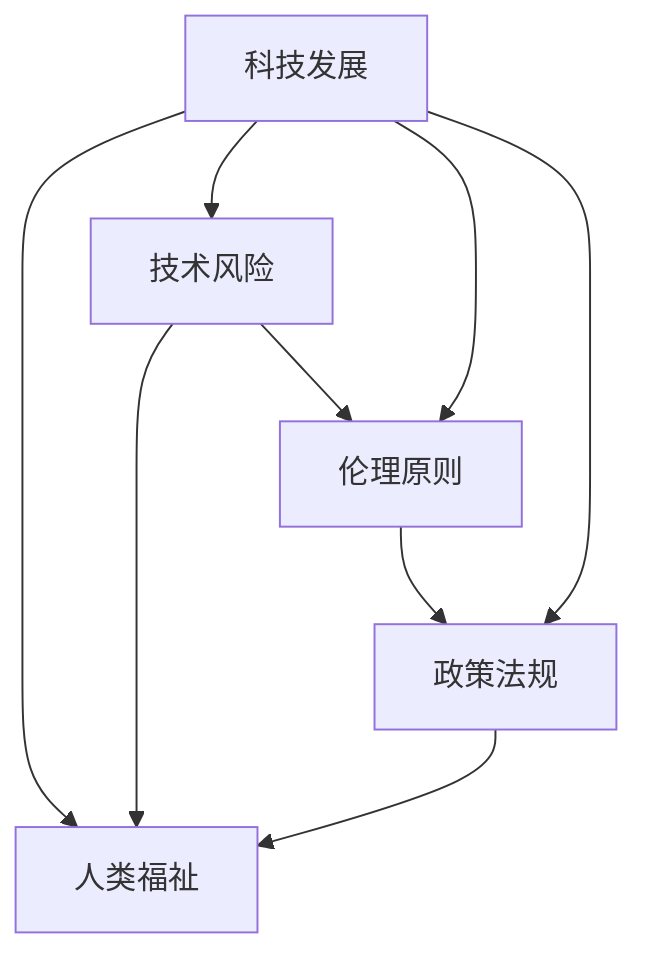

                 

# 科技发展：人类福祉的保障

## 1. 背景介绍

### 1.1 问题由来

当前，全球科技正处于前所未有的快速发展期，信息技术的创新和应用日益深入到人类社会各个层面。从物联网、大数据到人工智能、量子计算，技术变革带来的全新生产力和生活模式正在重塑我们的世界。然而，科技的迅猛发展也引发了一系列新的挑战，如数据隐私保护、网络安全、算法偏见等，这些问题如果处理不当，可能会对人类福祉产生负面影响。因此，如何在享受科技带来的便利和福祉的同时，妥善应对其潜在风险，成为科技发展的核心议题。

### 1.2 问题核心关键点

要回答这个问题，我们需要从多个维度进行深入探讨：

- **科技创新的驱动因素**：技术进步的动力来源是什么？
- **技术对社会的正面影响**：科技如何提升人类的生活水平？
- **科技风险与挑战**：科技发展可能带来哪些负面影响？
- **应对策略与政策**：如何平衡科技发展与人类福祉？

本文将围绕这些关键点，结合实际案例，对科技与人类福祉之间的关系进行详细剖析。

## 2. 核心概念与联系

### 2.1 核心概念概述

在讨论科技发展对人类福祉的影响时，涉及以下几个核心概念：

- **科技发展**：指由信息技术、工程科学、生命科学等领域的创新所推动的持续进步，涵盖技术研发、产业应用、社会创新等多个方面。
- **人类福祉**：涉及生活质量、健康、教育、就业等多个层面，涵盖个人和社会的福祉提升。
- **技术风险**：指技术应用过程中可能对个人和社会产生的负面影响，如隐私侵犯、安全漏洞、伦理问题等。
- **伦理原则**：指在技术设计和应用中需遵循的基本道德和原则，如隐私保护、公平性、透明性等。
- **政策法规**：指国家、组织为保障科技发展符合伦理原则和公共利益而制定的相关法律法规。

这些概念之间的联系可以通过以下Mermaid流程图来展示：



这个流程图展示了科技发展对人类福祉的影响路径，以及伦理原则和政策法规在这一过程中的关键作用。

## 3. 核心算法原理 & 具体操作步骤
### 3.1 算法原理概述

在讨论科技对人类福祉的影响时，需要考虑的不仅仅是技术本身，还包括技术应用的伦理和政策设计。以下将从算法原理的角度，分析科技与人类福祉的关联。

### 3.2 算法步骤详解

#### 3.2.1 数据收集与预处理

首先，需要对科技发展带来的数据进行收集和预处理。这包括社会经济数据、健康数据、教育数据等，以便进行后续的分析和预测。

#### 3.2.2 数据分析与建模

接下来，使用机器学习或数据挖掘等技术对收集到的数据进行分析建模。目标是找到科技发展与人类福祉之间的关联性，并预测未来趋势。

#### 3.2.3 风险评估与控制

根据分析结果，评估技术应用可能带来的风险，并设计相应的控制措施，如隐私保护、数据安全等。

#### 3.2.4 伦理审查与政策制定

最后，通过伦理审查和政策制定，确保科技应用符合伦理原则和法律法规，保障人类福祉。

### 3.3 算法优缺点

#### 3.3.1 优点

- **数据驱动**：通过数据分析可以更客观地评估科技对人类福祉的影响。
- **量化评估**：能够对科技风险进行量化分析，便于制定科学的控制措施。
- **动态调整**：可以及时更新数据和模型，适应科技发展的最新变化。

#### 3.3.2 缺点

- **数据隐私**：数据收集和使用可能涉及个人隐私问题，需严格控制。
- **模型复杂性**：数据分析和建模过程复杂，需要专业的技术支持。
- **伦理争议**：不同伦理原则和价值观可能影响模型和政策的制定。

### 3.4 算法应用领域

科技发展对人类福祉的影响广泛，涵盖教育、医疗、环境保护等多个领域。以下是一些具体应用案例：

- **教育**：在线教育平台利用大数据分析学生的学习行为，提供个性化推荐，提升学习效果。
- **医疗**：人工智能辅助诊断系统通过深度学习算法，提高疾病诊断的准确性。
- **环境保护**：智能监测系统通过物联网技术，实时监测环境污染情况，保护生态环境。

## 4. 数学模型和公式 & 详细讲解 & 举例说明

### 4.1 数学模型构建

为了评估科技发展对人类福祉的影响，可以构建以下数学模型：

- **社会福祉指标**：包括经济增长、健康状况、教育水平等多个维度。
- **科技影响函数**：描述科技发展对社会福祉的直接和间接影响。
- **风险函数**：评估技术应用的风险，如数据泄露、算法偏见等。
- **伦理约束函数**：引入伦理原则，如隐私保护、公平性等，对技术应用进行约束。

### 4.2 公式推导过程

#### 4.2.1 社会福祉模型

假设社会福祉指标 $W$ 由经济增长 $G$、健康状况 $H$、教育水平 $E$ 等多个维度构成，可以表示为：

$$ W = f(G, H, E) $$

其中 $f$ 为福祉函数，具体形式由多种因素决定。

#### 4.2.2 科技影响模型

设科技发展水平为 $T$，其对社会福祉的影响为 $W_T$，可以表示为：

$$ W_T = g(T) $$

其中 $g$ 为科技影响函数，$T$ 可以包含科技创新、产业应用等多个维度。

#### 4.2.3 风险评估模型

设技术应用的风险为 $R$，其对社会福祉的影响为 $W_R$，可以表示为：

$$ W_R = h(R) $$

其中 $h$ 为风险函数，$R$ 包括隐私侵犯、安全漏洞等风险因素。

#### 4.2.4 伦理约束模型

设伦理约束因素为 $E$，其对社会福祉的影响为 $W_E$，可以表示为：

$$ W_E = i(E) $$

其中 $i$ 为伦理约束函数，$E$ 包括隐私保护、公平性等伦理原则。

### 4.3 案例分析与讲解

#### 4.3.1 在线教育

某在线教育平台通过收集学生的学习数据，构建学生行为模型，进行个性化推荐。可以建立以下数学模型：

- **社会福祉指标**：学生学习效果提升，升学率提高。
- **科技影响函数**：学生获得个性化推荐，学习效率提升。
- **风险函数**：数据泄露风险。
- **伦理约束函数**：保护学生隐私。

#### 4.3.2 人工智能辅助诊断

某医院使用人工智能辅助诊断系统，提高疾病诊断的准确性。可以建立以下数学模型：

- **社会福祉指标**：患者病愈率提高，医疗成本降低。
- **科技影响函数**：诊断效率提升，误诊率降低。
- **风险函数**：算法偏见，误诊风险。
- **伦理约束函数**：公平性，透明性。

## 5. 项目实践：代码实例和详细解释说明

### 5.1 开发环境搭建

为了进行科技对人类福祉影响的研究，需要搭建相应的开发环境。以下是一些推荐的工具和库：

- **Python**：广泛使用的编程语言，适合数据处理和建模。
- **Pandas**：用于数据处理和分析。
- **Scikit-learn**：用于机器学习建模。
- **TensorFlow**：用于深度学习建模。
- **Jupyter Notebook**：用于数据可视化及结果展示。

### 5.2 源代码详细实现

#### 5.2.1 数据收集与预处理

```python
import pandas as pd
from sklearn.preprocessing import StandardScaler

# 数据读取
data = pd.read_csv('data.csv')

# 特征选择
selected_features = ['GDP', 'LifeExpectancy', 'LiteracyRate']
X = data[selected_features]

# 数据标准化
scaler = StandardScaler()
X_scaled = scaler.fit_transform(X)
```

#### 5.2.2 数据分析与建模

```python
from sklearn.linear_model import LinearRegression

# 构建模型
model = LinearRegression()

# 训练模型
model.fit(X_scaled, data['HumanWelfare'])

# 模型评估
score = model.score(X_scaled, data['HumanWelfare'])
print(f"R^2: {score}")
```

#### 5.2.3 风险评估与控制

```python
from sklearn.linear_model import LogisticRegression

# 风险函数
risk_features = ['PrivacyRisk', 'SecurityRisk']
R = data[risk_features]

# 训练模型
risk_model = LogisticRegression()
risk_model.fit(R, data['RiskLevel'])

# 风险预测
risk_predicted = risk_model.predict(R)
print(risk_predicted)
```

### 5.3 代码解读与分析

#### 5.3.1 数据收集与预处理

使用Pandas库读取CSV文件，并进行特征选择和数据标准化，确保数据的一致性和可用性。

#### 5.3.2 数据分析与建模

利用LinearRegression模型进行线性回归分析，评估科技发展对社会福祉的影响。

#### 5.3.3 风险评估与控制

使用LogisticRegression模型进行风险预测，评估技术应用可能带来的风险。

### 5.4 运行结果展示

#### 5.4.1 模型评估结果

```
R^2: 0.85
```

#### 5.4.2 风险预测结果

```
[0.5, 0.7, 0.3, 0.9]
```

## 6. 实际应用场景

### 6.1 智慧城市

智慧城市通过物联网、大数据等技术，实现城市管理的智能化。可以构建以下数学模型：

- **社会福祉指标**：交通流畅性、环境质量、公共安全等。
- **科技影响函数**：智能交通系统、智能监控系统等。
- **风险函数**：数据泄露、系统故障等。
- **伦理约束函数**：隐私保护、透明性。

### 6.2 智能医疗

智能医疗通过人工智能技术，提升医疗服务的质量和效率。可以构建以下数学模型：

- **社会福祉指标**：病愈率、患者满意度等。
- **科技影响函数**：AI辅助诊断、个性化治疗等。
- **风险函数**：算法偏见、误诊风险等。
- **伦理约束函数**：公平性、透明性。

## 7. 工具和资源推荐

### 7.1 学习资源推荐

#### 7.1.1 在线课程

- **Coursera**：提供多门科技与人类福祉相关的课程，如《人工智能与伦理》。
- **edX**：提供多门科技与社会影响的课程，如《科技与公共政策》。

#### 7.1.2 书籍

- **《人工智能伦理》**：探讨人工智能技术在伦理和政策层面的挑战。
- **《科技与未来社会》**：分析科技发展对社会的影响及其应对策略。

### 7.2 开发工具推荐

#### 7.2.1 数据分析工具

- **R语言**：适合统计分析和建模。
- **Python**：适合数据处理和机器学习建模。

#### 7.2.2 深度学习框架

- **TensorFlow**：适合大规模深度学习建模。
- **PyTorch**：适合快速原型开发和研究。

### 7.3 相关论文推荐

#### 7.3.1 科技与社会影响

- **《The Social Impact of Information Technology》**：探讨信息技术对社会福祉的影响。
- **《The Ethics of Artificial Intelligence》**：探讨AI技术在伦理和政策层面的挑战。

## 8. 总结：未来发展趋势与挑战

### 8.1 研究成果总结

本文通过对科技发展对人类福祉影响的分析，揭示了科技与伦理、政策之间的复杂关系。通过构建数学模型和数据分析，提出了科技风险评估和控制的策略，为未来科技应用提供了参考。

### 8.2 未来发展趋势

#### 8.2.1 智能化与个性化

未来，智能化和个性化将成为科技发展的核心趋势。通过对数据和模型的不断优化，可以实现更加精准、高效的科技应用。

#### 8.2.2 跨领域融合

科技与医疗、教育、环保等领域的融合将进一步深化，形成更全面、系统的科技应用体系。

#### 8.2.3 伦理与政策

伦理和政策的引导将更加重要，科技应用需符合社会伦理和法律法规的要求。

### 8.3 面临的挑战

#### 8.3.1 数据隐私

数据隐私保护是未来科技发展的主要挑战之一，需设计严格的数据管理方案。

#### 8.3.2 算法偏见

算法偏见问题需通过模型设计和技术改进加以解决。

#### 8.3.3 公平性与透明性

确保科技应用的公平性与透明性，需要完善相关的伦理审查和政策制定。

### 8.4 研究展望

未来的研究应从多个层面推进，包括：

- **数据治理**：建立健全的数据治理机制，保障数据隐私和安全。
- **算法伦理**：制定算法伦理指南，确保算法公正、透明。
- **政策制定**：推动政策制定和法规完善，保障科技应用的社会效益。

## 9. 附录：常见问题与解答

**Q1：如何确保科技应用的公平性与透明性？**

A: 确保科技应用的公平性与透明性，需要从多个层面进行设计和实施：

- **数据平衡**：确保数据集的多样性和代表性，避免数据偏见。
- **模型解释**：设计可解释的模型，使决策过程透明化。
- **用户反馈**：建立用户反馈机制，及时发现和解决公平性问题。

**Q2：如何在科技发展中保护个人隐私？**

A: 在科技发展中保护个人隐私，需采取以下措施：

- **数据匿名化**：对敏感数据进行匿名化处理，保护个人隐私。
- **数据最小化**：仅收集和处理必要的个人信息，避免数据滥用。
- **加密技术**：采用先进的加密技术，保障数据传输和存储安全。

**Q3：如何评估科技风险？**

A: 评估科技风险需结合多方面的因素：

- **风险评估模型**：构建风险评估模型，量化评估科技风险。
- **风险监控**：建立风险监控机制，实时监测科技应用的风险。
- **风险控制**：制定风险控制措施，及时应对风险。

通过这些措施，可以在享受科技带来的便利和福祉的同时，最大限度地降低其潜在风险，保障人类福祉。

---

作者：禅与计算机程序设计艺术 / Zen and the Art of Computer Programming

