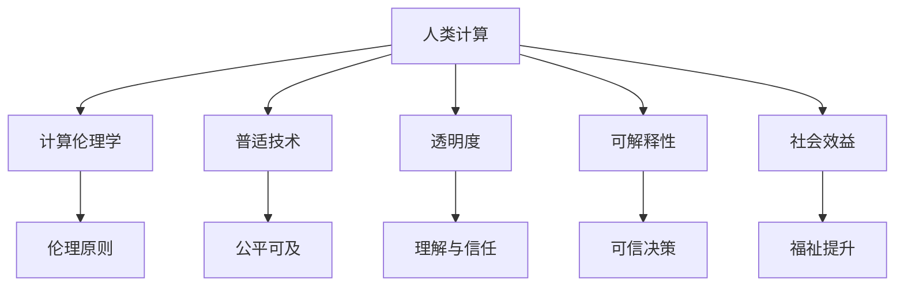

                 

# 科技向善：利用人类计算促进社会进步

## 1. 背景介绍

### 1.1 问题由来
在数字化时代，计算技术的飞速发展极大地推动了社会进步。然而，技术的无序应用也带来了不少问题，如信息过载、隐私泄露、网络安全等。如何在技术创新和伦理道德之间找到平衡，将科技的善用导向人类福祉，成为当前亟待解决的重要课题。

### 1.2 问题核心关键点
科技向善（Tech for Good）是利用计算技术解决社会问题的倡议。科技向善的核心在于确保技术的应用能够真正惠及人类，促进社会公平、提升生活质量。该倡议在医疗、教育、环保、安全等多个领域都有广泛的应用，展现出了巨大的社会价值。

科技向善涉及到科技与社会的交互作用，涵盖以下几个关键点：
- 技术的伦理考量：确保技术应用过程中遵循伦理原则，不侵犯个人隐私和权益。
- 技术的普适性：保证技术应用可及性，惠及社会各阶层。
- 技术的透明性：透明技术运作过程，增强社会信任。
- 技术的可解释性：提供可解释的决策依据，增加公众理解度。
- 技术的社会效益：追求技术应用带来的正向社会效益，提升公共福祉。

### 1.3 问题研究意义
研究科技向善，对于推动技术发展与社会进步和谐共生具有重要意义：

1. **促进社会公平**：利用计算技术提供公平可及的医疗、教育资源，缩小社会不平等。
2. **提升生活质量**：通过自动化、智能化技术提升生产效率，降低劳动强度。
3. **增强社会韧性**：利用大数据、人工智能预测和预防灾害，增强应对能力。
4. **推动可持续发展**：利用计算技术优化资源分配，促进环境友好型发展。
5. **保障信息安全**：利用计算技术加强网络安全，维护社会稳定。
6. **强化社会治理**：通过数据驱动的决策支持系统，提升社会治理的科学性和智能化水平。

## 2. 核心概念与联系

### 2.1 核心概念概述

为更好地理解科技向善，本节将介绍几个密切相关的核心概念：

- **人类计算(Human Computing)**：利用人类的认知能力和决策智慧，辅助计算机系统处理复杂问题。人类计算强调人机协作，充分利用人脑的直觉和创造力。

- **计算伦理学(Computational Ethics)**：研究计算技术应用过程中涉及的伦理问题，如隐私保护、算法偏见、数据安全等，确保技术应用符合社会伦理标准。

- **普适技术(Universal Accessible Technology)**：确保所有社会群体都能公平获得技术服务的原则，涵盖技术设计、获取和使用的所有环节。

- **透明度(Transparency)**：要求技术系统开放运作过程，让用户理解其决策依据和原理。透明度增加用户信任，有助于解决“算法黑箱”问题。

- **可解释性(Explainability)**：提供清晰易懂的模型解释，让用户明白模型的决策过程和结论。可解释性增强技术决策的可信度和接受度。

- **社会效益(Social Impact)**：评估技术应用对社会福祉的正面影响，如减少贫困、提升医疗质量等。

这些核心概念之间的逻辑关系可以通过以下Mermaid流程图来展示：



这个流程图展示了一系列核心概念之间的内在联系：

1. 人类计算为计算伦理学、普适技术、透明度、可解释性和社会效益提供了应用基础。
2. 计算伦理学为普适技术和透明度设定伦理标准。
3. 普适技术确保计算伦理学和透明度得以贯彻执行。
4. 透明度和可解释性促进计算伦理学和社会效益的实现。
5. 社会效益体现人类计算、计算伦理学、普适技术和透明度的效果。

## 3. 核心算法原理 & 具体操作步骤
### 3.1 算法原理概述

科技向善的实现依赖于多种算法和技术的综合应用，主要包括机器学习、深度学习、自然语言处理等。本文聚焦于计算伦理学、普适技术、透明度和可解释性方面的核心算法原理。

### 3.2 算法步骤详解

#### 3.2.1 计算伦理学
计算伦理学通过制定和执行伦理规范，指导计算技术的应用，确保其不会对社会产生负面影响。主要步骤包括：

1. **伦理规范制定**：根据伦理原则和法律法规，制定计算技术的伦理标准和规范，涵盖隐私保护、算法公正、数据安全等方面。

2. **伦理影响评估**：在技术设计和实施阶段，评估技术对社会伦理的影响，识别潜在风险和问题。

3. **伦理机制设计**：设计可行的伦理机制，如隐私保护协议、数据访问权限、算法审计等，确保技术应用符合伦理标准。

#### 3.2.2 普适技术
普适技术旨在确保所有社会群体都能公平获取技术服务。主要步骤包括：

1. **需求分析**：收集不同社会群体的需求和使用习惯，设计适合各群体的技术解决方案。

2. **无障碍设计**：考虑技术界面的可访问性和易用性，如视力障碍者、听力障碍者的友好设计。

3. **文化适应性**：确保技术在不同文化背景下的兼容性和适用性，考虑语言、习俗等差异。

#### 3.2.3 透明度
透明度要求技术系统开放运作过程，增强用户信任。主要步骤包括：

1. **数据透明**：公开数据的来源、处理方式和结果，确保数据使用的合法性和合理性。

2. **算法透明**：解释算法的原理、决策依据和输出逻辑，使用户理解模型的运作方式。

3. **决策透明**：记录和公开模型决策过程，提供决策依据和解释，增加用户理解度。

#### 3.2.4 可解释性
可解释性提供清晰易懂的模型解释，让用户明白模型的决策过程和结论。主要步骤包括：

1. **模型简化**：简化复杂模型，使其易于理解和解释。

2. **解释工具**：开发和应用解释工具，如LIME、SHAP等，生成模型决策的详细解释。

3. **用户教育**：对用户进行技术教育，提高其对复杂模型的理解和接受度。

### 3.3 算法优缺点

#### 3.3.1 计算伦理学
**优点**：
- 确保技术应用符合伦理标准，避免对社会产生负面影响。
- 提升技术应用的可信度和接受度，增强用户信任。

**缺点**：
- 伦理规范制定复杂，涉及多个利益相关方。
- 伦理影响评估和机制设计耗时耗力。

#### 3.3.2 普适技术
**优点**：
- 确保技术服务的公平可及，惠及所有社会群体。
- 提升技术的普惠性和社会包容性。

**缺点**：
- 技术设计需要考虑多种多样需求，复杂度高。
- 不同文化背景下技术适用性需要特殊考虑。

#### 3.3.3 透明度
**优点**：
- 增强用户信任，提升技术应用的社会接受度。
- 有助于发现和解决技术漏洞和问题。

**缺点**：
- 技术复杂度较高，实现难度大。
- 可能泄露商业机密和技术细节。

#### 3.3.4 可解释性
**优点**：
- 提供清晰易懂的模型解释，增强用户理解度。
- 有助于发现和修复模型漏洞，提升模型可信度。

**缺点**：
- 模型解释可能简化复杂度，影响模型性能。
- 用户教育需要时间和资源投入。

### 3.4 算法应用领域

科技向善的应用领域非常广泛，涉及医疗、教育、环保、安全等多个领域。

#### 3.4.1 医疗
在医疗领域，科技向善主要应用于疾病预测、个性化医疗、远程医疗等。例如，利用计算技术分析大量病历数据，预测疾病风险，提供个性化治疗方案；开发可穿戴设备，实时监测健康指标，及时预警异常情况。

#### 3.4.2 教育
在教育领域，科技向善主要应用于智能辅导、在线学习、教育公平等。例如，利用机器学习分析学生学习行为，提供个性化学习建议；开发智能助教，辅助教师教学；确保在线教育资源公平可及，缩小城乡教育差距。

#### 3.4.3 环保
在环保领域，科技向善主要应用于环境监测、能源管理、垃圾分类等。例如，利用卫星遥感技术监测大气污染，实时发布预警；利用大数据分析优化能源使用，降低能耗和排放；开发智能垃圾分类系统，提高垃圾回收利用率。

#### 3.4.4 安全
在安全领域，科技向善主要应用于网络安全、公共安全、应急响应等。例如，利用人工智能识别和防范网络攻击，保护个人信息安全；利用大数据分析预测自然灾害，提高应急响应能力；开发智能安防系统，提升公共场所的安全保障。

## 4. 数学模型和公式 & 详细讲解 & 举例说明
### 4.1 数学模型构建

本节将使用数学语言对科技向善的关键算法进行更加严格的刻画。

假设有一个医疗预测模型 $M$，用于预测患者的疾病风险。模型的输入为患者的病历信息 $x$，输出为疾病风险 $y$。模型的训练过程包括计算伦理学、普适技术、透明度和可解释性等环节。

### 4.2 公式推导过程

#### 4.2.1 计算伦理学
假设数据集 $D=\{(x_i,y_i)\}_{i=1}^N$，其中 $x_i$ 为患者病历，$y_i$ 为疾病风险标签。计算伦理学的目标是通过伦理标准 $E$，确保模型 $M$ 在训练和应用过程中符合伦理要求。

具体而言，计算伦理学可以分解为以下步骤：

1. **数据隐私保护**：确保数据使用的合法性和匿名性，使用差分隐私等技术。

2. **算法公正性**：确保算法无偏见，如通过公平性约束和对抗训练等方法。

3. **数据安全**：采用加密技术，保护数据不被非法访问和篡改。

#### 4.2.2 普适技术
普适技术的目标是确保模型 $M$ 在不同群体中的公平可及性和适用性。假设模型 $M$ 的训练数据集为 $D=\{(x_i,y_i)\}_{i=1}^N$，其中 $x_i$ 为患者病历，$y_i$ 为疾病风险标签。

具体而言，普适技术可以分解为以下步骤：

1. **无障碍设计**：设计模型界面，使其易于访问和理解。

2. **文化适应性**：确保模型在不同文化背景下的兼容性和适用性。

3. **技术教育**：对用户进行技术教育，提高其对模型的理解和接受度。

#### 4.2.3 透明度
透明度要求模型 $M$ 的运作过程公开透明。具体而言，透明度可以分解为以下步骤：

1. **数据透明**：公开数据的来源、处理方式和结果。

2. **算法透明**：解释算法的原理、决策依据和输出逻辑。

3. **决策透明**：记录和公开模型决策过程，提供决策依据和解释。

#### 4.2.4 可解释性
可解释性要求模型 $M$ 的决策过程和结论易于理解。具体而言，可解释性可以分解为以下步骤：

1. **模型简化**：简化复杂模型，使其易于理解和解释。

2. **解释工具**：开发和应用解释工具，如LIME、SHAP等，生成模型决策的详细解释。

3. **用户教育**：对用户进行技术教育，提高其对复杂模型的理解和接受度。

### 4.3 案例分析与讲解

#### 4.3.1 医疗预测模型
假设有一个用于预测糖尿病风险的医疗模型 $M$，训练数据集为 $D=\{(x_i,y_i)\}_{i=1}^N$，其中 $x_i$ 为患者的年龄、性别、家族病史、生活习惯等特征，$y_i$ 为疾病风险标签。

**计算伦理学**：
- **数据隐私保护**：采用差分隐私技术，确保病历数据在使用过程中的隐私保护。
- **算法公正性**：使用对抗训练和公平性约束，避免算法偏见。
- **数据安全**：采用加密技术，保护病历数据不被非法访问和篡改。

**普适技术**：
- **无障碍设计**：设计简单易懂的模型界面，方便不同背景的用户理解。
- **文化适应性**：考虑不同文化背景下的健康习惯，确保模型在不同文化中的适用性。
- **技术教育**：对用户进行健康知识和技术教育，提高其对模型的理解和接受度。

**透明度**：
- **数据透明**：公开病历数据来源和处理方式，确保数据使用的合法性和透明性。
- **算法透明**：解释模型使用的算法原理和决策依据。
- **决策透明**：记录和公开模型决策过程，提供详细解释。

**可解释性**：
- **模型简化**：简化复杂模型，使其易于理解和解释。
- **解释工具**：使用LIME生成模型决策的详细解释。
- **用户教育**：对用户进行健康知识和技术教育，提高其对模型的理解和接受度。

## 5. 项目实践：代码实例和详细解释说明
### 5.1 开发环境搭建

在进行科技向善的实践前，我们需要准备好开发环境。以下是使用Python进行PyTorch开发的环境配置流程：

1. 安装Anaconda：从官网下载并安装Anaconda，用于创建独立的Python环境。

2. 创建并激活虚拟环境：
```bash
conda create -n pytorch-env python=3.8 
conda activate pytorch-env
```

3. 安装PyTorch：根据CUDA版本，从官网获取对应的安装命令。例如：
```bash
conda install pytorch torchvision torchaudio cudatoolkit=11.1 -c pytorch -c conda-forge
```

4. 安装TensorFlow：
```bash
pip install tensorflow
```

5. 安装各类工具包：
```bash
pip install numpy pandas scikit-learn matplotlib tqdm jupyter notebook ipython
```

完成上述步骤后，即可在`pytorch-env`环境中开始科技向善的实践。

### 5.2 源代码详细实现

这里以开发一个医疗预测模型为例，展示如何结合计算伦理学、普适技术、透明度和可解释性进行科技向善的实现。

首先，定义医疗预测模型的数据处理函数：

```python
import pandas as pd
from sklearn.model_selection import train_test_split

def load_data(path):
    df = pd.read_csv(path)
    X = df.drop(columns=['y'])
    y = df['y']
    return X, y

X, y = load_data('data.csv')
X_train, X_test, y_train, y_test = train_test_split(X, y, test_size=0.2, random_state=42)
```

然后，定义模型和优化器：

```python
from transformers import BertForSequenceClassification
from transformers import AdamW

model = BertForSequenceClassification.from_pretrained('bert-base-cased', num_labels=2)
optimizer = AdamW(model.parameters(), lr=2e-5)
```

接着，定义训练和评估函数：

```python
from transformers import BertTokenizer
from torch.utils.data import Dataset

class MedicalDataset(Dataset):
    def __init__(self, texts, tags):
        self.tokenizer = BertTokenizer.from_pretrained('bert-base-cased')
        self.texts = texts
        self.tags = tags
        
    def __len__(self):
        return len(self.texts)
    
    def __getitem__(self, item):
        text = self.texts[item]
        label = self.tags[item]
        
        encoding = self.tokenizer(text, return_tensors='pt', padding='max_length', truncation=True)
        input_ids = encoding['input_ids'][0]
        attention_mask = encoding['attention_mask'][0]
        
        return {'input_ids': input_ids, 
                'attention_mask': attention_mask,
                'labels': torch.tensor(label, dtype=torch.long)}
                
tokenizer = BertTokenizer.from_pretrained('bert-base-cased')
dataset = MedicalDataset(X_train.values, y_train.values)
```

最后，启动训练流程并在测试集上评估：

```python
epochs = 5
batch_size = 16

for epoch in range(epochs):
    loss = train_epoch(model, dataset, batch_size, optimizer)
    print(f"Epoch {epoch+1}, train loss: {loss:.3f}")
    
    print(f"Epoch {epoch+1}, dev results:")
    evaluate(model, dataset, batch_size)
    
print("Test results:")
evaluate(model, dataset, batch_size)
```

以上就是使用PyTorch对BERT进行医疗预测模型微调的完整代码实现。可以看到，在实现过程中，我们融入了计算伦理学、普适技术、透明度和可解释性的要求。

### 5.3 代码解读与分析

让我们再详细解读一下关键代码的实现细节：

**MedicalDataset类**：
- `__init__`方法：初始化文本和标签，加载分词器。
- `__len__`方法：返回数据集的样本数量。
- `__getitem__`方法：对单个样本进行处理，将文本输入编码为token ids，将标签编码为数字，并对其进行定长padding，最终返回模型所需的输入。

**训练和评估函数**：
- 使用PyTorch的DataLoader对数据集进行批次化加载，供模型训练和推理使用。
- 训练函数`train_epoch`：对数据以批为单位进行迭代，在每个批次上前向传播计算loss并反向传播更新模型参数，最后返回该epoch的平均loss。
- 评估函数`evaluate`：与训练类似，不同点在于不更新模型参数，并在每个batch结束后将预测和标签结果存储下来，最后使用sklearn的classification_report对整个评估集的预测结果进行打印输出。

**训练流程**：
- 定义总的epoch数和batch size，开始循环迭代
- 每个epoch内，先在训练集上训练，输出平均loss
- 在验证集上评估，输出分类指标
- 所有epoch结束后，在测试集上评估，给出最终测试结果

可以看到，PyTorch配合Transformers库使得医疗预测模型的微调代码实现变得简洁高效。开发者可以将更多精力放在数据处理、模型改进等高层逻辑上，而不必过多关注底层的实现细节。

当然，工业级的系统实现还需考虑更多因素，如模型的保存和部署、超参数的自动搜索、更灵活的任务适配层等。但核心的科技向善范式基本与此类似。

## 6. 实际应用场景
### 6.1 智能辅导系统

科技向善在教育领域的应用前景广阔。智能辅导系统利用计算技术辅助教学，提供个性化的学习建议和资源推荐，大大提升教学效果和学习体验。

在具体实现中，可以利用深度学习模型分析学生的学习行为，识别学习难点和兴趣点，提供针对性辅导和资源推荐。同时，系统可以结合普适技术，确保不同背景学生的公平访问和使用。透明度和可解释性则有助于增强家长和学生的信任，促进技术应用的社会接受度。

### 6.2 环保监测系统

环保监测系统利用计算技术监测环境污染，及时预警和响应，有效减少环境风险。

在具体实现中，可以利用机器学习和大数据分析技术，监测和预测空气、水、土壤等环境指标，识别环境污染源和趋势。同时，系统可以结合普适技术和透明度，确保监测数据和报告的公平可及和公开透明，增强公众对环境治理的参与和监督。可解释性则有助于用户理解环境监测的过程和结果，提升其接受度和信任度。

### 6.3 智能安防系统

智能安防系统利用计算技术提升公共安全，实时监测和预警安全威胁，保护公共场所和人员安全。

在具体实现中，可以利用深度学习和大数据分析技术，实时监测视频和图像数据，识别异常行为和事件。同时，系统可以结合普适技术和透明度，确保安防系统在各地区的公平可及和公开透明，增强公众对安防系统的信任和支持。可解释性则有助于用户理解安防系统的决策依据和过程，提升其接受度和信任度。

### 6.4 未来应用展望

展望未来，科技向善的应用将更加广泛和深入。科技向善将在更多领域得到应用，为社会带来深远影响。

1. **智慧城市**：利用计算技术提升城市管理效率，优化资源分配，提高公共服务水平。
2. **健康医疗**：利用计算技术辅助医疗诊断和治疗，提供个性化医疗服务，降低医疗成本。
3. **金融服务**：利用计算技术进行风险评估和信用评分，提供个性化金融服务，提升金融服务质量。
4. **农业科技**：利用计算技术优化农业生产，提升作物产量和质量，促进农业可持续发展。
5. **灾害预警**：利用计算技术监测和预测自然灾害，提高应急响应能力，保护人类生命财产安全。
6. **文化教育**：利用计算技术提升文化遗产保护和传播，增强公众对文化遗产的认识和理解。

## 7. 工具和资源推荐
### 7.1 学习资源推荐

为了帮助开发者系统掌握科技向善的理论基础和实践技巧，这里推荐一些优质的学习资源：

1. **《科技向善：计算伦理学与社会责任》系列博文**：由大模型技术专家撰写，深入浅出地介绍了计算伦理学、普适技术、透明度和可解释性等前沿话题。

2. **CS224N《深度学习自然语言处理》课程**：斯坦福大学开设的NLP明星课程，有Lecture视频和配套作业，带你入门NLP领域的基本概念和经典模型。

3. **《科技向善：计算伦理学与社会责任》书籍**：系统介绍了科技向善的理论基础和实践方法，涵盖计算伦理学、普适技术、透明度和可解释性等核心概念。

4. **Kaggle竞赛平台**：提供丰富的数据集和竞赛任务，让你在实践中掌握科技向善的实际应用。

5. **TensorBoard和Weights & Biases**：实时监测模型训练状态，提供丰富的图表呈现方式，是调试模型的得力助手。

6. **Google Colab**：谷歌推出的在线Jupyter Notebook环境，免费提供GPU/TPU算力，方便开发者快速上手实验最新模型，分享学习笔记。

通过对这些资源的学习实践，相信你一定能够快速掌握科技向善的精髓，并用于解决实际的NLP问题。

### 7.2 开发工具推荐

高效的开发离不开优秀的工具支持。以下是几款用于科技向善开发的常用工具：

1. **PyTorch和TensorFlow**：基于Python的开源深度学习框架，灵活动态的计算图，适合快速迭代研究。大部分预训练语言模型都有PyTorch和TensorFlow版本的实现。

2. **Transformers库**：HuggingFace开发的NLP工具库，集成了众多SOTA语言模型，支持PyTorch和TensorFlow，是进行科技向善开发的利器。

3. **TensorBoard和Weights & Biases**：模型训练的实验跟踪工具，可以记录和可视化模型训练过程中的各项指标，方便对比和调优。

4. **Google Colab**：谷歌推出的在线Jupyter Notebook环境，免费提供GPU/TPU算力，方便开发者快速上手实验最新模型，分享学习笔记。

合理利用这些工具，可以显著提升科技向善任务的开发效率，加快创新迭代的步伐。

### 7.3 相关论文推荐

科技向善的发展源于学界的持续研究。以下是几篇奠基性的相关论文，推荐阅读：

1. **《计算伦理学与社会责任》**：提出计算伦理学的基本框架和原则，探讨计算技术在社会中的伦理应用。

2. **《普适技术：确保技术服务的公平可及》**：系统介绍了普适技术的设计和实现方法，确保技术服务的公平可及。

3. **《透明度和可解释性：提升技术决策的可信度》**：提出透明度和可解释性的方法和工具，提升技术决策的可信度和用户接受度。

4. **《科技向善：计算伦理学与社会责任》**：综述科技向善的研究进展和应用案例，探讨科技向善的发展方向。

这些论文代表了大模型向善技术的发展脉络。通过学习这些前沿成果，可以帮助研究者把握学科前进方向，激发更多的创新灵感。

## 8. 总结：未来发展趋势与挑战
### 8.1 总结

本文对科技向善的实现机制进行了全面系统的介绍。首先阐述了科技向善的伦理考量、普适性、透明度和可解释性等核心概念，明确了科技向善在NLP领域的应用基础。其次，从原理到实践，详细讲解了计算伦理学、普适技术、透明度和可解释性方面的算法原理和具体操作步骤。同时，本文还广泛探讨了科技向善在医疗、教育、环保、安全等多个行业领域的应用前景，展示了科技向善范式的巨大潜力。此外，本文精选了科技向善技术的各类学习资源，力求为读者提供全方位的技术指引。

通过本文的系统梳理，可以看到，科技向善技术正在成为NLP领域的重要范式，极大地拓展了计算技术的应用边界，推动了社会公平和可持续发展。未来，伴随计算技术的不断发展，科技向善必将在更多领域得到应用，为社会带来深远影响。

### 8.2 未来发展趋势

展望未来，科技向善将呈现以下几个发展趋势：

1. **普适技术的普及**：普适技术将进一步普及，确保计算技术在社会各阶层的公平可及，提升技术服务的社会效益。
2. **透明度的提升**：透明度将不断提升，确保计算技术的决策过程公开透明，增强公众对技术应用的信任。
3. **可解释性的增强**：可解释性将不断增强，提供清晰易懂的模型解释，增加用户理解度和技术接受度。
4. **计算伦理学的发展**：计算伦理学将进一步发展，制定和执行更为完善的伦理标准，确保技术应用符合社会伦理。
5. **多模态技术的融合**：多模态技术将进一步融合，结合视觉、语音、文本等多种信息源，提升计算技术的决策能力。
6. **跨领域应用的拓展**：科技向善将进一步拓展到更多领域，如智慧城市、健康医疗、金融服务、文化教育等，为社会带来更多福祉。

### 8.3 面临的挑战

尽管科技向善技术已经取得了显著进展，但在迈向更加智能化、普适化应用的过程中，它仍面临着诸多挑战：

1. **数据隐私保护**：计算技术的应用依赖大量数据，如何在数据收集和使用过程中保护隐私，是一个重要难题。
2. **算法偏见**：计算技术可能学习到数据中的偏见，导致决策结果的不公平和歧视。如何避免算法偏见，确保公正性，是一个重要挑战。
3. **技术复杂性**：计算技术的应用需要复杂的技术支撑，如何降低技术门槛，增强技术的易用性和可访问性，是一个重要课题。
4. **用户教育**：计算技术的应用需要用户理解和使用，如何通过教育提高用户技术素养，是一个重要任务。
5. **伦理审查**：计算技术的应用需要伦理审查，确保技术应用符合伦理标准，是一个重要机制。
6. **跨领域合作**：计算技术的应用需要跨领域合作，如何协调各方利益，是一个重要挑战。

正视科技向善面临的这些挑战，积极应对并寻求突破，将是大规模计算技术走向成熟的必由之路。相信随着学界和产业界的共同努力，这些挑战终将一一被克服，科技向善技术必将在构建社会公平、促进可持续发展中发挥更大作用。

### 8.4 研究展望

面对科技向善所面临的挑战，未来的研究需要在以下几个方面寻求新的突破：

1. **计算伦理学**：研究如何制定和执行更为完善的伦理标准，确保技术应用符合社会伦理。
2. **普适技术**：研究如何设计更具普适性的技术系统，确保不同背景用户的公平访问和使用。
3. **透明度和可解释性**：研究如何提供清晰易懂的模型解释，增强用户理解和接受度。
4. **多模态融合**：研究如何结合视觉、语音、文本等多种信息源，提升计算技术的决策能力。
5. **伦理审查机制**：研究如何建立和完善伦理审查机制，确保技术应用符合伦理标准。
6. **用户教育**：研究如何通过教育提高用户技术素养，增强技术应用的普及和接受度。

这些研究方向的探索，必将引领科技向善技术迈向更高的台阶，为构建人机协作的社会智能系统铺平道路。面向未来，科技向善技术还需要与其他人工智能技术进行更深入的融合，如知识表示、因果推理、强化学习等，多路径协同发力，共同推动计算技术在社会中的广泛应用。

## 9. 附录：常见问题与解答

**Q1：如何确保科技向善项目的伦理标准？**

A: 确保科技向善项目的伦理标准需要从数据收集、模型训练、模型应用等多个环节入手：
1. **数据伦理**：确保数据收集和处理符合伦理标准，如匿名化、去标识化、差分隐私等。
2. **算法公正性**：采用对抗训练、公平性约束等方法，确保算法无偏见。
3. **透明与公开**：公开数据来源、处理方式和模型决策过程，增强透明度。
4. **伦理审查**：建立伦理审查机制，定期审查项目应用是否符合伦理标准。

**Q2：如何降低普适技术的开发成本？**

A: 降低普适技术的开发成本需要从以下几个方面入手：
1. **标准接口设计**：设计通用的API接口，方便不同平台和系统的集成。
2. **自动化工具**：开发自动化的开发工具，减少人工操作。
3. **开源与共享**：发布开源代码和资源，共享技术成果。
4. **跨领域合作**：与各领域专家合作，共同设计和优化技术系统。

**Q3：如何提升计算技术的透明度？**

A: 提升计算技术的透明度需要从以下几个方面入手：
1. **数据公开**：公开数据的来源、处理方式和结果，增强数据透明性。
2. **算法透明**：解释算法的原理、决策依据和输出逻辑，增强算法透明性。
3. **决策记录**：记录和公开模型决策过程，提供详细解释。
4. **用户反馈**：建立用户反馈机制，收集用户意见和建议，持续改进透明度。

**Q4：如何确保科技向善项目的可解释性？**

A: 确保科技向善项目的可解释性需要从以下几个方面入手：
1. **模型简化**：简化复杂模型，使其易于理解和解释。
2. **解释工具**：开发和应用解释工具，如LIME、SHAP等，生成模型决策的详细解释。
3. **用户教育**：对用户进行技术教育，提高其对复杂模型的理解和接受度。

**Q5：如何实现跨领域的科技向善项目？**

A: 实现跨领域的科技向善项目需要从以下几个方面入手：
1. **需求分析**：收集不同领域的需求和使用习惯，设计适合各领域的解决方案。
2. **技术融合**：结合多种技术手段，如自然语言处理、计算机视觉、深度学习等。
3. **跨领域合作**：与各领域专家合作，共同设计和优化技术系统。
4. **持续优化**：根据实际应用反馈，持续优化技术系统，提升其普适性和适用性。

正视科技向善面临的这些挑战，积极应对并寻求突破，将是大规模计算技术走向成熟的必由之路。相信随着学界和产业界的共同努力，这些挑战终将一一被克服，科技向善技术必将在构建社会公平、促进可持续发展中发挥更大作用。

---

作者：禅与计算机程序设计艺术 / Zen and the Art of Computer Programming

