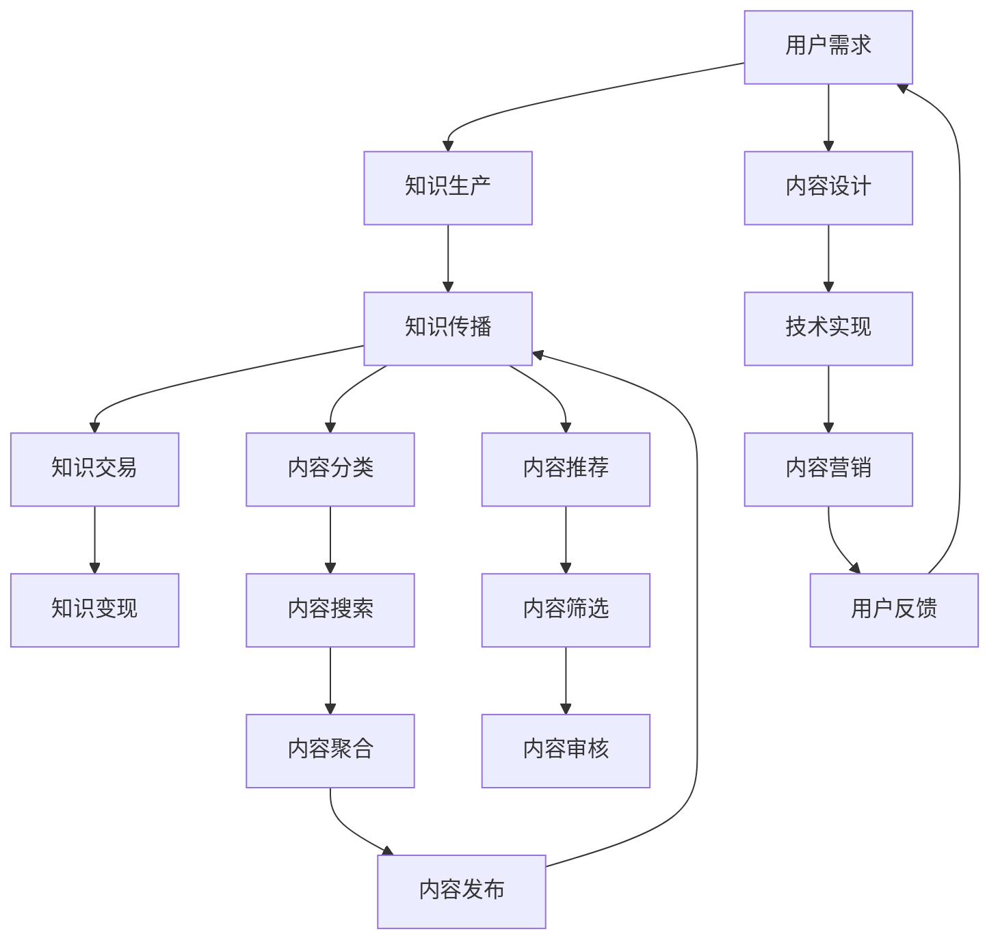

                 

# 程序员副业指南：知识付费项目启动攻略

## 1. 背景介绍

随着科技的迅猛发展和经济的转型升级，程序员的就业环境日益严峻。就业市场的供需失衡，行业发展的不确定性，让许多技术人才陷入了迷茫和困惑。为了拓宽收入来源，实现职业的多元化发展，越来越多的程序员选择将自身专业技能转化为知识付费产品，开启副业之路。那么，如何启动一个成功且稳定的知识付费项目？本文将从启动知识付费项目的背景、核心概念与联系、核心算法原理与操作步骤、数学模型与公式推导、项目实践、实际应用场景、工具和资源推荐、未来发展趋势与挑战、常见问题与解答等多个方面进行深入解析。

## 2. 核心概念与联系

### 2.1 核心概念概述

**知识付费**：指以知识、技能、经验等有价值信息为核心内容，通过各种线上线下渠道进行传播，并通过付费方式进行价值交换的商业模式。程序员将自己的专业技能和经验转化为知识付费产品，如在线课程、技术博客、视频教程等，帮助他人提升技术水平，同时获得收入。

**知识付费平台**：指通过互联网技术提供知识产品交易和交流的第三方平台，如知乎、得到、B站知识区等，是知识付费项目的重要载体。

**知识付费变现**：指将知识产品转化为实际收入的过程，包括广告分成、付费订阅、商品销售、线上线下活动等变现方式。

**知识付费商业模式**：指知识付费产品的生产、传播、交易和价值实现的全流程模式，核心在于知识产品的价值认知和用户需求匹配。

### 2.2 核心概念原理和架构的 Mermaid 流程图



## 3. 核心算法原理 & 具体操作步骤

### 3.1 算法原理概述

知识付费项目的成功与否，关键在于知识产品的价值认知和用户需求的匹配程度。知识产品的价值认知主要来自于知识生产者的专业度和经验积累，而用户需求则通过市场调研、用户反馈等方式获取。知识付费项目的核心算法主要围绕以下几个环节展开：

1. **内容设计**：根据市场需求和用户反馈，设计知识产品的核心内容和结构。
2. **技术实现**：利用编程技术和互联网平台，实现知识产品的编码、部署和维护。
3. **内容传播**：通过各种线上线下渠道，将知识产品传递给目标用户。
4. **内容推荐**：通过算法推荐系统，将知识产品推荐给最合适的用户。
5. **用户反馈**：收集用户反馈，进行产品迭代和优化。
6. **内容变现**：实现知识产品的价值变现，如付费订阅、广告分成等。

### 3.2 算法步骤详解

#### 3.2.1 内容设计

知识产品的设计需要充分考虑目标用户的需求和痛点，设计科学合理的内容结构和知识点。以在线课程为例，课程大纲应包括基础知识、进阶技巧、实战案例等，结构清晰，重点突出。同时，应引入项目实战案例，增加课程的实用性和吸引力。

#### 3.2.2 技术实现

技术实现主要分为平台搭建和产品开发两个阶段。平台搭建包括选择知识付费平台、开发技术架构设计、用户管理系统等，产品开发则包括课程制作、视频录制、内容编辑等。

#### 3.2.3 内容传播

内容传播需要通过多种渠道进行，如社交媒体、专业论坛、视频平台等。社交媒体可以用于推广课程，专业论坛可以用于交流学习经验，视频平台则可以直接发布课程内容。

#### 3.2.4 内容推荐

内容推荐系统是知识付费项目的关键环节，通过算法模型对用户的行为数据进行分析，预测其可能感兴趣的内容，并推荐给用户。常见的推荐算法包括协同过滤、基于内容的推荐、深度学习推荐等。

#### 3.2.5 用户反馈

用户反馈是产品迭代和优化的重要依据，通过在线问卷、用户评论、社群交流等方式收集用户反馈，并进行深入分析，改进课程内容，提高用户体验。

#### 3.2.6 内容变现

内容变现是知识付费项目的最终目标。通过平台分成、课程付费、商品销售等方式实现盈利。平台分成指的是根据知识产品发布在平台上的点击量、观看量等数据，按比例分配收益。课程付费则是直接向用户收取课程费用。商品销售则是通过知识产品衍生出的商品销售，如课程配套书籍、配套工具等。

### 3.3 算法优缺点

知识付费项目的优点在于其低成本、高收益的特点。利用编程技能和互联网技术，可以在短时间内将专业知识转化为可变现的产品。同时，知识付费项目有助于提升个人的品牌知名度和影响力。

然而，知识付费项目也存在一定的缺点。首先，知识产品的市场竞争激烈，需要持续创新才能保持竞争力。其次，知识付费项目对编程和互联网技术的要求较高，需要较高的技术门槛。最后，知识付费项目的效果依赖于知识产品的质量，需要不断优化和迭代。

### 3.4 算法应用领域

知识付费项目的应用领域广泛，涵盖了软件开发、数据分析、人工智能、设计开发、教育培训等多个领域。无论是在职技术人才还是自由职业者，都可以通过知识付费项目实现副业收入。

## 4. 数学模型和公式 & 详细讲解 & 举例说明

### 4.1 数学模型构建

知识付费项目中的推荐系统涉及多种数学模型，包括协同过滤、基于内容的推荐、深度学习推荐等。以协同过滤为例，其数学模型如下：

$$
R_{ui} = \sum_{j=1}^{N} \alpha_{uj} \cdot A_{ji} \cdot I_{uj}
$$

其中 $R_{ui}$ 表示用户 $u$ 对物品 $i$ 的评分，$\alpha_{uj}$ 表示用户 $u$ 对物品 $j$ 的评分，$A_{ji}$ 表示物品 $j$ 和物品 $i$ 的相似度，$I_{uj}$ 表示物品 $j$ 是否被用户 $u$ 评分过。

### 4.2 公式推导过程

以协同过滤为例，其推导过程如下：

假设用户 $u$ 对物品 $i$ 的评分 $R_{ui}$ 可以表示为用户对物品 $i$ 的评分和用户对物品 $j$ 的评分加权平均的结果。令 $\alpha_{uj}$ 表示用户 $u$ 对物品 $j$ 的评分对用户 $u$ 对物品 $i$ 评分的权重，$A_{ji}$ 表示物品 $j$ 和物品 $i$ 的相似度，$I_{uj}$ 表示物品 $j$ 是否被用户 $u$ 评分过。

通过最小二乘法求解 $\alpha_{uj}$，得到 $\alpha_{uj} = \frac{R_{uj} - \frac{\sum_{i=1}^{N} R_{ui} \cdot A_{ji}}{\sum_{i=1}^{N} A_{ji}^2}$，其中 $R_{uj}$ 表示用户 $u$ 对物品 $j$ 的评分。

### 4.3 案例分析与讲解

以基于协同过滤的推荐系统为例，其核心在于计算用户对物品的评分权重 $\alpha_{uj}$，并利用物品之间的相似度 $A_{ji}$ 进行推荐。通过训练协同过滤模型，可以预测用户对未评分物品的评分，从而实现推荐。

## 5. 项目实践：代码实例和详细解释说明

### 5.1 开发环境搭建

知识付费项目的开发环境搭建主要包括以下步骤：

1. 选择合适的编程语言和开发工具，如Python、Java、Node.js等。
2. 搭建开发环境，包括安装IDE、数据库、服务器等。
3. 配置开发工具，如版本控制、持续集成等。

### 5.2 源代码详细实现

以下以在线课程为例，给出知识付费项目的源代码实现：

```python
# 定义课程信息
class Course:
    def __init__(self, name, description, price, duration):
        self.name = name
        self.description = description
        self.price = price
        self.duration = duration

# 定义课程发布函数
def publish_course(course):
    # 将课程信息发布到知识付费平台
    platform.publish(course)
    
# 定义课程付费函数
def charge_for_course(course, user):
    # 向用户收取课程费用
    payment processor.charge(course.price, user)
```

### 5.3 代码解读与分析

代码中定义了课程信息类 `Course`，包括课程名称、描述、价格和时长等属性。`publish_course` 函数用于将课程发布到知识付费平台，`charge_for_course` 函数用于向用户收取课程费用。

## 6. 实际应用场景

### 6.1 在线教育平台

在线教育平台是知识付费项目的主要应用场景之一，如Coursera、Udemy等。程序员可以利用自己的编程技能和专业知识，制作并发布各类在线课程，帮助学生提升技能，同时也获得收入。

### 6.2 企业内训

企业内训也是知识付费项目的重要应用场景，通过线上平台进行技术培训，提升员工技能，同时为公司节省培训成本。

### 6.3 技术博客和社区

程序员可以建立技术博客或技术社区，分享自己的技术心得和经验，通过广告分成、付费阅读等方式变现。

## 7. 工具和资源推荐

### 7.1 学习资源推荐

1. 《知识付费项目开发指南》：系统讲解知识付费项目的开发流程和最佳实践。
2. 《知识付费商业模式设计》：讲解如何设计知识付费项目的商业模式，实现稳定盈利。
3. 《编程技术在线变现指南》：介绍如何利用编程技能在线变现的方法和技巧。

### 7.2 开发工具推荐

1. 编程语言：Python、Java、Node.js等。
2. 开发工具：Visual Studio Code、PyCharm、IntelliJ IDEA等。
3. 数据库：MySQL、MongoDB等。
4. 服务器：AWS、阿里云、腾讯云等。

### 7.3 相关论文推荐

1. 《知识付费平台推荐算法研究》：介绍协同过滤、基于内容的推荐、深度学习推荐等推荐算法的研究进展。
2. 《知识付费项目设计与实现》：讲解知识付费项目的设计和实现方法。
3. 《知识付费商业模式创新》：探讨知识付费项目的多元化商业模式。

## 8. 总结：未来发展趋势与挑战

### 8.1 研究成果总结

知识付费项目作为一种新兴的副业形式，具有广阔的发展前景。其低成本、高收益的特点，使得越来越多的程序员涉足其中。目前，知识付费项目的技术水平和商业模式不断进步，为从业者提供了更多的机遇。

### 8.2 未来发展趋势

未来，知识付费项目将呈现以下几个发展趋势：

1. 知识付费产品多样化：知识付费产品将涵盖更多领域，如人工智能、大数据、区块链等。
2. 知识付费内容精品化：知识付费内容将更加精细化、专业化，提升用户体验。
3. 知识付费变现多样化：知识付费项目将探索更多变现方式，如众筹、订阅、按需服务等。
4. 知识付费平台智能化：知识付费平台将引入人工智能技术，提升内容推荐、用户分析等能力。

### 8.3 面临的挑战

尽管知识付费项目的发展前景广阔，但仍面临以下挑战：

1. 知识产品内容同质化：知识付费市场竞争激烈，同质化内容较多，难以形成品牌优势。
2. 技术门槛较高：知识付费项目需要较高的编程和互联网技术，技术门槛较高。
3. 用户体验差：知识付费平台的用户体验和互动性有待提升。
4. 变现能力不足：知识付费项目的变现能力有待加强。

### 8.4 研究展望

未来，知识付费项目需要在内容创新、技术优化、用户体验、变现能力等多个方面进行全面提升。通过不断优化知识产品和服务，提升用户的满意度和忠诚度，才能在激烈的市场竞争中立于不败之地。

## 9. 附录：常见问题与解答

**Q1：知识付费项目如何进行内容创新？**

A: 内容创新是知识付费项目的关键。可以从以下几个方面进行：

1. 关注行业热点：关注最新的技术趋势和行业动态，及时更新课程内容。
2. 深挖用户需求：通过问卷调查、用户反馈等方式，深入了解用户需求和痛点，设计符合用户需求的课程。
3. 引入新技术：引入最新的技术手段和工具，提升课程的实用性和前沿性。

**Q2：知识付费项目如何进行用户分析？**

A: 用户分析是提升用户体验和提高变现能力的重要手段。可以通过以下方法进行：

1. 行为数据收集：收集用户在平台上的行为数据，如课程浏览量、观看量、点赞量等。
2. 数据分析工具：使用数据分析工具，如Google Analytics、Tableau等，进行用户行为分析。
3. 用户画像构建：通过分析用户行为数据，构建用户画像，了解用户的基本信息和需求。

**Q3：知识付费项目如何进行内容变现？**

A: 内容变现是知识付费项目的重要环节。可以通过以下方式进行：

1. 课程付费：直接向用户收取课程费用。
2. 广告分成：通过知识付费平台获取广告分成。
3. 商品销售：销售课程配套书籍、工具等商品。
4. 社群互动：建立社群，通过社群互动获取收入。

---

作者：禅与计算机程序设计艺术 / Zen and the Art of Computer Programming

