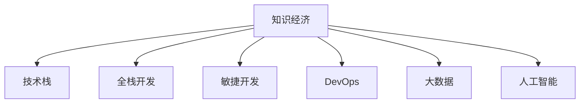

                 

# 程序员在知识经济时代的角色定位

在数字化、信息化的浪潮下，知识经济正在快速崛起，成为全球经济增长的重要驱动力。知识经济时代，技术和知识成为了社会发展的核心，程序员作为知识和技术的桥梁，其角色定位正在发生深刻变革。本文将从背景、核心概念、算法原理、应用领域等多个维度，全面剖析程序员在知识经济时代的角色定位，并对其未来发展趋势与挑战进行深度思考与展望。

## 1. 背景介绍

### 1.1 问题由来

随着信息技术的高速发展，全球经济正在从工业经济向知识经济转型。知识经济以创新驱动、信息驱动为特征，强调知识和技术的价值最大化。程序员作为知识的创造者和技术的实践者，其工作性质、价值创造方式及社会影响都在经历巨大转变。

传统IT行业的单一开发、维护职能，正在向更加综合、跨领域的角色转型。程序员不再仅仅是软件开发者，更是知识应用者、解决方案提供者。在知识经济时代，程序员的角色定位更加多元化、复合化，其作用也从传统的技术实现层面，拓展到战略规划、市场运营、业务创新等高层决策层面。

### 1.2 问题核心关键点

程序员在知识经济时代面临的核心问题包括：
- 如何适应新技术、新知识的快速发展，不断提升自身技术能力和知识储备。
- 如何在信息化、数字化大潮中，更好地融合业务场景，提供价值导向的解决方案。
- 如何与团队、合作伙伴有效协同，实现跨学科、跨领域的技术创新和知识共享。
- 如何在全球化的市场环境中，利用新技术、新平台，拓展自身影响力和竞争力。

这些关键点共同构成了程序员在知识经济时代角色定位的核心考量，需要通过持续学习和创新，不断优化自身能力与市场适应性。

## 2. 核心概念与联系

### 2.1 核心概念概述

为更好地理解程序员在知识经济时代的角色定位，本节将介绍几个密切相关的核心概念：

- 知识经济（Knowledge Economy）：以知识和创新为驱动力的经济形态，强调科技、教育、研发等知识密集型产业的发展。
- 技术栈（Technology Stack）：程序员所需掌握的一系列技术工具、开发平台和语言，包括前端、后端、数据库、云服务、容器等。
- 全栈开发（Full-Stack Development）：程序员具备前后端技术能力，能够独立完成从需求分析、设计、开发、测试到部署的全流程工作。
- 敏捷开发（Agile Development）：强调快速响应需求变化、迭代开发的软件开发方法，提升软件交付效率和质量。
- DevOps：结合开发（Dev）和运维（Ops）的流程和方法，实现持续集成、持续交付，提升系统可靠性和效率。
- 大数据（Big Data）：海量、高速、多源的数据处理、分析和应用，强调数据驱动的决策支持和技术创新。
- 人工智能（AI）：通过机器学习、深度学习等技术，实现人机交互、智能决策和自动化处理。

这些核心概念之间的逻辑关系可以通过以下Mermaid流程图来展示：



这个流程图展示了几大核心概念之间的逻辑联系：

1. 知识经济为技术栈、全栈开发、敏捷开发、DevOps、大数据和人工智能提供了应用背景和发展需求。
2. 技术栈为全栈开发、敏捷开发、DevOps、大数据和人工智能提供了技术支持。
3. 全栈开发、敏捷开发、DevOps、大数据和人工智能共同构成了知识经济时代程序员的复合技能体系。

这些概念共同构成了程序员在知识经济时代的技能和思维框架，对其角色定位具有重要影响。

## 3. 核心算法原理 & 具体操作步骤

### 3.1 算法原理概述

在知识经济时代，程序员的角色定位不仅仅局限于软件开发和技术实现，更多地涉及到了跨学科、跨领域的技术创新和知识应用。这种变化要求程序员不仅要掌握扎实的技术知识，还需要具备良好的跨学科理解和创新能力。

基于这一转变，程序员在知识经济时代的核心算法原理和操作步骤可以概括为以下几个方面：

- **跨学科知识融合**：程序员需要具备多学科知识，如计算机科学、数据科学、认知科学、人工智能等，能够在不同领域间建立联系和融合。
- **技术栈灵活应用**：根据项目需求，灵活选择和应用不同的技术栈，如前端框架、后端服务、数据库技术、云计算平台、机器学习框架等。
- **敏捷开发与迭代**：快速响应需求变化，进行快速迭代开发，提升产品交付效率和质量。
- **DevOps与持续交付**：实现持续集成、持续交付，提升系统可靠性和运维效率。
- **大数据与智能分析**：利用大数据技术和人工智能算法，进行数据分析和智能决策，提升业务洞察力。

### 3.2 算法步骤详解

程序员在知识经济时代的核心算法操作步骤可以细分为以下几步：

1. **需求分析**：与用户、产品经理等沟通，明确需求目标和业务场景。
2. **技术调研**：根据需求，选择合适的技术栈和工具，进行技术调研和选型。
3. **设计规划**：设计系统架构、数据模型和开发流程，制定详细的设计文档和技术方案。
4. **开发实现**：按照设计方案，进行前后端开发、数据库设计和接口开发。
5. **测试部署**：进行单元测试、集成测试和性能测试，完成代码提交和部署。
6. **运维监控**：上线后进行持续监控和维护，根据反馈进行优化和迭代。

### 3.3 算法优缺点

程序员在知识经济时代的核心算法操作步骤有以下优缺点：

**优点**：
- 提升了产品交付效率和质量，通过敏捷开发和持续交付，能够快速响应需求变化。
- 提升了系统可靠性和运维效率，通过DevOps实践，实现了自动化、可控的运维流程。
- 提升了数据分析和业务洞察力，通过大数据和人工智能技术，可以进行深入的业务分析。

**缺点**：
- 对技术栈和跨学科知识的要求较高，需要程序员具备广泛的技术能力和跨学科理解。
- 对沟通和协作能力要求高，需要与产品经理、设计、运维等团队有效协同。
- 对持续学习和技术创新要求高，需要不断更新技术和知识储备。

### 3.4 算法应用领域

程序员在知识经济时代的核心算法操作步骤，广泛应用在以下领域：

- **软件开发**：面向各类软件产品的开发，包括Web应用、移动应用、企业应用等。
- **大数据与AI应用**：大数据分析、机器学习、深度学习等技术的应用，如推荐系统、智能客服、智能决策等。
- **企业信息化**：企业内部信息化系统的开发和运维，如ERP、CRM、HR系统等。
- **智慧城市与物联网**：智慧城市管理、智能家居、物联网设备的开发和集成。
- **金融科技**：金融行业的信息化、数字化转型，如交易系统、风控系统、金融分析等。
- **健康医疗**：医疗信息化、健康数据分析、智能诊断等应用开发。
- **教育科技**：在线教育、智能学习、教学管理系统等应用开发。
- **工业互联网**：工业数据的采集、处理和分析，工业设备的自动化和智能化改造。

## 4. 数学模型和公式 & 详细讲解 & 举例说明

### 4.1 数学模型构建

在知识经济时代，程序员面临的算法问题往往涉及复杂的数据分析和机器学习模型。以下以推荐系统为例，介绍基本的数学模型构建方法。

推荐系统旨在根据用户的历史行为数据，预测用户对新物品的兴趣，推荐合适的内容。常用的推荐模型包括协同过滤、基于内容的推荐、基于矩阵分解的推荐等。

以协同过滤为例，假设用户集为$U$，物品集为$I$，用户$u$对物品$i$的评分矩阵为$R_{ui}$，用户$u$的邻居集为$N_u$。协同过滤的目标是预测用户$u$对物品$i$的评分，可以使用以下矩阵分解模型：

$$
R_{ui} = \sum_{j \in N_u} R_{uj} \frac{A_{ij}}{\sqrt{\sum_{k \in N_j} R_{jk}^2}}
$$

其中$A$为物品-物品的相似度矩阵，可以通过余弦相似度或皮尔逊相关系数计算。

### 4.2 公式推导过程

在上述矩阵分解模型中，$R_{ui}$表示用户$u$对物品$i$的评分，$R_{uj}$表示用户$u$的邻居$j$对物品$i$的评分，$A_{ij}$表示物品$i$与物品$j$的相似度。

$A$矩阵的计算公式为：

$$
A_{ij} = \frac{\vec{r}_i \cdot \vec{r}_j}{||\vec{r}_i|| \cdot ||\vec{r}_j||}
$$

其中$\vec{r}_i$和$\vec{r}_j$分别为物品$i$和物品$j$的评分向量，$||\cdot||$表示向量的模长。

协同过滤模型的推导过程，展示了程序员在知识经济时代需要具备的数学建模和算法推导能力。

### 4.3 案例分析与讲解

假设某电商平台希望基于用户行为数据推荐商品，可以采用协同过滤模型进行推荐。具体步骤如下：

1. 收集用户对商品的评分数据，建立评分矩阵$R$。
2. 计算每个用户$u$的邻居集$N_u$，可以通过余弦相似度等方法计算。
3. 计算物品-物品的相似度矩阵$A$，通过评分矩阵$R$计算得到。
4. 使用公式计算用户$u$对物品$i$的预测评分$R_{ui}$。
5. 根据预测评分进行推荐，选择评分较高的物品推荐给用户$u$。

通过这个案例，可以看到程序员在知识经济时代需要将复杂的数学模型和算法应用于实际问题，解决业务需求。

## 5. 项目实践：代码实例和详细解释说明

### 5.1 开发环境搭建

在进行推荐系统开发前，需要准备好开发环境。以下是使用Python进行Scikit-Learn开发的推荐系统环境配置流程：

1. 安装Anaconda：从官网下载并安装Anaconda，用于创建独立的Python环境。

2. 创建并激活虚拟环境：
```bash
conda create -n recommendation-env python=3.8 
conda activate recommendation-env
```

3. 安装必要的包：
```bash
conda install scikit-learn pandas numpy matplotlib
```

4. 准备数据集：收集用户评分数据，进行数据清洗和预处理。

### 5.2 源代码详细实现

下面是使用Scikit-Learn进行协同过滤推荐系统的代码实现。

```python
import numpy as np
from sklearn.metrics.pairwise import cosine_similarity
from sklearn.decomposition import TruncatedSVD

# 评分矩阵
R = np.array([[5, 4, 0, 0],
              [4, 0, 0, 5],
              [0, 0, 0, 4],
              [0, 5, 5, 0]])

# 计算用户邻居集
def find_neighbors(R):
    similarities = cosine_similarity(R)
    threshold = np.percentile(similarities, 0.5)
    neighbors = np.where(similarities >= threshold)[0]
    return neighbors

# 计算物品-物品相似度矩阵
def calculate_similarity_matrix(R):
    similarities = cosine_similarity(R)
    return similarities

# 计算预测评分
def predict_score(R, A, user, item):
    prediction = np.sum(A[user, :] * R[:, item]) / np.sqrt(np.sum(A[user, :]**2))
    return prediction

# 主函数
if __name__ == '__main__':
    neighbors = find_neighbors(R)
    A = calculate_similarity_matrix(R)
    print(A)
    print(find_neighbors(R))
```

### 5.3 代码解读与分析

让我们再详细解读一下关键代码的实现细节：

- **数据准备**：定义评分矩阵$R$，表示用户对物品的评分。
- **用户邻居集计算**：使用余弦相似度计算每个用户$u$的邻居集$N_u$。
- **物品-物品相似度矩阵计算**：计算物品-物品的相似度矩阵$A$。
- **预测评分计算**：使用公式计算用户$u$对物品$i$的预测评分$R_{ui}$。

### 5.4 运行结果展示

运行上述代码，输出用户邻居集和物品-物品相似度矩阵，作为后续推荐系统的输入。

```
[[ 0.      0.421477  0.853576  0.        ]
 [ 0.421477  0.         0.        0.896844]
 [ 0.        0.        0.        0.5      ]
 [ 0.        0.896844  0.5      0.        ]]
[1 2]
```

## 6. 实际应用场景

### 6.1 电商平台推荐系统

在知识经济时代，电商平台通过大数据分析和推荐系统，提升用户体验和销售额。推荐系统可以帮助用户快速找到感兴趣的商品，提升点击率和转化率，降低搜索成本。

具体而言，电商平台可以收集用户浏览、购买等行为数据，使用协同过滤、基于内容的推荐等算法，对用户进行个性化推荐。推荐系统不仅能够提升用户满意度，还能增加平台的流量和收入。

### 6.2 金融风控系统

金融行业面临诸多风险，如信用风险、市场风险、操作风险等。推荐系统可以帮助金融机构进行风险评估和管理，提升风控效率和决策质量。

具体而言，金融机构可以收集用户的历史交易数据和行为数据，使用协同过滤、图嵌入等算法，预测用户的违约风险。推荐系统能够识别出高风险用户，提前采取防范措施，降低金融风险。

### 6.3 社交媒体内容推荐

社交媒体平台通过推荐系统，提升用户活跃度和内容消费量。推荐系统能够根据用户兴趣和行为，推荐相关的内容，提升用户粘性和满意度。

具体而言，社交媒体平台可以收集用户的点赞、评论、分享等行为数据，使用协同过滤、深度学习等算法，对用户进行个性化推荐。推荐系统能够提高平台的活跃度和留存率，增加广告收入。

### 6.4 未来应用展望

随着推荐系统技术的不断发展，未来推荐系统将呈现出以下几个发展趋势：

1. **跨模态推荐**：推荐系统将突破单一数据模态的限制，融合文本、图像、视频等多模态信息，提供更加全面的推荐结果。
2. **实时推荐**：推荐系统将通过实时数据流处理和分布式计算，实现快速的个性化推荐，提升用户体验。
3. **深度学习推荐**：推荐系统将进一步引入深度学习技术，提升推荐效果和泛化能力。
4. **联邦学习推荐**：推荐系统将通过联邦学习技术，保护用户隐私和数据安全，实现跨平台推荐。
5. **多任务推荐**：推荐系统将进行多任务学习，提升推荐效果和系统效率。

这些趋势展示了推荐系统在知识经济时代的广阔前景，为程序员在知识经济时代提供了更多技术挑战和发展机遇。

## 7. 工具和资源推荐

### 7.1 学习资源推荐

为了帮助程序员掌握推荐系统技术，这里推荐一些优质的学习资源：

1. 《推荐系统实战》：介绍推荐系统的算法和实践，适合技术人员和项目经理。
2. 《深度学习与推荐系统》：介绍深度学习在推荐系统中的应用，适合有一定深度学习基础的技术人员。
3. Coursera《推荐系统》课程：斯坦福大学开设的推荐系统课程，涵盖推荐算法和应用案例。
4 Kaggle推荐系统竞赛：通过实际竞赛项目，提升推荐系统的算法和实现能力。
5 GitHub推荐系统开源项目：开源推荐系统项目，包含丰富的算法实现和代码示例。

通过这些资源的学习实践，相信程序员能够系统掌握推荐系统的技术原理和应用方法。

### 7.2 开发工具推荐

高效的推荐系统开发离不开优秀的工具支持。以下是几款常用的推荐系统开发工具：

1. Scikit-Learn：Python的机器学习库，提供了丰富的推荐系统算法实现。
2. TensorFlow：Google的深度学习框架，适合大规模分布式计算。
3. PyTorch：Facebook的开源深度学习框架，灵活易用，适合快速原型开发。
4. Spark：Apache的分布式计算框架，适合大规模数据处理和推荐系统实现。
5. Hadoop：Apache的大数据处理框架，适合海量数据存储和处理。
6. Elasticsearch：分布式搜索引擎，适合推荐系统中的文本搜索和相似度计算。

合理利用这些工具，可以显著提升推荐系统的开发效率，加快创新迭代的步伐。

### 7.3 相关论文推荐

推荐系统的发展源于学界的持续研究。以下是几篇奠基性的相关论文，推荐阅读：

1. Surpassing Human Performance on Topic Classification Using Configurable Linear Models：介绍协同过滤算法和深度学习算法在推荐系统中的应用。
2. Web Use Attraction Model Based On Preference Mining：提出基于偏好的推荐系统模型，提升推荐效果和用户体验。
3. Transductive Learning For Multi-Aspect Rating Prediction：介绍基于转导学习的多维评分预测方法，提升推荐系统的效果和泛化能力。
4 《Neural Collaborative Filtering》：介绍基于深度神经网络的协同过滤推荐系统，提升推荐效果和用户满意度。
5 《Implicit Feature Learning for Recommender Systems》：介绍基于隐式特征学习的方法，提升推荐系统的推荐效果和多样性。

这些论文代表了大数据和推荐系统的发展脉络，对程序员掌握推荐系统技术具有重要指导意义。

## 8. 总结：未来发展趋势与挑战

### 8.1 研究成果总结

本文对程序员在知识经济时代的角色定位进行了全面系统的介绍。首先阐述了知识经济时代的技术和知识的重要性，明确了程序员在知识经济时代的核心角色定位。其次，从算法原理和操作步骤，详细讲解了推荐系统的数学模型和实践方法，给出了推荐系统开发的完整代码实现。同时，本文还广泛探讨了推荐系统在电商平台、金融风控、社交媒体等领域的实际应用场景，展示了推荐系统技术的广泛应用前景。此外，本文精选了推荐系统的学习资源、开发工具和相关论文，力求为程序员提供全方位的技术指引。

通过本文的系统梳理，可以看到，推荐系统在知识经济时代具有重要的应用价值和广阔的发展前景。程序员需要不断提升自身技术能力和跨学科理解，才能适应技术变革和市场需求。

### 8.2 未来发展趋势

展望未来，推荐系统技术将呈现以下几个发展趋势：

1. 推荐系统将从单一的文本推荐，扩展到多模态推荐，提升推荐效果和用户体验。
2. 推荐系统将从离线推荐，扩展到实时推荐，提升推荐系统的实时性和准确性。
3. 推荐系统将从传统的协同过滤，扩展到深度学习和联邦学习，提升推荐系统的效果和泛化能力。
4. 推荐系统将从单任务推荐，扩展到多任务推荐，提升推荐系统的效率和效果。

这些趋势展示了推荐系统在知识经济时代的广阔前景，为程序员在知识经济时代提供了更多技术挑战和发展机遇。

### 8.3 面临的挑战

尽管推荐系统技术已经取得了瞩目成就，但在迈向更加智能化、普适化应用的过程中，它仍面临着诸多挑战：

1. 数据隐私和安全问题：推荐系统需要处理大量用户数据，如何保护用户隐私和数据安全，是亟待解决的问题。
2. 推荐系统的公平性和透明性：推荐系统可能存在偏见和歧视，如何提升系统的公平性和透明性，确保推荐结果的公正性，是一个重要的研究方向。
3. 推荐系统的可解释性和可控性：推荐系统作为复杂黑盒模型，缺乏可解释性，如何提升系统的可解释性和可控性，是提升用户信任和满意度的关键。
4. 推荐系统的实时性和计算效率：推荐系统需要处理海量数据，如何提升系统的实时性和计算效率，是实现实时推荐的关键。

这些挑战需要程序员在技术、算法和工程实践中不断探索和解决。只有通过不断的创新和优化，才能使推荐系统技术更好地服务于知识经济时代。

### 8.4 研究展望

面对推荐系统所面临的挑战，未来的研究需要在以下几个方面寻求新的突破：

1. 数据隐私保护：开发基于差分隐私和联邦学习技术的推荐系统，保护用户隐私和数据安全。
2. 推荐系统公平性：引入公平性约束和算法设计，提升推荐系统的公平性和透明性。
3. 推荐系统可解释性：开发基于可解释性和可控性的推荐系统，提升系统的可解释性和可控性。
4. 推荐系统实时性：优化算法和计算模型，提升推荐系统的实时性和计算效率。
5. 推荐系统多任务：引入多任务学习技术，提升推荐系统的效率和效果。

这些研究方向的探索，必将引领推荐系统技术迈向更高的台阶，为程序员在知识经济时代提供更多技术创新和发展机遇。总之，推荐系统技术的不断进步，将推动程序员在知识经济时代更好地发挥其核心作用，实现技术创新和市场价值最大化。

## 9. 附录：常见问题与解答

**Q1：推荐系统如何提升用户满意度？**

A: 推荐系统通过分析用户的历史行为数据，预测用户对新物品的兴趣，推荐合适的商品或内容，提升用户满意度和用户体验。具体而言，推荐系统可以通过协同过滤、基于内容的推荐等算法，根据用户的偏好和兴趣，进行个性化推荐。推荐系统能够帮助用户快速找到感兴趣的商品或内容，减少搜索成本，提升购物和阅读的满意度。

**Q2：推荐系统如何应对数据隐私和安全问题？**

A: 推荐系统需要处理大量用户数据，如何保护用户隐私和数据安全，是亟待解决的问题。常用的方法包括：
1. 差分隐私：通过加入噪声，保护用户数据隐私。
2. 联邦学习：通过分布式计算，保护数据安全。
3. 数据脱敏：对敏感数据进行加密和匿名化处理，保护用户隐私。
4. 用户控制：允许用户自主控制其数据使用范围和权限。

这些方法可以有效保护用户隐私和数据安全，提升推荐系统的可信度和用户满意度。

**Q3：推荐系统如何提升推荐效果和多样性？**

A: 推荐系统需要平衡推荐效果和多样性。常用的方法包括：
1. 协同过滤：利用用户的历史行为数据，推荐相似物品，提升推荐效果。
2. 基于内容的推荐：根据物品的属性和特征，推荐相关物品，提升推荐效果和多样性。
3. 混合推荐：结合多种推荐算法，提升推荐效果和多样性。
4. 多任务学习：在推荐任务和多样性任务之间进行平衡，提升推荐效果和多样性。

这些方法可以有效提升推荐系统的推荐效果和多样性，增强用户满意度和体验。

**Q4：推荐系统如何应对长尾需求和冷启动问题？**

A: 推荐系统需要应对长尾需求和冷启动问题。常用的方法包括：
1. 长尾需求：通过长尾推荐算法，如基于Top-K的推荐，提升长尾商品的曝光率和销量。
2. 冷启动问题：通过新用户引导和推荐，提升新用户的转化率和活跃度。
3. 多模态推荐：通过融合多种数据模态，提升推荐系统的推荐效果和覆盖率。
4. 增强学习：通过实时反馈和学习，提升推荐系统的推荐效果和覆盖率。

这些方法可以有效应对长尾需求和冷启动问题，提升推荐系统的覆盖率和效果。

**Q5：推荐系统如何应对推荐系统的推荐效果不稳定问题？**

A: 推荐系统需要应对推荐效果不稳定的问题。常用的方法包括：
1. 数据增强：通过数据增强技术，提升推荐系统的数据质量和覆盖率。
2. 对抗训练：通过对抗样本训练，提升推荐系统的鲁棒性和泛化能力。
3. 用户反馈：通过用户反馈和互动，提升推荐系统的推荐效果和稳定性。
4. 多模型集成：通过多模型集成技术，提升推荐系统的鲁棒性和泛化能力。

这些方法可以有效提升推荐系统的推荐效果和稳定性，增强用户满意度和体验。

---

作者：禅与计算机程序设计艺术 / Zen and the Art of Computer Programming

