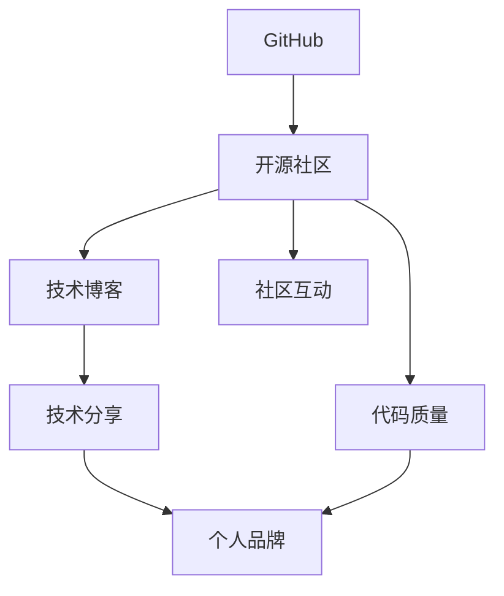

                 

# 程序员如何利用GitHub进行知识营销

> 关键词：GitHub,知识营销,开源社区,技术博客,社区互动,代码质量,技术分享,个人品牌

## 1. 背景介绍

### 1.1 问题由来
在当前高度竞争的互联网行业中，技术更新日新月异，个人的技术沉淀和知识输出能力，成为了其能否脱颖而出的关键。如何有效地进行知识营销，成为程序员提升自身影响力的重要话题。GitHub作为全球最大的开源社区，不仅提供了一个展示个人技术的舞台，更是技术交流和合作的最佳平台。因此，本文将探讨程序员如何利用GitHub进行知识营销，提升个人品牌影响力，赢得更广阔的发展机会。

## 2. 核心概念与联系

### 2.1 核心概念概述

为了更好地理解如何在GitHub上进行知识营销，我们首先需明确几个关键概念：

- **GitHub**：全球最大的开源社区，提供代码托管、版本控制、代码审查等功能，是程序员展示技术、合作交流的最佳平台。
- **知识营销**：通过分享技术知识、解答技术问题、发布技术文章等形式，在开源社区中建立个人品牌，吸引同行关注，提升自身影响力。
- **开源社区**：由程序员自发组成的开源项目、代码交流、问题解答社区，是知识营销的重要土壤。
- **技术博客**：程序员在GitHub上的技术文章，是展示技术能力和知识深度的重要途径。
- **社区互动**：积极参与开源项目，进行代码审查、问题解答、评论交流，是提升个人品牌影响力的关键。
- **代码质量**：代码的质量和规范性，是展示技术能力和专业性的重要依据。
- **技术分享**：在GitHub上分享技术文章、开源项目、经验总结，是知识营销的核心环节。
- **个人品牌**：通过在开源社区中的技术贡献和知识分享，建立个人品牌，赢得同行尊重，打开职业发展新路径。

这些概念之间的联系可以用以下Mermaid流程图来展示：



此流程图展示了GitHub上的知识营销过程：通过展示代码质量、参与技术分享、社区互动，建立个人品牌，吸引同行关注，提升自身影响力。

## 3. 核心算法原理 & 具体操作步骤

### 3.1 算法原理概述

基于GitHub的知识营销，本质上是一个通过技术分享和社区互动，逐步建立个人品牌的过程。其核心算法原理包括：

1. **技术分享算法**：通过发布技术博客、开源项目、技术总结等形式，展示个人的技术深度和广度。
2. **社区互动算法**：积极参与开源项目代码审查、问题解答、评论交流等社区互动，建立声誉和信任。
3. **代码质量控制算法**：确保开源项目的代码质量和规范性，展示技术专业性。

### 3.2 算法步骤详解

基于GitHub的知识营销步骤如下：

**Step 1: 选择合适的开源项目**
- 寻找与自身技术领域相关的开源项目，加入并贡献代码。
- 优先选择活跃度高、社区文化积极的项目，便于建立良好的社区关系。

**Step 2: 建立技术博客**
- 在GitHub上创建技术博客，记录个人技术学习、项目开发、问题解答等内容。
- 定期更新，保持活跃度，吸引关注。

**Step 3: 发布高质量的开源项目**
- 确保开源项目的代码质量高、文档齐全，遵循行业最佳实践。
- 通过代码审查、社区反馈等机制持续改进项目。

**Step 4: 积极参与社区互动**
- 在开源项目中进行代码审查、问题解答、评论交流等互动。
- 关注社区动态，及时回复问题，提升活跃度和影响力。

**Step 5: 分享技术文章**
- 在GitHub的技术博客上发布技术文章，展示技术深度和广度。
- 利用社交媒体、技术社区等渠道，进行技术分享，吸引更多关注。

**Step 6: 建立个人品牌**
- 通过持续的技术分享和社区互动，建立个人品牌，赢得同行尊重。
- 在GitHub上的技术博客和个人仓库中，使用一致的用户名和头像，形成统一的个人形象。

### 3.3 算法优缺点

基于GitHub的知识营销方法具有以下优点：
1. **展示平台**：GitHub作为全球最大的开源社区，为技术分享和社区互动提供了广阔的舞台。
2. **社区支持**：开源社区的活跃度和社区文化，是技术交流和合作的重要保障。
3. **技术沉淀**：通过技术分享和项目贡献，沉淀个人技术积累，形成知识资产。
4. **提升影响力**：在社区中的技术贡献和互动，有助于提升个人品牌影响力，吸引更多合作机会。

同时，该方法也存在一定的局限性：
1. **时间投入**：需要持续的技术分享和社区互动，需要耗费大量时间和精力。
2. **竞争激烈**：开源社区竞争激烈，如何脱颖而出需要不断创新和优化。
3. **技术门槛**：要求较高的技术水平和良好的代码规范性，对个人能力有较高要求。
4. **资源限制**：对于小型项目，资源有限，难以支撑大规模的技术分享和社区互动。

尽管存在这些局限性，但就目前而言，基于GitHub的知识营销方法仍然是程序员提升个人品牌影响力的重要途径。未来相关研究的重点在于如何进一步提升技术分享的广度和深度，同时兼顾社区互动的效率和质量。

### 3.4 算法应用领域

基于GitHub的知识营销方法在多个领域都得到了广泛应用，例如：

- **技术开发者**：通过开源项目和代码分享，展示技术能力和专业性，赢得同行尊重。
- **创业公司**：利用开源项目吸引技术人才，提升技术栈质量，加速产品开发。
- **技术博客作者**：在GitHub上建立个人博客，分享技术文章，吸引读者关注。
- **技术教育者**：通过开源项目和社区互动，传授技术知识，培养技术人才。
- **技术顾问**：在开源社区中展示技术深度和广度，吸引客户合作机会。

这些应用场景展示了GitHub知识营销的强大影响力，相信未来在更多领域中，基于GitHub的知识营销将发挥更加重要的作用。

## 4. 数学模型和公式 & 详细讲解  
### 4.1 数学模型构建

本节将使用数学语言对基于GitHub的知识营销过程进行更加严格的刻画。

假设开源社区中有N个技术开发者，每个人在GitHub上有C个代码项目，每个项目贡献P篇技术文章，社区活跃度为A，个人在社区中的影响力为I，则知识营销的效果可以通过以下数学模型进行描述：

$$
E = \sum_{i=1}^{N} \left( \sum_{j=1}^{C} \left( \sum_{k=1}^{P} \frac{W_{k,i,j}}{A} \right) \frac{I_{i}}{N} \right)
$$

其中：
- $E$：知识营销的综合效果。
- $N$：开源社区中的开发者数量。
- $C$：每个开发者在GitHub上的代码项目数量。
- $P$：每个代码项目贡献的技术文章数量。
- $W_{k,i,j}$：第$i$个开发者在项目$j$中第$k$篇文章的影响权重。
- $A$：社区活跃度，社区中每日活跃开发者数量。
- $I_{i}$：第$i$个开发者在社区中的影响力。

通过该模型，可以计算知识营销的综合效果，量化技术分享和社区互动对影响力的贡献。

### 4.2 公式推导过程

为了更好地理解上述模型，我们将其进行推导：

$$
E = \sum_{i=1}^{N} \left( \sum_{j=1}^{C} \left( \sum_{k=1}^{P} \frac{W_{k,i,j}}{A} \right) \frac{I_{i}}{N} \right)
$$

令$S_{i,j}$表示开发者$i$在项目$j$上的技术贡献度，则有：

$$
S_{i,j} = \sum_{k=1}^{P} \frac{W_{k,i,j}}{A}
$$

将其代入$E$的表达式，得：

$$
E = \sum_{i=1}^{N} \left( \frac{I_{i}}{N} \sum_{j=1}^{C} S_{i,j} \right)
$$

通过计算每个开发者$i$在所有项目$j$上的技术贡献度总和，乘以其在社区中的影响力$I_{i}$，即可计算知识营销的综合效果$E$。

### 4.3 案例分析与讲解

假设某开源社区中有100名开发者，每人贡献5个代码项目，每个项目发布10篇技术文章，社区每日活跃开发者50人，某开发者在社区中的影响力为100。根据上述模型，其知识营销效果计算如下：

$$
E = \frac{100}{100} \times \left( \sum_{j=1}^{5} \sum_{k=1}^{10} \frac{W_{k,i,j}}{50} \right)
$$

其中$W_{k,i,j}$的取值依据技术文章的影响权重进行计算，可通过社区投票、评论数量、点赞数量等方式进行评估。

## 5. 项目实践：代码实例和详细解释说明
### 5.1 开发环境搭建

在进行GitHub知识营销实践前，我们需要准备好开发环境。以下是使用Python进行GitHub开发的环境配置流程：

1. 安装Git：从官网下载并安装Git客户端。
2. 创建GitHub账号：访问GitHub官网注册账号，并进行身份验证。
3. 安装GitHub Desktop：从官网下载安装GitHub Desktop。
4. 安装GitHub相关扩展：安装GitHub官方扩展程序，如GitHub for VSCode、GitHub CLI等。
5. 创建仓库：在GitHub上创建一个新的代码仓库，并设置权限和协作方式。

完成上述步骤后，即可在本地开发环境中进行GitHub知识营销的实践。

### 5.2 源代码详细实现

下面我们以GitHub上的技术博客发布为例，给出使用Python进行技术博客发布的代码实现。

```python
from github import Github
from github import InputGitHubError

# 创建一个GitHub客户端
g = Github('username', 'password')

# 创建一个新的技术博客文章
repo = g.get_repo('username/blog')
blog_post = repo.create_file(
    branch='main',
    path='blog/README.md',
    message='New blog post',
    content=''
)

# 检查发布是否成功
try:
    blog_post.commit(
        message='Update blog post',
        committer='username'
    )
    print('博客发布成功')
except InputGitHubError as e:
    print('博客发布失败', e)
```

以上代码实现了在GitHub上创建新的技术博客文章。可以看到，GitHub API提供了丰富的API接口，方便进行代码操作和知识分享。

### 5.3 代码解读与分析

让我们再详细解读一下关键代码的实现细节：

**GitHub客户端创建**：
- 使用GitHub官方提供的Python客户端库，通过用户名和密码进行登录。
- 登录后，创建GitHub客户端实例，用于后续的API调用。

**技术博客文章创建**：
- 获取与GitHub账号关联的仓库，创建新的技术博客文章。
- 指定文章路径、分支、提交消息、提交者等参数，并调用API接口进行创建。
- 发布成功后，自动触发`commit`操作，将更改提交到仓库中。

**发布成功判断**：
- 通过捕获`InputGitHubError`异常，判断博客发布是否成功。
- 成功则打印提示信息，失败则输出异常信息。

可以看到，使用GitHub官方API进行技术博客发布，操作简洁高效。

## 6. 实际应用场景

### 6.1 技术开发者

对于技术开发者而言，GitHub上的知识营销可以显著提升个人品牌影响力，赢得更多的合作机会。例如，某开发者通过在GitHub上发布开源项目，贡献技术文章，积极参与社区互动，逐渐在社区中建立起声誉，吸引更多同行关注和合作机会。

### 6.2 创业公司

对于创业公司而言，利用GitHub的知识营销可以提升技术栈质量，吸引技术人才，加速产品开发。例如，某创业公司通过在GitHub上发布高质量的代码项目，吸引大量技术开发者贡献代码，快速迭代产品功能。

### 6.3 技术博客作者

对于技术博客作者而言，GitHub上的技术博客可以吸引更多读者关注，提升博客阅读量和影响力。例如，某技术博客作者在GitHub上发布技术文章，通过社交媒体、社区平台进行分享，迅速吸引大量读者，提升博客访问量。

### 6.4 技术教育者

对于技术教育者而言，GitHub上的技术分享和互动可以传授技术知识，培养技术人才。例如，某技术教育者在GitHub上分享技术博客，解答读者问题，吸引技术爱好者参与讨论，提升教学效果。

### 6.5 技术顾问

对于技术顾问而言，GitHub上的技术分享和互动可以展示技术深度和广度，吸引客户合作机会。例如，某技术顾问在GitHub上分享技术文章，解答客户问题，展示技术专业性，赢得客户信任。

这些应用场景展示了GitHub知识营销的强大影响力，相信未来在更多领域中，基于GitHub的知识营销将发挥更加重要的作用。

## 7. 工具和资源推荐

### 7.1 学习资源推荐

为了帮助开发者系统掌握GitHub知识营销的理论基础和实践技巧，这里推荐一些优质的学习资源：

1. **GitHub官方文档**：GitHub提供的官方文档，包含丰富的API接口和开发指南，是GitHub知识营销的必备资料。
2. **GitHub技术博客**：GitHub上大量技术开发者分享的博客文章，涵盖开源项目、技术分享、社区互动等内容，是学习的绝佳资源。
3. **GitHub Community**：GitHub上的社区讨论，涵盖各种技术话题和GitHub使用技巧，是学习和交流的重要平台。
4. **GitHub Education**：GitHub提供的教育资源，包括官方教程、认证课程、在线讲座等，帮助开发者提升GitHub技能。
5. **GitHub Explore**：GitHub上的代码探索工具，可以查找高质量的开源项目和代码示例，为技术分享提供灵感。

通过对这些资源的学习实践，相信你一定能够快速掌握GitHub知识营销的精髓，并用于解决实际的开发问题。

### 7.2 开发工具推荐

高效的开发离不开优秀的工具支持。以下是几款用于GitHub知识营销开发的常用工具：

1. **GitHub Desktop**：GitHub提供的桌面工具，方便进行代码推送、项目管理和社区互动。
2. **GitHub CLI**：GitHub提供的命令行工具，用于自动化代码操作和社区互动。
3. **GitHub for VSCode**：GitHub与VSCode的官方扩展程序，提供了代码推送、项目管理和社区互动等功能。
4. **GitHub Actions**：GitHub提供的工作流服务，用于自动化CI/CD流程，提升开发效率。
5. **GitHub Pages**：GitHub提供的静态网站托管服务，方便发布技术博客和个人项目。
6. **GitHub Community**：GitHub上的社区讨论平台，涵盖各种技术话题和GitHub使用技巧，是学习和交流的重要平台。

合理利用这些工具，可以显著提升GitHub知识营销的开发效率，加快创新迭代的步伐。

### 7.3 相关论文推荐

GitHub知识营销的发展源于学界的持续研究。以下是几篇奠基性的相关论文，推荐阅读：

1. **"Social Media for Software Engineering: A Review and Research Agenda"**：该论文系统回顾了社交媒体在软件开发中的应用，为GitHub知识营销提供了理论基础。
2. **"Open Source Community Building: A Study of GitHub Community Activities"**：该论文分析了GitHub社区活动的特点和影响，揭示了社区互动对技术分享的重要性。
3. **"Effective Software Design: Industrial Engineering"**：该论文探讨了开源项目的设计和管理，为GitHub知识营销提供了实践指导。
4. **"The Impact of GitHub on Software Development Practices"**：该论文研究了GitHub对软件开发实践的影响，展示了GitHub在技术分享和社区互动中的重要作用。
5. **"Understanding GitHub Community: A Quantitative Study"**：该论文通过数据分析，揭示了GitHub社区的组成和互动模式，为知识营销提供了数据支持。

这些论文代表了大语言模型微调技术的发展脉络。通过学习这些前沿成果，可以帮助研究者把握学科前进方向，激发更多的创新灵感。

## 8. 总结：未来发展趋势与挑战

### 8.1 总结

本文对基于GitHub的知识营销方法进行了全面系统的介绍。首先阐述了GitHub在技术分享和社区互动中的重要作用，明确了知识营销在提升个人品牌影响力方面的独特价值。其次，从原理到实践，详细讲解了知识营销的数学模型和具体操作步骤，给出了GitHub知识营销的完整代码实例。同时，本文还广泛探讨了知识营销在多个领域的应用前景，展示了GitHub知识营销的强大影响力。

通过本文的系统梳理，可以看到，基于GitHub的知识营销方法正在成为程序员提升个人品牌影响力的重要途径。GitHub社区的活跃度和文化氛围，为技术分享和社区互动提供了广阔的舞台。开发者通过持续的技术分享和社区互动，能够显著提升自身影响力，赢得更多合作机会，拓展职业发展新路径。

### 8.2 未来发展趋势

展望未来，GitHub上的知识营销将呈现以下几个发展趋势：

1. **技术分享多样化**：未来知识营销将更加注重技术分享的多样化，涵盖代码、文章、视频、直播等多种形式。
2. **社区互动实时化**：通过实时社区互动工具，如GitHub Community、Slack等，提高社区活跃度和互动效率。
3. **技术合作深入化**：通过GitHub上的项目协作和代码审查，促进技术合作和知识共享。
4. **个人品牌立体化**：结合社交媒体、博客、视频等多渠道进行技术分享，构建多维度的个人品牌。
5. **社区治理规范化**：通过社区规范和治理机制，维护社区秩序，提升技术分享质量。
6. **技术应用智能化**：利用AI技术，如自然语言处理、推荐系统等，提升技术分享的精准度和用户体验。

这些趋势将进一步推动GitHub知识营销的发展，为技术开发者提供更广阔的展示平台和合作机会。

### 8.3 面临的挑战

尽管GitHub上的知识营销已经取得了显著成效，但在迈向更加智能化、普适化应用的过程中，它仍面临着诸多挑战：

1. **时间投入**：持续的技术分享和社区互动需要大量时间和精力，对个人能力有较高要求。
2. **竞争激烈**：开源社区竞争激烈，如何脱颖而出需要不断创新和优化。
3. **资源限制**：对于小型项目，资源有限，难以支撑大规模的技术分享和社区互动。
4. **社区管理**：社区中可能存在不规范行为，如何维护社区秩序，提升技术分享质量，还需要进一步改进。
5. **技术沉淀**：如何利用GitHub上的知识沉淀，形成长期的技术积累和知识资产，还需进一步探索。

尽管存在这些挑战，但通过持续的技术分享和社区互动，相信GitHub上的知识营销将继续发挥重要作用，为技术开发者提供更广阔的发展空间。未来相关研究的重点在于如何进一步提升技术分享的广度和深度，同时兼顾社区互动的效率和质量。

### 8.4 研究展望

面对GitHub知识营销所面临的挑战，未来的研究需要在以下几个方面寻求新的突破：

1. **技术分享自动化**：利用AI技术，自动生成技术文章、代码示例，提升技术分享效率。
2. **社区互动智能化**：引入推荐系统、情感分析等技术，提高社区互动的精准度和用户体验。
3. **个人品牌多渠道**：结合社交媒体、博客、视频等多渠道进行技术分享，构建多维度的个人品牌。
4. **技术合作平台化**：通过GitHub上的平台机制，促进技术开发者之间的合作和知识共享。
5. **社区治理规范化**：建立社区规范和治理机制，维护社区秩序，提升技术分享质量。

这些研究方向将引领GitHub知识营销向更深层次发展，为技术开发者提供更广阔的展示平台和合作机会。只有勇于创新、敢于突破，才能不断拓展GitHub知识营销的边界，推动技术开发者在开源社区中持续成长。

## 9. 附录：常见问题与解答

**Q1：GitHub知识营销是否适用于所有技术开发者？**

A: 是的，GitHub知识营销对技术开发者广泛适用，无论其技术领域和项目规模。通过持续的技术分享和社区互动，所有技术开发者都能在GitHub上建立个人品牌，提升影响力。

**Q2：GitHub知识营销需要投入大量时间，如何平衡工作和学习？**

A: 时间投入确实是大规模知识营销的挑战之一，但可以通过高效的时间管理、优先级排序等方式，平衡工作和学习。例如，将GitHub知识营销视为一种技术积累和职业发展的长期投资，在保证基本工作的同时，逐步提升影响力。

**Q3：GitHub知识营销是否需要具备高超的编程能力？**

A: 虽然高质量的技术分享和代码项目需要一定的编程能力，但只要具备良好的学习能力和持续的技术积累，任何人都可以尝试GitHub知识营销，逐步提升自身影响力。

**Q4：GitHub知识营销如何避免垃圾代码和无意义的技术分享？**

A: 避免垃圾代码和无意义的技术分享，需要从以下几个方面入手：
1. 确保代码质量和规范性，遵循行业最佳实践。
2. 关注技术文章和项目的实用性，避免过度宣传。
3. 积极参与社区互动，及时反馈和改进。
4. 利用GitHub提供的质量控制工具，如代码审查、社区评分等。

**Q5：GitHub知识营销是否需要频繁发布？**

A: 频繁发布并不是知识营销的关键，而是持续的技术积累和社区互动。持续的技术分享和社区互动，才能赢得同行尊重，提升个人品牌影响力。

这些问题的回答，展示了GitHub知识营销的可行性和实践技巧，相信通过不断的探索和实践，技术开发者可以在GitHub上实现自身价值的最大化，赢得更多的合作机会和发展空间。

---

作者：禅与计算机程序设计艺术 / Zen and the Art of Computer Programming

