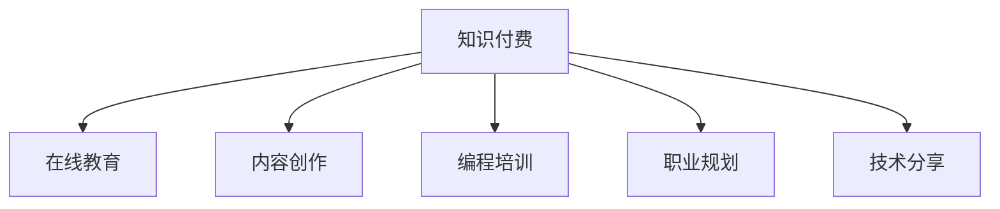

                 

# 程序员如何利用知识付费实现被动收入

> 关键词：知识付费, 被动收入, 在线教育, 内容创作, 知识变现, 编程培训, 职业规划, 技术分享, 知识付费平台, 知识产品

## 1. 背景介绍

### 1.1 问题由来
在互联网快速发展的今天，知识付费已经成为许多人获取信息和知识的主要方式。面对日新月异的科技发展，个人和企业在不断学习新知识的同时，也逐渐意识到终身学习的价值。程序员作为社会中的技术主力，他们对新知识和新技术的渴求更加强烈，因此，通过知识付费渠道，将自己的专业知识和经验变现，成为一种普遍而有效的职业路径。

### 1.2 问题核心关键点
知识付费是一种通过出售知识和信息来获取收益的方式。对于程序员而言，知识付费不仅仅是一种收入方式，更是一种展示个人价值、提升专业技能和扩展职业边界的机会。基于此，本文旨在探讨程序员如何利用知识付费实现被动收入，实现技术和职业的双重提升。

## 2. 核心概念与联系

### 2.1 核心概念概述

为更好地理解程序员如何利用知识付费实现被动收入，本节将介绍几个关键概念：

- **知识付费**：通过付费形式获取知识和服务的方式。近年来，知识付费平台和课程数量激增，形式也从传统的书籍、视频走向更加互动、个性化的模式。
- **被动收入**：通过事先的努力和投资，在未来无需持续劳动即可获得稳定的收入。与传统的主动工作方式不同，被动收入能更好地实现时间和精力的自由。
- **在线教育**：通过互联网进行的教育和培训活动。在线教育打破了时间和空间的限制，为知识分享和获取提供了新的途径。
- **内容创作**：以文字、视频、音频等形式，创作和发布原创内容，提供价值和信息。内容创作是知识付费的基础。
- **编程培训**：面向程序员的编程技能培训课程。通过系统化的教学，提升编程能力，解决实际问题。
- **职业规划**：帮助个人制定和发展职业路径，实现个人职业成长。
- **技术分享**：分享技术知识、经验和案例，推动技术交流和创新。

这些概念之间的关系可以通过以下Mermaid流程图来展示：



这个流程图展示了大语言模型的核心概念及其之间的关系：

1. 知识付费是通过在线教育、内容创作等形式实现。
2. 在线教育提供了编程培训和职业规划的机会。
3. 内容创作和技术分享是知识付费的重要组成部分。

## 3. 核心算法原理 & 具体操作步骤
### 3.1 算法原理概述

程序员利用知识付费实现被动收入的原理主要基于以下几个步骤：

1. **内容制作**：制作和发布高质量的编程培训、职业规划、技术分享等内容。
2. **平台选择**：选择合适的内容分发平台，如Udemy、Coursera、Bilibili等。
3. **内容营销**：通过社交媒体、博客、视频等方式推广内容，吸引用户关注和付费。
4. **用户互动**：与用户进行互动，解答问题，更新内容，建立良好的用户关系。
5. **收入获取**：通过平台分成、广告收入、会员订阅等方式获取被动收入。

### 3.2 算法步骤详解

以下我们将详细介绍这些步骤的详细步骤：

#### 步骤1：内容制作
- **需求分析**：确定你想要教授的编程语言、框架、工具、技术栈等。
- **内容规划**：制定课程大纲，规划教学内容，包括理论、实践、项目案例等。
- **内容创作**：使用Markdown、ReMarkit、GitHub等工具，创作和录制视频教程、文字教程、代码示例等。
- **测试优化**：在发布前进行测试，优化内容，确保高质量和易理解性。

#### 步骤2：平台选择
- **平台调研**：研究各个知识付费平台的特点、收费模式、用户规模等。
- **平台申请**：注册并申请平台账号，提交相关资质和课程内容。
- **平台审核**：根据平台要求，提交课程材料，等待审核通过。
- **平台发布**：审核通过后，发布课程。

#### 步骤3：内容营销
- **社交媒体**：通过微信公众号、Twitter、LinkedIn等社交平台，发布课程简介和预告。
- **博客文章**：撰写相关技术文章，提升博客SEO，增加曝光率。
- **视频分享**：发布短视频，吸引用户关注。
- **社区互动**：在技术社区、论坛和讨论组中分享内容，获取反馈和推荐。

#### 步骤4：用户互动
- **用户反馈**：收集用户反馈，及时调整课程内容和教学方式。
- **互动教学**：通过评论区、Q&A环节、直播等方式，与用户进行互动。
- **内容更新**：根据用户需求和技术更新，定期更新课程内容，保持课程的时效性。

#### 步骤5：收入获取
- **平台分成**：根据课程的访问量和用户付费，获取平台分成。
- **广告收入**：通过内容页面展示广告，获取广告收入。
- **会员订阅**：推出高级会员订阅服务，提供增值内容和专属优惠。

### 3.3 算法优缺点

利用知识付费实现被动收入的方法具有以下优点：

- **灵活自由**：相较于传统的主动工作方式，被动收入方式更加灵活自由，不受时间和地点的限制。
- **时间复用**：前期投入一定时间和精力制作内容后，后期可通过持续更新和互动，不断获得收益。
- **知识传播**：通过分享知识和经验，提升自身价值，同时帮助他人解决问题，实现双赢。

同时，该方法也存在一些缺点：

- **前期投入高**：高质量内容的制作和发布需要耗费大量时间和精力。
- **市场竞争大**：知识付费市场竞争激烈，需要不断提升内容和推广技巧。
- **用户粘性差**：用户付费意愿受多种因素影响，单次付费和续订都存在不确定性。
- **持续更新**：知识和技术不断发展，课程内容需要不断更新，保持时效性。

### 3.4 算法应用领域

知识付费方法在程序员职业发展中具有广泛的应用，以下是几个典型的应用场景：

- **技术培训**：通过制作和发布编程语言、框架、工具等技术的培训课程，帮助他人提升技能。
- **项目咨询**：提供技术方案咨询、项目实施指导等服务，获取项目咨询费。
- **技术博客**：开设技术博客，分享技术经验，吸引广告和赞助。
- **技术会议**：参加技术会议，分享经验，获取演讲费和赞助。
- **技术书籍**：撰写技术书籍，通过出版社或自出版平台，获取版税和销售收益。

这些场景展示了知识付费方法在程序员职业发展中的广泛应用，通过多种途径实现被动收入，提升个人和企业的技术能力和市场价值。

## 4. 数学模型和公式 & 详细讲解 & 举例说明

本节将从数学模型和公式的角度，进一步分析程序员利用知识付费实现被动收入的过程。

### 4.1 数学模型构建

假设一个程序员A制作了一门编程课程，通过知识付费平台Udemy销售，获取总收益为$R$。课程价格为$p$，课程总访问量为$N$，平台分成比例为$r$，广告收入为$A$，会员订阅费为$S$。则总收益模型为：

$$ R = N \times p + A + S \times r $$

其中，$N$为课程访问量，$A$为广告收入，$S$为会员订阅费，$r$为平台分成比例。

### 4.2 公式推导过程

以Udemy平台为例，推导课程总收益的公式。Udemy平台分成比例为50%，即$r=0.5$。课程价格为$p$，假设课程总访问量为$N$，会员订阅费为$S$，课程总访问量为$N$，总广告收入为$A$。

根据Udemy平台的分成模式，总收益模型可以表示为：

$$ R = N \times p \times (1 - 0.5) + S + A $$

### 4.3 案例分析与讲解

以下通过一个具体案例，展示如何利用知识付费实现被动收入：

**案例**：一位程序员B通过Udemy发布了一门Python编程课程，课程价格为$99，总访问量为1000人，广告收入为$500，课程获得100个订阅用户，订阅费为每月$10。

**计算**：
- 课程总收益$R = 1000 \times 99 \times 0.5 + 100 \times 12 + 500 = 12000$

通过这个案例可以看到，通过制作高质量的编程课程，并通过知识付费平台进行销售，程序员可以实现显著的被动收入。

## 5. 项目实践：代码实例和详细解释说明
### 5.1 开发环境搭建

在进行知识付费项目实践前，我们需要准备好开发环境。以下是使用Python进行知识付费项目开发的常见环境配置流程：

1. **安装Python**：从官网下载并安装Python最新版本，如Python 3.9或更高版本。
2. **安装相关工具**：安装Flask、Django、Jupyter Notebook等常用的Web开发和数据处理工具。
3. **配置开发环境**：通过virtualenv或conda创建虚拟环境，并激活环境。
4. **安装知识付费平台API**：如Udemy、Coursera、Bilibili等，使用API接口开发相关功能。

### 5.2 源代码详细实现

以下是一个简单的Python Flask应用，用于展示如何通过知识付费平台发布和销售课程：

```python
from flask import Flask, render_template, request

app = Flask(__name__)

@app.route('/')
def home():
    return render_template('index.html')

@app.route('/login', methods=['GET', 'POST'])
def login():
    if request.method == 'POST':
        username = request.form['username']
        password = request.form['password']
        # 验证登录信息
        if username == 'admin' and password == '123456':
            return 'login success'
        else:
            return 'login failed'
    return render_template('login.html')

@app.route('/submit', methods=['POST'])
def submit():
    course_name = request.form['course_name']
    course_price = request.form['course_price']
    # 上传课程内容到知识付费平台
    # 获取课程ID
    course_id = 12345
    # 发布课程
    # 显示课程发布信息
    return render_template('submit.html', course_id=course_id)

if __name__ == '__main__':
    app.run(debug=True)
```

该应用包括一个首页、一个登录页面和一个提交页面。首页用于展示课程信息，登录页面用于验证用户身份，提交页面用于上传和发布课程内容。

### 5.3 代码解读与分析

让我们再详细解读一下关键代码的实现细节：

**home函数**：
- 定义了一个简单的首页，用于展示课程信息。

**login函数**：
- 用于验证用户登录信息，如果用户名和密码正确，则登录成功。

**submit函数**：
- 用于上传和发布课程内容，获取课程ID并发布。

**整个代码流程**：
- 用户访问首页，查看课程信息。
- 用户通过登录页面登录，验证身份。
- 用户通过提交页面上传课程内容，并发布。

### 5.4 运行结果展示

运行上述代码，启动Flask服务器，通过浏览器访问http://localhost:5000/，即可看到欢迎页面和登录页面。登录成功后，进入提交页面，上传和发布课程内容。

## 6. 实际应用场景
### 6.1 在线教育平台

知识付费在在线教育平台中应用广泛，程序员可以通过这些平台提供高质量的编程培训课程，帮助他人提升技能。在线教育平台如Udemy、Coursera、edX等，为程序员提供了一个展示和销售课程的平台。

### 6.2 技术博客

通过开设技术博客，分享编程经验、技术案例和项目实战，程序员可以吸引大量的读者关注。技术博客如CSDN、博客园、Medium等，是程序员展示知识和吸引广告的常用平台。

### 6.3 技术会议和研讨会

参加技术会议和研讨会，分享自己的技术经验，获取演讲费和赞助。这些活动如Hacker One、TechCrunch Disrupt、AI Expo等，是程序员展示自己、获取认可的重要场所。

### 6.4 技术书籍

撰写技术书籍，通过出版社或自出版平台，获取版税和销售收益。技术书籍如《Python编程实战》、《深度学习》等，是程序员知识变现的重要途径。

## 7. 工具和资源推荐
### 7.1 学习资源推荐

为了帮助程序员系统掌握知识付费技术，这里推荐一些优质的学习资源：

1. **《知识付费：互联网时代的变现之道》**：全面介绍知识付费的商业模式、变现方式和用户行为分析，提供实用的案例和策略。
2. **《内容营销的艺术》**：详细介绍内容创作、内容传播、内容变现等环节，帮助程序员提升内容营销能力。
3. **《编程培训：从入门到精通》**：提供系统化的编程培训课程设计、教学方法和案例分析，帮助程序员制作高质量的课程。
4. **《技术博客运营指南》**：提供博客建设、SEO优化、内容推广等技巧，帮助程序员提升技术博客的流量和影响力。
5. **《知识付费平台API使用手册》**：详细介绍Udemy、Coursera、Bilibili等知识付费平台的API接口，帮助程序员开发相关功能。

通过对这些资源的学习实践，相信程序员可以更好地掌握知识付费技术的精髓，实现被动收入和职业成长。

### 7.2 开发工具推荐

高效的开发离不开优秀的工具支持。以下是几款用于知识付费项目开发的常用工具：

1. **Flask/Django**：常用的Python Web框架，用于开发知识付费平台的前端和后端功能。
2. **Markdown**：用于编写和格式化文本内容，提高文档的可读性和可维护性。
3. **GitHub/GitLab**：版本控制和代码托管平台，用于管理和发布代码。
4. **Jupyter Notebook**：用于编写和运行代码，支持多种编程语言和数据处理库。
5. **Google Analytics**：网站流量分析工具，帮助程序员了解用户行为和内容效果。

合理利用这些工具，可以显著提升知识付费项目的开发效率，加快创新迭代的步伐。

### 7.3 相关论文推荐

知识付费技术的发展源于学界的持续研究。以下是几篇奠基性的相关论文，推荐阅读：

1. **《知识付费的商业模式研究》**：探讨知识付费的商业模式、盈利模式和用户行为分析，提供理论支持和案例分析。
2. **《在线教育平台的内容推荐算法》**：研究在线教育平台的内容推荐算法，提高课程推荐效果和用户体验。
3. **《技术博客的内容管理和SEO优化》**：详细介绍技术博客的内容管理和SEO优化技巧，提高博客的流量和影响力。
4. **《知识付费平台的市场竞争分析》**：分析知识付费平台的市场竞争态势和用户需求，提供策略建议。
5. **《技术培训课程的设计与评估》**：研究编程培训课程的设计原则和评估方法，提高课程质量。

这些论文代表了大语言模型微调技术的发展脉络。通过学习这些前沿成果，可以帮助程序员更好地把握知识付费技术的进展，激发更多的创新灵感。

## 8. 总结：未来发展趋势与挑战
### 8.1 总结

本文对程序员如何利用知识付费实现被动收入进行了全面系统的介绍。首先阐述了知识付费在程序员职业发展中的重要性，明确了被动收入方式对时间和精力的高效利用。其次，从原理到实践，详细讲解了知识付费的数学模型和操作步骤，给出了知识付费项目开发的完整代码实例。同时，本文还广泛探讨了知识付费方法在在线教育、技术博客、技术会议、技术书籍等诸多领域的应用前景，展示了知识付费范式的巨大潜力。此外，本文精选了知识付费技术的各类学习资源，力求为程序员提供全方位的技术指引。

通过本文的系统梳理，可以看到，利用知识付费实现被动收入已经成为程序员职业发展的重要途径，能够有效提升个人和企业的技术能力和市场价值。未来，伴随知识付费技术的持续演进，相信程序员将有更多的机会和平台，实现技术和职业的双重提升。

### 8.2 未来发展趋势

展望未来，知识付费技术将呈现以下几个发展趋势：

1. **内容多样化和个性化**：随着技术的进步，知识付费内容将更加多样化和个性化，满足不同用户群体的需求。
2. **平台整合与协同**：知识付费平台将逐渐整合和协同，形成更加统一和高效的内容分发和变现体系。
3. **社交互动增强**：知识付费平台将增强社交互动功能，提升用户粘性和参与度。
4. **AR/VR等新技术应用**：增强现实和虚拟现实技术将应用于知识付费，提供更加沉浸式的学习体验。
5. **语音和视频内容普及**：语音和视频内容将逐渐普及，用户可以通过更加便捷的方式获取知识。
6. **人工智能辅助**：人工智能技术将广泛应用于知识付费，提供智能推荐、自动生成等内容。

以上趋势凸显了知识付费技术的广阔前景，未来的知识付费将更加高效、互动、个性化，为程序员提供更加广阔的变现和职业发展空间。

### 8.3 面临的挑战

尽管知识付费技术已经取得了瞩目成就，但在迈向更加智能化、普适化应用的过程中，它仍面临着诸多挑战：

1. **内容质量控制**：高质量内容的制作和维护需要持续投入，如何确保内容的质量和更新频率，是一个长期挑战。
2. **用户获取和留存**：知识付费平台如何吸引用户，提高用户粘性，是一个亟待解决的问题。
3. **市场竞争**：知识付费市场竞争激烈，如何提高自身的市场份额和品牌影响力，是一个重要课题。
4. **技术实现**：知识付费项目的技术实现和平台集成，需要高度的协作和技术积累。
5. **版权和法律问题**：内容版权和法律风险是知识付费平台必须面对的挑战，如何保护版权，避免侵权，需要持续关注和应对。

### 8.4 研究展望

面对知识付费技术面临的种种挑战，未来的研究需要在以下几个方面寻求新的突破：

1. **内容生态建设**：建立丰富的内容生态，引入更多创作者和内容，形成良性循环。
2. **用户激励机制**：设计有效的用户激励机制，提高用户参与度和付费意愿。
3. **技术创新应用**：结合人工智能、大数据等技术，提高内容的推荐和生成效率。
4. **市场定位和策略**：明确市场定位，制定有效的市场策略，提升竞争力。
5. **版权保护和法律合规**：加强版权保护和法律合规，保护创作者权益和平台安全。

这些研究方向的探索，必将引领知识付费技术迈向更高的台阶，为程序员提供更加稳定、高效、安全的变现途径，实现技术创新和职业成长的双重目标。

## 9. 附录：常见问题与解答

**Q1：如何选择合适的知识付费平台？**

A: 选择合适的知识付费平台需要考虑以下几个因素：
- **平台用户规模**：选择用户规模大、覆盖面广的平台，能够更好地触达目标用户。
- **平台分成比例**：了解平台的分成比例，选择分成比例较高的平台，获取更高的收益。
- **平台特色功能**：选择特色功能丰富、支持多种变现模式的平台，如广告、订阅、课程销售等。
- **平台技术支持**：选择技术支持完善、开发便捷的平台，提高开发效率。

**Q2：如何提升课程内容质量？**

A: 提升课程内容质量可以从以下几个方面入手：
- **需求调研**：深入了解目标用户的学习需求，制定课程大纲。
- **内容创作**：创作高质量的课程内容，包括文字、视频、代码示例等。
- **用户反馈**：收集用户反馈，及时调整课程内容和教学方式。
- **持续更新**：根据技术发展和用户反馈，持续更新课程内容，保持时效性。

**Q3：如何有效推广课程？**

A: 有效推广课程可以从以下几个方面入手：
- **社交媒体**：通过社交媒体平台发布课程预告和内容片段，吸引用户关注。
- **博客文章**：撰写相关技术文章，提升博客SEO，增加曝光率。
- **视频分享**：发布短视频，吸引用户关注。
- **社区互动**：在技术社区、论坛和讨论组中分享内容，获取反馈和推荐。
- **合作推广**：与其他创作者和平台合作，扩大课程影响范围。

**Q4：如何确保课程内容的时效性？**

A: 确保课程内容的时效性可以从以下几个方面入手：
- **定期更新**：根据技术发展和用户需求，定期更新课程内容。
- **持续学习**：持续学习和跟踪最新的技术趋势，保持课程的先进性和实用性。
- **技术支持**：及时获取和解决技术问题，确保课程内容的正确性和实用性。
- **用户互动**：通过用户反馈和互动，了解用户需求，及时调整课程内容。

---

作者：禅与计算机程序设计艺术 / Zen and the Art of Computer Programming

