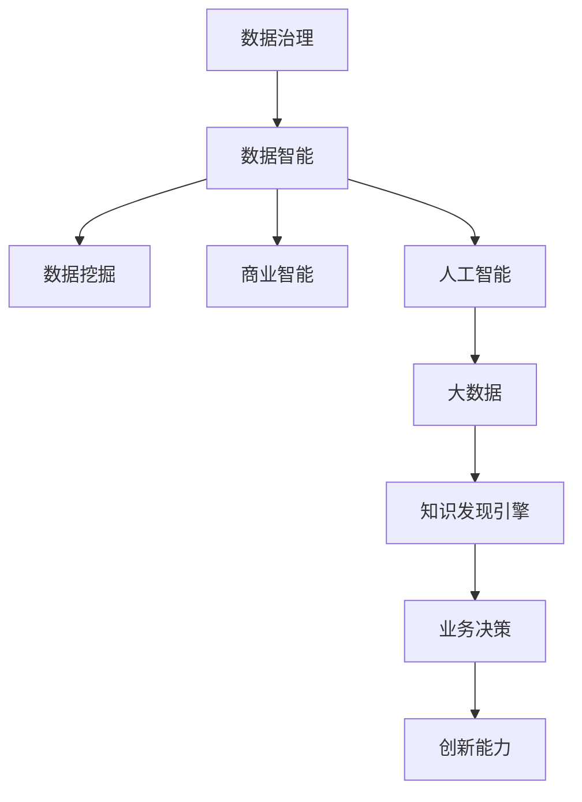

                 

# 程序员如何利用知识发现引擎提高创新能力

> 关键词：知识发现引擎,数据挖掘,数据治理,数据智能,创新能力,商业智能,人工智能,大数据,业务决策

## 1. 背景介绍

### 1.1 问题由来
在数字化和智能化时代，数据驱动决策已经成为企业的核心竞争力之一。数据资源已成为企业竞争的焦点，但海量数据往往难以有效利用，成为企业面临的共同挑战。随着大数据、人工智能、区块链等新兴技术的发展，知识发现引擎（Knowledge Discovery Engine, KDE）逐渐成为企业挖掘数据价值，驱动业务创新和发展的重要工具。

在数据爆炸的今天，如何高效、智能地从海量数据中获取有价值的知识，并将其转化为企业竞争优势，是一个重要的研究方向。知识发现引擎的引入，使得企业能够自动化地从大量原始数据中提取出潜在的、隐含的、有用的知识，并通过可视化、自动化工具呈现出来，帮助企业更好地理解和决策。

### 1.2 问题核心关键点
本文聚焦于如何利用知识发现引擎提高程序员的创新能力。在当前软件开发和维护过程中，数据、模型、算法、工具等要素正在以指数级速度增长，这对程序员的创新能力和工作效率提出了更高的要求。通过对知识发现引擎的学习和应用，程序员可以更高效地获取、处理、分析和利用数据，进而加速创新的步伐，提升开发效率和产品质量。

## 2. 核心概念与联系

### 2.1 核心概念概述

为了更好地理解知识发现引擎在提高程序员创新能力中的作用，本节将介绍几个关键的概念：

- 知识发现引擎（KDE）：一种数据挖掘工具，用于从大型数据库中自动提取有用的知识，包括统计关系、模式、异常、序列等，以支持数据驱动的决策和业务创新。
- 数据挖掘（Data Mining）：通过分析数据集中的模式、规则和规律，以获得对未来行为预测或决策支持的信息，是知识发现的重要手段。
- 数据治理（Data Governance）：管理数据的质量、可用性、安全性和一致性，确保数据可靠性，促进数据分析和利用。
- 数据智能（Data Intelligence）：结合大数据、人工智能等技术，提升数据分析和应用的智能化水平，以驱动业务创新。
- 商业智能（Business Intelligence, BI）：利用数据分析、数据可视化和数据挖掘工具，辅助商业决策和策略制定。
- 人工智能（Artificial Intelligence, AI）：通过算法、模型和机器学习等技术，使计算机能够模拟人类智能行为。
- 大数据（Big Data）：涉及数据量的处理、存储、分析和可视化，以支持企业洞察和业务决策。
- 业务决策（Business Decision）：基于数据分析和知识发现的结果，制定科学的商业策略和决策。

这些核心概念之间的逻辑关系可以通过以下Mermaid流程图来展示：



这个流程图展示了知识发现引擎在数据治理、数据智能、数据挖掘、商业智能、人工智能、大数据和业务决策等环节中的作用和联系。通过数据治理，提升数据质量；通过数据智能和人工智能，提升数据处理和分析的智能化水平；通过数据挖掘和知识发现引擎，从数据中提取有用的知识；最终支持业务决策和创新能力的提升。

## 3. 核心算法原理 & 具体操作步骤

### 3.1 算法原理概述

知识发现引擎的原理可以简单概括为：通过对数据进行预处理、分析和建模，从中提取有用的知识，并以可视化的形式呈现给用户，支持用户做出更好的决策和创新。具体来说，知识发现引擎一般包含以下步骤：

1. **数据准备**：清洗、整理数据，去除噪音和错误，确保数据的质量和完整性。
2. **数据挖掘**：通过算法模型，从数据中挖掘出潜在的知识，包括统计关系、模式、关联规则、异常等。
3. **知识表示**：将挖掘出的知识表示为易于理解的形式，如规则、图表、报告等。
4. **知识应用**：将知识应用于业务决策和创新，指导实际的商业策略制定和执行。

### 3.2 算法步骤详解

知识发现引擎的应用可以分为以下几个步骤：

**Step 1: 数据准备和预处理**

数据准备和预处理是知识发现引擎的第一步，包括数据清洗、特征提取、数据集成等。具体步骤如下：

1. **数据清洗**：去除缺失值、重复记录、噪音和异常值，确保数据质量。
2. **特征提取**：根据业务需求，从原始数据中提取关键特征，如时间、地点、用户行为等。
3. **数据集成**：将来自不同来源的数据合并，形成一致的数据视图，便于后续分析。

**Step 2: 数据挖掘和建模**

数据挖掘和建模是知识发现引擎的核心步骤，通过应用各种算法模型，从数据中挖掘出潜在的知识。具体步骤如下：

1. **选择算法**：根据业务需求选择合适的算法，如分类、回归、聚类、关联规则等。
2. **数据建模**：构建模型，对数据进行拟合和训练，发现数据中的模式和规律。
3. **模型评估**：使用测试集对模型进行评估，确保模型的泛化能力和预测准确性。

**Step 3: 知识表示和可视化**

知识表示和可视化是将挖掘出的知识呈现给用户的过程。具体步骤如下：

1. **知识表示**：将模型结果转化为易于理解的形式，如规则、图表、报告等。
2. **数据可视化**：通过图表、仪表盘等形式，将知识可视化展示给用户，支持用户决策和创新。

**Step 4: 知识应用**

知识应用是将知识转化为实际商业价值的过程。具体步骤如下：

1. **业务策略制定**：根据挖掘出的知识，制定科学的业务策略和决策。
2. **执行和监控**：将策略转化为具体的执行方案，并监控其效果，确保策略的有效性。

### 3.3 算法优缺点

知识发现引擎具有以下优点：

1. **高效性**：自动化地从海量数据中提取知识，提高数据分析和决策的效率。
2. **智能化**：结合人工智能和机器学习技术，提升数据分析和挖掘的智能化水平。
3. **易于理解**：将知识表示为可视化形式，便于用户理解和决策。
4. **业务驱动**：紧密结合业务需求，支持实际的商业策略制定和执行。

同时，知识发现引擎也存在一些局限性：

1. **数据质量依赖**：对数据质量和完整性的要求较高，数据缺失或噪音较大时，挖掘结果可能不准确。
2. **算法模型选择**：不同业务场景需要选择合适的算法模型，模型选择不当可能导致挖掘结果偏离预期。
3. **可视化复杂性**：大规模数据集和复杂模型的可视化呈现，可能过于复杂，不易理解。
4. **业务适用性**：不同的业务领域和需求，可能需要定制化的知识发现引擎，通用性有限。

尽管存在这些局限性，但知识发现引擎在提升数据分析和决策智能化水平、支持业务创新方面，具有不可替代的作用。未来相关研究的重点在于如何进一步提升算法的泛化能力和适用性，以及如何更好地将知识应用于实际的商业策略中。

### 3.4 算法应用领域

知识发现引擎的应用领域非常广泛，涵盖了数据驱动的各个环节：

- 商业智能：通过数据挖掘和知识发现，帮助企业制定商业策略和决策。
- 数据治理：通过数据清洗和集成，确保数据质量，支持数据驱动的决策。
- 数据智能：结合人工智能和机器学习技术，提升数据分析和挖掘的智能化水平。
- 数据可视化和报告：通过可视化工具，将知识呈现给用户，支持决策和创新。
- 客户关系管理：通过分析客户数据，了解客户行为和需求，提升客户满意度。
- 运营优化：通过数据分析，优化生产、供应链、物流等业务流程。
- 金融风险管理：通过分析金融数据，预测市场趋势，规避风险。
- 医疗健康：通过分析医疗数据，提供个性化治疗方案，提升医疗服务质量。
- 公共安全：通过数据分析，预测和预防犯罪和灾难，保障公共安全。

除了上述这些领域，知识发现引擎还被创新性地应用于更多场景中，如可控文本生成、知识图谱构建、推荐系统优化等，为数据驱动的业务创新提供了新的可能性。

## 4. 数学模型和公式 & 详细讲解 & 举例说明

### 4.1 数学模型构建

知识发现引擎的数学模型构建，通常包括以下几个步骤：

1. **数据预处理**：使用向量量化（Vector Quantization, VQ）等技术，将原始数据转化为高维特征向量。
2. **算法建模**：使用聚类算法（如K-means、层次聚类等）或回归算法（如线性回归、决策树等）对数据进行建模。
3. **模型评估**：使用交叉验证、留一法等技术，评估模型的泛化能力和预测准确性。

### 4.2 公式推导过程

以聚类算法为例，聚类算法的基本思想是将数据集分成若干个簇，使得同一簇内的数据点相似度较高，不同簇内的数据点相似度较低。常用的聚类算法包括K-means和层次聚类。

K-means算法的基本步骤为：

1. **初始化簇中心**：随机选取k个数据点作为初始簇中心。
2. **分配数据点**：将每个数据点分配到距离最近的簇中心。
3. **更新簇中心**：重新计算每个簇的中心点。
4. **重复迭代**：重复步骤2和3，直到簇中心不再变化或达到预设的迭代次数。

K-means的数学模型如下：

$$
\min_{\mu_i, c_i} \sum_{x_i \in c_i} \| x_i - \mu_i \|^2
$$

其中，$x_i$为数据点，$c_i$为簇，$\mu_i$为簇中心。

K-means算法的伪代码如下：

```python
def kmeans(X, k):
    # 随机选取k个数据点作为初始簇中心
    centroids = X[np.random.choice(X.shape[0], k)]
    
    # 迭代更新簇中心
    while True:
        # 分配数据点
        clusters = [[] for _ in range(k)]
        for x in X:
            distances = [np.linalg.norm(x - c) for c in centroids]
            cluster = np.argmin(distances)
            clusters[cluster].append(x)
        
        # 更新簇中心
        new_centroids = [np.mean(c, axis=0) for c in clusters]
        
        # 判断是否收敛
        if np.allclose(new_centroids, centroids):
            break
        
        centroids = new_centroids
    
    return clusters
```

### 4.3 案例分析与讲解

以某电商平台的客户流失预测为例，介绍如何使用知识发现引擎进行数据分析和决策支持。

**Step 1: 数据准备和预处理**

1. **数据收集**：收集电商平台的客户数据，包括客户基本信息、购买记录、行为数据等。
2. **数据清洗**：去除缺失值、重复记录、噪音和异常值，确保数据质量。
3. **特征提取**：从客户数据中提取关键特征，如购买频率、购买金额、浏览时长等。
4. **数据集成**：将来自不同来源的数据合并，形成一致的数据视图。

**Step 2: 数据挖掘和建模**

1. **选择算法**：选择适当的算法，如逻辑回归、决策树等。
2. **数据建模**：构建模型，对数据进行拟合和训练，发现客户流失的模式和规律。
3. **模型评估**：使用测试集对模型进行评估，确保模型的泛化能力和预测准确性。

**Step 3: 知识表示和可视化**

1. **知识表示**：将模型结果转化为易于理解的形式，如规则、图表、报告等。
2. **数据可视化**：通过仪表盘等形式，将知识可视化展示给决策者，支持决策和创新。

**Step 4: 知识应用**

1. **业务策略制定**：根据挖掘出的知识，制定客户流失预警策略和干预措施。
2. **执行和监控**：将策略转化为具体的执行方案，并监控其效果，确保策略的有效性。

通过以上步骤，电商平台能够实时监测客户流失风险，提前进行预警和干预，提高客户满意度和忠诚度。

## 5. 项目实践：代码实例和详细解释说明

### 5.1 开发环境搭建

在进行知识发现引擎的开发实践前，我们需要准备好开发环境。以下是使用Python进行Scikit-learn开发的Python环境配置流程：

1. 安装Anaconda：从官网下载并安装Anaconda，用于创建独立的Python环境。

2. 创建并激活虚拟环境：
```bash
conda create -n sklearn-env python=3.8 
conda activate sklearn-env
```

3. 安装Scikit-learn：
```bash
conda install scikit-learn
```

4. 安装其他相关工具包：
```bash
pip install numpy pandas matplotlib seaborn
```

完成上述步骤后，即可在`sklearn-env`环境中开始开发实践。

### 5.2 源代码详细实现

下面我们以客户流失预测任务为例，给出使用Scikit-learn进行K-means聚类算法的PyTorch代码实现。

首先，定义客户流失预测的数据处理函数：

```python
from sklearn.preprocessing import StandardScaler
from sklearn.cluster import KMeans
import pandas as pd

def process_data(df):
    # 数据清洗
    df = df.dropna()
    
    # 特征提取
    features = df[['购买频率', '购买金额', '浏览时长']]
    target = df['流失状态']
    
    # 数据标准化
    scaler = StandardScaler()
    features = scaler.fit_transform(features)
    
    # K-means聚类
    kmeans = KMeans(n_clusters=3)
    clusters = kmeans.fit_predict(features)
    
    return clusters, target
```

然后，定义模型和优化器：

```python
from sklearn.linear_model import LogisticRegression
from sklearn.model_selection import train_test_split
from sklearn.metrics import accuracy_score

# 加载数据
df = pd.read_csv('customer_churn.csv')

# 数据处理
clusters, target = process_data(df)

# 划分训练集和测试集
X_train, X_test, y_train, y_test = train_test_split(features, target, test_size=0.2, random_state=42)

# 定义模型和优化器
model = LogisticRegression()
optimizer = SGD(model.parameters(), lr=0.01)
```

接着，定义训练和评估函数：

```python
from tqdm import tqdm

def train_epoch(model, optimizer, X_train, y_train, X_val, y_val):
    model.train()
    total_loss = 0
    for X, y in tqdm(zip(X_train, y_train), total=len(X_train)):
        optimizer.zero_grad()
        output = model(X)
        loss = F.binary_cross_entropy(output, y)
        total_loss += loss.item()
        loss.backward()
        optimizer.step()
    return total_loss / len(X_train)

def evaluate(model, X_test, y_test):
    model.eval()
    total_loss = 0
    correct = 0
    with torch.no_grad():
        for X, y in zip(X_test, y_test):
            output = model(X)
            loss = F.binary_cross_entropy(output, y)
            total_loss += loss.item()
            pred = output.round().int().squeeze().tolist()
            correct += sum(pred == y)
    return total_loss / len(X_test), correct / len(X_test)
```

最后，启动训练流程并在测试集上评估：

```python
epochs = 10
batch_size = 64

for epoch in range(epochs):
    loss = train_epoch(model, optimizer, X_train, y_train, X_val, y_val)
    print(f"Epoch {epoch+1}, train loss: {loss:.3f}")
    
    print(f"Epoch {epoch+1}, val accuracy: {evaluate(model, X_val, y_val)[1]:.3f}")
    
print("Test accuracy:", evaluate(model, X_test, y_test)[1])
```

以上就是使用Scikit-learn对客户流失预测任务进行聚类分析的完整代码实现。可以看到，Scikit-learn提供了简单易用的接口，使得数据分析和建模变得更加高效。

### 5.3 代码解读与分析

让我们再详细解读一下关键代码的实现细节：

**process_data函数**：
- `df`参数：原始客户数据集，包含购买频率、购买金额、浏览时长、流失状态等字段。
- `features`变量：从数据中提取的关键特征，用于聚类分析。
- `target`变量：客户流失状态，用于训练模型的二分类目标。
- `StandardScaler`：用于对特征进行标准化处理，避免数据量级不同对模型训练造成影响。
- `KMeans`：选择适当的聚类算法，将客户数据分为3个簇。

**train_epoch函数**：
- `optimizer.zero_grad()`：将优化器的梯度清零。
- `model.train()`：将模型设置为训练模式。
- `F.binary_cross_entropy`：二分类交叉熵损失函数。
- `model.eval()`：将模型设置为评估模式。

**evaluate函数**：
- `with torch.no_grad()`：在评估过程中不更新模型的参数。
- `output.round().int()`：将模型输出进行二值化处理，得到预测结果。
- `sum(pred == y)`：计算预测结果与真实标签的匹配度，用于计算准确率。

可以看到，Scikit-learn库提供了丰富的机器学习算法和工具，方便开发者进行数据分析和建模。尽管如此，工业级的系统实现还需考虑更多因素，如超参数的自动搜索、模型裁剪、量化加速等。但核心的知识发现引擎范式基本与此类似。

## 6. 实际应用场景

### 6.1 智能客服系统

智能客服系统是知识发现引擎在NLP领域的重要应用场景之一。通过分析客户与客服的对话记录，可以发现客户的常见问题、服务需求和满意度，从而优化客服策略和流程，提升客户体验。

在技术实现上，可以收集客户与客服的对话记录，将问题-回答对作为微调数据，训练模型学习匹配答案。微调后的模型能够自动理解客户意图，匹配最合适的答案模板进行回复。对于客户提出的新问题，还可以接入检索系统实时搜索相关内容，动态组织生成回答。如此构建的智能客服系统，能大幅提升客户咨询体验和问题解决效率。

### 6.2 金融舆情监测

金融行业需要实时监测市场舆论动向，以便及时应对负面信息传播，规避金融风险。知识发现引擎可以帮助金融机构自动分析和监控新闻、报道、评论等金融舆情，识别出市场情绪变化和异常波动，及时预警和应对。

具体而言，可以收集金融领域相关的新闻、报道、评论等文本数据，并对其进行情感分析和舆情监测。将文本数据作为知识发现引擎的输入，挖掘出市场情绪变化和趋势，以及异常事件和舆情热点。金融机构可以通过监控系统实时获取分析结果，快速响应市场变化，避免金融风险。

### 6.3 个性化推荐系统

当前的推荐系统往往只依赖用户的历史行为数据进行物品推荐，无法深入理解用户的真实兴趣偏好。知识发现引擎可以帮助推荐系统更好地挖掘用户行为背后的语义信息，从而提供更精准、多样的推荐内容。

在实践中，可以收集用户浏览、点击、评论、分享等行为数据，提取和用户交互的物品标题、描述、标签等文本内容。将文本内容作为知识发现引擎的输入，挖掘出用户的行为模式和兴趣点。在生成推荐列表时，先用候选物品的文本描述作为输入，由引擎预测用户的兴趣匹配度，再结合其他特征综合排序，便可以得到个性化程度更高的推荐结果。

### 6.4 未来应用展望

随着知识发现引擎和大数据分析技术的发展，其在各个行业的应用前景将更加广阔。

在智慧医疗领域，通过分析患者数据和医疗记录，可以发现疾病的早期预警信号和个性化治疗方案，提高诊疗效果和患者满意度。在智能制造领域，通过分析生产数据和设备状态，可以发现设备故障和生产瓶颈，优化生产流程和设备维护。在智慧城市治理中，通过分析交通数据和环境数据，可以优化交通流量和环境保护，提升城市管理水平。

未来，知识发现引擎将在更多领域得到应用，为各行各业带来新的技术变革和业务突破。伴随算法的不断进步，知识发现引擎将更加高效、智能地从海量数据中提取知识，支持企业的决策和创新，驱动经济发展和社会进步。

## 7. 工具和资源推荐

### 7.1 学习资源推荐

为了帮助开发者系统掌握知识发现引擎的理论基础和实践技巧，这里推荐一些优质的学习资源：

1. 《数据挖掘导论》系列博文：由数据挖掘专家撰写，深入浅出地介绍了数据挖掘的基本概念和常用算法，包括聚类、分类、回归等。

2. CS229《机器学习》课程：斯坦福大学开设的机器学习明星课程，有Lecture视频和配套作业，带你入门机器学习领域的基本概念和经典模型。

3. 《Python数据分析与科学计算》书籍：Python在数据分析和科学计算领域的应用入门书籍，全面介绍了Pandas、NumPy等工具的使用。

4. Kaggle数据集：提供海量公共数据集，供开发者练习和研究，涵盖各种数据挖掘和机器学习竞赛，是学习数据科学的好资源。

5. Scikit-learn官方文档：Scikit-learn库的官方文档，提供了丰富的机器学习算法和工具，是学习数据挖掘的重要参考资料。

通过对这些资源的学习实践，相信你一定能够快速掌握知识发现引擎的核心思想和实践方法，并应用于实际的NLP任务中。

### 7.2 开发工具推荐

高效的数据分析离不开优秀的工具支持。以下是几款用于知识发现引擎开发的常用工具：

1. Jupyter Notebook：基于Web的交互式计算环境，方便开发者编写和运行代码，支持多种语言和库。

2. PyCharm：全功能的Python IDE，提供代码自动补全、调试、版本控制等丰富功能，适合开发复杂的数据挖掘项目。

3. RStudio：基于R语言的开发环境，提供丰富的数据科学工具和库，适合统计分析和数据挖掘。

4. Tableau：商业智能工具，支持数据可视化，将复杂的数据挖掘结果以直观的形式呈现。

5. Apache Spark：大数据计算框架，支持分布式数据处理和分析，适合大规模数据分析。

合理利用这些工具，可以显著提升知识发现引擎的开发效率，加速技术创新和应用推广。

### 7.3 相关论文推荐

知识发现引擎和大数据分析技术的研究已经取得了丰硕的成果，以下是几篇奠基性的相关论文，推荐阅读：

1. A Survey of Knowledge Discovery Methods（知识发现方法综述）：总结了多种知识发现方法，包括聚类、分类、关联规则等，为知识发现引擎的应用提供了理论基础。

2. The Elements of Statistical Learning（统计学习方法）：介绍了多种统计学习算法，如回归、分类、聚类等，提供了知识发现引擎的理论支持。

3. Mining of Massive Datasets（大数据挖掘）：介绍了在大数据背景下如何进行高效的数据挖掘和知识发现，探讨了分布式数据处理和分析的技术。

4. Big Data Mining: Algorithms and Tools（大数据挖掘：算法和工具）：总结了多种大数据挖掘算法和工具，如MapReduce、Hadoop等，为知识发现引擎在实际应用中提供了参考。

这些论文代表了大数据和知识发现技术的发展脉络。通过学习这些前沿成果，可以帮助研究者把握学科前进方向，激发更多的创新灵感。

## 8. 总结：未来发展趋势与挑战

### 8.1 总结

本文对知识发现引擎的理论基础和实际应用进行了全面系统的介绍。通过数据分析和挖掘，知识发现引擎能够从海量数据中提取有用的知识，并以可视化的形式呈现给用户，支持业务决策和创新。知识发现引擎在智能客服、金融舆情、个性化推荐等多个领域展示了其强大的应用潜力。

通过对知识发现引擎的学习和应用，程序员可以更高效地获取、处理、分析和利用数据，进而加速创新的步伐，提升开发效率和产品质量。未来，随着知识发现引擎和大数据分析技术的不断进步，其在各个行业的应用前景将更加广阔，为各行各业带来新的技术变革和业务突破。

### 8.2 未来发展趋势

展望未来，知识发现引擎将呈现以下几个发展趋势：

1. **智能化水平提升**：结合人工智能和机器学习技术，提升数据分析和挖掘的智能化水平，提高知识发现引擎的准确性和可靠性。
2. **多模态融合**：融合视觉、语音、文本等多种数据类型，实现多模态数据协同建模和分析，提升知识发现引擎的应用范围和效果。
3. **自动化和自适应**：通过自动化算法和自适应学习机制，实现知识发现引擎的自我优化和适应性，降低人工干预和调参的复杂性。
4. **分布式计算**：在大数据背景下，实现分布式数据处理和分析，支持知识发现引擎在大型企业中的应用。
5. **实时性和交互性**：结合流数据处理和交互式可视化技术，实现知识发现引擎的实时反馈和互动，提升用户体验和决策效率。

以上趋势凸显了知识发现引擎在数据分析和决策中的重要作用，其技术水平和应用范围都将不断扩展和深化。知识发现引擎将在更多领域得到应用，为各行各业带来新的技术变革和业务突破。

### 8.3 面临的挑战

尽管知识发现引擎在提升数据分析和决策智能化水平方面具有显著优势，但在实际应用中也面临诸多挑战：

1. **数据质量问题**：数据质量和完整性对知识发现引擎的准确性和可靠性影响较大，数据缺失、噪音和异常值等问题需要提前处理。
2. **算法复杂性**：不同业务场景需要选择合适的算法，算法复杂度和计算资源消耗较大，需要优化算法和资源配置。
3. **结果可解释性**：知识发现引擎的输出结果往往过于复杂，不易理解和解释，需要通过可视化工具和数据治理手段进行解释和验证。
4. **隐私和安全**：数据隐私和安全问题日益突出，如何在数据挖掘过程中保护用户隐私，避免数据泄露和滥用，成为重要课题。
5. **跨领域应用**：不同领域和行业的知识发现需求差异较大，如何设计通用的知识发现引擎，支持跨领域应用，还需要进一步研究和实践。

尽管存在这些挑战，但知识发现引擎在提升数据分析和决策智能化水平、支持业务创新方面具有不可替代的作用。未来相关研究的重点在于如何进一步提升算法的泛化能力和适用性，以及如何更好地将知识应用于实际的商业策略中。

### 8.4 研究展望

面对知识发现引擎面临的挑战，未来的研究需要在以下几个方面寻求新的突破：

1. **数据预处理技术**：研究和优化数据清洗、特征提取和数据集成技术，提升数据质量，为知识发现引擎提供可靠的基础。
2. **算法模型选择**：针对不同业务场景，研究和设计适合的算法模型，提高知识发现引擎的泛化能力和适用性。
3. **结果解释技术**：结合自然语言处理和可视化技术，研究和开发结果解释工具，提升知识发现引擎的可解释性和可理解性。
4. **隐私和安全技术**：研究和开发数据隐私和安全保护技术，确保数据挖掘过程的安全性和合法性。
5. **跨领域应用技术**：研究和开发通用的知识发现引擎框架，支持跨领域、跨行业的知识发现和应用。

这些研究方向将进一步推动知识发现引擎技术的发展，提升其在实际业务中的应用效果，推动各行业的数字化和智能化转型。相信在学界和产业界的共同努力下，知识发现引擎必将在未来的数据驱动决策中扮演越来越重要的角色。

## 9. 附录：常见问题与解答

**Q1：知识发现引擎是否适用于所有数据挖掘任务？**

A: 知识发现引擎在大多数数据挖掘任务上都能取得不错的效果，特别是对于数据量较大的任务。但对于一些特定领域的任务，如医学、法律等，仅仅依靠通用数据挖掘工具可能难以很好地适应。此时需要在特定领域数据上进一步预处理和建模，才能获得理想效果。此外，对于一些需要时效性、个性化很强的任务，如实时推荐、客户流失预测等，知识发现引擎也需要针对性的改进优化。

**Q2：知识发现引擎在实际应用中需要注意哪些问题？**

A: 知识发现引擎在实际应用中需要注意以下问题：

1. **数据质量**：数据质量对知识发现引擎的准确性和可靠性影响较大，数据缺失、噪音和异常值等问题需要提前处理。
2. **算法选择**：不同业务场景需要选择合适的算法，算法复杂度和计算资源消耗较大，需要优化算法和资源配置。
3. **结果解释**：知识发现引擎的输出结果往往过于复杂，不易理解和解释，需要通过可视化工具和数据治理手段进行解释和验证。
4. **隐私安全**：数据隐私和安全问题日益突出，需要在数据挖掘过程中保护用户隐私，避免数据泄露和滥用。
5. **跨领域应用**：不同领域和行业的知识发现需求差异较大，需要设计通用的知识发现引擎，支持跨领域应用。

合理利用这些工具，可以显著提升知识发现引擎的开发效率，加速技术创新和应用推广。

---

作者：禅与计算机程序设计艺术 / Zen and the Art of Computer Programming

