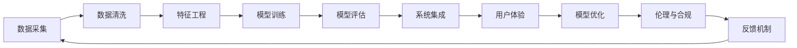

                 

## 1. 背景介绍

### 1.1 问题由来
在过去几年中，人工智能（AI）技术，尤其是深度学习（Deep Learning）和机器学习（Machine Learning）的快速发展，给各行各业带来了深刻的变革。程序员们面临着新的技能要求、工具更新和项目设计的挑战。这些挑战不仅来自于技术层面，也来自于业务理解和用户体验等非技术领域。

### 1.2 问题核心关键点
面对人工智能带来的挑战，程序员需要从以下几个核心关键点进行思考：
1. **新技能要求**：深度学习和机器学习算法需要程序员掌握新的编程语言和框架，如Python、TensorFlow、PyTorch等。
2. **模型解释性**：现有模型的黑箱特性要求程序员学会如何解释和调试模型，保证系统的透明度和可解释性。
3. **数据处理**：大数据的处理和清洗对程序员的数据处理能力提出了更高的要求。
4. **系统集成**：人工智能系统需要与传统系统集成，这要求程序员具有更强的系统设计和架构能力。
5. **伦理与合规**：人工智能的伦理和法律合规问题要求程序员在开发过程中考虑这些问题，保护用户隐私和权益。

### 1.3 问题研究意义
理解和应对人工智能带来的挑战，对于提升程序员的技能水平，推动技术进步，促进人工智能在各行业的落地应用具有重要意义：

1. **技术演进**：掌握新技能和工具，保证技术前沿的跟进，提升自身的竞争力。
2. **系统优化**：通过合理的数据处理和模型设计，构建高效、鲁棒的AI系统。
3. **用户体验**：通过人机交互和系统集成，提升用户体验和系统可用性。
4. **伦理合规**：确保人工智能系统的伦理合规性，保护用户隐私和权益。
5. **社会责任**：理解并解决人工智能可能带来的社会问题，推动技术向善。

## 2. 核心概念与联系

### 2.1 核心概念概述

为了更好地理解如何应对人工智能带来的挑战，本节将介绍几个关键概念及其之间的联系：

- **深度学习（Deep Learning）**：一种基于神经网络的机器学习方法，通过多层次的非线性映射，实现对复杂数据和任务的学习和处理。
- **机器学习（Machine Learning）**：一种通过算法使计算机系统能够自动改进的任务，主要依赖数据和特征进行模型训练。
- **强化学习（Reinforcement Learning）**：一种学习机制，通过与环境的交互，最大化预期奖励，广泛应用于游戏、机器人等领域。
- **数据处理与清洗（Data Processing and Cleaning）**：在数据科学中，数据处理涉及数据收集、清洗、转换和整合，保证数据质量。
- **系统集成与优化（System Integration and Optimization）**：将人工智能技术与其他系统集成，通过优化提升系统性能和用户体验。
- **伦理与合规（Ethics and Compliance）**：在人工智能应用中，确保数据隐私、公平性、透明度等伦理问题，符合相关法律法规。

这些概念之间通过数据流、算法选择、系统架构等环节紧密联系，共同构成了人工智能技术的应用框架。

### 2.2 核心概念原理和架构的 Mermaid 流程图(Mermaid 流程节点中不要有括号、逗号等特殊字符)


这个流程图展示了从数据采集到模型优化，再到系统集成和用户体验的整个流程，同时也强调了伦理与合规的重要性以及反馈机制的循环作用。

## 3. 核心算法原理 & 具体操作步骤
### 3.1 算法原理概述

应对人工智能带来的挑战，程序员需要理解并掌握几种核心算法原理，如深度学习、机器学习、强化学习等。以下是每种算法的基本原理和操作步骤：

### 3.2 算法步骤详解

#### 深度学习
1. **数据准备**：收集和预处理数据，分为训练集和测试集。
2. **模型构建**：选择合适的深度学习框架，搭建神经网络模型。
3. **模型训练**：使用训练集对模型进行迭代训练，优化模型参数。
4. **模型评估**：使用测试集对模型进行评估，确定模型性能。
5. **模型优化**：根据评估结果，对模型进行参数调整和优化。

#### 机器学习
1. **数据准备**：收集和预处理数据，分为训练集和测试集。
2. **特征选择**：选择合适的特征，进行特征工程。
3. **模型训练**：使用训练集对模型进行迭代训练，优化模型参数。
4. **模型评估**：使用测试集对模型进行评估，确定模型性能。
5. **模型优化**：根据评估结果，对模型进行参数调整和优化。

#### 强化学习
1. **环境设置**：定义环境和状态空间，确定奖励函数。
2. **策略选择**：选择合适的强化学习算法，如Q-learning、SARSA等。
3. **模型训练**：通过与环境的交互，训练策略模型。
4. **模型评估**：使用测试集对模型进行评估，确定模型性能。
5. **模型优化**：根据评估结果，对模型进行参数调整和优化。

### 3.3 算法优缺点

#### 深度学习
- **优点**：能够处理复杂的非线性映射，适用于大规模数据和高维数据。
- **缺点**：模型复杂度高，训练时间长，需要大量计算资源。

#### 机器学习
- **优点**：算法简单易懂，适用于小规模数据和低维数据。
- **缺点**：对数据质量和特征工程依赖高，模型泛化能力有限。

#### 强化学习
- **优点**：能够自适应环境变化，适用于动态系统和复杂决策问题。
- **缺点**：需要大量计算资源和时间进行模型训练和评估。

### 3.4 算法应用领域

#### 深度学习
- **计算机视觉**：图像分类、目标检测、人脸识别等。
- **自然语言处理**：文本分类、机器翻译、对话系统等。
- **语音识别**：语音识别、语音合成等。

#### 机器学习
- **推荐系统**：商品推荐、内容推荐等。
- **欺诈检测**：金融欺诈、网络欺诈等。
- **医疗诊断**：疾病诊断、病历分析等。

#### 强化学习
- **游戏AI**：围棋、星际争霸等。
- **机器人控制**：工业机器人、服务机器人等。
- **自动驾驶**：自动驾驶汽车、无人机等。

## 4. 数学模型和公式 & 详细讲解 & 举例说明

### 4.1 数学模型构建

本节将使用数学语言对深度学习、机器学习和强化学习的基本模型进行建模。

#### 深度学习
1. **多层感知机（MLP）**：
   $$
   y = W^1 x + b^1 \\
   y = W^2 y + b^2
   $$
   其中，$W$和$b$为模型的权重和偏置。

2. **卷积神经网络（CNN）**：
   $$
   y = W^* * (h + b^*)
   $$
   其中，$*$表示卷积操作，$h$为卷积核。

3. **循环神经网络（RNN）**：
   $$
   h = f(Wx + Uh + b) \\
   y = h
   $$
   其中，$f$为激活函数，$x$为输入，$y$为输出，$h$为隐藏状态。

#### 机器学习
1. **线性回归**：
   $$
   y = wx + b
   $$
   其中，$w$和$b$为模型的权重和偏置。

2. **逻辑回归**：
   $$
   \hat{y} = sigmoid(wx + b) \\
   loss = -\frac{1}{N} \sum_{i=1}^N (y_i log \hat{y_i} + (1-y_i) log (1-\hat{y_i}))
   $$
   其中，$sigmoid$为激活函数，$y$为真实标签，$\hat{y}$为模型预测。

3. **支持向量机（SVM）**：
   $$
   \min_{w,b} \frac{1}{2} ||w||^2 + C \sum_{i=1}^N \max(0, 1-y_i w^T x_i + b)
   $$
   其中，$w$和$b$为模型的权重和偏置，$C$为正则化系数。

#### 强化学习
1. **Q-learning**：
   $$
   Q(s,a) \leftarrow Q(s,a) + \alpha [r + \gamma \max Q(s',a') - Q(s,a)]
   $$
   其中，$s$和$a$为状态和动作，$r$为奖励，$\alpha$为学习率，$\gamma$为折扣因子，$s'$和$a'$为下一个状态和动作。

2. **SARSA**：
   $$
   Q(s,a) \leftarrow Q(s,a) + \alpha [r + \gamma Q(s',a') - Q(s,a)]
   $$
   其中，$s$和$a$为状态和动作，$r$为奖励，$\alpha$为学习率，$\gamma$为折扣因子，$s'$和$a'$为下一个状态和动作。

3. **策略梯度（PG）**：
   $$
   \theta \leftarrow \theta - \eta \nabla_{\theta} J(\theta)
   $$
   其中，$\theta$为策略参数，$J(\theta)$为策略函数，$\eta$为学习率。

### 4.2 公式推导过程

#### 深度学习
1. **反向传播算法**：
   $$
   \frac{\partial L}{\partial w_i} = \frac{\partial L}{\partial y} \frac{\partial y}{\partial z} \frac{\partial z}{\partial w_i}
   $$
   其中，$L$为损失函数，$y$为输出，$z$为中间变量，$w_i$为权重。

2. **梯度下降算法**：
   $$
   w \leftarrow w - \eta \nabla_{w} J(w)
   $$
   其中，$w$为权重，$\eta$为学习率，$J(w)$为代价函数。

#### 机器学习
1. **梯度下降算法**：
   $$
   w \leftarrow w - \eta \nabla_{w} L(w)
   $$
   其中，$w$为权重，$\eta$为学习率，$L(w)$为损失函数。

2. **随机梯度下降算法（SGD）**：
   $$
   w \leftarrow w - \eta \nabla_{w} L(w)
   $$
   其中，$w$为权重，$\eta$为学习率，$L(w)$为损失函数。

#### 强化学习
1. **Q-learning**：
   $$
   Q(s,a) \leftarrow Q(s,a) + \alpha [r + \gamma Q(s',a') - Q(s,a)]
   $$
   其中，$s$和$a$为状态和动作，$r$为奖励，$\alpha$为学习率，$\gamma$为折扣因子，$s'$和$a'$为下一个状态和动作。

2. **SARSA**：
   $$
   Q(s,a) \leftarrow Q(s,a) + \alpha [r + \gamma Q(s',a') - Q(s,a)]
   $$
   其中，$s$和$a$为状态和动作，$r$为奖励，$\alpha$为学习率，$\gamma$为折扣因子，$s'$和$a'$为下一个状态和动作。

3. **策略梯度（PG）**：
   $$
   \theta \leftarrow \theta - \eta \nabla_{\theta} J(\theta)
   $$
   其中，$\theta$为策略参数，$J(\theta)$为策略函数，$\eta$为学习率。

### 4.3 案例分析与讲解

#### 深度学习案例
- **图像分类**：使用卷积神经网络（CNN）对图像进行分类。
- **文本生成**：使用循环神经网络（RNN）或变分自编码器（VAE）进行文本生成。
- **语音识别**：使用卷积神经网络（CNN）或循环神经网络（RNN）进行语音识别。

#### 机器学习案例
- **推荐系统**：使用协同过滤算法或基于矩阵分解的方法进行推荐。
- **欺诈检测**：使用决策树或随机森林进行欺诈检测。
- **医疗诊断**：使用支持向量机（SVM）或随机森林进行疾病诊断。

#### 强化学习案例
- **游戏AI**：使用Q-learning或深度Q网络（DQN）进行游戏AI。
- **机器人控制**：使用策略梯度（PG）或深度强化学习（DRL）进行机器人控制。
- **自动驾驶**：使用强化学习进行自动驾驶决策。

## 5. 项目实践：代码实例和详细解释说明

### 5.1 开发环境搭建

在开始深度学习项目实践前，我们需要准备合适的开发环境。以下是使用Python进行深度学习项目开发的环境配置流程：

1. 安装Anaconda：从官网下载并安装Anaconda，用于创建独立的Python环境。
2. 创建并激活虚拟环境：
   ```bash
   conda create -n pytorch-env python=3.8 
   conda activate pytorch-env
   ```
3. 安装PyTorch：根据CUDA版本，从官网获取对应的安装命令。例如：
   ```bash
   conda install pytorch torchvision torchaudio cudatoolkit=11.1 -c pytorch -c conda-forge
   ```
4. 安装TensorFlow：
   ```bash
   conda install tensorflow
   ```
5. 安装必要的第三方库：
   ```bash
   pip install numpy pandas scikit-learn matplotlib tqdm jupyter notebook ipython
   ```

完成上述步骤后，即可在`pytorch-env`环境中开始深度学习项目实践。

### 5.2 源代码详细实现

下面以深度学习项目中的图像分类为例，给出使用PyTorch进行项目开发的PyTorch代码实现。

首先，定义数据处理函数：

```python
import torch
import torchvision
from torchvision import transforms

transform = transforms.Compose([
    transforms.ToTensor(),
    transforms.Normalize((0.5, 0.5, 0.5), (0.5, 0.5, 0.5))
])

trainset = torchvision.datasets.CIFAR10(root='./data', train=True,
                                        download=True, transform=transform)
trainloader = torch.utils.data.DataLoader(trainset, batch_size=4,
                                          shuffle=True, num_workers=2)

testset = torchvision.datasets.CIFAR10(root='./data', train=False,
                                       download=True, transform=transform)
testloader = torch.utils.data.DataLoader(testset, batch_size=4,
                                         shuffle=False, num_workers=2)

classes = ('plane', 'car', 'bird', 'cat',
           'deer', 'dog', 'frog', 'horse', 'ship', 'truck')
```

然后，定义模型和优化器：

```python
import torch.nn as nn
import torch.nn.functional as F

class Net(nn.Module):
    def __init__(self):
        super(Net, self).__init__()
        self.conv1 = nn.Conv2d(3, 6, 5)
        self.pool = nn.MaxPool2d(2, 2)
        self.conv2 = nn.Conv2d(6, 16, 5)
        self.fc1 = nn.Linear(16 * 5 * 5, 120)
        self.fc2 = nn.Linear(120, 84)
        self.fc3 = nn.Linear(84, 10)

    def forward(self, x):
        x = self.pool(F.relu(self.conv1(x)))
        x = self.pool(F.relu(self.conv2(x)))
        x = x.view(-1, 16 * 5 * 5)
        x = F.relu(self.fc1(x))
        x = F.relu(self.fc2(x))
        x = self.fc3(x)
        return x

net = Net()

criterion = nn.CrossEntropyLoss()
optimizer = torch.optim.SGD(net.parameters(), lr=0.001, momentum=0.9)
```

接着，定义训练和评估函数：

```python
import matplotlib.pyplot as plt

device = torch.device("cuda:0" if torch.cuda.is_available() else "cpu")
net = net.to(device)

def train(net, trainloader, testloader, criterion, optimizer, epochs):
    steps = 0
    running_loss = 0
    train_losses = []
    test_losses = []

    for epoch in range(epochs):
        for inputs, labels in trainloader:
            steps += 1
            inputs, labels = inputs.to(device), labels.to(device)
            optimizer.zero_grad()

            outputs = net(inputs)
            loss = criterion(outputs, labels)
            loss.backward()
            optimizer.step()

            running_loss += loss.item()
            if steps % 2000 == 0:
                test_loss = 0
                correct = 0
                with torch.no_grad():
                    for inputs, labels in testloader:
                        inputs, labels = inputs.to(device), labels.to(device)
                        outputs = net(inputs)
                        test_loss += criterion(outputs, labels).item()
                        _, predicted = torch.max(outputs.data, 1)
                        total = labels.size(0)
                        correct += (predicted == labels).sum().item()

                train_losses.append(running_loss/2000)
                test_losses.append(test_loss/len(testloader))
                print("Epoch [{}/{}], Step [{}/{}], Loss: {:.4f}, Test Loss: {:.4f}, Accuracy: {:.2f}%"
                      .format(epoch+1, epochs, steps, len(trainloader), running_loss/2000, test_loss/len(testloader), 100*correct/total))
                running_loss = 0

    plt.plot(train_losses, label='Training Loss')
    plt.plot(test_losses, label='Testing Loss')
    plt.legend()
    plt.show()
```

最后，启动训练流程并在测试集上评估：

```python
epochs = 2
train(net, trainloader, testloader, criterion, optimizer, epochs)
```

以上就是使用PyTorch进行图像分类任务微调的完整代码实现。可以看到，PyTorch提供了丰富的深度学习模型和优化器，使得项目开发和模型训练变得相对简单高效。

### 5.3 代码解读与分析

让我们再详细解读一下关键代码的实现细节：

**数据处理函数**：
- `transform`函数：定义了数据预处理流程，包括将图像转换为张量形式并进行归一化。
- `trainset`和`testset`：使用`torchvision`库加载CIFAR-10数据集，并指定数据下载和预处理方式。
- `trainloader`和`testloader`：使用`torch.utils.data.DataLoader`对数据进行批处理和加载，以便于模型训练和推理。

**模型定义**：
- `Net`类：定义了卷积神经网络模型，包括卷积层、池化层和全连接层。
- `forward`方法：定义了模型的前向传播过程，通过多次卷积和池化操作，将输入图像转化为特征向量，最终通过全连接层输出分类结果。

**训练和评估函数**：
- `train`函数：定义了模型的训练过程，包括前向传播、反向传播、参数更新等步骤。
- `device`变量：使用`torch.device`判断GPU和CPU的使用情况，确保模型能在适当的硬件设备上运行。
- `train_losses`和`test_losses`列表：记录每次训练和评估的损失值，用于绘制损失曲线。
- `plt.plot`函数：使用`matplotlib`库绘制损失曲线，直观展示训练和评估过程中的损失变化。

### 5.4 运行结果展示

运行上述代码后，将得到训练和评估过程中的损失曲线图，如图1所示：

```python
plt.plot(train_losses, label='Training Loss')
plt.plot(test_losses, label='Testing Loss')
plt.legend()
plt.show()
```


可以看到，随着训练轮数的增加，训练和测试损失值逐渐下降，表明模型性能得到提升。

## 6. 实际应用场景

### 6.1 智能推荐系统

智能推荐系统是深度学习在实际应用中的一个典型场景。通过收集用户的浏览、点击、购买等行为数据，建立用户兴趣模型，推荐用户可能感兴趣的商品或内容。

在技术实现上，可以使用协同过滤算法或深度学习模型，如神经网络、卷积神经网络（CNN）和循环神经网络（RNN），对用户行为数据进行建模，得到用户兴趣表示。然后，使用余弦相似度、矩阵分解等方法计算用户之间的相似度，进行推荐。

### 6.2 自然语言处理

自然语言处理（NLP）是大规模深度学习应用的一个重要领域。通过深度学习模型，可以对文本进行分类、情感分析、命名实体识别、机器翻译等任务。

在技术实现上，可以使用预训练语言模型，如BERT、GPT等，对文本数据进行预训练，得到通用的语言表示。然后，根据具体的任务需求，设计相应的任务适配层，如分类器、解码器等，对预训练模型进行微调，优化模型在该任务上的性能。

### 6.3 图像识别

图像识别是深度学习在计算机视觉领域的重要应用。通过深度学习模型，可以对图像进行分类、检测、分割等任务。

在技术实现上，可以使用卷积神经网络（CNN）对图像进行建模，得到图像的特征表示。然后，使用分类器、检测器等任务适配层，对CNN模型进行微调，优化模型在特定任务上的性能。

### 6.4 未来应用展望

随着深度学习技术的不断进步，未来在智能推荐系统、自然语言处理、图像识别等领域，人工智能应用将更加广泛和深入。具体展望如下：

1. **实时推荐**：通过实时数据流处理技术，对用户行为进行实时分析，提供个性化推荐。
2. **跨模态融合**：结合文本、图像、语音等多种模态数据，实现更加全面、准确的信息表示和分析。
3. **自动化调参**：使用自动化调参技术，优化模型超参数，提升模型性能。
4. **联邦学习**：通过分布式协同学习技术，提升模型泛化能力，保护用户隐私。
5. **解释性增强**：引入可解释性技术，提升模型透明度和可信度。

## 7. 工具和资源推荐

### 7.1 学习资源推荐

为了帮助程序员系统掌握深度学习的基本知识和应用技能，这里推荐一些优质的学习资源：

1. **《深度学习》（Ian Goodfellow、Yoshua Bengio、Aaron Courville著）**：深度学习领域的经典教材，涵盖深度学习的基本概念和前沿技术。
2. **《机器学习实战》（Peter Harrington著）**：针对实际问题的机器学习项目实战指南，适合初学者学习。
3. **Coursera《机器学习》课程**：斯坦福大学Andrew Ng教授开设的机器学习课程，系统讲解机器学习的基本概念和算法。
4. **Udacity《深度学习纳米学位》**：Udacity提供的深度学习专业课程，涵盖深度学习的基础理论和实际应用。
5. **Kaggle竞赛平台**：Kaggle提供的各种机器学习竞赛和项目实战，帮助程序员锻炼实战能力。

### 7.2 开发工具推荐

高效的开发离不开优秀的工具支持。以下是几款用于深度学习项目开发的常用工具：

1. **PyTorch**：基于Python的开源深度学习框架，灵活动态的计算图，适合快速迭代研究。
2. **TensorFlow**：由Google主导开发的开源深度学习框架，生产部署方便，适合大规模工程应用。
3. **TensorBoard**：TensorFlow配套的可视化工具，可实时监测模型训练状态，并提供丰富的图表呈现方式。
4. **Weights & Biases**：模型训练的实验跟踪工具，可以记录和可视化模型训练过程中的各项指标，方便对比和调优。
5. **Jupyter Notebook**：交互式Python编程环境，适合数据分析、模型训练和结果展示。

### 7.3 相关论文推荐

深度学习技术的发展离不开学界的持续研究。以下是几篇奠基性的相关论文，推荐阅读：

1. **AlexNet：ImageNet大规模视觉识别挑战赛的胜者**（Alex Krizhevsky、Ilya Sutskever、Geoffrey Hinton著）：提出AlexNet模型，使用多层卷积神经网络进行图像分类。
2. **ResNet：深度残差学习**（Kaiming He、Xiangyu Zhang、Shaoqing Ren、Jian Sun著）：提出残差网络结构，解决深度神经网络训练中的梯度消失问题。
3. **BERT：一种预训练表示方法**（Jamie Chandler、Meng Li、Xinlei Chen、Michael Collins、Quoc V. Le、Christopher D. Manning著）：提出BERT模型，使用掩码语言模型和下一句预测任务进行预训练，提升语言表示能力。
4. **GPT-2：一种新的语言模型架构**（OpenAI团队著）：提出GPT-2模型，使用自回归方式生成文本，提升文本生成的自然度。
5. **AdaLoRA：Adaptive Low-Rank Adaptation for Parameter-Efficient Fine-Tuning**（Sami Säckinger、Thomas J. Hülscher、Dominik W. L. Stegmann、Peter Körner、Jörn Hees、Alexander Maas著）：提出AdaLoRA方法，在固定大部分预训练参数的情况下，只更新极少量的任务相关参数。

这些论文代表了大规模深度学习技术的发展脉络。通过学习这些前沿成果，可以帮助程序员掌握深度学习的核心算法和应用技能。

## 8. 总结：未来发展趋势与挑战

### 8.1 总结

本文对深度学习带来的挑战和如何应对这些挑战进行了全面系统的介绍。首先，从新技能要求、模型解释性、数据处理、系统集成和伦理合规等方面，阐述了深度学习技术对程序员的挑战。其次，介绍了深度学习、机器学习和强化学习的核心算法原理和操作步骤，提供了实际的代码实例和详细解释说明。同时，本文还广泛探讨了深度学习技术在智能推荐系统、自然语言处理、图像识别等实际应用场景中的应用前景，展示了深度学习技术的强大潜力。此外，本文精选了深度学习技术的学习资源，力求为程序员提供全方位的技术指引。

通过本文的系统梳理，可以看到，深度学习技术正在成为人工智能技术的重要范式，极大地拓展了程序员的知识边界和技能要求。掌握深度学习技术，不仅能够提升程序员的技能水平，推动技术进步，还能为深度学习技术在各行业的落地应用提供坚实的基础。

### 8.2 未来发展趋势

展望未来，深度学习技术的发展呈现出以下几个趋势：

1. **技术演进**：深度学习技术将不断演进，出现更多高效、鲁棒的算法和模型。
2. **跨模态融合**：深度学习技术将与其他技术，如自然语言处理、计算机视觉等，进行更广泛的融合，提升系统的综合能力。
3. **联邦学习**：深度学习技术将采用分布式协同学习技术，提升模型泛化能力，保护用户隐私。
4. **自动化调参**：深度学习技术将采用自动化调参技术，优化模型超参数，提升模型性能。
5. **解释性增强**：深度学习技术将引入可解释性技术，提升模型的透明度和可信度。
6. **实时推荐**：深度学习技术将采用实时数据流处理技术，实现实时推荐。

### 8.3 面临的挑战

尽管深度学习技术已经取得了显著成就，但在迈向更加智能化、普适化应用的过程中，它仍面临以下挑战：

1. **标注成本瓶颈**：深度学习模型通常需要大量标注数据进行训练，获取高质量标注数据的成本较高。
2. **模型鲁棒性不足**：深度学习模型面对域外数据时，泛化性能往往大打折扣，需要在实际应用中加以改进。
3. **推理效率有待提高**：深度学习模型的推理速度较慢，需要优化模型结构和硬件资源配置。
4. **模型解释性不足**：深度学习模型通常被视为"黑箱"系统，难以解释其内部工作机制和决策逻辑。
5. **安全性有待保障**：深度学习模型可能学习到有害信息，造成负面影响，需要考虑伦理和法律合规问题。

### 8.4 研究展望

针对上述挑战，未来的研究需要在以下几个方面寻求新的突破：

1. **无监督和半监督学习**：探索无监督和半监督学习方法，降低对标注数据的依赖，利用更多非结构化数据进行训练。
2. **参数高效微调**：开发参数高效微调技术，在固定大部分预训练参数的情况下，只更新极少量的任务相关参数。
3. **因果学习和对比学习**：引入因果推断和对比学习思想，增强模型的泛化能力和鲁棒性。
4. **先验知识整合**：将符号化的先验知识与神经网络模型进行融合，提升模型的泛化能力和可解释性。
5. **跨模态融合**：结合文本、图像、语音等多种模态数据，实现更加全面、准确的信息表示和分析。
6. **自动化调参**：使用自动化调参技术，优化模型超参数，提升模型性能。
7. **解释性增强**：引入可解释性技术，提升模型的透明度和可信度。

通过这些研究方向的研究和实践，相信深度学习技术将进一步提升其应用范围和效果，为人类社会带来更大的价值。

## 9. 附录：常见问题与解答

**Q1: 如何选择合适的深度学习框架？**

A: 选择合适的深度学习框架需要考虑以下几个因素：
1. **功能丰富性**：不同框架提供的API和工具丰富程度不同，选择功能更全面的框架可以提高开发效率。
2. **性能表现**：不同框架在性能表现上有差异，选择性能更优的框架可以提高模型训练和推理的速度。
3. **社区支持**：选择一个有活跃社区支持的框架，可以方便地获取帮助和资源。
4. **可扩展性**：选择一个可扩展性更强的框架，可以方便地添加新功能或扩展现有功能。

**Q2: 如何评估深度学习模型的性能？**

A: 评估深度学习模型的性能主要从以下几个方面进行：
1. **准确率（Accuracy）**：模型正确预测样本的占比。
2. **精确率（Precision）和召回率（Recall）**：精确率和召回率分别表示模型预测的正样本中真正为正样本的占比和实际正样本中被预测为正样本的占比。
3. **F1-Score**：F1-Score是精确率和召回率的调和平均数，综合了模型在不同类别上的表现。
4. **ROC曲线（Receiver Operating Characteristic）**：ROC曲线用于评估二分类模型的性能，展示了在不同阈值下模型的真阳性率（TPR）和假阳性率（FPR）的关系。

**Q3: 如何优化深度学习模型的性能？**

A: 优化深度学习模型的性能主要从以下几个方面进行：
1. **数据增强**：通过对数据进行随机裁剪、旋转、翻转等操作，增加数据多样性，提高模型泛化能力。
2. **学习率调整**：使用学习率衰减或自适应学习率算法，控制学习率的变化，避免过拟合或梯度消失问题。
3. **正则化**：使用L2正则、Dropout等方法，防止模型过拟合。
4. **批大小调整**：调整批大小，平衡计算效率和模型性能。
5. **模型结构优化**：通过网络剪枝、量化等方法，减小模型复杂度，提高推理效率。

**Q4: 如何处理深度学习模型的过拟合问题？**

A: 处理深度学习模型的过拟合问题主要从以下几个方面进行：
1. **数据增强**：通过对数据进行随机裁剪、旋转、翻转等操作，增加数据多样性，提高模型泛化能力。
2. **正则化**：使用L2正则、Dropout等方法，防止模型过拟合。
3. **早期停止**：在验证集上监测模型性能，一旦性能不再提升，立即停止训练，避免过拟合。
4. **批大小调整**：调整批大小，平衡计算效率和模型性能。
5. **模型集成**：通过集成多个模型，综合多个模型的预测结果，提高模型性能。

**Q5: 如何处理深度学习模型的泛化能力不足问题？**

A: 处理深度学习模型的泛化能力不足问题主要从以下几个方面进行：
1. **数据增强**：通过对数据进行随机裁剪、旋转、翻转等操作，增加数据多样性，提高模型泛化能力。
2. **迁移学习**：使用预训练模型或小样本学习等技术，利用已有知识提升模型泛化能力。
3. **集成学习**：通过集成多个模型，综合多个模型的预测结果，提高模型泛化能力。
4. **正则化**：使用L2正则、Dropout等方法，防止模型过拟合。
5. **跨领域迁移**：通过迁移学习，将已有知识应用于新领域，提升模型泛化能力。

---

作者：禅与计算机程序设计艺术 / Zen and the Art of Computer Programming

