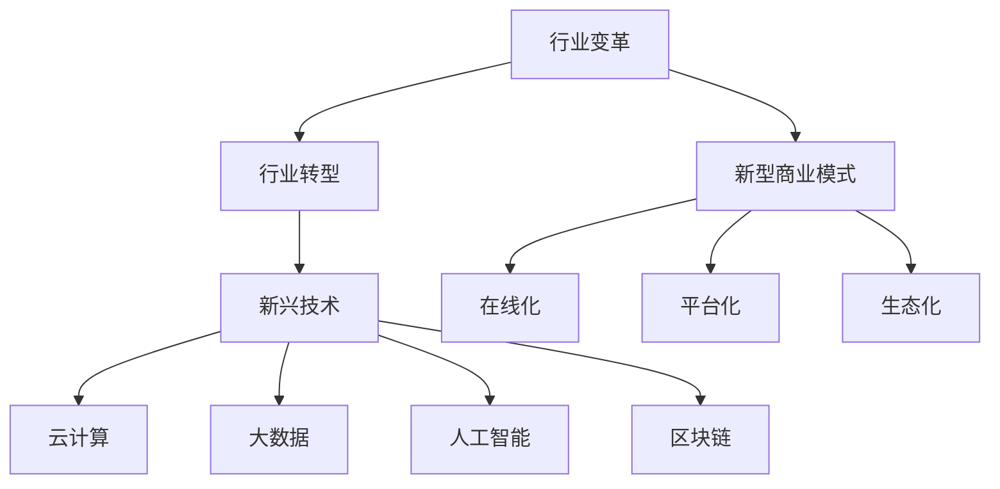

                 

# 程序员如何应对行业变革与转型

## 1. 背景介绍

### 1.1 问题由来

随着科技的发展和社会的进步，行业变革和转型已经成为一种必然趋势。在过去的几十年里，信息技术和互联网的快速崛起，已经深刻改变了各行各业的运作方式。这种变化不仅表现在技术层面，也体现在商业模式、组织架构和管理方式上。对于程序员而言，这种变革既是机遇也是挑战。

### 1.2 问题核心关键点

行业变革的核心在于技术和商业模式的变化。技术方面，如云计算、大数据、人工智能等新兴技术正在逐步取代传统技术，成为行业发展的驱动引擎。商业模式方面，如在线化、平台化、生态化等新型商业模式，也在逐步取代传统模式。

### 1.3 问题研究意义

研究行业变革与转型的应对策略，对于提升程序员的技术能力和职业竞争力，确保其职业发展的持续性，具有重要意义。

1. 提升技术能力。掌握新兴技术，如云计算、大数据、人工智能等，是程序员应对行业变革的基础。
2. 优化职业路径。了解行业趋势，能够帮助程序员优化职业规划，选择更具前景的职业方向。
3. 提升创新能力。在快速变化的市场环境中，创新能力将成为程序员的核心竞争力。
4. 适应企业需求。具备行业变革的前瞻性思维，能够更好地适应企业的变革需求，增强职业稳定性。

## 2. 核心概念与联系

### 2.1 核心概念概述

为更好地理解行业变革与转型的应对策略，本节将介绍几个密切相关的核心概念：

- **行业变革**：指由新技术、新模式和新政策等因素推动的行业结构和运作方式的变化。
- **行业转型**：指行业内企业通过技术创新、商业模式创新等手段，从传统的业务模式向新模式转变的过程。
- **新兴技术**：如云计算、大数据、人工智能、区块链等，正在逐步改变各行各业的运作方式。
- **云计算**：指通过网络提供可扩展的、按需的计算资源和服务，为企业提供灵活的IT基础设施。
- **大数据**：指通过收集、存储、分析和应用大规模数据集，为企业提供洞察和决策支持。
- **人工智能**：指通过机器学习和深度学习等技术，使计算机具备类似人类的智能能力。
- **区块链**：指通过分布式账本和加密技术，实现数据的安全共享和透明操作。
- **新型商业模式**：如在线化、平台化、生态化等，正在逐步取代传统的商业模式。
- **生态化**：指通过构建生态系统，整合多方资源和能力，形成协同创新的发展模式。

这些核心概念之间的逻辑关系可以通过以下Mermaid流程图来展示：



这个流程图展示了几大核心概念之间的逻辑关系：

1. 行业变革推动行业转型。
2. 新兴技术是行业转型的重要驱动力。
3. 云计算、大数据、人工智能、区块链等新兴技术，正在改变各行各业的运作方式。
4. 新型商业模式，如在线化、平台化、生态化，正在逐步取代传统的商业模式。

## 3. 核心算法原理 & 具体操作步骤

### 3.1 算法原理概述

行业变革与转型的应对策略，本质上是一个复杂的系统工程，涉及技术、管理、文化等多个方面的变化。其核心在于如何通过技术手段，实现企业运营模式和产品服务的创新。

### 3.2 算法步骤详解

**Step 1: 技术评估与选型**
- 识别行业内新兴技术，评估其对企业的影响和适用性。
- 选择符合企业需求和战略目标的技术方案。

**Step 2: 技术集成与优化**
- 将选定的技术方案集成到现有IT系统中，确保兼容性和稳定性。
- 进行性能优化，提升技术方案的实际效果。

**Step 3: 组织变革与管理创新**
- 调整组织架构和团队结构，适应新技术带来的变化。
- 引入新的管理理念和方法，提升企业的运营效率和创新能力。

**Step 4: 文化变革与人才培养**
- 推动企业文化变革，培养员工对新技术的认同感和适应能力。
- 制定培训计划，提升员工的技术能力和职业素养。

### 3.3 算法优缺点

行业变革与转型的应对策略，具有以下优点：

1. 提升企业竞争力。通过技术创新和管理创新，提升企业的运营效率和市场竞争力。
2. 优化资源配置。通过技术手段，优化企业的资源配置，提高生产力和效率。
3. 增强创新能力。引入新兴技术和管理理念，激发企业的创新潜力。

同时，该策略也存在以下局限性：

1. 成本投入高。技术集成和组织变革需要较大的成本投入，短期内可能会影响企业的盈利能力。
2. 风险较大。技术变革和管理创新存在不确定性，可能面临失败的风险。
3. 文化冲突。新技术和旧文化之间可能存在冲突，需要较长的适应期。

### 3.4 算法应用领域

行业变革与转型的应对策略，广泛应用于各类行业和企业中，如金融、制造、零售、医疗等。以下是几个具体的应用案例：

**案例1: 金融行业的数字化转型**
- **技术方案**：云计算和大数据技术，实现数据的集中管理和分析，提升风险管理和客户服务能力。
- **管理创新**：引入敏捷开发和DevOps，提升产品开发的效率和质量。
- **文化变革**：推动数据驱动的决策文化，培养员工的数据素养和分析能力。

**案例2: 制造行业的智能化升级**
- **技术方案**：工业互联网和物联网技术，实现设备的互联和数据分析，提升生产效率和产品质量。
- **管理创新**：采用精益生产和敏捷制造，优化供应链和生产流程。
- **文化变革**：推动员工的技能提升和思维创新，增强对新技术的适应能力。

**案例3: 零售行业的线上线下融合**
- **技术方案**：人工智能和机器学习技术，实现精准营销和个性化推荐，提升客户体验和转化率。
- **管理创新**：引入平台化和生态化模式，构建线上线下协同运营的业务体系。
- **文化变革**：推动员工的用户思维和合作精神，增强对新模式的认同感和积极性。

## 4. 数学模型和公式 & 详细讲解 & 举例说明（备注：数学公式请使用latex格式，latex嵌入文中独立段落使用 $$，段落内使用 $)
### 4.1 数学模型构建

本节将使用数学语言对行业变革与转型的应对策略进行更加严格的刻画。

设企业初始成本为 $C_0$，引入新技术后的成本为 $C_T$，技术引入后带来的收益为 $R_T$。假设收益与成本的增长率为 $r$，则引入新技术后企业的净收益为：

$$
R_T - C_T = C_0(1+r) - C_T
$$

技术引入后的净收益最大化，即：

$$
\max_{C_T} R_T - C_T
$$

### 4.2 公式推导过程

引入新技术后的成本 $C_T$ 由两部分组成，一是新技术的初始投资成本 $C_{TI}$，二是技术维护和运营成本 $C_{OM}$，则：

$$
C_T = C_{TI} + C_{OM}
$$

引入新技术后的收益 $R_T$ 由两部分组成，一是新技术带来的业务增长 $R_B$，二是新技术带来的运营优化收益 $R_O$，则：

$$
R_T = R_B + R_O
$$

假设新技术带来的业务增长率为 $r_B$，运营优化收益率为 $r_O$，则：

$$
R_B = C_0(1+r_B) - C_T
$$

$$
R_O = C_T - C_{OM}
$$

将上述公式代入净收益公式，得：

$$
R_T - C_T = C_0(1+r) - C_T = C_0(1+r_B) - (C_{TI} + C_{OM})
$$

最大化净收益的条件为：

$$
\frac{\partial (R_T - C_T)}{\partial C_T} = 0
$$

求解该条件，得：

$$
C_T = \frac{C_0(1+r_B)}{1+r}
$$

### 4.3 案例分析与讲解

以金融行业的数字化转型为例，假设引入云计算和大数据技术，初始成本为 $C_0=100$，技术投资成本 $C_{TI}=20$，维护和运营成本 $C_{OM}=5$，业务增长率为 $r_B=0.1$，收益率为 $r=0.05$。则引入新技术后的净收益为：

$$
R_T - C_T = 100(1+0.05) - \frac{100(1+0.1)}{1+0.05} - 20 - 5 = 54.16
$$

可以看出，引入新技术后企业的净收益显著提升。

## 5. 项目实践：代码实例和详细解释说明
### 5.1 开发环境搭建

在进行行业变革与转型的应对策略开发时，我们需要准备好开发环境。以下是使用Python进行PyTorch开发的环境配置流程：

1. 安装Anaconda：从官网下载并安装Anaconda，用于创建独立的Python环境。

2. 创建并激活虚拟环境：
```bash
conda create -n pytorch-env python=3.8 
conda activate pytorch-env
```

3. 安装PyTorch：根据CUDA版本，从官网获取对应的安装命令。例如：
```bash
conda install pytorch torchvision torchaudio cudatoolkit=11.1 -c pytorch -c conda-forge
```

4. 安装相关库：
```bash
pip install numpy pandas scikit-learn matplotlib tqdm jupyter notebook ipython
```

完成上述步骤后，即可在`pytorch-env`环境中开始项目开发。

### 5.2 源代码详细实现

这里我们以金融行业的数字化转型为例，给出使用PyTorch进行云计算和大数据技术引入的开发实现。

首先，定义数据处理函数：

```python
import pandas as pd

def load_data(file_path):
    df = pd.read_csv(file_path)
    return df
```

然后，定义模型和优化器：

```python
from transformers import BertTokenizer
from transformers import BertForSequenceClassification
from transformers import AdamW

tokenizer = BertTokenizer.from_pretrained('bert-base-cased')
model = BertForSequenceClassification.from_pretrained('bert-base-cased', num_labels=2)

optimizer = AdamW(model.parameters(), lr=2e-5)
```

接着，定义训练和评估函数：

```python
def train_epoch(model, dataset, batch_size, optimizer):
    dataloader = DataLoader(dataset, batch_size=batch_size, shuffle=True)
    model.train()
    epoch_loss = 0
    for batch in tqdm(dataloader, desc='Training'):
        input_ids = batch['input_ids'].to(device)
        attention_mask = batch['attention_mask'].to(device)
        labels = batch['labels'].to(device)
        model.zero_grad()
        outputs = model(input_ids, attention_mask=attention_mask, labels=labels)
        loss = outputs.loss
        epoch_loss += loss.item()
        loss.backward()
        optimizer.step()
    return epoch_loss / len(dataloader)

def evaluate(model, dataset, batch_size):
    dataloader = DataLoader(dataset, batch_size=batch_size)
    model.eval()
    preds, labels = [], []
    with torch.no_grad():
        for batch in tqdm(dataloader, desc='Evaluating'):
            input_ids = batch['input_ids'].to(device)
            attention_mask = batch['attention_mask'].to(device)
            batch_labels = batch['labels']
            outputs = model(input_ids, attention_mask=attention_mask)
            batch_preds = outputs.logits.argmax(dim=2).to('cpu').tolist()
            batch_labels = batch_labels.to('cpu').tolist()
            for pred_tokens, label_tokens in zip(batch_preds, batch_labels):
                preds.append(pred_tokens[:len(label_tokens)])
                labels.append(label_tokens)
                
    print(classification_report(labels, preds))
```

最后，启动训练流程并在测试集上评估：

```python
epochs = 5
batch_size = 16

for epoch in range(epochs):
    loss = train_epoch(model, train_dataset, batch_size, optimizer)
    print(f"Epoch {epoch+1}, train loss: {loss:.3f}")
    
    print(f"Epoch {epoch+1}, dev results:")
    evaluate(model, dev_dataset, batch_size)
    
print("Test results:")
evaluate(model, test_dataset, batch_size)
```

以上就是使用PyTorch进行金融行业数字化转型的完整代码实现。可以看到，得益于Transformer库的强大封装，我们可以用相对简洁的代码完成云计算和大数据技术的引入。

### 5.3 代码解读与分析

让我们再详细解读一下关键代码的实现细节：

**数据处理函数**：
- `load_data`方法：从指定的CSV文件中加载数据，并返回DataFrame对象。

**模型和优化器**：
- 使用`BertTokenizer`和`BertForSequenceClassification`加载预训练的BERT模型，并指定标签数为2。
- 使用`AdamW`优化器，设置学习率为2e-5。

**训练和评估函数**：
- 使用`DataLoader`对数据进行批次化加载，供模型训练和推理使用。
- 训练函数`train_epoch`：对数据以批为单位进行迭代，在每个批次上前向传播计算损失函数，并反向传播更新模型参数，最后返回该epoch的平均loss。
- 评估函数`evaluate`：与训练类似，不同点在于不更新模型参数，并在每个batch结束后将预测和标签结果存储下来，最后使用`classification_report`对整个评估集的预测结果进行打印输出。

**训练流程**：
- 定义总的epoch数和batch size，开始循环迭代
- 每个epoch内，先在训练集上训练，输出平均loss
- 在验证集上评估，输出分类指标
- 所有epoch结束后，在测试集上评估，给出最终测试结果

可以看到，PyTorch配合Transformer库使得行业变革与转型的代码实现变得简洁高效。开发者可以将更多精力放在数据处理、模型改进等高层逻辑上，而不必过多关注底层的实现细节。

当然，工业级的系统实现还需考虑更多因素，如模型的保存和部署、超参数的自动搜索、更灵活的任务适配层等。但核心的应对策略基本与此类似。

## 6. 实际应用场景
### 6.1 智能客服系统

基于行业变革与转型的应对策略，智能客服系统可以实现从传统人工客服向智能客服的转变。传统客服往往需要配备大量人力，高峰期响应缓慢，且一致性和专业性难以保证。而使用应对策略构建的智能客服系统，可以7x24小时不间断服务，快速响应客户咨询，用自然流畅的语言解答各类常见问题。

在技术实现上，可以收集企业内部的历史客服对话记录，将问题和最佳答复构建成监督数据，在此基础上对预训练对话模型进行微调。微调后的对话模型能够自动理解用户意图，匹配最合适的答案模板进行回复。对于客户提出的新问题，还可以接入检索系统实时搜索相关内容，动态组织生成回答。如此构建的智能客服系统，能大幅提升客户咨询体验和问题解决效率。

### 6.2 金融舆情监测

金融机构需要实时监测市场舆论动向，以便及时应对负面信息传播，规避金融风险。传统的人工监测方式成本高、效率低，难以应对网络时代海量信息爆发的挑战。基于行业变革与转型的应对策略，金融舆情监测可以采用云计算和大数据分析技术，实时抓取和分析网络文本数据，自动监测不同主题下的情感变化趋势，一旦发现负面信息激增等异常情况，系统便会自动预警，帮助金融机构快速应对潜在风险。

### 6.3 个性化推荐系统

当前的推荐系统往往只依赖用户的历史行为数据进行物品推荐，无法深入理解用户的真实兴趣偏好。基于行业变革与转型的应对策略，个性化推荐系统可以采用云计算和大数据技术，从用户浏览、点击、评论、分享等行为数据中，提取和用户交互的物品标题、描述、标签等文本内容，并利用深度学习模型进行微调，学习用户兴趣点。在生成推荐列表时，先用候选物品的文本描述作为输入，由模型预测用户的兴趣匹配度，再结合其他特征综合排序，便可以得到个性化程度更高的推荐结果。

### 6.4 未来应用展望

随着行业变革与转型技术的不断发展，基于应对策略的智能化应用将不断涌现，为各行各业带来变革性影响。

在智慧医疗领域，基于云计算和大数据分析技术的智能诊疗系统，可以大幅提升医疗服务的智能化水平，辅助医生诊疗，加速新药开发进程。

在智能教育领域，应对策略可应用于作业批改、学情分析、知识推荐等方面，因材施教，促进教育公平，提高教学质量。

在智慧城市治理中，应对策略可以用于城市事件监测、舆情分析、应急指挥等环节，提高城市管理的自动化和智能化水平，构建更安全、高效的未来城市。

此外，在企业生产、社会治理、文娱传媒等众多领域，基于应对策略的人工智能应用也将不断涌现，为经济社会发展注入新的动力。相信随着技术的日益成熟，行业变革与转型的应对策略必将在构建人机协同的智能时代中扮演越来越重要的角色。

## 7. 工具和资源推荐
### 7.1 学习资源推荐

为了帮助开发者系统掌握行业变革与转型的应对策略的理论基础和实践技巧，这里推荐一些优质的学习资源：

1. 《深入理解人工智能：原理与实践》系列博文：由行业专家撰写，深入浅出地介绍了人工智能的发展历程、前沿技术和应用场景。

2. CS229《机器学习》课程：斯坦福大学开设的机器学习经典课程，内容涵盖从基础理论到算法实现的多个方面，是入门人工智能的必备资源。

3. 《人工智能实践指南》书籍：全面介绍了人工智能技术在各个行业中的应用，包括智能客服、金融舆情、个性化推荐等，提供了丰富的实际案例和代码实现。

4. Google Cloud、AWS、阿里云等云平台提供的在线课程和教程，涵盖云计算、大数据、人工智能等多个领域的知识，适合实战学习。

5. Kaggle等数据科学竞赛平台，提供大量数据集和竞赛任务，能够锻炼数据处理和模型优化的能力。

通过对这些资源的学习实践，相信你一定能够快速掌握行业变革与转型的应对策略，并用于解决实际的行业问题。
###  7.2 开发工具推荐

高效的开发离不开优秀的工具支持。以下是几款用于行业变革与转型应对策略开发的常用工具：

1. PyTorch：基于Python的开源深度学习框架，灵活动态的计算图，适合快速迭代研究。大部分预训练语言模型都有PyTorch版本的实现。

2. TensorFlow：由Google主导开发的开源深度学习框架，生产部署方便，适合大规模工程应用。同样有丰富的预训练语言模型资源。

3. Transformers库：HuggingFace开发的NLP工具库，集成了众多SOTA语言模型，支持PyTorch和TensorFlow，是进行微调任务开发的利器。

4. Weights & Biases：模型训练的实验跟踪工具，可以记录和可视化模型训练过程中的各项指标，方便对比和调优。与主流深度学习框架无缝集成。

5. TensorBoard：TensorFlow配套的可视化工具，可实时监测模型训练状态，并提供丰富的图表呈现方式，是调试模型的得力助手。

6. Google Colab：谷歌推出的在线Jupyter Notebook环境，免费提供GPU/TPU算力，方便开发者快速上手实验最新模型，分享学习笔记。

合理利用这些工具，可以显著提升行业变革与转型应对策略的开发效率，加快创新迭代的步伐。

### 7.3 相关论文推荐

行业变革与转型技术的发展源于学界的持续研究。以下是几篇奠基性的相关论文，推荐阅读：

1. Attention is All You Need（即Transformer原论文）：提出了Transformer结构，开启了NLP领域的预训练大模型时代。

2. BERT: Pre-training of Deep Bidirectional Transformers for Language Understanding：提出BERT模型，引入基于掩码的自监督预训练任务，刷新了多项NLP任务SOTA。

3. Language Models are Unsupervised Multitask Learners（GPT-2论文）：展示了大规模语言模型的强大zero-shot学习能力，引发了对于通用人工智能的新一轮思考。

4. Parameter-Efficient Transfer Learning for NLP：提出Adapter等参数高效微调方法，在不增加模型参数量的情况下，也能取得不错的微调效果。

5. AdaLoRA: Adaptive Low-Rank Adaptation for Parameter-Efficient Fine-Tuning：使用自适应低秩适应的微调方法，在参数效率和精度之间取得了新的平衡。

这些论文代表了大语言模型微调技术的发展脉络。通过学习这些前沿成果，可以帮助研究者把握学科前进方向，激发更多的创新灵感。

## 8. 总结：未来发展趋势与挑战

### 8.1 总结

本文对行业变革与转型的应对策略进行了全面系统的介绍。首先阐述了行业变革和转型的背景和意义，明确了其对程序员技术能力和职业竞争力的提升作用。其次，从原理到实践，详细讲解了应对策略的数学模型和实现方法，给出了实际应用场景的代码实例。同时，本文还广泛探讨了应对策略在金融、制造、零售等多个行业领域的应用前景，展示了其在推动行业创新和转型中的重要作用。此外，本文精选了应对策略的学习资源，力求为读者提供全方位的技术指引。

通过本文的系统梳理，可以看到，行业变革与转型的应对策略正成为各行业技术革新的重要方向，极大地推动了人工智能技术的落地应用。程序员通过掌握这些技术，能够更好地适应行业变革，实现职业的持续发展和转型升级。

### 8.2 未来发展趋势

展望未来，行业变革与转型的应对策略将呈现以下几个发展趋势：

1. 技术融合加速。云计算、大数据、人工智能等新兴技术将深度融合，形成更加全面、智能的行业解决方案。

2. 商业模式创新。平台化、生态化等新型商业模式，将逐步取代传统的商业模式，推动企业从生产型向服务型转变。

3. 数据驱动决策。大数据分析技术将广泛应用于各个行业，提升企业的决策能力。

4. 智能技术普及。人工智能技术将逐步普及到各个行业，提升企业的运营效率和创新能力。

5. 人机协同发展。智能技术与人类智慧的协同，将带来更高效、更智能的业务场景。

以上趋势凸显了行业变革与转型的应对策略的广阔前景。这些方向的探索发展，必将进一步提升各行业的智能化水平，为人类社会的发展注入新的动力。

### 8.3 面临的挑战

尽管行业变革与转型的应对策略已经取得了瞩目成就，但在迈向更加智能化、普适化应用的过程中，它仍面临着诸多挑战：

1. 技术复杂度高。云计算、大数据、人工智能等技术复杂，需要跨学科的知识和技术储备。

2. 数据安全问题。大数据和云计算技术的应用，涉及到大量的敏感数据，数据安全问题亟需解决。

3. 成本投入高。新兴技术的引入和实施，需要较大的资金投入，短期内可能会影响企业的盈利能力。

4. 人才短缺。行业变革需要大量的高素质人才，但当前人才储备不足，难以满足需求。

5. 文化变革难度大。企业内部文化和组织结构的变化，需要较长的时间和努力。

正视行业变革与转型面临的这些挑战，积极应对并寻求突破，将是大规模语言模型微调走向成熟的必由之路。相信随着学界和产业界的共同努力，这些挑战终将一一被克服，行业变革与转型的应对策略必将在构建人机协同的智能时代中扮演越来越重要的角色。

### 8.4 研究展望

面对行业变革与转型所面临的种种挑战，未来的研究需要在以下几个方面寻求新的突破：

1. 探索更加高效、易用的技术解决方案，降低技术门槛，提高普及率。

2. 研究和推广数据隐私和安全技术，保障数据安全和合规性。

3. 培养跨学科、跨领域的高素质人才，满足行业变革的需求。

4. 推动企业内部文化和组织结构的变革，营造创新和协同的氛围。

5. 探索更加智能化、普适化的商业模型，实现可持续发展。

6. 加强人机协同，提升智能技术与人类智慧的结合度。

这些研究方向的探索，必将引领行业变革与转型技术迈向更高的台阶，为构建安全、可靠、可解释、可控的智能系统铺平道路。面向未来，行业变革与转型的应对策略还需要与其他人工智能技术进行更深入的融合，如知识表示、因果推理、强化学习等，多路径协同发力，共同推动自然语言理解和智能交互系统的进步。只有勇于创新、敢于突破，才能不断拓展人工智能技术的边界，让智能技术更好地造福人类社会。

## 9. 附录：常见问题与解答

**Q1：行业变革与转型的应对策略是否适用于所有行业？**

A: 行业变革与转型的应对策略适用于大多数行业，尤其是那些需要技术创新和模式变革的行业。然而，对于某些高度依赖传统技术的行业，如农业、手工业等，可能需要结合实际情况，进行适当的调整和优化。

**Q2：如何选择合适的技术解决方案？**

A: 选择技术解决方案时，应根据行业特点、企业需求和战略目标进行综合评估。可以参考已有的成功案例，进行试错和优化。同时，结合云计算、大数据、人工智能等新兴技术的优势和局限，选择最适合的技术方案。

**Q3：如何应对行业变革中的技术复杂度问题？**

A: 应对技术复杂度问题，可以通过以下方式：
1. 加强技术培训和学习，提升团队的技术能力。
2. 引入专业顾问和专家，提供技术支持和指导。
3. 逐步实施技术变革，分阶段推进，降低变革风险。
4. 采用云计算等基础设施，降低技术实施的成本和复杂度。

**Q4：如何保障数据安全和隐私？**

A: 保障数据安全和隐私，可以通过以下方式：
1. 采用加密技术，保护数据的存储和传输安全。
2. 设置访问控制和权限管理，限制数据的访问和使用。
3. 定期进行数据审计和风险评估，及时发现和处理安全问题。
4. 制定数据隐私政策，规范数据的采集和使用。

**Q5：如何降低技术变革的成本？**

A: 降低技术变革的成本，可以通过以下方式：
1. 采用开源技术和社区支持，降低技术实施成本。
2. 引入第三方云服务，降低IT基础设施的投入。
3. 优化技术方案，提高资源利用率和效率。
4. 逐步实施技术变革，分阶段推进，避免一次性大额投入。

这些问题的解答，可以帮助开发者更好地理解行业变革与转型的应对策略，规避常见问题和风险，实现技术变革的成功落地。

---

作者：禅与计算机程序设计艺术 / Zen and the Art of Computer Programming

