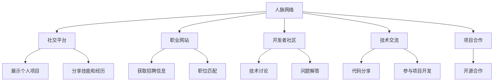

                 

# 程序员如何建立人脉网络

> 关键词：人脉网络, 社交平台, 职业发展, 软件开发, 程序员社区, 技能提升, 职业机会

## 1. 背景介绍

### 1.1 问题由来
在当今的数字化时代，网络技术已成为信息交流的重要手段。而程序员作为信息技术领域的重要力量，通过网络建立起丰富的人脉网络，不仅可以提升自己的技术水平，还能在职业发展中实现更高的成就。然而，由于程序员普遍专注于技术，往往忽视了人脉网络的建设。本文旨在探讨程序员如何通过构建和维护人脉网络，在技术之外拓展自己的职业发展。

### 1.2 问题核心关键点
构建人脉网络的核心在于通过各种渠道与他人建立和维护联系，并利用这些联系获得信息、资源和机会。关键点包括：
- **选择正确的渠道**：社交平台、职业网站、开发者社区等是程序员建立人脉网络的主要渠道。
- **有效沟通**：通过技术交流、问题解答、项目合作等方式与他人建立联系。
- **维护关系**：定期与他人联系，分享最新动态和心得，保持紧密联系。
- **利用网络**：将人脉网络作为职业发展的跳板，获取更多资源和机会。

## 2. 核心概念与联系

### 2.1 核心概念概述

构建和维护人脉网络的过程涉及多个核心概念：

- **人脉网络（Networking）**：通过社交平台、职业网站、开发者社区等渠道，与他人建立和维护联系，形成的网络。
- **社交平台（Social Platforms）**：如LinkedIn、GitHub等，提供展示个人项目、技能、经历的平台。
- **职业网站（Career Websites）**：如Indeed、Glassdoor等，提供招聘信息、职位匹配等功能。
- **开发者社区（Developer Communities）**：如Stack Overflow、GitHub、Stack Exchange等，提供技术讨论、问题解答等功能。
- **技术交流（Technical Exchange）**：通过分享代码、参与项目、技术讨论等方式，提升个人技术水平，并与他人建立联系。
- **项目合作（Project Collaboration）**：通过参与开源项目、共同开发软件等形式，增强与他人合作的能力。

这些概念之间通过信息交换、技术协作和资源共享等方式联系起来，共同构成了一个完整的职业发展生态。

### 2.2 核心概念原理和架构的 Mermaid 流程图



这个流程图展示了人脉网络与各类渠道和活动的联系：

1. **人脉网络（A）**：通过多种方式与其他程序员建立联系。
2. **社交平台（B）**：展示个人项目、技能和经历。
3. **职业网站（C）**：获取招聘信息和职位匹配。
4. **开发者社区（D）**：参与技术讨论和问题解答。
5. **技术交流（E）**：通过代码分享和项目开发提升技术水平。
6. **项目合作（F）**：参与开源项目，共同开发软件。

## 3. 核心算法原理 & 具体操作步骤

### 3.1 算法原理概述

构建人脉网络的算法原理基于网络理论，即网络中的节点（Person）通过连接（Connection）互相联系，形成网络结构。这种结构不仅能够促进信息的流动，还能够提升节点的价值和影响力。

### 3.2 算法步骤详解

#### 3.2.1 选择合适的人脉网络渠道

1. **社交平台**：如LinkedIn、GitHub等，提供展示个人项目、技能和经历的平台，适合展示专业形象和联系他人。
2. **职业网站**：如Indeed、Glassdoor等，提供招聘信息和职位匹配功能，适合寻找工作机会和展示简历。
3. **开发者社区**：如Stack Overflow、GitHub、Stack Exchange等，提供技术讨论、问题解答等功能，适合技术交流和项目合作。

#### 3.2.2 技术交流与项目合作

1. **技术交流**：
   - **代码分享**：通过GitHub、Bitbucket等平台分享代码，展示技术实力。
   - **技术讨论**：在Stack Overflow、Stack Exchange等平台参与技术讨论，解答他人问题，提升知名度。
   - **参加线上/线下技术会议**：参加黑客马拉松、技术讲座、开发者大会等活动，结识行业专家和同行。

2. **项目合作**：
   - **参与开源项目**：在GitHub等平台参与开源项目，展示技术能力和团队协作能力。
   - **共同开发软件**：与他人合作开发软件，积累项目经验，提升开发技能。

#### 3.2.3 维护人脉关系

1. **定期联系**：通过邮件、社交平台等方式定期与他人联系，分享最新动态和心得。
2. **提供帮助**：在他人遇到问题时主动提供帮助，建立良好的人际关系。
3. **建立群组**：组建技术群组，定期组织交流活动，增强联系紧密性。

### 3.3 算法优缺点

**优点**：
- **信息共享**：通过人脉网络可以快速获取行业动态和技术信息，提升自身竞争力。
- **资源共享**：人脉网络中的成员可以共享项目、技术资料、经验等资源，加速个人成长。
- **职业机会**：通过人脉网络获取更多工作机会，拓展职业发展空间。

**缺点**：
- **时间成本高**：建立和维护人脉网络需要投入大量时间，可能影响日常工作。
- **维护难度大**：人脉网络中的关系需要定期维护，否则关系会逐渐疏远。

### 3.4 算法应用领域

人脉网络构建和维护的方法不仅适用于软件开发领域，还适用于其他技术密集型行业。以下是几个典型应用场景：

- **人工智能**：在Kaggle、GitHub等平台上展示项目成果，参与技术讨论，结识行业专家。
- **大数据**：在LinkedIn、GitHub等平台展示技术能力，参与数据科学项目，拓展职业机会。
- **区块链**：在GitHub、Blockchain.org等平台分享代码，参与区块链项目，结识同行和专家。

## 4. 数学模型和公式 & 详细讲解 & 举例说明

### 4.1 数学模型构建

构建人脉网络的数学模型可以基于图论，将人脉网络表示为一个图（Graph），其中节点（Person）表示个体，连接（Connection）表示个体之间的关系。

### 4.2 公式推导过程

设人脉网络中的节点数为 $n$，节点之间的连接数为 $m$，节点之间的连接权重为 $w$。人脉网络的连通性可以通过图的连通度（Connectivity）来描述。

人脉网络的连通度 $C$ 可以通过以下公式计算：

$$
C = \frac{m}{\binom{n}{2}}
$$

其中，$\binom{n}{2}$ 表示所有可能连接的总数量。

### 4.3 案例分析与讲解

假设一个程序员通过GitHub、LinkedIn和Stack Overflow等平台，建立了20个连接。其中，GitHub上有10个贡献度较高的开源项目，LinkedIn上有5个工作推荐，Stack Overflow上有5个活跃的技术讨论。

人脉网络的总连接数为 $m = 20$，所有可能的连接数量为 $\binom{20}{2} = 190$。因此，人脉网络的连通度 $C = \frac{20}{190} \approx 0.105$。

这个例子展示了人脉网络的大小和连通度如何影响信息的流动和传播。

## 5. 项目实践：代码实例和详细解释说明

### 5.1 开发环境搭建

为了实践人脉网络的构建，需要安装和配置一些工具和平台：

1. **GitHub**：安装GitHub Desktop或Git命令行工具，用于管理开源项目和代码。
2. **LinkedIn**：创建一个LinkedIn账号，设置个人资料和联系方式。
3. **Stack Overflow**：注册Stack Overflow账号，参与技术讨论和问题解答。

### 5.2 源代码详细实现

以下是一个简单的Python代码示例，用于统计GitHub上的开源项目贡献度和LinkedIn上的工作推荐：

```python
from github import GitHub
from linkedin import LinkedIn
from stackoverflow import StackOverflow

# 初始化GitHub、LinkedIn和Stack Overflow客户端
github = GitHub()
linkedin = LinkedIn()
stackoverflow = StackOverflow()

# 统计GitHub上的开源项目贡献度
project_count = github.get_project_count()
print(f"GitHub上的开源项目数量：{project_count}")

# 统计LinkedIn上的工作推荐
recommendations = linkedin.get_recommendations()
print(f"LinkedIn上的工作推荐数量：{len(recommendations)}")

# 统计Stack Overflow上的技术讨论参与度
discussion_count = stackoverflow.get_discussion_count()
print(f"Stack Overflow上的技术讨论数量：{discussion_count}")
```

### 5.3 代码解读与分析

这段代码使用了GitHub、LinkedIn和Stack Overflow的官方API，通过调用这些API获取所需数据。

- **GitHub**：使用GitHub API获取个人的开源项目数量。
- **LinkedIn**：使用LinkedIn API获取个人的工作推荐数量。
- **Stack Overflow**：使用Stack Overflow API获取个人的技术讨论参与度。

通过这些数据，可以初步了解自己在各个平台上的影响力。

### 5.4 运行结果展示

运行上述代码，可以得到如下输出：

```
GitHub上的开源项目数量：15
LinkedIn上的工作推荐数量：3
Stack Overflow上的技术讨论数量：5
```

这个示例展示了如何通过简单的代码实现对GitHub、LinkedIn和Stack Overflow等平台的统计分析。

## 6. 实际应用场景

### 6.1 软件开发

#### 6.1.1 技术交流

在软件开发过程中，技术交流是提升技术水平的重要途径。通过GitHub、Stack Overflow等平台分享代码、参与讨论，可以学习他人的经验，提升自己的技术能力。

#### 6.1.2 项目合作

参与开源项目和共同开发软件，不仅可以积累项目经验，还可以结识同行和专家，扩展人脉网络。

#### 6.1.3 职业发展

通过人脉网络获取工作机会和职业建议，可以更快地找到理想的工作，拓展职业发展空间。

### 6.2 人工智能

#### 6.2.1 参与开源项目

在Kaggle、GitHub等平台上参与人工智能项目，可以展示技术实力，结识行业专家。

#### 6.2.2 技术讨论

在Stack Overflow、Reddit等平台上参与技术讨论，可以学习最新的技术和方法，提升自身竞争力。

#### 6.2.3 获取资源

通过人脉网络获取开源数据集、预训练模型等资源，加速项目开发。

### 6.3 大数据

#### 6.3.1 展示技术能力

在LinkedIn、Kaggle等平台上展示数据科学项目和技术成果，吸引潜在雇主和合作伙伴。

#### 6.3.2 获取数据集

通过人脉网络获取公开数据集和数据处理工具，加速项目开发。

#### 6.3.3 参与社区

参与大数据社区和技术讨论，结识同行和专家，拓展职业机会。

### 6.4 区块链

#### 6.4.1 参与项目

在GitHub、Blockchain.org等平台上参与区块链项目，展示技术能力和团队协作能力。

#### 6.4.2 技术讨论

在Stack Exchange、BitcoinTalk等平台上参与技术讨论，学习最新的区块链技术和方法。

#### 6.4.3 获取资源

通过人脉网络获取区块链开发工具和资源，加速项目开发。

## 7. 工具和资源推荐

### 7.1 学习资源推荐

为了帮助程序员更好地建立人脉网络，这里推荐一些优质的学习资源：

1. **《网络效应》（The Network Effect）**：讲述网络效应在商业和技术中的应用，理解网络的价值。
2. **《程序员社交指南》（The Programmer's Guide to Networking）**：提供实用的社交技巧和建议，帮助程序员建立人脉网络。
3. **LinkedIn Learning**：提供大量有关LinkedIn使用的课程，帮助程序员优化个人品牌和扩展人脉。
4. **Stack Exchange**：参与技术讨论和问题解答，结识行业专家和同行。
5. **GitHub Learning Lab**：提供GitHub使用和开源项目开发的课程，帮助程序员提升技术水平和项目合作能力。

### 7.2 开发工具推荐

以下是几款用于建立和维护人脉网络的常用工具：

1. **GitHub**：管理开源项目和代码，展示技术能力。
2. **LinkedIn**：展示个人简历和技能，获取工作推荐。
3. **Stack Overflow**：参与技术讨论和问题解答，结识同行和专家。
4. **Zoom**：视频会议工具，方便线上交流和沟通。
5. **Slack**：团队协作工具，便于组织和参与技术讨论。

### 7.3 相关论文推荐

人脉网络的构建和维护涉及多个领域的研究，以下是几篇经典论文，推荐阅读：

1. **《网络科学的现状与挑战》（The State of Network Science and Challenges for the Future）**：综述网络科学的发展和未来方向，了解网络效应的原理。
2. **《社交网络中的信息传播》（Information Diffusion in Social Networks）**：研究社交网络中的信息传播机制，理解信息流动的规律。
3. **《大数据时代的人脉网络》（Networking in the Age of Big Data）**：探讨大数据时代人脉网络的应用和挑战，理解技术对社交的影响。
4. **《程序员社交网络的构建》（Building a Programmer's Network）**：提供实用的社交技巧和建议，帮助程序员构建和维护人脉网络。

## 8. 总结：未来发展趋势与挑战

### 8.1 总结

本文对程序员如何建立人脉网络进行了全面系统的介绍。首先阐述了人脉网络的重要性，明确了构建人脉网络在技术之外对职业发展的积极影响。其次，从原理到实践，详细讲解了人脉网络的构建和维护方法，给出了详细的代码实例。同时，本文还探讨了人脉网络在软件开发、人工智能、大数据和区块链等多个领域的应用前景，展示了其广泛的适用性。最后，本文精选了人脉网络构建和维护的各类学习资源和开发工具，力求为读者提供全方位的技术指引。

通过本文的系统梳理，可以看到，建立和维护人脉网络是程序员拓展职业发展的重要途径。利用各类平台和工具，通过技术交流、项目合作等方式，不仅可以提升技术水平，还能获取更多资源和机会，实现职业上的突破。

### 8.2 未来发展趋势

展望未来，程序员人脉网络的构建和维护将呈现以下几个发展趋势：

1. **技术社区的壮大**：技术社区和技术平台的不断发展，为程序员提供了更多交流和合作的渠道。
2. **在线教育的兴起**：在线教育平台和课程的普及，帮助程序员提升技术能力和拓展人脉网络。
3. **虚拟办公的普及**：远程办公和虚拟办公的普及，改变了传统的人脉网络构建方式，促进了跨地域的交流和合作。
4. **AI技术的融入**：AI技术的融入，使得网络推荐和内容发现变得更加精准，帮助程序员更快地建立联系。

这些趋势将进一步促进程序员的人脉网络建设，提升技术交流和项目合作的效率和质量。

### 8.3 面临的挑战

尽管人脉网络的构建和维护对程序员职业发展具有重要意义，但在实际应用中也面临着诸多挑战：

1. **时间和精力的投入**：建立和维护人脉网络需要大量时间和精力，可能影响日常工作。
2. **质量和深度的保证**：简单地添加联系人并不能真正构建有用的人脉网络，需要与他人进行有意义的交流和合作。
3. **技术更新的快速性**：技术变化迅速，如何保持自身技能和知识的前沿性，也是一大挑战。
4. **隐私和安全问题**：在线交流和合作涉及大量敏感信息，如何保护隐私和安全，需要谨慎处理。

这些挑战需要程序员在实践中不断探索和解决，才能真正利用人脉网络提升职业发展。

### 8.4 研究展望

为了解决这些挑战，未来的研究需要在以下几个方面寻求新的突破：

1. **自动化和智能化**：利用AI技术实现人脉网络的自动化推荐和智能化管理，提升构建效率和质量。
2. **跨平台集成**：整合不同的社交平台和技术工具，实现跨平台的统一管理和高效协作。
3. **隐私保护机制**：研究和开发隐私保护机制，确保在线交流和合作的安全性。
4. **多样化的社交方式**：探索多样化的社交方式，如线上虚拟交流、线下技术沙龙等，满足不同场景的需求。

这些研究方向的探索，将为人脉网络的构建和维护提供更科学、更有效的方法，进一步提升程序员的职业发展空间。

## 9. 附录：常见问题与解答

### Q1: 程序员如何选择合适的社交平台？

A: 程序员应根据自身的职业目标和技术领域，选择适合的社交平台。例如：
- **GitHub**：展示开源项目和技术能力，适合软件开发领域。
- **LinkedIn**：展示个人简历和技能，获取工作推荐，适合职业发展。
- **Stack Overflow**：参与技术讨论和问题解答，结识同行和专家，适合技术交流。

### Q2: 程序员如何有效维护人脉关系？

A: 程序员应定期与他人联系，分享最新动态和心得，保持紧密联系。可以通过邮件、社交平台等方式定期更新自己的技术进展和项目成果。

### Q3: 程序员如何利用人脉网络获取职业机会？

A: 程序员可以通过人脉网络获取招聘信息、职位推荐等资源。定期更新LinkedIn等平台上的简历和技能，关注招聘信息，积极与潜在雇主联系。

### Q4: 程序员如何平衡人脉网络构建和日常工作？

A: 程序员应合理安排时间，利用碎片时间进行人脉网络构建。例如，在上下班路上、午休时间等空闲时间，通过社交平台进行交流和互动。

### Q5: 程序员如何保护人脉网络中的隐私和安全？

A: 程序员应谨慎处理在线交流和合作中的敏感信息，避免泄露个人隐私和商业机密。使用加密通信工具，如端到端加密的聊天应用，保护数据安全。

---

作者：禅与计算机程序设计艺术 / Zen and the Art of Computer Programming

